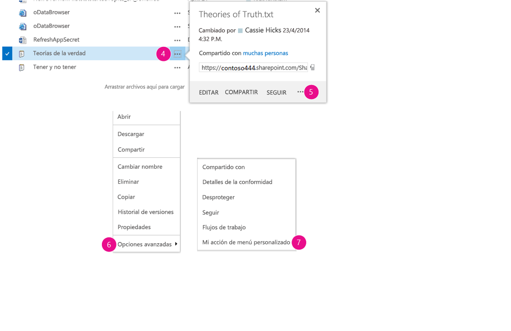
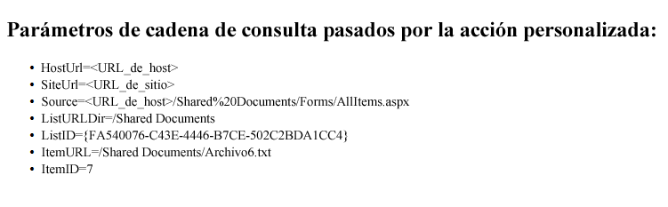
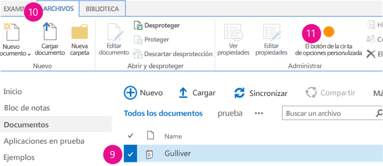

# Crear acciones personalizadas para implementarlas con complementos de SharePoint
Aprenda a crear una acción personalizada en SharePoint que se implementa en la web de host cuando implementa un Complemento de SharePoint.
Cuando cree un Complemento de SharePoint, las acciones personalizadas le permitirán interactuar con las listas y la cinta en la web de host. Una acción personalizada se implementa en la web de host cuando los usuarios finales instalan el complemento. Las acciones personalizadas pueden abrir una página web remota y pasar información a través de la cadena de consulta. Hay dos tipos de acciones personalizadas disponibles para los complementos: las de Cinta y las deElemento de menú.
  
    
    


## Requisitos previos para usar los ejemplos de este artículo
<a name="SP15Createcustomactionsapps_Prereq"> </a>

Necesita un entorno de desarrollo, tal y como se explica en  [Empezar a crear complementos hospedados en proveedor para SharePoint](get-started-creating-provider-hosted-sharepoint-add-ins.md).
  
    
    

### Conceptos fundamentales que le ayudarán a entender las acciones personalizadas

La siguiente tabla muestra una lista de artículos útiles para ayudarle a entender los conceptos y los pasos necesarios en un escenario de acciones personalizadas.
  
    
    

**Tabla 1. Conceptos básicos para acciones personalizadas**


|**Artículo**|**Descripción**|
|:-----|:-----|
| [Complementos de SharePoint](sharepoint-add-ins.md) <br/> |Aprenda sobre el nuevo modelo de complementos en SharePoint que le permite crear complementos o soluciones pequeñas y fáciles de usar para usuarios finales.  <br/> |
| [Diseño de la experiencia de usuario para aplicaciones en SharePoint 2013](ux-design-for-sharepoint-add-ins.md) <br/> |Aprenda sobre las opciones de experiencia de usuario (UX) disponibles cuando cree Complementos de SharePoint.  <br/> |
| [Hospedar webs, webs de complementos y componentes de SharePoint en SharePoint 2013](host-webs-add-in-webs-and-sharepoint-components-in-sharepoint-2013.md) <br/> |Aprenda cuál es la diferencia entre una web de host y una web de complemento. Descubra qué componentes de SharePoint se pueden incluir en un Complemento de SharePoint, qué componentes se implementan en la web de host y cuáles en la web de complemento, y cómo se implementa la web de complemento en un dominio aislado.  <br/> |
   

## Ejemplo de código: Crear una acción personalizada en las bibliotecas de documentos de la web de host
<a name="SP15Createcustomactionsapps_Codeexample"> </a>

Siga estos pasos para crear una acción personalizada en las bibliotecas de documentos de la web de host:
  
    
    

1. Crear la Complemento de SharePoint y los proyectos de web remota.
    
  
2. Agregar una característica de acción personalizada al proyecto de Complemento de SharePoint.
    
  
3. Agregar una página web de complemento al proyecto web.
    
  

### Para crear la Complemento de SharePoint y los proyectos de web remota.


1. Abra Visual Studio como administrador. (Para ello, haga clic con el botón secundario en el icono Visual Studio del menú **Inicio** y elija **Ejecutar como administrador**.)
    
  
2. Cree el Complemento de SharePoint hospedado en el proveedor, tal y como se explica en  [Empezar a crear complementos hospedados en proveedor para SharePoint](get-started-creating-provider-hosted-sharepoint-add-ins.md), y dele el nombre CustomActionsApp. 
    
  

### Para agregar una página web de complemento para las acciones personalizadas


1. Una vez creada la solución Visual Studio, haga clic con el botón secundario en el proyecto de aplicación web (no en el proyecto Complemento de SharePoint) y agregue un nuevo formulario web seleccionando **Agregar** > **Nuevo elemento** > **Web** > **Formulario web**. Denomine el formulario CustomActionTarget.aspx.
    
  
2. En el archivo CustomActionTarget.aspx, sustituya todo el elemento **html** y sus elementos secundarios por el siguiente código HTML. Deje todo el código de marcado encima del elemento **html** tal y como está. El código HTML contiene JavaScript que realiza las siguientes tareas:
    
  - Proporciona un marcador de posición para los parámetros de la cadena de consulta.
    
  
  - Extrae los parámetros de la cadena de consulta.
    
  
  - Representa los parámetros en el marcador de posición.
    
  

    > **IMPORTANTE**
      > Los tokens ItemURL y ItemID solo se pasan cuando hay un elemento seleccionado. En una Complemento de SharePoint con calidad de producción, el código debe manejar situaciones en que no haya elementos seleccionados. En este ejemplo, el código alerta al usuario de que no se ha seleccionado ningún elemento. 

 ```HTML
  
<html xmlns="http://www.w3.org/1999/xhtml">
<head>
    <title>Custom action target</title>
</head>
<body>
    <h2>Query string parameters passed by the custom action:</h2>

    <!-- Placeholder for query string parameters -->
    <ul id="qsparams"/>

    <!-- Main JavaScript function, renders
         the query string parameters -->
    <script lang="javascript">
        var params = document.URL.split("?")[1].split("&amp;");
        var paramsHTML = "";
      
        // Extracts the parameters from the query string.
        // Parameters are URLencoded, decode for rendering
        // in page.
        for (var i = 0; i < params.length; i = i + 1) {
            params[i] = decodeURIComponent(params[i]);
            paramsHTML += "<li>" + params[i] + "</li>";
        }

         // Alert the user when no item has been selected.
         // (The SPListItemId is the 5th parameter.)
         if (params[5] === undefined) {
            paramsHTML += "<div> <h3> No item has been selected from the list.  Please select an item. </h3> </div> ";
         }

        // Render parameters in the placeholder.
        document.getElementById("qsparams").innerHTML =
            paramsHTML;
    </script>
</body>
</html>
 ```


### Para agregar una acción personalizada de elemento de menú al proyecto Complemento de SharePoint


1. Haga clic con el botón secundario en el proyecto Complemento de SharePoint y elija **Agregar** > **Nuevo elemento** > **Office/SharePoint** > **Acción personalizada de elemento de menú**. 
    
  
2. Conserve el nombre predeterminado y elija **Agregar**.
    
  
3. El asistente **Crear acción personalizada para elemento de menú**le hace una serie de preguntas. Dé las respuestas de la siguiente tabla:
    
   **Tabla 2. Propiedades de la acción personalizada de elemento de menú**


|**Pregunta de propiedad**|**Respuesta**|
|:-----|:-----|
|¿Dónde desea exponer la acción personalizada?  <br/> |Elija **Web de host**.  <br/> |
|¿Qué ámbito tiene la acción personalizada?  <br/> |Elija **Plantilla de listas**.  <br/> |
|¿Qué elemento específico tiene como ámbito la acción personalizada?  <br/> |Elija **Biblioteca de documentos**.  <br/> |
|¿Cuál es el texto del elemento de menú?  <br/> |Escriba **Mi acción personalizada**.  <br/> |
|¿A dónde navega la acción personalizada?  <br/> |Elija la página **CustomActionAppWeb\\CustomActionTarget.aspx**.  <br/> |
   
4. Elija **Finalizar**.
    
    Visual Studio genera el siguiente marcado en el archivo elements.xml de la característica de la acción personalizada de elemento de menú:
    


 ```XML
  
<?xml version="1.0" encoding="utf-8"?>
<Elements 
    xmlns="http://schemas.microsoft.com/sharepoint/">
    <!-- RegistrationId attribute is the list type id,
        in this case, a document library (id=101). -->
  <CustomAction 
      Id="65695319-4784-478e-8dcd-4e541cb1d682.CustomAction"
      RegistrationType="List"
      RegistrationId="101"
      Location="EditControlBlock"
      Sequence="10001"
      Title="Invoke custom action">
    <!-- 
    Update the Url below to the page you want the custom action to use.
    Start the URL with the token ~remoteAppUrl if the page is in the
    associated web project, use ~appWebUrl if page is in the add-in project.
    -->
    <UrlAction Url=
"~remoteAppUrl/CustomActionTarget.aspx?{StandardTokens}&amp;amp;SPListItemId={ItemId}&amp;amp;SPListId={ListId}" />
  </CustomAction>
</Elements>

 ```

5. Agregue los siguientes parámetros de consulta al final del atributo **Url** del elemento **UrlAction**: 
    
     `&amp;amp;SPSource={Source}&amp;amp;SPListURLDir={ListUrlDir}&amp;amp;SPItemURL={ItemUrl}`
    
    El elemento **UrlAction** debería tener este aspecto:
    
     ` <UrlAction Url= "~remoteAppUrl/CustomActionTarget.aspx?{StandardTokens}&amp;amp;SPListItemId={ItemId}&amp;amp;SPListId={ListId}&amp;amp;SPSource={Source}&amp;amp;SPListURLDir={ListUrlDir}&amp;amp;SPItemURL={ItemUrl}" />`
    
  

> **NOTA**
> En este ejemplo, la página web remota abre una ventana completa cuando el usuario selecciona la acción personalizada en el menú. Las acciones de menú personalizadas también pueden abrir una página web remota en un cuadro de diálogo usando el atributo **HostWebDialog**. Para obtener más información, vea  [Localización de complementos de SharePoint](https://github.com/OfficeDev/SharePoint-Add-in-Localization). 
  
    
    


### Para agregar una acción personalizada de la cinta al proyecto Complemento de SharePoint


1. Haga clic con el botón secundario en el proyecto Complemento de SharePoint y elija **Agregar** > **Nuevo elemento** > **Office/SharePoint** > **Acción personalizada de la cinta**. 
    
  
2. Conserve el nombre predeterminado y elija **Agregar**.
    
  
3. El asistente **Crear acción personalizada de la cinta** le hace una serie de preguntas. Dé las repuestas de la siguiente tabla:
    
   **Tabla 3. Propiedades de acción personalizada de cinta**


|**Pregunta de propiedad**|**Respuesta**|
|:-----|:-----|
|¿Dónde desea exponer la acción personalizada?  <br/> |Elija **Web de host**.  <br/> |
|¿Qué ámbito tiene la acción personalizada?  <br/> |Elija **Plantilla de listas**.  <br/> |
|¿Qué elemento específico tiene como ámbito la acción personalizada?  <br/> |Elija **Biblioteca de documentos**.  <br/> |
|¿Dónde se encuentra el control?  <br/> |Elija **Cinta.Documentos.Administrar**.  <br/> |
|¿Cuál es el texto del elemento de menú?  <br/> |Escriba **Mi botón de la cinta personalizado**.  <br/> |
|¿A dónde navega la acción personalizada?  <br/> |Elija la página **CustomActionAppWeb\\CustomActionTarget.aspx**.  <br/> |
   
4. Visual Studio genera el siguiente marcado en el archivo elements.xml de la característica de la acción personalizada de cinta:
    
 ```XML
  
<?xml version="1.0" encoding="utf-8"?>
<Elements xmlns="http://schemas.microsoft.com/sharepoint/">
  <CustomAction Id="85691508-c076-4f43-93d4-96b4d5253a09.RibbonCustomAction1"
                RegistrationType="List"
                RegistrationId="101"
                Location="CommandUI.Ribbon"
                Sequence="10001"
                Title="Invoke &amp;apos;RibbonCustomAction1&amp;apos; action">
    <CommandUIExtension>
      <!-- 
      Update the UI definitions below with the controls and the command actions
      that you want to enable for the custom action.
      -->
      <CommandUIDefinitions>
        <CommandUIDefinition Location="Ribbon.Documents.Manage.Controls._children">
          <Button Id="Ribbon.Documents.Manage.RibbonCustomAction1Button"
                  Alt="My Custom Ribbon Button"
                  Sequence="100"
                  Command="Invoke_RibbonCustomAction1ButtonRequest"
                  LabelText="My Custom Ribbon Button"
                  TemplateAlias="o1"
                  Image32by32="_layouts/15/images/placeholder32x32.png"
                  Image16by16="_layouts/15/images/placeholder16x16.png" />
        </CommandUIDefinition>
      </CommandUIDefinitions>
      <CommandUIHandlers>
        <CommandUIHandler Command="Invoke_RibbonCustomAction1ButtonRequest"
                          CommandAction="~remoteAppUrl/CustomActionTarget.aspx?{StandardTokens}&amp;amp;SPListItemId={SelectedItemId}&amp;amp;SPListId={SelectedListId}"/>
      </CommandUIHandlers>
    </CommandUIExtension >
  </CustomAction>
</Elements> 

 ```

5. Agregue los siguientes parámetros de consulta al final del atributo **CommandAction** del elemento **CommandUIHandler**: 
    
     `&amp;amp;SPSource={Source}&amp;amp;SPListURLDir={ListUrlDir}`
    
    El elemento **CommandUIHandler** debería tener este aspecto:
    
     ` <CommandUIHandler Command="Invoke_RibbonCustomAction1ButtonRequest" CommandAction="~remoteAppUrl/CustomActionTarget.aspx?{StandardTokens}&amp;amp;SPListItemId={SelectedItemId}&amp;amp;SPListId={SelectedListId}&amp;amp;SPSource={Source}&amp;amp;SPListURLDir={ListUrlDir}" />`
    
    > **NOTA**
      > Las acciones personalizadas de la cinta usan **SelectedListId** y **SelectedItemId**. **ListId** y **ItemId** funcionan solo con acciones personalizadas de elemento de menú.

### Establecer la página de inicio de la web de host como página de inicio del complemento


1. El Complemento de SharePoint de ejemplo continuado no tiene ninguna web de complemento y su aplicación web remota existe solo para hospedar el formulario. Por tanto, la página de inicio del complemento debería configurarse como la página de inicio de la web de host. 
    
    Para empezar, seleccione el proyecto Complemento de SharePoint (no el proyecto de aplicación web) en el **Explorador de soluciones** y copie en el portapapeles el valor de la propiedad **Dirección URL del sitio**, incluido el protocolo (por ejemplo, **https://contoso.sharepoint.com**). 
    
  
2. Abra el manifiesto del complemento y pegue la dirección URL en el cuadro **Página de inicio**.
    
  
3. Si lo desea, puede eliminar la página Default.aspx del proyecto de aplicación web, ya que no se usa en la Complemento de SharePoint.
    
  

### Para crear y ejecutar la solución


1. Presione la tecla F5.
    
    > **NOTA**
      > Al presionar F5, Visual Studio crea la solución, implementa el complemento y abre la página de permisos para el complemento. 
2. Elija el botón **Confiar**. Se abre la página predeterminada del sitio del desarrollador.
    
  
3. Vaya a cualquier biblioteca de documentos en la web de host.
    
   **Iniciar una acción de menú personalizada**

  

     
  

  

  
4. Elija el botón de llamada ( **...**) para cualquier documento. La llamada se abre.
    
  
5. Elija el botón de llamada ( **...**) en la llamada. 
    
  
6. Elija **Avanzado**.
    
  
7. Elija **Mi acción de menú personalizada** en el menú contextual. Debería ver algo así en la página web remota que se abre:
    
   **Página web remota con los parámetros de la acción personalizada**

  

     
  

  

  
8. Haga clic en el botón **Atrás** del explorador para volver a la biblioteca.
    
   **Iniciar una acción de cinta personalizada**

  

     
  

  

  
9. Elija cualquier documento.
    
  
10. Abra la pestaña **Archivo** de la cinta.
    
  
11. Elija **Mi botón de la cinta personalizado**. Verá la misma página web remota.
    
  

**Tabla 4. Solución de problemas de la solución**


|**Problema**|**Solución**|
|:-----|:-----|
|Visual Studio no abre el explorador después de presionar la tecla F5.  <br/> |Establezca el proyecto Complemento de SharePoint como el proyecto de inicio.  <br/> |
|Los tokens de la URL no se resuelven después de presionar la tecla F5 en Visual Studio.  <br/> |Vaya a la página **Contenido del sitio** en la web de host y haga clic en el icono de su complemento. <br/> |
   

## Pasos siguientes
<a name="SP15Createcustomactionsapps_Nextsteps"> </a>

En este artículo se demostró cómo crear una acción personalizada en un Complemento de SharePoint. A continuación, puede aprender sobre otros componentes de UX disponibles para los Complementos de SharePoint. Para obtener más información, vea lo siguiente:
  
    
    

-  [Ejemplo de código: Abrir una página web de complemento remoto con una acción personalizada de ECB](http://code.msdn.microsoft.com/SharePoint-2013-Open-e0ca1826)
    
  
-  [Localización de complementos de SharePoint](https://github.com/OfficeDev/SharePoint-Add-in-Localization)
    
  
-  [Ejemplo de código: Usar acciones personalizadas y la biblioteca entre dominios para solicitar libros](http://code.msdn.microsoft.com/SharePoint-2013-Open-a-36d1598d)
    
  
-  [Usar una hoja de estilos del sitio web de SharePoint en complementos de SharePoint](use-a-sharepoint-website-s-style-sheet-in-sharepoint-add-ins.md)
    
  
-  [Usar el control cromo de cliente en complementos de SharePoint](use-the-client-chrome-control-in-sharepoint-add-ins.md)
    
  
-  [Crear elementos del complemento para instalar con el complemento para SharePoint](create-add-in-parts-to-install-with-your-sharepoint-add-in.md)
    
  

## Recursos adicionales
<a name="SP15Createcustomactionsapps_AddResources"> </a>


-  [Configurar un entorno de desarrollo en el nivel local para complementos para SharePoint](set-up-an-on-premises-development-environment-for-sharepoint-add-ins.md)
    
  
-  [Diseño de la experiencia de usuario para aplicaciones en SharePoint 2013](ux-design-for-sharepoint-add-ins.md)
    
  
-  [Directrices de diseño de los complementos para la experiencia de usuario de SharePoint](sharepoint-add-ins-ux-design-guidelines.md)
    
  
-  [Crear componentes de experiencia de usuario en SharePoint 2013](create-ux-components-in-sharepoint-2013.md)
    
  
-  [Tres formas de concebir las opciones de diseño de complementos para SharePoint](three-ways-to-think-about-design-options-for-sharepoint-add-ins.md)
    
  
-  [Aspectos importantes del panorama de desarrollo y arquitectura de los complementos para SharePoint](important-aspects-of-the-sharepoint-add-in-architecture-and-development-landscap.md)
    
  

