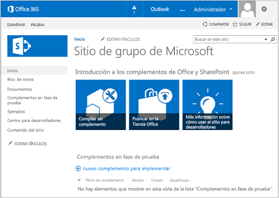

# Empezar a crear complementos hospedados en SharePoint para SharePoint
Configurar un entorno de implementación y crear su primera Complemento de SharePoint hospedada en SharePoint.
Los complementos hospedados en SharePoint son uno de los dos tipos principales de Complementos de SharePoint. Para ver una introducción a Complementos de SharePoint y los dos tipos diferentes, consulte  [Complementos de SharePoint](sharepoint-add-ins.md). A continuación, se presenta el resumen de complementos hospedados en SharePoint:
  
    
    


- Contienen listas de SharePoint, elementos web, flujos de trabajo, páginas personalizadas y otros componentes, todos los cuales se instalan en una subred, denominada web de complemento, del sitio web de SharePoint donde está instalado el complemento.
    
  
- El único código que tienen es JavaScript en páginas de SharePoint personalizadas.
    
  

 [
  
    
    
](get-started-creating-sharepoint-hosted-sharepoint-add-ins.md#Setup) [
  
    
    
](get-started-creating-sharepoint-hosted-sharepoint-add-ins.md#Create) [
  
    
    
](get-started-creating-sharepoint-hosted-sharepoint-add-ins.md#Code)
  
    
    


## Configurar el entorno de desarrollo
<a name="Setup"> </a>

Hay muchas maneras de configurar un entorno de desarrollo para Complementos de SharePoint. En esta sección se explica la forma más sencilla. Para conocer alternativas, consulte  [Recursos adicionales](#bk_addresources).
  
    
    

### Obtener las herramientas


- Si todavía no tiene instalado **Visual Studio** 2013 o superior, instálelo con las instrucciones de [Install Visual Studio](http://msdn.microsoft.com/library/da049020-cfda-40d7-8ff4-7492772b620f.aspx). Se recomienda usar la  [versión más reciente del Centro de descarga de Microsoft](https://www.visualstudio.com/downloads/download-visual-studio-vs).
    
  
- Visual Studio incluye **Microsoft Office Developer Tools para Visual Studio**. A veces se publica una versión de las herramientas entre actualizaciones de Visual Studio. Para asegurarse de que tiene la versión más reciente de las herramientas, ejecute el [programa de instalación de Office Developer Tools para Visual Studio 2013](http://aka.ms/OfficeDevToolsForVS2013), o el  [programa de instalación de Office Developer Tools para Visual Studio 2015](http://aka.ms/OfficeDevToolsForVS2015).
    
  

### Registrarse en un Sitio para desarrolladores de Office 365
<a name="o365_signup"> </a>


> **NOTA**
>  Podría ya tener acceso a un Sitio para desarrolladores de Office 365.> **¿Es suscriptor de MSDN?** Los suscriptores de Visual Studio Ultimate y Visual Studio Premium con MSDN reciben una suscripción de desarrollador a Office 365 como ventaja adicional. [Solicítela hoy.](https://msdn.microsoft.com/subscriptions/manage/default.aspx)> **¿Tiene uno de los siguientes planes de suscripción a Office 365?**> **En caso afirmativo, un administrador de la suscripción a Office 365 puede crear un Sitio para desarrolladores** con el [centro de administración de Office 365](https://portal.microsoftonline.com/admin/default.aspx). Para obtener más información, consulte  [Crear un sitio para desarrolladores en una suscripción existente de Office 365](create-a-developer-site-on-an-existing-office-365-subscription.md). 
  
    
    

Existen tres maneras de obtener un plan de Office 365.
  
    
    

- Registrarse para obtener una cuenta de Office 365 de un año gratuita a través del programa de desarrolladores de Office 365.  [Obtenga más información](http://dev.office.com/devprogram) o diríjase al [formulario de registro](https://profile.microsoft.com/RegSysProfileCenter/wizardnp.aspx?wizid=14b845d0-938c-45af-b061-f798fbb4d170). Recibirá un correo electrónico después del registro en el programa de desarrolladores con un vínculo para registrar la cuenta de desarrollador. Use las siguientes instrucciones.
    
  
- Comience con una  [prueba gratuita de 30 días](https://portal.microsoftonline.com/Signup/MainSignUp.aspx?OfferId=6881A1CB-F4EB-4db3-9F18-388898DAF510&amp;DL=DEVELOPERPACK) con una licencia de usuario.
    
  
- Compre una  [suscripción de desarrollador a Office 365](https://portal.microsoftonline.com/Signup/MainSignUp.aspx?OfferId=C69E7747-2566-4897-8CBA-B998ED3BAB88&amp;DL=DEVELOPERPACK).
    
  

> **SUGERENCIA**
> Abra estos vínculos en otra ventana o pestaña para tener las siguientes instrucciones a mano. 
  
    
    


**Figura 1. Nombre de dominio del sitio para desarrolladores de Office 365**

  
    
    

  
    
    

  
    
    

  
    
    

  
    
    

1. La primera página (no se muestra) del formulario de registro se explica por sí misma. Proporcione la información solicitada y luego elija **Siguiente**.
    
  
2. En la segunda página, que se muestra en la figura 1, especifique un identificador de usuario para el administrador de la suscripción.
    
  
3. Cree un subdominio de **.onmicrosoft.com**. Por ejemplo, contoso.onmicrosoft.com.
    
    Después del registro, usted usa las credenciales resultantes (en el formato  _IdUsuario_@ _subdominio_.onmicrosoft.com) para iniciar sesión en el sitio del portal de Office 365, donde administra la cuenta. Su sitio para desarrolladores de SharePoint Online se configura en su dominio: **http:// _subdominio_.sharepoint.com**.
    
  
4. Elija **Siguiente** y rellene la última página del formulario. Si decide proporcionar un número de teléfono para obtener un código de confirmación, puede proporcionar un número móvil o fijo, pero *no*  un número de VoIP (Protocolo de voz sobre Internet).
    
  

    
> **NOTA**
> Si tiene iniciada una sesión con otra cuenta de Microsoft cuando intente registrar una cuenta de desarrollador, es posible que vea este mensaje: "El id. de usuario que especificó no funcionó. Parece que no es válido. Asegúrese de especificar el id. de usuario que su organización le asignó. El id. de usuario suele ser como  *alguien@ejemplo.com*  o *alguien@ejemplo.onmicrosoft.com*  ."> Si ve este mensaje, cierre la sesión de la cuenta de Microsoft que estaba usando y vuelva a intentarlo. Si sigue viendo el mensaje, borre la memoria caché del explorador o cambie a **Exploración de InPrivate** y rellene el formulario.
  
    
    

Tras finalizar el proceso de registro, el explorador abre la página de instalación de Office 365. Elija el icono de administrador para abrir la página del centro de administración.
  
    
    

**Figura 2. Página del centro de administración de Office 365**

  
    
    

  
    
    

  
    
    

  
    
    

1. Espere a que su Sitio para desarrolladores finalice la configuración. Una vez completado el aprovisionamiento, actualice la página del centro de administración de en su explorador.
    
  
2. A continuación, haga clic en el vínculo **Crear complementos** de la esquina superior izquierda de la página para abrir su Sitio para desarrolladores. Debería aparecer un sitio como el que se muestra en la figura 3. La lista **Complementos en fase de prueba** de la página confirma que el sitio web se creó con la plantilla de sitio para desarrolladores de SharePoint. Si, en vez de ello, ve un sitio de equipo, espere unos minutos y reinicie su sitio.
    
  
3. Tome nota de la dirección URL del sitio. Se usa al crear proyectos de Complementos de SharePoint en Visual Studio.
    
  

**Figura 3. La página de inicio de su sitio para desarrolladores con la lista Complementos en fase de prueba**

  
    
    

  
    
    

  
    
    

  
    
    

  
    
    

## Crear el proyecto de complemento
<a name="Create"> </a>


1. Inicie Visual Studio con la opción **Ejecutar como administrador**.
    
  
2. Elija **Archivo** > **Nuevo** > **Nuevo proyecto**.
    
  
3. En el cuadro de diálogo **Nuevo proyecto**, expanda el nodo **Visual C#**, expanda el nodo **Office/SharePoint** y luego elija **Complementos** > **Complemento para SharePoint**.
    
  
4. Asigne el nombre OrientacionEmpleados al proyecto y elija **Aceptar**.
    
  
5. En el primer cuadro de diálogo **Especificar la configuración de complemento para SharePoint**, proporcione la dirección URL del sitio de SharePoint que desea usar para depurar el complemento. Es la dirección URL del Sitio para desarrolladores. (Use HTTPS, no HTTP en la dirección URL). En **Cómo desea hospedar su complemento de SharePoint**, elija **Hospedado en SharePoint**. Elija **Finalizar**.
    
  
6. Se le puede solicitar que inicie sesión en su Sitio para desarrolladores. De ser así, use sus credenciales de administrador de la suscripción.
    
  
7. Una vez creado el proyecto, abra el archivo **/Pages/Default.aspx** de la raíz del proyecto. Entre otras cosas, este archivo generado carga uno o ambos scripts que se hospedan en SharePoint: sp.runtime.js y sp.js. La marca para cargar estos archivos está en el control **Content** situado cerca de la parte superior del archivo que tiene el ID **PlaceHolderAdditionalPageHead**. La marca varía según la versión de **Microsoft Office Developer Tools para Visual Studio** que está utilizando. Esta serie de tutoriales requiere que ambos archivos se carguen mediante etiquetas HTML de **<script>**, no con etiquetas de **<SharePoint:ScriptLink>**. Asegúrese de que las líneas siguientes están en el control **PlaceHolderAdditionalPageHead**,  *justo encima*  de la línea `<meta name="WebPartPageExpansion" content="full" />`:
    
 ```
  
<script type="text/javascript" src="/_layouts/15/sp.runtime.js"></script>
<script type="text/javascript" src="/_layouts/15/sp.js"></script> 

 ```


    A continuación, busque en el archivo cualquier otra marca que también permita cargar uno de estos archivos y quite la marca redundante. Guarde y cierre el archivo.
    
  

## Código del complemento
<a name="Code"> </a>

Para su primera Complemento de SharePoint hospedada en SharePoint, se deberá incluir la extensión de SharePoint clásica: una lista personalizada y una instancia de lista.
  
    
    

1. En el **Explorador de soluciones**, abra el archivo AppManifest.xml.
    
  
2. Cuando se abra el diseñador de manifiestos, agregue un espacio entre las palabras en el campo **Title** para que se leaOrientacionEmpleados. ( *No*  cambie el campo **Name**).
    
  
3. Guarde y cierre el archivo.
    
  
4. Haga clic con el botón secundario en el proyecto en **Explorador de soluciones** y elija **Agregar** > **Nueva carpeta**. Asigne el nombre Listas a la carpeta.
    
  
5. Haga clic con el botón secundario en la nueva carpeta y elija **Agregar** > **Nuevo elemento**. El cuadro de diálogo **Agregar nuevo elemento** se abre en el nodo **Office/SharePoint**.
    
  
6. Elija **Lista**. Asígnele el nombre NuevaOrientacionEmpleados y luego elija **Agregar**.
    
  
7. En la página **Elegir configuración de la lista** del **Asistente para la personalización de SharePoint**, deje el nombre para mostrar de la lista con el valor predeterminado **NuevaOrientacionEmpleados**, elija el botón de opción **Crear una plantilla de lista personalizable y una instancia de lista de ella** y, en la lista desplegable, elija **Predeterminado (lista personalizada)**. Después, elija **Finalizar**.
    
  
8. El asistente crea una plantilla de lista **NuevaOrientacionEmpleados** con una instancia de lista secundaria llamada **InstanciaDeNuevaOrientacionEmpleados**. Es posible que se abra un diseñador de listas. Se usa en un paso posterior.
    
  
9. Expanda el nodo **InstanciaDeNuevaOrientacionEmpleados** en el **Explorador de soluciones**, si aún no lo está, de forma que puede distinguir claramente el archivo elements.xml que es un elemento secundario de la  *instancia*  de lista del archivo elements.xml que es un elemento secundario de la *plantilla*  de lista.
    
   **Nodo de listas en el Explorador de soluciones**

  

     
  

    
    
  
10. Abra el elemento secundario elements.xml de la plantilla de lista **NuevaOrientacionEmpleados**.
    
  
11. Agregue espacios al atributo **DisplayName** (no al atributo **Name**) para que sea más comprensible: "Nueva Orientación Empleados".
    
  
12. Establezca el atributo **Description** en"Información de orientación sobre nuevos empleados".
    
  
13. Deje los otros atributos en su valor predeterminado, guarde el archivo y ciérrelo.
    
  
14. Si el diseñador de listas no está abierto, elija el nodo **NuevaOrientacionEmpleados** en el **Explorador de soluciones**.
    
  
15. Abra la pestaña **Lista** del diseñador. Esta pestaña se usa para configurar determinados valores de la lista *instancia*  , no la lista *plantilla*  , pero tiene algunos valores predeterminados que heredó de la plantilla.
    
  
16. Cambie los valores de esta pestaña por los siguientes:
    
  - **Título**: Nuevos empleados en Seattle
    
  
  - **Dirección URL de lista**: Listas/NuevosEmpleadosEnSeattle
    
  
  - **Descripción**: Los nuevos empleados en Seattle.
    
  

    Deje las casillas en su estado predeterminado, guarde el archivo y cierre el diseñador.
    
  
17. Es posible que en el **Explorador de soluciones** esté el antiguo nombre de la instancia de lista. Si es así, abra el menú contextual de **InstanciaDeNuevaOrientacionEmpleados**, elija **Cambiar nombre** y cambie el nombre porNuevosEmpleadosEnSeattle.
    
  
18. Abra el archivo schema.xml.
    
  
19. En el elemento **View** cuyo valor **BaseViewID** es "0", reemplace el elemento **ViewFields** existente con el siguiente marcador. (Use exactamente este GUID para el **FieldRef** llamado `Title`).
    
     *Pueden aparecer saltos de línea en lugares extraños en este archivo schema.xml generado automáticamente. Asegúrese de que se han encontrado las etiquetas de inicio y finalización coincidentes para el elemento **ViewFields**. Agregue saltos de línea para mejorar la legibilidad.* 
    


 ```
  
<ViewFields>
  <FieldRef Name="Title" ID="{fa564e0f-0c70-4ab9-b863-0177e6ddd247}" DisplayName="Employee" />
 </ViewFields>
 ```

20. En el archivo schema.xml, en el elemento **View** cuyo valor **BaseViewID** es "1", sustituya el elemento **ViewFields** existente con el siguiente marcador. (Use exactamente este GUID para el **FieldRef** llamado `LinkTitle`.)
    
 ```
  
<ViewFields>
  <FieldRef Name="LinkTitle" ID="{82642ec8-ef9b-478f-acf9-31f7d45fbc31}" DisplayName="Employee" />
</ViewFields>
 ```

21. Guarde y cierre el archivo schema.xml.
    
  
22. Abra el archivo elements.xml que es un elemento secundario de la  *instancia*  de lista **NuevosEmpleadosEnSeattle** (no el archivo elements.xml que es un elemento secundario de *plantilla*  de lista **NuevaOrientacionEmpleados**).
    
  
23. En este archivo, rellene la lista con algunos datos iniciales. Para ello, agregue el siguiente elemento de marcador **Data** como elemento secundario del elemento **ListInstance**.
    
 ```
  
<Data>
  <Rows>
    <Row>
      <Field Name="Title">Tom Higginbotham</Field>
    </Row>
    <Row>
      <Field Name="Title">Satomi Hayakawa</Field>
    </Row>
    <Row>
      <Field Name="Title">Cassi Hicks</Field>
    </Row>
    <Row>
      <Field Name="Title">Lertchai Treetawatchaiwong</Field>
    </Row>
  </Rows>
</Data>
 ```

24. Guarde y cierre el archivo.
    
  
25. En el **Explorador de soluciones**, haga doble clic en **Feature1** para abrir el diseñador de características. En el diseñador, configure el **Título** enComponentes de la nueva orientación para empleados y configure la **Descripción** enListas y otros componentes para conseguir que los empleados reciban orientaciones sobre la empresa. Guarde el archivo y cierre el diseñador.
    
  
26. Si de forma automática no se ha cambiado el nombre de **Feature1** en el **Explorador de soluciones**, abra su menú contextual, elija **Cambiar nombre** y cámbielo porComponentesNuevaOrientacionEmpleados.
    
  
27. Abra el archivo Default.aspx.
    
  
28. Busque el elemento **Content** de ASP.NET con el identificador **PlaceHolderPageTitleInTitleArea**. Reemplace la cadena predeterminada "Título de la página" por "Nuevos empleados por ubicación".
    
  
29. Busque el elemento **Content** de ASP.NET con el identificador **PlaceHolderMain**.  *Reemplace*  su contenido con el siguiente marcador. ` _spPageContextInfo` es un objeto JavaScript que SharePoint incluye automáticamente en la página. Su propiedad `webAbsoluteUrl` devuelve la dirección URL del web de complemento.
    
 ```XML
  
<p><asp:HyperLink runat="server"
    NavigateUrl="JavaScript:window.location = _spPageContextInfo.webAbsoluteUrl + '/Lists/NewEmployeesInSeattle/AllItems.aspx';" 
    Text="New Employees in Seattle" /></p>

 ```


## Ejecutar el complemento y probar la lista
<a name="Code"> </a>


  
    
    

1. Use la tecla F5 para implementar y ejecutar el complemento. Visual Studio realiza una instalación temporal del complemento en el sitio de SharePoint de prueba e inmediatamente ejecuta el complemento. (Para averiguar cómo los usuarios finales ejecutan una Complemento de SharePoint instalada, consulte  [Pasos siguientes](#Nextsteps)).
    
  
2. Cuando se abra la página predeterminada del complemento, elija el vínculo **Nuevos empleados de Seattle** para abrir la instancia de lista personalizada.
    
   **Página predeterminada y página de vista de lista**

  

     
  

    
    
  
3. Agregue y elimine elementos de la lista.
    
  
4. Para terminar la sesión de depuración, cierre la ventana del explorador o detenga la depuración en Visual Studio. Cada vez que presiona F5, Visual Studio retirará la versión anterior del complemento e instalará la más reciente.
    
  
5. Trabajará con este complemento y con la solución de Visual Studio en otros artículos, y se considera recomendable retirar el complemento una última vez cuando acabe de trabajar en él durante un tiempo. En el proyecto, haga clic con el botón derecho en el **Explorador de soluciones** y elija **Retirar**.
    
  

## 
<a name="Nextsteps"> </a>

Hasta ahora, no hay mucha información de orientación en la lista. Agregaremos alguna información en posteriores artículos de esta serie. Pero primero, haga una breve pausa en la codificación para obtener información acerca de la implementación de Complementos de SharePoint en  [Implementar e instalar un complemento hospedado en SharePoint para SharePoint](deploy-and-install-a-sharepoint-hosted-sharepoint-add-in.md).
  
    
    

