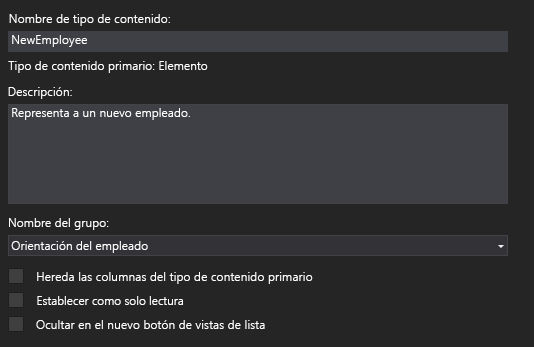
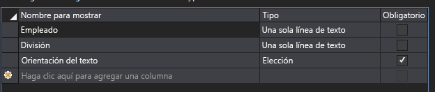
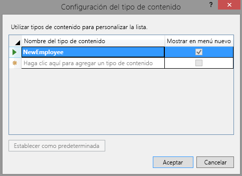
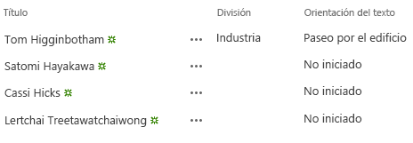

# Agregar un tipo de contenido personalizado a un complemento de SharePoint hospedado en SharePoint
Aprenda a incluir tipos de contenido personalizado en un Complementos de SharePoint.
Este es el cuarto de una serie de artículos sobre los conceptos básicos en el desarrollo de Complementos de SharePoint hospedados en SharePoint. Primero, debe familiarizarse con  [Complementos de SharePoint](sharepoint-add-ins.md) y con los demás artículos de esta serie:
  
    
    


-  [Empezar a crear complementos hospedados en SharePoint para SharePoint](get-started-creating-sharepoint-hosted-sharepoint-add-ins.md)
    
  
-  [Implementar e instalar un complemento hospedado en SharePoint para SharePoint](deploy-and-install-a-sharepoint-hosted-sharepoint-add-in.md)
    
  
-  [Agregar columnas personalizadas a un complemento de SharePoint hospedado en SharePoint](add-custom-columns-to-a-sharepoint-hostedsharepoint-add-in.md)
    
  

> [!NOTA]
> Si ha estado trabajando en esta serie sobre complementos hospedados en SharePoint, tiene una solución Visual Studio que puede utilizar para continuar con este tema. También puede descargar el repositorio que se encuentra en  [SharePoint_SP-hosted_Add-Ins_Tutorials](https://github.com/OfficeDev/SharePoint_SP-hosted_Add-Ins_Tutorials) y abrir el archivo BeforeContentType.sln.
  
    
    

En este artículo agregará un tipo de contenido personalizado a la Complemento de SharePoint Orientación del empleado.
## Crear el tipo de contenido personalizado


  
    
    

1. En el **Explorador de soluciones**, haga clic con el botón secundario en el proyecto y elija **Agregar** > **Nueva carpeta**. Denomine a la carpeta Tipos de contenido.
    
  
2. Haga clic con el botón secundario en la nueva carpeta y elija **Agregar** > **Nuevo elemento**. El cuadro de diálogo **Agregar nuevo elemento** se abre en el nodo de **Office/SharePoint**.
    
  
3. Elija **Tipo de contenido** y dele el nombreNewEmployee. Después, elija **Agregar**. Cuando el asistente le pida que seleccione el tipo de contenido base, elija **Elemento** y luego **Terminar**.
    
  
4. Si el diseñador de tipo de contenido no se abre automáticamente, elija el tipo de contenido **NewEmployee** en el **Explorador de soluciones** para abrirlo.
    
  
5. Abra la pestaña **Tipo de contenido** en el diseñador y rellene los cuadros de texto como sigue:
    
  - **Nombre de tipo de contenido**: NewEmployee
    
  
  - **Descripción**: Representa a un nuevo empleado.
    
  
  - **Nombre del grupo**: Orientación del empleado
    
  
6. Compruebe que  *ninguna*  de las casillas de verificación de la pestaña está seleccionada. La casilla **Hereda las columnas del tipo de contenido primario** podría estar seleccionada de forma predeterminada. *Asegúrese de desmarcarla.*  La pestaña debería tener este aspecto:
    
   **Pestaña Tipo de contenido**

  

     
  

    
    
  
7. Abra la pestaña **Columnas** en el diseñador.
    
  
8. En la cuadrícula, elija **Haga clic aquí para agregar una columna** para abrir una lista desplegable de columnas y agregar la denominada **Division**. Aparece en la lista desplegable por su nombre para mostrar: **Division**. Haga lo mismo para la columna **OrientationStage**. (Si no aparecen, es posible que no haya comenzado con la solución Visual Studio correcta. Comience con BeforeContentType.sln.) Cuando termine, la cuadrícula debería tener este aspecto:
    
   **Pestaña Columnas**

  

     
  

    
    
  
9. Guarde el archivo y cierre el diseñador.
    
  
10. El siguiente paso requiere trabajar directamente en el archivo XML para el tipo de contenido, así que, en el **Explorador de soluciones**, elija el archivo secundario elements.xml del tipo de contenido **NewEmployee**.
    
  
11. Ya hay elementos **FieldRef** en el archivo para las dos columnas que agregó. Agregue elementos **FieldRef** para dos columnas SharePoint integradas, como pares de las dos ya presentes. Lo siguiente es el código de marcado para los elementos. *Debe usar las mismas GUID para el Id. atributo, porque son tipos de campo integrados con Id. fijo.*  Agregue esto *por encima*  de los dos elementos **FieldRef** para las columnas de sitio personalizadas.
    
  ```
  
<FieldRef Name="LinkTitle" ID="{82642ec8-ef9b-478f-acf9-31f7d45fbc31}" DisplayName="Employee" />
<FieldRef Name="Title" ID="{fa564e0f-0c70-4ab9-b863-0177e6ddd247}" DisplayName="Employee" />
  ```


    Fíjese en que hemos dado a estos campos un nombre para mostrar personalizado: **Employee**.
    
  
12. Guarde y cierre el archivo.
    
  
13. Expanda el nodo **Listas** en el **Explorador de soluciones** y elija **NewEmployeeOrientation** para abrir el diseñador de tipos de lista.
    
  
14. Abra la pestaña **Columnas** en el diseñador y elija el botón **Tipos de contenido**.
    
  
15. En el cuadro de diálogo **Configuración del tipo de contenido**, agregue el tipo de contenido **NewEmployee**.
    
  
16. Elija el tipo de contenido **NewEmployee** en la lista de tipos y elija el botón **Establecer como predeterminada**.
    
  
17. Elija el tipo de contenido **Elemento**, haga clic con el botón secundario en la pequeña flecha que aparece a la izquierda del nombre de tipo contenido, y luego elija **Eliminar**.
    
  
18. Repita el paso anterior para el tipo de contenido **Folder**, de modo que **NewEmployee** sea el único tipo de contenido listado. El cuadro de diálogo debería tener ahora este aspecto:
    
   **Cuadro de diálogo Configuración del tipo de contenido**

  

     
  

    
    
  
19.  Elija **Aceptar** para cerrar el cuadro de diálogo y luego guarde y cierre el archivo.
    
  
20. Abra el archivo schema.xml.
    
  
21. Busque el elemento **Fields**. Debería disponer de tres elementos **Field**: **Title**, Division yOrientationStage. (Estos elementos pueden estar en una única línea del archivo generado. Si es así, sepárelos con saltos de línea.)
    
  
22. Deje el archivo abierto y, en el **Explorador de soluciones**, expanda la carpeta **Columnas de sitio** y el nodoDivision, y después abra el archivo elements.xml para ver Division. El elemento **Field** deDivision en schema.xml debería duplicar exactamente el elemento **Field** en la columnaDivision de elements.xml. Si no hay una coincidencia exacta, copie el elemento **Field** del archivo elements.xml y péguelo en vez del elemento suelto **Field** en el archivo schema.xml. Después, cierre el archivo element.xml.
    
  
23. Abra el archivo elements.xml para OrientationStage. También aquí debe haber una coincidencia exacta entre los elementos **Field** de los dos archivos enOrientationStage, incluidos todos los elementos secundarios, como los elementos **CHOICES** y **MAPPINGS**. Si no hay coincidencia, copie el **Field** en el archivo elements.xml y péguelo en lugar del elemento **Field** no coincidente en el archivo schema.xml. Después cierre el archivo elements.xml.
    
  
24. Todavía en el archivo schema.xml, en el elemento **View** cuyo valor de **BaseViewID** es "1", busque el elemento secundario **ViewFields** y agregue los dos siguientes elementos **FieldRef** como secundarios. Es posible que ya existan, aunque faltándoles un atributo **ID**. Si es así, agregue el atributo Id.
    
  ```
  
<FieldRef Name="Division" ID="{GUID from the Field element}" />
<FieldRef Name="OrientationStage" ID="{GUID from the Field element}" />

  ```

25. Sustituya los dos valores de atributo de marcador de posición **ID** por los GUID de los elementos **Field** correspondientes al elemento **ContentType** para **NewEmployee** anterior en el archivo schema.xml. No olvide los corchetes "{}".
    
    El **ViewFields** para la **View** "1" debería tener este aspecto (su GUID podría ser distinto).
    


  ```
  
<ViewFields>
   <FieldRef Name="LinkTitle" ID="{82642ec8-ef9b-478f-acf9-31f7d45fbc31}" DisplayName="Employee" />
   <FieldRef Name="Division" ID="{509d2d67-9a96-4596-9b3b-58449cdcc6ff}" />
   <FieldRef Name="OrientationStage" ID="{38a3b54c-acf3-4ddf-b748-55c7c28d4cc2}" />        
</ViewFields>
  ```

26. Todavía en el archivo schema.xml, busque el elemento **View** cuyo valor valor de **BaseViewID** sea "0". Busque el elemento **ViewFields** que contiene.
    
  
27. Copie toda la sección **ViewFields** de la vista "1" en la sección **ViewFields** de la vista "0". Ambas vistas deberían tener ahora secciones **ViewFields** idénticas.
    
  
28. Guarde y cierre el archivo schema.xml.
    
  
29. En la carpeta **Listas**, expanda el nodo **NewEmployeeOrientation** y su instancia de lista secundaria **NewEmployeesInSeattle**. Debería ser capaz de ver y distinguir claramente el archivo elements.xml para la plantilla y el archivo elements.xml para la instancia. Abra el de la instancia. 
    
  
30. Agregue dos elementos **Field** al primer elemento **Row**, de modo que el elemento **Row** tenga un aspecto así.
    
  ```
  
<Row>
  <Field Name="Title">Tom Higginbotham</Field>
  <Field Name="Division">Manufacturing</Field>
  <Field Name="OrientationStage">Tour of building</Field>
</Row>
   
  ```

31. Guarde y cierre el archivo.
    
  

## Ejecutar y probar el complemento


  
    
    

1. Presione la tecla F5 para implementar y ejecutar el complemento. Visual Studio realiza una instalación temporal en su sitio de pruebas de SharePoint y ejecuta inmediatamente el complemento. 
    
  
2. Cuando se abra la página predeterminada del complemento, elija el vínculo **Nuevos empleados de Seattle** para abrir la instancia de lista personalizada.
    
  
3. La página de la lista se abre con las columnas Division yOrientationStage en ella. No es necesario que un usuario las agregue manualmente, ya que son parte del tipo de contenido de la lista. El primer elemento contiene los datos que usted agregó.
    
   **Lista Nuevos empleados de Seattle**

  

     
  

    
    
  
4. Pruebe a agregar nuevos elementos a la lista y a editar los existentes.
    
  
5. Para terminar la sesión de depuración, cierre la ventana del explorador o detenga la depuración en Visual Studio. Cada vez que presiona F5, Visual Studio retirará la versión anterior del complemento e instalará la más reciente.
    
  
6. Trabajará con este complemento y con la solución Visual Studio en otros artículos, y se considera recomendable retirar el complemento una última vez cuando acabe de trabajar en él durante un tiempo. En el proyecto, haga clic con el botón derecho en **Explorador de soluciones** y elija **Retirar**.
    
  

## 
<a name="Nextsteps"> </a>

En el siguiente artículo de esta serie agregará un elemento web de vista de lista a la página predeterminada del Complemento de SharePoint:  [Agregar un elemento web a una página de un complemento para SharePoint hospedado en SharePoint](add-a-web-part-to-a-page-in-a-sharepoint-hosted-sharepoint-add-in.md).
  
    
    

