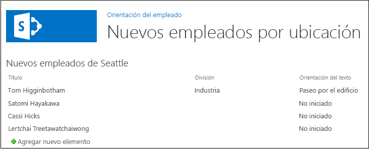

# Agregar un elemento web a una página de un complemento para SharePoint hospedado en SharePoint
Aprenda a incluir elementos web en una página en una Complementos de SharePoint.
Este es el quinto de una serie de artículos sobre los conceptos básicos del desarrollo de Complementos de SharePoint hospedadas en SharePoint. Primero debe estar familiarizado con  [Complementos de SharePoint](sharepoint-add-ins.md) y los artículos anteriores de esta serie:
  
    
    


-  [Empezar a crear complementos hospedados en SharePoint para SharePoint](get-started-creating-sharepoint-hosted-sharepoint-add-ins.md)
    
  
-  [Implementar e instalar un complemento hospedado en SharePoint para SharePoint](deploy-and-install-a-sharepoint-hosted-sharepoint-add-in.md)
    
  
-  [Agregar columnas personalizadas a un complemento de SharePoint hospedado en SharePoint](add-custom-columns-to-a-sharepoint-hostedsharepoint-add-in.md)
    
  
-  [Agregar un tipo de contenido personalizado a un complemento de SharePoint hospedado en SharePoint](add-a-custom-content-type-to-a-sharepoint-hostedsharepoint-add-in.md)
    
  

> **NOTA**
> Si ha estado trabajando en esta serie sobre complementos hospedados en SharePoint, tiene una solución Visual Studio que puede usar para continuar con este tema. También puede descargar el repositorio en  [SharePoint_SP-hosted_Add-Ins_Tutorials](https://github.com/OfficeDev/SharePoint_SP-hosted_Add-Ins_Tutorials) y abrir el archivo BeforeWebPart.sln.
  
    
    

En este artículo agregará un elemento web a la página predeterminada de la Complemento de SharePoint Orientación de empleados.
## Agregar un elemento web a una página


  
    
    

1. En el **Explorador de soluciones**, abra el archivo Default.aspx. 
    
  
2. Se agregará un elemento web de vista de lista a la página que muestra la lista Nuevos empleados de Seattle, de modo que ya no sea necesario disponer de un vínculo a la página de vista de lista para dicha lista. Quite el elemento **<asp:HyperLink>** del elemento **<asp:Content>** cuyo **ContentPlaceHolderId** es `PlaceHolderMain`. 
    
  
3. Dentro del mismo elemento **<asp:Content>**, agregue lo siguiente: **WebPartZone**. 
    
 ```XML
  
<WebPartPages:WebPartZone runat="server" FrameType="TitleBarOnly"
      ID="HomePage1" Title="loc:full" />

 ```

4. Guarde y cierre el archivo.
    
  
5. En el **Explorador de soluciones**, abra el archivo elements.xml de la página en el nodo **Páginas**. 
    
  
6. Si el elemento **File** es de cierre automático, quite el carácter "/" y agregue la etiqueta final `</File>`.
    
  
7. En el elemento **File**, agregue un elemento secundario **AllUsersWebPart** y establezca como su **WebPartZoneID** el Id. de la zona de elemento web que ha creado en la página. Ahora, el contenido del archivo debería tener un aspecto así. Este marcado indica a SharePoint que inserte un **AllUsersWebPart** en la zona de elemento web denominada "HomePage1".
    
 ```
  
<Elements xmlns="http://schemas.microsoft.com/sharepoint/">
  <Module Name="Pages">
    <File Path="Pages\\Default.aspx" Url="Pages/Default.aspx" ReplaceContent="TRUE" >
      <AllUsersWebPart WebPartZoneID="HomePage1" WebPartOrder="1">

      </AllUsersWebPart>
    </File>
  </Module>
</Elements>

 ```

8. Agregue un elemento **CDATA** como elemento secundario del **AllUsersWebPart** y luego agregue un elemento **webParts** como elemento secundario del **CDATA**, como se muestra en el siguiente código de marcado. 
    
 ```
  
<AllUsersWebPart WebPartZoneID="HomePage1" WebPartOrder="1">
  <![CDATA[
    <webParts>

    </webParts>
  ]]>
</AllUsersWebPart>
 ```

9. Agregue el siguiente código de marcado **webPart** como elemento secundario del elemento **webParts**. Este código de marcado agrega un **XsltListViewWebPart** e indica al elemento web que busque la listaNuevos empleados de Seattle. Fíjese en que el valor de la propiedad **ViewContentTypeId** es simplemente "0x", no el identificador real del tipo de contenidoNewEmployee. 
    
 ```
  
  <webPart xmlns="http://schemas.microsoft.com/WebPart/v3">
    <metaData>
      <type name="Microsoft.SharePoint.WebPartPages.XsltListViewWebPart, 
                   Microsoft.SharePoint, Version=15.0.0.0, Culture=neutral, 
                   PublicKeyToken=71e9bce111e9429c" />
    </metaData>
    <data>
      <properties>
        <property name="ListUrl">Lists/NewEmployeesInSeattle</property>
        <property name="IsIncluded">True</property>
        <property name="NoDefaultStyle">True</property>
        <property name="Title">New Employees in Seattle</property>
        <property name="PageType">PAGE_NORMALVIEW</property>
        <property name="Default">False</property>
        <property name="ViewContentTypeId">0x</property>
      </properties>
    </data>
  </webPart>
 ```


## Ejecutar y probar el complemento


  
    
    

1. Use la tecla F5 para implementar y ejecutar el complemento. Visual Studio realizará una instalación temporal del complemento en su sitio de SharePoint de prueba y ejecutará el complemento inmediatamente. 
    
  
2. Cuando se abre la página predeterminada del complemento, el elemento web de vista de lista está presente y se muestra la lista. 
    
   **Página predeterminada con el elemento web de vista de lista**

  

     
  

    
    
  
3. Pruebe a agregar nuevos elementos a la lista y a editar elementos existentes.
    
  
4. Para terminar la sesión de depuración, cierre la ventana del explorador o detenga la depuración en Visual Studio. Cada vez que presione F5, Visual Studio retirará la versión anterior del complemento e instalará la más reciente.
    
  
5. Trabajará con este complemento y con la solución Visual Studio en otros artículos, y se considera recomendable retirar el complemento una última vez cuando acabe de trabajar en él durante un tiempo. En el proyecto, haga clic con el botón secundario en el **Explorador de soluciones** y elija **Retirar**.
    
  

## 
<a name="Nextsteps"> </a>

En el siguiente artículo de la serie, agregará un flujo de trabajo a la Complemento de SharePoint:  [Agregar un flujo de trabajo a un complemento hospedado en SharePoint para SharePoint](add-a-workflow-to-a-sharepoint-hosted-sharepoint-add-in.md).
  
    
    

