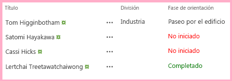

# Agregar representación del lado cliente personalizada a un complemento de SharePoint hospedado en SharePoint
Personalice la representación y la validación de los controles en las páginas de Complementos de SharePoint.
Este es el octavo de una serie de artículos sobre los fundamentos del desarrollo de Complementos de SharePoint hospedados en SharePoint. Primero debe familiarizarse con  [Complementos de SharePoint](sharepoint-add-ins.md) y con los anteriores artículos de esta serie:


-  [Empezar a crear complementos hospedados en SharePoint para SharePoint](get-started-creating-sharepoint-hosted-sharepoint-add-ins.md)


-  [Implementar e instalar un complemento hospedado en SharePoint para SharePoint](deploy-and-install-a-sharepoint-hosted-sharepoint-add-in.md)


-  [Agregar columnas personalizadas a un complemento de SharePoint hospedado en SharePoint](add-custom-columns-to-a-sharepoint-hostedsharepoint-add-in.md)


-  [Agregar un tipo de contenido personalizado a un complemento de SharePoint hospedado en SharePoint](add-a-custom-content-type-to-a-sharepoint-hostedsharepoint-add-in.md)


-  [Agregar un elemento web a una página de un complemento para SharePoint hospedado en SharePoint](add-a-web-part-to-a-page-in-a-sharepoint-hosted-sharepoint-add-in.md)


-  [Agregar un flujo de trabajo a un complemento hospedado en SharePoint para SharePoint](add-a-workflow-to-a-sharepoint-hosted-sharepoint-add-in.md)


-  [Agregar una página y un estilo personalizados a un complemento hospedado en SharePoint para SharePoint](add-a-custom-page-and-style-to-a-sharepoint-hosted-sharepoint-add-in.md)


> **NOTA**
> Si ha estado trabajando en esta serie sobre complementos hospedados en SharePoint, ya tiene una solución de Visual Studio que puede usar para continuar con este tema. También puede descargar el repositorio en  [SharePoint_SP-hosted_Add-Ins_Tutorials](https://github.com/OfficeDev/SharePoint_SP-hosted_Add-Ins_Tutorials) y abrir el archivo BeforeClientRenderedControl.sln.


Puede usar un pequeño JavaScript de cliente para personalizar la representación de elementos web, la mayoría de los tipos de campos (columnas) y algunos otros controles asignando un archivo de JavaScript a la propiedad **JSLink** del control, como **SPField.JSLink**. También puede agregar lógica de validación de cliente de esta manera. En este artículo, personalizamos la representación de un campo en una lista del Complemento de SharePoint Orientación del empleado mediante la representación del lado cliente.
> **NOTA**
> Si el usuario final tiene JavaScript deshabilitado en el explorador, SharePoint revertirá a la representación y la validación de servidor. 


> **NOTA**
> La propiedad JSLink no es compatible con las listas de encuesta o de eventos. Un calendario de SharePoint es una lista de eventos. 


## Crear y registrar el JavaScript


1. En el **Explorador de soluciones**, haga clic con el botón derecho en el nodo **Scripts** y, a continuación, elija **Agregar** > **Nuevo elemento** > **Web**.


2. Elija **Archivo JavaScript** y asígnele el nombreOrientationStageRendering.js.


3. La representación personalizada del campo debería ocurrir automáticamente, así que agregue un método anónimo al JavaScript que se ejecuta automáticamente cuando se carga el archivo con el código siguiente.

 ```

(function () {

})();
 ```

4. En el cuerpo de este método (entre los caracteres { }), agregue el siguiente código para crear objetos JSON (notación de objetos Javascript) para el contexto de reemplazo de representación, las plantillas en el contexto y las plantillas para los campos.

 ```

var customRenderingOverride = {};
customRenderingOverride.Templates = {};
customRenderingOverride.Templates.Fields = {

}
 ```

5. En el cuerpo del objeto de plantilla  `Fields`, agregue el siguiente JSON. El nombre de propiedad  `OrientationStage` identifica el campo que tiene representación personalizada. El valor de la propiedad es otro objeto JSON. La propiedad `View` identifica el contexto de la página donde se aplica la representación personalizada. En este caso, el objeto está indicando a SharePoint que use la representación personalizada en vistas de lista. (Otras opciones podrían ser para los formularios de edición, nuevo y mostrar). El valor de la propiedad, `renderOrientationStage`, es el nombre del método de representación personalizada que se crea en un paso posterior.

 ```

"OrientationStage": { "View": renderOrientationStage }
 ```

6. Lo último que debe hacer el método anónimo es informar al administrador de plantillas de SharePoint sobre la invalidación de la representación. Agregue la siguiente línea al final del cuerpo del método.

 ```
  SPClientTemplates.TemplateManager.RegisterTemplateOverrides(customRenderingOverride);
 ```


El método ahora debería ser similar al siguiente.


 ```
  (function () {
    var customRenderingOverride = {};
    customRenderingOverride.Templates = {};
    customRenderingOverride.Templates.Fields = {
        "OrientationStage": { "View": renderOrientationStage }
    }

    SPClientTemplates.TemplateManager.RegisterTemplateOverrides(customRenderingOverride);
})();
 ```

7. Agregue el método siguiente al archivo. Establece el color del valor de la columna **Fase de orientación** en rojo cuando el valor es "No iniciado" y en verde cuando el valor es "Completado". (El objeto `ctx` es un objeto de contexto de cliente que se declara mediante el script de SharePoint que se incluye).

 ```

function renderOrientationStage(ctx) {
    var orientationStageValue = ctx.CurrentItem[ctx.CurrentFieldSchema.Name];
    if (orientationStageValue == "Not Started")  {
        return "<span style='color:red'>" + orientationStageValue + "</span>"
    }
    else if (orientationStageValue == "Completed") {
        return "<span style='color:green'>" + orientationStageValue + "</span>"
    }
    else {
        return orientationStageValue;
    }
}
 ```

8. En el **Explorador de soluciones**, expanda **Columnas de sitio** y **OrientationStage** y, a continuación, abra el archivo elements.xml.


9. Para indicar a SharePoint que use el JavaScript personalizado, agregue un nuevo atributo, **JSLink**, al elemento **Field** y, a continuación, asigne la siguiente dirección URL como valor correspondiente: `~site/Scripts/OrientationStageRendering.js`.

    > **NOTA**
      > La propiedad **JSLink** siempre es un archivo, no un método. No hay ninguna forma de indicar a SharePoint qué método ejecutar. Ese es el motivo por el cual el archivo contiene un método que se ejecuta automáticamente.

    La etiqueta de apertura del elemento **Field** ahora será similar a la siguiente.


 ```

<Field
       ID="{some_guid_here}"
       Name="OrientationStage"
       Title="OrientationStage"
       DisplayName="Orientation Stage"
       Description="The current orientation stage of the employee."
       Type="Choice"
       Required="TRUE"
       Group="Employee Orientation" 
       JSLink="~site/Scripts/OrientationStageRendering.js">
<!-- child elements and end tag omitted -->
 ```

10. Abra la página Default.aspx y agregue el siguiente código como último elemento secundario del elemento **asp:Content** que tiene **ContentPlaceHolderID** establecido en **PlaceHolderMain**. 

 ```XML

<p><asp:HyperLink runat="server" NavigateUrl="JavaScript:window.location = _spPageContextInfo.webAbsoluteUrl + '/Lists/NewEmployeesInSeattle/AllItems.aspx';"
    Text="List View Page for New Employees in Seattle" /></p>

 ```


## Ejecutar y probar el complemento


1. Use la tecla F5 para implementar y ejecutar el complemento. Visual Studio realizará una instalación temporal del complemento en el sitio de SharePoint de prueba y ejecutará el complemento inmediatamente. 


2. La representación del lado cliente configurada afecta a la representación del campo solo en la página de vista de lista, no en el elemento web de vista de lista que colocamos en la página principal. Esto se debe a que el elemento web adopta como valor predeterminado la representación de lado servidor. Existen formas de revertir esto, pero son demasiado avanzadas para este sencillo ejemplo. Por lo tanto, para ver la representación del lado cliente en acción, haga clic en el vínculo en la parte inferior de la página **Página de vista de lista para Nuevos empleados de Seattle**.


3. Cuando se abra la página de vista de lista, establezca el valor **Fase de orientación** para algunos elementos en **No iniciada** y establezca otros en **Completada** para ver la representación del color personalizado.

   **Lista con la representación del lado cliente personalizada**





4. Para terminar la sesión de depuración, cierre la ventana del explorador o detenga la depuración en Visual Studio. Cada vez que presione F5, Visual Studio retirará la versión anterior del complemento e instalará la más reciente.


5. Trabajará con este complemento y con la solución de Visual Studio en otros artículos, y se considera recomendable retirar el complemento una última vez cuando acabe de trabajar en él durante un tiempo. En el proyecto, haga clic con el botón derecho en el **Explorador de soluciones** y elija **Retirar**.


## 
<a name="Nextsteps"> </a>

En el siguiente artículo de esta serie, agregaremos un elemento de menú personalizado y un botón personalizado a la cinta de opciones en el Complemento de SharePoint:  [Crear un botón personalizado de la cinta de opciones en la web de host de un complemento de SharePoint](create-a-custom-ribbon-button-in-the-host-web-of-a-sharepoint-add-in.md).


