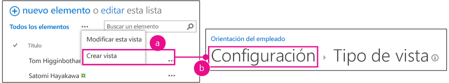
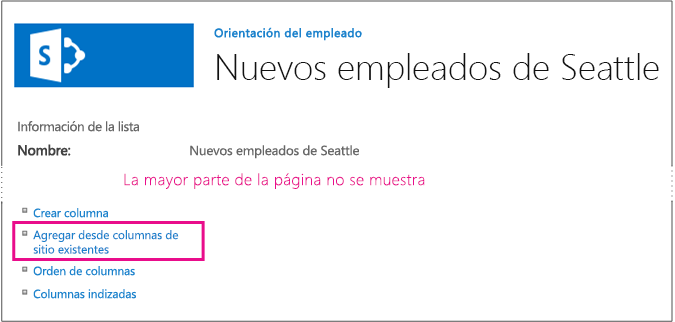
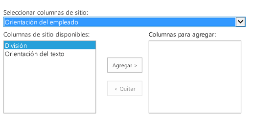
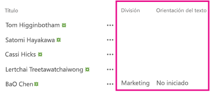

# Agregar columnas personalizadas a un complemento de SharePoint hospedado en SharePoint
Aprenda a incluir columnas personalizadas en un Complementos de SharePoint.
Este es el tercero de una serie de artículos sobre los fundamentos del desarrollo de Complementos de SharePoint hospedados en SharePoint. Primero, debe familiarizarse con  [Complementos de SharePoint](sharepoint-add-ins.md) y con los artículos anteriores de esta serie:


-  [Empezar a crear complementos hospedados en SharePoint para SharePoint](get-started-creating-sharepoint-hosted-sharepoint-add-ins.md)


-  [Implementar e instalar un complemento hospedado en SharePoint para SharePoint](deploy-and-install-a-sharepoint-hosted-sharepoint-add-in.md)


> **NOTA**
> Si ha trabajado en esta serie sobre complementos hospedados en SharePoint, tiene una solución Visual Studio que puede usar para continuar con este tema. También puede descargar el repositorio en  [SharePoint_SP-hosted_Add-Ins_Tutorials](https://github.com/OfficeDev/SharePoint_SP-hosted_Add-Ins_Tutorials) y abrir el archivo BeforeColumns.sln.


En este artículo volvemos a la codificación agregando algunas columnas de sitio al Complemento de SharePoint Orientación de empleados.
## Crear tipos de columna personalizada


1. En el **Explorador de soluciones**, haga clic con el botón secundario y elija **Agregar** > **Nueva carpeta**. Llame a la carpeta Columnas de sitio.


2. Haga clic con el botón derecho en la nueva carpeta y elija **Agregar** > **Elemento nuevo**. El cuadro de diálogo **Agregar nuevo elemento** se abre en el nodo **Office/SharePoint**.


3. Elija **Columna de sitio**, asígnele el nombre División y elija **Agregar**.


4. En el archivo elements.xml de la nueva columna de sitio, edite el elemento **Field** para que tenga los atributos y valores que se muestra en el ejemplo siguiente, salvo por que *no **debería** cambiar el GUID*  para el atributo **ID** respecto al valor que Visual Studio generó para él, *por lo que debe tener cuidado si está utilizando copiar y pegar*  .

 ```

<Field ID="{generated GUID}"
       Name="Division" 
       Title="Division" 
       DisplayName="Division" 
       Description="The division of the company where the employee works." 
       Group="Employee Orientation" 
       Type="Text" 
       Required ="FALSE">
</Field>
 ```

5. Agregue otra **Columna de sitio** en la misma carpeta y llámelaOrientationStage.


6. En el archivo elements.xml de la nueva columna de sitio, edite el elemento **Field** para que tenga los atributos y valores que se muestran en el ejemplo siguiente, salvo por que no debe cambiar el GUID para el atributo **ID** respecto al valor que Visual Studio generó para él.

 ```

<Field ID="{generated GUID}"
       Name="OrientationStage" 
       Title="OrientationStage"
       DisplayName="Orientation Stage" 
       Group="Employee Orientation" 
       Description="The current orientation stage of the employee." 
       Type="Choice"
       Required ="TRUE">
</Field>
 ```

7. Puesto que es un campo de opción, debe especificar las posibles opciones y el orden en que deben aparecer en la lista desplegable cuando un usuario realiza una elección. Y, dado que es un campo obligatorio, debe especificar un valor predeterminado. Agregue el siguiente código de marcado secundario al elemento **Field**.

 ```

<CHOICES>
      <CHOICE>Not Started</CHOICE>
      <CHOICE>Tour of building</CHOICE>
      <CHOICE>HR paperwork</CHOICE>
      <CHOICE>Corporate network access</CHOICE>
      <CHOICE>Completed</CHOICE>
</CHOICES>
<MAPPINGS>
      <MAPPING Value="1">Not Started</MAPPING>
      <MAPPING Value="2">Tour of building</MAPPING>
      <MAPPING Value="3">HR paperwork</MAPPING>
      <MAPPING Value="4">Corp network access</MAPPING>
      <MAPPING Value="5">Completed</MAPPING>
</MAPPINGS>
<Default>Not Started</Default>
 ```

8. Guardar todos los archivos.


## Ejecutar el complemento y probar las columnas


1. Use la tecla F5 para implementar y ejecutar el complemento. Visual Studio realiza una instalación temporal del complemento en el sitio de pruebas de SharePoint y ejecuta inmediatamente el complemento. 


2. Cuando se abra la página predeterminada del complemento, elija el vínculo **Nuevos empleados de Seattle** para abrir la instancia de lista personalizada.


3. Abra la página **Configuración** de la lista y agregue las dos columnas con estos pasos.

1. Haga clic en el botón de llamada, **· · ·**, justo encima de la lista, y luego elija **Crear vista**.


2. Se abre la página **Tipo de vista** con la estructura de navegación **Configuración > Ver tipo** cerca de la parte superior. Haga clic en la ruta de navegación **Configuración**.

   **Pasos para abrir la página de configuración de lista**





3. En la página **Configuración**, abra el vínculo **Agregar desde columnas de sitio existentes** a la izquierda, cerca de la mitad de la página.

   **Página de configuración de lista**





4. En la página **Agregar columnas desde sitio**, elija **Orientación de empleados** en la lista desplegable **Seleccionar columnas de sitio de**.

   **Agregar columnas de la página de columnas de sitio**





5. Agregue las columnas **Division** y **OrientationStage** al cuadro **Columnas para agregar**.


6. Elija **Aceptar** para volver a la página **Configuración** y luego haga clic en la ruta de navegación **Nuevos empleados de Seattle**, cerca del principio de la página.


4. Las nuevas columnas se encuentran ahora en la lista. Agregue un nuevo elemento a la lista. En el formulario de edición, el campo **OrientationStage** ya tendrá el valor predeterminadoNo iniciado. (Los elementos existentes estarán en blanco en este campo porque fueron creados antes de que el campo estuviera en la lista.)

   **La lista con nuevas columnas**





5. Para terminar la sesión de depuración, cierre la ventana del explorador o detenga la depuración en Visual Studio. Cada vez que presione F5, Visual Studio retirará la versión anterior del complemento e instalará la más reciente.


6. Trabajará con este complemento y la solución Visual Studio en otros artículos, y se considera recomendable retirar el complemento una última vez al terminar de trabajar con él durante un tiempo. Haga clic con el botón secundario en el proyecto, en **Explorador de soluciones**, y elija **Retirar**.


## 
<a name="Nextsteps"> </a>

No es adecuado que sus usuarios tengan que agregar manualmente las columnas personalizadas a la lista, así que, en el siguiente artículo de la serie, creará un tipo de contenido personalizado que incluye las columnas personalizadas y que se asocia automáticamente con la plantilla de lista Nuevos empleados:  [Agregar un tipo de contenido personalizado a un complemento de SharePoint hospedado en SharePoint](add-a-custom-content-type-to-a-sharepoint-hostedsharepoint-add-in.md). 


