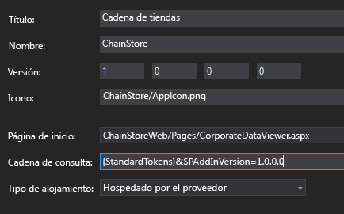
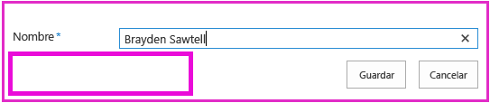
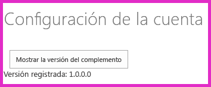

# Agregar lógica de la primera vista al complemento hospedado por el proveedor
Aprenda a incluir código "de primera vista" en un Complemento de SharePoint hospedado por el proveedor.
Este es el octavo de una serie de artículos sobre los conceptos básicos de desarrollo de Complementos de SharePoint hospedados por el proveedor. Primero debe familiarizarse con los  [Complementos de SharePoint](sharepoint-add-ins.md) y con los anteriores artículos de esta serie:
  
    
    


-  [Empezar a crear complementos hospedados en proveedor para SharePoint](get-started-creating-provider-hosted-sharepoint-add-ins.md)
    
  
-  [Dar al complemento hospedado por el proveedor la apariencia de SharePoint](give-your-provider-hosted-add-in-the-sharepoint-look-and-feel.md)
    
  
-  [Incluir un botón personalizado en el complemento hospedado por el proveedor](include-a-custom-button-in-the-provider-hosted-add-in.md)
    
  
-  [Obtener una introducción rápida al modelo de objetos de SharePoint](get-a-quick-overview-of-the-sharepoint-object-model.md)
    
  
-  [Agregar operaciones de escritura de SharePoint al complemento hospedado por el proveedor](add-sharepoint-write-operations-to-the-provider-hosted-add-in.md)
    
  
-  [Incluir un elemento de complemento en el complemento hospedado por el proveedor](include-an-add-in-part-in-the-provider-hosted-add-in.md)
    
  
-  [Controlar eventos de complemento en el complemento hospedado por el proveedor](handle-add-in-events-in-the-provider-hosted-add-in.md)
    
  

> **NOTA**
> Si ha estado trabajando en esta serie sobre complementos hospedados por el proveedor, ya tiene una solución de Visual Studio que puede usar para continuar con este tema. También puede descargar el repositorio en  [SharePoint_Provider-hosted_Add-Ins_Tutorials](https://github.com/OfficeDev/SharePoint_Provider-hosted_Add-ins_Tutorials) y abrir el archivo BeforeFirstRunLogic.sln.
  
    
    

En este artículo se agrega código a la página de inicio del Complemento de SharePoint Chain Store que comprueba si la instancia actual del complemento se ejecuta por primera vez. Si es la primera vez, el código implementará la lista **Empleados locales** y el botón de la cinta de opciones personalizado.
## Crear la clase básica para la implementación de componentes de SharePoint


  
    
    

> **NOTA**
>  La configuración de los Proyectos de inicio en Visual Studio tiende a volver a los valores predeterminados cuando se vuelve a abrir la solución. Siempre siga estos pasos inmediatamente después de volver a abrir la solución de ejemplo en esta serie de artículos:>  Haga clic con el botón derecho en el nodo de solución en la parte superior del **Explorador de soluciones** y seleccione **Establecer proyectos de inicio**. >  Asegúrese de que los tres proyectos estén establecidos en **Iniciar** en la columna **Acción**. 
  
    
    


1. En el proyecto **ChainStoreWeb** del **Explorador de soluciones**, haga clic con el botón derecho en la carpeta **Utilidades** y seleccione **Agregar | Elemento existente**.
    
  
2. En el **Explorador de archivos** que se abre vaya a la carpeta de la solución, la carpeta **ChainStoreWeb** y, a continuación, abra la carpeta **Utilidades**.
    
  
3. Seleccione SharePointComponentDeployer.cs y presione **Agregar**.
    
  
4. Abra el archivo SharePointComponentDeployer.cs. Tiene una clase estática y dos métodos estáticos que obtienen y establecen la versión del complemento en la tabla **Inquilinos** de la base de datos corporativa. No analizaremos estos métodos porque esta serie de artículos no está diseñada para enseñar programación ASP.NET o SQL Server/Azure.
    
  
5. Agregue las siguientes instrucciones **using** al principio del archivo.
    
 ```
  
using System.Web;
using System.Linq;
using System.Collections.Generic;
using Microsoft.SharePoint.Client;
 ```

6. En la parte superior de la clase  `SharePointComponentDeployer`, agregue los dos campos estáticos siguientes. Ambos se inicializarán en el método **Page_Load** de la página de inicio del complemento. Ese código se agrega en un paso posterior. El primer campo contendrá el objeto **SharePointContext** que es necesario para realizar operaciones CRUD en SharePoint. El segundo contendrá el número de versión del complemento instalado en la web de host. Inicialmente, este valor será diferente al valor predeterminado ( **0000.0000.0000.0000** ) que se registra en la tabla corporativa **Inquilinos** cuando el controlador de instalación registra el inquilino. Por ejemplo, la primera versión del complemento será **1.0.0.0**.
    
 ```cs
  
internal static SharePointContext sPContext;
internal static Version localVersion;
 ```

7. Cree la siguiente propiedad estática para mantener la versión del complemento que se encuentra registrada actualmente en la tabla corporativa **Inquilinos**. Usa los dos métodos que ya estaban en el archivo para obtener y establecer este valor.
    
 ```cs
  
internal static Version RemoteTenantVersion
{
    get
    {
        return GetTenantVersion();
    }
    set
    {
        SetTenantVersion(value);
    }
}
 ```

8. Ahora cree la siguiente propiedad  `IsDeployed`. Tenga en cuenta lo siguiente sobre este código:
    
  - El método **Page_Load** de la página de inicio del complemento usará el valor de esta propiedad para determinar si el complemento se ejecuta por primera vez o no. Un valor **false** indica que el complemento no se ejecutó anteriormente en la web de host actual, por lo que sus componentes deben implementarse.
    
  
  - El criterio es si el número de versión registrado en la tabla **Inquilinos** es o no inferior a la versión que hay instalada. La primera vez que el complemento se ejecute, será menor. El código que se escribe en un paso posterior establece la versión de la tabla **Inquilinos** en la misma versión que está instalada, de modo que, cuando se ejecute de nuevo, `IsDeployed` devolverá **true** y la lógica de implementación no se volverá a ejecutar.
    
  

 ```cs
  
public static bool IsDeployed
{
    get
    {
        if (RemoteTenantVersion < localVersion)
            return false; 
        else
            return true; 
    }
}
 ```

9. Agregue el siguiente método a la clase  `SharePointComponentDeployer`. Tenga en cuenta que lo último que el método hace es actualizar la versión del inquilino registrada en la base de datos corporativa ( **0000.0000.0000.0000** ) para que coincida con la versión real del complemento en la web de host ( **1.0.0.0** ). Completaremos este método en un paso posterior.
    
 ```cs
  
internal static void DeployChainStoreComponentsToHostWeb(HttpRequest request)
{
    // TODO4: Deployment code goes here.

    RemoteTenantVersion = localVersion;
}
 ```


> **NOTA**
> Posiblemente ahora se pregunte por qué el complemento usa números de versión y una prueba "menor que" para averiguar la respuesta de una simple pregunta que se responde con "sí" o "no": ¿el complemento se está ejecutando por primera vez? También podríamos tener un campo de cadena simple en la tabla **Inquilinos** que se establezca en "no ejecutado aún" en el controlador de instalación y, a continuación, cambia a "ya se ejecutó una vez" por la lógica de la primera vista después de que se implementan los componentes de SharePoint.> Para el complemento Chain Store, una prueba sencilla bastaría. Sin embargo, generalmente se recomienda usar números de versión. Esto se debe a que es probable que un complemento de producción se actualice in situ en el futuro, es decir, que se actualiza una vez instalado. Cuando llegue ese momento, la lógica del complemento deberá poder detectar más posibilidades aparte de no ejecutado aún yya se ejecutó una vez. Por ejemplo, supongamos que quiere agregar una lista adicional a la web de host en la actualización de la versión 1.0.0.0 a 2.0.0.0. Puede hacer esto en un controlador de eventos de actualización o en la lógica "ejecutar después de actualizar". En ambos casos, la lógica de implementación tendrá que implementar componentes nuevos, pero también necesitará evitar que vuelva a implementar los componentes que se implementaron en una versión anterior del complemento. Un número de versión 1.0.0.0 indicaría que se implementaron los componentes de la versión 1.0.0.0 pero que la lógica de la primera vista después de la actualización no se ejecutó. 
  
    
    


## Agregar la lógica básica de inicio


  
    
    

1. La web de host de SharePoint necesita indicar a la aplicación web remota qué versión del complemento está instalada. Para ello, vamos a usar un parámetro de consulta. Abra el archivo AppManifest.xml en el proyecto **ChainStore**. En el diseñador, verá el marcador de posición **{StandardTokens}** como valor del cuadro **Cadena de consulta**. Agregue la cadena "&amp;SPAddInVersion=1.0.0.0" al final. El diseñador de manifiestos debe ser similar al siguiente.  *Observe que el número de versión que se pasa en la cadena de consulta debe coincidir con el valor del cuadro **Versión** del diseñador.*  (Si alguna vez actualiza el complemento, una de las tareas es elevar estos dos valores e igualarlos).
    
     
  

  

  
2. Abra el archivo CorporateDataViewer.aspx.cs y agregue el siguiente código al método **Page_Load**, justo debajo de la línea que inicializa el objeto  `spContext`. Tenga en cuenta lo siguiente sobre este código:
    
  - Comienza por establecer los dos campos estáticos en la clase estática  `SharePointComponentDeployer`. Pasa el objeto **SharePointContext** porque el código en el `SharePointComponentDeployer` llamará a SharePoint y usa el parámetro de consulta que agregó para establecer la propiedad `localVersion`.
    
  
  - No hace nada si  `IsDeployed` es true, es decir, si ya se ejecutó la lógica "de primera vista". De lo contrario, se llama al método de implementación y pasa el objeto de solicitud de ASP.NET.
    
  

 ```cs
  
SharePointComponentDeployer.sPContext = spContext;
SharePointComponentDeployer.localVersion = new Version(Request.QueryString["SPAddInVersion"]);

if (!SharePointComponentDeployer.IsDeployed)
{
    SharePointComponentDeployer.DeployChainStoreComponentsToHostWeb(Request);
}
 ```


## Implementar mediante programación una lista de SharePoint


  
    
    

1. En el archivo SharePointComponentDeployer.cs, reemplace  `TODO4` por la siguiente línea. Crearemos este método en el paso siguiente.
    
 ```cs
  
CreateLocalEmployeesList();
 ```

2. Agregue el siguiente método a la clase  `SharePointComponentDeployer`. Tenga en cuenta lo siguiente sobre este código:
    
  - Tiene dos llamadas de **ExecuteQuery**. La primera es necesaria para determinar si la lista ya existe. La segunda se encarga de crear la lista.
    
  
  - El método **ClientContext.LoadQuery** es igual a **ClientContext.Load** excepto en que, en lugar de traer una entidad como una lista al cliente, ofrece los resultados enumerables de una consulta.
    
  

 ```cs
  private static void CreateLocalEmployeesList()
{
    using (var clientContext = sPContext.CreateUserClientContextForSPHost())
    {
        var query = from list in clientContext.Web.Lists
                    where list.Title == "Local Employees"
                    select list;
        IEnumerable<List> matchingLists = clientContext.LoadQuery(query);
        clientContext.ExecuteQuery();

        if (matchingLists.Count() == 0)
        {
           // TODO5: Create the list 

           // TODO6: Rename the Title field on the list 

           // TODO7: Add "Added to Corporate DB" field to the list 

           clientContext.ExecuteQuery();
        }
    }
}
 ```

3. Reemplace  `TODO5` por el código siguiente. Tenga en cuenta lo siguiente sobre este código:
    
  - La clase **ListCreationInformation** es igual a la clase **ListItemCreationInformation** que vimos en un artículo anterior de esta serie. Es una clase ligera más adecuada para enviar información desde la aplicación web hacia SharePoint que la clase completa **List**.
    
  
  - Existen muchos tipos de plantillas de lista, como el tipo Tareas para una lista "para hacer" y el tipo Eventos para un calendario. La lista **Empleados locales** se basa en la más sencilla: la de tipo Genérica.
    
  
  - La propiedad **ListCreationInformation.Url** contiene la dirección URL de la lista *relativa*  a la web de host. Al especificar "Lists/LocalEmployees", el código establece la dirección URL completa de la lista en https:// *{DominioSharePoint}*  /hongkong/_layouts/15/start.aspx#/Lists/Local%20Employees.
    
  

 ```cs
  
ListCreationInformation listInfo = new ListCreationInformation();
listInfo.Title = "Local Employees";
listInfo.TemplateType = (int)ListTemplateType.GenericList;
listInfo.Url = "Lists/Local Employees";
List localEmployeesList = clientContext.Web.Lists.Add(listInfo);
 ```

4. Reemplace  `TODO6` por el siguiente código que cambia el nombre público del campo "Título" (columna) de "Título" a "Nombre". Esto es lo que hizo en la página **Configuración de la lista** al crear la lista manualmente.
    
 ```cs
  
Field field = localEmployeesList.Fields.GetByInternalNameOrTitle("Title");
field.Title = "Name";
field.Update();
 ```

5. También creó manualmente un campo con el nombre **Agregado a BD corporativa**. Para hacer esto mediante programación, agregue el siguiente código en lugar de  `TODO7`. Tenga en cuenta lo siguiente sobre este código:
    
  - Las propiedades clave del campo se especifican con un blob de XML. Se trata de una actividad heredada de la arquitectura de SharePoint: sitios web, listas, campos, tipos de contenido y la mayoría de los otros tipos de componentes de SharePoint se definen como XML. En este caso, estamos especificando el nombre para mostrar, el tipo de datos y el valor predeterminado del campo.
    
  
  - El segundo parámetro determina si el campo está visible en la vista predeterminada de la lista. Lo establecemos en **true**. 
    
  
  - El tercer parámetro puede usarse para determinar a qué tipos de contenido se agrega el campo. Pasar **DefaultValue** significa que solo se agrega al tipo de contenido predeterminado de la lista.
    
  

 ```cs
  
localEmployeesList.Fields.AddFieldAsXml("<Field DisplayName='Added to Corporate DB'"
                                         +"Type='Boolean'>"
                                         + "<Default>FALSE</Default></Field>",
                                         true,
                                         AddFieldOptions.DefaultValue);
 ```

6. Recuerde que **Agregado a BD corporativa** es **No** (es decir, false) de forma predeterminada, pero el botón de la cinta de opciones personalizado lo establece en **Sí** después de agregar el empleado a la base de datos corporativa. Este sistema funciona mejor si los usuarios no pueden cambiar manualmente el valor del campo. Para asegurarse de que no puedan hacerlo, haga que el campo sea invisible en los formularios para crear y editar elementos en la lista **Empleados locales**. Para ello, agregamos más de dos atributos al primer parámetro, tal como se muestra a continuación.
    
 ```cs
  
localEmployeesList.Fields.AddFieldAsXml("<Field DisplayName='Added to Corporate DB'"
                                         + " Type='Boolean'"  
                                         + " ShowInEditForm='FALSE' "
                                         + " ShowInNewForm='FALSE'>"
                                         + "<Default>FALSE</Default></Field>",
                                         true,
                                         AddFieldOptions.DefaultValue);
 ```


    El elemento  `CreateLocalEmployeesList` completo ahora debería ser similar al siguiente:
    


 ```cs
  
private static void CreateLocalEmployeesList()
{
    using (var clientContext = sPContext.CreateUserClientContextForSPHost())
    {
        var query = from list in clientContext.Web.Lists
                    where list.Title == "Local Employees"
                    select list;
        IEnumerable<List> matchingLists = clientContext.LoadQuery(query);
        clientContext.ExecuteQuery();

        if (matchingLists.Count() == 0)
        {
            ListCreationInformation listInfo = new ListCreationInformation();
            listInfo.Title = "Local Employees";
            listInfo.TemplateType = (int)ListTemplateType.GenericList;
            listInfo.Url = "LocalEmployees";
            List localEmployeesList = clientContext.Web.Lists.Add(listInfo);

            Field field = localEmployeesList.Fields.GetByInternalNameOrTitle("Title");
            field.Title = "Name";
            field.Update();

            localEmployeesList.Fields.AddFieldAsXml("<Field DisplayName='Added to Corporate DB'" 
                                                    + " Type='Boolean'"  
                                                   + " ShowInEditForm='FALSE' "
                                                   + " ShowInNewForm='FALSE'>"
                                                   + "<Default>FALSE</Default></Field>",
                                                    true,
                                                    AddFieldOptions.DefaultValue);
            clientContext.ExecuteQuery();
        }
    }
}
 ```


## Quitar temporalmente el botón personalizado del proyecto

Por razones técnicas que abordaremos en el siguiente artículo, no se puede instalar el botón personalizado que creamos sin modificaciones cuando se coloca en la cinta de opciones de una lista que se implementa mediante programación. Lo quitaremos temporalmente del proyecto para probar la lógica de la primera vista. Lo recuperaremos en el siguiente artículo.
  
    
    
En el **Explorador de soluciones**, en el proyecto **ChainStore**, haga clic en el nodo **AddEmployeeToCorpDB** y seleccione **Excluir del proyecto**.
  
    
    

## Solicitar permiso para administrar listas en la web de host

Dado que el complemento ahora está agregando una lista a la web de host, no solo elementos a una lista existente, debemos elevar los permisos que el complemento solicita de Escribir a Administrar. Siga estos pasos.
  
    
    

1. En el **Explorador de soluciones**, abra el archivo AppManifest.xml en el proyecto **ChainStore**. 
    
  
2. Abra la ficha **Permisos**. Deje el valor **Ámbito** en Web, pero en el campo **Permiso**, seleccione **Administrar** en la lista desplegable.
    
  
3. Guarde el archivo.
    
  

## Ejecutar el complemento y probar la lógica "de primera vista"


  
    
    

1. Abra la página **Contenido del sitio** del sitio web de la tienda de Hong Kong *y quite la lista **Empleados locales**.* 
    
  
2. Use la tecla F5 para implementar y ejecutar el complemento. Visual Studio hospeda la aplicación web remota en IIS Express y hospeda la base de datos SQL en un SQL Express. También hace una instalación temporal del complemento en su sitio de SharePoint de prueba y ejecuta inmediatamente el complemento. Deberá conceder permisos al complemento antes de que se abra la página de inicio.
    
  
3. Cuando se abra la página de inicio del complemento, seleccione el vínculo **Volver al sitio** en el control de cromo de la parte superior.
    
  
4. Vaya a la página **Contenido del sitio**. La lista **Empleados locales** está presente porque la lógica de la primera vista la agregó.
    
    > **NOTA**
      > Si la lista no existe o usted tiene otras indicaciones de que no se ejecuta el código de la primera vista, es posible que la tabla **Inquilinos** no se esté revirtiendo a un estado vacío al presionar F5. La causa más común de esto es que el proyecto **ChainCorporateDB** ya no está establecido como proyecto de inicio en Visual Studio. Consulte la nota que hay en la parte superior de este artículo sobre cómo solucionar este problema. Además, asegúrese de que configuró la base de datos para que se recompile como se describe en [Configurar Visual Studio para recompilar la base de datos corporativa con cada sesión de depuración](give-your-provider-hosted-add-in-the-sharepoint-look-and-feel.md#Rebuild). 
5. Abra la lista y agregue un elemento. Tenga en cuenta que, en el formulario de nuevo elemento, el campo **Agregado a BD corporativa** ya no está presente, por lo que no se puede establecer manualmente. Esto también ocurre con el formulario de edición de elemento.
    
     
  

  

  
6. Use el botón Atrás del explorador para volver a la página de inicio del complemento.
    
  
7. Presione el icono de engranaje en el control de cromo en la parte superior y, a continuación, seleccione **Configuración de la cuenta**.
    
  
8. En la página **Cuentas**, presione el botón **Mostrar versión del complemento**. La versión se muestra como **1.0.0.0** porque la lógica de la primera vista la cambió.
    
     
  

  

  
9. Para terminar la sesión de depuración, cierre la ventana del explorador o detenga la depuración en Visual Studio. Cada vez que presione F5, Visual Studio retirará la versión anterior del complemento e instalará la más reciente.
    
  
10. Trabajará con este complemento y con la solución de Visual Studio en otros artículos, y se considera recomendable retirar el complemento una última vez cuando acabe de trabajar en él durante un tiempo. En el proyecto, haga clic con el botón derecho en el **Explorador de soluciones** y elija **Retirar**.
    
  

## 
<a name="Nextsteps"> </a>

 En el siguiente artículo, veremos cómo incorporar el botón personalizado para la cinta de opciones **Empleados locales** otra vez en el complemento ahora que se implementa la lista mediante programación: [Implementar mediante programación un botón personalizado en el complemento hospedado por el proveedor](programmatically-deploy-a-custom-button-in-the-provider-hosted-add-in.md)
  
    
    

