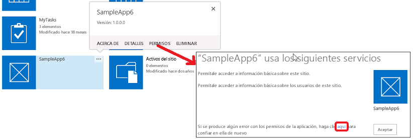

# Permisos de complemento en SharePoint 2013
Información sobre los permisos de complementos en SharePoint, incluidos los tipos de permisos de complementos, los ámbitos de solicitud de permisos y la administración de permisos. En este artículo también se explican las diferencias entre los derechos de permiso de complementos, los derechos de usuario y los derechos de aplicaciones de Tienda Office.
Antes de leer este artículo debe estar familiarizado con el tema  [Autorización y autenticación de complementos de SharePoint](authorization-and-authentication-of-sharepoint-add-ins.md).


**Vea un vídeo sobre los permisos de complementos.**


## Introducción a los permisos de complementos en SharePoint
<a name="Perm_intro"> </a>

Un Complemento de SharePoint solicita los permisos que necesita durante la instalación al usuario que la instala. El desarrollador de un complemento debe solicitar, a través del archivo de manifiesto del complemento, los permisos que un determinado complemento necesita poder ejecutar. (El usuario que ejecuta el complemento debe conceder permisos en tiempo de ejecución a las aplicaciones web y de dispositivo que accedan a SharePoint pero que no estén instaladas en sitios web de SharePoint. Para más información, vea  [Introducción a los complementos que solicitan permiso de acceso a SharePoint sobre la marcha](authorization-code-oauth-flow-for-sharepoint-add-ins.md#Overview)). Los usuarios solo pueden conceder los permisos que tienen. El usuario debe conceder todos los permisos que el complemento solicita o no conceder ninguno. No se pueden conceder permisos de forma selectiva. (En el caso de los complementos que solicitan permisos sobre la marcha, solo puede ejecutar el complemento un usuario con permisos Administrar en los recursos de SharePoint a los que el complemento quiere acceder, aunque este esté pidiendo permisos inferiores, por ejemplo, de lectura).


Los permisos concedidos al complemento también se almacenan en la base de datos de contenido de la granja de SharePoint o del inquilino de SharePoint Online. No se almacenan con un servicio de token seguro, como Servicio de control de acceso (ACS) de Microsoft Azure. Cuando un usuario concede un permiso de complemento por primera vez, SharePoint obtiene información del complemento desde ACS. Luego, SharePoint almacena la información básica sobre el complemento en el servicio de administración de complementos y en la base de datos de contenido junto con los permisos del complemento. Para más información sobre ACS, consulte  [Crear complementos de SharePoint que usen autorización de baja confianza](creating-sharepoint-add-ins-that-use-low-trust-authorization.md).


Si se elimina un objeto al que un complemento concedió permiso, también se eliminan las concesiones correspondientes. Cuando un objeto al que un complemento concedió permiso se recicla, SharePoint no modifica la concesión correspondiente. Esto es así para que la concesión permanezca intacta si se restaura un objeto desde la Papelera de reciclaje.


Al quitar un complemento, se revocan todos los permisos concedidos a ese complemento en el ámbito del cual se quitó. Esto es así para asegurar que el complemento no pueda usar sus credenciales para seguir accediendo de forma remota a los recursos de SharePoint protegidos después de que un usuario elimine el complemento de SharePoint.


## Descripción de los tipos de permisos de complementos y ámbitos de permisos
<a name="Perm_types"> </a>

Un Complemento de SharePoint usa solicitudes de permisos para especificar los permisos que necesita para su correcto funcionamiento. Las solicitudes de permiso especifican los derechos que necesita un complemento y el ámbito que necesita esos derechos. Estos permisos se solicitan como parte del manifiesto del complemento.


> **NOTA**
> Los ámbitos descritos en esta sección solo se aplican al contenido de la lista y al contenido de la biblioteca. Para más información sobre los ámbitos de otras características, vea la sección  [Descripción de los tipos de permisos de complementos y ámbitos de permisos](#Perm_types) en este artículo.


Los ámbitos de solicitud de permisos indican la ubicación en la jerarquía de SharePoint donde se aplica una solicitud de permiso.


> **NOTA**
> Un Complemento de SharePoint tiene su propia identidad y es una entidad de seguridad, denominada entidad de seguridad de complemento. Al igual que los usuarios y los grupos, una entidad de seguridad de complemento tiene determinados permisos o derechos. La entidad de seguridad de complemento tiene derechos de control total sobre la web de complemento, de modo que solo necesita solicitar permisos a los recursos de SharePoint de la web de host u otras ubicaciones fuera de la web de complementos, Para más información sobre la web de complementos, consulte  [Aspectos importantes del panorama de desarrollo y arquitectura de los complementos para SharePoint](important-aspects-of-the-sharepoint-add-in-architecture-and-development-landscap.md) y [Hospedar webs, webs de complementos y componentes de SharePoint en SharePoint 2013](host-webs-add-in-webs-and-sharepoint-components-in-sharepoint-2013.md). 


SharePoint admite cuatro ámbitos de permisos diferentes dentro de la base de datos de contenido y del inquilino, como se muestra en la Tabla 1. Para los nombres de los ámbitos de permisos se usan URI, que incluyen un prefijo "http:", pero no son direcciones URL y no contienen marcadores de posición. Los ámbitos de permisos de esta tabla y este artículo son cadenas literales.


**Tabla 1. Descripciones y URI del ámbito de solicitud de permisos de complementos de SharePoint**

|||
|:-----|:-----|
|**URI de ámbito** <br/> |**Descripción** <br/> |
|arrendamiento  <br/> http://sharepoint/content/tenant  <br/> |El inquilino donde está instalado el complemento. Incluye todos los elementos secundarios de este ámbito.  <br/> |
|colección de sitios  <br/> http://sharepoint/content/sitecollection  <br/> |La colección de sitios donde está instalado el complemento. Incluye todos los elementos secundarios de este ámbito.  <br/> |
|sitio web  <br/> http://sharepoint/content/sitecollection/web  <br/> |El sitio web donde está instalado el complemento. Incluye todos los elementos secundarios de este ámbito.  <br/> |
|lista  <br/> http://sharepoint/content/sitecollection/web/list  <br/> |Una única lista en el sitio web donde está instalado el complemento. Cuando al usuario que instala el complemento se le pide que conceda permisos, el cuadro de diálogo permite al usuario seleccionar una lista en la que al complemento se le concede permisos. Si el complemento necesita permiso en más de una lista, debe solicitar permiso para el ámbito de web. Además, como el desarrollador no tiene forma de controlar qué lista elige el usuario ni de decirle cuál elegir, debe usar el ámbito de web si hay una lista en la que el complemento  *debe*  tener permiso. (Pero hay una manera de restringir la elección del usuario a determinados subconjuntos de listas. Vea [Ámbito de solicitud de permisos con propiedades asociadas](#AssociatedProperties) a continuación). <br/> |
 
Si se concede permiso a un complemento para uno de los ámbitos, el permiso se aplica a todos los elementos secundarios del ámbito. Por ejemplo, si se concede permiso a un complemento para un sitio web, también se concede permiso al complemento para cada lista contenida en el sitio web y a todos los elementos de lista que se encuentran en cada lista.


Como las solicitudes de permiso se realizan sin información sobre la topología de la colección de sitios donde está instalado el complemento, el ámbito se expresa como un tipo en lugar de la dirección URL de una instancia específica. Estos tipos de ámbito se expresan como URI. Los permisos para recursos almacenados en la base de datos de contenido de SharePoint se organizan bajo el siguiente URI:  `http://sharepoint/content`.


## Entender las diferencias entre derechos de permisos de complementos y derechos de usuarios
<a name="Perm_diff"> </a>

Los permisos indican las actividades que puede hacer un complemento dentro del ámbito solicitado. SharePoint admite cuatro niveles de derechos en la base de datos de contenido. Para cada ámbito, un complemento puede tener los siguientes derechos:


- Read


- Write


- Manage


- FullControl


> **NOTA**
> Para más información sobre qué derechos Read, Write, Manage y FullControl incluye, vea  [Planear la administración de permisos de aplicaciones en SharePoint 2013](https://technet.microsoft.com/es-es/library/jj219576%28office.15%29.aspx). 


> **NOTA**
> Estos derechos se corresponden con los niveles de permisos de usuario predeterminados de SharePoint: Reader, Contributor, Designer y Full Control. Para más información, vea  [Permisos de usuario y niveles de permisos](http://technet.microsoft.com/es-es/library/cc288074.aspx). > Los nombres de derechos de complementos no coinciden con los nombres de derechos de roles de usuario de SharePoint, para evitar confusiones entre derechos de complementos y derechos de roles de usuario. Dado que la personalización de permisos asociados a roles de usuarios de SharePoint no afecta a los niveles de solicitud de permisos de complementos, los nombres de derechos de complementos no coinciden con los roles de usuario de SharePoint correspondientes, excepto Full Control, que no se puede personalizar con la interfaz de usuario de administración de permisos. 


Además:


- Solo para Search, un complemento puede tener derecho Query.


- En algunos ámbitos de Microsoft Project Server 2013, también existen los derechos SubmitStatus o Elevate. En la mayoría de ámbitos de Project Server 2013, solo están disponibles los derechos Read y Write. Para más información, vea la sección  [Descripción de los tipos de permisos de complementos y ámbitos de permisos](#Perm_types) de este artículo.


- En taxonomía, solo están disponibles los derechos Read y Write.


> **NOTA**
> Las aplicaciones de Tienda Office tienen algunas restricciones sobre el tipo de derechos que puede solicitar un complemento. Para más información, vea la sección  [Descripción de los tipos de permisos de complementos y ámbitos de permisos](#Perm_types) de este artículo.


A diferencia de los roles de usuario de SharePoint, los niveles de estos derechos no se pueden personalizar. Esto es para garantizar que cuando, se concede una solicitud de permiso a un complemento, se le garantiza un conjunto predecible de capacidades al complemento y no se tiene en cuenta la posibilidad de concederle menos permisos de lo que se espera.


Un usuario no puede conceder a un complemento permisos que él mismo no tenga. Si un usuario intenta instalar un complemento que necesita más permisos de los que el usuario tiene, se muestra un mensaje de error al usuario informándole que no tiene permisos suficientes para conceder lo que solicita al complemento.


Los permisos que SharePoint no conoce, se ignoran. Esto significa que, si un complemento solicita un permiso que SharePoint no reconoce, todavía se puede instalar el complemento, pero no se pide al usuario que conceda el permiso y no se concede el permiso para el complemento.


## Información sobre los ámbitos y permisos disponibles, y sobre las restricciones en los permisos de aplicaciones de la Tienda Office
<a name="Perm_rightlist"> </a>

Los diferentes ámbitos tienen disponibles conjuntos de derechos distintos para que un complemento los solicite. En esta sección se describen los conjuntos de derechos disponibles para cada ámbito. También se destacan las restricciones para los Complementos de SharePoint que se venden en la Tienda Office.


### Derechos de las aplicacines de Tienda Office

Para las aplicaciones de la Tienda Office solo se permiten los derechos Read, Write y Manage. Si trata de enviar una aplicación a la Tienda Office que necesite derechos FullControl, el envío de la aplicación se bloquea. Como el bloqueo se realiza en la canalización de envío de la Tienda Office, las aplicaciones que necesitan más que permisos Manage se pueden seguir enviando mediante el catálogo de complementos.


### Ámbitos de solicitud de permisos para contenido de la lista y contenido de la biblioteca
<a name="PermissionsForLists"> </a>

La tabla 2 muestra el ámbito de solicitud de permisos para el contenido de la biblioteca y la lista. También enumera los derechos que se pueden especificar para cada URI de ámbito.


> **NOTA**
> Los URI usados en la tabla son valores literales. 


**Tabla 2. URI del ámbito de solicitud de permisos de complementos de SharePoint y derechos disponibles**

|||
|:-----|:-----|
|**URI de ámbito** <br/> |**Derechos disponibles** <br/> |
|http://sharepoint/content/sitecollection  <br/> |Read, Write, Manage, FullControl  <br/> |
|http://sharepoint/content/sitecollection/web  <br/> |Read, Write, Manage, FullControl  <br/> |
|http://sharepoint/content/sitecollection/web/list  <br/> |Read, Write, Manage, FullControl  <br/> |
|http://sharepoint/content/tenant  <br/> |Read, Write, Manage, FullControl  <br/> |
 
El siguiente código muestra cómo usar derechos y ámbitos de permisos en el archivo AppManifest.xml. En el primer ejemplo, un complemento solicita acceso Write en el ámbito de la lista.



```XML

<?xml version="1.0" encoding="utf-8" ?>
<App xmlns="http://schemas.microsoft.com/sharepoint/2012/app/manifest"
     ProductID="{4a07f3bd-803d-45f2-a710-b9e944c3396e}"
     Version="1.0.0.0"
     SharePointMinVersion="15.0.0.0"
     Name="MySampleAddIn"
>
  <Properties>
    <Title>My Sample Add-in</Title>
    <StartPage>~remoteAppUrl/Home.aspx?{StandardTokens}</StartPage>
  </Properties>

  <AppPrincipal>
    <RemoteWebApplication ClientId="1ee82b34-7c1b-471b-b27e-ff272accd564" />
  </AppPrincipal>

  <AppPermissionRequests>
    <AppPermissionRequest Scope="http://sharepoint/content/sitecollection/web/list" Right="Write"/>
  </AppPermissionRequests>
</App>
```

El siguiente código muestra un complemento que solicita acceso Read en el ámbito de la web y acceso Write en el ámbito de la lista.



```XML

<?xml version="1.0" encoding="utf-8" ?>
<App xmlns="http://schemas.microsoft.com/sharepoint/2012/app/manifest"
     ProductID="{4a07f3bd-803d-45f2-a710-b9e944c3396e}"
     Version="1.0.0.0"
     SharePointMinVersion="15.0.0.0"
     Name="MySampleAddIn"
>
  <Properties>
    <Title>My Sample Add-in</Title>
    <StartPage>~remoteAppUrl/Home.aspx?{StandardTokens}</StartPage>
  </Properties>

  <AppPrincipal>
    <RemoteWebApplication ClientId="6daebfdd-6516-4506-a7a9-168862921986" />
  </AppPrincipal>

  <AppPermissionRequests>
    <AppPermissionRequest Scope="http://sharepoint/content/sitecollection/web" Right="Read"/>
    <AppPermissionRequest Scope="http://sharepoint/content/sitecollection/web/list" Right="Write"/>
  </AppPermissionRequests>
</App>
```


### Ámbitos de solicitud de permisos para otras características de SharePoint
<a name="PermissionsForLists"> </a>

El ámbito de solicitud de permisos para otras características de SharePoint se enumera en las tablas siguientes. 


> **NOTA**
> Los URI usados en las tablas son valores literales. 


La tabla 3 muestra el ámbito de solicitud de permisos para Servicios de conectividad empresarial (BCS) . También enumera los derechos que se pueden especificar para dicho URI de ámbito.


**Tabla 3. URI del ámbito de solicitud de permisos de complementos de BCS y derechos disponibles**

|||
|:-----|:-----|
|**URI de ámbito** <br/> |**Derechos disponibles** <br/> |
|http://sharepoint/bcs/connection  <br/> |Read  <br/> |
 

> **NOTA**
> Para más información sobre el ámbito de solicitud de permisos de complementos de BCS, vea  [Servicios de conectividad empresarial de SharePoint 2013](http://msdn.microsoft.com/library/64b7d032-4b83-4e9e-bc08-f0a161af5457%28Office.15%29.aspx). 


La tabla 4 muestra el ámbito de solicitud de permisos para Search. También enumera los derechos que se pueden especificar para dicho URI de ámbito.


**Tabla 4. URI del ámbito de solicitud de permisos de complementos de Search y derechos disponibles**

|||
|:-----|:-----|
|**URI de ámbito** <br/> |**Derechos disponibles** <br/> |
|http://sharepoint/search  <br/> |QueryAsUserIgnoreAppPrincipal  <br/> |
 

> **NOTA**
> Para más información sobre el ámbito de solicitud de permisos de complementos de Search, vea  [Buscar en SharePoint 2013](http://msdn.microsoft.com/library/59220f81-0e5e-4945-8056-cf0a116446cb%28Office.15%29.aspx). 


La tabla 5 muestra el ámbito de solicitud de permisos para Project Server 2013. También enumera los derechos que se pueden especificar para cada URI de ámbito.


> **NOTA**
> Un complemento que usa servicios y características de Project Server 2013 se debe probar en un entorno que tenga los servicios y las características necesarias de Project Server. El ensamblado del proveedor de permisos de Project Server 2013 que conoce los ámbitos de permisos de Project Server 2013 no se instala de forma predeterminada con SharePoint Server. Para más información, vea la documentación del desarrollador de Project Server 2013. 


**Tabla 5. URI del ámbito de solicitud de permisos de complementos de Project Server y derechos disponibles**

|||
|:-----|:-----|
|**Ámbito** <br/> |**Derechos disponibles** <br/> |
|http://sharepoint/projectserver  <br/> |Manage  <br/> |
|http://sharepoint/projectserver/projects  <br/> |Read, Write  <br/> |
|http://sharepoint/projectserver/projects/project  <br/> |Read, Write  <br/> |
|http://sharepoint/projectserver/enterpriseresources  <br/> |Read, Write  <br/> |
|http://sharepoint/projectserver/statusing  <br/> |SubmitStatus  <br/> |
|http://sharepoint/projectserver/reporting  <br/> |Read  <br/> |
|http://sharepoint/projectserver/workflow  <br/> |Elevate  <br/> |
 


La tabla 6 muestra el ámbito de solicitud de permisos para funciones sociales. También enumera los derechos que se pueden especificar para cada URI de ámbito.


**Tabla 6. URI del ámbito de solicitud de permisos de complementos de funciones sociales y derechos disponibles**

|||
|:-----|:-----|
|**URI de ámbito** <br/> |**Derechos disponibles** <br/> |
|http://sharepoint/social/tenant  <br/> |Read, Write, Manage, FullControl  <br/> |
|http://sharepoint/social/core  <br/> |Read, Write, Manage, FullControl  <br/> |
|http://sharepoint/social/microfeed  <br/> |Read, Write, Manage, FullControl  <br/> |
 

> **NOTA**
> Para más información sobre el ámbito de solicitud de permisos de complementos de funciones sociales, vea  [Solicitudes de permiso de complementos para acceder a funciones sociales](http://msdn.microsoft.com/library/8852ce36-8309-45a7-a141-2e10ac17a123%28Office.15%29.aspx#bkmk_AppPerms). 


La tabla 7 muestra el ámbito de solicitud de permisos para taxonomía. También enumera los derechos que se pueden especificar para dicho URI de ámbito.


**Tabla 7. URI del ámbito de solicitud de permisos de complementos de taxonomía y derechos disponibles**

|||
|:-----|:-----|
|**URI de ámbito** <br/> |**Derechos disponibles** <br/> |
|http://sharepoint/taxonomy  <br/> |Read, Write  <br/> |
 

> **NOTA**
> Para más información sobre el ámbito de solicitud de permisos de complementos de taxonomía, vea  [Agregar capacidades de SharePoint 2013](http://msdn.microsoft.com/library/11ecb65e-6dc5-4cf1-80ca-3c16418697b6%28Office.15%29.aspx). 


### Ámbito de solicitud de permisos con propiedades asociadas
<a name="AssociatedProperties"> </a>

El ámbito de solicitud de permisos de lista tiene una propiedad adicional que es opcional. El ámbito de lista puede tomar una propiedad con el nombre **BaseTemplateId** y un valor entero correspondiente con una plantilla base de lista, como se muestra en el ejemplo de marcado siguiente. Sin un identificador de plantilla base, el usuario que instala el complemento tiene la opción de concederle permiso a *una lista*  de todas las que hay en la web. Al especificar un identificador de plantilla base, se limita la elección del usuario en relación con el conjunto de listas que coinciden con lo especificado en la propiedad **BaseTemplateId**.


La propiedad **BaseTemplateId** es un elemento secundario, no un atributo del elemento **AppPermissionRequest**. El siguiente código muestra cómo usar la propiedad **BaseTemplateId**.



```XML

<AppPermissionRequest Scope="http://sharepoint/content/sitecollection/web/list" Right="Write">
  <Property Name="BaseTemplateId" Value="101"/>
</AppPermissionRequest>
```


**Tabla 7. Ámbito de solicitud de permisos con propiedades asociadas**

||||
|:-----|:-----|:-----|
|**URI de ámbito** <br/> |**Propiedad** <br/> |**Tipo** <br/> |
|http://sharepoint/content/sitecollection/web/list  <br/> |**BaseTemplateId** <br/> |Integer  <br /><br /> **NOTA**<br /> Para más información sobre **BaseTemplateId** y el correspondiente valor entero para la plantilla de lista base, vea el atributo **Type** de [Elemento List (Lista)](http://msdn.microsoft.com/library/b2b26fee-eb45-48ac-99f1-65f725da293f%28Office.15%29.aspx).           |
 

## Administrar y solucionar problemas de permisos de complementos
<a name="Perm_manage"> </a>

Los permisos para los Complementos de SharePoint instalados en SharePoint se conceden cuando se instalan. Los permisos para los complementos que se instalan en otras plataformas pero que acceden a SharePoint los conceden, en tiempo de ejecución, el usuario que ejecuta el complemento. En ocasiones, el primer tipo de complemento puede perder sus permisos. Para volver a conceder los permisos a los complementos, siga estos pasos:


1. En la página **Contenido del sitio** del sitio web donde el complemento parece haber perdido los permisos, haga clic en el botón **…** del título del complemento. Se abrirá un globo con un vínculo **PERMISOS** u otro botón **…**. 


2. Haga clic en el vínculo **PERMISOS** si está ahí y vaya al paso siguiente, o haga clic en el botón **…**.


3. Haga clic en el vínculo **Permisos**.


4. En la página que se abre, haga clic en el vínculo **aquí** en la última frase. Se volverán a conceder los permisos al complemento y el explorador se redirigirá de nuevo a la página **Contenido del sitio**.





Al desarrollar o solucionar problemas de un complemento, en ocasiones querrá cambiar o volver a conceder los permisos de un complemento que ya está instalado. Para ello, siga estos pasos:


1. Navegue a  `http://<SharePointWebSite>/_layouts/15/AppInv.aspx`, donde  _<SharePointWebSite>_ es la dirección URL del sitio web donde está instalado el complemento. Tenga cuidado de no agregar ningún parámetro de consulta a la dirección URL. El formulario que necesita aparece en esta página solo si la dirección URL está exactamente como se indica.


2. Escriba el identificador del complemento, también llamado identificador de cliente, en el cuadro **Id. del complemento** y haga clic en **Búsqueda**. Los demás cuadros del formulario se rellenan con información sobre el complemento.


3. Rellene el cuadro **XML de solicitud de permiso** con las solicitudes de permiso exactamente como las especificaría en un manifiesto de complemento. Encontrará ejemplos en la sección [Ámbitos de solicitud de permisos para contenido de la lista y contenido de la biblioteca](#PermissionsForLists) más arriba. Para información completa sobre la sintaxis, vea [Elemento AppPermissionRequest](http://msdn.microsoft.com/library/4ad90fb0-33b2-aee5-69c2-5b97ca5334f8%28Office.15%29.aspx).


4. Haga clic en **Crear**. 


Los permisos de un complemento para un ámbito específico se revocan cuando se quita de dicho ámbito.


## Sepa por qué los complementos no se pueden ocultar a los usuarios
<a name="CannotBeHidden"> </a>

Un usuario con derechos de exploración en un sitio web de SharePoint puede iniciar cualquier Complemento de SharePoint instalado en el sitio. Si el usuario puede hacer algo con el complemento dependerá de los demás permisos del usuario y del  [tipo de directiva de autorización](add-in-authorization-policy-types-in-sharepoint-2013.md) que usa el complemento. Si el usuario intenta hacer con el complemento algo para lo que no tiene permiso, y la llamada a SharePoint usa la directiva de usuario y complemento, se producirá un error en la llamada.


## Recursos adicionales
<a name="Filename_AdditionalResources"> </a>


-  [Autorización y autenticación de complementos de SharePoint](authorization-and-authentication-of-sharepoint-add-ins.md)


-  [Complementos de SharePoint](sharepoint-add-ins.md)


-  [Configurar un entorno de desarrollo en el nivel local para complementos para SharePoint](set-up-an-on-premises-development-environment-for-sharepoint-add-ins.md)


-  [Empezar a crear complementos hospedados en proveedor para SharePoint](get-started-creating-provider-hosted-sharepoint-add-ins.md)


-  [Empezar a crear complementos hospedados en SharePoint para SharePoint](get-started-creating-sharepoint-hosted-sharepoint-add-ins.md)


