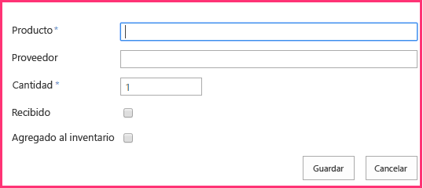
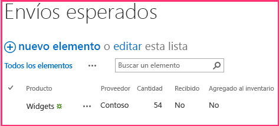

# Agregar operaciones de escritura de SharePoint al complemento hospedado por el proveedor
Aprenda a escribir datos en SharePoint en un Complemento de SharePoint hospedado por el proveedor.
Este es el quinto de una serie de artículos sobre los conceptos básicos de desarrollo de Complementos de SharePoint hospedados por el proveedor. Primero debe familiarizarse con los  [Complementos de SharePoint](sharepoint-add-ins.md) y con los anteriores artículos de esta serie:
  
    
    


-  [Empezar a crear complementos hospedados en proveedor para SharePoint](get-started-creating-provider-hosted-sharepoint-add-ins.md)
    
  
-  [Dar al complemento hospedado por el proveedor la apariencia de SharePoint](give-your-provider-hosted-add-in-the-sharepoint-look-and-feel.md)
    
  
-  [Incluir un botón personalizado en el complemento hospedado por el proveedor](include-a-custom-button-in-the-provider-hosted-add-in.md)
    
  
-  [Obtener una introducción rápida al modelo de objetos de SharePoint](get-a-quick-overview-of-the-sharepoint-object-model.md)
    
  

> [!NOTA]
> Si ha estado trabajando en esta serie sobre complementos hospedados por el proveedor, ya tiene una solución de Visual Studio que puede usar para continuar con este tema. También puede descargar el repositorio en  [SharePoint_Provider-hosted_Add-Ins_Tutorials](https://github.com/OfficeDev/SharePoint_Provider-hosted_Add-ins_Tutorials) y abrir el archivo BeforeSharePointWriteOps.sln.
  
    
    

En este artículo, regresamos a la codificación agregando algunas funciones que escriben datos en el Complemento de SharePoint Chain Store.
## Cambiar el valor de una columna en un elemento de lista de SharePoint

Nuestro complemento tiene un botón de cinta de opciones personalizado que agrega un empleado de la lista **Empleados locales** de la tienda de Hong Kong a la base de datos corporativa. Pero el usuario debe acordarse de cambiar manualmente el valor del campo **Agregado a BD corporativa** aSí. Vamos a agregar código para hacerlo automáticamente.
  
    
    

> [!NOTA]
>  La configuración de los Proyectos de inicio en Visual Studio tiende a volver a los valores predeterminados cuando se vuelve a abrir la solución. Siempre siga estos pasos inmediatamente después de volver a abrir la solución de ejemplo en esta serie de artículos:>  Haga clic con el botón derecho en el nodo de solución en la parte superior del **Explorador de soluciones** y seleccione **Establecer proyectos de inicio**. >  Asegúrese de que los tres proyectos estén establecidos en **Iniciar** en la columna **Acción**. 
  
    
    


1. En el **Explorador de soluciones**, abra el archivo EmployeeAdder.cs.
    
  
2. Agregue la siguiente línea al método **Page_Load**entre la llamada de `AddLocalEmployeeToCorpDB` y la llamada de **Response.Redirect**. Crearemos el método  `SetLocalEmployeeSyncStatus` en el paso siguiente.
    
  ```cs
  
// Write to SharePoint
SetLocalEmployeeSyncStatus();
  ```

3. Agregue el siguiente método nuevo a la clase  `EmployeeAdder`. Tenga en cuenta lo siguiente sobre este código:
    
  - El nombre interno para el campo **Agregado a BD corporativa** es extraño. Los nombres de campos internos no pueden contener espacios, por lo que cuando un usuario crea un campo con espacios en su nombre para mostrar, SharePoint coloca la cadena "_x0020_" en cada espacio cuando establece el nombre interno. Esto convierte "Agregado a BD de empleados" en "Agregado_x0020_a_x0020_BD_x0020_corporativa". Los nombres internos no pueden contener más de 32 caracteres, por lo que el nombre se queda en "Agregado_x0020_a_x0020_BD_x0020_".
    
  
  - Aunque la columna **Agregado a BD corporativa** se conoce como campo del tipo "Sí/No" en la interfaz de usuario de SharePoint, realmente es un valor booleano, por lo que su valor se establece en **true** y no en "Sí".
    
  
  - El método **Update** de la clase **ListItem** debe llamarse para confirmar los cambios en la base de datos de contenido de SharePoint. Es una regla general, pero no del todo universal, que, al cambiar un valor de propiedad de un objeto que se almacena en las bases de datos de SharePoint, debe llamar al método **Update** del objeto.
    
  

  ```cs
  
private void SetLocalEmployeeSyncStatus()
{
    using (var clientContext = spContext.CreateUserClientContextForSPHost())
    {
        List localEmployeesList = clientContext.Web.Lists.GetByTitle("Local Employees");
        ListItem selectedLocalEmployee = localEmployeesList.GetItemById(listItemID);
        selectedLocalEmployee["Added_x0020_to_x0020_Corporate_x"] = true;
        selectedLocalEmployee.Update();
        clientContext.ExecuteQuery();
    }
}
  ```


## Solicitar permiso para escribir en la lista de web de host

Dado que el complemento ahora está escribiendo en la lista a la vez que la lee, necesitamos elevar los permisos que el complemento solicita de Leer a Escribir. Siga estos pasos.
  
    
    

1. En el **Explorador de soluciones**, abra el archivo AppManifest.xml en el proyecto **ChainStore**. 
    
  
2. Abra la ficha **Permisos** y, en el campo **Permiso**, seleccione **Escribir** en la lista desplegable.
    
  
3. Guarde el archivo. 
    
  

## Ejecutar el complemento y probar el botón


  
    
    

1. Use la tecla F5 para implementar y ejecutar el complemento. Visual Studio hospeda la aplicación web remota en IIS Express y hospeda la base de datos SQL en un SQL Express. También hace una instalación temporal del complemento en su sitio de SharePoint de prueba y ejecuta inmediatamente el complemento. Deberá conceder permisos al complemento antes de que se abra la página de inicio. 
    
  
2. En el formulario de permiso, elija **Empleados locales** de la lista y, a continuación, haga clic en **De confianza**.
    
  
3. Cuando se abra la página de inicio del complemento, haga clic en **Volver al sitio** en el control de cromo de la parte superior.
    
  
4. Desde la página principal del sitio web, vaya a **Contenido del sitio | Empleados locales**. Se abrirá la página de vista de lista.
    
  
5. Si no existen empleados en la lista que tengan **No** en la columna **Agregado a BD corporativa**, agregue un empleado a la lista y  *no active la casilla **Agregado a BD corporativa**.* 
    
  
6. En la cinta de opciones, abra la ficha **Elementos**. En la sección **Acciones** de la ficha se encuentra el botón personalizado **Agregar a BD corporativa**.
    
  
7. Seleccione un empleado en la lista que tenga **No** en la columna **Agregado a BD corporativa**.
    
  
8. Presione el botón **Agregar a BD corporativa**.  * **Primero debe seleccionar un elemento.*** 
    
  
9. La página parecerá recargarse porque el método **Page_Load** de la página EmployeeAdder redirige otra vez a ella. El valor del campo **Agregado a BD corporativa** correspondiente al empleado cambió a **Sí**.
    
    > [!NOTA]
      > ¿Qué impide al usuario cambiar manualmente el valor **Agregado a BD corporativa** de una manera que hace que la lista y la base de datos corporativa sean incoherentes? Nada por el momento. Obtendrá la solución a este problema en un artículo posterior de esta serie.
10. Para terminar la sesión de depuración, cierre la ventana del explorador o detenga la depuración en Visual Studio. Cada vez que presione F5, Visual Studio retirará la versión anterior del complemento e instalará la más reciente.
    
  
11. En el proyecto, haga clic con el botón derecho en el **Explorador de soluciones** y elija **Retirar**.
    
  

## Crear una nueva lista personalizada en el sitio web de host

La siguiente mejora en el complemento Chain Store es crear nuevos elementos en una lista en lugar de simplemente cambiar un campo de un elemento existente. En concreto, cuando se realiza un pedido nuevo en el nivel de empresa, se crea automáticamente un elemento en una lista de SharePoint que alerta a los empleados locales de que deben esperar un envío. La lista se denomina **Envíos esperados** y se crea con los pasos siguientes. En un artículo posterior de esta serie, aprenderá a agregar mediante programación una lista personalizada a un sitio web de host, pero por ahora agregaremos esta manualmente.
  
    
    

1. En la página principal de la tienda de Hong Kong de Fabrikam, vaya a **Contenido del sitio | agregar un complemento | Lista personalizada**. 
    
  
2. En el cuadro de diálogo **Agregar lista personalizada**, especifique Envíos esperados como nombre y presione **Crear**. 
    
  
3. En la página **Contenido del sitio**, abra la lista **Envíos esperados**.
    
  
4. Abra la ficha **Lista** en la cinta de opciones y, a continuación, haga clic en el botón **Configuración de la lista**.
    
  
5. En la sección **Columnas** de la página **Configuración de la lista**, haga clic en la columna **Título**. 
    
  
6. En el formulario **Editar columna**, cambie el **Nombre de columna** de Título aProducto y después haga clic en **Aceptar**.
    
  
7. En la página **Configuración**, haga clic en **Crear columna**.
    
  
8. En un artículo anterior de esta serie, aprendimos a crear columnas personalizadas para una lista. Para la lista **Envíos esperados**, agregue cuatro columnas usando los valores de la tabla siguiente. Deje todas las demás opciones con los valores predeterminados.
    

|**Nombre de columna**|**Tipo**|**¿Obligatorio?**|**Valor predeterminado**|
|:-----|:-----|:-----|:-----|
|Proveedor <br/> |**Una línea de texto** <br/> |no es obligatorio  <br/> |ninguno  <br/> |
|Cantidad <br/> |**Número** <br/> |Obligatorio  <br/> |1 <br/> |
|Llegado <br/> |**Sí/No** <br/> |no es obligatorio  <br/> |No <br/> |
|Agregado al inventario <br/> |**Sí/No** <br/> |no es obligatorio  <br/> |No <br/> |
   
9. Después de crear las columnas, en la página de configuración de la lista, haga clic en **Contenido del sitio** para abrir la página **Contenido del sitio**. Abra la lista **Envíos esperados**.
    
  
10. Haga clic en **nuevo elemento**. El formulario de creación del elemento debe ser exactamente igual al siguiente, incluidos los dos asteriscos que indican los campos necesarios:
    
     
  

  

  
11. No queremos crear manualmente elementos en esta lista. Por lo tanto, haga clic en **Cancelar**.
    
  

## Insertar un elemento en una lista de SharePoint

Ahora agregamos una función al complemento que crea un elemento en la lista **Envíos esperados** cada vez que se realiza un pedido para la tienda de Hong Kong en el nivel de empresa.
  
    
    

1. En el **Explorador de soluciones**, abra el archivo OrderForm.aspx.cs.
    
  
2. Agregue una instrucción **using** para **Microsoft.SharePoint.Client** al principio del archivo.
    
  
3. En el método  `btnCreateOrder_Click`, agregue la siguiente línea justo debajo de la llamada a  `CreateOrder`. Crearemos el método CreateExpectedShipment en el paso siguiente.
    
  ```cs
  
CreateExpectedShipment(txtBoxSupplier.Text, txtBoxItemName.Text, quantity);
  ```

4. Agregue el siguiente método a la clase  `OrderForm`. Tenga en cuenta lo siguiente sobre este código:
    
  - Un objeto **ListItem** no se crea con un constructor. Esto es así por cuestiones de rendimiento. Un objeto **ListItem** tiene muchas propiedades (con valores predeterminados). Si se usara un constructor, se incluiría el objeto completo en el mensaje XML que el método **ExecuteQuery** envía al servidor. El objeto **ListItemCreationInformation** es un objeto liviano que solo contiene los valores mínimos que no están predeterminados y que el servidor necesita para crear un objeto **ListItem**. Puede parecer que existe una línea que crea un objeto **ListItem**, pero recuerde que esta línea solo agrega un poco de marcado XML a un mensaje que se envía al servidor. El objeto **ListItem** se crea allí en el servidor.
    
  
  - No es necesario traer el objeto **ListItem** hasta el cliente, por lo que no se realiza ninguna llamada al método **ClientContext.Load**.
    
  
  - No es necesario que el código establezca explícitamente los campos **Llegado** o **Agregado al inventario** porque tienen valores predeterminados de "No", que es lo que queremos.
    
  

  ```
  private void CreateExpectedShipment(string supplier, string product, UInt16 quantity)
{
    using (var clientContext = spContext.CreateUserClientContextForSPHost())
    {
        List expectedShipmentsList = clientContext.Web.Lists.GetByTitle("Expected Shipments");
        ListItemCreationInformation itemCreateInfo = new ListItemCreationInformation();
        ListItem newItem = expectedShipmentsList.AddItem(itemCreateInfo);
        newItem["Title"] = product;
        newItem["Supplier"] = supplier;
        newItem["Quantity"] = quantity;
        newItem.Update();
        clientContext.ExecuteQuery();
    }
}
  ```


## Buscar componentes eliminados

Cualquier usuario con privilegios de propietario de lista para una lista de SharePoint puede eliminar la lista. Además, si la lista está implementada en la web de host mediante un complemento, el propietario del sitio web de la web de host puede eliminarla. Eso puede ocurrir si el propietario decide trabajar sin la funcionalidad de la lista. (Se puede restaurar desde la Papelera de reciclaje de SharePoint si el propietario cambia de opinión). 
  
    
    
El método  `CreateExpectedShipment` depende de la existencia de la lista **Envíos esperados**. Supongamos que el propietario de un sitio web decidió eliminar la lista. Posteriormente, cuando se agrega un pedido con el **Formulario de pedido** del complemento, se llama a `CreateExpectedShipment` y se crea una excepción cuyo mensaje indica que no hay ninguna lista **Envíos esperados** en el sitio web de SharePoint.
  
    
    
Podría querer que el método compruebe  `expectedShipmentsList` para buscar nulidad antes de hacer algo con él. Cuando se trabaja con CSOM, *no*  puede realizar esta comprobación con una estructura simple como esta:
  
    
    
 `if (expectedShipmentsList != null) { ... }`
  
    
    
En su lugar, debe usar una clase especial de CSOM denominada **ConditionalScope**. Las razones de ello están relacionadas con el sistema de procesamiento por lotes de CSOM, que se mencionó en el artículo anterior de esta serie. (Consulte  [Tiempo de ejecución del cliente y procesamiento por lotes](get-a-quick-overview-of-the-sharepoint-object-model.md#CSOMBatching)). **ConditionalScope** y el sistema de procesamiento por lotes son temas avanzados que están fuera del ámbito de esta serie de introducción, pero debería consultar la documentación de MSDN sobre estos temas tras completar esta serie de tutoriales.
  
    
    
Existe una forma alternativa de comprobar la existencia de una lista: en lugar de usar el método **GetByTitle** para obtener una referencia a la lista, puede comprobar si una lista con el nombre especificado se encuentra en la "lista de listas" del sitio web con un código como este.
  
    
    


```cs

var query = from list in clientContext.Web.Lists
             where list.Title == "Expected Shipments" 
             select list; 
IEnumerable<List> matchingLists = clientContext.LoadQuery(query); 
clientContext.ExecuteQuery(); 
if (matchingLists.Count() != 0) 
{ 
    List expectedShipmentsList = matchingLists.Single(); 
    // Do something with the list. 
}
clientContext.ExecuteQuery(); 
```

El código anterior tiene la ventaja de permitirle evitar las complicaciones de la clase **ConditionalScope** y se usa exactamente este mismo código en otra parte de esta serie de artículos. Pero también tiene una desventaja: este código requiere una llamada adicional de **ExecuteQuery** únicamente para obtener el valor que desea comprobar en la instrucción **if**. Si se usa esta técnica en el  `CreateExpectedShipment` para comprobar la existencia de la lista, ese método tendrá dos llamadas de **ExecuteQuery**, cada una de las cuales realiza una solicitud HTTP desde el servidor web remoto hacia SharePoint. Estas solicitudes son la parte más lenta de cualquier método CSOM, por lo que generalmente se recomienda minimizarlas.
  
    
    
Dejaremos el  `CreateExpectedShipment` tal como está pero, en un complemento de producción, deberá pensar en cómo funcionará el código si se elimina un componente al que hace referencia. Una opción es restaurar mediante programación la lista desde la Papelera de reciclaje, pero eso podría molestar a los usuarios que decidieron eliminar la lista. También debería tener en cuenta que no hacer nada en absoluto para evitar la excepción podría ser la mejor opción. Una excepción de SharePoint advertiría a los usuarios de que la eliminación de la lista interrumpió parte del complemento (la persona que lo eliminó podría no haberse dado cuenta de esto). Un usuario puede decidir luego si quiere restaurar la lista desde la Papelera de reciclaje o trabajar sin la parte de la funcionalidad del complemento que ya no funciona.
  
    
    

## Solicitar permiso para administrar el sitio web

Recuerde que cuando un complemento solicita permiso para Leer o Escribir con el ámbito de Lista, SharePoint le pide al usuario que confíe en el complemento y el cuadro de diálogo contiene una lista desplegable donde el usuario selecciona la lista a la que el complemento debería tener acceso. Se puede seleccionar una sola lista, pero ahora el complemento Chain Store escribe en dos listas diferentes. Para obtener acceso a varias listas, el complemento tiene que solicitar permiso con el ámbito de Web. Siga estos pasos:
  
    
    

1. En el **Explorador de soluciones**, abra el archivo AppManifest.xml en el proyecto **ChainStore**. 
    
  
2. Abra la ficha **Permisos** y, en el campo **Ámbito**, seleccione **Web** en la lista desplegable.
    
  
3. En el campo **Permiso**, seleccione **Escribir** en la lista desplegable.
    
  
4. Guarde el archivo. 
    
  

## Ejecutar el complemento y probar la creación de elementos


  
    
    

1. Use la tecla F5 para implementar y ejecutar el complemento. Visual Studio hospeda la aplicación web remota en IIS Express y hospeda la base de datos SQL en un SQL Express. También hace una instalación temporal del complemento en su sitio de SharePoint de prueba y ejecuta inmediatamente el complemento. Deberá conceder permisos al complemento antes de que se abra la página de inicio. 
    
  
2. Cuando se abra la página de inicio del complemento, haga clic en el vínculo **Formulario de pedido** situado en la parte inferior de la página.
    
  
3. Escriba algunos valores en el formulario y presione **Realizar pedido**.
    
  
4. Use el botón Atrás del explorador para volver a la página de inicio y, a continuación, haga clic en **Volver al sitio** en el control de cromo de la parte superior.
    
  
5. En la página principal de la tienda de Hong Kong, vaya a la página **Contenido del sitio** y abra la lista **Envíos esperados**. Ahora hay un elemento en la lista correspondiente al pedido. La captura de pantalla siguiente es un ejemplo.
    
     
  

  

  
6. Para terminar la sesión de depuración, cierre la ventana del explorador o detenga la depuración en Visual Studio. Cada vez que presione F5, Visual Studio retirará la versión anterior del complemento e instalará la más reciente.
    
  
7. En el proyecto, haga clic con el botón derecho en el **Explorador de soluciones** y elija **Retirar**.
    
  

## 
<a name="Nextsteps"> </a>

 En el siguiente artículo, aprenderá a exponer el formulario de pedido remoto como elemento web en una página de SharePoint: [Incluir un elemento de complemento en el complemento hospedado por el proveedor](include-an-add-in-part-in-the-provider-hosted-add-in.md)
  
    
    

