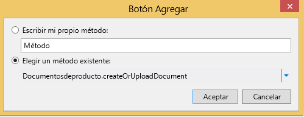

# Asociar una biblioteca de documentos con una entidad
Al usar la característica de biblioteca de documentos en SharePoint, puede crear o cargar documentos asociados con elementos individuales en una lista o entidad. Por ejemplo, podría usar una biblioteca de documentos para almacenar manuales de productos y libros de ventas para cada producto de una lista. En un complemento empresarial de nube, puede asociar una biblioteca de documentos con una entidad al crear una relación.
## Asociación de una biblioteca de documentos

El proceso de asociar una biblioteca de documentos con una entidad implica tres pasos:

1. Agregar una biblioteca de documentos de SharePoint al proyecto como origen de datos.

    > **IMPORTANTE**
      > En primer lugar debe crear una biblioteca de documentos en el sitio de SharePoint. Debe contener una columna personalizada que se asigna a un campo único en la entidad. 
2. Crear una relación entre la biblioteca de documentos y una entidad.

3. Agregar la biblioteca de documentos a una pantalla. El proceso varía según esté creando una nueva pantalla o agregándola a una pantalla existente.

### Para agregar una biblioteca de documentos

1. En el **Explorador de soluciones**, abra el menú contextual del nodo **Orígenes de datos** y elija **Agregar origen de datos**.

2. En el **Asistente para adjuntar orígenes de datos**, elija el icono **SharePoint** y, a continuación, elija el botón **Siguiente**.

3. En la página **Escribir información de conexión**, en el cuadro de texto **Especificar la dirección del sitio de SharePoint**, escriba la dirección URL para el sitio para desarrolladores de SharePoint y, a continuación, elija el botón **Siguiente**.

4. En la página **Elija sus elementos de SharePoint**, en el panel izquierdo, elija el elemento de lista **Bibliotecas de documentos** y, en el panel derecho, active la casilla para su biblioteca de documentos como se muestra en la Figura 1.

   **Figura 1. Selección de la biblioteca de documentos**

La Figura 2 muestra la biblioteca de documentos en el sitio de SharePoint.

   **Figura 2. Observe la columna personalizada ProductName**

> **IMPORTANTE**
> La biblioteca de documentos ya debe existir y debe contener una columna personalizada que se asigna a un campo único en la entidad. 
5. En **Especifique el nombre del origen de datos**, escriba un nombre y, a continuación, elija el botón **Finalizar**.

### Para crear una relación

1. En el ** Explorador de soluciones**, abra la entidad de biblioteca de documentos y, a continuación, en la barra **Perspectiva**, elija la pestaña **Servidor**.

2. En la barra de herramientas, elija **Relación**.

3. En el cuadro de diálogo **Agregar nueva relación**, en la lista desplegable **Para**, elija la entidad que desee asociar, como se muestra en la Figura 3.

   **Figura 3. Creación de una relación.**

4. En la lista desplegable de claves **Externas**, elija la columna personalizada de la biblioteca de documentos.

5. En la lista desplegable de claves **Principales**, elija el campo de la entidad que se asigna a la columna personalizada en la biblioteca de documentos y, a continuación, elija el botón **Aceptar**. Por ejemplo, para una columna personalizada ProductName, elija el campo ProductName, como se muestra en la Figura 4.

   **Figura 4. Claves externas y principales relacionadas**

> **NOTA**
> El campo debe ser del mismo tipo de datos que el campo de claves **Externas**. 

### Para agregar una biblioteca de documentos a un nuevo conjunto de pantallas

1. En el **Explorador de soluciones**, abra la entidad que está asociada con una biblioteca de documentos y, a continuación, en la barra **Perspectiva**, elija la pestaña **HTMLClient**.

2. En la barra de herramientas, elija **Pantalla**.

3. En el cuadro de diálogo **Agregar nueva pantalla**, en el cuadro de texto **Nombre de conjunto de pantallas**, escriba un nombre para el conjunto de pantallas.

4. En la lista **Datos de pantalla**, elija su entidad.

5. En la lista **Datos adicionales que incluir**, active la casilla para la biblioteca de documentos y, a continuación, elija el botón **Aceptar**.

    La Figura 5 muestra una pantalla para una entidad Producto.

   **Figura 5. Conjunto de pantallas de productos**

La pantalla **Vista** que se crea para la entidad contiene una pestaña **Documentos** con un botón **Agregar documento**. El botón muestra un elemento emergente para agregar o cargar documentos.

### Para agregar una biblioteca de documentos a una pantalla existente

1. En el ** Explorador de soluciones**, abra el menú contextual de la pantalla que desea asociar con una biblioteca de documentos y elija **Abrir**.

2. En el diseñador de pantallas, elija el nodo **Fichas** como se muestra en la Figura 6 y, a continuación, elija el nodo **Agregar pestaña**.

   **Figura 6. El nodo Fichas**

3. En la ventana **Propiedades**, elija la propiedad **Nombre para mostrar** y escriba un nombre significativo para la nueva pestaña agregada. Por ejemplo,Documentos.

4. En el panel izquierdo del diseñador de pantallas, elija el vínculo **Agregar** _NombreBibliotecaDocumentos_ como se muestra en la Figura 7, donde _NombreBibliotecaDocumentos_ es el nombre de su biblioteca de documentos.

   **Figura 7. El vínculo NombreBibliotecaDocumentos**

5. En el panel central, elija el nodo para la nueva pestaña, expanda la lista **Agregar** y, a continuación, elija _NombreBibliotecaDocumentos_.

6. Expanda el nodo **Barra de comandos** para la nueva pestaña como se muestra en la Figura 8 y elija **Agregar**.

   **Figura 8. El nodo Barra de comandos**

7. En el cuadro de diálogo **Botón Agregar**, acepte los valores predeterminados y elija el botón **Aceptar**.

    La Figura 9 muestra el cuadro de diálogo **Botón Agregar** con el método predeterminado, **createOrUploadDocument**.

   **Figura 9. El cuadro de diálogo Botón Agregar**

8. En la ventana **Propiedades**, elija la propiedad **Nombre para mostrar** y escriba un nombre significativo para el botón. Por ejemplo,Agregar documento.

    La pantalla ahora contiene una pestaña **Documentos** con un botón en la barra de comandos. El botón muestra un elemento emergente para agregar o cargar documentos.

## Recursos adicionales

-  [Desarrollo de complementos empresariales de nube](develop-cloud-business-add-ins.md)

-  [Administrador de incidentes: Tutorial de complemento empresarial de nube](incident-manager-a-cloud-business-add-in-tutorial.md)

