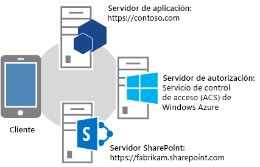
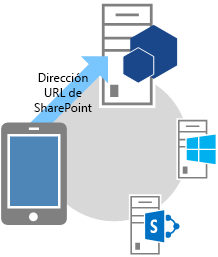
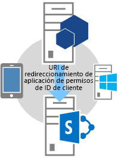
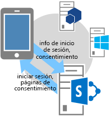
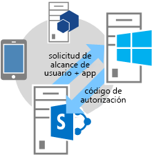
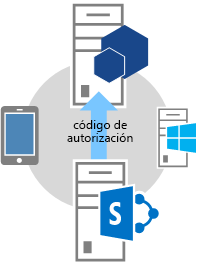
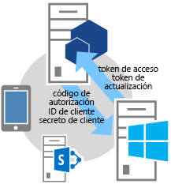
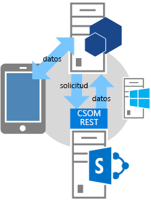

# Flujo de código de autenticación de OAuth para aplicaciones en SharePoint
Conozca el flujo de OAuth para complementos que solicitan permiso para acceder a los recursos de SharePoint sobre la marcha y aprenda a usar la página OAuthAuthorize.aspx y los URI de redireccionamiento de SharePoint.
## Introducción a los complementos que solicitan permiso de acceso a SharePoint sobre la marcha
<a name="Overview"> </a>


> **NOTA**
> En este artículo se da por hecho que conoce cómo  [Crear complementos de SharePoint que usen autorización de baja confianza](creating-sharepoint-add-ins-that-use-low-trust-authorization.md) y los conceptos y principios relativos a OAuth. Para obtener más información sobre OAuth, vea [OAuth.net](http://oauth.net/) y el [Protocolo de autorización web (oauth)](http://datatracker.ietf.org/doc/active/#oauth). 
  
    
    

En algunos escenarios, un complemento puede pedir permiso para acceder a los recursos de SharePoint sobre la marcha; **es decir, un complemento puede pedir permiso para acceder a los recursos de SharePoint de forma dinámica en tiempo de ejecución** en lugar de durante la instalación del complemento. Este tipo de complemento no tiene porqué iniciarse ni instalarse en SharePoint. Podría tratarse, por ejemplo, de un complemento de dispositivo nativo, un complemento que se inicia desde cualquier sitio web o una Complemento de Office que se inicia desde una aplicación de Office que quiere acceder a los recursos de SharePoint sobre la marcha.
  
    
    

> **NOTA**
> Este tipo de complementos solo pueden ejecutarlos usuarios que tienen permisos de administración sobre los recursos a los que el complemento quiere acceder. Por ejemplo, si un complemento solicita solo un permiso de lectura para un sitio web, un usuario que tenga derechos de lectura, pero no de administración, en el sitio web no podrá ejecutar el complemento. 
  
    
    

Para poder llamar a SharePoint, este tipo de **complemento debe registrarse primero** a través del Panel de vendedores o de la página appregnew.aspx. Para más información sobre el registro de complementos a través del Panel de vendedores o de appregnew.aspx, vea [Registrar complementos de SharePoint 2013](register-sharepoint-add-ins-2013.md).
  
    
    
Cuando está registrado, el complemento es una  *entidad de seguridad*  y tiene una identidad, igual que los usuarios y los grupos. Esta identidad se denominaentidad de seguridad del complemento. Al igual que los usuarios y grupos, una entidad de seguridad del complemento tiene ciertos derechos y permisos. Para más información sobre las entidades de seguridad del complemento, vea  [Registrar complementos de SharePoint 2013](register-sharepoint-add-ins-2013.md).
  
    
    
Cuando registre el complemento, recibirá un identificador de cliente, un secreto de cliente, un dominio de complemento y un URI de redireccionamiento para la entidad de seguridad del complemento. Esta información se registra con el servidor de autorización, Servicio de control de acceso (ACS) de Microsoft Azure.
  
    
    

## Flujo de OAuth para complementos que piden permisos sobre la marcha
<a name="Flow"> </a>

En esta sección se resume el flujo de autenticación y autorización de OAuth para un complemento de SharePoint que solicita permisos sobre la marcha. El flujo se denomina **flujo de código de autenticación**. La secuencia describe cómo un complemento que no se inicia desde SharePoint puede acceder a los recursos de SharePoint.
  
    
    

> **NOTA**
> El flujo **implica una serie de interacciones entre su complemento, SharePoint, el servidor de autorización (que es ACS) y el usuario final** en tiempo de ejecución. Por eso, el flujo necesita SharePoint Online o una granja de servidores de SharePoint que esté conectada a Internet para poder comunicarse con ACS. Las granjas de servidores de SharePoint que no están conectadas a Internet deben usar [el sistema de autorización de elevada confianza](creating-sharepoint-add-ins-that-use-high-trust-authorization.md). 
  
    
    

Tiene que haber una aplicación o un servicio web que se hospede separado de SharePoint. Aunque el complemento sea un complemento de dispositivo, tiene que tener una dirección URL de aplicación o servicio web que se pueda registrar con ACS (vea más arriba), aunque el componente web no se use para nada más. Para simplificar, en este artículo se da por hecho que el complemento es una aplicación web llamada Contoso.com. La aplicación usa el modelo de objetos de cliente (CSOM) de SharePoint o las API REST de SharePoint para realizar llamadas a SharePoint. Cuando la aplicación intenta acceder por primera vez a SharePoint, SharePoint solicita un código de autorización a ACS que puede enviar a la aplicación de Contoso.com. Después, la aplicación usa el código de autorización para solicitar un token de acceso a ACS. Cuando tiene el token de acceso, la aplicación de Contoso.com lo incluye en todas sus solicitudes a SharePoint.
  
    
    

### Vea un ejemplo detallado del flujo
<a name="Fly"> </a>

Supongamos que Contoso ofrece un servicio en línea de impresión de fotografías. Un usuario quiere imprimir unas fotos y quiere conceder al servicio de impresión de fotografías de Contoso autorización para acceder e imprimir fotos de un conjunto de bibliotecas de fotos que el usuario tiene en un sitio de SharePoint Online,  `fabrikam.sharepoint.com`.
  
    
    

  
    
    

  
    
    
La aplicación de impresión de fotografías se registra para disponer de un identificador de cliente, un secreto de cliente y un URI de redireccionamiento. El URI de redireccionamiento que Contoso proporcionó durante el registro del complemento es  `https://contoso.com/RedirectAccept.aspx`. La información de identificador de cliente y secreto de cliente se incluye en el archivo web.config de la aplicación de impresión de fotografías. El siguiente es un ejemplo de cómo se especifica la información de identificador de cliente y secreto de cliente en el archivo web.config.
  
    
    


```XML

<configuration>
  <appSettings>
    <add key="ClientId" value="c78d058c-7f82-44ca-a077-fba855e14d38 "/>
    <add key="ClientSecret" value="SbALAKghPXTjbBiLQZP+GnbmN+vrgeCMMvptbgk7T6w= "/>

  </appSettings>

</configuration>
```

Los siguientes son los pasos en el flujo de código de autenticación.
  
    
    

    
> **SUGERENCIA**
> Estos pasos hacen referencia a los métodos del archivo TokenHelper.cs (or .vb). Este código administrado no está compilado, por lo tanto, no hay temas de referencia sobre él. No obstante, el archivo en sí está comentado con descripciones de toda clase, parámetros de miembro y valores devueltos. Contemple tener una copia de este archivo abierta para consultar a medida que lea estos pasos. 
  
    
    


||||
|:-----|:-----|:-----|
|**1** <br/> ||**El cliente abre una aplicación y la dirige a un sitio de SharePoint para los datos.** <br/> Un usuario explora el sitio web de impresión de fotografías de Contoso, donde la interfaz de usuario indica que el usuario puede imprimir fotos que se guardan en cualquier sitio de SharePoint Online. En este ejemplo, la dirección URL es  `https://contoso.com/print/home.aspx`.  <br/> El complemento de impresión de fotografías solicita al usuario que escriba la dirección URL de la colección de fotos. El usuario escribe una dirección URL que apunta a un sitio de SharePoint Online.  `https://fabrikam.sharepoint.com/`.  <br/> |
|**2** <br/> ||**El complemento redirige a la dirección URL de autorización del sitio de SharePoint.** <br/> Cuando el usuario hace clic en el botón para obtener las fotos, el complemento de impresión de fotografías de Contoso redirige el explorador a  `https://fabrikam.sharepoint.com/`. Este redireccionamiento es una respuesta de redireccionamiento HTTP 302.  <br/> Si usa Microsoft .NET, **Response.Redirect** es uno de los distintos modos que existen para redirigir desde el código. Con el archivo TokenHelper.cs (o .vb) del proyecto, su código puede llamar al método **GetAuthorizationUrl** sobrecargado (usando la sobrecarga con tres argumentos). Este método le proporciona la dirección URL de redireccionamiento OAuthAuthorize.aspx. Su código también puede crear manualmente esta dirección URL. <br/> Por ejemplo, si decide llamar al método **GetAuthorizationUrl** para que le proporcione la dirección URL de redireccionamiento OAuthAuthorize.aspx mediante el archivo TokenHelper.cs (o .vb) del proyecto, el código resultante es el siguiente: <br/>  `Response.Redirect(TokenHelper.GetAuthorizationUrl(`           `sharePointSiteUrl.ToString(),`           `"Web.Read List.Write",`           `"https://contoso.com/RedirectAccept.aspx"));` <br/> Si observa la sobrecarga de tres parámetros del método **GetAuthorizationUrl** en TokenHelper.cs (o .vb), podrá ver que el segundo parámetro es un parámetro de ámbito de permisos, que es una lista delimitada por espacios de los permisos que el complemento solicita en formato abreviado. Para obtener más información sobre los ámbitos de permisos, vea [Alias de ámbito de permisos de aplicaciones y uso de la página OAuthAuthorize.aspx](#Scope). El tercer parámetro debe ser el mismo URI de redireccionamiento que se usa cuando se registra el complemento. Para obtener más información sobre el registro, vea  [Registrar complementos de SharePoint 2013](register-sharepoint-add-ins-2013.md). También podrá ver que la cadena devuelta es una dirección URL que incluye parámetros de cadena de consulta.  <br/> Si lo prefiere, puede crear manualmente la dirección URL de redireccionamiento OAuthAuthorize.aspx. En este caso, por ejemplo, la dirección URL a la que el complemento de impresión de fotografías de Contoso redirige al usuario es:  <br/>  `https://fabrikam.sharepoint.com/_layouts/15/OAuthAuthorize.aspx?client_id=client_GUID&amp;scope=app_permissions_list&amp;response_type=code&amp;redirect_uri=redirect_uri` <br/> Tal y como muestra el ejemplo, el complemento de impresión de fotografías de Contoso envía el URI de redireccionamiento y el identificador de cliente de OAuth al sitio de Fabrikam como parámetros de la cadena de consulta. El siguiente es un ejemplo de la solicitud GET con valores de muestra de la cadena de consulta. Los saltos de línea se agregaron para una mayor claridad. La dirección URL real de destino es una sola línea.  <br/>  `GET /authcode HTTP/1.1`           `Host: fabrikam.sharepoint.com`                     `/oauthauthorize.aspx`           `?client_id= c78d058c-7f82-44ca-a077-fba855e14d38`           `&amp;scope=list.read`           `&amp;response_type=code`           `&amp;redirect_uri= https%3A%2F%2Fcontoso%2Ecom%2Fredirectaccept.aspx`           <br/> Si quiere que el consentimiento aparezca en un cuadro de diálogo emergente independiente, puede agregar el parámetro de consulta **IsDlg=1** a la construcción de dirección URL. Por ejemplo: <br/>  `/oauthauthorize.aspx?IsDlg=1&amp;client_id= c78d058c-7f82-44ca-a077-fba855e14d38&amp;scope=list.read&amp;response_type=code&amp;redirect_uri= https%3A%2F%2Fcontoso%2Ecom%2Fredirectaccept.aspx` <br/> |
|**3** <br/> ||**SharePoint muestra la página de consentimiento para que el usuario pueda otorgar los permisos del complemento.** <br/> Si el usuario aún no ha iniciado sesión en el sitio de Fabrikam deSharePoint Online, se le pedirá que lo haga. Cuando el usuario haya iniciado sesión, SharePoint representa una página HTML de consentimiento.  <br/> La página de consentimiento pide al usuario que conceda (o deniegue) al complemento de impresión de fotografías de Contoso los permisos que el complemento solicita. En este caso, el usuario concedería al complemento acceso de lectura a la biblioteca de imágenes del usuario en Fabrikam.  <br/> |
|**4** <br/> ||**SharePoint pide un código de autorización de corta duración a ACS.** <br/> El sitio de Fabrikam de SharePoint Online solicita a ACS la creación de un código de autorización de corta duración (aproximadamente 5 minutos) único para esta combinación de usuario y complemento.  <br/> ACS envía el código de autorización al sitio de Fabrikam.  <br/> |
|**5** <br/> ||**El sitio de SharePoint Online redirige al URI de redireccionamiento registrado de la aplicación y pasa el código de autorización al complemento.** <br/> El sitio de Fabrikam de SharePoint Online redirige el explorador nuevamente a Contoso a través de HTTP 302 Respuesta. La dirección URL de este redireccionamiento usa el URI de redireccionamiento especificado al registrar el complemento de impresión de fotografías. También incluye el código de autorización como una cadena de consulta. La dirección URL de redireccionamiento está estructurada de la siguiente manera:  <br/>  `https://contoso.com/RedirectAccept.aspx?code=<authcode>` <br/> |
|**6** <br/> ||**El complemento usa el código de autorización para pedir un token de acceso a ACS, que valida la solicitud, invalida el código de autorización y, por último, envía tokens de acceso y actualización al complemento.** <br/> Contoso recupera el código de autorización a partir del parámetro de la consulta y lo incluye, junto con el identificador de cliente y el secreto de cliente, en una solicitud a ACS de un token de acceso.  <br/> Si usa código administrado y el CSOM de SharePoint, el archivo TokenHelper.cs (o .vb), el método que realiza la solicitud a ACS es **GetClientContextWithAuthorizationCode**. En este caso, el código tiene un aspecto similar al siguiente (donde  `authCode` es una variable a la que se asignó el código de autorización): <br/>  `TokenHelper.GetClientContextWithAuthorizationCode(`           `"https://fabrikam.sharepoint.com/",`           `"00000003-0000-0ff1-ce00-000000000000",`           `authCode,`           `"1ee82b34-7c1b-471b-b27e-ff272accd564",`           `new Uri(Request.Url.GetLeftPart(UriPartial.Path)));`           <br/> Si observa el archivo TokenHelper.cs (o .vb), el segundo parámetro del método **GetClientContextWithAuthorizationCode** es `targetPrincipalName`. Este valor es siempre la constante " `00000003-0000-0ff1-ce00-000000000000`" en un complemento que obtiene acceso a SharePoint. También verá, si realiza un seguimiento de la jerarquía de las llamadas desde **GetClientContextWithAuthorizationCode**, que obtiene el identificador y el secreto de cliente del archivo web.config.  <br/> ACS recibe la solicitud de Contoso y valida el identificador de cliente, el secreto de cliente, el URI de redireccionamiento y el código de autorización. Si todos son válidos, ACS invalida el código de autorización (solo se puede usar una vez) y crea un token de actualización y un token de acceso que devuelve a Contoso.  <br/> La aplicación Contoso puede almacenar en caché este token de acceso para volver a usarlo en solicitudes posteriores. De forma predeterminada, los tokens de acceso son válidos durante unas 12 horas. Cada token de acceso es específico para la cuenta de usuario indicada en la solicitud de autorización original y solo concede acceso a los servicios que se especifican en la solicitud. Su complemento debe almacenar el token de acceso de forma segura.  <br/> La aplicación Contoso también puede almacenar en caché el token de actualización. De forma predeterminada, los tokens de actualización son válidos durante 6 meses. Cada vez que el token de acceso expira, el token de actualización se puede canjear por un nuevo token de acceso en ACS. Para obtener más información sobre los tokens, vea  [Administrar tokens de seguridad en complementos de confianza baja hospedados por el proveedor para SharePoint](handle-security-tokens-in-provider-hosted-low-trust-sharepoint-add-ins.md).  <br/> |
|**7** <br/> ||**Ahora, el complemento puede usar el token de acceso para solicitar datos del sitio de SharePoint que puede mostrar al usuario.** <br/> Contoso incluye el token de acceso para hacer una llamada a la API REST o enviar una solicitud de CSOM a SharePoint, pasando el token de acceso de OAuth que hay en el encabezado HTTP **Authorization**.  <br/> SharePoint devuelve la información que Contoso solicitó. Para obtener más información sobre cómo se realiza esta información, vea  [Administrar tokens de seguridad en complementos de confianza baja hospedados por el proveedor para SharePoint](handle-security-tokens-in-provider-hosted-low-trust-sharepoint-add-ins.md).  <br/> |
   

## Alias de ámbito de permisos de aplicaciones y uso de la página OAuthAuthorize.aspx
<a name="Scope"> </a>

En esta sección se da por hecho que está familiarizado con el artículo  [Permisos de complemento en SharePoint 2013](add-in-permissions-in-sharepoint-2013.md). La tabla 1 muestra los mismos URI de ámbito de solicitud de permisos de complemento que se indican en ese artículo, excepto que esta tabla tiene una columna más ( **Alias de ámbito** ) y el derecho FullControl no está disponible en la columna **Derechos disponibles** porque un complemento que solicita permiso para acceder a los recursos de SharePoint sobre la marcha no pueden solicitar derechos de control total.
  
    
    
Los valores indicados en la columna **Alias de ámbito** son versiones abreviadas de sus equivalentes de la columna **URI de ámbito**. Los alias solo los pueden usar complementos que solicitan permiso para acceder a los recursos de SharePoint sobre la marcha. (Los valores de URI de ámbito se usan en el manifiesto de los complementos que se inician desde SharePoint. Estos complementos solicitan permisos durante la instalación del complemento).
  
    
    
Los alias de ámbito solo se usan cuando se usa la página de redireccionamiento OAuthAuthorize.aspx. Tal y como se muestra en el paso 2 del flujo de OAuth descrito en la sección anterior, cuando el complemento usa código administrado, los alias se usan cuando se llama al método **GetAuthorizationUrl** de TokenHelper.cs (o .vb) en el proyecto. El siguiente es otro ejemplo:
  
    
    


```cs

Response.Redirect(TokenHelper.GetAuthorizationUrl(
    sharePointSiteUrl.ToString(), 
    "Web.Read List.Write ", 
    "https://contoso.com/RedirectAccept.aspx "));
```

El valor del parámetro  _scope_,  `Web.Read List.Write`, es un ejemplo de cómo se pedirían permisos usando el alias de ámbito. El parámetro  _scope_ es un conjunto, delimitado por espacios, de solicitudes de derechos y ámbitos de permisos.
  
    
    
Si no usa código administrado, los alias de ámbito se usan en el campo de ámbito de la dirección URL de redireccionamiento. Por ejemplo:
  
    
    
 `https://fabrikam.sharepoint.com/_layout/15/OAuthAuthorize.aspx?client_id=c78d058c-7f82-44ca-a077-fba855e14d38&amp;scope=list.write&amp;response_type=code&amp;redirect_uri=https%3A%2F%2Fcontoso%2Ecom%2Fredirectaccept.aspx`
  
    
    

> **NOTA**
> Vea la descripción de los ámbitos en  [Permisos de complemento en SharePoint 2013](add-in-permissions-in-sharepoint-2013.md). 
  
    
    


**Tabla 1. URI de ámbito de las solicitudes de permiso de complemento de SharePoint y alias de ámbito correspondientes**

||||
|:-----|:-----|:-----|
|**URI de ámbito** <br/> |**Alias de ámbito** <br/> |**Derechos disponibles** <br/> |
|http://sharepoint/content/sitecollection  <br/> |Site  <br/> |Read, Write, Manage  <br/> |
|http://sharepoint/content/sitecollection/web  <br/> |Web  <br/> |Read, Write, Manage  <br/> |
|http://sharepoint/content/sitecollection/web/list  <br/> |List  <br/> |Read, Write, Manage  <br/> |
|http://sharepoint/content/tenant  <br/> |AllSites  <br/> |Read, Write, Manage  <br/> |
|http://sharepoint/bcs/connection  <br/> |None (no admitido actualmente)  <br/> |Read  <br/> |
|http://sharepoint/search  <br/> |Search  <br/> |QueryAsUserIgnoreAppPrincipal  <br/> |
|http://sharepoint/projectserver  <br/> |ProjectAdmin  <br/> |Manage  <br/> |
|http://sharepoint/projectserver/projects  <br/> |Projects  <br/> |Read, Write  <br/> |
|http://sharepoint/projectserver/projects/project  <br/> |Project  <br/> |Read, Write  <br/> |
|http://sharepoint/projectserver/enterpriseresources  <br/> |ProjectResources  <br/> |Read, Write  <br/> |
|http://sharepoint/projectserver/statusing  <br/> |ProjectStatusing  <br/> |SubmitStatus  <br/> |
|http://sharepoint/projectserver/reporting  <br/> |ProjectReporting  <br/> |Read  <br/> |
|http://sharepoint/projectserver/workflow  <br/> |ProjectWorkflow  <br/> |Elevate  <br/> |
|http://sharepoint/social/tenant  <br/> |AllProfiles  <br/> |Read, Write, Manage  <br/> |
|http://sharepoint/social/core  <br/> |Social  <br/> |Read, Write, Manage  <br/> |
|http://sharepoint/social/microfeed  <br/> |Microfeed  <br/> |Read, Write, Manage  <br/> |
|http://sharepoint/taxonomy  <br/> |TermStore  <br/> |Read, Write  <br/> |
   

## Aprender a usar un URI de redireccionamiento y ver una página de redireccionamiento de muestra
<a name="RedirectURI"> </a>


  
    
    
El **URI de redireccionamiento** que usan los complementos que solicitan permisos sobre la marcha **es el URI al que SharePoint redirige el explorador después de conceder el consentimiento** (con el código de autorización incluido como parámetro de consulta). En el paso 2 de la descripción anterior se ofrece un ejemplo de dónde se codifica el URI en una llamada al método **GetAuthorizationUrl**. Un complemento ASP.NET también puede almacenar el URI de redireccionamiento en el archivo web.config, como se muestra en este ejemplo:
  
    
    


```XML

<configuration>
  <appSettings>
    <add key="RedirectUri" value="https://contoso.com/RedirectAccept.aspx" />
  </appSettings>
<configuration>
```

El valor se puede recuperar con una llamada a  `WebConfigurationManager.AppSettings.Get("RedirectUri")`.
  
    
    
El **extremo en el URI de redireccionamiento obtiene el código de autorización del parámetro del consulta y lo usa para obtener un token de acceso**, que después se puede usar para acceder a SharePoint. Normalmente, el extremo es la misma página, método de controlador o método web que originalmente intentó acceder a SharePoint. Sin embargo, puede ser una página o método que solo recibe el token de autorización y lo redirige después a otra página o método. La página o método especial podría pasar el token de autorización o almacenarlo en caché. (Tiene una duración de 5 minutos). También podría usar el token de autorización para obtener un token de acceso que almacena en caché.
  
    
    
El siguiente es un ejemplo del código subyacente de esa página en una aplicación ASP.NET. Tenga en cuenta lo siguiente acerca del código:
  
    
    

- Usa el archivo TokenHelper.cs generado por Office Developer Tools para Visual Studio.
    
  
- El código da por hecho que hay un parámetro de consulta "code" que guarda un código de autorización. Esto es seguro porque solo SharePoint llama a la página y solo cuando se le pasa un código de autorización.
    
  
- Usa el objeto de contexto de cliente CSOM para acceder a SharePoint, pero también podría haber almacenado en caché ese objeto en el servidor y redirigirlo a otra página.
    
  
- El método **GetClientContextWithAuthorizationCode** usa el código de autenticación para obtener un código de acceso. Después, crea un objeto de contexto de cliente de SharePoint y modifica el controlador del objeto para el evento **ExecutingWebRequest** de manera que el controlador incluirá el token de acceso en todas las solicitudes a SharePoint. En efecto, el token de acceso se almacena en caché dentro del objeto.
    
  
- El método **GetClientContextWithAuthorizationCode** envía la dirección URL de redireccionamiento de nuevo a ACS en el parámetro `rUrl`, pero ACS lo usa como una forma de identificación en caso de que el código de autorización haya sido robado. ACS no lo usa para volver a redirigir, por lo que este código no provoca un bucle infinito.
    
  
- El código no proporciona una manera de tratar un token de acceso expirado. Una vez creado el objeto de contexto de cliente, sigue usando el mismo token de acceso. No usa el token de acceso para nada. Esta es una estrategia apropiada para complementos que se usan solo en sesiones que duran menos que un token de acceso.
    
  
Para ver un ejemplo más complejo que usa el token de actualización para obtener un nuevo token de acceso, vea la sección siguiente.
  
    
    


```cs

public partial class RedirectAccept : System.Web.UI.Page
{
    protected void Page_Load(object sender, EventArgs e)
    {
        string authCode = Request.QueryString["code"];
        Uri rUri = new Uri("https://contoso.com/RedirectAccept.aspx");

        using (ClientContext context = TokenHelper.GetClientContextWithAuthorizationCode(
            "https://fabrikam.sharepoint.com/", 
            "00000003-0000-0ff1-ce00-000000000000",
            authCode,
            "1ee82b34-7c1b-471b-b27e-ff272accd564".
            rUri))
       {
           context.Load(context.Web);
           context.ExecuteQuery();

           Response.Write("<p>" + context.Web.Title + "</p>");
       }
    }
}

```


## Muestra de código subyacente de una página que accede a SharePoint
<a name="Default"> </a>

El siguiente es el código subyacente de una página Default.aspx. Esta página presupone un escenario en el que la página Default es la página de inicio del complemento y también la dirección URL de redireccionamiento registrada del complemento. Tenga en cuenta lo siguiente acerca del código:
  
    
    

- El método **Page_Load** comprueba primero si hay código de autorización en la cadena de consulta. Habrá uno si el explorador fue redirigido a la página por SharePoint. Si hay uno, el código lo usa para obtener un token de actualización nuevo, que almacena en una caché duradera que dura de una sesión a otra.
    
  
- Después, el método comprueba si hay un token de actualización en la memoria caché. 
    
  - Si no hay, obtiene uno indicando a SharePoint los permisos que necesita (permiso Write en el ámbito Web) y pide a SharePoint un código de autorización. Se pide al usuario que conceda el permiso y, si se concede, SharePoint obtiene el código de autorización de ACS y lo envía de nuevo como parámetro de consulta en un redireccionamiento a esta misma página.
    
  
  - Si hay un token de actualización en caché, el método lo usa para obtener un token de acceso directamente de ACS. Igual que en el ejemplo del final de la sección anterior de este artículo, el token de acceso se usa para crear un objeto de contexto de cliente de SharePoint. Usar un token de actualización en caché para obtener un token de acceso directamente de ACS evita la llamada de red adicional a SharePoint al iniciar la sesión, por lo que los usuarios que vuelven a ejecutar la sesión dentro del tiempo de duración del token de actualización en caché experimentan un inicio más rápido.
    
  
- Igual que en el ejemplo del final de la sección anterior, este código no proporciona una manera de tratar con un token de acceso expirado. Una vez creado el objeto de contexto de cliente, sigue usando el mismo token de acceso. Una manera de protegerse contra un token expirado es almacenar en caché el token de acceso, además del token de actualización. Después, modifique el código siguiente para que llame al método **GetAccessToken** solo si no hay un token de acceso no expirado en la memoria caché. Sin embargo, aunque es aceptable tener el token de actualización en la memoria caché del cliente, en una cookie por ejemplo, el token de acceso solo debería estar en una memoria caché de servidor por motivos de seguridad. El token de actualización está cifrado y solo ACS lo puede descifrar. Pero el token de acceso solo está codificado (con codificación en base 64) y puede descodificarse fácilmente con un ataque de tipo "Man-in-the-middle".
    
  
- A continuación se define la clase **TokenCache** a la que se hace referencia en este código.
    
  

```cs

using System;
using System.Collections.Generic;
using System.Linq;
using System.Web;
using System.Web.UI;
using System.Web.UI.WebControls;
using Microsoft.SharePoint.Samples;
using Microsoft.SharePoint.Client;

namespace DynamicAppPermissionRequest
{
    public partial class Default : System.Web.UI.Page
    {
        protected void Page_Load(object sender, EventArgs e)
        {
            Uri sharePointSiteUrl = new Uri("https://fabrikam.sharpoint.com/print/");

            if (Request.QueryString["code"] != null)
            {
                TokenCache.UpdateCacheWithCode(Request, Response, sharePointSiteUrl);
            }

            if (!TokenCache.IsTokenInCache(Request.Cookies))
            {
                Response.Redirect(TokenHelper.GetAuthorizationUrl(sharePointSiteUrl.ToString(), 
                                                                  "Web.Write"));
            }
            else
            {
                string refreshToken = TokenCache.GetCachedRefreshToken(Request.Cookies);
                string accessToken = 
                TokenHelper.GetAccessToken(
                           refreshToken, 
                           "00000003-0000-0ff1-ce00-000000000000", 
                           sharePointSiteUrl.Authority, 
                           TokenHelper.GetRealmFromTargetUrl(sharePointSiteUrl)).AccessToken;

                using (ClientContext context = 
                       TokenHelper.GetClientContextWithAccessToken(sharePointSiteUrl.ToString(), 
                                                                   accessToken))
                {
                    context.Load(context.Web);
                    context.ExecuteQuery();

                    Response.Write("<p>" + context.Web.Title + "</p>");
                }
            }
        }
    }
}
```

El siguiente es código de ejemplo de un módulo de caché de tokens al que el código de muestra anterior llama. Usa cookies como memoria caché. Hay otras opciones de almacenamiento en caché. Para obtener más información, vea  [Administrar tokens de seguridad en complementos de confianza baja hospedados por el proveedor para SharePoint](handle-security-tokens-in-provider-hosted-low-trust-sharepoint-add-ins.md).
  
    
    


```cs

using System;
using System.Collections.Generic;
using System.Linq;
using System.Web;
using Microsoft.SharePoint.Samples;

namespace DynamicAppPermissionRequest
{
    public static class TokenCache
    {
        private const string REFRESH_TOKEN_COOKIE_NAME = "RefreshToken";

        public static void UpdateCacheWithCode(HttpRequest request, 
                                               HttpResponse response, 
                                               Uri targetUri)
        {
            string refreshToken = 
                TokenHelper.GetAccessToken(
                    request.QueryString["code"], 
                    "00000003-0000-0ff1-ce00-000000000000", 
                    targetUri.Authority, 
                    TokenHelper.GetRealmFromTargetUrl(targetUri), 
                    new Uri(request.Url.GetLeftPart(UriPartial.Path)))
                   .RefreshToken;
            SetRefreshTokenCookie(response.Cookies, refreshToken);
            SetRefreshTokenCookie(request.Cookies, refreshToken);
        }

        internal static string GetCachedRefreshToken(HttpCookieCollection requestCookies)
        {
            return GetRefreshTokenFromCookie(requestCookies);
        }

        internal static bool IsTokenInCache(HttpCookieCollection requestCookies)
        {
            return requestCookies[REFRESH_TOKEN_COOKIE_NAME] != null;
        }

        private static string GetRefreshTokenFromCookie(HttpCookieCollection cookies)
        {
            if (cookies[REFRESH_TOKEN_COOKIE_NAME] != null)
            {
                return cookies[REFRESH_TOKEN_COOKIE_NAME].Value;
            }
            else
            {
                return null;
            }
        }

        private static void SetRefreshTokenCookie(HttpCookieCollection cookies, 
                                                  string refreshToken)
        {
            if (cookies[REFRESH_TOKEN_COOKIE_NAME] != null)
            {
                cookies[REFRESH_TOKEN_COOKIE_NAME].Value = refreshToken;
            }
            else
            {
                HttpCookie cookie = new HttpCookie(REFRESH_TOKEN_COOKIE_NAME, 
                                                   refreshToken);
                cookie.Expires = DateTime.Now.AddDays(30);
                cookies.Add(cookie);
            }
        }
    }
}

```


## Recursos adicionales
<a name="AR"> </a>


-  [Autorización y autenticación de complementos de SharePoint](authorization-and-authentication-of-sharepoint-add-ins.md)
    
  
-  [Crear complementos de SharePoint que usen autorización de baja confianza](creating-sharepoint-add-ins-that-use-low-trust-authorization.md)
    
  
-  [Complementos de SharePoint](sharepoint-add-ins.md)
    
  
-  [Configurar un entorno de desarrollo en el nivel local para complementos para SharePoint](set-up-an-on-premises-development-environment-for-sharepoint-add-ins.md)
    
  
-  [Empezar a crear complementos hospedados en proveedor para SharePoint](get-started-creating-provider-hosted-sharepoint-add-ins.md)
    
  
