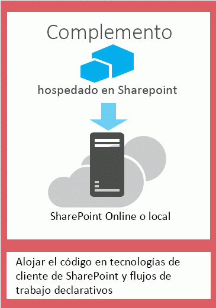

# Elegir patrones para desarrollar y hospedar un complemento para SharePoint
Obtenga información acerca de las diferentes formas de hospedar los componentes de Complementos de SharePoint.
El modelo de complementos de SharePoint 2013 presenta una amplia variedad de patrones de hospedaje y desarrollo. Algunos de estos patrones se pueden usar en combinación con otros. Por ejemplo, los complementos pueden combinar componentes hospedados en SharePoint con otros hospedados de forma remota. La forma más útil de determinar cuáles son los patrones que desea usar es comenzar determinando cuáles son los requisitos, tecnologías y objetivos, y luego hacerlos coincidir con las opciones y posibilidades habilitadas por Complementos de SharePoint.

## Cuestiones que tener en cuenta al elegir el patrón de desarrollo

Complementos de SharePoint amplía el número de posibles pilas de tecnologías y lenguajes de programación que se pueden usar al trabajar con recursos y servicios de SharePoint. El número preciso de opciones depende tanto del tipo de complemento como del patrón de hospedaje que se elija. También es posible combinar patrones.

### Complementos hospedados en SharePoint

Comience con la opción más simple: complementos hospedados en SharePoint, o complementos que tienen todos los componentes hospedados en una granja de servidores SharePoint local o de Office 365. Los complementos hospedados en SharePoint se instalan en un sitio web de SharePoint 2013, denominado web de host. Tienen sus recursos hospedados en un subsitio aislado de una web de host, denominado web de complemento. Es importante conocer  [la diferencia entre las web de host y las web de complemento](host-webs-add-in-webs-and-sharepoint-components-in-sharepoint-2013.md). La figura 1 ilustra la arquitectura básica de un complemento hospedado en SharePoint.

**Figura 1. Arquitectura de complementos hospedados en SharePoint**

Se puede combinar un complemento hospedado en SharePoint con complementos que tienen componentes hospedados de forma remota, pero todos los complementos o partes de un complemento que se ejecutan en una web de complemento tienen el siguiente conjunto de requisitos para tres componentes clave: dónde está hospedado el complemento, cómo obtiene autorización el complemento y qué lenguaje puede usar.

|**Componente**|**Requisito del complemento hospedado en SharePoint**|
|:-----|:-----|
|Dónde están hospedados los componentes del complemento    |En el dominio de complemento aislado de la granja de servicios de SharePoint    |
|Cómo obtiene autorización el complemento    |Los privilegios del usuario que ha iniciado sesión    |
|Qué lenguaje puede usar el complemento    |JavaScript (con la biblioteca JSOM de SharePoint 2013) + HTML    |
 
Este patrón es el más fácil de implementar y se pueden usar las  [Crear un complemento básico hospedado en SharePoint para SharePoint con las herramientas de desarrollo Napa Office 365](create-a-basic-sharepoint-hosted-add-in-by-using-napa-office-365-development-too.md). Tenga en cuenta lo siguiente antes de decidir crear un complemento hospedado en SharePoint.

|**Obtenga estas ventajas**|**Pero tenga en cuenta lo siguiente**|
|:-----|:-----|
|Reusar elementos comunes de SharePoint, como listas y elementos web.    |En el complemento solo se puede usar JavaScript y no se puede usar ningún código del lado servidor.    |
|Relativamente fácil de crear e implementar, así que son una buena opción para complementos de productividad de pequeños equipos y automatización de procesos de negocios, con reglas de negocio de poca complejidad.    |El complemento solo tiene los privilegios de autorización del usuario que ha iniciado sesión.    |
 
 [Empezar a crear complementos hospedados en SharePoint para SharePoint](get-started-creating-sharepoint-hosted-sharepoint-add-ins.md)

### Complementos hospedados por el proveedor

Las Complementos de SharePoint hospedadas por el proveedor incluyen componentes que se implementan y hospedan fuera de la granja de servidores de SharePoint. Las aplicaciones se instalan en la web de host, pero sus componentes remotos se hospedan en otro servidor  *que no debería estar en la granja de servidores de SharePoint*  . La figura 2 ilustra la arquitectura básica de un complemento hospedado por el proveedor.

**Figura 2. Arquitectura de complementos hospedados por el proveedor**

La siguiente tabla muestra cómo los requisitos para la ubicación de hospedaje, la autorización de los complementos y los lenguajes son mucho menos rígidos para los complementos hospedados por el proveedor que para los complementos hospedados en SharePoint.

|**Componente**|**Requisito de los complementos hospedados por el proveedor**|
|:-----|:-----|
|Dónde están hospedados los componentes del complemento    |En cualquier servidor web o servicio de hospedaje    |
|Cómo obtiene autorización el complemento    |OAuth o la biblioteca entre dominios JavaScript    |
|Qué lenguaje puede usar el complemento    |Cualquier lenguaje compatible con el servidor web o servicio de hospedaje    |
 
Un complemento hospedado por el proveedor interactúa con un sitio de SharePoint, pero también usa recursos y servicios ubicados en el sitio remoto. Tenga en cuenta la siguiente información antes de decidir crear un complemento hospedado por el proveedor.

|**Obtenga estas ventajas**|**Pero tenga en cuenta lo siguiente**|
|:-----|:-----|
|Hospedar el complemento en Microsoft Azure o en cualquier plataforma web remota, incluidas plataformas que no son de Microsoft.    |Usted es responsable de crear la lógica de instalación, actualización y desinstalación de los componentes remotos.    |
|Usar uno de los modelos de objetos de cliente de SharePoint, la biblioteca entre dominios de JavaScript, o el  [servicio web basado en REST/OData](http://msdn.microsoft.com/magazine/dn198245.aspx) de SharePoint 2013 para interactuar con SharePoint.   |Cada forma de interactuar con SharePoint tiene  [opciones correspondientes para enfoques de acceso a datos](secure-data-access-and-client-object-models-for-sharepoint-add-ins.md).    |
|Obtenga autorización a los datos de SharePoint mediante uno de  [los tres sistemas de autorización](three-authorization-systems-for-sharepoint-add-ins.md).    |Debe decidir entre OAuth y la biblioteca entre dominios para autorizar el acceso del complemento a SharePoint.    |
 

## Hacer coincidir el patrón de hospedaje con los objetivos de desarrollo

Además de considerar las ventajas y restricciones técnicas de cada opción, también debe pensar en los objetivos de desarrollo a la hora de decidirse por un patrón de hospedaje. Puede usar la siguiente tabla para determinar cuál es el patrón de hospedaje que mejor satisface sus necesidades.

|**Sus requisitos**|**Patrón de hospedaje recomendado**|**Ejemplo**|
|:-----|:-----|:-----|
|Aprovisionar y trabajar exclusivamente con nuevas entidades de SharePoint    |Hospedadas en SharePoint    |Un complemento que incluye un control de selector de personas y que almacena información sobre usuarios de SharePoint en una lista de SharePoint    |
|Usar entidades de SharePoint existentes e interactuar con servicios web externos (no de SharePoint)    |Hospedadas por el proveedor    |Un complemento que obtiene direcciones de los clientes de una lista de SharePoint existente en el web de host y usa un servicio de asignación en una aplicación web para mostrar sus ubicaciones    |
|Aprovisionar nuevas entidades de SharePoint e interactuar con servicios web externos    |Combinación de hospedadas en SharePoint y hospedadas por el proveedor    |Un complemento de asignación que aprovisiona una lista de SharePoint en la web de aplicación de forma que pueda almacenar las coordenadas de latitud y longitud para direcciones suministradas por el usuario o extraídas de una lista de SharePoint existente    |
 

## Cuestiones que tener en cuenta al elegir el patrón de hospedaje para complementos hospedados por el proveedor

Los complementos hospedados en SharePoint tienen un patrón de hospedaje fijo, debido a que están hospedados en la web de complemento. Los complementos hospedados por el proveedor ofrecen más flexibilidad a la hora de hospedar los diferentes componentes del complemento, así que si decide crear uno, deberá hacer coincidir sus objetivos y requisitos con el patrón de hospedaje adecuado. 

### OAuth o la biblioteca entre dominios

Una de las cuestiones más importantes que deberá preguntarse al considerar los complementos hospedados por el proveedor y en cómo construirlos es cómo obtendrá autorización el complemento para interactuar con SharePoint. Los complementos hospedados por el proveedor ofrecen dos opciones: la biblioteca entre dominios JavaScript y OAuth. 

La  [biblioteca entre dominios](access-sharepoint-2013-data-from-add-ins-using-the-cross-domain-library.md) le permite interactuar con más de un dominio desde los componentes remotos del complemento a través de un proxy. Si el código del cliente y los permisos de un usuario que ha iniciado sesión en SharePoint son suficientes, la biblioteca entre dominios es una buena opción. La biblioteca entre dominios también resulta conveniente siempre que tenga que realizar llamadas remotas a través de un firewall.

OAuth es un protocolo abierto para autorización que permite una autorización segura desde aplicaciones cliente (aplicaciones de escritorio, web y móviles) de una forma sencilla y manejable. Si planea crear un complemento para SharePoint que se ejecute en una aplicación web remota y se comunique con SharePoint 2013, a menudo necesitará usar OAuth. El uso de OAuth es necesario siempre que llame a SharePoint desde una aplicación web hospedada remotamente que no pueda usar el código del cliente (HTML + JavaScript) exclusivamente.  [Obtenga más información sobre el funcionamiento de OAuth en complementos para SharePoint.](creating-sharepoint-add-ins-that-use-low-trust-authorization.md)

En  [Acceso a datos seguro y modelos de objetos de cliente para complementos de SharePoint](secure-data-access-and-client-object-models-for-sharepoint-add-ins.md) y [Tres sistemas de autorización para complementos de SharePoint](three-authorization-systems-for-sharepoint-add-ins.md) se explica con mayor detalle la elección entre OAuth y la biblioteca entre dominios.

### OAuth con granjas de servidores de SharePoint locales

Si usa una implementación local de SharePoint 2013, puede usar OAuth, pero tendrá que elegir entre crear complementos de elevada confianza y usar un arrendamiento de Office 365. Office 365 usa el servicio de control de acceso (ACS) de Microsoft Azure como el agente de confianza y, si no tiene que acceder a un arrendamiento de Office 365, tendrá que usar  [Crear complementos de SharePoint de elevada confianza](create-high-trust-sharepoint-add-ins.md), que usa certificados para establecer confianza entre el complemento y SharePoint. Puede agregar complementos de elevada confianza al catálogo de complementos de la granja de servidores de SharePoint, pero no puede venderlos en la Tienda Office. Si tiene acceso a un arrendamiento de Office 365, puede vincularlo a su instalación local de SharePoint 2013 y  [usar el ACS como agente de confianza para los complementos que están instalados en el SharePoint local](use-an-office-365-sharepoint-site-to-authorize-provider-hosted-add-ins-on-an-on.md).

La siguiente tabla enumera todos los posibles patrones para hospedar tanto los componentes de SharePoint como los componentes remotos del complemento, junto con los agentes de confianza disponibles si usa OAuth. Recuerde que deberá tener acceso a un arrendamiento de Office 365 para poder usar el ACS para establecer la confianza entre SharePoint y una Complemento de SharePoint instalada en una instalación local de SharePoint 2013.

|**Ubicación de componentes de SharePoint**|**Ubicación de componentes remotos**|**Agente de confianza**|
|:-----|:-----|:-----|
|Local    |En la nube    |ACS, certificado    |
|Local    |Local    |ACS, certificado    |
|Sitio de SharePoint para Office 365    |En la nube    |ACS    |
|Sitio de SharePoint para Office 365    |Local    |ACS    |
 

## Combinar hospedaje en proveedor y hospedaje en SharePoint

También puede crear complementos que incluyan componentes hospedados en SharePoint y hospedados en la nube. Por ejemplo, puede crear un  [complemento hospedado en la nube que incluya un tipo de contenido y una lista de SharePoint personalizados](create-a-provider-hosted-add-in-that-includes-a-custom-sharepoint-list-and-conte.md). Si decide usar esta arquitectura, su diseño y enfoque deben tener en cuenta las limitaciones de seguridad que están integradas en el modelo. Solo puede usar JavaScript en los componentes del código que están hospedados en SharePoint, y los componentes hospedados remotamente deberán usar OAuth o la biblioteca entre dominios para interactuar con el sitio web de SharePoint. Cuando considere este enfoque, asegúrese de que comprende el  [funcionamiento de la autorización de complementos en SharePoint 2013](authorization-and-authentication-of-sharepoint-add-ins.md). La figura 4 muestra cómo funciona esta arquitectura si usa Microsoft Azure para hospedar los componentes remotos del complemento y usa OAuth.

**Figura 4. Comunicación entre servidores de complementos de SharePoint cuando se usa OAuth y Windows Azure**

 [Aprenda a crear un complemento que combine el hospedaje en la nube y el hospedaje en SharePoint.](create-a-provider-hosted-add-in-that-includes-a-custom-sharepoint-list-and-conte.md)

A continuación enumeramos algunas cuestiones que tener en cuenta cuando considere una combinación de hospedaje en proveedor y en SharePoint.

|**Obtenga estas ventajas**|**Pero tenga en cuenta lo siguiente**|
|:-----|:-----|
|Todas las ventajas de los dos enfoques.    |Una arquitectura más compleja requiere una planificación más cuidadosa en torno a la comunicación de servidor a servidor y las restricciones de scripts entre sitios.    |
 

## Complementos hospedados por proveedores en roles web de Azure

Puede hospedar un Complemento de SharePoint hospedado por proveedor en un rol web de Microsoft Azure, en lugar de una aplicación web (independientemente de si la aplicación web es local o un Sitio web de Azure). Un rol web de Azure es, básicamente, un sitio web basado en Internet Information Services (IIS) que está hospedado en Azure. Puede aprovechar los servicios hospedados y la escalabilidad de los roles web de Azure. También puede mejorar el rendimiento y el uso de Complemento de SharePoint, especialmente si el complemento se usa con frecuencia o si requiere cambios con el paso del tiempo. Si Complemento de SharePoint requiere más recursos de servidor en algún momento, Azure puede asignarlos de forma dinámica al complemento.

Consulte los vínculos siguientes para obtener más información sobre los roles web de Azure.

-  [¿Qué es un servicio en la nube?](http://www.windowsazure.com/es-es/manage/services/cloud-services/what-is-a-cloud-service/)

-  [Introducción a Microsoft Azure](http://www.windowsazure.com/es-es/develop/net/fundamentals/intro-to-windows-azure/)

-  [Escalado automático y Microsoft Azure](http://msdn.microsoft.com/es-es/library/hh680945%28v=pandp.50%29.aspx)

Como requisito previo, necesitará el SDK de Microsoft Azure para .NET (VS 2012) 1.8.1, que puede instalar si usa el  [Instalador de plataforma web](http://www.microsoft.com/web/downloads/platform.aspx).

El método que use para crear el proyecto en vsnv depende de si comienza con un proyecto de un complemento de SharePoint y después agrega el proyecto de rol web de Azure, o bien si comienza con el proyecto de Azure y después agrega el proyecto de SharePoint.

### Agregar un servicio en la nube a un complemento existente

Si ya tiene un Complemento de SharePoint que quiere hospedar en Azure, elija el proyecto de aplicación web en la solución del complemento de SharePoint. En la barra de menús, elija **Proyecto**, **Agregar proyecto de servicio en la nube de Microsoft Azure**. Un proyecto de Azure, llamado  _NombreDeProyectoDeAplicaciónWeb_.Azure, se agrega a la solución para Complemento de SharePoint. También se agrega al proyecto un rol web para el proyecto web del servicio en la nube de Azure. Office Developer Tools para Visual Studio 2012 establece las propiedades necesarias del proyecto para que el rol web pueda trabajar con el Complemento de SharePoint.

### Agregar un complemento a un rol web existente

Si ya tiene un rol web en un servicio en la nube de Azure que quiera usar como un host para un Complemento de SharePoint hospedado por un proveedor, abra el proyecto en la nube Azure en Visual Studio y, a continuación, elija el proyecto de rol web en el **Explorador de soluciones**. En la barra de menús, elija **Proyecto**, **Agregar complemento para proyecto de SharePoint**. Se creará un proyecto para un Complemento de SharePoint hospedado en la nube, llamado  _NombreDeProyectoDeAplicaciónWeb_.Azure, y se agregará a la solución. Visual Studio hace referencia al rol web de Azure como el host del proyecto web para el Complemento de SharePoint.

## Recursos adicionales

Para más información, vea los siguientes recursos:

-  [Aspectos importantes del panorama de desarrollo y arquitectura de los complementos para SharePoint](important-aspects-of-the-sharepoint-add-in-architecture-and-development-landscap.md)

-  [Complementos de SharePoint](sharepoint-add-ins.md)

-  [Hospedar webs, webs de complementos y componentes de SharePoint en SharePoint 2013](host-webs-add-in-webs-and-sharepoint-components-in-sharepoint-2013.md)

-  [Autorización y autenticación de complementos de SharePoint](authorization-and-authentication-of-sharepoint-add-ins.md)

-  [Flujo de tokens de contexto de OAuth para complementos para SharePoint](context-token-oauth-flow-for-sharepoint-add-ins.md)

-  [Usar un sitio de Office 365 SharePoint para autorizar complementos hospedados por el proveedor en un sitio de SharePoint local](use-an-office-365-sharepoint-site-to-authorize-provider-hosted-add-ins-on-an-on.md)

-  [Complementos para SharePoint comparadas con las soluciones de SharePoint](http://msdn.microsoft.com/library/0e9efadb-aaf2-4c0d-afd5-d6cf25c4e7a8%28Office.15%29.aspx)

-  [Empezar a crear complementos hospedados en proveedor para SharePoint](get-started-creating-provider-hosted-sharepoint-add-ins.md)

-  [Empezar a crear complementos hospedados en SharePoint para SharePoint](get-started-creating-sharepoint-hosted-sharepoint-add-ins.md)

-  [Crear un complemento hospedado por el proveedor que incluya un tipo de contenido y una lista de SharePoint personalizados](create-a-provider-hosted-add-in-that-includes-a-custom-sharepoint-list-and-conte.md)

