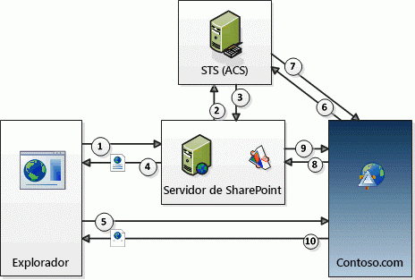

# Flujo de tokens de contexto de OAuth para complementos para SharePoint
Información sobre la autenticación OAuth y el flujo de autorización para complementos hospedados por el proveedor y de confianza baja en SharePoint.
## Información general de OAuth y las Complementos de SharePoint de SharePoint hospedadas por el proveedor

En SharePoint, **el flujo de autenticación y autorización de OAuth para un complemento hospedado por el proveedor y de confianza baja conlleva una serie de interacciones entre el complemento, SharePoint, el servidor de autorización y el explorador** en tiempo de ejecución. El servidor de autorización en este escenario es Servicio de control de acceso (ACS) de Microsoft Azure.
  
    
    
Con un complemento hospedado por el proveedor, tiene un servicio o una aplicación web remota separada de SharePoint y que no forma parte de la granja de servidores de SharePoint o del inquilino de SharePoint Online. Puede hospedarse en la nube o en un servidor local. En este artículo, el componente remoto se llama Contoso.com.
  
    
    

> **NOTA**
> El componente remoto puede hospedar también receptores de eventos que responden a los eventos que se produzcan en elementos de SharePoint, como listas o elementos de lista. Los ejemplos de eventos remotos que Contoso.com podría querer responder son eventos de lista, como agregar o quitar un elemento de lista, o eventos web, como agregar o eliminar un sitio. Para más información sobre cómo crear receptores de eventos remotos, vea  [Crear un receptor de eventos remotos en complementos para SharePoint](create-a-remote-event-receiver-in-sharepoint-add-ins.md). 
  
    
    

Contoso.com usa el modelo de objetos de cliente (CSOM) de SharePoint o las API REST de SharePoint para realizar llamadas a SharePoint. La aplicación de Contoso.com usa un flujo de envío de tokens de OAuth para autenticarse en SharePoint. **SharePoint y Contoso.com no confían la una en la otra, pero ambas confían en ACS** y aceptan los tokens emitidos por ACS. Hay tres tokens implicados: SharePoint hace que ACS cree un token de contexto que SharePoint reenvía a Contoso.com. Contoso.com valida que el token de contexto ha sido emitido por ACS, por lo que confía en él. Después, Contoso.com extrae un token de actualización del token de contexto y lo usa para obtener un token de acceso directamente de ACS. Incluye el token de acceso en todas sus solicitudes a SharePoint. SharePoint valida que el token de acceso ha sido emitido por ACS y responde a las solicitudes de Contoso.com.
  
    
    
 **El código de administración de tokens se proporciona** en el componente remoto (pero si el componente remoto está hospedado en .NET, las Microsoft Office Developer Tools para Visual Studio proporcionan código de muestra que hace la mayor parte del trabajo). Para obtener información detallada sobre el código de administración de tokens, vea [Administrar tokens de seguridad en complementos de confianza baja hospedados por el proveedor para SharePoint](handle-security-tokens-in-provider-hosted-low-trust-sharepoint-add-ins.md).
  
    
    

## Completar los requisitos previos para usar el flujo

Hay que llevar a cabo unos pasos previos antes de que una Complemento de SharePoint pueda usar el flujo de tokens de contexto. 
  
    
    

- Si la Complemento de SharePoint se va a instalar en una granja de servidores de SharePoint local, algunos requisitos de configuración no son aplicables si solo se instala en SharePoint Online:
    
  - La **granja de servidores debe configurarse** para que admita complementos (en realidad, este es un requisito para instalar cualquier Complementos de SharePoint en la granja, aunque no usen el flujo de tokens de contexto). Para más información, vea [Configuración de un entorno para complementos de SharePoint](http://technet.microsoft.com/es-es/library/fp161236%28v=office.15%29.aspx).
    
  
  - El **cliente** que instale el complemento ** debe tener una cuenta de Office 365**. Esto es necesario para obtener acceso a ACS. El cliente no necesita usar su cuenta con ningún otro propósito.
    
  
  - La granja de servidores se debe configurar para compartir la relación de confianza que Office 365 tiene con ACS. Esto se hace fácilmente con scripts de Windows PowerShell. Para obtener información detallada, vea  [Usar un sitio de Office 365 SharePoint para autorizar complementos hospedados por el proveedor en un sitio de SharePoint local](use-an-office-365-sharepoint-site-to-authorize-provider-hosted-add-ins-on-an-on.md).
    
  
- Independientemente de que el complemento se instale en SharePoint Online o en una granja de servidores local de SharePoint, la **Complemento de SharePoint debe registrarse en ACS**. Para más información sobre cómo hacerlo, vea [Registrar complementos de SharePoint 2013](register-sharepoint-add-ins-2013.md). Entre otras cosas, la aplicación proporciona a ACS su identificador de cliente y un secreto de cliente como parte del registro.
    
  

## Pasos del flujo de tokens de contexto

La autenticación OAuth y el flujo de autorización para un complemento de SharePoint hospedado por el proveedor se muestra en la siguiente figura.
  
    
    

**Flujo de tokens de contexto de OAuth**

  
    
    

  
    
    

  
    
    
Estos son los pasos que corresponden a los números de la figura:
  
    
    

  
    
    

1. Un usuario inicia la Complemento de SharePoint desde SharePoint. El diseño del complemento determina cómo se hace:
    
  - Si el complemento está diseñado para exponer la aplicación web remota (en Contoso.com) en un elemento de complemento (que en esencia es un contenedor para un **IFRAME**), iniciar el complemento simplemente significa navegar a una página de SharePoint que contiene el elemento de complemento (si el usuario aún no ha iniciado sesión, SharePoint le pide que lo haga). SharePoint procesa la página y detecta si hay un componente de la aplicación de Contoso.com en la página (para obtener información detallada sobre los elementos de complemento, vea  [Crear elementos del complemento para instalar con el complemento para SharePoint](create-add-in-parts-to-install-with-your-sharepoint-add-in.md)).
    
  
  - Si el complemento está diseñado para usarse en una página completa del explorador, el usuario lo inicia haciendo clic en el icono del complemento, en la página **Site Contents** del sitio web de SharePoint (una variación de esto es cuando el complemento incluye un menú personalizado o un elemento de la cinta de opciones que inicia el componente remoto).
    
  
2. Independientemente de cómo se inicie el complemento, SharePoint debe obtener un token de contexto que pueda enviar a la aplicación de Contoso.com, por lo que pide a ACS que cree un token de contexto con información sobre el contexto de SharePoint, incluido el usuario actual, la dirección URL de la aplicación remota y otra información. También contiene un token de actualización cifrado.
    
  
3. ACS firma el token de contexto con un algoritmo que usa el secreto del complemento de Contoso.com, y lo devuelve a SharePoint. Solo ACS y el complemento de Contoso.com conocen el secreto.
    
  
4. Si la aplicación de Contoso.com se expone en un elemento de complemento, SharePoint representa la página que hospeda el elemento de complemento y agrega el token de contexto a la dirección URL a la que el **IFRAME** del elemento de complemento llama para obtener su contenido. Si la aplicación de Contoso.com está a página completa, SharePoint redirige el explorador a Contoso.com e incluye el token de contexto como parte de la respuesta de redireccionamiento.
    
  
5. El token de contexto se incluye en la solicitud del explorador que se envía al servidor Contoso.com.
    
  
6. El servidor Contoso.com obtiene el token de contexto y valida la firma, lo que puede hacer porque conoce el secreto de cliente. De esta forma, Contoso.com se asegura de que el token fue emitido por ACS y no por un impostor que pretendía ser SharePoint. Contoso.com extrae el token de actualización del token de contexto y lo envía, junto con otra información como el identificador de cliente y el secreto de cliente, a ACS para solicitar un token de acceso que le permitirá acceder a SharePoint.
    
  
7. ACS valida el token de actualización para que quede claro que emitió el token y, después, devuelve un token de acceso a Contoso.com. Contoso.com también puede almacenar en caché este token de acceso para no tener que pedir a ACS un token de acceso cada vez que acceda a SharePoint. De forma predeterminada, los tokens de acceso son válidos durante unas horas cada vez. (En el momento de escribir este artículo, el plazo de expiración predeterminado de los tokens de acceso emitidos por ACS para SharePoint era de 12 horas, pero esto podría cambiar). Cada token de acceso es específico de la cuenta de usuario indicada en la solicitud de autorización original, y concede acceso únicamente al servicio (en este caso, SharePoint) que se especificó en dicha solicitud. Los tokens de actualización tienen una duración mayor (seis meses cuando se escribió este artículo) y también se pueden almacenar en caché. Por lo tanto, el mismo token de actualización se puede canjear por un nuevo token de acceso de ACS hasta que el token de actualización expire (para obtener más información sobre el almacenamiento en caché de tokens, vea  [Administrar tokens de seguridad en complementos de confianza baja hospedados por el proveedor para SharePoint](handle-security-tokens-in-provider-hosted-low-trust-sharepoint-add-ins.md)). Cuando el token de actualización expira, Contoso.com puede conseguir uno nuevo obteniendo un nuevo token de contexto. Para más información sobre cómo se hace esto, vea  [Obtener un nuevo token de contexto](handle-security-tokens-in-provider-hosted-low-trust-sharepoint-add-ins.md#GetNewContextToken).
    
  
8. Contoso.com usa el token de acceso para realizar una llamada a la API REST de SharePoint o una solicitud de CSOM a spnv. Para ello, pasa el token de acceso de OAuth en el encabezado HTTP **Authorization**. (En Office Developer Tools para Visual Studio se proporciona un código de muestra para crear el encabezado si su componente remoto está hospedado en una plataforma .NET).
    
  
9. SharePoint valida el token de acceso para que quede claro que ACS emitió el token. Después, envía a Contoso.com los datos que Contoso.com solicitó, o lleva a cabo la operación de crear, leer, actualizar o eliminar (CRUD) que Contoso.com solicitó.
    
  
10. La página de la aplicación de Contoso.com se representa en el explorador (o en el **IFRAME** del elemento de complemento).
    
  

## Recursos adicionales

-  [Autorización y autenticación de complementos de SharePoint](authorization-and-authentication-of-sharepoint-add-ins.md)
    
  
-  [Permisos de complemento en SharePoint 2013](add-in-permissions-in-sharepoint-2013.md)
    
  
-  [Aspectos importantes del panorama de desarrollo y arquitectura de los complementos para SharePoint](important-aspects-of-the-sharepoint-add-in-architecture-and-development-landscap.md)
    
  
-  [Empezar a crear complementos hospedados en SharePoint para SharePoint](get-started-creating-sharepoint-hosted-sharepoint-add-ins.md)
    
  

