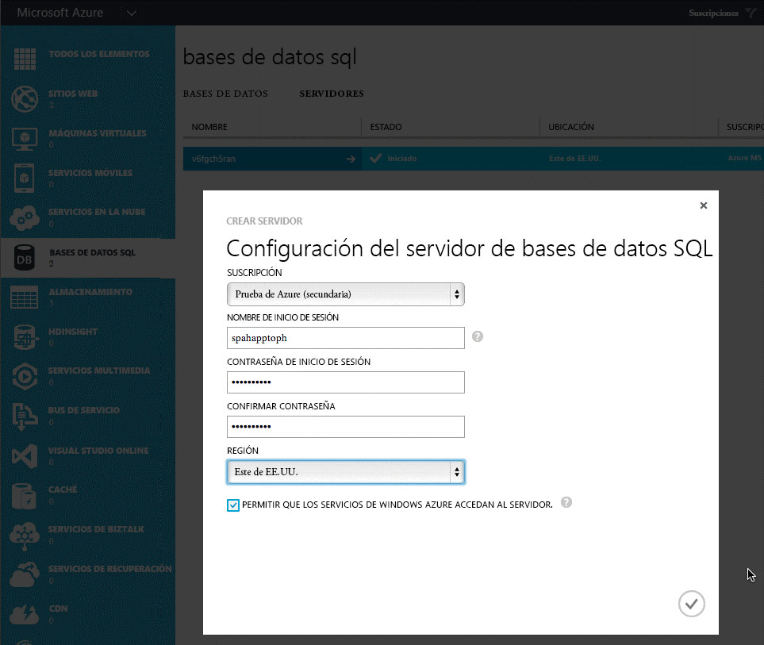
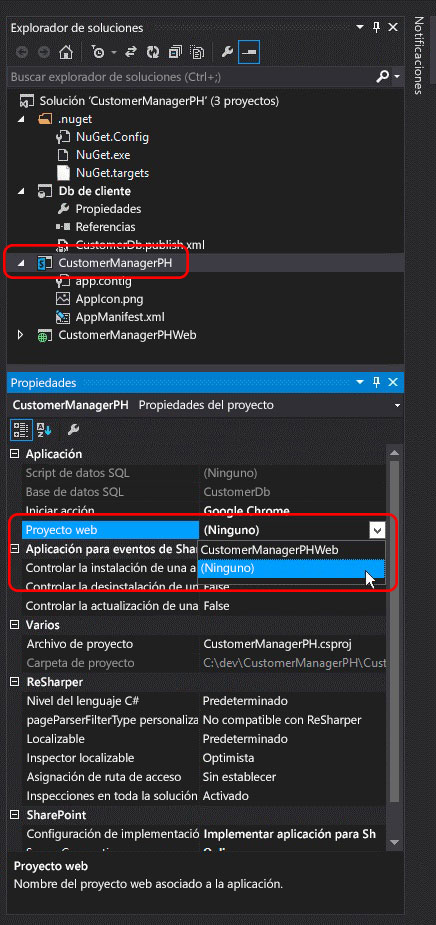

# Convertir un complemento autohospedado por SharePoint en uno hospedado por el proveedor
Obtenga información sobre la conversión de una Complemento de SharePoint autohospedada en un complemento hospedado por el proveedor.
Microsoft SharePoint 2013 sumó el nuevo enfoque de extender sitios de SharePoint al anterior de usar personalizaciones basadas en soluciones. Este nuevo modelo de extensibilidad de SharePoint, llamado modelo de complementos, permite a los desarrolladores crear implementaciones personalizadas que se pueden implementar en entornos de SharePoint independientemente de que se estén ejecutando en una implementación local, SharePoint Online o híbrida.
  
    
    

Los desarrolladores pueden crear dos tipos distintos de complementos para SharePoint. El primero, un complemento hospedado en SharePoint, se ejecuta principalmente en el explorador; todos los activos que lo acompañan, como HTML, CSS, imágenes y JavaScript, se almacenan en SharePoint y son presentados por este. Los otros tipos de complementos pertenecen al modelo de complementos en la nube (CAM) y suelen ejecutarse fuera de SharePoint en otro servidor y se comunican con él mediante el modelo de objetos de cliente (CSOM) y API REST. Establecen una identidad mediante el conocido protocolo OAuth 2.0 compatible con SharePoint 2013.
Anteriormente, los desarrolladores podían implementar complementos mediante el modelo de complementos ya sea como una complemento hospedado por el proveedor o como un complemento autohospedado. Los complementos autohospedados se presentaron como un programa de vista previa durante el lanzamiento de SharePoint 2013, pero en mayo de 2014 Microsoft anunció la terminación del programa de vista previa, y con ello, que dejaría de admitir la creación de complementos autohospedados. Para leer el anuncio, vea  [Actualización sobre el programa de vista previa de los complementos autohospedados](http://blogs.office.com/2014/05/16/update-on-autohosted-apps-preview-program/).
  
    
    

En este artículo se explica cómo convertir un complemento autohospedado en un complemento hospedado por el proveedor y cómo migrarlo. No obstante, es importante que los desarrolladores entiendan algunas diferencias concretas entre los dos enfoques, dado que ese conocimiento simplifica en gran medida el proceso de conversión.
## Requisitos previos para convertir un complemento autohospedado en uno hospedado por el proveedor

- Todos los  [requisitos previos para desarrollar complementos hospedados por el proveedor](get-started-creating-provider-hosted-sharepoint-add-ins.md#SP15createselfhostapp_bk_prereq).
    
  
- Azure SDK v2.3. Se instala desde  [esta página del Centro de descarga](http://azure.microsoft.com/downloads).
    
  

### Conceptos básicos que se deben conocer

Antes de convertir un complemento autohospedado en uno hospedado por el proveedor, debe contar con nociones básicas de las Complementos de SharePoint y las diferencias entre Complementos de SharePoint hospedadas en SharePoint, hospedadas por el proveedor y autohospedadas. Los artículos de la tabla 1 deberían darle esas nociones.
  
    
    

**Tabla 1. Conceptos básicos para convertir un complemento autohospedado en uno hospedado por el proveedor**

|**Título del artículo**|**Descripción**|
|:-----|:-----|
| [Complementos de SharePoint](sharepoint-add-ins.md)   |Obtenga información sobre el nuevo modelo de complementos de SharePoint 2013, que permite crear complementos, que son pequeñas soluciones fáciles de usar para usuarios finales.    |
| [Aspectos importantes del panorama de desarrollo y arquitectura de los complementos para SharePoint](important-aspects-of-the-sharepoint-add-in-architecture-and-development-landscap.md)   |Obtenga información sobre aspectos de la arquitectura de las Complementos de SharePoint y el modelo para aplicaciones para SharePoint, incluidas las opciones de hospedaje de los complementos, las opciones de interfaz de usuario (IU), el sistema de implementación, el sistema de seguridad y el ciclo de vida.    |
| [Elegir patrones para desarrollar y hospedar un complemento para SharePoint](choose-patterns-for-developing-and-hosting-your-sharepoint-add-in.md)   |Obtenga información sobre las distintas maneras de hospedar Complementos de SharePoint.    |
| [Hospedar webs, webs de complementos y componentes de SharePoint en SharePoint 2013](host-webs-add-in-webs-and-sharepoint-components-in-sharepoint-2013.md)   |Obtenga información sobre la distinción entre webs de hosts y webs de complementos. Descubra además qué componentes de SharePoint 2013 se pueden incluir en un complemento para SharePoint, cuáles se implementan en la web de host, cuáles en la web de complemento y cómo se implementa la web de complemento en un dominio aislado.    |
   

## Conversión del complemento

La conversión de una Complemento de SharePoint autohospedada en un complemento hospedado por el proveedor implica la modificación de dos o tres componentes.
  
    
    

- El propio complemento para SharePoint
    
  
- La aplicación web remota o los servicios
    
  
- El Base de datos SQL de Microsoft Azure, si lo hubiera, del complemento
    
  
Un complemento autohospedado de SharePoint implementaba el Sitio web de Azure y el Base de datos SQL de Microsoft Azure automáticamente al instalarse; sin embargo, los complementos hospedados por el proveedor pueden tener su aplicación web remota y otros servicios en cualquier plataforma web. En este artículo se asume que los componentes remotos del complemento autohospedado seguirán siendo servicios de Azure tras la conversión en un complemento hospedado por el proveedor.
  
    
    
En las siguientes secciones se explica el proceso de conversión de un complemento autohospedado en uno hospedado por el proveedor. El complemento autohospedado de ejemplo que se usa, Customer Manager, es simple, para centrarse en los pasos de la conversión y no en el propio complemento. Está compuesta por tres proyectos:
  
    
    

- CustomersDb: un proyecto de Base de datos SQL que creará el *.dacpac necesario. Tenga en cuenta que en este proyecto no hay definido ningún esquema. Simplemente se usa para crear una base de datos, ya que es la aplicación web ASP.NET la que crea el esquema.
    
  
- CustomerManagerAH: un complemento autohospedado de SharePoint configurado de modo que incluya el proyecto de aplicación web ASP.NET y la aplicación de capa de datos SQL de Azure en el paquete de complemento de SharePoint resultante.
    
  
- CustomerManagerAHWeb: una aplicación web MVC ASP.NET que usa el enfoque Migraciones de Code First en Entity Framework para crear el esquema de base de datos así como para leer y escribir en la base de datos.
    
  
El complemento es una aplicación web MVC ASP.NET que puede mostrar los clientes de una tabla en un Base de datos SQL de Microsoft Azure y agregar nuevos clientes. Se trata de una aplicación web anónima que permitirá a cualquiera ver o agregar clientes. La solución de Visual Studio del complemento autohospedado y los proyectos asociados se puede descargar desde el siguiente repositorio público:  [Autohosted-Migration-Code-Samples](https://github.com/OfficeDev/Auto-Hosted-Migration-Code-Samples).
  
    
    
La conversión de un complemento autohospedado de SharePoint 2013 en uno hospedado por el proveedor conlleva muchos pasos. A continuación se ofrece un esquema de todos los pasos.
  
    
    

1. Implementación del Base de datos SQL de Microsoft Azure
    
  
2. Creación del Sitio web de Azure para hospedar la aplicación web remota
    
  
3. Registro del complemento en el sitio de SharePoint
    
  
4. Actualización e implementación del Sitio web de Azure para la aplicación web remota
    
  
5. Actualización e implementación del complemento hospedado por el proveedor de SharePoint
    
  

### Implementación de la Base de datos SQL de Azure

El primer paso para convertir el complemento autohospedado en uno hospedado por el proveedor es implementar el Base de datos SQL de Microsoft Azure del que dependerá la aplicación web ASP.NET. Hay muchas formas distintas de crear un Base de datos SQL de Microsoft Azure, algunas de ellas documentadas en el sitio de documentación de Microsoft Azure:  [Cómo implementar una base de datos en Azure](http://azure.microsoft.com/documentation/articles/sql-database-deploy/).
  
    
    
El enfoque explicado en los siguientes pasos usa el modelo de implementación de aplicaciones de capa de datos, porque ese es el modo en que la base de datos se implementa en un complemento autohospedado de SharePoint. Eso implica crear un paquete de aplicación de capa de datos (*.dacpac) y usarlo para crear la base de datos.
  
    
    

#### Creación e implementación de la base de datos SQL de Azure

Primero abra la solución autohospedada en Visual Studio. Haga clic con el botón secundario en el proyecto de base de datos **CustomerDb** y seleccione **Generar**. Con esto se creará el archivo CustomerDb.dacpac en la carpeta  `[..]\\bin\\[debug | release]`.
  
    
    
El siguiente paso es crear un nuevo Base de datos SQL de Microsoft Azure. Inicie sesión en el **Portal de administración de Azure** (https://manage.windowsazure.com) y una vez cargado el panel, seleccione el vínculo BASES DE DATOS SQL del margen:
  
    
    

**Panel Base de datos SQL de Azure del Portal de administración de Azure**

  
    
    

  
    
    

  
    
    
Haga clic en el vínculo **SERVIDORES** del menú de navegación superior y, a continuación, en el botón **AGREGAR** del pie de página, como se muestra en la siguiente figura:
  
    
    

**Panel Base de datos SQL de Azure del Portal de administración de Azure**

  
    
    

  
    
    

  
    
    
En el cuadro de diálogo **CREAR SERVIDOR** que aparece, seleccione la **SUSCRIPCIÓN**, el **NOMBRE DE INICIO DE SESIÓN** y la **CONTRASEÑA** de Azure del usuario que tendrá derechos en el servidor y seleccione la misma **REGIÓN** usada al crear el Sitio web de Azure anteriormente. Anote el nombre de inicio de sesión y la contraseña, ya que los necesitará en un paso posterior.
  
    
    

**Creación de una Base de datos SQL de Azure en el Portal de administración de Azure**

  
    
    

  
    
    

  
    
    
Una vez rellenado el formulario, haga clic en el **icono de marca de verificación** de la esquina inferior derecha para crear la base de datos. Aunque el servidor ya se ha creado, los únicos recursos que pueden obtener acceso a él son otros servicios de Azure. Anote el nombre del Base de datos SQL de Microsoft Azure, ya que lo necesitará en un paso posterior.
  
    
    
Para conectarse a la Base de datos SQL de Microsoft Azure e implementar la base de datos, hay que crear una regla de firewall que permita el tráfico desde el equipo que implementará la base de datos. De lo contrario, se rechazarán las conexiones a la Base de datos SQL de Microsoft Azure con errores como el de la figura siguiente:
  
    
    

**Error al conectarse a una Base de datos SQL de Azure**

  
    
    

  
    
    

  
    
    
Para crear una regla de firewall, en el **Portal de administración de Azure**, seleccione la Base de datos SQL de Microsoft Azure creada anteriormente y haga clic en el vínculo **CONFIGURAR** del menú de navegación superior. En la sección **Direcciones IP permitidas**, la dirección IP se muestra como en la figura siguiente. Haga clic en **AGREGAR A LAS DIRECCIONES IP PERMITIDAS** para agregar una regla de firewall. Con ello se permitirán las conexiones a la Base de datos SQL de Microsoft Azure y la implementación de la base de datos. Asegúrese de hacer clic en el botón **Guardar** del pie de página.
  
    
    

**Creación de una regla de firewall para una Base de datos SQL de Azure en el Portal de administración de Azure**

  
    
    

  
    
    

  
    
    
El siguiente paso es la implementación de la base de datos. Se puede hacer desde Visual Studio con Azure SDK v2.3. Instálelo desde  [está página del Centro de descarga](http://azure.microsoft.com/downloads). En Visual Studio, abra la ventana de herramientas **Explorador de objetos de SQL Server**, haga clic con el botón secundario en el nodo **SQL Server** y seleccione **Agregar SQL Server**:
  
    
    

**Adición de una Base de datos SQL de Azure en el Explorador de servidores**

  
    
    

  
    
    

  
    
    
En el cuadro de diálogo **Conectar al servidor**, escriba el **Nombre del servidor**, establezca la **Autenticación** en **Autenticación de SQL Server** y escriba los mismos **Inicio de sesión** y **Contraseña** definidos al crear el Base de datos SQL de Microsoft Azure. El nombre del servidor debería ser el nombre completo del servidor, que es `[server-name].database.windows.net`, como se muestra en la siguiente figura:
  
    
    

**Conexión a una Base de datos SQL de Azure en Visual Studio**

  
    
    

  
    
    

  
    
    
Después de conectar al Base de datos SQL de Microsoft Azure, expanda el nodo del servidor recién agregado, haga clic con el botón secundario en el nodo **Bases de datos** y seleccione **Publicar aplicación de capa de datos** para abrir el Asistente para la publicación.
  
    
    
En la sección **Aplicación de capa de datos de origen (.dacpac)**, use el botón **Examinar** para buscar el archivo *.dacpac generado al crear el proyecto de base de datos en un paso anterior y asegúrese de que el **Nombre de la base de datos** esté establecido enCustomerDb; luego haga clic en **Publicar** para publicar CustomerDb en el Base de datos SQL de Microsoft Azure.
  
    
    

**Publicación de una aplicación de capa de datos en una Base de datos SQL de Azure con Visual Studio**

  
    
    

  
    
    

  
    
    
Actualice la ventana de herramientas **Explorador de objetos de SQL Server** de Visual Studio para ver CustomerDb, que aparece en el nodo **Bases de datos**.
  
    
    

    
> **NOTA**
>  En función de la forma de crearse la base de datos del complemento autohospedado, podría necesitarse trabajo adicional para implementarlo en Azure. Consulte los siguientes artículos de MSDN para obtener orientación adicional:
>  [Converting between Data-tier Application Projects and Database Projects](http://msdn.microsoft.com/library/40b51f5a-d52c-44ac-8f84-037a0917af33.aspx)
>  [Creating &amp; Managing Data-Tier Application](http://msdn.microsoft.com/library/18907b6c-7678-4182-9304-fe56fdb9f0bd.aspx)
  
    
    

#### Acciones posteriores a la implementación

Una vez creado el Base de datos SQL de Microsoft Azure, copie la cadena de conexión usada para establecer una conexión a la base de datos. La puede obtener de dos formas. Una es iniciar sesión en el **Portal de administración de Azure** (https://manage.windowsazure.com) e ir al Base de datos SQL de Microsoft Azure creado en el último paso: CustomerDb. En la página **PANEL** de la base de datos, haga clic en el vínculo **Mostrar cadenas de conexión** para ver una lista de cadenas de conexión. Copie la cadena de conexión **ADO.NET** para usarla más tarde.
  
    
    

**Obtención de cadenas de conexión de Base de datos SQL de Azure desde el Portal de administración de Azure**

  
    
    

  
    
    

  
    
    
La otra forma de obtener la cadena de conexión es desde Visual Studio, siempre que esté instalado Azure SDK v2.3. En la ventana de herramientas **Explorador de objetos de SQL Server** de Visual Studio, seleccione la base de datos **CustomerDb**. Una vez seleccionada, mire en la ventana de herramientas **Propiedades** para ver la cadena de conexión. Es el mismo valor obtenido en el **Portal de administración de Azure** arriba.
  
    
    

**Obtención de cadenas de conexión de Base de datos SQL de Azure desde Visual Studio a través del SDK de Azure**

  
    
    

  
    
    

  
    
    

  
    
    

  
    
    

### Creación de un Sitio web de Azure

El siguiente paso es crear un nuevo Sitio web de Azure en el que residirá la aplicación web remota del complemento hospedado por el proveedor. Tiene que hacerse primero porque se necesita la dirección URL de la aplicación web remota antes de registrar el complemento. No obstante, el registro del complemento en SharePoint debe ser anterior a la implementación de los archivos de la aplicación web ASP.NET, ya que hay dos resultados del proceso de registro (el identificador y el secreto de cliente) que se necesitan antes de la implementación de los archivos de la aplicación web ASP.NET.
  
    
    
Para crear un nuevo Sitio web de Azure, inicie sesión en el **Portal de administración de Azure** (https://manage.windowsazure.com). Cuando se cargue el panel, haga clic en el vínculo de navegación **SITIOS WEB** del margen izquierdo y después en el botón **NUEVO** del pie de página, como se ve en la figura siguiente:
  
    
    

**Panel Sitio web de Azure en el Portal de administración de Azure**

  
    
    

  
    
    

  
    
    
A continuación, en el Asistente para sitio web, seleccione **CALCULAR**, **SITIO WEB**, **CREACIÓN RÁPIDA** y especifique una **DIRECCIÓN URL** y un **PLAN DE HOSPEDAJE WEB**. Por último, especifique la **REGIÓN** donde se debe crear el sitio web. Asegúrese de recordar la región seleccionada, ya que se debe usar la misma para el Base de datos SQL de Microsoft Azure creado más tarde. Además, si aún no existe un plan de hospedaje web o se desea uno nuevo, seleccione la opción **Crear nuevo plan de hospedaje web**. En la siguiente figura se muestra un ejemplo:
  
    
    

**Creación de un sitio web de Azure en el Portal de administración de Azure**

  
    
    

  
    
    

  
    
    
Después de crear el Sitio web de Azure, anote la dirección URL que se usa para el sitio. En las figuras anteriores, el sitio creado es  `http://spahapptoph.azurewebsites.net`.
  
    
    

### Registro de un complemento nuevo

Todas las Complementos de SharePoint creadas con el modelo de complementos deben registrarse en el conjunto de servidores o el inquilino de SharePoint de hospedaje para establecer una relación de confianza entre SharePoint y la aplicación web remota. Eso implica registrar una nueva entidad de seguridad del complemento en SharePoint que especifique los siguientes valores:
  
    
    

- **Identificador de cliente**: identificador del complemento
    
  
- **Secreto de cliente**: contraseña del complemento
    
  
- **Título**: nombre del complemento
    
  
- **Dominio de complemento**: dominio de nivel superior de la aplicación web remota
    
  
Cuando se instala un complemento autohospedado en SharePoint Online, Office 365 crea la entidad de seguridad de este automáticamente. Conoce la dirección URL de la aplicación web remota porque crea el sitio automáticamente. También toma el identificador y el secreto de cliente y los agrega al archivo web.config de la aplicación web remota. El archivo web.config es el lugar en que una clase proporcionada por Microsoft (en el archivo TokenHelper.cs o .vb) los buscará al validar solicitudes y autenticar en SharePoint.
  
    
    
Sin embargo, en un complemento hospedado por el proveedor, el desarrollador tiene que registrar el complemento de forma manual y actualizar el archivo web.config en el proyecto web ASP.NET también de forma manual.
  
    
    
Para registrar un complemento nuevo, vaya a la página de registro de complementos del sitio web de SharePoint en el que se instalará el complemento. Esta página está en  `http://[SharePoint-site-url]/_layouts/15/appregnew.aspx`. En la página de registro de complementos, establezca el **Tipo de complemento** en **Complemento que se ejecuta en un servidor web** y haga clic en los dos botones **Generar** para crear un nuevo **Identificador de cliente** y **Secreto de cliente**. Escriba el nombre del complemento en el campo **Título** y la dirección URL del Sitio web de Azure de destino creado en el paso anterior en el campo **Dominio de complemento**. Por último, haga clic en el botón **Crear**.
  
    
    
Una vez registrado el complemento, SharePoint mostrará un resumen de la información empleada en el formulario para crear el registro. Es muy importante copiar esta información para su salvaguarda, específicamente el identificador de cliente y el secreto de cliente, ya que se necesitan posteriormente.
  
    
    

### Cambios de configuración de la aplicación web remota o el Sitio web de Azure

El siguiente paso es volver a configurar la aplicación web remota para que se pueda implementar como un complemento hospedado por el proveedor en lugar de como un complemento autohospedado. Hay varias formas de implementar un sitio ASP.NET en un Sitio web de Azure, lo que incluye implementarlo directamente desde Visual Studio, automáticamente desde un control de código fuente como Visual Studio Online o desde GitHub, o incluso mediante la clásica opción del FTP. En este artículo se usa Visual Studio. No obstante, para poder implementar la aplicación web, necesita unas cuantas actualizaciones para trabajar con el complemento hospedado por el proveedor.
  
    
    

#### Actualización del proyecto de la aplicación web remota

El gran cambio que tiene que ocurrir en la aplicación web MVC ASP.NET es en el archivo web.config. En este archivo hay tres valores dentro del nodo **<appSettings>**. Se trata de **ClientId**, **ClientSecret** y **SqlAzureConnectionString**. Los dos primeros son empleados por la clase proporcionada por Microsoft, en TokenHelper.cs o .vb, para facilitar la autenticación y la comunicación con SharePoint desde la aplicación web remota. El último,  `SqlAzureConnectionString`, lo usa el complemento para conectarse al Base de datos SQL de Microsoft Azure.
  
    
    
En un complemento autohospedado de SharePoint, Office 365 rellena los valores al crear el Sitio web de Azure y el Base de datos SQL de Microsoft Azure cuando se instala el complemento. Sin embargo, en un complemento hospedado por el proveedor, se deben establecer manualmente antes de implementar el complemento.
  
    
    
Una opción es pegar los valores de los tres campos desde los pasos anteriores, pero la desventaja de este enfoque es que si alguna vez hay que cambiarlos, el archivo web.config tendrá que actualizarse y volver a implementarse de forma manual en el Sitio web de Azure.
  
    
    
Otra opción es simplemente borrar estos valores (dejar las claves, simplemente establecer el atributo **value=""** en una cadena vacía) y en su lugar definirlos en la configuración del Sitio web de Azure a través del **Portal de administración de Azure**. Este enfoque significa que los valores se pueden cambiar sin actualizar el código base.
  
    
    
Para ello, inicie sesión en el **Portal de administración de Azure** (https://manage.windowsazure.com) y vaya al Sitio web de Azure creado en los pasos anteriores. En la página del panel del Sitio web de Azure, haga clic en **CONFIGURAR** en el menú de navegación superior y luego desplácese hacia abajo a la sección **Configuración del complemento**. Agregue tres nuevas configuraciones de complemento que tengan los mismos nombres de configuración que el archivo web.config. Use los valores obtenidos en los pasos anteriores para ClientId, ClientSecret y SqlAzureConnectionString.
  
    
    
Asegúrese de que la cadena de conexión del Base de datos SQL de Microsoft Azure es correcta y válida, ya que cuando se expone a través del **Portal de administración de Azure** y Visual Studio, el atributo de contraseña se sustituye por una máscara. La contraseña enmascarada de la cadena de conexión debería cambiarse para usar la contraseña correcta definida al crear el inicio de sesión del Base de datos SQL de Microsoft Azure.
  
    
    

#### Implementación de la aplicación web remota en el Sitio web de Azure

Ahora hay que implementar los archivos de la aplicación web MVC ASP.NET en el Sitio web de Azure como aplicación web remota. En Visual Studio, haga clic con el botón secundario en el proyecto web y seleccione **Publicar**. Así se iniciará el cuadro de diálogo del asistente **Publicación web**. En él, seleccione la opción **Sitios web Windows Azure** y haga clic en **Publicar**.
  
    
    

**Cuadro de diálogo Publicación web de Visual Studio**

  
    
    

  
    
    

  
    
    
En el siguiente paso, seleccione el nombre del Sitio web de Azure creado en un paso anterior como se muestra en la siguiente figura, haga clic en **Aceptar** y asegúrese de que la dirección URL del sitio sea HTTPS.
  
    
    

**Publicación de la aplicación web ASP.NET en un sitio web existente de Azure**

  
    
    

  
    
    

  
    
    
En el último paso, haga clic en el botón **Validar conexión** para garantizar que la configuración y la conexión funcionen correctamente y, por último, haga clic en **Publicar**. Eso hará que Visual Studio implemente la aplicación web ASP.NET en el Sitio web de Azure.
  
    
    
Después de implementar el sitio web, Visual Studio iniciará el explorador de depuración predeterminado e irá al Sitio web de Azure. Sin embargo, el sitio devolverá un error. Eso se debe a que los controladores MVC ASP.NET están equipados con un atributo (en concreto  `SharePointContextFilter`) que espera que SharePoint envíe ciertos valores al controlador en el encabezado de una solicitud POST HTTP, pero de forma predeterminada el explorador inicia una solicitud GET HTTP, así que se trata de un error esperado.
  
    
    

    
> **NOTA**
> Consulte la documentación de Azure para ver más opciones para implementar aplicaciones web ASP.NET en un Sitio web de Azure:  [Cómo implementar un sitio web de Microsoft Azure](http://azure.microsoft.com/documentation/articles/web-sites-deploy). 
  
    
    

#### Acciones posteriores a la implementación

El siguiente paso es copiar la dirección URL del sitio.
  
    
    

#### Dominios personalizados y certificados SSL para Sitios web de Azure

Todos los Sitios web de Azure usan la siguiente convención de nombres:  `http[s]://[site-name].azurewebsites.net`. Microsoft ya ha agregado un certificado SSL comodín a todos los sitios web en el dominio  `*.azurewebsites.net`, pero los clientes pueden asociar un dominio personalizado a su Sitio web de Azure así como usar sus propios certificados SSL para estos dominios personalizados.
  
    
    
Para obtener información sobre el uso de dominios personalizados, consulte la documentación de Azure:  [Configuración de un nombre de dominio personalizado para un sitio web de Microsoft Azure](http://azure.microsoft.com/documentation/articles/web-sites-custom-domain-name). Para obtener información sobre la adición de un certificado SSL personalizado para su nombre de dominio personalizado, consulte la documentación de Azure:  [Habilitación de HTTPS para un sitio web de Microsoft Azure](http://azure.microsoft.com/documentation/articles/web-sites-configure-ssl-certificate).
  
    
    

### Reconfiguración del proyecto de complemento de SharePoint

El último paso es volver a configurar el proyecto de complemento de SharePoint. El proyecto de Visual Studio del complemento de SharePoint tiene el tipo de complemento configurado en autohospedado. Primero cambie este valor por el de "hospedado por el proveedor" abriendo el archivo AppManifest.xml del proyecto de complemento de SharePoint y cambie la opción **Tipo de hospedaje** de **Autohospedado** a **Hospedado por el proveedor**.
  
    
    
Además, establezca la **Página de inicio** del complemento de modo que dirija a la dirección URL de la página de inicio de la aplicación web remota, que es la dirección URL del Sitio web de Azure. Asegúrese de incluir el valor de la cadena de consulta{StandardTokens}, si es que no está. Eso garantiza que SharePoint agregue los tokens de cadena de consulta principales a la dirección URL cuando abre la aplicación web remota.
  
    
    
A continuación, quite la referencia a la aplicación web MVC ASP.NET del proyecto de complemento de SharePoint al seleccionar el proyecto de complemento de SharePoint en el **Explorador de soluciones** de Visual Studio y en la ventana de herramientas **Propiedades**, establezca la propiedad **Proyecto web** en **(Ninguno)**, como se muestra en la figura 20:
  
    
    

**Eliminación de la aplicación web remota del paquete de complemento de SharePoint**

  
    
    

  
    
    

  
    
    
El último paso exige una actualización manual del archivo AppManifest.xml, ya que algunos valores no se exponen en el diseñador. Para ello, guarde cualquier cambio existente en el archivo AppManifest.xml y haga clic con el botón secundario en el mismo archivo en el **Explorador de soluciones** y seleccione **Ver código**.
  
    
    

**Apertura del archivo AppManifest.xml en la vista de código**

  
    
    

  
    
    

  
    
    
En la vista de código del archivo AppManifest.xml, quite las dos referencias al proyecto de aplicación MVC ASP.NET y el proyecto de aplicación de capa de datos SQL, ya que no son necesarios en un complemento hospedado por el proveedor de SharePoint.
  
    
    
A continuación, cree un nuevo GUID y sustituya el existente en el atributo **ProductId**. Eso le indicará a SharePoint que se trata de un complemento nuevo, no de una actualización de uno existente.
  
    
    

    
> **IMPORTANTE**
> Si se usara el identificador de producto existente, SharePoint devolvería el error "El complemento proporcionado difiere de otro complemento con la misma versión y el mismo identificador del producto" al instalar el complemento convertido. 
  
    
    

A continuación, busque el elemento **<RemoteWebApplication>** y actualice el atributo **ClientId** para que sea el mismo GUID obtenido al registrar el complemento en SharePoint y que se usó en la configuración del complemento web.config del Sitio web de Azure.
  
    
    

**Establecimiento del identificador de cliente para un complemento hospedado por el proveedor de SharePoint**

  
    
    

  
    
    

  
    
    
Después de guardar todos los cambios en el archivo AppManifest.xml, el complemento ya está listo para probarse como complemento hospedado por el proveedor de SharePoint. Implemente el complemento en un conjunto de servidores de SharePoint o un sitio de SharePoint Online para comprobar que los pasos de conversión se han realizado correctamente.
  
    
    

## Otros recursos

Para obtener más información sobre el modelo de complementos de SharePoint, los complementos hospedados en SharePoint o el modelo de complementos, siga el  [Blog del desarrollador de Office](http://blogs.office.com/dev/) para obtener novedades y actualizaciones sobre herramientas de desarrollo, scripts y utilidades para ayudar a la creación de complementos para SharePoint y a la migración de complementos autohospedados a hospedados por el proveedor.
  
    
    

