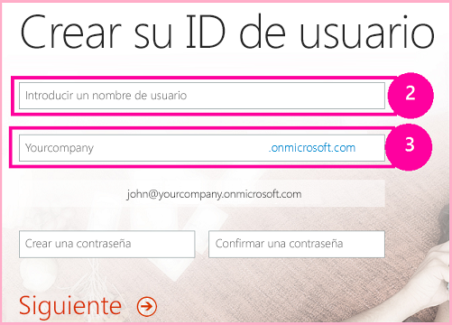

# Crear un complemento básico hospedado en SharePoint para SharePoint con las herramientas de desarrollo Napa Office 365
Aprenda a crear un Complemento de SharePoint básico hospedado en SharePoint con Herramientas de desarrollo de Office 365 de Napa.


 [Ejecute la muestra ahora](http://go.microsoft.com/fwlink/?LinkId=313212)
Napa es una herramienta que puede usar para crear Complementos de SharePoint hospedados en SharePoint. Napa está implementado como un Complemento de SharePoint (hospedada en proveedor) que puede instalarse en sitios web de SharePoint Online que se crean con la plantilla **Sitio para desarrolladores**. Los sitios para desarrolladores de SharePoint incluyen una biblioteca denominada **Complementos en fase de prueba** en la página principal. Las instrucciones para crear un sitio para desarrolladores e instalar Napa se detallan más adelante en este artículo.


> **NOTA**
> No se admite la instalación de Napa en una implementación local de SharePoint. 


Con Napa, puede crear sus Complementos de SharePoint dentro del explorador en lugar de hacerlo en Visual Studio. En cualquier momento puede bajar el proyecto y abrirlo en Visual Studio para ver escenarios más avanzados.


Con este artículo, aprenderá a crear un Complemento de SharePoint simple hospedado en SharePoint usando Napa. El complemento que cree incluirá controles y código para administrar listas y elementos de lista.
> **NOTA**
> Con Napa solo puede crear Complementos de SharePoint hospedados en SharePoint, no hospedadas en proveedor. Para obtener más información sobre las diferencias, consulte  [Complementos de SharePoint](sharepoint-add-ins.md). <BR /><BR /> No puede usar la semántica para actualización de complementos de SharePoint, que se describe en  [Actualizar componentes de web de complemento en SharePoint 2013](update-add-in-web-components-in-sharepoint-2013.md), en Napa. Por lo tanto, si necesita actualizar un complemento creado en Napa, primero tiene que exportarlo a Visual Studio. Las instrucciones para hacerlo se detallan más adelante en este artículo. <BR /><BR /> También puede crear un Complemento de SharePoint usando Visual Studio. Para obtener más información, consulte  [Empezar a crear complementos hospedados en SharePoint para SharePoint](get-started-creating-sharepoint-hosted-sharepoint-add-ins.md). 


## Obtener un Sitio para desarrolladores de Office 365 opcionalmente
<a name="Prerequisites"> </a>

Si no tiene ya una suscripción a SharePoint Online que puede usar para el desarrollo, use esta sección para obtener una. De lo contrario, vaya a  [Instalar Napa](#Overview).


> **NOTA**
>  Podría ya tener acceso a un Sitio para desarrolladores de Office 365:<BR /><BR /> **¿Es suscriptor de MSDN?** Los suscriptores de Visual Studio Ultimate y Visual Studio Premium con MSDN reciben una suscripción de desarrollador a Office 365 como ventaja adicional. [Solicítela hoy.](https://msdn.microsoft.com/subscriptions/manage/default.aspx)<BR /><BR /> **¿Tiene uno de los siguientes planes de suscripción a Office 365?**<BR /> **En caso afirmativo, un administrador de la suscripción a Office 365 puede crear un Sitio para desarrolladores** usando el [centro de administración de Office 365](https://portal.microsoftonline.com/admin/default.aspx). Para obtener más información, consulte  [Crear un sitio para desarrolladores en una suscripción existente de Office 365](create-a-developer-site-on-an-existing-office-365-subscription.md). 


Dos maneras de obtener un plan de Office 365.


- Comience con una  [prueba gratuita de 30 días](https://portal.microsoftonline.com/Signup/MainSignUp.aspx?OfferId=6881A1CB-F4EB-4db3-9F18-388898DAF510&amp;DL=DEVELOPERPACK) con una licencia de usuario.


- Compre una  [suscripción de desarrollador a Office 365](https://portal.microsoftonline.com/Signup/MainSignUp.aspx?OfferId=C69E7747-2566-4897-8CBA-B998ED3BAB88&amp;DL=DEVELOPERPACK).


> **SUGERENCIA**
> Cada uno de estos vínculos se abrirá en otra ventana o pestaña para tener las siguientes instrucciones a mano. 


**Figura 1. Nombre de dominio del sitio para desarrolladores de Office 365**





1. La primera página (no se muestra) del formulario de registro se explica por sí misma. Simplemente proporcione la información personal que se solicita y elija **Siguiente**.


2. En la segunda página, que se muestra en la figura 1, especifique un identificador de usuario para el administrador de la suscripción.


3. Cree un subdominio de **.onmicrosoft.com**.

    Después del registro, debe usar las credenciales resultantes (en el formato  _IdUsuario_@ _sudominio_.onmicrosoft.com) para iniciar sesión el sitio del portal de Office 365 donde administra la cuenta. Su sitio para desarrolladores de SharePoint Online se aprovisiona en su dominio: **http:// _sudominio_. sharepoint.com**.


4. Elija **Siguiente** y rellene la última página del formulario. Si decide proporcionar un número de teléfono para obtener un código de confirmación, puede proporcionar el número de un teléfono móvil o de un teléfono fijo, pero *no*  un número de VoIP (Protocolo de voz sobre Internet).


> **NOTA**
> Si tiene iniciada una sesión con otra cuenta Microsoft cuando intente registrar una cuenta de desarrollador, es posible que vea este mensaje: "El id. de usuario que especificó no funcionó. Parece que no es válido. Asegúrese de especificar el id. de usuario que su organización le asignó. El id. de usuario suele ser como  *alguien@example.com*  o *alguien@example.onmicrosoft.com*  ."<BR /><BR /> Si ve este mensaje, cierre la sesión de la cuenta Microsoft que estaba usando y vuelva a intentarlo. Si sigue viendo el mensaje, borre la memoria caché del explorador o cambie a **Exploración de InPrivate** y rellene el formulario.


Tras finalizar el proceso de registro, el explorador abrirá la página de instalación de Office 365. Elija el icono de administrador para abrir la página del centro de administración.


**Figura 2. Página del centro de administración de Office 365**


1. Deberá esperar a que su Sitio para desarrolladores finalice el aprovisionamiento. Una vez completado el aprovisionamiento, actualice la página del centro de administración de en su explorador.


2. A continuación, haga clic en el vínculo **Crear complementos** de la esquina superior izquierda de la página para abrir su Sitio para desarrolladores. Debería aparecer un sitio como el que se muestra en la figura 3. Hay una lista **Complementos en fase de prueba** en la página. Esto confirma que el sitio web se creó con la plantilla de sitio para desarrolladores de SharePoint. Si, en vez de ello, ve un sitio de equipo, espere unos minutos e inicie de nuevo su sitio.


3. Tome nota de la dirección URL del sitio. Se usa al crear proyectos de Complementos de SharePoint en Visual Studio.


**Figura 3. La página de inicio de su sitio para desarrolladores con la lista Complementos en fase de prueba**


## Instalar Napa
<a name="Overview"> </a>

Si su suscripción a no se creó originalmente como Sitio para desarrolladores de Office 365, tiene que crear un sitio para desarrolladores en la interfaz de usuario de administración de la suscripción a y después instalar Napa allí. Las instrucciones para crear el sitio se detallan en  [Crear un sitio para desarrolladores en una suscripción existente de Office 365](create-a-developer-site-on-an-existing-office-365-subscription.md).


Para instalar Napa, abra su Sitio para desarrolladores y elija **Contenidos del sitio** > **agregar un complemento** > **Tienda SharePoint**. En la tienda, busqueNapa e instálelo (si tiene un Sitio para desarrolladores de Office 365, Napa ya puede haberse instalado cuando se creó y el sitio y lo verá en la página **Contenidos del sitio**).


## Crear un proyecto de Complemento de SharePoint
<a name="Create"> </a>


1. Abra el complemento Napa en la página de Office 365.


2. Elija el icono **Agregar nuevo proyecto** y luego elija el icono **Complemento para SharePoint**.


3. Asigne el nombre Complemento de prueba para SharePoint al proyecto y elija el botón **Crear**.

    El editor de código abre y muestra la página web predeterminada, que ya contiene código de ejemplo que puede ejecutar sin necesidad de hacer nada más.


## Agregar controles a la página principal
<a name="AddControls1"> </a>

En el Complemento de SharePoint, agregue controles a la página principal predeterminada para crear y eliminar una lista genérica de SharePoint y obtener el número actual de listas que hay en la web del Complemento de SharePoint. El código de los controles se agrega después.


### Para agregar controles a la página principal


1. En la parte izquierda de la página, en la carpeta **Páginas**, elija la página **Default.aspx** si no está seleccionada todavía.

    La página web Default.aspx aparece en el editor de código.


2. En la sección  `PlaceHolderMain`, agregue este código debajo del HTML existente.

 ```HTML

<br />
<div>
    <button id="getListCount">Get count of lists in web</button>
</div>
<br />
<div id="starter">
    <input type="text" value="List name here" id="createlistbox"/><button id="createlistbutton">Create List</button>
    <p>
    Lists
    <br />
    <select id="selectlistbox" ></select><button id="deletelistbutton">Delete Selected List</button>
    </p>
</div>
 ```


El código HTML crea estos controles.

  - Un botón que obtiene el número de listas que hay en la web del Complemento de SharePoint.


  - Un botón para crear una lista genérica de SharePoint y otro botón para eliminarla.


  - Una lista de las listas que hay disponibles dentro del complemento.


## Agregar código para crear y eliminar listas
<a name="AddCode1"> </a>

Con este proceso, agregará código JavaScript para que los usuarios puedan crear y eliminar listas en el Complemento de SharePoint.


### Para agregar código para crear y eliminar listas


1. Elija la carpeta **Scripts** y luego el vínculo **App.js**.

    El archivo de código JavaScript predeterminado de la plantilla del proyecto se abre para su edición. Este archivo contiene el código que se usa en su Complemento de SharePoint. Se podría agregar otro archivo .js y agregar código en este en lugar de hacerlo en el archivo existente, pero en este ejemplo lo vamos a agregar en el archivo **App.js** proporcionado.

    En el paso siguiente, definirá las funciones para los controles que creó en el proceso anterior.


|**Nombre de la función**|**Descripción**|
|:-----|:-----|
| `getWebProperties()` <br/> |Conectada al control **getListCount**: recupera el número de listas que hay en la web.  <br/> |
| `createlist()` <br/> |Conectada al control **createListButton**: crea una lista genérica de SharePoint.  <br/> |
| `deletelist()` <br/> |Conectada al control **deletelistbutton**: elimina la lista que el usuario eligió en la lista de listas disponibles.  <br/> |
 

También llamará a las funciones  `welcome()` y `displayLists()`, que se describirán más adelante en este tutorial.


2. En el archivo **App.js**, agregue las variables  `web`,  `lists` y `listItemcollection` a las dos variables predeterminadas y cambie el código de la función `$(document).ready()` por el siguiente ejemplo.

    > **NOTA**
      > En el código aparecerán subrayados ondulados de error que desaparecerán en pasos posteriores. 

 ```

'use strict';

var context = SP.ClientContext.get_current();
var user = context.get_web().get_currentUser();
var web = context.get_web();
var lists = web.get_lists();
var listItemCollection;  // This variable is used later when you add list items.

(function () {

// This code runs when the DOM is ready and creates a context object which is 
// needed to use the SharePoint object model.
$(document).ready(function () {
    getUserName();
    $("#getListCount").click(function (event) {
        getWebProperties();
        event.preventDefault();
    });

    $("#createlistbutton").click(function (event) {
        createlist();
        event.preventDefault();
    });

    $("#deletelistbutton").click(function (event) {
        deletelist();
        event.preventDefault();
    });
        displayLists();
    });

 ```


En el paso siguiente, debe agregar funciones JavaScript para las definiciones. Todas las funciones del código se ejecutan llamando a  `executeQueryAsync()`, que ejecuta la solicitud actual pendiente de forma asincrónica en el servidor usando el modelo de objetos del lado cliente (CSOM) para SharePoint. Cuando una función se ejecuta de forma asincrónica, el script se sigue ejecutando sin esperar a que el servidor responda. Todas las llamadas de  `executeQueryAsync()` incluyen dos controladores de eventos. Un controlador responde si la función se ejecuta correctamente, mientras que el otro responde si hay errores en la función. En esta tabla se recogen las funciones principales.


|**Nombre de la función**|**Descripción**|
|:-----|:-----|
| `welcome()` <br/> |Obtiene la referencia del contexto web actual y luego la usa para colocar la información del usuario actual en el contexto.  <br/> |
| `getWebProperties()` <br/> |Obtiene la colección de listas de la web actual y luego devuelve el número de listas.  <br/> |
| `displaylists()` <br/> |Obtiene la colección actual de listas de esta web. Si es correcta, la función agrega el nombre de las listas de la colección a la lista de listas disponibles.  <br/> |
| `createlist()` <br/> |Crea una lista genérica de SharePoint (tipo de plantilla de lista **genericList**) y le asigna el nombre que indica el usuario en el control **createlistbox**. Puede crear otros tipos de listas. Para más información sobre los tipos de listas, vea  [SPListTemplateType (Enumeración)](http://go.microsoft.com/fwlink/?linkid=256687&amp;clcid=0xC0A).  <br/> |
| `deletelist()` <br/> |Elimina la lista que el usuario eligió en la lista de listas disponibles.  <br/> |
 
3. Agregue el siguiente código después de la función  `onGetUserNameFail()` en **App.js**.

 ```

function getWebProperties() {
        // Get the number of lists in the current web.
        context.load(lists);
        context.executeQueryAsync(onWebPropsSuccess, onWebPropsFail);
    }

    function onWebPropsSuccess(sender, args) {
        alert('Number of lists in web: ' + lists.get_count());
    }

    function onWebPropsFail(sender, args) {
        alert('Failed to get list. Error: ' + args.get_message());
    }

    function displayLists() {
        // Get the available SharePoint lists, and then set them into 
        // the context.
        lists = web.get_lists();
        context.load(lists);
        context.executeQueryAsync(onGetListsSuccess, onGetListsFail);
    }

    function onGetListsSuccess(sender, args) {
        // Success getting the lists. Set references to the list 
        // elements and the list of available lists.
        var listEnumerator = lists.getEnumerator();
        var selectListBox = document.getElementById("selectlistbox");
        if (selectListBox.hasChildNodes()) {
            while (selectListBox.childNodes.length >= 1) {
                selectListBox.removeChild(selectListBox.firstChild);
            }
        }
        // Traverse the elements of the collection, and load the name of
        // each list into the dropdown list box.
        while (listEnumerator.moveNext()) {
            var selectOption = document.createElement("option");
            selectOption.value = listEnumerator.get_current().get_title();
            selectOption.innerHTML = listEnumerator.get_current().get_title();
            selectListBox.appendChild(selectOption);
        }
    }

    function onGetListsFail(sender, args) {
        // Lists couldn't be loaded - display error.
        alert('Failed to get list. Error: ' + args.get_message());
    }

function createlist() {
        // Create a generic SharePoint list with the name that the user specifies.
        var listCreationInfo = new SP.ListCreationInformation();
        var listTitle = document.getElementById("createlistbox").value;
        listCreationInfo.set_title(listTitle);
        listCreationInfo.set_templateType(SP.ListTemplateType.genericList);
        lists = web.get_lists();
        var newList = lists.add(listCreationInfo);
        context.load(newList);
        context.executeQueryAsync(onListCreationSuccess, onListCreationFail);
    }

    function onListCreationSuccess() {
        displayLists();
    }

    function onListCreationFail(sender, args) {
        alert('Failed to create the list. ' + args.get_message());
    }

    function deletelist() {
        // Delete the list that the user specifies.
        var selectListBox = document.getElementById("selectlistbox");
        var selectedListTitle = selectListBox.value;
        var selectedList = web.get_lists().getByTitle(selectedListTitle);
        selectedList.deleteObject();
        context.executeQueryAsync(onDeleteListSuccess, onDeleteListFail);
    }

    function onDeleteListSuccess() {
        displayLists();
    }

    function onDeleteListFail(sender, args) {
        alert('Failed to delete the list. ' + args.get_message());
    }
 ```


## Ejecutarlo
<a name="Run1"> </a>

Ahora que la primera parte de la UI y el código están en su sitio, vamos a ejecutar el complemento para comprobar si funciona.


### Para ejecutar el complemento


1. En la parte inferior de la página, elija el botón para ejecutar (  ).

    El complemento se empaqueta, se implementa y se instala en el sitio para desarrolladores de Office 365.

    Después de la instalación, el Complemento de SharePoint se inicia. Si el complemento no se abre automáticamente porque, por ejemplo, hay habilitado un bloqueador de ventanas emergentes, elija el vínculo de la aplicación para iniciarlo.


2. Elija el vínculo **Haga clic aquí para iniciar el complemento en una ventana nueva**.

    Aparece la pantalla del Complemento de SharePoint.


3. Elija el botón **Obtener recuento de listas de la web**.

    En un cuadro de diálogo se indica que la web del Complemento de SharePoint actual contiene dos listas. (La web contiene las listas Galería de diseño y Galería de páginas maestras de forma predeterminada).


4. En el cuadro **Nombre de lista aquí**, escriba Lista de prueba y luego elija el botón **Crear lista**.


5. Abra la lista **Listas** para asegurarse de que aparece la lista nueva.


6. Elija el botón **Obtener recuento de listas de la web** otra vez.

    Ahora la web contiene tres listas, incluida la lista que acaba de crear.


7. En la lista **Listas**, elija **Lista de prueba** y luego elija el botón **Eliminar lista seleccionada**.

    **Lista de prueba** desaparece de la lista de listas disponibles.


8. Cuando termine, cierre la ventana del explorador y luego elija el botón **Cerrar** en la ventana **Iniciar complemento** para volver al proyecto que estaba editando.


## Agregar código y controles para agregar y eliminar elementos de lista
<a name="AddControls2"> </a>

Ahora que los usuarios pueden crear y eliminar listas, puede realizar estos pasos para permitirles agregar y eliminar elementos de lista.


### Para agregar código y controles para agregar y eliminar elementos de lista


1. Elija el archivo Default.aspx para editarlo.


2. En el elemento  `selectlistbox`, agregue este código.

 ```XML

<p>
    Items
    <br />
    <input type="text" value="item name here" id="createitembox"/><button id="createitembutton">Create Item</button>
    </p>
    <p>
    <select id="selectitembox"></select> <button id="deleteitembutton">Delete Selected Item</button>
    </p>
 ```


    Este código agrega un cuadro para escribir donde los usuarios pueden especificar el nombre de un elemento, un botón para agregar el elemento a la lista y otro botón para eliminarlo de la lista.


3. Elija el archivo **Default.aspx** para editarlo.


4. En la función  `$(document).ready()`, agregue definiciones para funciones a las que se llama cuando el usuario elige los botones **Crear elemento** y **Eliminar elemento seleccionado**. Además, agregue un controlador de eventos jQuery para el cuadro de lista **Listas** para asegurarse de que los elementos de lista se actualicen cuando seleccione una lista nueva.

 ```

$("#createitembutton").click(function (event) {
            createitem();
            event.preventDefault();
        });

        $("#deleteitembutton").click(function (event) {
            deleteitem();
            event.preventDefault();
        });

        // Update the list items dropdown when a new list
        // is selected in the Lists dropdown.
        $("#selectlistbox").change(function (event) {
            getitems();
            event.preventDefault();
        });
 ```


> **NOTA**
> Si los elementos de la lista no se muestran cuando ejecuta el complemento, asegúrese de que la instrucción  `displayLists();` está situada después del código anterior.

En el paso siguiente, agregará funciones JavaScript para las nuevas definiciones y una función de soporte ( `getItems()`). En esta tabla se describe lo que hacen las funciones principales.


|**Nombre de la función**|**Descripción**|
|:-----|:-----|
| `createItem()` <br/> |Agrega un elemento a la lista que elige el usuario y le pone a ese elemento el nombre que indique el usuario en el cuadro **Elementos**.  <br/> |
| `deleteItem()` <br/> |Elimina el elemento que el usuario elige en la lista.  <br/> |
| `getItems()` <br/> |Recupera la colección de elementos (también los secundarios) de la lista que elige el usuario.  <br/> |
 
5. Agregue este código al final de **App.js**, después de la función  `onDeleteListFail()`.

 ```

function createitem() {
    // Retrieve the list that the user chose, and add an item to it.
    var selectListBox = document.getElementById("selectlistbox");
    var selectedListTitle = selectListBox.value;
    var selectedList = web.get_lists().getByTitle(selectedListTitle);

    var listItemCreationInfo = new SP.ListItemCreationInformation();
    var newItem = selectedList.addItem(listItemCreationInfo);
    var listItemTitle = document.getElementById("createitembox").value;
    newItem.set_item('Title', listItemTitle);
    newItem.update();
    context.load(newItem);
    context.executeQueryAsync(onItemCreationSuccess, onItemCreationFail);
}

function onItemCreationSuccess() {
    // Refresh the list of items.
    getitems();
}

function onItemCreationFail(sender, args) {
    // The item couldn't be created - display an error message.
    alert('Failed to create the item. ' + args.get_message());
}

function deleteitem() {
    // Delete the item that the user chose.
    var selectListBox = document.getElementById("selectlistbox");
    var selectedListTitle = selectListBox.value;
    var selectedList = web.get_lists().getByTitle(selectedListTitle);
    var selectItemBox = document.getElementById("selectitembox");
    var selectedItemID = selectItemBox.value;
    var selectedItem = selectedList.getItemById(selectedItemID);
    selectedItem.deleteObject();
    selectedList.update();
    context.load(selectedList);
    context.executeQueryAsync(onDeleteItemSuccess, onDeleteItemFail);
}

function onDeleteItemSuccess() {
    // Refresh the list of items.
    getitems();
}

function onDeleteItemFail(sender, args) {
    // The item couldn't be deleted - display an error message.
    alert('Failed to delete the item. ' + args.get_message());
}

function getitems() {
    // Using a CAML query, get the items in the list that the user chose, and 
    // set the context to the collection of list items.
    var selectListBox = document.getElementById("selectlistbox");
    var selectedList = selectListBox.value;
    var selectedListTitle = web.get_lists().getByTitle(selectedList);
    var camlQuery = new SP.CamlQuery();
    camlQuery.set_viewXml("<View><ViewFields>" +
        "<FieldRef Name='ID' />" +
        "<FieldRef Name='Title' />" +
        "</ViewFields></View>')");
    listItemCollection = selectedListTitle.getItems(camlQuery);
    context.load(listItemCollection, "Include(Title, ID)");
    context.executeQueryAsync(onGetItemsSuccess, onGetItemsFail);
}

function onGetItemsSuccess(sender, args) {
    // The list items were retrieved.
    // Show all child nodes.
    var listItemEnumerator = listItemCollection.getEnumerator();
    var selectItemBox = document.getElementById("selectitembox");
    if (selectItemBox.hasChildNodes()) {
        while (selectItemBox.childNodes.length >= 1) {
     selectItemBox.removeChild(selectItemBox.firstChild);
        }
    }
        while (listItemEnumerator.moveNext()) {
            var selectOption = document.createElement("option");
            selectOption.value = listItemEnumerator.get_current().get_item('ID');
            selectOption.innerHTML = listItemEnumerator.get_current().get_item('Title');
            selectItemBox.appendChild(selectOption);
        }
}

function onGetItemsFail(sender, args) {
    // The list items couldn't be retrieved - display an error message.
    alert('Failed to get items. Error: ' + args.get_message());
}
 ```


## Ejecute el Complemento de SharePoint revisado.
<a name="Run2"> </a>

Toda la UI y el código están en su sitio, así que vamos a ejecutar el complemento para asegurarnos de que funciona.


### Para ejecutar el Complemento de SharePoint revisado


1. Al final de la página, vuelva a elegir el botón **Ejecutar**.


2. En el cuadro **Nombre de lista aquí**, escriba Nueva lista de prueba y luego elija el botón **Crear lista**.

    La lista nueva se agrega a la lista **Listas**.


3. En la lista **Listas**, elija **Nueva lista de prueba**.


4. En el cuadro **Nombre de elemento aquí**, escriba Elemento 1 y luego elija el botón **Crear elemento**.

    El nuevo elemento aparece en la lista **Elementos**.


5. Repita el paso anterior para agregar el Elemento 2 y elElemento 3.


6. En la lista de elementos, elija **Elemento 2** y luego el botón **Eliminar elemento seleccionado**.

    El **Elemento 2** desaparece de la lista de elementos.


7. Cuando termine, cierre la ventana del explorador.


## Exportar el proyecto a Visual Studio
<a name="NextSteps"> </a>

Abra el proyecto en Visual Studio mediante el botón **Abrir en Visual Studio**, tal como muestra la figura 3. Napa instala de forma automática las herramientas necesarias y abre el proyecto en Visual Studio.


**Figura 3. Botón Abrir en Visual Studio**


## Recursos adicionales
<a name="Additional"> </a>


-  [Información general sobre el desarrollo de SharePoint 2013](http://msdn.microsoft.com/library/f86e2695-4d7a-4fc5-bc23-689de96c4b06%28Office.15%29.aspx)


-  [Complementos de SharePoint](sharepoint-add-ins.md)


