# Crear un complemento empresarial de nube que use SAP Gateway
 Aprenda a crear el complemento hospedado por el proveedor de LightSwitch SharePoint para acceder a datos de SAP mediante la puerta de enlace de SAP para Microsoft.
En este artículo se resaltan los pasos clave que el equipo de desarrollo de Microsoft ha seguido para crear un complemento LightSwitch SharePoint hospedado por el proveedor que puede acceder a los datos de SAP mediante la puerta de enlace de SAP para Microsoft. Este complemento es compatible con operaciones CRUD en datos de SAP y puede usarse para ver las imágenes y cargar las imágenes en una biblioteca de imágenes de SharePoint.
  
    
    

El propósito de este artículo es mostrar los puntos clave del complemento que pueden ayudarle a crear complementos similares. El ejemplo de código se proporciona y vincula al artículo de modo que puede ver cómo se creó la solución de trabajo, con el fin de reforzar su aprendizaje.
 **Descarga de ejemplo:** [ ejemplo: desarrollar un complemento empresarial de nube para tener acceso a la puerta de enlace de SAP para Microsoft](https://code.msdn.microsoft.com/Sample-Developing-a-Cloud-25d6d1ea)
  
    
    


## Antes de empezar

Los siguientes son los requisitos previos para los procedimientos descritos en este artículo:
  
    
    

- **Un sitio para desarrolladores de Office 365** en un dominio de Office 365 que está asociado a un arrendamiento de Microsoft Azure Active Directory (Azure AD). Consulte [Registrarse en una suscripción a Office 365 Developer, configurar las herramientas y el entorno, y comenzar a implementar complementos](http://msdn.microsoft.com/es-es/library/office/fp179924%28v=office.15%29.aspx) o [Procedimiento para crear un sitio para desarrolladores en su suscripción de Office 365 existente](http://msdn.microsoft.com/es-es/library/office/jj692554%28v=office.15%29.aspx).
    
  
- **Visual Studio 2013 Update 4** o posterior, que puede obtener en [Bienvenido a Visual Studio 2013](http://msdn.microsoft.com/es-es/library/dd831853.aspx).
    
  
- **Microsoft Office Developer Tools para Visual Studio.** La versión que se incluye en la actualización 4 de Visual Studio 2013 o posterior.
    
  
- **Puerta de enlace de SAP para Microsoft** se ha implementado y configurado en Microsoft Azure. Para obtener más información, consulte la documentación de [Puerta de enlace de SAP para Microsoft](http://go.microsoft.com/fwlink/?LinkId=507635).
    
  
- **Una cuenta organizativa de Microsoft Azure.** Consulte [Crear una cuenta organizativa de usuario en Azure AD](http://go.microsoft.com/fwlink/?LinkID=512580).
    
    > [!NOTA]
      > Inicie sesión en su cuenta de Office 365 (login.microsoftonline.com) para cambiar la contraseña temporal una vez que la cuenta se haya creado. 
- **Un extremo OData de SAP** que incluya datos de ejemplo. Consulte la documentación de [Puerta de enlace de SAP para Microsoft](http://go.microsoft.com/fwlink/?LinkId=507635).
    
  
- **Conocimientos básicos de Azure AD** Consulte [Introducción a Azure AD.](http://msdn.microsoft.com/es-es/library/azure/dn655157.aspx).
    
  
- **Conocimientos básicos de creación de complementos para SharePoint.** Consulte [Procedimiento para crear un complemento para SharePoint básico hospedado por un proveedor](http://msdn.microsoft.com/es-es/library/office/fp142381%28v=office.15%29.aspx).
    
  
- **Conocimientos básicos de OAuth 2.0 en Azure AD.** Consulte [OAuth 2.0 en Azure AD](http://msdn.microsoft.com/es-es/library/azure/dn645545.aspx) y sus temas secundarios.
    
  

## Información general de la solución

Contoso Motors es una empresa ficticia de ventas de automóviles que representa una empresa de la vida real en la que un concesionario de automóviles comparte información acerca de su inventario de automóviles con representantes de ventas y otros concesionarios a los que está afiliada. Mediante este complemento, el personal de ventas puede comprobar el estado actual de su inventario de automóviles, al que el complemento tiene acceso directamente desde SAP mediante la puerta de enlace de SAP para Microsoft. Todos los datos se almacenan en SAP, y una imagen de cada auto se almacena en una biblioteca de imágenes en SharePoint Online. Este complemento reúne y muestra los datos de SAP y la biblioteca de imágenes de SharePoint. Dentro del complemento, los gerentes y los administradores pueden hacer operaciones CRUD estándar en los datos detallados sobre cada auto en SAP.
  
    
    
En el ejemplo de este artículo, el complemento SellerDashboard manipula los datos de inventario de automóviles de SAP y su imagen en la biblioteca de imágenes de SharePoint. Dentro de este complemento, se admiten operaciones CRUD (crear, leer, actualizar y eliminar) estándar en la información detallada sobre cada auto en SAP.
  
    
    

> [!SUGERENCIA]
> Para ver una demostración en vídeo de este complemento, vea el vídeo  [Seminario web técnico: Puerta de enlace de SAP para Microsoft &amp; Modelo de desarrollo de Microsoft Azure](http://go.microsoft.com/fwlink/?LinkId=517378) en BrightTalk. La demostración de la funcionalidad de la aplicación comienza a los 48 minutos en la línea de tiempo.
  
    
    

 **Arquitectura de código**
  
    
    
La solución SellerDashboard incluye ocho proyectos y, como se muestra en la siguiente imagen, se divide en dos categorías: BoxXDataStudio y SellerDashboardStudio.
  
    
    

  
    
    
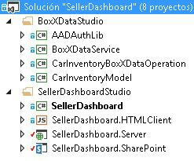
  
    
    

### BoxXDataStudio

Este estudio incluye todos los componentes necesarios para interactuar con la puerta de enlace de SAP para Microsoft.
  
    
    

- **AADAuthLib**
    
    Este componente se usa para llevar a cabo el  [flujo de código de autorización de Azure AD](https://msdn.microsoft.com/es-es/library/azure/dn645542.aspx), que usan un patrón Singleton.
    
    El siguiente fragmento de código muestra la función principal, que el componente AADAuthLib proporciona. Para obtener más información, consulte la clase auxiliar de código de ejemplo AADAuthLib/AuthUtil.cs.
    


  ```cs
  
// Use the auth code, acquire the refresh token and access token, and store them in the current session
        public bool AcquireTokenFromAuthCode(string authCode, string redirectUrl = "redirectUrl")
        {
            if (!IsAuthorized &amp;&amp; !string.IsNullOrEmpty(authCode))
            {
                AuthenticationResult authResult = _authContext.AcquireTokenByAuthorizationCode(authCode,
                    new Uri(ConfigurationManager.AppSettings["ida:" + redirectUrl]),
                    _clientCredential,
                    ConfigurationManager.AppSettings["ida:ResourceUrl"]);

                HttpContext.Current.Session["RefreshToken"] = authResult.RefreshToken;
                HttpContext.Current.Session["AccessToken-" + ConfigurationManager.AppSettings["ida:ResourceUrl"]] = new Tuple<string, DateTimeOffset>(authResult.AccessToken, authResult.ExpiresOn);

                return true;
            }

            return false;
  }

 // Provide the access token, which is stored in the current session, if the access token expired, use the refresh token get a new one.
 public string AccessToken
        {
            get
            {
                if (!IsAuthorized) throw new UnauthorizedAccessException();

                var accessToken = HttpContext.Current.Session["AccessToken-" + ConfigurationManager.AppSettings["ida:ResourceUrl"]] as Tuple<string, DateTimeOffset>;

                if (IsAccessTokenValid(accessToken))
                {
                    return accessToken.Item1;
                }

                accessToken = RenewAccessToken();
                HttpContext.Current.Session["AccessToken-" + ConfigurationManager.AppSettings["ida:ResourceUrl"]] = accessToken;

                return accessToken.Item1;
            }
  }
  ```

- **BoxXDataService**
    
    Este es un servicio de WCF RIA, que es la interfaz utilizada por el componente de servidor SellerDashboard hospedado en Azure, y que consume el origen de datos de SAP desde la puerta de enlace de SAP para Microsoft.
    
    El siguiente fragmento de código es el método web CRUD, que el servicio de WCF RIA admite. Para obtener más información, consulte BoxXDataService/BoxXDataService.cs.
    


  ```cs
  
[Query(IsDefault = true)]
        public IQueryable<InventoryItem> GetAllCarInventory()
        {
            BoxXDataReader dataReader = BoxXDataReader.Instance;
            IInventoryCollection dataCollection = ModelFactory.CreateInventoryCollection(dataReader.SchemaPropertyNames);
            IInventoryQuery query = QueryFactory.CreateQuery();
            dataReader.GetData(dataCollection, query);

            return dataCollection.Items.Cast<InventoryItem>().AsQueryable();
        }

        [Update]
        public void UpdateCarInventoryItem(InventoryItem carInventoryItem)
        {
            BoxXDataUpdater dataUpdater = BoxXDataUpdater.Instance;
            dataUpdater.UpdateInventoryItem(carInventoryItem);
        }

        [Insert]
        public void InsertCarInventoryItem(InventoryItem carInventoryItem)
        {
            BoxXDataCreater dataCreater = BoxXDataCreater.Instance;
            dataCreater.CreateInventoryItem(carInventoryItem);
        }

        [Delete]
        public void DeleteCarInventoryItem(InventoryItem carInventoryItem)
        {
            BoxXDataDeleter.DeleteInventoryItem(carInventoryItem.ID);
 }
  ```

- **CarInventoryBoxXDataOperation**
    
    Es la implementación real de CRUD para BoxXDataService. La siguiente imagen muestra la arquitectura de código principal de CarInventoryBoxXDataOperation. El espacio de nombres CRUD se usa para implementar las operaciones CRUD, y el espacio de nombres Util es el código auxiliar para el espacio de nombres CRUD.
    
     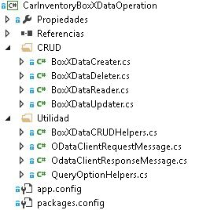
  

  

  
- **CarInventoryModel**
    
    Es un proyecto de biblioteca que se usa para implementar el modelo de datos y las utilidades. La definición del modelo de datos debe coincidir con los metadatos del extremo de OData que la puerta de enlace de SAP para Microsoft usa, en función del esquema de datos de SAP. BoxXDataService y CarInventoryBoxXDataOperation lo usan para convertir el elemento de la base de datos de SAP en una instancia de inventario de automóvil.
    
    La imagen siguiente muestra los componentes principales.
    
  

  
    
    
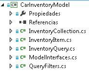
  
    
    

  
    
    

  
    
    

### SellerDashboardStudio

SellerDashboardStudio incluye componentes de complemento LightSwitch SharePoint estándar.
  
    
    

- **SellerDashboard**
    
    SellerDashboard es el proyecto de inicio, y se usa para publicar el complemento SellerDashboard en el sitio web de Azure y su complemento de SharePoint en el sitio para desarrolladores de SharePoint.
    
  
- **SellerDashboard.HTMLClient**
    
    Este componente incluye las pantallas, un control personalizado y un control de carga de fotos. La imagen siguiente muestra sus componentes principales.
    
  
- 
     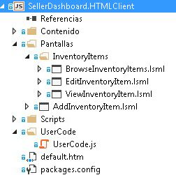
  

    SellerDashboard.HTML.Client incluye estas cuatro pantallas:
    
  - BrowseInventoryItems es la pantalla principal, que se usa para examinar la información básica de todos los elementos de inventario.
    
  
  - ViewInventoryItem es la pantalla de detalles, que se usa para mostrar una vista detallada de cada elemento de inventario.
    
  
  - EditInventoryItem es una pantalla emergente de edición, utilizada para editar un elemento de inventario.
    
  
  - AddInventoryItem es una pantalla emergente Agregar, que se usa para agregar un nuevo elemento de inventario.
    
  

    El archivo UserCode.js incluye el código de control personalizado de la experiencia de usuario.
    
    Los archivos photohelper.js y sharepointauthhelper.js, incluidos en la carpeta Scripts, están basados en las instrucciones proporcionadas en el artículo  [Tutorial: Crear un complemento para SharePoint utilizando LightSwitch](http://msdn.microsoft.com/es-es/library/jj969621.aspx).
    
  
- **SellerDashboard.Server**
    
    Este componente incluye el origen de datos de WCF RIA, el origen de datos de SharePoint y la API web de carga de fotos. La imagen siguiente muestra los componentes principales.
    
     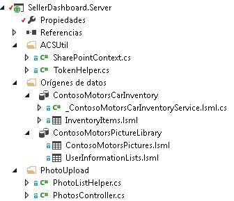
  

    SharePointContext.cs y TokenHelper.cs son las clases auxiliares que proporcionan el contexto de cliente para autenticar a SharePoint. Esto permite que la API web de carga de fotos se pueda usar para cargar fotos de autos en la biblioteca de imágenes. Los archivos PhotoListHelper.cs y PhotosController.cs implementan la API web de carga de fotos. Para obtener más información sobre cómo LightSwitch usa la API web de carga de fotos, consulte el artículo  [Tutorial: Crear un complemento para SharePoint utilizando LightSwitch](http://msdn.microsoft.com/es-es/library/jj969621.aspx).
    
  
- **SellerDashboard.SharePoint**
    
    Este componente se incluye después de la solución de LightSwitch para habilitar el proyecto de SharePoint. Puede usar este componente para configurar el sitio de SharePoint que se usa para la biblioteca de imágenes y establecer el permiso necesario para el complemento. SellerDashboard debe tener concedido el nivel de permiso Control total en el sitio de SharePoint que hospeda a la biblioteca de imágenes.
    
  

## Implementación


  
    
    

### Información general

En la imagen siguiente se muestran los componentes que conforman el SellerDashboard. La línea sólida muestra el flujo de datos, y la línea de puntos muestra el flujo de OAuth. Los componentes de color verde están relacionados con las operaciones de datos de SAP, los componentes azules están relacionados con la operación de la biblioteca de imágenes de SharePoint, y los componentes de color naranja describen las operaciones de toda la aplicación SellerDashboard.
  
    
    
 **Solución SellerDashboard**
  
    
    

  
    
    
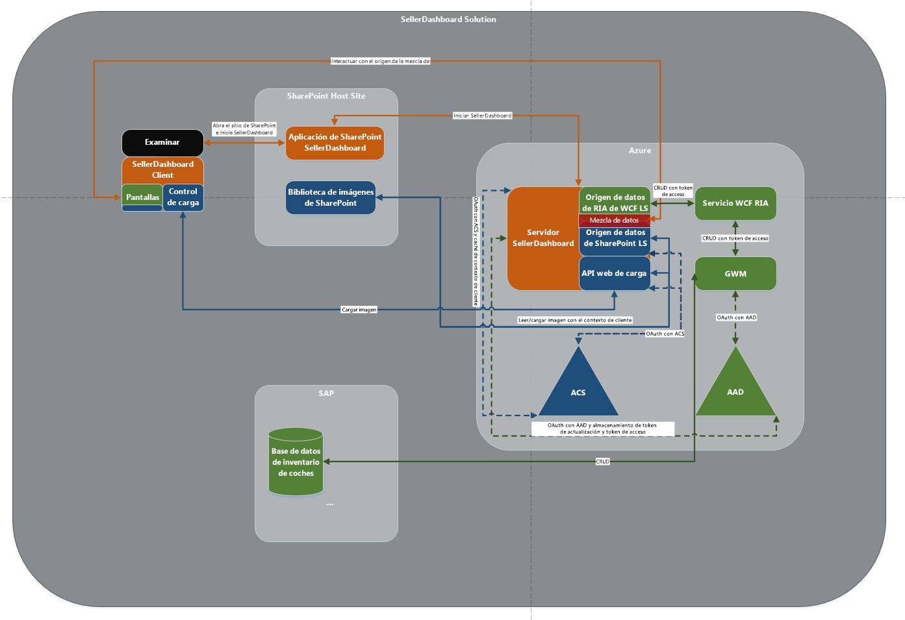
  
    
    

  
    
    

  
    
    

### Mashup de datos

LightSwitch admite el mashup de datos al agregar una relación entre los dos orígenes de datos en el diseñador.
  
    
    
 **Origen de datos de SAP**
  
    
    

-  *Esquema de datos en la base de datos de SAP* 
    
    El siguiente fragmento de código muestra un ejemplo de un esquema de datos de la puerta de enlace de SAP para Microsoft.
    


  ```XML
  
<?xml version="1.0" encoding="UTF-8"?> 
- <edmx:Edmx xmlns:sap="http://www.sap.com/Protocols/SAPData" xmlns:m="http://schemas.microsoft.com/ado/2007/08/dataservices/metadata" 
xmlns:edmx:"http://schemas.microsoft.com/ado/2007/06/edmx" Version="1.0">
   - <edmx:DataServices m:DataServiceVersion="2.0">
      - <Schema xml:lang="en" xmlns="http://schemas.microsoft.com/ado/2008/09/edm" Namespace="ZCAR_POC_SRV">
         - <EntityType sap:content-version="1" Name="ContosoMotors">
              - <Key>
                     <PropertyRef Name="ID"/>
               </Key>
               <Property Name="ContactPhone" Type="Edm.String"/>
               <Property Name="ContactEmail" Type="Edm.String"/>
               <Property Name="ID" Type="Edm.Int32" Nullable="false"/>
               <Property Name="BuyerEmail" Type="Edm.String" MaxLength="255"/>
               <Property Name="MaxPower" Type="Edm.Int32" Nullable="false"/>
               <Property Name="Engine" Type="Edm.String" Nullable="false" MaxLength="255"/>
               <Property Name="BodyStyle" Type="Edm.String" Nullable="false" MaxLength="255"/>
               <Property Name="Transmission" Type="Edm.String" Nullable="false" MaxLength="255"/>
               <Property Name="Year" Type="Edm.Int32" Nullable="false"/>
               <Property Name="Model" Type="Edm.String" Nullable="false" MaxLength="255"/>
               <Property Name="Brand" Type="Edm.String" Nullable="false" MaxLength="255"/>
               <Property Name="ExtColor" Type="Edm.String" Nullable="false" MaxLength="255"/>
              <Property Name="IntColor" Type="Edm.String" Nullable="false" MaxLength="255"/>
              <Property Name="ContactName" Type="Edm.String" Nullable="false" MaxLength="255"/>
              <Property Name="Price" Type="Edm.String" Nullable="false"/>
              <Property Name="StockNo" Type="Edm.String" Nullable="false"/>
              <Property Name="Arrived_Date" Type="Edm.DateTime" Nullable="false" Precision="0"/>
              <Property Name="Status" Type="Edm.String" Nullable="false" MaxLength="255"/>
      </EntityType>
   - <EntityContainer Name="ZCAR_POC_SRV_Entities" m:IsDefaultEntityContainer="true">
          <EntitySet sap:content-version="1" Name="ContosoMotorsCollection" sap:searchable="true" EntityType="ZCAR_POC_SRV.ContosoMotors"/>
     </EntityContainer>
     <atom:link xmlns:atom="http://www.w3.org/2005/Atom" href="http://contoso.cloudapp.net:8080/perf/sap/opu/odata/sap/ZCAR_POC_SRV/$metadata" rel="self"/>
     <atom:link xmlns:atom="http://www.w3.org/2005/Atom" href="http://contoso.cloudapp.net:8080/perf/sap/opu/odata/sap/ZCAR_POC_SRV/$metadata" rel="latest-version"/>
</Schema>
</edmx:DataServices>
</edms:Edmx>               

  ```


    Es nuestra base de datos de prueba, y el valor de propiedad que admite valores NULL y tipo de propiedad se basa en el escenario. El identificador es PropertyRef y la operación CRUD OData se basa en el identificador. Se usa la propiedad StockNo para mezclar datos con la imagen del automóvil que se almacena en la biblioteca de imágenes de SharePoint.
    
  
-  *Modelo de datos definido para el servicio de RIA* 
    
  ```cs
  
public interface IInventoryItem
    	{
        IEnumerable<InventoryPropertyName> ValidPropertyNames { get; }
        bool IsValid { get; }

        int ID { get; set; }
        DateTime ArrivedDate { get; set; }
        string BodyStyle { get; set; }
        string Brand { get; set; }
        string BuyerEmail { get; set; }
        string ContactEmail { get; set; }
        string ContactName { get; set; }
        string ContactPhone { get; set; }
        string Engine { get; set; }
        string ExtColor { get; set; }
        IEnumerable<Uri> Images { get; }
        string IntColor { get; set; }
        int MaxPower { get; set; }
        string Model { get; set; }
        decimal Price { get; set; }
        bool Removed { get; }
        string Status { get; set; }
        string StockNo { get; set; }
        string Transmission { get; set; }
        int Year { get; set; }

        void AddImageUrl(Uri url);
        bool CopyFrom(IInventoryItem other);
        object GetPropertyValue(InventoryPropertyName property);
        void MarkAsRemoved();
        void SetPropertyValue(InventoryPropertyName property, object value);
       }

    	public interface IInventoryCollection
       {
        IEnumerable<InventoryPropertyName> QueriedPropertyNames { get; }
        IEnumerable<IInventoryItem> Items { get; }
        bool Valid { get; }

        IInventoryItem this[int id] { get; }
        bool Contains(int id);
        void AddItem(IInventoryItem inventoryItem);
        IInventoryCollection Filter(Predicate<IInventoryItem> match);
        bool CopyFrom(IInventoryCollection other);
}

  ```


    Toda propiedad que no se incluye en el esquema de base de datos de SAP se puede ignorar. Por ejemplo, la propiedad **Imágenes** se agregó aquí por motivos de escalabilidad. Este modelo de datos es una capa intermedia entre la base de datos de SAP real y el origen de datos SellerDashboard.Server. El proyecto LightSwitch tiene dos componentes: la vista y el servidor. Al agregar un origen de datos externo en el servidor, LightSwitch le ayuda a crear una capa de datos abstractos que se agrega al origen de datos en el servidor.
    
    La mayoría de las propiedades tiene el mismo tipo que las propiedades en el esquema base de datos de SAP, excepto StockNo, cuyo tipo se ha cambiado de **int** a **string**. Esto es porque StockNo se usa como una manera de definir la relación entre los datos de SAP y la biblioteca de imágenes de SharePoint.
    
    > [!SUGERENCIA]
      > StockNo debe tener el tipo **string** porque el valor almacenado en la biblioteca de imágenes de SharePoint es **Text**. Estos dos tipos deben coincidir para lograr el mashup de datos.

    La implementación de las dos interfaces se encuentra en CarInventoryModel/InventoryItem.cs y CarInventoryModel/InventoryCollection.cs.
    
  
-  *Origen de datos consumido por el servidor de LightSwitch* 
    
     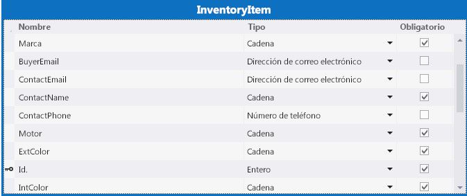
  

    En el servidor SellerDashboard, al agregar el servicio de WCF RIA (BoxXDataService), se incluye el modelo de datos definido en CarInventoryModel y se obtiene la tabla de datos relevante. Puede cambiar el tipo de algunas de las propiedades. Por ejemplo, puede cambiar el tipo **BuyerEmail** de **String** a **Email Address**, y LightSwitch será compatible con la comprobación de formato de correo electrónico en el cliente.
    
  
 **Biblioteca de imágenes de SharePoint**
  
    
    
La biblioteca de imágenes en el sitio de host de SharePoint se denomina ContosoMotorsPictureLibrary y contiene tres columnas nuevas denominadas StockNo, ThumbnailUrl y FullImageUrl. Todas ellas estén configuradas como campos **Text**.
  
    
    

> [!SUGERENCIA]
> Los nombres de columna distinguen mayúsculas de minúsculas. 
  
    
    

 La columna StockNo se usa para crear una relación con los datos de SAP. Las columnas ThumbnailUrl y FullImageUrl se usan para obtener la dirección URL de la imagen correspondiente de manera práctica.
  
    
    
 *Origen de datos consumido por el servidor de LightSwitch* 
  
    
    
ContosoMotorsPicture es un modelo de origen de datos de LightSwitch, que se asigna a la biblioteca de imágenes de sitios de host de SharePoint en el servidor LightSwitch.
  
    
    

  
    
    
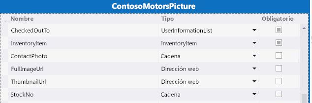
  
    
    
 **Relación de datos**
  
    
    
Agregue una relación de uno a cero o una relación de uno a uno entre InventoryItem y ContosoMotorsPicture. La imagen siguiente muestra el aspecto, con LightSwitch en Visual Studio
  
    
    

  
    
    
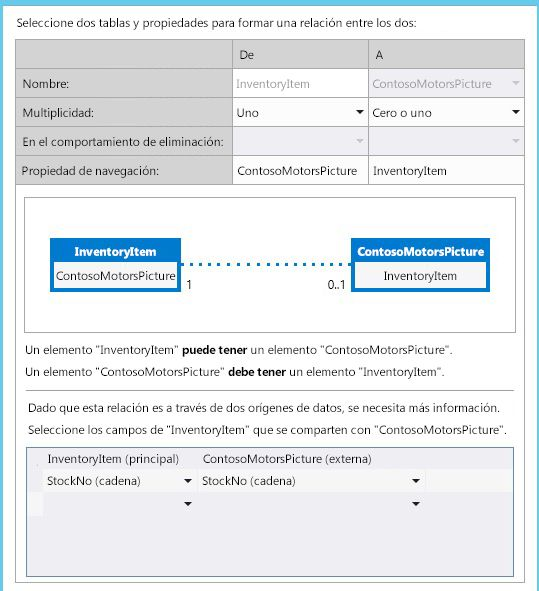
  
    
    

  
    
    

  
    
    

### OAuth con Azure AD y ACS

Esta sección proporciona una introducción a cómo el complemento implementa OAuth en Azure AD y servicios de control de acceso (ACS).
  
    
    
 ** Introducción**
  
    
    
SellerDashboard es un complemento de host del proveedor de SharePoint que debe funcionar en ambos orígenes de datos: la biblioteca de imágenes de SharePoint y los datos de SAP mediante la puerta de enlace de SAP para Microsoft.
  
    
    
Para tener acceso a la biblioteca de imágenes de SharePoint, SellerDashboard debe autenticarse en ACS y obtener el token de acceso de él. Para obtener acceso a los datos de SAP, sin embargo, SellerDashboard debe obtener un token de acceso diferente de Azure AD, porque la puerta de enlace de SAP para Microsoft usa Azure AD para la autenticación y autorización.
  
    
    

  
    
    
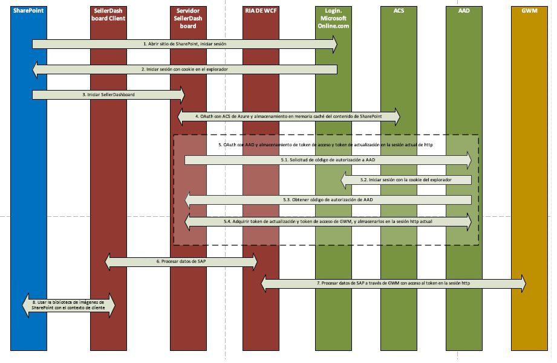
  
    
    
 **Implementación**
  
    
    
SellerDashboard es un complemento de SharePoint hospedado por el proveedor que admite la operación de carga de la imagen mediante el modelo de objetos de cliente de SharePoint. El contexto de SharePoint, que se usa para crear el contexto de cliente para el host de SharePoint, se almacena en la memoria caché y, a continuación, la API web de carga usa el contexto de cliente.
  
    
    
Una vez completado el proceso de OAuth con ACS, se envía la solicitud de autenticación a Azure AD. Para ello, el complemento usa una cookie para iniciar sesión en Login.MicrosoftOnline.com y, a continuación, completar el flujo de código de autorización de Azure AD, que devuelve un token de actualización que el complemento almacena en memoria caché para las solicitudes de autenticación futuras durante la sesión. Este es el código que se usa para este proceso.
  
    
    


```cs

protected override void Page_Load(object sender, EventArgs e)
{
    if (!IsPostBack)
    {
 SharePointContext spContext = SharePointContextProvider.Current.GetSharePointContext(Context);
        if (spContext != null)
        {
     // Cache the SharePoint Context, which will be used to create Client Context for SharePoint host
            _spContext = spContext;
        }

		
        // Acquire refresh token and access token, and store them in the current session, which will be used do the OAuth with AAD for operating the SAP data
        AuthUtil.Instance.AcquireTokenFromAuthCode(Request.QueryString["code"]);

        if (!AuthUtil.Instance.IsAuthorized)
        {
             Response.Redirect(AuthUtil.Instance.AuthCodeUrl);
        }
     }

     base.Page_Load(sender, e);
 }
```

Para obtener más información, consulte SellerDashBoard.Server/SharePointLaunch.aspx.cs y AADAuthLib/AuthUtil.cs en el ejemplo de código.
  
    
    
SellerDashboard.Server incluye los archivos SharePointContext.cs y TokenHelper.cs, que se usan para obtener el contexto de cliente de solo aplicación para el host de SharePoint. Visual Studio agrega automáticamente estos dos archivos a su proyecto de SharePoint. (Visual Studio especifica el nombre del proyecto < *nombreproyecto*  >Web. Por ejemplo: SharePointAppWeb). Se pueden copiar estos dos archivos al código de origen del complemento SellerDashboard e incluirlos en el proyecto.
  
    
    

### Operaciones CRUD en datos de SAP desde la puerta de enlace de SAP para Microsoft

Los fragmentos de código siguientes muestran la lógica de código principal de las operaciones CRUD. Para obtener más información, consulte la implementación de CarInventoryBoxXDataOperation en el ejemplo de código.
  
    
    
 **BoxXDataCreater**
  
    
    


```cs

        public void CreateInventoryItem(IInventoryItem inventoryItem)
        {
            if (_model == null)
            {
                _model = BoxXDataCRUDHelpers.GetMetadata(BoxXDataCRUDHelpers.MetadataUrl);
            }

            // Create new entry request generate
            var requestMessage = new ODataClientRequestMessage(new Uri(BoxXDataCRUDHelpers.DataCollectionUrl),
                                                                ODataConstants.MethodPost);
            BoxXDataCRUDHelpers.CreateEntryRequestHeaderSetter(requestMessage, AuthUtil.Instance.AccessToken);
            BoxXDataCRUDHelpers.SetODataRequestContent(requestMessage, _model, inventoryItem);

            // Create new entry request execute
            IODataResponseMessage responseMessage = requestMessage.GetResponse();

        }
BoxXDataReader
 public void GetData(IInventoryCollection dataCollection, IInventoryQuery query)
        {
            GetValueWithoutLocallyFiltering(dataCollection, query);

            if (query.Filters.Any())
            {
                var filteredCollection = dataCollection.Filter(inventoryItem =>
                    query.Filters.Any(filter => filter.Match(inventoryItem)));

                dataCollection.CopyFrom(filteredCollection);
            }
        }
```

 **BoxXDataUpdater**
  
    
    


```cs

public void UpdateInventoryItem(IInventoryItem inventoryItem)
        {
            if (_model == null)
            {
                _model = BoxXDataCRUDHelpers.GetMetadata(BoxXDataCRUDHelpers.MetadataUrl);
            }

            // Update existing entry request generate
            var requestMessage = new ODataClientRequestMessage(new Uri(BoxXDataCRUDHelpers.DataCollectionUrl + '(' + inventoryItem.ID + ')'),
                                                                ODataConstants.MethodPut);
            BoxXDataCRUDHelpers.UpdateEntryRequestHeaderSetter(requestMessage, AuthUtil.Instance.AccessToken);
            BoxXDataCRUDHelpers.SetODataRequestContent(requestMessage, _model, inventoryItem);

            // Update existing entry request execute
            IODataResponseMessage responseMessage = requestMessage.GetResponse();
        }
BoxXDataDeleter
 public static void DeleteInventoryItem(int ID)
        {
            // Delete existing entry request generate
            var requestMessage = new ODataClientRequestMessage(new Uri(BoxXDataCRUDHelpers.DataCollectionUrl + '(' + ID + ')'),
                                                                ODataConstants.MethodDelete);
            BoxXDataCRUDHelpers.DeleteEntryRequestHeaderSetter(requestMessage, AuthUtil.Instance.AccessToken);

            // Delete existing entry request execute
            IODataResponseMessage responseMessage = requestMessage.GetResponse();
        }
```


### Cargar fotos a la biblioteca de imágenes de SharePoint

El control de carga de fotos y la implementación de la API web de carga de fotos se usan para cargar fotos en la biblioteca de imágenes de SharePoint mediante el siguiente código, que se basa en las instrucciones del artículo  [Tutorial: Crear un complemento para SharePoint utilizando LightSwitch](http://msdn.microsoft.com/es-es/library/jj969621.aspx).
  
    
    
 **Para los cambios de photohelper.js:**
  
    
    
Se agrega un nuevo campo para el uploadForm, que se usa para transmitir el StockNo a la API web de carga de fotos.
  
    
    


```

uploadForm = $(
             '<form id="uploadForm" method="POST" enctype="multipart/form-data" action="' + API_URL + '"  data-ajax="false" target="uploadTargetIFrame">' +
             '   <input name="fileInput" id="fileInput" type="file" size="30" data-theme="c" accept="image/*" multiple="true"/>' +
             '   <input type="hidden" name=' + screen.InventoryItem.StockNo + '>' +
             '</form>');

```

Agregar la lógica para almacenar en memoria caché la dirección URL de la imagen y la lógica de restablecimiento de la imagen.
  
    
    


```

function completeUpload(uploadedFiles) {
            var fullImageUrl = uploadedFiles[0];
            var photoNameWithExt = fullImageUrl.substr(fullImageUrl.lastIndexOf('/') + 1);
            var photoNameWithoutExt = photoNameWithExt.substr(0, photoNameWithExt.lastIndexOf("."));
            var photoPathUri = fullImageUrl.substr(0, fullImageUrl.lastIndexOf('/'));
            var photoExt = photoNameWithExt.substr(photoNameWithExt.lastIndexOf(".") + 1, photoNameWithExt.length);
            var thumbnailUrl = photoPathUri + "/_t/" + photoNameWithoutExt + "_" + photoExt + ".jpg";
            setCacheUrl(screen.InventoryItem.StockNo, fullImageUrl + "*#00#" + thumbnailUrl);
            setDetailsCarPicture(fullImageUrl);
            screen.closePopup();
        }
```

 **Para los cambios de PhotosController.cs:**
  
    
    
Use el contexto de cliente de solo aplicación para el host de SharePoint, que el contexto de SharePoint almacenado en memoria caché crea.
  
    
    
Haga esto porque ContosoMotorsPictureLibrary no pertenece al complemento SellerDashboard, sino al sitio del host de SharePoint. También quite el código correspondiente de eliminación de fotos.
  
    
    


```cs

private ClientContext AppWebContext
    {
        get
        {
            if (appWebContext == null)
            {
                appWebContext = SharePointLaunch.getAppWebContext();
            }
            return appWebContext;
        }
    }

```

 **Para los cambios de PhotoListHelper.cs:**
  
    
    
Agregue la lógica de actualización de la imagen, que eliminará el elemento de imagen antiguo si existe y, a continuación, agregará un nuevo elemento de imagen. Asigne el StockNo del nuevo elemento de imagen y al mismo tiempo, establezca los valores de FullImageUrl y ThumbnailUrl en el nuevo elemento de imagen.
  
    
    


```cs

            // Delete the old picture item
            foreach (ListItem item in items)
            {
                if (!string.IsNullOrEmpty((string)(item["StockNo"])))
                {
                    string tempStockNo = item["StockNo"].ToString();
                    if (tempStockNo.Equals(stockNo))
                    {
                        item.DeleteObject();
                        siteContext.ExecuteQuery();
                        break;
                    }
                }
            }

            // Update the new picture item
            foreach (ListItem item in items)
            {
                string fullImageName = item["FileLeafRef"].ToString();
                string thumbnailName = fullImageName.Replace('.', '_') + ".jpg";

                if (photoUri.Contains(fullImageName))
                {
                    item["StockNo"] = stockNo;
                    item["FullImageUrl"] = photoUri;
                    item["ThumbnailUrl"] = photoUri.Replace(fullImageName, "_t/" + thumbnailName);
                    item.Update();
                    siteContext.ExecuteQuery();
                    break;
                }
            }


```


### Experiencia de usuario

Para la solicitud de escenario especial, se implementan muchos controles personalizados para admitir la solicitud. Puede encontrar el código correspondiente en el archivo UserCode.js. Puede crear rápidamente una interfaz de usuario simple mediante el diseñador de LightSwitch. El conjunto común de pantallas puede satisfacer la solicitud de prueba. Dado que la experiencia del usuario no es el tema principal de este documento, no se proporcionan detalles aquí.
  
    
    

## Implementar la aplicación

Complete los pasos de esta sección para implementar el complemento. Antes de implementarlo, asegúrese de que la puerta de enlace de SAP para Microsoft se ha implementado y configurado en el inquilino de Azure.
  
    
    

### Crear el sitio web de Azure


1. Inicie sesión en el  [Portal de Microsoft Azure](http://go.microsoft.com/fwlink/?LinkID=512959) como administrador global.
    
  
2. En el menú de la izquierda, haga clic en **Sitios web**.
    
    > [!NOTA]
      > Usará este sitio web para hospedar el complemento de SharePoint hospedado por el proveedor para SellerDashboard. 
3. En la barra de comandos en la parte inferior de la página, haga clic en **Nuevo**.
    
  
4. Seleccione **Calcular > Sitio web > Creación rápida**.
    
  
5. En el cuadro **Dirección URL**, escriba la primera parte de la dirección URL que desea usar, seleccione un Plan de hospedaje web y, a continuación, haga clic en **Crear sitio web**. Copie esta dirección URL porque la necesitará cuando registre el complemento más adelante en una sección posterior de este artículo. Por ejemplo, use Constoso.azurewebsites.net.
    
  

### Registrar la aplicación de SharePoint

Se usa un complemento para SharePoint vacía para conceder al complemento para SharePoint los permisos de lectura que necesita para recuperar las imágenes de automóviles de la biblioteca de imágenes en SharePoint Online. Complete los pasos siguientes para registrar el complemento para SharePoint con el sitio de SharePoint que contiene esta biblioteca de imágenes y conceder al complemento acceso de lectura al sitio.
  
    
    

### Para registrar el complemento para SharePoint


1. Abra la solución en el Explorador de soluciones.
    
  
2. En las propiedades del complemento para SharePoint, escriba la **Dirección URL del sitio** correspondiente al sitio de SharePoint que contiene la biblioteca de imágenes. En la solicitud de inicio de sesión que aparece, inicie sesión como Propietario del sitio.
    
  
3. Establezca el permiso de lectura en el manifiesto de la aplicación.
    
     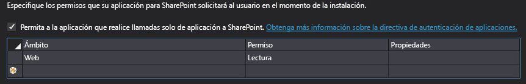
  

  

  
4. Establezca el complemento como proyecto de inicio y ejecute el proyecto. Puede encontrar los valores de ClientID y ClientSecret en el archivo ContosoMotorsCarInventoryWeb/Web.config. El código será similar a esto:
    
  ```XML
  
<add key="ClientId" value="06af1059-8916-4851-a271-2705e8cf53c6"/>
<add key="ClientSecret" value="LypZu2yVajlHfPLRn5J2hBrwCk5aBOHxE4PtKCjIQkk="/>
  ```

5. Reemplace los valores de ClientID y ClientSecret en "Configuración de complemento hospedado" en ContosoMotorsCarInventoryWeb/TokenHelper.cs con los valores anteriores. El código debe ser similar al siguiente:
    
  ```cs
  
private static readonly string ClientId = "06af1059-8916-4851-a271-2705e8cf53c6";
private static readonly string ClientSecret = "LypZu2yVajlHfPLRn5J2hBrwCk5aBOHxE4PtKCjIQkk=";

  ```


### Registrar la aplicación web con Azure AD

Los pasos de esta sección describen cómo registrar el complemento de ejemplo desde el Portal de administración de Azure.
  
    
    

1. Inicie sesión en el  [Portal de administración de Azure](http://go.microsoft.com/fwlink/?LinkID=512959) con su cuenta de coadministrador o administrador de servicio de Azure.
    
  
2. En el panel de navegación izquierdo, haga clic en **Active Directory**.
    
  
3. En la página de Active Directory, haga clic en el directorio que se ha configurado para la puerta de enlace de SAP para Microsoft.
    
    > [!SUGERENCIA]
      >  Si no está seguro de cuál se usó, consulte al administrador de la puerta de enlace de SAP para Microsoft. Sugerencia: Es el directorio que contiene los usuarios y grupos para la puerta de enlace de SAP para Microsoft.
4. En la barra de navegación superior, elija **APLICACIONES**.
    
  
5. En la parte inferior de la página, haga clic en **Agregar**.
    
  
6. En el cuadro de diálogo que se abre, elija **Agregar una aplicación que mi organización está desarrollando**.
    
  
7. En el cuadro de diálogo **AGREGAR aplicación**, escriba el nombre de la aplicación. Por ejemplo, use el nombre "SellerDashboard".
    
  
8. Elija **Aplicación web y/o API web** como tipo de aplicación y, a continuación, haga clic en el botón de flecha derecha.
    
  
9. En el cuadro de diálogo **Agregar propiedades**, use la dirección URL del sitio que creó anteriormente (en la sección Crear el sitio web de Azure) como la DIRECCIÓN URL DE INICIO DE SESIÓN. Por ejemplo, use *https://Constoso.azurewebsites.net*  .
    
  
10. Para el **URI DE ID. DE APLICACIÓN**, use un URI único para la aplicación, como el nombre de la aplicación anexado al final de la **DIRECCIÓN URL DE INICIO DE SESIÓN**. Por ejemplo, use  *https://Constoso.azurewebsites.net/SellerDashboard*  , donde Constoso.azurewebsites.net es el sitio que creó anteriormente en este artículo.
    
  
11. Haga clic en la marca de verificación para crear la aplicación. 
    
    Se abre el panel de Azure para la aplicación y muestra un mensaje de confirmación.
    
  

> [!NOTA]
> Debe registrar el complemento con Azure AD dos veces: una vez con fines de depuración, y luego para implementarlo para la producción, como se describe en el paso 10. > Para registrar el complemento con fines de depuración, use la **DIRECCIÓN URL DE INICIO DE SESIÓN** y el **URI DE ID. DE APLICACIÓN** con la dirección URL de depuración del proyecto SellerDashboard.Server para poder ejecutar el depurador de Visual Studio (F5). Esta dirección URL debe tener el formato https://localhost. *nnnn*  , donde *nnnn*  es un número de puerto. Puede encontrar esta dirección URL en el panel Propiedades en Visual Studio.> A continuación, cuando esté listo para la implementación de producción, edite el registro para usar la dirección URL correcta de producción. 
  
    
    


### Configurar las opciones de la aplicación

Configúrelas opciones para la nueva aplicación que creó en el procedimiento anterior. 
  
    
    

1. En la parte superior de la página de la aplicación, haga clic en **Configurar**.
    
  
2. Establezca los parámetros necesarios y tome nota de la configuración tal como se describe en la tabla siguiente.
    

|**Parámetro**|**Acción**|
|:-----|:-----|
|Identificador de cliente  <br/> |Copie el valor que aparece en el campo de identificador de cliente.  <br/> |
|Secreto de cliente  <br/> | Genere una clave de aplicación nueva: <br/>  En la sección Claves, seleccione una duración de 1 o 2 años de la clave. <br/>  En la barra de comandos en la parte inferior de la página, haga clic en **Guardar**.  <br/>  Ahora se muestra el valor de la clave. <br/>  Copie y guarde el valor de la clave para su uso futuro; no se puede recuperar después de salir de la página. <br/> |
|URI de id. de aplicación  <br/> |Copie el valor que aparece en el campo **URI de id. de complemento**.  <br/> |
   

    Recuerde conservar esta información a su alcance porque la necesitará más adelante.
    
  
3. En la sección **Permisos para otras aplicaciones**, haga lo siguiente:
    
1. Seleccione su aplicación de la puerta de enlace de SAP para Microsoft.
    
  
2. En la columna **Permisos delegados**, habilite las casillas de los permisos para la puerta de enlace de SAP para Microsoft que necesitará su complemento para SharePoint hospedado por el proveedor para SellerDashboard.
    
  
4. En la barra de comandos en la parte inferior de la página, haga clic en **Guardar**.
    
  

### Reemplazar la configuración necesaria para la implementación


1. Busque SellerDashboardHTMLClient/UserCode.js y busque el marcador de posición de código siguiente:
    
  ```cs
  
sharePointUrl: "Replace with your SharePoint host site",
// https://fake_domain.sharepoint.com/sites/Developer
SharePointRootUrl: "Replace with your SharePoint root site"
 // https://fake_domain.sharepoint.com/ 

  ```


1. Reemplace el valor de sharePointUrl con su sitio de SharePoint, en el que se instalará el complemento y también contiene la biblioteca de imágenes.
    
  
2. Reemplace el valor de sharePointRootUrl con el sitio de raíz de SharePoint correspondiente.
    
  
2. Busque SellerDashboard.Server/Web.config en la solución SellerDashboard y busque el marcador de posición de la configuración siguiente:
    
  ```XML
  
<add key="ClientSecret" value="MwMp1yxOyy8BGhfD5d9VvuqlRbhaqWESxVNLzgpYNHU=" />
<add key="ClientId" value="ed138b32-c89d-4f22-b74d-7d9d5044b260" />
<add key="Ida:ClientId" value="Replace with Azure register add-in client id" />
<add key="Ida:ClientSecret" value="Replace with Azure register add-in client secret" />
<add key="Ida:TenantId" value="Replace with the SAP Gateway for Microsoft tenant domain, for example <yourDomain>.onmicrosoft.com" />
<add key="Ida:RedirectUrl" value="Replace with the Azure host site, for example https://contoso.azurewebsites.net/SharePointLaunch.aspx" />
<add key="Ida:ResourceUrl" value="Replace with the SAP Gateway for Microsoft instance, for example http://contoso.cloudapp.net/" />
<add key="Ida:ODataServiceBaseUrl" value="Replace with the SAP OData endpoint url, for example https://contoso.cloudapp.net:8081/perf/sap/opu/odata/sap/ZCAR_POC_SRV/" />
<add key="Ida:ODataServiceMetadataUrl" value="Replace with the SAP OData endpoint metadata url, for example https://contoso.cloudapp.net:8081/perf/sap/opu/odata/sap/ZCAR_POC_SRV/$metadata" />
<add key="Ida:DataCollection" value="Replace with OData EntitySet name, for example ContosoMotorsCollection" />
<add key="Ida:ODataFeedOrEntryFormat" value="application/atom+xml" />
<add key="Ida:ODataMetadataFormat" value="application/xml" />
<add key="Ida:ODataContentType" value="application/xml" />
<add key="Ida:ODataVersion" value="2.0" />
<add key="Ida:ODataMaxVersion" value="3.0" />
<add key="Ida:ODataWriterTypeName" value="Replace with the OData EntityType, for example ZCAR_POC_SRV.ContosoMotors" />
<add key="Ida:DefaultID" value="1024" />
<add key="Ida:DefaultStockNo" value="2048" />
<add key="Ida:SPPicLib" value="Replace with you picture library name, for example ContosoMotorsPictureLibrary" />
  ```


1. Reemplace los valores de ClientId y ClientSecret con los valores que se obtuvo en el procedimiento anterior.
    
  
2. Reemplace los valores de Ida:ClientId e Ida:ClientSectet con los valores de la aplicación de Azure AD.
    
  
3. Reemplace el valor de Ida:TenantId con < *suDominio*  >.onmicrosoft.com.
    
    Por ejemplo, si su cuenta organizativa es alguien@< *suDominio*  >.onmicrosoft.com, < *suDominio*  >.onmicrosoft.com es lo que necesita.
    
  
4. Reemplace el valor de Ida:RedirectUrl con el sitio de prueba que creó en Azure, que hospeda el complemento.
    
  
5. Reemplace el valor de Ida:ResourceUrl con la instancia de la puerta de enlace de SAP para Microsoft que se ha implementado y configurado en Azure.
    
  
6. Reemplace el valor de Ida:ODataServiceBaseUrl con la dirección URL de extremo OData de instancia de la puerta de enlace de SAP para Microsoft.
    
  
7. Reemplace el valor de Ida:ODataServiceMetadataUrl con la dirección URL de metadatos de extremo OData de instancia de la puerta de enlace de SAP para Microsoft.
    
  
8. Reemplace el valor de Ida:DataCollection. Puede obtener este valor de los metadatos. Por ejemplo, use ContosoMotorsCollection.
    
  
9. Reemplace el valor de Ida:ODataWriterTypeName. Puede obtener el valor correcto de los metadatos. 
    
    Por ejemplo, use lo siguiente:
    


  ```XML
  
ZCAR_POC_SRV.ContosoMotors

<EntityContainer Name="ZCAR_POC_SRV_Entities" m:IsDefaultEntityContainer="true">
     <EntitySet sap:content-version="1" Name="ContosoMotorsCollection" sap:searchable="true" EntityType="ZCAR_POC_SRV.ContosoMotors"/>
</EntityContainer>
<atom:link xmlns:atom="http://www.w3.org/2005/Atom" href="http://contoso.cloudapp.net:8080/perf/sap/opu/odata/sap/ZCAR_POC_SRV.ContosoMotors"/>
  ```

10. Reemplace el valor de Ida:SPPicLib con el nombre de la biblioteca de imágenes, que creó en el sitio de host de SharePoint.
    
  

### Publicar el proyecto


1. Busque el proyecto SellerDashboard en la solución SellerDashboard.
    
  
2. Haga clic con el botón secundario en SellerDashboard para publicar el proyecto.
    
  
3. Elija **Hospedado por el proveedor**.
    
  
4. Elija **Windows Azure**.
    
  
5. Inicie sesión como administrador global.
    
  
6. Elija el sitio web que creó en Azure.
    
  
7. Indique que desea usar HTTPS.
    
  
8. Utilice la cadena predeterminada de conexiones de datos.
    
  
9. Especifique el sitio web que ha creado en Azure como sitio web de host. Especifique los valores de ClientId y ClientSecret, que se obtienen en el procedimiento anterior.
    
  
10. Publique.
    
     Obtendrá un paquete publicado.
    
  

### Instalar la aplicación


1. Inicie sesión en el sitio de implementación de SharePoint, como administrador del sitio.
    
  
2. En la página principal del sitio, haga clic en **Nuevo complemento para implementar**.
    
  
3. Elija el paquete que se obtiene desde el proceso de publicación.
    
  
4. Impleméntelo y confíe en él.
    
  

## Lista de códigos externos


  
    
    


|**Enlace web**|**Colección**|**Ubicación del código**|**Licencia**|
|:-----|:-----|:-----|:-----|
| [Tutorial de complemento de la encuesta: Desarrollar una aplicación para SharePoint utilizando LightSwitch](http://code.msdn.microsoft.com/Survey-App-Tutorial-a70d0afd) <br/>  [Tutorial: Crear un complemento para SharePoint utilizando LightSwitch](http://msdn.microsoft.com/es-es/library/jj969621.aspx) <br/> |**Cargador de foto:** <br/> PhotoListHelper.cs  <br/> PhotosController.cs  <br/> Global.asax.cs  <br/> | [Tutorial de complemento de la encuesta: Desarrollar una aplicación para SharePoint utilizando LightSwitch (C#)](http://www.getcodesamples.com/src/2571E87E/) <br/> |Licencia de Apache, versión 2.0  <br/> |
|nulo  <br/> |**Autorización de ACS:** <br/> SharePointContext.cs  <br/> TokenHelper.cs  <br/> |**Plantillas internas de VS:** <br/> Visual C#/Office/SharePoint/Apps/AppforSharePoint  <br/> ||
   
