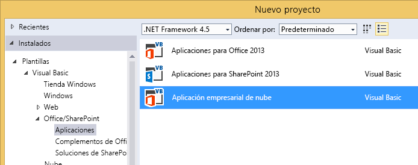
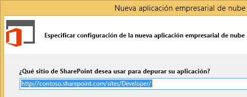
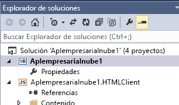
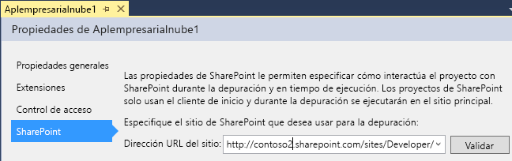

# Crear un complemento empresarial de nube
Con la plantilla Complemento empresarial de nube en Visual Studio, puede crear complementos de SharePoint 2013 o SharePoint en Office 365 optimizadas para la adición y administración de datos.
> **NOTA**
> También puede compilar un Complemento de SharePoint con la plantilla Complemento de SharePoint 2013. 

### Para crear un complemento empresarial de nube

1. En la barra de menús, elija **Archivo**, **Nuevo** y **Proyecto**.

    Se abre el cuadro de diálogo **Nuevo proyecto**.

2. En la lista de plantillas, expanda el nodo **Visual Basic** o **Visual C#**, expanda el nodo **Office/SharePoint**, elija el nodo **Complementos**, y luego elija la plantilla **Complemento empresarial de nube**, como se muestra en la Figura 1.

   **Figura 1. Plantilla Complemento empresarial de nube**

3. En el cuadro de texto **Nombre**, escriba un nombre para el proyecto y luego elija el botón **Aceptar**.

    Se abre el asistente para **Nuevo componente empresarial de nube**.

4. En el asistente **Nuevo componente empresarial de nube**, escriba la dirección URL del sitio para el servidor de SharePoint o su sitio para desarrolladores de Office 365 como se muestra en la Figura 2 y, a continuación, elija el botón **Finalizar**.

   **Figura 2. Dirección URL de SharePoint**

    La dirección URL debe tener la forma https:// _MiSitio_.sharepoint.com/sites/Developer/.

    Se agrega una nueva solución al Explorador de soluciones con cuatro proyectos: un proyecto de nivel superior, un proyecto de **HTMLClient**, un proyecto de **Servidor** y un proyecto de **SharePoint**.

### Para cambiar el sitio por un complemento empresarial de nube

1. En el ** Explorador de soluciones**, abra el menú contextual para el nodo de proyecto de nivel superior y elija **Propiedades**, como se muestra en la Figura 3.

   **Figura 3. El nodo de nivel superior**

    Se abre el diseñador de aplicaciones.

2. En el diseñador de aplicaciones, elija la pestaña **SharePoint** como se muestra en la Figura 4.

   **Figura 4. La pestaña SharePoint**

3. En la lista **Dirección URL del sitio**, elija una dirección URL existente o escriba la dirección URL del sitio para el servidor de SharePoint o sitio para desarrolladores de Office 365.

4. Elija el botón **Validar** para comprobar la dirección dirección URL.

## Recursos adicionales

-  [Desarrollo de complementos empresariales de nube](develop-cloud-business-add-ins.md)

-  [Creación de complementos empresariales de nube](create-cloud-business-add-ins.md)

