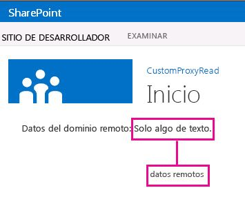

# Crear una página de proxy personalizada para la biblioteca entre dominios en SharePoint 2013
Aprenda a crear una página proxy personalizada para obtener acceso a los datos de un servicio remoto de una página web de SharePoint mediante la biblioteca entre dominios de SharePoint. 
Cuando se crean Complementos de SharePoint, por lo general deben incorporarse datos de orígenes diversos. No obstante, por motivos de seguridad, existen mecanismos de bloqueo que evitan las comunicaciones con más de un dominio a la vez.
  
    
    

Puede usar la biblioteca entre dominios para obtener acceso a los datos del complemento remoto, si proporciona una página de proxy personalizada que se hospede en la infraestructura de complementos remotos. En su condición de desarrollador, su responsabilidad es implementar la página de proxy personalizada y ocuparse de la lógica personalizada como, por ejemplo, el mecanismo de autenticación para el complemento remoto. Use la biblioteca entre dominios con una página de proxy personalizada si desea que la comunicación se establezca en el nivel de cliente.
## Requisitos previos para usar los ejemplos de este artículo
<a name="SP15Createcustomproxypage_Prereq"> </a>

Necesita un entorno de desarrollo, tal como se explica en  [Empezar a crear complementos hospedados en proveedor para SharePoint](get-started-creating-provider-hosted-sharepoint-add-ins.md).
  
    
    

### Conceptos básicos que deben conocerse antes de usar una página proxy personalizada con Complementos de SharePoint

En la tabla siguiente se enumeran varios artículos útiles que pueden ayudarle a comprender los conceptos que se manejan en un escenario entre dominios para Complementos de SharePoint.
  
    
    

**Tabla 1. Conceptos básicos para usar una página proxy personalizada**


|**Título del artículo**|**Descripción**|
|:-----|:-----|
| [Complementos de SharePoint](sharepoint-add-ins.md) <br/> |Obtenga información sobre el nuevo modelo de complementos de SharePoint que permite crear complementos; estos son soluciones pequeñas y fáciles de usar para usuarios finales.  <br/> |
| [Acceso a datos seguro y modelos de objetos de cliente para complementos de SharePoint](secure-data-access-and-client-object-models-for-sharepoint-add-ins.md) <br/> |Obtenga información sobre las opciones de acceso a datos en los Complementos de SharePoint. En este tema se orienta sobre las alternativas de alto nivel que se pueden elegir cuando se trabaja con datos en el complemento.  <br/> |
| [Hospedar webs, webs de complementos y componentes de SharePoint en SharePoint 2013](host-webs-add-in-webs-and-sharepoint-components-in-sharepoint-2013.md) <br/> |Aprenda cuál es la diferencia entre una web de host y una web de complemento. Descubra qué componentes de SharePoint se pueden incluir en un Complemento de SharePoint, qué componentes se implementan en la web de host y cuáles en la web de complemento y cómo se implementa la web de complemento en un dominio aislado.  <br/> |
| [Seguridad entre dominios del lado cliente](http://msdn.microsoft.com/es-es/library/cc709423%28vs.85%29.aspx) <br/> |Explore las amenazas entre dominios, use casos y principios de seguridad para efectuar solicitudes entre orígenes y sopese los riesgos que encaran los desarrolladores que quieren mejorar el acceso entre dominios desde aplicaciones web que se ejecutan en el explorador.  <br/> |
   

## Ejemplo de código: acceso a los datos remotos mediante una página proxy personalizada para la biblioteca entre dominios
<a name="SP15Createcustomproxypage_Codeexample"> </a>

Para leer datos del servicio remoto, debe ejecutar las operaciones siguientes: 
  
    
    

1. Crear un proyecto de Complemento de SharePoint.
    
  
2. Modificar el manifiesto del complemento para permitir la comunicación desde el complemento remoto.
    
  
3. Crear la página proxy personalizada y una página de contenido en el proyecto web.
    
  
4. Crear una página que use la biblioteca entre dominios en el proyecto de la Complemento de SharePoint.
    
  

### Para crear el proyecto de complemento de SharePoint


1. Abra Visual Studio como administrador. (Para hacer esto, haga clic con el botón secundario en el icono de Visual Studio en el menú **Inicio** y elija **Ejecutar como administrador**).
    
  
2. Cree el Complemento de SharePoint hospedado por el proveedor, tal como se explica en  [Empezar a crear complementos hospedados en proveedor para SharePoint](get-started-creating-provider-hosted-sharepoint-add-ins.md), y dele el nombre ProxyPageApp. 
    
  

### Para editar el archivo de manifiesto del complemento


1. En el **Explorador de soluciones**, haga clic con el botón secundario en el archivo **AppManifest.xml** y elija **Ver código**.
    
  
2. Sustituya todo el elemento **AppPrincipal** con lo siguiente.
    
  ```XML
  
<AppPrincipal>
    <Internal AllowedRemoteHostUrl="~remoteAppUrl"/>
</AppPrincipal>
  ```


    > **NOTA**
      > El atributo **AllowedRemoteHostUrl** se usa para especificar el dominio remoto. **~remoteAppUrl** resuelve la dirección URL del complemento remoto. Para obtener más información sobre tokens, vea [Explorar la estructura del manifiesto de aplicación y el paquete de un complemento de SharePoint](explore-the-app-manifest-structure-and-the-package-of-a-sharepoint-add-in.md). 

### Para crear una página proxy personalizada


1. Después de crear la solución Visual Studio, haga clic con el botón secundario en el proyecto de aplicación web (no en el proyecto de Complemento de SharePoint) y agregue un nuevo formulario web eligiendo **Agregar** > **Nuevo elemento** > **Web** > **Formulario web**. Dé al formulario el nombre Proxy.aspx.
    
  
2. En el archivo Proxy.aspx, sustituya todo el elemento html y su elemento secundario con el siguiente código HTML. Deje todo el código de marcado por encima del elemento html tal y como está. El código HTML contiene marcado y JavaScript que realiza las siguientes tareas:
    
  - Proporcionará un marcador de posición para el archivo JavaScript de la biblioteca entre dominios.
    
  
  - Extraerá del origen de referencia la dirección URL de la web de complemento.
    
  
  - Cargará dinámicamente el archivo JavaScript de la biblioteca entre dominios en el marcador de posición.
    
  
  - Proporcionará una configuración para el objeto **RequestExecutorMessageProcessor**.
    
  
  - Inicializará el objeto **RequestExecutorMessageProcessor**.
    
  

  ```HTML
  
<html xmlns="http://www.w3.org/1999/xhtml">
<head runat="server">
    <meta http-equiv="X-UA-Compatible" content="IE=8" /> 
    <title>Custom Proxy Host Page</title>
    <script 
        src="http://ajax.aspnetcdn.com/ajax/4.0/1/MicrosoftAjax.js" 
        type="text/javascript">
    </script>
    <script 
        type="text/javascript" 
        src="http://ajax.aspnetcdn.com/ajax/jQuery/jquery-1.7.2.min.js">
    </script>

    <!-- Script to load the cross-domain library js file -->
    <script type="text/javascript">
        var hostweburl;

        $(document).ready(function(){
            //Get the URI decoded host web URL.
            hostweburl =
                decodeURIComponent(
                    getQueryStringParameter("SPHostUrl")
            );

            // The cross-domain js file is in a URL in the form:
            // host_web_url/_layouts/15/SP.RequestExecutor.js
            var scriptbase = hostweburl + "/_layouts/15/";

            // Load the js file 
            $.getScript(scriptbase + "SP.RequestExecutor.js", initCustomProxy);
        });

        //Function to initialize the custom proxy page
        //  must set the appropriate settings and implement
        //  proper authentication mechanism
        function initCustomProxy() {
            var settings =
            {
                originAuthorityValidator: function (messageOriginAuthority) {
                    // This page must implement the authentication for the
                    //   remote add-in.
                       // You should validate if messageOriginAuthority is
                       //  an approved domain to receive calls from.
                    return true;
                }
            };
            SP.RequestExecutorMessageProcessor.init(settings);
        }

        // Function to retrieve a query string value.
        // For production purposes you may want to use
        //  a library to handle the query string.
        function getQueryStringParameter(paramToRetrieve) {
            var params =
                document.URL.split("?")[1].split("&amp;");
            var strParams = "";
            for (var i = 0; i < params.length; i = i + 1) {
                var singleParam = params[i].split("=");
                if (singleParam[0] == paramToRetrieve)
                    return singleParam[1];
            }
        }
    </script>
</head>
<body>
    
</body>
</html>


  ```


    > **IMPORTANTE**
      > En una Complemento de SharePoint de producción, debe proporcionar en la configuración la lógica de autorización y devolver el valor apropiado en el objeto **originAuthorityValidator**. 

### Para crear una página de contenido


1. Haga clic con el botón secundario en el proyecto de aplicación web, en el **Explorador de soluciones**, y agregue un nuevo formulario web eligiendo **Agregar** > **Nuevo elemento** > **Web** > **Formulario web**. Dé al formulario el nombre Content.aspx..
    
  
2. Copie el código siguiente y péguelo en el método **Page_Load** en el archivo de código subyacente. El código realiza las siguientes tareas:
    
  - Configura el **content-type** de salida en **text/plain**.
    
  
  - Escribe el contenido en el búfer de salida.
    
  
  - Finaliza la conexión.
    
  

  ```cs
  
string content;
content = "Just some text.";
Response.ContentType="text/plain";
Response.Write(content);
Response.End();

  ```


### Para crear una página web de SharePoint que use la biblioteca entre dominios


1. Haga clic con el botón secundario en el proyecto Complemento de SharePoint y elija **Agregar** > **Nuevo elemento** > **Office/SharePoint** > **Módulo**.
    
  
2. Dé al módulo el nombre Pages y elija **Agregar**.
    
  
3. Haga clic con el botón derecho en la carpeta **Pages** y elija **Agregar** > **Nuevo elemento**> **Office/SharePoint** > **Página**. 
    
  
4. Dé a la página el nombre Home.aspx y elija **Agregar**.
    
  
5. Abra la página **Home.aspx** si no se ha abierto automáticamente.
    
  
6. Copie el código siguiente y péguelo en la etiqueta de contenido **PlaceHolderMain**. 
    
  ```
  
<!-- The page dynamically loads the cross-domain library's
    js file, rescript acts as the placeholder. -->
<script 
    type="text/javascript"
    id="rescript"
    src="../_layouts/15/SP.RequestExecutor.js">
</script>
    Data from the remote domain: <span id="TextData"></span>

    <!-- Main script to retrieve the host web's title -->
    <script type="text/javascript">
    (function () {
        var executor;
        var hostweburl;
        var remotedomain;

        remotedomain = "<your_remote_add-in_domain>";

        //Get the URI decoded host web URL.
        hostweburl =
            decodeURIComponent(
                getQueryStringParameter("SPHostUrl")
        );

        // Initialize the RequestExecutor with the custom proxy URL.
        executor = new SP.RequestExecutor(remotedomain);
        executor.iFrameSourceUrl = "Proxy.aspx?SPHostUrl=" + hostweburl;

        // Issue the call against the remote endpoint.
        // The response formats the data in plain text.
        // The functions successHandler and errorHandler attend the
        //      sucess and error events respectively.
        executor.executeAsync(
            {
                url:
                    remotedomain + "Content.aspx",
                method: "GET",
                headers: { "Accept": "text/plain" },
                success: successHandler,
                error: errorHandler
            }
        );
    })();

    // Function to handle the success event.
    // Prints the data to the placeholder.
    function successHandler(data) {
        document.getElementById("TextData").innerText =
            data.body;
    }

    // Function to handle the error event.
    // Prints the error message to the page.
    function errorHandler(data, errorCode, errorMessage) {
        document.getElementById("TextData").innerText =
            "Could not complete cross-domain call: " + errorMessage;
    }

    // Function to retrieve a query string value.
    // For production purposes you may want to use
    //  a library to handle the query string.
    function getQueryStringParameter(paramToRetrieve) {
        var params =
            document.URL.split("?")[1].split("&amp;");
        var strParams = "";
        for (var i = 0; i < params.length; i = i + 1) {
            var singleParam = params[i].split("=");
            if (singleParam[0] == paramToRetrieve)
                return singleParam[1];
        }
    }
    </script>

  ```

7. En el código que pegó anteriormente, busque la línea  `remotedomain = "<your_remote_add-in_domain>";` y sustituya el marcador de posición _<your_remote_add-in_domain>_ por la dirección URL "localhost" que su aplicación web usa cuando se ejecuta el complemento con F5 en Visual Studio. Para encontrar su valor, elija el proyecto de aplicación web en el **Explorador de soluciones**. La propiedad **URL** estará en el panel **Propiedades**. Use el valor completo, incluido el protocolo, el puerto y la barra de cierre. Por ejemplo, "http://localhost:45072".
    
  
8. Guarde y cierre el archivo.
    
  
9. Abra el archivo appmanifest.xml y establezca el valor de **Página de inicio** a **ProxyPageApp/Pages/Home.aspx**.
    
  

### Para crear y ejecutar la solución


1. Compruebe que el proyecto de la Complemento de SharePoint esté configurado como proyecto de inicio.
    
  
2. Presione la tecla F5.
    
    > **NOTA**
      > Al presionar F5, Visual Studio crea la solución, implementa el complemento y abre la página de permisos del complemento. 
3. Elija el botón **Confiar**.
    
    La página de inicio se abrirá y debería tener este aspecto. La frase "Just some text" podría tardar un poco en aparecer porque se está obteniendo de la página Content.aspx del dominio remoto.
    

   **Datos del servicio remoto en una página web de SharePoint**

  

     
  

  

  

**Tabla 2. Solución de problemas en la solución**


|**Problema**|**Solución**|
|:-----|:-----|
|Visual Studio no abre el explorador después de presionar la tecla F5.  <br/> |Configure el proyecto de la Complemento de SharePoint como proyecto de inicio.  <br/> |
|Excepción no controlada **SP no está definido**. <br/> |Compruebe que se puede obtener acceso al archivo SP.RequestExecutor.js en una ventana del explorador.  <br/> |
   

## Pasos siguientes
<a name="SP15Createcustomproxypage_Nextsteps"> </a>

En este artículo se explica cómo obtener acceso a los datos remotos mediante una página proxy personalizada para la biblioteca entre dominios de SharePoint. En un paso siguiente, puede informarse de las demás opciones de acceso a datos disponibles en las Complementos de SharePoint. Para obtener más información, vea lo siguiente:
  
    
    

-  [Ejemplo de código: obtener datos con una página del servidor proxy para la librería entre dominios](http://code.msdn.microsoft.com/SharePoint-2013-Get-data-10039ff1)
    
  
-  [Cómo obtener acceso a los datos de SharePoint 2013 desde aplicaciones con la biblioteca entre dominios](access-sharepoint-2013-data-from-add-ins-using-the-cross-domain-library.md)
    
  
-  [Consultar un servicio remoto mediante el proxy web en SharePoint 2013](query-a-remote-service-using-the-web-proxy-in-sharepoint-2013.md)
    
  

## Recursos adicionales
<a name="SP15Createcustomproxypage_Addresources"> </a>


-  [Configurar un entorno de desarrollo en el nivel local para complementos para SharePoint](set-up-an-on-premises-development-environment-for-sharepoint-add-ins.md)
    
  
-  [Trabajar con datos externos en SharePoint 2013](work-with-external-data-in-sharepoint-2013.md)
    
  
-  [Acceso a datos seguro y modelos de objetos de cliente para complementos de SharePoint](secure-data-access-and-client-object-models-for-sharepoint-add-ins.md)
    
  
-  [Autorización y autenticación de complementos de SharePoint](authorization-and-authentication-of-sharepoint-add-ins.md)
    
  
-  [Usar operaciones de consulta de OData en solicitudes REST de SharePoint](use-odata-query-operations-in-sharepoint-rest-requests.md)
    
  
-  [Tres formas de concebir las opciones de diseño de complementos para SharePoint](three-ways-to-think-about-design-options-for-sharepoint-add-ins.md)
    
  
-  [Aspectos importantes del panorama de desarrollo y arquitectura de los complementos para SharePoint](important-aspects-of-the-sharepoint-add-in-architecture-and-development-landscap.md)
    
  
-  [Almacenamiento de datos en complementos de SharePoint](important-aspects-of-the-sharepoint-add-in-architecture-and-development-landscap.md#Data)
    
  

