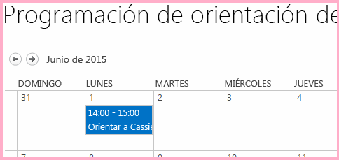

# Crear un botón personalizado de la cinta de opciones en la web de host de un complemento de SharePoint
Agregue comandos de botón de cinta de opciones personalizado a la web de host de un Complemento de SharePoint.
Este es el noveno de una serie de artículos sobre los fundamentos del desarrollo de Complementos de SharePoint hospedados en SharePoint. Primero debe familiarizarse con los  [Complementos de SharePoint](sharepoint-add-ins.md) y con los anteriores artículos de esta serie:

-  [Empezar a crear complementos hospedados en SharePoint para SharePoint](get-started-creating-sharepoint-hosted-sharepoint-add-ins.md)

-  [Implementar e instalar un complemento hospedado en SharePoint para SharePoint](deploy-and-install-a-sharepoint-hosted-sharepoint-add-in.md)

-  [Agregar columnas personalizadas a un complemento de SharePoint hospedado en SharePoint](add-custom-columns-to-a-sharepoint-hostedsharepoint-add-in.md)

-  [Agregar un tipo de contenido personalizado a un complemento de SharePoint hospedado en SharePoint](add-a-custom-content-type-to-a-sharepoint-hostedsharepoint-add-in.md)

-  [Agregar un elemento web a una página de un complemento para SharePoint hospedado en SharePoint](add-a-web-part-to-a-page-in-a-sharepoint-hosted-sharepoint-add-in.md)

-  [Agregar un flujo de trabajo a un complemento hospedado en SharePoint para SharePoint](add-a-workflow-to-a-sharepoint-hosted-sharepoint-add-in.md)

-  [Agregar una página y un estilo personalizados a un complemento hospedado en SharePoint para SharePoint](add-a-custom-page-and-style-to-a-sharepoint-hosted-sharepoint-add-in.md)

-  [Agregar representación del lado cliente personalizada a un complemento de SharePoint hospedado en SharePoint](add-custom-client-side-rendering-to-a-sharepoint-hosted-sharepoint-add-in.md)

> **NOTA**
> Si ha estado trabajando en esta serie sobre complementos hospedados en SharePoint, ya tiene una solución de Visual Studio que puede usar para continuar con este tema. También puede descargar el repositorio en  [SharePoint_SP-hosted_Add-Ins_Tutorials](https://github.com/OfficeDev/SharePoint_SP-hosted_Add-Ins_Tutorials) y abrir el archivo BeforeRibbon.sln.

Todos los Complementos de SharePoint pueden ejecutarse desde la página **Contenido del sitio** de la web de host haciendo clic en el icono del complemento. Las funciones de un Complemento de SharePoint también puede exponerse en la web de host a través de acciones personalizadas, que son botones personalizados de la cinta de opciones o elementos de menú personalizados. En este artículo, agregaremos un botón a la cinta de opciones en una web de host.
## Preparar la web de host

Agregará el botón a la cinta de opciones de un calendario en la web de host. Realice los pasos siguientes en la interfaz de usuario del sitio para desarrolladores de SharePoint.

1. En la página principal del sitio, elija **Contenido del sitio** > **agregar un complemento** > **Calendario**.

2. En el cuadro de diálogo **Agregar calendario**, escriba Programación de orientación del empleado para el **Nombre** y luego elija **Crear**.

3. Cuando se abra el calendario, coloque el cursor en cualquier fecha hasta que aparezca el vínculo **Agregar** en la fecha y luego haga clic en **Agregar**. 

4. En el cuadro de diálogo **Programación de orientación del empleado: nuevo elemento**, escriba Orientar a Cassi Hicks en el **Título**. Deje el resto de los campos con sus valores predeterminados y haga clic en **Guardar**.

    El calendario debe ser similar al siguiente:

   **Calendario personalizado**

> **IMPORTANTE**
> El siguiente procedimiento requiere que el calendario esté visible en la interfaz de usuario de Visual Studio, pero no estará visible si Visual Studio estaba abierto cuando creó el calendario. Antes de continuar, cierre Visual Studio y salga también de las ventanas del explorador y consolas de PowerShell donde haya iniciado sesión en el sitio para desarrolladores. 

## Agregar una acción personalizada de la cinta de opciones

1. En el **Explorador de soluciones**, haga clic con el botón derecho en el proyecto **EmployeeOrientation** y, a continuación, elija **Agregar** > **Nuevo elemento** > **Office/SharePoint** > **Acción personalizada de cinta**. Asígnele el nombre RunOrientationAdd-in y luego elija **Agregar**.

2. El asistente para **Crear acción personalizada de la cinta** le hace una serie de preguntas. Dé las repuestas de la siguiente tabla:

|**Pregunta de propiedad**|**Respuesta**|
|:-----|:-----|
|¿Dónde desea exponer la acción personalizada?    |Elija **Web de host**.    |
|¿Qué ámbito tiene la acción personalizada?    |Elija **Instancia de lista** ( *no*  Plantilla de lista).   |
|¿Qué elemento específico tiene como ámbito la acción personalizada?    |Elija **Programación de orientación del empleado**.    |
|¿Dónde se encuentra el control?    |No use las selecciones de lista desplegable. En su lugar, escriba **Ribbon.Calendar.Events.Actions.Controls._children**. (La tercera parte, **Events**, identifica la ficha de la cinta de opciones y la cuarta parte, **Actions**, identifica el grupo de botones).    |
|¿Cuál es el texto del elemento de menú?    |Escriba **Orientación del empleado**.    |
|¿Adónde navega la acción personalizada?    |No use las selecciones de lista desplegable. En su lugar, escriba **~appWebUrl/Lists/NewEmployeesInSeattle**. Esta es la página de vista de lista para la lista, que está en la web de complemento, de modo que el botón de la cinta de opciones en la web de host abre una página en la web de complemento.    |
 
3. Elija **Finalizar**. 

## Inspeccionar la característica de web de complemento

En el **Explorador de soluciones**, expanda la carpeta **Características** y elija la característica **NewEmployeeOrientationComponents**. Se abre el Diseñador de características.

Observe que la acción personalizada que creó, **RunOrientationAdd-in**, aparece en **Elementos de la solución**, pero no en **Elementos de la característica**. Esto se debe a que la característica se implementa en la web de complemento, pero la acción personalizada se implementa en la web de host. Cuando empaqueta el complemento en Visual Studio para la implementación en producción, o cuando presiona F5 en Visual Studio, el Office Developer Tools para Visual Studio crea una característica de web de host especial, le agrega la acción personalizada y la implementa en la web de host. Nunca debería editar la característica de web de host. Por ese motivo, no se crea hasta el momento del empaquetado.

**Diseñador de características**

## Ejecutar y probar el complemento

1. Use la tecla F5 para implementar y ejecutar el complemento. Visual Studio realizará una instalación temporal del complemento en su sitio de SharePoint de prueba y ejecutará el complemento inmediatamente. 

2. Se abre la página predeterminada del Complemento de SharePoint. Vaya a la página principal del sitio para desarrolladores (que es la web de host). Hay un vínculo de ruta de navegación que lleva a ella en la esquina superior izquierda de la página.

3. En la página principal de la web de host, elija **Contenido del sitio** y, en la página **Contenido del sitio**, haga clic en el calendario **Programación de orientación del empleado** (no el complemento **Orientación del empleado**).

4. Cuando se abra el calendario, haga clic en el evento **Orientar a Cassie Hicks**. Si la ficha **Eventos** de la cinta de opciones no se abre automáticamente, ábrala. Debería ser similar al siguiente:

   **Ficha de cinta de opciones de eventos con botón personalizado**

5. En el grupo **Acciones** de la cinta de opciones, haga clic en **Orientación del empleado**. Se abre la página de vista de lista para **Nuevos empleados de Seattle**.

6. Para terminar la sesión de depuración, cierre la ventana del explorador o detenga la depuración en Visual Studio. Cada vez que presione F5, Visual Studio retirará la versión anterior del complemento e instalará la más reciente.

7. Trabajará con este complemento y con la solución de Visual Studio en otros artículos, y se considera recomendable retirar el complemento una última vez cuando acabe de trabajar en él durante un tiempo. En el proyecto, haga clic con el botón derecho en el **Explorador de soluciones** y elija **Retirar**.

## 

En el siguiente artículo de esta serie, agregaremos JavaScript al Complemento de SharePoint y obtendremos acceso a los datos de SharePoint con el modelo de objetos de JavaScript de SharePoint:  [Usar las API de JavaScript de SharePoint para trabajar con datos de SharePoint](use-the-sharepoint-javascript-apis-to-work-with-sharepoint-data.md).

