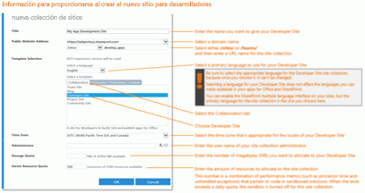

# Crear un sitio para desarrolladores en una suscripción existente de Office 365
Un Sitio para desarrolladores de Office 365 hace que sea más fácil y rápido prepararse y empezar a crear, comprobar e implementar Complementos de Office y SharePoint. Muchas suscripciones empresariales, de negocios, educativas y gubernamentales a Office 365 incluyen una plantilla de sitio que sirve para crear un Sitio para desarrolladores.
 **Antes de comenzar**

- **Procure tener una suscripción a Office 365 que admita un Sitio para desarrolladores.** Si tiene uno de los siguientes planes de suscripción a Office 365, puede crear un Sitio para desarrolladores con su suscripción existente.

> Office 365 Mediana Empresa

> Office 365 Enterprise E1, E3, E4, E5 o K1

> Office 365 Educación A2, A3 o A4

> Office 365 Administración Pública G1, G3, G4 o K1

- **Si tiene una suscripción de Office 365 Pequeña Empresa,** esta solo admite una única colección de sitios, por lo que no podrá crear una colección de sitios para desarrolladores. Si quiere obtener más información sobre los planes de Office 365 para su empresa, consulte [SharePoint Online: límites de software](http://office.microsoft.com/es-es/office365-sharepoint-online-enterprise-help/sharepoint-online-limites-de-software-HA102694293.aspx).

- Para obtener más información sobre las ofertas de Office 365 Enterprise, consulte  [Suscripciones y precios](http://products.office.com/es-es/business/office-365-enterprise-e1-business-software
).

## Crear un sitio para desarrolladores

1. Inicie sesión en Office 365 como administrador global o de SharePoint Online.

    **Hay que iniciar sesión como administrador global o de SharePoint Online para crear colecciones de sitios** (como un Sitio para desarrolladores). Los administradores son los únicos que pueden ver las opciones de administración al iniciar sesión en Office 365. Si no es administrador, póngase en contacto con un administrador de su empresa y pídale que realice uno de los procedimientos siguientes:

  - Concederle derechos administrativos para poder crear el Sitio para desarrolladores.

  - Crear el Sitio para desarrolladores en su nombre y designarlo como administrador de la colección de sitios.

2. Haga clic en el botón Iniciador de aplicaciones en el extremo izquierdo de la barra de navegación de la parte superior.

3. Haga clic en el icono **Administración**.

4. En el árbol de navegación de la parte izquierda, expanda **Administración** y seleccione **SharePoint**.

5. En la pestaña **Colecciones de sitios** del **Centro de administración de SharePoint**, haga clic en **Nuevo > Colección de sitios privados**.

!\[Opción Nueva colección de sitios del Centro de administración de SharePoint](images/SPAdminCenter_newSiteCollection.png)

6. En el cuadro de diálogo **Nueva colección de sitios**, escriba información sobre su sitio para desarrolladores.

    **Haga clic en la siguiente imagen para pasearse por las opciones de la nueva colección de sitios del cuadro de diálogo, o bien consulte la tabla debajo de la imagen a modo de guía.**
     

|||
|:-----|:-----|
|**Título**   |Nombre que quiere dar al sitio para desarrolladores.    |
|Lista **Dirección del sitio web público**   |Nombre de dominio y ruta de acceso URL ( **/sites/** o **/teams/**). A continuación, escriba un nombre de dirección URL que especifique para la colección de sitios.    |
|Lista **Seleccionar un idioma** de la sección **Selección de plantilla**   |Idioma principal que se va a usar en el sitio para desarrolladores.    **Asegúrese de seleccionar el idioma apropiado para la colección de sitios de Sitio para desarrolladores, ya que no podrá cambiarlo una vez que lo elija.**   Seleccione un idioma para el sitio para desarrolladores no afecta a los idiomas que pueda haber disponibles en los complementos de Office y SharePoint.    Puede habilitar la interfaz multilingüe de SharePoint en sus sitios, pero el idioma principal de la colección de sitios será el que elija aquí.    |
|Sección **Selección de plantilla** de la pestaña **Colaboración**, en **Seleccionar una plantilla**   |Elija **Sitio para desarrolladores**.    |
|**Zona horaria**   |Zona horaria que corresponda a la configuración regional de su sitio para desarrolladores.    |
|**Administrador**   |Nombre de usuario del administrador de la colección de sitios.    |
|**Cuota de almacenamiento**   |Número de megabytes (MB) que desea asignar a esta colección de sitios del sitio para desarrolladores.    |
|**Cuota de recursos de servidor**   |Cantidad de recursos que se asignará a la colección de sitios.    Este número es una combinación de métricas de rendimiento (como el tiempo del procesador y las excepciones no controladas) que corresponden al código en las soluciones de espacio aislado. Cuando el nivel supera una cuota diaria, el espacio aislado de esta colección de sitios se desactiva.    |
 
7. Haga clic en **Aceptar**.

    La nueva dirección URL del sitio para desarrolladores aparecerá en la lista **Colecciones de sitios**. Cuando el sitio haya terminado de crearse, podrá ir a la dirección URL para abrir el sitio para desarrolladores.

!\[Aprovisionamiento de nueva colección de sitios](images/SPAdminCenter_newSiteCollection_provisioning.png)

## Recursos adicionales

-  [Complementos de SharePoint](sharepoint-add-ins.md)

-  [Crear o eliminar una colección de sitios](http://office.microsoft.com/es-es/office365-sharepoint-online-enterprise-help/create-or-delete-a-site-collection-HA102772354.aspx?CTT=1)

