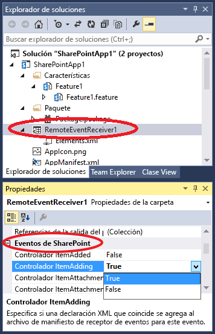

# Crear un receptor de eventos remotos en complementos para SharePoint
Cree un receptor de eventos remotos (RER) que controle eventos de lista y eventos de elementos de lista en una Complemento de SharePoint.
## Requisitos previos
<a name="SP15appevent_prereq"> </a>

Se recomienda tener conocimientos previos sobre Complementos de SharePoint hospedadas por el proveedor y haber desarrollado algunas que vayan un poco más allá del nivel de "Hello World". Además, debe estar familiarizado con  [Controlar eventos en los complementos de SharePoint](handle-events-in-sharepoint-add-ins.md). 


## Crear un receptor de eventos remotos
<a name="MakeRER"> </a>

En este artículo se muestra cómo extender una Complemento de SharePoint al agregar un receptor de eventos remotos (RER) que controla el evento ItemAdded para una lista personalizada en la web de complemento. El RER está registrado con la web de complemento mediante el marcado declarativo. Los RER está registrados con la  *web de host*  mediante programación. Para ver un ejemplo de código que haga esto, consulte [OfficeDev/PnP/Samples/Core.EventReceivers](https://github.com/OfficeDev/PnP/tree/master/Samples/Core.EventReceivers).


Un RER debe ser un servicio web SOAP. El ejemplo que continúa implementa esto como servicio de Windows Communication Foundation (WCF); pero es posible en principio implementar un RER en una pila que no es de Microsoft.


Para continuar con este artículo y escribir el código usted mismo, descargue el ejemplo del artículo de  [SharePoint-Add-in-CSOM-BasicDataOperations](https://github.com/OfficeDev/SharePoint-Add-in-CSOM-BasicDataOperations) y, luego, ábralo en Visual Studio.


> **NOTA**
> En este ejemplo se usa un archivo TokenHelper.cs generado por Office Developer Tools para Visual Studio. Esta era la versión más reciente cuando se creó el ejemplo, pero es posible que no lo sea versión más reciente cuando lea esto. Con todo, sigue siendo un excelente ejemplo para crear su primer RER. Cuando esté listo para avanzar, consulte los ejemplos que aparecen en la sección Pasos siguientes abajo, ya que es bastante probable que estén actualizados. 


### Para registrar un receptor de eventos remotos


1. Abra el proyecto de Complemento de SharePoint en Visual Studio. 


2.  En el **Explorador de soluciones**, elija el nodo del proyecto del complemento.


3. En la barra de menús, seleccione **Proyecto**, **Agregar nuevo elemento**.


4. En el panel **Plantillas instaladas**, seleccione el nodo **Office/ SharePoint**.


5. En el panel **Plantillas**, elija la plantilla **Receptor de eventos remoto**.


6. En la casilla **Nombre** conserve el nombre predeterminado (RemoteEventReceiver1) y después seleccione el botón **Agregar**.


7. En la lista **¿Qué tipo de receptor de eventos desea usar?**, elija **Eventos de elementos de lista**.


8. En la lista **¿Qué elemento debe ser el origen del evento?**, elija **Lista personalizada**.

    El ejemplo que continúa usa una lista genérica personalizada. Sin embargo, un RER también puede controlar eventos que ocurren en listas estándar de SharePoint, como **Anuncios** o **Contactos**.


9. En la lista **Controlar los siguientes eventos**, elija **Se va a agregar un elemento** y después seleccione el botón **Finalizar**.

    Se agrega un servicio web a la aplicación web para controlar el evento remoto que especificó. Se agrega un receptor de eventos remotos a la Complemento de SharePoint y se hace referencia al evento de elemento de lista en el archivo Elements.xml del receptor que está contenido en la Característica web de complemento.


### Para crear la lista


1. En el **Explorador de soluciones**, seleccione el nodo del proyecto del complemento.


2. En la barra de menús, seleccione **Proyecto**, **Agregar nuevo elemento**.


3. En el panel **Plantillas instaladas**, seleccione el nodo **Office SharePoint**.


4. En el panel **Plantillas**, seleccione la plantilla **Lista**.


5. En la casilla **Nombre**, deje el nombre predeterminado (List1) y después elija el botón **Agregar**.


6. Seleccione el botón de opción **Crear una instancia de lista basada en una plantilla de lista existente**, elija **Lista personalizada** en la lista y después seleccione el botón **Finalizar**.


### Para agregar funciones al receptor de eventos remotos


1. Si la granja de prueba de SharePoint no está en el mismo equipo donde se ejecuta Visual Studio (o está usando un arrendamiento de SharePoint Online como sitio de prueba de SharePoint), configure el proyecto para la depuración mediante el Bus de servicio de Microsoft Azure. Para obtener más información, consulte  [Depurar y solucionar problemas de un receptor de eventos remotos en un complemento para SharePoint](debug-and-troubleshoot-a-remote-event-receiver-in-a-sharepoint-add-in.md). 


2. En el archivo de código para el servicio del receptor de eventos remotos (es decir, RemoteEventReceiver1.svc.cs), reemplace el contenido por el código siguiente.

    Este código ejecuta las tareas siguientes.

  - Obtiene un objeto de contexto de cliente válido. 


  - Si no existe una lista llamada **EventLog**, crea una que contenga los nombres de los eventos remotos que se producen.


  - Agrega para el evento una entrada a la lista que contiene una marca de fecha y hora.


    > **NOTA**
      > En el momento en el que se redactó este artículo, Office Developer Tools para Visual Studio agregaba referencias a todos los ensamblados necesarios cuando el receptor se creaba, pero es posible que las versiones más recientes de las herramientas no lo hagan. Si obtiene errores de compilador, bastará con agregar las referencias que faltan (por ejemplo, necesitará agregar referencias a System.ServiceModel o System.ComponentModel.DataAnnotations). 


 ```cs

using System;
using System.Collections.Generic;
using System.Linq;
using System.Net;
using System.Text;
using Microsoft.SharePoint.Client;
using Microsoft.SharePoint.Client.EventReceivers;
using System.Runtime.Serialization;
using System.ServiceModel;
using System.ServiceModel.Channels;


namespace BasicDataOperationsWeb.Services
{
    public class RemoteEventReceiver1 : IRemoteEventService
    {
        public SPRemoteEventResult ProcessEvent(SPRemoteEventProperties properties)
        {
            // When a "before" event occurs (such as ItemAdding), call the event 
            // receiver code.
            ListRemoteEventReceiver(properties);
            return new SPRemoteEventResult();
        }

        public void ProcessOneWayEvent(SPRemoteEventProperties properties)
        {
            // When an "after" event occurs (such as ItemAdded), call the event 
            // receiver code.        
        }

        public static void ListRemoteEventReceiver(SPRemoteEventProperties properties)
        {
            string logListTitle = "EventLog";

            // Return if the event is from the EventLog list itself. Otherwise, it may go into
            // an infinite loop.
            if (string.Equals(properties.ItemEventProperties.ListTitle, logListTitle, 
                  StringComparison.OrdinalIgnoreCase))
                return;

            // Get the token from the request header.
            HttpRequestMessageProperty requestProperty = 
                  (HttpRequestMessageProperty)OperationContext
                   .Current.IncomingMessageProperties[HttpRequestMessageProperty.Name];
            string contextTokenString = requestProperty.Headers["X-SP-ContextToken"];

            // If there is a valid token, continue.
            if (contextTokenString != null)
            {
                SharePointContextToken contextToken =
                    TokenHelper.ReadAndValidateContextToken(contextTokenString, 
                         requestProperty.Headers[HttpRequestHeader.Host]);

                Uri sharepointUrl = new Uri(properties.ItemEventProperties.WebUrl);
                string accessToken = TokenHelper.GetAccessToken(contextToken, 
                                                      sharepointUrl.Authority).AccessToken;
                bool exists = false;

                // Retrieve the log list "EventLog" and add the name of the event that occurred
                // to it with a date/time stamp.
                using (ClientContext clientContext = 
                     TokenHelper.GetClientContextWithAccessToken(sharepointUrl.ToString(), 
                                                                                                         accessToken))
                {
                    clientContext.Load(clientContext.Web);
                    clientContext.ExecuteQuery();
                    List logList = clientContext.Web.Lists.GetByTitle(logListTitle);

                    try
                    {
                        clientContext.Load(logList);
                        clientContext.ExecuteQuery();
                        exists = true;
                    }

                    catch (Microsoft.SharePoint.Client.ServerUnauthorizedAccessException)
                    {
                        // If the user doesn't have permissions to access the server that's 
                        // running SharePoint, return.
                        return;
                    }

                    catch (Microsoft.SharePoint.Client.ServerException)
                    {
                        // If an error occurs on the server that's running SharePoint, return.
                        exists = false;
                    }

                    // Create a log list called "EventLog" if it doesn't already exist.
                    if (!exists)
                    {
                        ListCreationInformation listInfo = new ListCreationInformation();
                        listInfo.Title = logListTitle;
                        // Create a generic custom list.
                        listInfo.TemplateType = 100;
                        clientContext.Web.Lists.Add(listInfo);
                        clientContext.Web.Context.ExecuteQuery();
                    }

                    // Add the event entry to the EventLog list.
                    string itemTitle = "Event: " + properties.EventType.ToString() + 
                          " occurred on: " + 
                          DateTime.Now.ToString(" yyyy/MM/dd/HH:mm:ss:fffffff");
                    ListCollection lists = clientContext.Web.Lists;
                    List selectedList = lists.GetByTitle(logListTitle);
                    clientContext.Load<ListCollection>(lists);
                    clientContext.Load<List>(selectedList);
                    ListItemCreationInformation listItemCreationInfo = 
                          new ListItemCreationInformation();
                    var listItem = selectedList.AddItem(listItemCreationInfo);
                    listItem["Title"] = itemTitle;
                    listItem.Update();
                    clientContext.ExecuteQuery();
                }
            }
        }
    }
}
 ```

3. En Home.aspx.cs, cambie todas las instancias de  `SPHostUrl` por `SPAppWebUrl`.

    Por ejemplo,  `sharepointUrl = new Uri(Request.QueryString["SPHostUrl"]);` debe cambiarse a `sharepointUrl = new Uri(Request.QueryString["SPAppWebUrl"]);`. 


## Ejecutar y probar el controlador de eventos
<a name="RunAndTest"> </a>

Pruebe el controlador con el procedimiento siguiente.


1. Presione la tecla **F5** para ejecutar el proyecto.


2. Confíe en el complemento cuando se requiera.

    La Complemento de SharePoint se ejecutará y aparecerá una tabla de listas disponibles que incluye **List1**.


3. Seleccione el ID de **List1**.

    El ID se copia en el cuadro **Recuperar elementos de lista**.


4. Elija el botón **Recuperar elementos de lista**.

    **List1** aparecerá sin ningún elemento.


5. En el cuadro **Agregar elemento**, especifique Primer elemento y luego seleccione el botón **Agregar elemento**.

    Se agregará un elemento llamado **Primer elemento** a **List1**, lo que hará que se inicie el receptor de eventos remoto y se agregue una entrada en la lista EventLog.


6. Elija el botón **Actualizar listas** para regresar a la tabla de listas.

    En la tabla, aparecerá una lista nueva llamada **EventLog**.


7. Elija el valor de GUID **ListID** para **EventLog** y después seleccione el botón **Recuperar elementos de lista**.

    Aparecerá una tabla para **EventLog** con una entrada para el evento **Controlar ItemAdding** que se produjo cuando agregó el elemento a **List1**.


## Agregar o quitar controladores de eventos con Visual Studio
<a name="Handle"> </a>


1. En el **Explorador de soluciones**, seleccione el nodo de proyecto del receptor de eventos remotos.


2. En el panel **Propiedades**, establezca las propiedades de los eventos que desea controlar en **True**.

    Por ejemplo, si desea responder cada vez que un usuario agregue un elemento de lista, establezca el valor de la propiedad **Handle ItemAdding** en **True**. Si no desea controlar ese evento, establezca el valor de esa propiedad en **False**.


   **Figura 1. Eventos remotos de SharePoint en Visual Studio**





3. Si agregó un evento, agregue el código de control de eventos para el archivo de código del servicio web como lo hizo con eventos anteriores.

    Para controlar otro tipo de evento, agregue otro receptor de eventos remotos a la Complemento de SharePoint. Por ejemplo, si un receptor de eventos remotos controla los eventos de elementos de lista, puede agregarle otro evento de elementos de lista. Pero si desea controlar los eventos de la lista, deberá agregar otro receptor de eventos remotos. 


## Dirección URL y restricciones de hospedaje para los receptores de eventos remotos de producción
<a name="Handle"> </a>

El receptor de eventos remotos se puede hospedar en la nube o en un servidor local que no se esté usando también como un servidor de SharePoint. La dirección URL de un receptor de producción no puede especificar un puerto determinado. Esto significa que hay que usar el puerto 443 para HTTPS (lo que recomendamos) o el puerto 80 para HTTP. Si usa HTTPS y el servicio del receptor se hospeda de forma local, pero el complemento se encuentra en Microsoft SharePoint Online, el servidor de hospedaje deberá tener un certificado de confianza pública procedente de una entidad de certificación (un certificado autofirmado solo funcionará si el complemento está en una granja de servidores de SharePoint local).


## Pasos siguientes
<a name="Handle"> </a>

Use los siguientes ejemplos de código para conocer más sobre los RER:


-  [OfficeDev/PnP/Samples/Core.EventReceivers](https://github.com/OfficeDev/PnP/tree/master/Samples/Core.EventReceivers)


-  [OfficeDev/PnP/Samples/Provisioning.ReR](
https://github.com/OfficeDev/PnP/tree/master/Samples/Provisioning.ReR)


-  [OfficeDev/PnP/Scenarios/ECM.AutoTagging](https://github.com/OfficeDev/PnP/tree/master/Samples/ECM.AutoTagging)


## Recursos adicionales
<a name="Additional"> </a>


-  [Controlar eventos en los complementos de SharePoint](handle-events-in-sharepoint-add-ins.md)


-  [Depurar y solucionar problemas de un receptor de eventos remotos en un complemento para SharePoint](debug-and-troubleshoot-a-remote-event-receiver-in-a-sharepoint-add-in.md)


-  [Preguntas frecuentes sobre los receptores de eventos remotos](handle-events-in-sharepoint-add-ins.md#RERFAQ)


