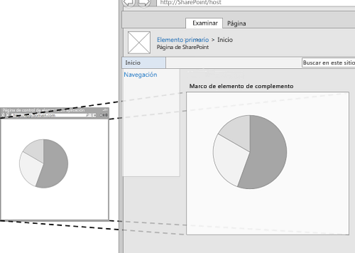
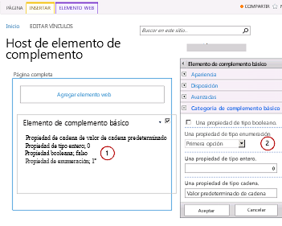
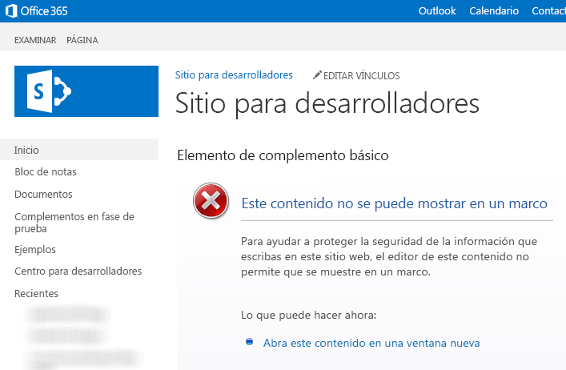

# Crear elementos del complemento para instalar con el complemento para SharePoint
Obtenga información sobre cómo crear un elemento de complemento en SharePoint 2013 que se encuentre disponible en la galería de elementos web del sitio web de host cuando instale la Complemento de SharePoint.
Con los elementos del complemento, puede mostrar la experiencia de usuario del complemento directamente en las páginas del sitio web de SharePoint. Un elemento de complemento muestra la página web (que suele tener forma interactiva o una visualización dinámica de datos) que especifique mediante un **IFrame** (también conocido como marco) en una página en la [web de host](http://msdn.microsoft.com/library/fp179925.aspx). Para obtener más información sobre los elementos de complemento, consulte los siguientes artículos:


-  [Obtener acceso al complemento desde la interfaz de usuario](important-aspects-of-the-sharepoint-add-in-architecture-and-development-landscap.md#AccessingApp)


-  [Diseño de la experiencia de usuario para aplicaciones en SharePoint 2013](ux-design-for-sharepoint-add-ins.md)


-  [Extender la interfaz de usuario de SharePoint en complementos](sharepoint-add-ins-ux-design-guidelines.md#UXGuide_Extending)


La figura 1 muestra cómo se ve el contenido del elemento de complemento en una página de SharePoint.


**Figura 1. El contenido del elemento de complemento en una página de SharePoint**





Un elemento de complemento se implementa con la clase **ClientWebPart** y, como todos los elementos web, está disponible en la galería de elementos web tras una instalación de usuario de la Complemento de SharePoint que lo incluya. Los usuarios pueden personalizar aún más el elemento de complemento usando las propiedades que usted proporcione. (Véase en la figura 2, más adelante, un ejemplo de propiedades configurables en un elemento de complemento.)El ejemplo de este artículo usa una página web hospedada en un servidor remoto, no en SharePoint, como página de contenido. Tenga en cuenta que también puede usar páginas SharePoint para hospedar contenido de elementos de complemento, como se describe en la sección  [Otras situaciones comunes con elementos de complemento](#SP15Createappparts_Nextsteps), en este mismo artículo.
## Requisitos previos para usar los ejemplos de este artículo
<a name="SP15Createappparts_Prereq"> </a>

Para seguir los pasos de este ejemplo, necesita lo siguiente:


- Visual Studio


- Microsoft Office Developer Tools para Visual Studio


- Un entorno de desarrollo SharePoint. Si necesita ayuda para establecer un entorno de desarrollo, vea  [Empezar a crear complementos hospedados en proveedor para SharePoint](get-started-creating-provider-hosted-sharepoint-add-ins.md).


## Crear un elemento de complemento para su instalación en la web de host
<a name="SP15Createappparts_Codeexample"> </a>

Son necesarias varias tareas para crear e instalar su elemento de complemento en la web de host:


1. Crear los proyectos de Complemento de SharePoint y de web remota.


2. Agregue un formulario para el contenido del elemento de complemento.


3. Agregue el elemento de complemento al proyecto Complemento de SharePoint.


Tras completar las tareas, el elemento de complemento debería tener un aspecto similar a la Figura 2 cuando está en modo edición. Aquí podemos ver (1) el contenido del complemento que se muestra en una página SharePoint, y (2) las propiedades personalizadas de los elementos del complemento.


**Figura 2. Página de SharePoint que hospeda un elemento de complemento básico**





### Agregar un formulario para el contenido de elemento de complemento


1. Cree una Complemento de SharePoint hospedada en proveedor, como se describe en  [Empezar a crear complementos hospedados en proveedor para SharePoint](get-started-creating-provider-hosted-sharepoint-add-ins.md), pero dé al proyecto el nombre TestAppPart.


2. Una vez creada la solución Visual Studio, haga clic derecho en el proyecto de aplicación web (no en el proyecto Complemento de SharePoint) y agregue un nuevo formulario web eligiendo **Agregar** > **Nuevo elemento** > **Web** > **Formulario web**. Dé al formulario el nombre AppPartContent.aspx.


3. En el archivo AppPartContent.aspx, sustituya todo el elemento html y sus elementos secundarios con el siguiente código HTML. Deje como están todos los códigos de marcado sobre el elemento html. El código HTML contiene JavaScript que realiza las siguientes tareas:

  - Extrae los valores de propiedad predeterminados de la siguiente cadena de consulta


  - Procesa los valores de propiedad


    Observe que el código espera algunos parámetros en la cadena de consulta. El elemento de complemento proporciona sus propiedades personalizadas a través de la cadena de consulta de forma que la página web pueda usarlas. La siguiente tarea explica cómo declarar propiedades personalizadas y cómo ponerlas a disposición de la página web del complemento.


 ```HTML

<html>
    <body>
        <div id="content">
            <!-- Placeholders for properties -->
            String property: <span id="strProp"></span><br />
            Integer property: <span id="intProp"></span><br />
            Boolean property: <span id="boolProp"></span><br />
            Enumeration property: <span id="enumProp"></span><br />
        </div>

    <!-- Main JavaScript function, controls the rendering
         logic based on the custom property values -->
    <script lang="javascript">
        "use strict";

        var params = document.URL.split("?")[1].split("&amp;");
        var strProp;
        var intProp;
        var boolProp;
        var enumProp;

        // Extracts the property values from the query string.
        for (var i = 0; i < params.length; i = i + 1) {
            var param = params[i].split("=");
            if (param[0] == "strProp")
                strProp = decodeURIComponent(param[1]);
            else if (param[0] == "intProp")
                intProp = parseInt(param[1]);
            else if (param[0] == "boolProp")
                boolProp = (param[1] == "true");
            else if (param[0] == "enumProp")
                enumProp = decodeURIComponent(param[1]);
        }

        document.getElementById("strProp").innerText = strProp;
        document.getElementById("intProp").innerText = intProp;
        document.getElementById("boolProp").innerText = boolProp;
        document.getElementById("enumProp").innerText = enumProp;
    </script>
    </body>
</html>
 ```

4. Guarde y cierre el archivo.


### Agregue el elemento de complemento al proyecto de complemento para SharePoint.


1. Haga clic con el botón secundario en el proyecto Complemento de SharePoint (no en el proyecto de aplicación web) y elija **Agregar** > **Nuevo elemento** > **Office/SharePoint** > **Elemento web cliente (web de host)**. ("Elemento web cliente" es otro nombre para "elemento de complemento".)


2. Denomine al elemento Elemento de complemento básico.


3. En el cuadro de diálogo **Especificar la página del elemento web cliente**, elija **Seleccionar o escribir una dirección URL para una página web existente**. Elija la página **TestAppWebPart/AppPartContent.aspx** en la lista desplegable. (Una vez hecha la elección, la dirección URL de la página puede aparecer en el cuadro con "TestAppWebPart" sustituido por **~remoteAppUrl** y con **{StandardTokens }** agregado a los parámetros de consulta.)


4. Elija **Terminar**.


5. Haga clic con el botón secundario en **Elemento de complemento básico**, en el **Explorador de soluciones**, y elija **Propiedades**.


6. En el panel **Propiedades**, seleccione **Propiedades personalizadas** y elija el botón de llamada ( **...**).


7. Use el cuadro de diálogo **Propiedades personalizadas** para agregar cuatro propiedades personalizadas al elemento de complemento. Debe establecer cinco atributos para cada una de las cuatro propiedades personalizadas. Los nombres de los atributos y sus valores se indican en la tabla 1. Cree las propiedades mediante el siguiente procedimiento.

1. Elija **Agregar**.


2. En la lista de atributos, seleccione el primero de la tabla 1: **DefaultValue**.


3. Establezca el valor, por ejemplo,Valor predeterminado de cadena.


4. Elija el siguiente atributo, **Name**, y establezca su valor, por ejemplo, strProp.


5. Continúe con los atributos **Type**, **WebCategory** y **WebDisplayName**.


6. Elija **Agregar** de nuevo y repita el proceso para las cuatro filas de la tabla 1. *No*  cierre el cuadro de diálogo.

   **Tabla 1. Atributos para las propiedades personalizadas del elemento de complemento**


|**Valor predeterminado**|**Nombre**|**Tipo**|**Categoría web**|**Nombre para mostrar del sitio web**|
|:-----|:-----|:-----|:-----|:-----|
|Valor predeterminado de cadena  <br/> |strProp  <br/> |cadena  <br/> |Categoría de elemento de complemento básico  <br/> |Una propiedad de tipo cadena  <br/> |
|0  <br/> |intProp  <br/> |entero  <br/> |Categoría de elemento de complemento básico  <br/> |Una propiedad de tipo entero  <br/> |
|falso  <br/> |boolProp  <br/> |booleano  <br/> |Categoría de elemento de complemento básico  <br/> |Una propiedad de tipo booleano  <br/> |
|1st  <br/> |enumProp  <br/> |enumeración  <br/> |Categoría de elemento de complemento básico  <br/> |Una propiedad de tipo enumeración  <br/> |
 

    En este punto, el cuadro de diálogo debería tener este aspecto:


   **Cuadro de diálogo Propiedades personalizadas para ClientWebPart**


!\[El cuadro de diálogo de propiedades personalizadas del elemento web cliente con 4 propiedades listadas a la izquierda y cada una de ellas con 5 atributos establecidos en la parte derecha.](images/6a0f0a56-3184-490a-af19-b51b7545671d.PNG)


8. Seleccione la propiedad **enumProp**, elija el atributo **EnumItems** y luego elija el botón de llamada ( **...**).


9. Use el **editor de colecciones ClientWebPartEnumItem** para agregar tres elementos. Debe establecer dos atributos en cada uno. Los nombres de los atributos y sus valores se indican en la tabla 2. Cree las propiedades mediante el siguiente procedimiento.

1. Elija **Agregar**.


2. En la lista de atributos, seleccione el primer atributo de la tabla 2: **Value**.


3. Establezca el valor del atributo, por ejemplo, 1st.


4. Elija el siguiente atributo, **WebDisplayName**, y establezca su valor, por ejemplo, First option.


5. Elija **Agregar** de nuevo y repita el proceso para todas las filas de la tabla 2.

   **Tabla 2. Elementos de enumeración de la propiedad enumProp**


|**Valor**|**Nombre para mostrar del sitio web**|
|:-----|:-----|
|1st  <br/> |Primera opción  <br/> |
|2nd  <br/> |Segunda opción  <br/> |
|3rd  <br/> |Tercera opción  <br/> |
 

    El cuadro de diálogo debería tener el siguiente aspecto cuando termine:


   **Editor de colecciones ClientWebPartEnumItem**


!\[Editor de colección de elemento de enumeración de elemento web cliente con 3 elementos listados y cada uno con un atributo de valor y un atributo de nombre de presentación web.](images/1b21d968-bd58-4f30-a019-84df6181b81a.PNG)


6. Elija **Aceptar** para cerrar el cuadro de diálogo y elija **Aceptar** de nuevo para cerrar el cuadro de diálogo **Propiedades personalizadas**.


10. Visual Studio genera el siguiente código XML en el archivo elements.xml del elemento de complemento (se añaden saltos de línea por claridad). Fíjese en que el atributo **Title** del elemento **ClientWebPart** está establecido en "Basic add-in part Title", y que la descripción está establecida en "Basic add-in part Description". Borre la palabra "Title" en el primero y sustituya el segundo conUn elemento de complemento básico.

 ```XML

<?xml version="1.0" encoding="UTF-8"?>
<Elements xmlns="http://schemas.microsoft.com/sharepoint/">
    <ClientWebPart
        Name="Basic add-in part"
        Title="Basic add-in part Title"
        Description="Basic add-in part Description" >
    
        <!--  The properties are passed through the query string 
                using the following notation: _propertyName_
                in the Src property of the Content element.
          -->
        <Content
            Src="~remoteAppUrl/AppPartContent.aspx?strProp=_strProp_&amp;amp;intProp=_intProp_&amp;amp;boolProp=_boolProp_&amp;amp;enumProp=_enumProp_"
            Type="html"/>
        <Properties>
            <Property
                Name="strProp"
                Type="string"
                RequiresDesignerPermission="true"
                DefaultValue="String default value"
                WebCategory="Basic add-in part category"
                WebDisplayName="A property of type string.">
            </Property>
            <Property
                Name="intProp"
                Type="int"
                RequiresDesignerPermission="true"
                DefaultValue="0"
                WebCategory="Basic add-in part category"
                WebDisplayName="A property of type integer.">
            </Property>
            <Property
                Name="boolProp"
                Type="boolean"
                RequiresDesignerPermission="true"
                DefaultValue="false"
                WebCategory="Basic add-in part category"
                WebDisplayName="A property of type boolean.">
            </Property>
            <Property
                Name="enumProp"
                Type="enum"
                RequiresDesignerPermission="true"
                DefaultValue="1st"
                WebCategory="Basic add-in part category"
                WebDisplayName="A property of type enum.">
                <EnumItems>
                    <EnumItem WebDisplayName="First option" Value="1st"/>
                    <EnumItem WebDisplayName="Second option" Value="2nd"/>
                    <EnumItem WebDisplayName="Third option" Value="3rd"/>
                </EnumItems>
            </Property>
        </Properties>
    </ClientWebPart>
</Elements>           

 ```


### Establecer como página de inicio del complemento la página de inicio de la web de host


1. El ejemplo habitual, Complemento de SharePoint, no tiene ninguna web de complemento y sus aplicaciones web remotas existen solo para hospedar el formulario. No hay ninguna experiencia inmersiva y a página completa para este complemento. Por tanto, debería establecerse como su página de inicio la página de inicio de la web de host.

    Para comenzar, seleccione el proyecto Complemento de SharePoint (no el proyecto de aplicación web) en el **Explorador de soluciones** y copie en el portapapeles el valor de la propiedad **Site URL**, incluido el protocolo (por ejemplo, **https://contoso.sharepoint.com**).


2. Abra el manifiesto del complemento y pegue la dirección URL en el cuadro **Página de inicio**.


3. Si lo desea, puede eliminar la página Default.aspx del proyecto de aplicación web, ya que no se utiliza en la Complemento de SharePoint.


### Compilar y probar la solución


1. Presione la tecla F5.

    > **NOTA**
      > Al presionar F5, Visual Studio crea la solución, instala el complemento y abre la página de permisos del complemento. 
2. Elija el botón **Confiar**.


3. Agregue el **elemento de complemento básico** desde la galería de elementos de complemento. Para obtener instrucciones detalladas, vea [Agregar un elemento de complemento a una página](https://support.office.com/article/Add-an-App-Part-to-a-page-6f06c0b7-44b8-4c69-b4ad-85197eee8d78).

    Cuando el complemento está instalado en la web de host, el **elemento de complemento básico** está disponible en la galería de elementos de complemento. Debería parecerse mucho a la figura 3.


   **Figura 3. Elemento de complemento en la galería de elementos de complemento**


!\[Elemento de aplicación básico en la galería de elementos web](images/BasicAppPart_gallery.jpg)


4. Después de agregar el elemento de complemento, elija la flecha hacia abajo, a la derecha del título **Elemento de complemento básico**, y luego elija **Editar elemento web**.

    Debería ver el elemento de complemento en modo edición, parecido a la figura 1 anterior.


5. Abra la **categoría Elemento de complemento básico** y cambie algunos valores de las propiedades.


6. Haga clic en **Aceptar** para guardar los cambios y comprobar que las propiedades han cambiado en el elemento de complemento.


7. Cuando acabe la sesión de depuración, y no volverá a utilizar F5 en este proyecto durante un tiempo, es recomendable retirar la Complemento de SharePoint una última vez para garantizar que el elemento de complemento de prueba se haya quitado de su página de inicio. Haga clic con el botón secundario en el proyecto Complemento de SharePoint y elija **Retirar**.


## Solución de problemas
<a name="SP15Createappparts_Codeexample"> </a>


**Tabla 3. Solución de problemas de la solución**


|**Problema**|**Solución**|
|:-----|:-----|
|El elemento de complemento no muestra ningún contenido, sino este error: **Se canceló la navegación a la página web**. Esto error se produce porque el explorador ha bloqueado el contenido de la página. <br/> | Habilite el contenido mixto. El procedimiento podría ser diferente en función del explorador que use: <br/>  Internet Explorer versión 9 y 10 muestra el mensaje siguiente en la parte inferior de la página: **Solo se visualiza el contenido seguro**. Elija **Mostrar todo el contenido** para que aparezca el contenido del elemento de complemento. <br/>  Internet Explorer 8 muestra un cuadro de diálogo con el mensaje siguiente: **¿Desea ver el contenido de la página web que se entregó de forma segura?** Elija **No** para que aparezca el contenido del elemento de complemento. <br/>  De manera opcional, puede habilitar el contenido mixto en la zona de Internet en la que está trabajando. Para la mayoría de desarrolladores, la zona de Internet es **Intranet local**. Si este no es su caso, sustituya **Intranet local** con la zona de Internet en la que esté trabajando. <br/>  En Internet Explorer, elija **Herramientas** > **Opciones de Internet**.  <br/>  En el cuadro de diálogo **Opciones de Internet**, en la pestaña **Seguridad**, elija **Intranet local** y luego elija el botón **Nivel personalizado**.  <br/>  En el cuadro de diálogo **Configuración de seguridad**, habilite **Mostrar contenido mixto** en la sección **Miscelánea**.  <br/> |
 

## Otras situaciones comunes con elementos de complemento
<a name="SP15Createappparts_Nextsteps"> </a>

En este artículo se muestra cómo crear un elemento de complemento básico con propiedades personalizadas usando una página web remota como página de contenido. También puede explorar los siguientes escenarios y detalles de los elementos de complemento.


### Usar una página de SharePoint como página de contenido

En la mayoría de los casos, una página web no se puede mostrar en un marco si envía un encabezado HTTP **X-Frame-Options** en la respuesta. De forma predeterminada, las páginas de SharePoint incluyen el encabezado **X-Frame-Options**. Si usa una página de SharePoint hospedada en la web de complemento, podría aparecer el siguiente error (que se muestra en la figura 4): **Este contenido no se puede mostrar en un marco**


**Figura 4. Elemento de complemento que no puede mostrar su contenido en un marco**





Tenga en cuenta que determinados escenarios son susceptibles a los ataques de " [secuestro de clics](http://blogs.msdn.com/b/ieinternals/archive/2010/03/30/combating-clickjacking-with-x-frame-options.aspx)" cuando las páginas web se muestran en un marco. Revise con detenimiento los escenarios de elementos de complemento para asegurarse de que no existe ningún riesgo de ataques de **secuestro de clics**.


Si la página hospedada en la web de complemento no es susceptible de recibir ataques de secuestro de clics, puede usar el elemento web **AllowFraming** para suprimir el encabezado de **opciones de X-Frame** de la respuesta de la página. En el ejemplo de código siguiente se muestra cómo usar el elemento web **AllowFraming** en una página de SharePoint. Copie este código de marcado en la página hospedada en la web de complemento. Colóquelo encima del primer elemento **asp:content** de la página. No debería ser elemento secundario de ningún otro elemento.



```XML

<WebPartPages:AllowFraming ID="AllowFraming1" runat="server" />
```

Puede descargar un  [ejemplo de código de elemento de complemento](http://code.msdn.microsoft.com/SharePoint-2013-Display-be8dac16) que muestra cómo usar una página de SharePoint como la página de contenido.


### Ajustar el tamaño del marco del elemento de complemento

Si está usando contenido dinámico en el elemento de complemento, el contenido podría cambiar el ancho y la altura. Dada su naturaleza dinámica, es posible que no se ajuste al marco. También es posible que esté usando demasiado espacio. Con el contenido dinámico puede resultar muy difícil especificar un tamaño fijo en la declaración del elemento de complemento. No obstante, puede cambiar el tamaño del marco para que se ajuste al ancho y a la altura.


Puede usar mensajes POST de su página web de contenidos para especificar el tamaño del marco. El siguiente ejemplo de JavaScript muestra cómo enviar un mensaje POST para cambiar el tamaño del marco en el que se hospeda su elemento de complemento. Es habitual tenerlo en un método JavaScript, en un archivo JavaScript que es posible llamar desde la página. Por ejemplo, la página podría tener un control en el que cada usuario especifique el tamaño de la ventana del elemento de complemento. A continuación, se llama al método personalizado desde el controlador **onchange** del control. Para obtener un ejemplo completo, vea [Ejemplo de código: Cambiar el tamaño de los elementos de complemento de forma dinámica en complementos para SharePoint](http://code.msdn.microsoft.com/officeapps/SharePoint-2013-Resize-app-594acc88).



```
window.parent.postMessage("<message senderId={SenderId}>resize(120, 300)</message>", {hostweburl});
```

En el ejemplo anterior, el valor de **senderId** se va a establecer en la cadena de consultas de la página automáticamente por parte del código del elemento del complemento cuando se represente la página. Bastará con que la página lea el valor de **SenderId** en la cadena de consultas y lo use cuando se solicite cambiar el tamaño. Puede recuperar la dirección URL de la web de host de la cadena de consultas anexando los tokens de **StandardTokens** o **HostUrl** al atributo **Src** en la definición del elemento del complemento. Puede descargar el [ejemplo de código para cambiar el tamaño de elementos de complemento](http://code.msdn.microsoft.com/officeapps/SharePoint-2013-Resize-app-594acc88) para ver un elemento de complemento que cambia de tamaño dinámicamente.


### Usar la hoja de estilo de SharePoint en el contenido del elemento de complemento

Como el elemento de complemento está hospedado en una página de SharePoint, es posible que desee que el aspecto del contenido del elemento de complemento sea similar al resto de la página. Una forma de lograr el mismo aspecto es usar las mismas clases de estilos que la página de SharePoint que está hospedando el elemento de complemento. Para que el elemento de complemento tenga a su disposición la hoja de estilos del sitio web de SharePoint, agregue una referencia al archivo **defaultcss.ashx** desde la web de complemento.


Puede consultar  [Usar una hoja de estilos del sitio web de SharePoint en complementos de SharePoint](use-a-sharepoint-website-s-style-sheet-in-sharepoint-add-ins.md) para obtener una explicación sobre cómo se hace referencia al archivo **defaultcss.ashx** en las Complementos de SharePoint. También puede descargar el [ejemplo de código de la cafetera](http://code.msdn.microsoft.com/office/SharePoint-2013-App-part-9d83703c) para ver un elemento de complemento que haga referencia a la hoja de estilos.


### Detectar cuándo está el elemento de complemento en modo de edición

Los usuarios pueden editar el elemento de complemento para cambiar sus propiedades. Por ejemplo, un usuario podría querer cambiar una de las propiedades **Appearance** o **Layout** del elemento de complemento (vea la figura 2, arriba). Si el complemento está en modo de edición, tal vez quiera modificar la lógica de representación o impedir algún procesamiento innecesario. Piense, por ejemplo, en un elemento de complemento que llame a una base de datos back-end cada vez que la página host vuelva a cargarse. Cambiar el valor de propiedad de un elemento de complemento en el modo de edición provoca que una página vuelva a cargarse, pero tal vez no quiera que la llamada a la red se active en ese caso. Puede utilizar el token **_editMode_** para detectar si los usuarios están editando su elemento de complemento.


Para usar el token **_editMode_**, agregue un parámetro de cadena de consulta al atributo **Src** del elemento **Content** en la declaración del elemento de complemento.



```XML
<Content Src="content_page_url&amp;amp;editmode=_editMode_">
```

El token **_editMode_** permite a la página de contenido determinar si el elemento de complemento está en el modo de edición, en cuyo caso el token **_editMode_** se resuelve en 1 y, de lo contrario, el token se resuelve en 0.


## Recursos adicionales
<a name="SP15Createappparts_AddResources"> </a>


-  [Ejemplo de código: Mostrar contenido de complementos remotos en la web de host mediante un elemento de complemento](http://code.msdn.microsoft.com/SharePoint-2013-Display-03c28286)


-  [Ejemplo de código: Mostrar contenido de web de complemento en la web de host mediante un elemento de complemento](http://code.msdn.microsoft.com/SharePoint-2013-Display-be8dac16)


-  [Ejemplo de código: Cambiar el tamaño de los elementos de complemento de forma dinámica en complementos para SharePoint](http://code.msdn.microsoft.com/officeapps/SharePoint-2013-Resize-app-594acc88)


-  [Ejemplo de código: Mostrar contenido de un sitio web remoto mediante el elemento de complemento cafetera](http://code.msdn.microsoft.com/SharePoint-2013-App-part-9d83703c)


-  [Configurar un entorno de desarrollo en el nivel local para complementos para SharePoint](set-up-an-on-premises-development-environment-for-sharepoint-add-ins.md)


-  [Diseño de la experiencia de usuario para aplicaciones en SharePoint 2013](ux-design-for-sharepoint-add-ins.md)


-  [Directrices de diseño de los complementos para la experiencia de usuario de SharePoint](sharepoint-add-ins-ux-design-guidelines.md)


-  [Crear componentes de experiencia de usuario en SharePoint 2013](create-ux-components-in-sharepoint-2013.md)


-  [Tres formas de concebir las opciones de diseño de complementos para SharePoint](three-ways-to-think-about-design-options-for-sharepoint-add-ins.md)


-  [Aspectos importantes del panorama de desarrollo y arquitectura de los complementos para SharePoint](important-aspects-of-the-sharepoint-add-in-architecture-and-development-landscap.md)


