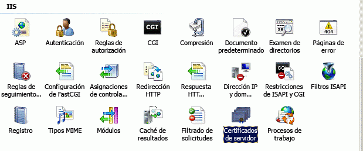
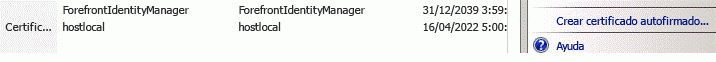
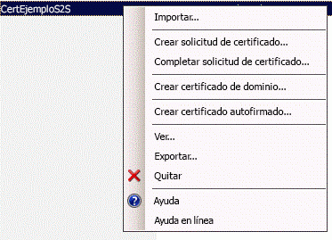
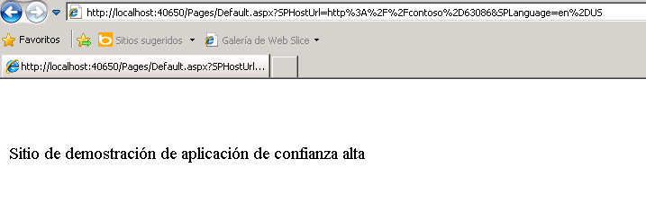

# Crear complementos de SharePoint de elevada confianza
Aprenda a crear una Complemento de SharePoint de elevada confianza. Un complemento de elevada confianza usa certificados digitales para establecer una confianza entre la aplicación web remota y SharePoint 2013. Los complementos de elevada confianza solo se pueden instalar en SharePoint local, no en Microsoft SharePoint Online, y están previstas principalmente para usarse con una aplicación web local en lugar de basada en la nube.
## Requisitos previos para crear complementos de elevada confianza
<a name="Prereqs"> </a>

Para seguir los procedimientos de este artículo, asegúrese de que tiene lo siguiente:


- Un entorno de desarrollo SharePoint 2013 local. Consulte  [Configurar un entorno de desarrollo en el nivel local para complementos para SharePoint](set-up-an-on-premises-development-environment-for-sharepoint-add-ins.md) para obtener instrucciones de configuración. En concreto, asegúrese de que ha completado los pasos de la sección [Configurar servicios en SharePoint para el uso de complementos de servidor a servidor](set-up-an-on-premises-development-environment-for-sharepoint-add-ins.md#Servertoserver).


- Experiencia en la creación de una Complemento de SharePoint hospedada por el proveedor. Consulte  [Empezar a crear complementos hospedados en proveedor para SharePoint](get-started-creating-provider-hosted-sharepoint-add-ins.md).


- Visual Studio instalado remotamente o en el equipo donde ha instalado SharePoint 2013.


- Microsoft Office Developer Tools para Visual Studio.


- Conocimientos sobre los certificados digitales: qué son y cómo usarlos.


Lea los artículos siguientes para informarse mejor sobre las Complementos de SharePoint y los certificados digitales.


**Tabla 1. Conceptos básicos para configurar SharePoint 2013 para ejecutar complementos de elevada confianza**


|**Título del artículo**|**Descripción**|
|:-----|:-----|
| [Empezar a crear complementos hospedados en proveedor para SharePoint](get-started-creating-provider-hosted-sharepoint-add-ins.md) <br/> |Aprenda a crear una Complemento de SharePoint básica hospedada por proveedor con Office Developer Tools para Visual Studio y cómo interactuar con sitios de SharePoint 2013 a través de CSOM de SharePoint.  <br/> |
| [Digital Certificates](http://msdn.microsoft.com/library/e523b335-0156-4f47-b55c-b80495587c4f.aspx) y [Working with Certificates](http://msdn.microsoft.com/library/6ffb8682-8f07-4a45-afbb-8d2487e9dbc3.aspx) <br/> |Obtenga información acerca de las ideas básicas de los certificados digitales.  <br/> |
 

## Introducción a la ejecución de complementos de elevada confianza
<a name="Intro"> </a>

Un complemento de elevada confianza es una Complemento de SharePoint hospedada por proveedor que usa certificados digitales para establecer la confianza entre la aplicación web remota y SharePoint. "Elevada confianza" no es lo mismos que "plena confianza". Un complemento de elevada confianza debe seguir solicitando permisos de complemento. El complemento se considera de "elevada confianza" porque se le permite usar cualquier identidad de usuario que necesite el complemento, ya que el complemento es responsable de crear la parte de usuario del token de acceso que pasa a SharePoint.


Una Complemento de SharePoint de elevada confianza está prevista principalmente para usarse en un entorno local. El complemento de elevada confianza no se puede instalar en Microsoft SharePoint Online y, normalmente, los componentes remotos también se instalan localmente, en el firewall corporativo. Por lo tanto, las instancias de la Complemento de SharePoint son específicas de cada empresa.


Un complemento de elevada confianza usa un certificado en lugar de un token de contexto para establecer la confianza. (Una aplicación hospedada por el proveedor y compilada para usar el Servicio de control de acceso (ACS) de Microsoft Azure como agente de confianza se debe modificar para que funcione como una aplicación de elevada confianza). Los complementos de elevada confianza necesitan una configuración determinada en la granja de SharePoint y en el servidor que hospeda la aplicación web remota. En este tema se describen los pasos de configuración necesarios para que la depuración de Visual Studio ( **F5**) funcione. Configurar un entorno de prueba, de ensayo o de producción es algo distinto y se describe en el tema  [Empaquetar y publicar complementos de gran confianza para SharePoint](package-and-publish-high-trust-sharepoint-add-ins.md). 


En SharePoint 2013, el servicio de token de seguridad (STS) de servidor a servidor proporciona tokens de acceso para la autenticación de servidor a servidor. El STS de servidor a servidor permite a los tokens de acceso temporales acceder a otros servicios de aplicación como Exchange 2013, Lync 2013 y complementos para SharePoint 2013. La relación de confianza entre los servicios de la aplicación (por ejemplo, una relación de confianza entre SharePoint y un complemento remoto) se establece con los cmdlets de Windows PowerShell y un certificado.


> **NOTA**
> El STS de servidor a servidor no está diseñado para la autenticación de usuarios. Por lo tanto, el STS de servidor a servidor no se verá en la página de inicio de sesión de usuario, en la sección **Proveedor de autenticación** de Administración central ni en el Selector de personas de SharePoint 2013.


En este artículo se muestra cómo crear un complemento de elevada confianza y se detallan las instrucciones de instalación para ejecutarlo en Visual Studio presionando **F5** Aprenderá a:


- Configurar un complemento para usarlo como complemento de elevada confianza.


- Configurar SharePoint 2013 para usar complementos de elevada confianza.


- Crear un complemento básico de elevada confianza.


## Obtener un certificado o crear un certificado de prueba público y privado
<a name="Cert2"> </a>

Necesita un certificado digital X.509 para la aplicación web remota del complemento de elevada confianza. Para probar completamente la Complemento de SharePoint, necesita un certificado emitido por el dominio o un certificado comercial emitido por una entidad emisora de certificados. Sin embargo, para la fase inicial de depuración, puede usar un certificado autofirmado. El siguiente procedimiento describe cómo crear y exportar un certificado de prueba mediante con IIS. Aprenderá a reemplazar el certificado autofirmado con un certificado comercial o emitido por el dominio en la sección  [Completar la depuración con certificado comercial o emitido por el dominio](#NewCertificate) a continuación.


También puede usar el programa de prueba MakeCert para generar un certificado X.509. Para obtener más información sobre cómo usar MakeCert, vea  [Firmar y comprobar código con Authenticode](http://msdn.microsoft.com/es-es/library/ms537364%28vs.85%29.aspx).


Primero debe crear un archivo de certificado de prueba .pfx y luego el archivo .cer de prueba correspondiente. El certificado .pfx contiene la clave privada que usa la aplicación web remota para firmar sus comunicaciones a SharePoint. El archivo .cer contiene la clave pública que usa SharePoint para descifrar los mensajes, comprobar que estos proceden de la aplicación web remota y comprobar que la aplicación web remota tiene un token de acceso de un emisor de token en el que confía SharePoint. Para obtener más información sobre archivos .pfx y .cer, vea  [Certificado de publicadores de software](http://msdn.microsoft.com/es-es/library/windows/hardware/ff552299%28v=vs.85%29.aspx).


### Para crear un archivo de certificado de prueba .pfx autofirmado


1. Al depurar una Complemento de SharePoint de elevada confianza en Visual Studio, la aplicación web remota se hospeda en IIS Express en la máquina donde está instalado Visual Studio. Por lo tanto, el equipo de la aplicación web remota no tiene un administrador de IIS donde se pueda crear el certificado. Por ese motivo, se usa IIS en el servidor de prueba de  *SharePoint*  para crear el certificado. En el administrador de IIS, seleccione el nodo _ServerName_ en la vista de árbol de la izquierda.


2. Seleccione el icono **Certificados de servidor**, como se ve en la figura 1.

   **Figura 1. Opción Certificados de servidor de IIS**





3. Seleccione el vínculo **Crear certificado autofirmado** en el conjunto de vínculos de la derecha, como se muestra en la figura 2.

   **Figura 2. Vínculo Crear certificado autofirmado**





4. Asigne el nombre HighTrustSampleCert al certificado y luego haga clic en **Aceptar**.


5. Haga clic con el botón secundario en el certificado y luego seleccione **Exportar**, como se muestra en la figura 3.

   **Figura 3. Exportar un certificado de prueba**





6. En Windows, o en una línea de comandos, cree una carpeta con el nombre C:\\Certs.


7. Desde el administrador de IIS, exporte el archivo a C:\\Certs y asígnele una contraseña. En este ejemplo, la contraseña es **contraseña**.


8. Si la instalación de prueba de SharePoint no se realiza en el mismo equipo donde se ejecuta Visual Studio, cree una carpeta con el nombre C:\\Certs en el equipo de Visual Studio y mueva el archivo HighTrustSampleCert.pfx allí. Este es el equipo donde se ejecuta la aplicación web remota cuando se depura en Visual Studio.


### Para crear un archivo .cer correspondiente


1. En el servidor de SharePoint, asegúrese de que la identidad del grupo de complementos para los siguientes grupos de complementos de IIS tiene derechos de lectura para la carpeta C:\\Certs:

  - **SecurityTokenServiceApplicationPool**


  - El grupo de complementos que ofrece el sitio web de IIS que hospeda la aplicación web primaria de SharePoint para el sitio web de prueba de SharePoint. Para el sitio web de IIS de **SharePoint - 80**, el grupo se llama **OServerPortalAppPool**.


2. En el administrador de IIS, seleccione el nodo  _NombreServidor_ en la vista de árbol de la izquierda.


3. Haga doble clic en **Certificados de servidor**.


4. En la vista **Certificados de servidor**, haga doble clic en **HighTrustSampleCert** para mostrar los detalles del certificado.


5. En la pestaña **Detalles**, elija **Copiar a archivo** para iniciar el **Asistente para exportación de certificados** y luego elija **Siguiente**.


6. Use el valor predeterminado **No exportar la clave privada** y luego elija **Siguiente**.


7. Use los valores predeterminados. Haga clic en **Siguiente**.


8. Seleccione **Examinar**, vaya a C:\\Certs, asigne un nombre al certificado **HighTrustSampleCert** y elija **Guardar**. El certificado se guardará como archivo .cer.


9. Seleccione **Siguiente**.


10. Haga clic en **Finalizar**.


## Configurar SharePoint 2013 para usar certificados y configurar la confianza para el complemento
<a name="Configure2"> </a>

El script Windows PowerShell que cree en esta sección está diseñado para admitir el uso de **F5** en Visual Studio. *No*  configurará correctamente una instalación provisional o de producción de SharePoint. Para obtener instrucciones para configurar una instalación de producción de SharePoint para usar certificados, consulte [Empaquetar y publicar complementos de gran confianza para SharePoint](package-and-publish-high-trust-sharepoint-add-ins.md).


> **NOTA**
> Compruebe que ha completado los pasos de  [Configurar servicios en SharePoint para el uso de complementos de servidor a servidor](set-up-an-on-premises-development-environment-for-sharepoint-add-ins.md#Servertoserver) (que aparece como requisito previo en este artículo). En caso contrario, debe configurarlos ahora, antes de continuar.


### Para configurar SharePoint


1. En un editor de texto o Windows PowerShell, inicie un archivo nuevo y agregue las siguientes líneas para crear un objeto de certificado:

 ```

$publicCertPath = "C:\\Certs\\HighTrustSampleCert.cer"
$certificate = New-Object System.Security.Cryptography.X509Certificates.X509Certificate2($publicCertPath)

 ```

2. Agregue la siguiente línea para asegurarse de que SharePoint trata el certificado como entidad emisora raíz.

 ```

New-SPTrustedRootAuthority -Name "HighTrustSampleCert" -Certificate $certificate

 ```

3. Agregue la línea siguiente para obtener el identificador del territorio de autorización.

 ```

$realm = Get-SPAuthenticationRealm

 ```

4. La aplicación web remota usará un token de acceso para obtener acceso a los datos de SharePoint. El token de acceso lo debe emitir un emisor de token en que confía SharePoint. En una Complemento de SharePoint de elevada confianza, el certificado es el emisor de token. Agregue las líneas siguientes para crear un identificador de emisor en el formato que requiere SharePoint: ** _GUID_emisor_específico_@ _GUID_territorio_**.

 ```

$specificIssuerId = "11111111-1111-1111-1111-111111111111"
$fullIssuerIdentifier = $specificIssuerId + '@' + $realm 

 ```


    > **NOTA**
      > El valor  `$specificIssuerId` debe ser un GUID porque en un entorno de producción cada certificado debe tener un emisor único. Sin embargo, en este contexto, donde se usa el mismo certificado para depurar todos los complementos de elevada confianza, se puede codificar el valor. Si por cualquier motivo, usa un GUID diferente del usado aquí, * **asegúrese de que las letras del GUID estén en minúsculas*** . Actualmente, la infraestructura de SharePoint necesita minúsculas para los GUID de emisor del certificado.
5. Agregue las siguientes líneas para registrar el certificado como emisor de tokens de confianza. El parámetro  `-Name` debe ser único, por lo que, en una configuración de producción, se suele usar un GUID como parte (o la totalidad) del nombre, pero en este contexto se puede usar un nombre descriptivo. El conmutador `-IsTrustBroker` es necesario para garantizar que puede usar el mismo certificado para todos los complementos de elevada confianza que desarrolle. El comando `iisreset` es necesario para que el emisor de token quede registrado inmediatamente. Sin este comando, es posible que deba esperar unas 24 horas para registrar el nuevo emisor.

 ```

New-SPTrustedSecurityTokenIssuer -Name "High Trust Sample Cert" -Certificate $certificate -RegisteredIssuerName $fullIssuerIdentifier -IsTrustBroker
iisreset 

 ```

6. SharePoint 2013 no suele aceptar certificados autofirmados. Por lo tanto, al usar un certificado autofirmado para la depuración, agregue las siguientes líneas para desactivar el requisito normal de SharePoint de usar HTTPS cuando las aplicaciones web remotas llaman a SharePoint. En caso contrario, obtendrá un mensaje **403 (prohibido)** cuando la aplicación web remota llame a SharePoint mediante un certificado autofirmado. Se invertirá este paso en un procedimiento posterior. La desactivación del requisito de HTTPS implica que las solicitudes de la aplicación web remota a SharePoint no se cifran pero se sigue usando el certificado como emisor de confianza de tokens de acceso que es su propósito principal en Complementos de SharePoint de elevada confianza.

 ```

$serviceConfig = Get-SPSecurityTokenServiceConfig
$serviceConfig.AllowOAuthOverHttp = $true
$serviceConfig.Update()

 ```

7. Guarde el archivo con el nombre HighTrustConfig-ForDebugOnly.ps1.


8. Abra el **Shell de administración de SharePoint** como administrador y ejecute el archivo con la siguiente línea.

 ```

./HighTrustConfig-ForDebugOnly.ps1
 ```


## Cree una Complemento de SharePoint de elevada confianza.
<a name="Createapp2"> </a>

En esta sección, aprenderá a crear una Complemento de SharePoint de elevada confianza usando Visual Studio.


> **NOTA**
> Como se mencionó en la sección  [Requisitos previos para crear complementos de elevada confianza](#Prereq), en este artículo se asume que sabe crear una Complemento de SharePoint hospedada por el proveedor. Para más información, consulte  [Empezar a crear complementos hospedados en proveedor para SharePoint](get-started-creating-provider-hosted-sharepoint-add-ins.md). 


### Para crear una Complemento de SharePoint de elevada confianza


1. En Visual Studio, elija **Archivo**, **Nuevo**, **Proyecto**.


2. En el asistente para **Nuevo proyecto**, expanda el nodo **Visual C#** o **Visual Basic** y luego expanda el nodo **Office/SharePoint**.


3. Elija **Complementos** y luego elija crear un proyecto **Complemento para SharePoint**.


4. Asigne el nombre HighTrustSampleApp al proyecto.


5. Guarde el proyecto en la ubicación que quiera y luego elija **Aceptar**.


6. Especifique la dirección URL completa del sitio para desarrolladores de SharePoint. Por ejemplo, http://TestServer/sites/devsite/


7. Seleccione la opción **Hospedada por el proveedor** y luego elija el botón **Siguiente**.


8. Si se le solicita que especifique el tipo de proyecto web, seleccione **Aplicación ASP.NET Web Forms** para el presente ejemplo de este tema y luego elija el botón **Siguiente**.


9. Se abrirá la página **Configurar valores de autenticación** del asistente. Los valores que agregue a este formulario se agregarán al archivo web.config automáticamente. En **¿Cómo quiere que se autentique el complemento?**, elija **Usar un certificado**.


10. Haga clic en el botón **Examinar** junto a la casilla **Ubicación del certificado** y vaya a la ubicación del certificado autofirmado (archivo .pfx) que creó (C:\\Certs). El valor de este campo debería ser la ruta de acceso completaC:\\Certs\\HighTrustSampleCert.pfx. 


11. Escriba la contraseña para este certificado en la casilla **Contraseña**. En este caso, es "contraseña".


12. Escriba el id. de emisor ( `11111111-1111-1111-1111-111111111111`) en la casilla **Id. del emisor**.


13. Elija **Finalizar**. Al abrir la solución, se realiza gran parte de la configuración. Se crean dos proyectos en la solución Visual Studio, uno para la Complemento de SharePoint y el otro para la aplicación web de ASP.NET.


### Ejecutar y depurar el complemento


1. Office Developer Tools para Visual Studio genera automáticamente un archivo default.aspx y default.aspx.cs cuando se crea el proyecto de ASP.NET. El código generado obtiene el título de la web host de SharePoint y lo imprime en la página predeterminada de la aplicación web remota. El código y el marcado exactos de estos archivos varía en función de la versión de las herramientas. En este tema, se usan los archivos default.aspx y default.aspx.cs generados sin modificación.


2. Para probar la Complemento de SharePoint y su aplicación web remota, presione **F5** en Visual Studio. La aplicación web se implementará en IIS Express en *localhost*  . La Complemento de SharePoint se instalará en el sitio web de SharePoint de destino. SharePoint le pedirá que conceda los permisos que necesita la Complemento de SharePoint. Algunas versiones de Office Developer Tools para Visual Studio iniciarán el complemento inmediatamente y otras abrirán la página **Contenido del sitio** del sitio web de SharePoint de destino, y el nuevo complemento aparecerá ahí.

    Inicie el complemento si no se inicia automáticamente. La aplicación web remota abre la página especificada como **Página de inicio** en el archivo AppManifest.xml, que es Default.aspx. El complemento debería parecerse a la de la Figura 4.


   **Figura 4. Complemento de ejemplo que llama a SharePoint Server y recupera el título de la web de host de SharePoint.**





## Completar la depuración con certificado comercial o emitido por el dominio
<a name="NewCertificate"> </a>

El script de Windows PowerShell que creó anteriormente desactivó el requisito habitual de SharePoint de que las aplicaciones web remotas usen el protocolo HTTPS para acceder a SharePoint. Trabajar con HTTPS desactivado podría hacer que, como desarrollador, pase por alto determinados problemas al compilar un complemento que se podrían producir durante una implementación de producción en que se requiere HTTPS. Por consiguiente, no debe considerar las fases de desarrollo y depuración completadas hasta que no haya reemplazado el certificado de prueba con un certificado comercial o emitido por el dominio y haya vuelto a probar el complemento con el requisito de HTTPS activado.


Cuando haya obtenido el nuevo certificado, debe agregarle una contraseña, si aún no la tiene. En un entorno de producción, se usa una contraseña segura, pero para depurar una Complemento de SharePoint, puede usar cualquiera. Necesitará el certificado en dos formatos, pfx y cer. Si no está en formato pfx cuando lo obtenga, deberá convertirlo a pfx con una utilidad. Si tiene un archivo pfx, puede importarlo en IIS y exportar el archivo cer como se describe en el procedimiento siguiente.


### Para importar el nuevo certificado


1. Ponga el archivo .pfx en C:\\Certs en el servidor de SharePoint. A efectos de este artículo, se supone que el archivo se llama  _MyCert_.pfx. Debe reemplazar "MyCert" en todas estas instrucciones con el nombre real de su certificado.


2. En el administrador de IIS, seleccione el nodo  _NombreServidor_ en la vista de árbol de la izquierda.


3. Haga doble clic en el icono **Certificados de servidor**.


4. Seleccione **Importar** en el panel **Acciones** de la derecha.


5. En el cuadro de diálogo **Importar certificado**, use el botón Examinar para ir a C:\\Certs\\ _MyCert_.pfx y luego escriba la contraseña del certificado.


6. Asegúrese de que la opción **Permitir la exportación de este certificado** está habilitado y haga clic en **Aceptar**.


7. En la lista **Certificados de servidor**, haga clic con el botón secundario en el certificado y luego seleccione **Exportar**, como se muestra en la figura 3 anterior.


8. Exporte el archivo a C:\\Certs y especifique su contraseña.


9. Si su instalación de prueba de SharePoint no está en el mismo equipo donde se ejecuta Visual Studio, mueva el archivo  _MyCert_.pfx a la carpeta C:\\Certs del equipo de Visual Studio. 


10. En la vista **Certificados de servidor**, haga doble clic en  _MyCert_ para ver los detalles del certificado.


11. En la pestaña **Detalles**, elija **Copiar a archivo** para iniciar el **Asistente para exportación de certificados** y luego elija **Siguiente**.


12. Use el valor predeterminado **No exportar la clave privada** y luego elija **Siguiente**.


13. Use los valores predeterminados. Haga clic en **Siguiente**.


14. Elija **Examinar**, vaya a C:\\Certs, asigne al certificado el nombre  _MyCert_ y luego seleccione **Guardar**. El certificado se guardará como archivo .cer.


15. Haga clic en **Siguiente**.


16. Elija **Finalizar**.


### Para configurar SharePoint 2013 para usar el nuevo certificado


1. Abra el archivo HighTrustConfig-ForDebugOnly.ps1 para editar y realice los siguientes cambios:

1. Reemplace  `HighTrustSampleCert` en los dos lugares donde aparece por _MyCert_.


2. Reemplace el id. del emisor específico,  `11111111-1111-1111-1111-111111111111`, por  `22222222-2222-2222-2222-222222222222`.


3. Reemplace "High Trust Sample Cert" por "My Cert" o algún otro nombre descriptivo apropiado.


4. En la línea  `$serviceConfig.AllowOAuthOverHttp = $true`, reemplace  `true` por `false`. Esto volverá a activar el requisito del uso de HTTPS.


2. Guarde el archivo.


3. Abra el **Shell de administración de SharePoint** como administrador y ejecute el archivo con la siguiente línea:

 ```
  ./HighTrustConfig-ForDebugOnly.ps1
 ```


### Para volver a configurar la aplicación web remota


1. En Visual Studio, abra el archivo web.config del proyecto de aplicación web y realice los siguientes cambios:

1. En la clave  `ClientSigningCertificatePath`, reemplace  `C:\\Certs\\HighTrustSampleCert.pfx` por `C:\\Certs\\` _MyCert_ `.pfx`.


2. Reemplace el valor de la clave  `ClientSigningCertificatePassword` por la contraseña real del certificado.


3. Reemplace el valor de la clave  `IssuerId` por `22222222-2222-2222-2222-222222222222`.


2. Presione **F5** para depurar el complemento.


Cuando termine de desarrollar el complemento de elevada confianza, consulte  [Empaquetar y publicar complementos de gran confianza para SharePoint](package-and-publish-high-trust-sharepoint-add-ins.md) para obtener instrucciones sobre cómo empaquetar y publicar este tipo de Complemento de SharePoint.


## ¿Qué hacen los archivos TokenHelper y SharePointContext?
<a name="TokenHelper"> </a>

Office Developer Tools para Visual Studio incluye un archivo TokenHelper.cs (o .vb) en la aplicación web remota. Algunas versiones de las herramientas también incluyen un archivo SharePointContext.cs (o .vb). El código de estos archivos hace lo siguiente:


- Configurar .NET para certificados de confianza al hacer llamadas de red. 


- Recuperar un token de acceso de servidor a servidor firmado por el certificado privado de la aplicación web remota en nombre del objeto especificado **WindowsIdentity** y que SharePoint 2013 usa para establecer la confianza.


- Obtener el certificado del servicio de token de seguridad (STS) de SharePoint.


- En complementos que usen una baja confianza baja en lugar de un sistema de autorización de elevada confianza, estos archivos tienen tareas adicionales, como controlar los tokens de OAuth para el escenario descrito en  [Flujo de tokens de contexto de OAuth para complementos para SharePoint](context-token-oauth-flow-for-sharepoint-add-ins.md). Este escenario se encuentra fuera del ámbito de este artículo. 


Para más detalles sobre TokenHelper y SharePointContext, vea los comentarios de los archivos.


En un complemento de elevada confianza, no hay ningún token de contexto. El token de contexto es específico de las configuraciones que usan autorización de confianza baja. Sin embargo, sigue siendo necesario un token de acceso. Si usa una configuración de elevada confianza, la aplicación web debe autenticar al usuario de la misma manera que lo hace SharePoint (es decir, el complemento es el responsable de crear el token de acceso, incluidos los identificadores del usuario y el proveedor de identidades). 


Al depurar en Visual Studio con **F5**, Microsoft Office Developer Tools para Visual Studio usa la Autenticación de Windows y los dos archivos de código generados usan la identidad de la persona que ejecuta el complemento para crear el token de acceso. Al publicar el complemento, debe configurar la aplicación web remota en el Administrador de IIS para que use la Autenticación de Windows si quiere usar los dos archivos generados sin modificar. Si el complemento no usará la Autenticación de Windows en el entorno de producción, deberá personalizar los archivos de código generados, TokenHelper y SharePointContext, para usar un sistema de autenticación distinto. También personalizaría estos archivos si la aplicación web remota accede a SharePoint en una identidad que no sea la del usuario que ejecuta Complemento de SharePoint. Finalmente, si la aplicación web remota es PHP, node.js, Java o alguna otra plataforma que no sea ASP.NET, el código deberá obtener el identificador del usuario mediante cualquier sistema de autenticación que esté usando y, luego, agregar el identificador al token de acceso que construya. Para más información, consulte  [Empaquetar y publicar complementos de gran confianza para SharePoint](package-and-publish-high-trust-sharepoint-add-ins.md),  [Crear y usar tokens de acceso en complementos de SharePoint de elevada confianza hospedados por el proveedor](create-and-use-access-tokens-in-provider-hosted-high-trust-sharepoint-add-ins.md) y [Usar los complementos de SharePoint con sitios SAML y FBA en SharePoint 2013](http://blogs.technet.com/b/speschka/archive/2012/12/07/using-sharepoint-apps-with-saml-and-fba-sites-in-sharepoint-2013.aspx).


## Recursos adicionales
<a name="bk_addresources"> </a>


-  [Empaquetar y publicar complementos de gran confianza para SharePoint](package-and-publish-high-trust-sharepoint-add-ins.md)


-  [Sugerencias de solución de problemas para complementos de elevada confianza en SharePoint 2013](http://blogs.technet.com/b/speschka/archive/2012/11/01/more-troubleshooting-tips-for-high-trust-apps-on-sharepoint-2013.aspx)


-  [Registrar complementos de SharePoint 2013](register-sharepoint-add-ins-2013.md)


-  [Autorización y autenticación de complementos de SharePoint](authorization-and-authentication-of-sharepoint-add-ins.md)


-  [Anuncio del nuevo Ayudante de SharePointContext en complementos de SharePoint 2013](http://blogs.msdn.com/b/officeapps/archive/2013/11/07/announcing-the-new-sharepointcontext-helper-in-apps-for-sharepoint-2013.aspx)


-  [Permisos de complemento en SharePoint 2013](add-in-permissions-in-sharepoint-2013.md)


-  [Empezar a crear complementos hospedados en proveedor para SharePoint](get-started-creating-provider-hosted-sharepoint-add-ins.md)


