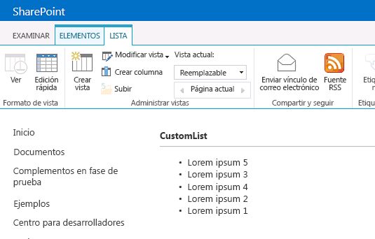

# Personalizar una vista de lista en complementos de SharePoint mediante representación del lado cliente
Obtenga información sobre cómo personalizar una vista de lista en un complemento hospedado en SharePoint usando la tecnología de representación del lado cliente en SharePoint 2013.
En SharePoint 2013, la representación del lado cliente le ofrece un método para producir su propia salida de un conjunto de controles que se hospedan en una página de SharePoint. Esta representación le permite usar tecnologías conocidas (como HTML y JavaScript) para definir la lógica de representación de las vistas de lista de SharePoint. Con la representación del lado cliente, podrá especificar sus propios recursos de JavaScript y hospedarlos en las opciones de almacenamiento de datos disponibles para sus complementos, como, por ejemplo, en una biblioteca de documentos. Un complemento hospedado en SharePoint solo incluye componentes de SharePoint y tiene sus propios recursos en un subsitio aislado de la web de host, denominado web de complemento.


## Requisitos previos para usar los ejemplos de este artículo
<a name="SP15CSRlistview_Prereq"> </a>

Para seguir los pasos de este ejemplo, necesita lo siguiente:


-  [Visual Studio 2015 y la versión más reciente de Microsoft Office Developer Tools ](https://www.visualstudio.com/features/office-tools-vs)


- Un entorno de desarrollo de SharePoint 2013 (es necesario el aislamiento de complementos para entornos locales)


En este enlace encontrará información sobre cómo configurar un entorno de desarrollo que se ajuste a sus necesidades:  [Empezar a crear aplicaciones para Office y SharePoint](http://msdn.microsoft.com/library/187f8c8c-1b15-471c-80b5-69a40e67deea%28Office.15%29.aspx).


### Conceptos básicos que le ayudarán a comprender la personalización de la vista de lista con la representación de cliente

En la tabla siguiente, se enumeran varios artículos útiles que le ayudarán a familiarizarse con los conceptos propios de las situaciones de personalización de vista de lista.


**Tabla 1. Conceptos básicos para la personalización de la vista de lista en un complemento**


|**Título del artículo**|**Descripción**|
|:-----|:-----|
| [Complementos de SharePoint](sharepoint-add-ins.md) <br/> |Obtenga información sobre el nuevo modelo de complemento en Microsoft SharePoint 2013 que le permite crear complementos pequeños y de fácil uso para usuarios finales.  <br/> |
| [Diseño de la experiencia de usuario para aplicaciones en SharePoint 2013](ux-design-for-sharepoint-add-ins.md) <br/> |Obtenga información sobre las opciones de UX de las que dispone cuando se crean Complementos de SharePoint.  <br/> |
| [Hospedar webs, webs de complementos y componentes de SharePoint en SharePoint 2013](host-webs-add-in-webs-and-sharepoint-components-in-sharepoint-2013.md) <br/> |Obtenga información sobre las diferencias entre sitios web de host y sitios web de complemento. Sepa qué componentes de SharePoint 2013 se pueden incluir en un Complemento de SharePoint, qué componentes se implementan en la web de host, qué componentes se implementan en la web de complemento y cómo se implementa la web de complemento en un dominio aislado.  <br/> |
 

## Ejemplo de código: Personalizar una vista de lista usando la representación de cliente
<a name="SP15CSRlistview_Codeexample"> </a>

Para personalizar una vista de lista que se implementa en la web de complemento mediante la representación del lado cliente, siga estos pasos:


1. Cree el proyecto de Complemento de SharePoint.


2. Cree una definición de lista nueva con una vista personalizada.


3. Proporcione la lógica de representación personalizada en un archivo JavaScript.


La Figura 1 muestra una vista de representación de cliente de una lista de anuncios.


**Figura 1. Vista personalizada de una lista de anuncios**





### Para crear el proyecto de Complemento de SharePoint


1. Abra Visual Studio 2015 como administrador. (Para ello, haga clic con el botón derecho en el icono de **Visual Studio** en el menú **Inicio** y elija **Ejecutar como administrador**).


2. Cree un nuevo proyecto con la plantilla **Complemento de SharePoint**.

    En la Figura 2 se muestra la ubicación de la plantilla **Complemento de SharePoint** en Visual Studio 2015, en **Plantillas**, **Visual C#**, **Office/SharePoint**, **Complementos de Office**.


   **Figura 2. Complemento para la plantilla de Visual Studio para SharePoint 2013**


!\[Plantilla Aplicación para SharePoint 2013 de Visual Studio](images/AppForSharePointVSTemplate.PNG)


3. Proporcione la dirección URL del sitio web de SharePoint que desee usar para la depuración.


4. Seleccione **Hospedado en SharePoint** como la opción de hospedaje del complemento.


### Para crear una definición de lista nueva


1. Haga clic con el botón secundario en el proyecto de Complemento de SharePoint y agregue un elemento de **Lista** nuevo. Cree una lista personalizable basada en anuncios.


2. Copie el siguiente marcado y péguelo en el elemento **Views** en el archivo Schema.xml de la característica de lista. El marcado efectúa las siguientes tareas:

  - Declara una vista nueva denominada Overridable con un BaseViewID=2.


  - Proporciona un valor para el elemento **JSLink** que apunta a un archivo JavaScript que se aprovisiona con el complemento.

    > **NOTA**
      > La propiedad JSLink no es compatible con las listas de encuesta o de eventos. Un calendario de SharePoint es una lista de eventos. 

 ```XML

<View BaseViewID="2"
      Name="8d2719f3-c3c3-415b-989d-33840d8e2ddb" 
      DisplayName="Overridable" 
      Type="HTML" 
      WebPartZoneID="Main" 
      SetupPath="pages\\viewpage.aspx" 
      Url="Overridable.aspx"
      DefaultView="TRUE">
  <ViewFields>
    <FieldRef Name="Title" />
  </ViewFields>
  <Query />
  <Toolbar Type="Standard" />
  <XslLink>main.xsl</XslLink>
  <JSLink Default="TRUE">~site/Scripts/CSRListView.js</JSLink>
</View>
 ```


### Para proporcionar la lógica de representación personalizada en un archivo JavaScript


1. Haga clic con el botón secundario en la carpeta **Scripts** y agregue un archivo JavaScript nuevo. Asigne al archivo el nombreCSRListView.js.


2. Copie el siguiente código y péguelo en el archivo CSRListView.js. El código efectúa las siguientes tareas:

  - Proporciona controladores de eventos para los eventos **PreRender** y **PostRender**.


  - Proporciona plantillas para los conjuntos de plantillas de Encabezado, Pie y Elemento.


  - Registra las plantillas.


 ```

(function () {
    // Initialize the variable that stores the objects.
    var overrideCtx = {};
    overrideCtx.Templates = {};

    // Assign functions or plain html strings to the templateset objects:
    // header, footer and item.
    overrideCtx.Templates.Header = "<B><#=ctx.ListTitle#></B>" +
        "<hr><ul id='unorderedlist'>";

    // This template is assigned to the CustomItem function.
    overrideCtx.Templates.Item = customItem;
    overrideCtx.Templates.Footer = "</ul>";

    // Set the template to the:
    //  Custom list definition ID
    //  Base view ID
    overrideCtx.BaseViewID = 2;
    overrideCtx.ListTemplateType = 10057;

    // Assign a function to handle the
    // PreRender and PostRender events
    overrideCtx.OnPreRender = preRenderHandler;
    overrideCtx.OnPostRender = postRenderHandler;

    // Register the template overrides.
    SPClientTemplates.TemplateManager.RegisterTemplateOverrides(overrideCtx);
})();

// This function builds the output for the item template.
// It uses the context object to access announcement data.
function customItem(ctx) {

    // Build a listitem entry for every announcement in the list.
    var ret = "<li>" + ctx.CurrentItem.Title + "</li>";
    return ret;
}

// The preRenderHandler attends the OnPreRender event
function preRenderHandler(ctx) {

    // Override the default title with user input.
    ctx.ListTitle = prompt("Type a title", ctx.ListTitle);
}

// The postRenderHandler attends the OnPostRender event
function postRenderHandler(ctx) {

    // You can manipulate the DOM in the postRender event
    var ulObj;
    var i, j;

    ulObj = document.getElementById("unorderedlist");

    // Reverse order the list.
    for (i = 1; i < ulObj.children.length; i++) {
        var x = ulObj.children[i];
        for (j = 1; j < ulObj.children.length; j++) {
            var y = ulObj.children[j];
            if(x.innerText<y.innerText){              
                ulObj.insertBefore(y, x);
            }
        }
    }
}
 ```


### Para compilar y ejecutar la solución


1. Presione la tecla F5.

    > **NOTA**
      > Cuando presiona F5, Visual Studio compila la solución, implementa el complemento y abre la página de permisos para el complemento. 
2. Presione el botón **Confiar**.


3. Vaya a la lista personalizada; para ello, escriba la dirección  _/Lists/<su_instancia_de_lista>_ relativa a su directorio de complementos en el dominio web del complemento (no el dominio de la web de host). Agregue uno o dos anuncios. En la cinta, elija la vista **Reemplazable**.


## Pasos siguientes
<a name="SP15CSRlistview_Nextsteps"> </a>

En este artículo, se muestra cómo personalizar una vista de lista en un Complemento de SharePoint mediante la representación del lado cliente. El próximo paso sería familiarizarse con los componentes de UX disponibles para Complementos de SharePoint. Para obtener más información, consulte lo siguiente:


-  [Ejemplo de código: personalizar una vista de lista en un complemento que usa representación del lado cliente ](http://code.msdn.microsoft.com/SharePoint-2013-Customize-61761017)


-  [Usar una hoja de estilos del sitio web de SharePoint en complementos de SharePoint](use-a-sharepoint-website-s-style-sheet-in-sharepoint-add-ins.md)


-  [Usar el control cromo de cliente en complementos de SharePoint](use-the-client-chrome-control-in-sharepoint-add-ins.md)


-  [Crear acciones personalizadas para implementarlas con complementos de SharePoint](create-custom-actions-to-deploy-with-sharepoint-add-ins.md)


-  [Crear elementos del complemento para instalar con el complemento para SharePoint](create-add-in-parts-to-install-with-your-sharepoint-add-in.md)


## Recursos adicionales
<a name="SP15CSRlistview_AddResources"> </a>


-  [Configurar un entorno de desarrollo en el nivel local para complementos para SharePoint](set-up-an-on-premises-development-environment-for-sharepoint-add-ins.md)


-  [Diseño de la experiencia de usuario para aplicaciones en SharePoint 2013](ux-design-for-sharepoint-add-ins.md)


-  [Crear componentes de experiencia de usuario en SharePoint 2013](create-ux-components-in-sharepoint-2013.md)


-  [Tres formas de concebir las opciones de diseño de complementos para SharePoint](three-ways-to-think-about-design-options-for-sharepoint-add-ins.md)


-  [Aspectos importantes del panorama de desarrollo y arquitectura de los complementos para SharePoint](important-aspects-of-the-sharepoint-add-in-architecture-and-development-landscap.md)


