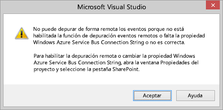
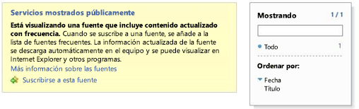

# Depurar y solucionar problemas de un receptor de eventos remotos en un complemento para SharePoint
Configure el entorno de desarrollo para depurar eventos remotos mediante Visual Studio.
## Configurar la depuración de un sitio de prueba de SharePoint remoto

> **NOTA**
> Los procedimientos de esta sección solo se aplican cuando el sitio de prueba de SharePoint se encuentra en un equipo diferente a Visual Studio o cuando se usa un Sitio para desarrolladores de SharePoint Online como sitio de prueba. Si SharePoint y Visual Studio están en el mismo equipo, omita esta sección. 

Cuando un proyecto de Complemento de SharePoint en Visual Studio incluye un receptor de eventos remotos (RER) o un receptor de eventos de complemento, debe realizar algunas configuraciones rápidas adicionales en las propiedades del proyecto antes de que pueda depurar el complemento con (F5). Esta configuración, a su vez, requiere que realice una configuración determinada de Azure. No tiene que repetir la configuración de Azure para cada proyecto que tenga un RER o evento de complemento (si el complemento incluye un controlador de eventos AppInstalled, este ni siquiera se ejecutará con F5 o Ctrl+F5 [ejecutar sin depuración] a menos que lleve a cabo la configuración que se describe en esta sección).

### Para configurar Azure

1. Si aún no tiene una, obtenga una suscripción a Microsoft Azure. Se incluye una como beneficio con una  [suscripción a MSDN](http://azure.microsoft.com/es-es/pricing/member-offers/msdn-benefits/).

2. Siga las instrucciones de  [How To: Create or Modify a Service Bus Service Namespace](http://msdn.microsoft.com/library/fa561f70-007c-45aa-b34d-56317dbbfc87.aspx).

### Para configurar el proyecto de complemento de SharePoint en Visual Studio

1. Debe tener la última versión de Office Developer Tools para Visual Studio 2013, por lo tanto,  [ejecute el instalador WebPI en esta instancia](http://aka.ms/OfficeDevToolsForVS2013) o el [instalador de Office Developer Tools para Visual Studio 2015](http://aka.ms/OfficeDevToolsForVS2015).

2. Tras agregar un RER o un controlador de eventos de complemento a un proyecto de Complemento de SharePoint en Visual Studio, haga clic con el botón derecho en el proyecto en **Explorador de soluciones** y seleccione **Propiedades**.

3. En el panel de propiedades, abra la pestaña **SharePoint** y desplácese hasta el final.

4. Active la casilla **Habilitar la depuración mediante el bus de servicio de Microsoft Azure**.

5. Escriba la cadena de conexión completa en el cuadro de texto proporcionado. Puede obtener la cadena con estos pasos.

1. Inicie sesión en el portal de Azure y abra la pestaña **Bus de servicio**.

2. Abra el espacio de nombres que creó para la depuración de RER y vaya a las cadenas de conexión. La IU del portal de Azure cambia con frecuencia. Si no encuentra las cadenas de conexión, consulte la  [Ayuda del portal Azure](https://msdn.microsoft.com/es-es/library/azure/dn578292.aspx).

3. Copie la cadena de conexión **SAS**. Esta es la cadena que escribió en las propiedades del proyecto de Visual Studio.

En el futuro, cuando cree proyectos de Complemento de SharePoint en Visual Studio, esta información ya estará rellenada y no tendrá que abrir el portal de Azure cada vez.
## Probar la configuración

Use los procedimientos de esta sección para comprobar que puede depurar un RER.

### Para crear un proyecto con un receptor de eventos remoto

1. En Visual Studio, cree una Complemento de SharePoint hospedada por un proveedor.

    Consulte  [Empezar a crear complementos hospedados en proveedor para SharePoint](get-started-creating-provider-hosted-sharepoint-add-ins.md).

2. En el **Explorador de soluciones**, elija el nodo del proyecto del complemento.

3. En la barra de menús, seleccione **Proyecto**, **Agregar nuevo elemento**.

4. En el panel **Plantillas**, seleccione la plantilla **Lista** y luego elija el botón **Agregar**.

5. Elija el botón **Finalizar** para agregar una lista personalizada predeterminada al proyecto del complemento.

6. Agregue otro elemento al proyecto del complemento; para ello, en el panel **Plantillas**, elija la plantilla **Receptor de eventos remotos**.

7. En la casilla **Nombre** deje el nombre predeterminado (RemoteEventReceiver1) y después seleccione el botón **Agregar**.

8. En la lista **¿Qué tipo de receptor de eventos desea usar?**, elija **Eventos de elementos de lista**. 

    Deje el origen del evento como **Lista1**, que es la lista que agregó en los pasos anteriores.

9. En la lista **Controlar los siguientes eventos**, elija **Se va a agregar un elemento** y después seleccione el botón **Finalizar**.

    Se agrega un servicio web a la aplicación web para controlar el evento remoto que especificó. Se agrega un receptor de eventos remoto a la Complemento de SharePoint. El receptor hace referencia al servicio web y al evento de elementos de lista del archivo Elements.xml del receptor de eventos.

10. En el proyecto del complemento, abra AppManifest.xml.

11. Cambie la página de inicio a la página de la lista:  _NombreProyectoComplemento_/Listas/Lista1.

    Reemplace  _NombreProyectoComplemento_ por el nombre de su proyecto del complemento, comoSharePointAddIn4/Listas/Lista1. Para este ejemplo, establecemos la página de inicio como la página de la lista. No obstante, en un complemento típico, probablemente apuntaría a su propia IU en la página del proyecto web.

### Para ejecutar y probar la depuración del controlador de eventos

1. Si aún no lo ha hecho, lleve a cabo el procedimiento anterior **para configurar el proyecto de complemento de SharePoint en Visual Studio**.

2. En el proyecto web, abra el servicio del receptor de eventos remotos (RemoteEventReceiver1.svc) y luego agregue un punto de interrupción en cualquier línea de código dentro del siguiente método:  `ProcessEvent()`.

3. Elija la tecla **F5** para ejecutar el proyecto.

4. Elija el botón **+ Nuevo elemento** para agregar un elemento a la lista.

5. Asigne un título al elemento y elija el botón **Guardar**.

    Se ha encontrado el punto de interrupción que agregó al receptor de eventos remotos, lo que prueba que se está realizando la depuración del receptor de eventos remotos.

6. Elija la tecla **F5** para continuar con la ejecución del proyecto y, luego, detenga la depuración cuando haya terminado.

## Activar o desactivar la notificación de Visual Studio que indica que debe configurarse la depuración de eventos

Si tiene un evento remoto en el proyecto y no ha configurado la depuración de eventos remotos, Visual Studio le pedirá que la configure (vea la ilustración 1). Puede cambiar este comportamiento desactivando la casilla **Avisarme si la depuración de eventos remotos no está configurada** en la pestaña **SharePoint**.

**Ilustración 1. Notificación de depuración de eventos remotos**

## Comprobar que el servicio está hospedado en el bus de servicio

Después de presionar F5 y confiar en el complemento, vaya al espacio de nombres del Bus de servicio en el explorador (por ejemplo, http://mynamespace.servicebus.windows.net) y verá su extremo en la lista como un número. La ilustración 2 muestra el aspecto de la página cuando un espacio de nombres  *no*  está enumerado; es decir, antes de presionar F5.

**Ilustración 2. Examinar el espacio de nombres del bus de servicio**

## RER no alcanza el punto de interrupción

Según el evento, el evento remoto puede ser sincrónico o asincrónico. Si es asincrónico, puede tardar unos segundos o más tiempo en alcanzar el punto de interrupción.

## Error: "No había ningún extremo escuchando"

El siguiente error aparece cuando su controlador se ejecuta en producción:

"Error en la llamada del receptor de eventos remotos. Detalles: no había ningún extremo escuchando en https:// _{domain}_: _nnnnn_/ _{path}_/AppEventReceiver.svc que pudiera aceptar el mensaje. La causa suele ser una dirección o una acción SOAP incorrecta." donde  _nnnnn_ es un puerto.

SharePoint requiere que no haya un puerto explícito en la URL del controlador en producción. Esto significa que debe usar el puerto 443 para HTTPS (es la opción que le recomendamos) o el puerto 80 para HTTP. 

## Error: "No se pudo establecer una relación de confianza para el canal seguro SSL/TLS con la autoridad"

El siguiente error aparece cuando su controlador se ejecuta en producción:

"Error en la llamada del receptor de eventos remotos. Detalles: no se pudo establecer una relación de confianza para el canal seguro SSL/TLS con la autoridad"

Cuando el complemento está en Microsoft SharePoint Online pero el servicio receptor del evento remoto es local y usa HTTPS (como le recomendamos), el servidor que hospeda el receptor no puede usar un certificado autofirmado en producción. El servidor debe aceptar públicamente el certificado de una autoridad de certificado. Si el complemento está en una granja local de SharePoint, se aceptan los certificados autofirmados.

## Recursos adicionales

-  [Controlar eventos en los complementos de SharePoint](handle-events-in-sharepoint-add-ins.md)

-  [Depurar eventos remotos de SharePoint 2013 usando Visual Studio 2012](http://blogs.msdn.com/b/officeapps/archive/2013/03/21/update-to-debugging-sharepoint-2013-remote-events-using-visual-studio-2012.aspx)

