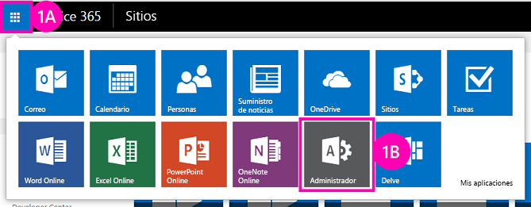

# Implementar e instalar un complemento hospedado en SharePoint para SharePoint
Aprenda a implementar e instalar Complementos de SharePoint.
Este es el segundo de una serie de artículos sobre los conceptos básicos de desarrollo de Complementos de SharePoint hospedados en SharePoint. Primero debe familiarizarse con el tema  [Complementos de SharePoint](sharepoint-add-ins.md) y los temas precedentes de la serie:
  
    
    

-  [Empezar a crear complementos hospedados en SharePoint para SharePoint](get-started-creating-sharepoint-hosted-sharepoint-add-ins.md)
    
  

> [!NOTA]
> Si ha estado trabajando en esta serie sobre complementos hospedados en SharePoint, tiene una solución Visual Studio que puede utilizar para continuar con este tema. También puede descargar el repositorio en  [SharePoint_SP-hosted_Add-Ins_Tutorials](https://github.com/OfficeDev/SharePoint_SP-hosted_Add-Ins_Tutorials) y abrir el archivo BeforeColumns.sln.
  
    
    

Le resultará mucho más fácil desarrollar Complementos de SharePoint hospedados en SharePoint si está familiarizado con el modo en que los usuarios implementan e instalan sus complementos. Por tanto, en este artículo nos tomaremos un descanso del código para crear y usar un catálogo de complementos, y luego instalar el complemento en el que ha estado trabajando.
## Crear un catálogo de complementos

  
    
    

1. Inicie sesión como administrador en su suscripción a Office 365. Elija el icono del iniciador de complementos y seleccione el complemento **Admin**.
    
   **Iniciador de complementos de Office 365**

  

     
  

    
    
  
2. En el **Centro de administración**, expanda el nodo **Administrador** en el panel de tareas y elija **SharePoint**.
    
  
3. En el **Centro de administración de SharePoint**, elija **Complementos** en el panel de tareas.
    
  
4. En la página **Complementos**, elija **Catálogo de complementos** (si en la suscripción ya hay una colección de sitios de catálogo de complementos, esta se abrirá y habrá terminado. No es posible crear más de un catálogo de complementos en una suscripción).
    
  
5. En la página **Sitio del catálogo de complementos**, elija **Aceptar** para aceptar la opción predeterminada y crear un nuevo catálogo de complementos.
    
  
6. En el cuadro de diálogo **Crear colección de sitios del catálogo de complementos**, especifique el título y la dirección del sitio web de su catálogo de complementos. Recomendamos incluir "catálogo" en el título y la dirección URL para hacerlo fácil de recordar y distinguir en el **Centro de administración de SharePoint**.
    
  
7. Especifique una **Zona horaria** y establézcase como **administrador**.
    
  
8. Establezca para **Cuota de almacenamiento** el valor más bajo posible (actualmente 110, aunque esto puede cambiar), ya que los paquetes de complementos que va a cargar en esta colección de sitios son muy pequeños.
    
  
9. Establezca la **Cuota de recursos de servidor** en 0 (cero) y elija **Aceptar** (la cuota de recursos de servidor está relacionada con la aceleración de soluciones de espacio aislado con un rendimiento insuficiente, pero no va a instalar soluciones de espacio aislado en el sitio de su catálogo de complementos).
    
  
Tras crear la colección de sitios, SharePoint lo lleva de vuelta al **Centro de administración de SharePoint**. Pasados unos minutos, verá que la colección está creada.
## Empaquetar el componente y cargarla en el catálogo

  
    
    

1. Abra la solución Visual Studio y luego haga clic con el botón secundario en el nodo del proyecto en el **Explorador de soluciones**. Elija **Publicar**.
    
  
2. En el panel **Publicar**, seleccione **Empaquetar el complemento**. El complemento se empaquetará y guardará como un archivo *.app en la carpeta \\bin\\debug\\web.publish\\1.0.0.0 de la solución.
    
  
3. Abra el sitio del catálogo de complementos en un navegador y elija **Complementos de SharePoint** en la barra de navegación.
    
  
4. El catálogo de **Complementos de SharePoint** es una biblioteca de activos estándar de SharePoint. Cargue ahí el paquete del complemento mediante cualquiera de los métodos usados para cargar archivos en bibliotecas de SharePoint.
    
  

## Instalar el complemento como los usuarios finales

1. Diríjase a cualquier sitio web en la suscripción de SharePoint Onliney abra la página **Contenido del sitio**.
    
  
2. Elija **Agregar un complemento** para abrir la página **Sus complementos**.
    
  
3. Busque el complemento **Orientación de empleados** en la sección **Complementos que usted puede agregar** y haga clic en su título.
    
  
4. Elija **Confiar** en el cuadro de diálogo de consentimiento. La página **Contenidos del sitio** se abre automáticamente y en el complemento se muestra el aviso de que se está instalando. Tras la instalación, el usuario puede seleccionar el mosaico para ejecutar el complemento.
    
  

## Quitar el complemento

Para seguir mejorando el mismo Complemento de SharePoint en Visual Studio (véase  [Siguientes pasos](#Nextsteps)), quite el complemento con estos tres pasos:
  
    
    

1. En la página **Contenido del sitio**, pase el cursor sobre el complemento para que aparezca el botón de llamada **...**.
    
  
2. Elija el botón y luego, en la llamada, seleccione **QUITAR**.
    
  
3. Vuelva al sitio del catálogo de complementos y elija **Complementos de SharePoint** en la barra de navegación.
    
  
4. Resalte el complemento y elija **Administrar** en la barra de tareas, justo encima de la lista. Después, elija **Eliminar** en el menú de administración.
    
  

## 

Recomendamos encarecidamente que continúe con esta serie sobre complementos hospedados en SharePoint antes de entrar en temas más avanzados. A continuación, volveremos al código en  [Agregar columnas personalizadas a un complemento de SharePoint hospedado en SharePoint](add-custom-columns-to-a-sharepoint-hostedsharepoint-add-in.md).
  
    
    

