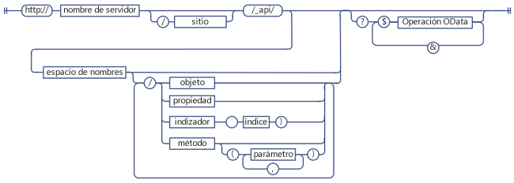
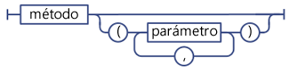
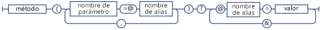
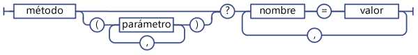
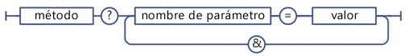

# Determinar los URI de extremo de REST de SharePoint
Aprenda las pautas generales para determinar los URI de extremo de REST de SharePoint a partir de la firma de las API del modelo de objetos de clientes correspondiente.
 **Antes de comenzar**
  
    
    


-  [Introducción al servicio REST para SharePoint 2013](get-to-know-the-sharepoint-2013-rest-service.md)
    
  
-  [Navegar por la estructura de datos de SharePoint representada en el servicio REST](navigate-the-sharepoint-data-structure-represented-in-the-rest-service.md)
    
  

 **Pasos siguientes**
  
    
    


-  [Usar operaciones de consulta de OData en solicitudes REST de SharePoint](use-odata-query-operations-in-sharepoint-rest-requests.md)
    
  

## Estructura de URI de extremo de REST de SharePoint

Antes de poder obtener acceso a un recurso de SharePoint mediante el servicio REST, primero debe averiguar el extremo de URI que apunta a dicho recurso. Cada vez que sea posible, el URI de estos extremos de REST imita rigurosamente la firma de la API del recurso en el modelo de objetos de cliente de SharePoint. Por ejemplo:
  
    
    
 *Método de modelo de objetos de cliente:* 
  
    
    
List.GetByTitle(nombreDeLista).GetItems()
  
    
    
 *Extremo de REST:* 
  
    
    
 `http://server/site/_api/lists/getbytitle('listname')/items`
  
    
    
Sin embargo, en algunos casos, el URI de extremo difiere de la correspondiente firma del modelo de objetos de cliente, con el objetivo de cumplir con las convenciones de REST o de OData.
  
    
    
La siguiente figura muestra la estructura de la sintaxis general de los URI de REST de SharePoint.
  
    
    

**Estructura de sintaxis de URI REST de SharePoint**

  
    
    

  
    
    

  
    
    
Algunos extremos para recursos de SharePoint se desvían de esta estructura sintáctica:
  
    
    

- Métodos que requieren tipos complejos como parámetros.
    
    Si el método del modelo de objetos de cliente correspondiente requiere que se pasen tipos complejos como parámetros, el extremo de REST puede desviarse de esta construcción sintáctica para tener en cuenta las limitaciones de REST.
    
  
- Propiedades y métodos estáticos.
    
    Los extremos REST se desvían de esta estructura de sintaxis para URI que representan propiedades y métodos estáticos.
    
  

## Determinar los extremos del servicio REST de SharePoint 2013

Para construir un extremo de REST para un recurso de SharePoint, siga estos pasos:
  
    
    

1. Comience con la referencia del servicio REST:
    
     `http://server/site/_api`
    
  
2. Especifique el punto de entrada adecuado. Por ejemplo:
    
     `http://server/site/_api/web`
    
  
3. Navegue desde el punto de entrada hasta los recursos específicos a los que desea tener acceso. Esto incluye especificar parámetros para extremos que se corresponden con métodos en el modelo de objetos de cliente. Por ejemplo:
    
     `http://server/site/_api/web/lists/getbytitle('listname')`
    
  

### Hacer referencia al servicio REST de SharePoint 2013 en el URI de extremo

Use  `_api` para denotar el servicio REST de SharePoint 2013 en los URI de extremo. El servicio REST forma parte del servicio web client.svc. Pero, para que la construcción URI REST sea más fácil y acortar la ruta base de acceso a URI REST, el servicio REST usa `_api` para eliminar la necesidad de hacer una referencia explícita al servicio web client.svc. El servicio REST aún reconoce y acepta las URI que hacen referencia al servicio web client.svc. Por ejemplo, puede usar `http://server/site/_vti_bin/client.svc/web/lists` en lugar de `http://server/site/_api/web/lists`. Pero, la convención preferida es usar  `_api`. Las direcciones URL tienen un límite de 256 caracteres; por lo tanto, el uso de  `_api` permite acordar la URI base y dejar más caracteres para usar en la construcción del resto de la dirección URL.
  
    
    

### Especificar puntos de entrada para el servicio REST de SharePoint 2013

Los puntos de entrada principales para el servicio REST representan la colección de sitios y el sitio del contexto especificado. De esta forma, estos puntos de entrada corresponden a la propiedad  [ClientContext.Site](https://msdn.microsoft.com/library/Microsoft.SharePoint.Client.ClientContext.Site.aspx) y a la propiedad [ClientContext.Web](https://msdn.microsoft.com/library/Microsoft.SharePoint.Client.ClientContext.Web.aspx) en los modelos de objetos de cliente.
  
    
    
Para obtener acceso a una colección de sitios específica, use la siguiente construcción:
  
    
    
 `http://server/site/_api/site`
  
    
    
Para obtener acceso a un sitio específico, use la siguiente construcción:
  
    
    
 `http://server/site/_api/web`
  
    
    
Donde  *servidor*  representa el nombre del servidor, y *sitio*  representa el nombre del sitio específico o la ruta de acceso a dicho sitio.
  
    
    
Además de  `/site` y `/web`, el servicio REST incluye varios puntos más de acceso que permiten a los desarrolladores navegar a funciones específicas. La siguiente tabla, se muestran algunos de estos puntos de acceso.
  
    
    


|**Área de característica**|**Punto de acceso**|
|:-----|:-----|
|Sitio  <br/> |http:// _server/site_/_api/site  <br/> |
|Web  <br/> |http:// _server/site_/_api/web  <br/> |
|Perfil de usuario  <br/> |http:// _server/site_/_api/SP.UserProfiles.PeopleManager  <br/> |
|Búsqueda  <br/> |http:// _server/site_/_api/search  <br/> |
   

### Navegar a los recursos específicos a los que desee tener acceso

Desde aquí, construya extremos de REST más específicos ampliando el "camino" del modelo de objetos, con el uso de los nombres de las API del modelo de objetos de clientes separados por una barra diagonal (/). En la siguiente tabla, se muestran ejemplos de llamadas de modelos de objetos de clientes y el extremo de REST equivalente.
  
    
    


|**API de modelo de objetos de cliente**|**Extremo de REST**|
|:-----|:-----|
|ClientContext.Web.Lists  <br/> |http:// _server_/ _site_/_api/web/lists  <br/> |
|ClientContext.Web.Lists[guid]  <br/> |http:// _server_/ _site_/_api/web/lists(' _guid_')  <br/> |
|ClientContext.Web.Lists.GetByTitle("Title")  <br/> |http:// _server_/ _site_/_api/web/lists/getbytitle(' _Title_')  <br/> |
   
Los URI de extremo no distinguen entre mayúsculas y minúsculas. En la tabla anterior, por ejemplo, use el método  `/getbytitle` para especificar el equivalente REST del método **GetByTitle()** en los modelos de objetos de clientes.
  
    
    

## Especificar parámetros en los URI de extremo de REST

SharePoint 2013 extiende la especificación OData para permitirle el uso de paréntesis para especificar los parámetros de métodos y valores de índice. Esto impide posibles problemas de desambiguación en los URI que contienen varios parámetros con el mismo nombre. Por ejemplo, los dos URI siguientes contienen parámetros que tienen el mismo nombre:
  
    
    
 `http://server/site/_api/web/lists/getByTitle('Announcements')/fields/getByTitle('Description')`
  
    
    
 `http://server/site/_api/web/lists('<guid>')/fields/getById('<guid>')`
  
    
    
Para especificar varios parámetros, incluya el parámetro como par nombre-valor, y separe los parámetros con comas. Por ejemplo:
  
    
    
 `http://server/site/_api/web/getAvailableWebTemplates(lcid=1033, includeCrossLanguage=true)`
  
    
    
La siguiente figura muestra la sintaxis del parámetro REST de SharePoint.
  
    
    

**Sintaxis del parámetro REST de SharePoint**

  
    
    

  
    
    

  
    
    

### Tipos complejos como parámetros para el servicio REST

Algunos métodos en el modelo de objetos de clientes necesitan una gran carga como parámetro. Para que los extremos de REST mantengan la paridad de funciones con sus API de modelos de objetos de clientes correspondientes, los extremos necesitan aceptar un tipo complejo como parámetro. En estos casos, el servicio REST extiende el protocolo OData existente para permitir que estos extremos de REST acepten un solo tipo complejo como parámetro. Esto se aplica a las acciones **POST** únicamente, y usted tiene que pasar el tipo complejo en formato [Atom](http://www.odata.org/developers/protocols/atom-format#RepresentingComplexTypesProperties) o formato [JSON](http://www.odata.org/developers/protocols/json-format#RepresentingComplexTypeProperties), según los estándares OData.
  
    
    
Por ejemplo, el método  [ListCollection.Add](https://msdn.microsoft.com/library/Microsoft.SharePoint.Client.ListCollection.Add.aspx) toma un objeto [Microsoft.SharePoint.Client.ListCreationInformation](https://msdn.microsoft.com/library/Microsoft.SharePoint.Client.ListCreationInformation.aspx) como parámetro. Para agregar una lista a un sitio especificado, construya el extremo REST adecuado de la siguiente manera:
  
    
    
 `http://server/site/_api/web/lists/add`
  
    
    
Después, pase el tipo complejo en el cuerpo de la solicitud, que aquí toma el formato a partir de JSON.
  
    
    



```

{ "d" : {
   "results": {
     "__metadata": {
       "type": "SP.ListCreationInformation"
     }, 
     "CustomSchemaXml": "…large payload…/", 
     "Description": "desc", 
     "DocumentTemplateType": "1", 
     "TemplateType": "101", 
     "Title": "Announcements"
   }
} 
}

```


### Usar alias de parámetros en llamadas de servicio REST

Puede usar la semántica "alias de parámetros" en OData para pasar parámetros a un extremo de REST de SharePoint. En alias de parámetros, el valor de parámetro se identifica con un alias en la llamada de parámetro, y el valor real se especifica en la cadena de consulta del URI. Esto posibilita el uso de más tipos de caracteres y un formato uniforme con el uso de la cadena de consulta.
  
    
    
Por ejemplo, los dos URI de REST siguientes son equivalentes:
  
    
    
 *Especificar el valor del parámetro directamente:* 
  
    
    
 `http://server/site/_api/web/applyWebTemplate("STS#0")`
  
    
    
 *Usar un alias de parámetro y especificar el valor del parámetro real en la cadena de consulta del URI:* 
  
    
    
 `http://server/site/_api/web/applyWebTemplate(title=@template)?@template="STS#0"`
  
    
    
Pero, el servicio REST de SharePoint no admite que se pasen tipos complejos a través de alias de parámetros. Por ejemplo, no se admite la siguiente URI, que contiene un tipo complejo en el alias de parámetros:
  
    
    
 `http://server/site/_api/userProfiles/People(7)/GetWorkplace(@address)?@address={"__metadata":{"type: "ODataDemo.Address"},"Street":"NE 228th", "City":"Sammamish","State":"WA","ZipCode":"98074","Country": "USA"}`
  
    
    

**Sintaxis de alias de parámetros de servicio REST de SharePoint**

  
    
    

  
    
    

  
    
    

  
    
    

  
    
    

### Especificar diccionarios como valores de parámetros

Para extremos REST que corresponden a métodos que toman diccionarios  `Dictionary<String, String>` como parámetros, pase el diccionario como una serie de pares nombre-valor delimitados por comas en la cadena de consulta.
  
    
    

**Sintaxis de servicio REST para parámetros Dictionary**

  
    
    

  
    
    

  
    
    
Un  `Dictionary<String, object>` se representa como un objeto de varios valores, (denominado KeyedPropertyValue), con las siguientes propiedades de cadena:
  
    
    

- **Key** La clave del objeto de varios valores.
    
  
- **Value** El valor del objeto
    
  
- **ValueType** El tipo de valor del objeto. Para tipos de valores simples que se asignan a tipos Entity Data Model (EDM) existentes, el servicio REST devuelve la cadena de tipo EDM correspondiente; por ejemplo, "Edm.String." De lo contrario, el servicio REST devuelve el tipo de valor que la función **Type.ToString** devuelve.
    
  

### Especificar valores de parámetros en la cadena de consulta

Si su URI REST finaliza en una llamada de método, puede usar la sintaxis de cadena de consulta para especificar los valores de parámetros del método. Por ejemplo:
  
    
    
 `http://<server>/<site>/_api/web/applyWebTemplate?template="STS#0"`
  
    
    
La siguiente figura muestra la sintaxis de servicio REST para parámetros en una cadena de consulta.
  
    
    

**Sintaxis de servicio REST para parámetros en una cadena de consulta**

  
    
    

  
    
    

  
    
    

  
    
    

  
    
    

## Especificar propiedades y métodos estáticos como URI de servicio REST

Para construir URI que corresponden a propiedades o métodos estáticos, use el nombre de API correspondiente del modelo de objetos ECMAScript, a partir de la declaración de espacios de nombres y usando la notación de punto. Por ejemplo,  [SP.Utilities.Utility.getImageUrl(imageName)](http://msdn.microsoft.com/es-es/library/ee658947.aspx) en el modelo de objetos de clientes ECMAScript tendría el siguiente equivalente REST:
  
    
    
 `http://server/site/_api/SP.Utilities.Utility.getImageUrl('imageName')`
  
    
    
Pero solo se puede obtener acceso a las propiedades estáticas directamente, no se permiten como una composición URI más grande. Por ejemplo, se puede permitir obtener acceso directamente al método **SP.Utility.AssetsLibrary** en REST, de la siguiente manera:
  
    
    
 `http://server/site/_api/SP.Utility.assetsLibrary/id`
  
    
    
Pero no se permite el uso de esa ubicación de recursos como parámetro para una URI más compleja, tal como se muestra en el siguiente ejemplo:
  
    
    
 `http://server/site/_api/getList(~SP.Utility/assetsLibrary/id)`
  
    
    
La siguiente figura muestra la sintaxis de miembro estático de servicio REST de SharePoint.
  
    
    

**Sintaxis de miembro estático de servicio REST de SharePoint**

  
    
    

  
    
    

  
    
    

  
    
    

  
    
    

## Pasos siguientes

Si quiere seleccionar, filtrar u ordenar los datos solicitados desde un extremo, el servicio REST de SharePoint admite una amplia gama de operadores de cadena de consultas OData.
  
    
    

## Recursos adicionales
<a name="bk_addresources"> </a>


-  [Introducción al servicio REST para SharePoint 2013](get-to-know-the-sharepoint-2013-rest-service.md)
    
  
-  [Procedimiento para realizar operaciones básicas con extremos REST de SharePoint 2013](complete-basic-operations-using-sharepoint-2013-rest-endpoints.md)
    
  
-  [Trabajar con listas y elementos de lista con REST](working-with-lists-and-list-items-with-rest.md)
    
  
-  [Trabajar con carpetas y archivos con REST](working-with-folders-and-files-with-rest.md)
    
  
-  [Navegar por la estructura de datos de SharePoint representada en el servicio REST](navigate-the-sharepoint-data-structure-represented-in-the-rest-service.md)
    
  
-  [Usar operaciones de consulta de OData en solicitudes REST de SharePoint](use-odata-query-operations-in-sharepoint-rest-requests.md)
    
  
-  [API de REST, extremos y ejemplos de SharePoint 2013](02128c70-9d27-4388-9374-a11bce68fdb8.md)
    
  
-  [Sincronizar elementos de SharePoint con el servicio REST](synchronize-sharepoint-items-using-the-rest-service.md)
    
  
-  [Usar valores de ETag a través del servicio REST para obtener control de versiones en documentos y elementos de lista](5f7e0579-46b7-44ab-b3b4-cdbc622dcd98.md)
    
  

  
    
    

