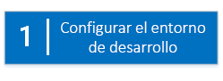
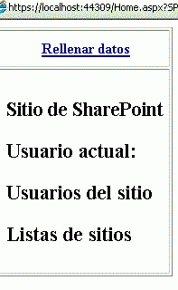

# Empezar a crear complementos hospedados en proveedor para SharePoint
Configurar un entorno de implementación y crear su primera Complemento de SharePoint hospedada en proveedor.
Los complementos hospedados por el proveedor son uno de los dos tipos principales de Complementos de SharePoint. Para ver una introducción a Complementos de SharePoint y los dos tipos diferentes, consulte  [Complementos de SharePoint](sharepoint-add-ins.md). A continuación, se presenta el resumen de complementos hospedados por el proveedor:
  
    
    


- Incluyen una aplicación web, un servicio o una base de datos que se hospeda externamente desde la granja de SharePoint o la suscripción a SharePoint Online. También pueden incluir componentes de SharePoint. Es posible hospedar componentes externos en cualquier pila de hospedaje web, incluida la de LAMP (Linux, Apache, MySQL y PHP).
    
  
- La lógica empresarial personalizada en el complemento se debe ejecutar en los componentes externos o en JavaScript en páginas de SharePoint personalizadas.
    
  

 [
  
    
    
](get-started-creating-provider-hosted-sharepoint-add-ins.md#Setup) [
  
    
    
](get-started-creating-provider-hosted-sharepoint-add-ins.md#Create) [
  
    
    
](get-started-creating-provider-hosted-sharepoint-add-ins.md#Code)
  
    
    


## Configurar el entorno de desarrollo
<a name="Setup"> </a>

Hay muchas maneras de configurar un entorno de desarrollo para Complementos de SharePoint. En esta sección se explica la forma más sencilla. Para conocer alternativas, consulte  [Recursos adicionales](#bk_addresources).
  
    
    

### Obtener las herramientas


- Si todavía no tiene instalado **Visual Studio** 2013 o posterior, instálelo con las instrucciones de [Install Visual Studio](http://msdn.microsoft.com/library/da049020-cfda-40d7-8ff4-7492772b620f.aspx). Se recomienda usar la  [versión más reciente del Centro de descarga de Microsoft](https://www.visualstudio.com/downloads/download-visual-studio-vs).
    
  
- Visual Studio incluye **Microsoft Office Developer Tools para Visual Studio**. A veces se publica una versión de las herramientas entre actualizaciones de Visual Studio. Para asegurarse de que tiene la versión más reciente de las herramientas, ejecute el [programa de instalación de Office Developer Tools para Visual Studio 2013](http://aka.ms/OfficeDevToolsForVS2013), o el  [programa de instalación de Office Developer Tools para Visual Studio 2015](http://aka.ms/OfficeDevToolsForVS2015).
    
  

### Registrarse en un Sitio para desarrolladores de Office 365
<a name="o365_signup"> </a>


> **NOTA**
>  Podría ya tener acceso a un Sitio para desarrolladores de Office 365:> **¿Es suscriptor de MSDN?** Los suscriptores de Visual Studio Ultimate y Visual Studio Premium con MSDN reciben una suscripción de desarrollador a Office 365 como ventaja adicional. [Solicítela hoy.](https://msdn.microsoft.com/subscriptions/manage/default.aspx)> **¿Tiene uno de los siguientes planes de suscripción a Office 365?**> **En caso afirmativo, un administrador de la suscripción a Office 365 puede crear un Sitio para desarrolladores** con el [centro de administración de Office 365](https://portal.microsoftonline.com/admin/default.aspx). Para obtener más información, consulte  [Crear un sitio para desarrolladores en una suscripción existente de Office 365](create-a-developer-site-on-an-existing-office-365-subscription.md). 
  
    
    

Existen tres maneras de obtener un plan de Office 365.
  
    
    

- Registrarse para obtener una cuenta de Office 365 de un año gratuita a través del programa de desarrolladores de Office 365.  [Obtenga más información](http://dev.office.com/devprogram) o diríjase al [formulario de registro](https://profile.microsoft.com/RegSysProfileCenter/wizardnp.aspx?wizid=14b845d0-938c-45af-b061-f798fbb4d170). Recibirá un correo electrónico después del registro en el programa de desarrolladores con un vínculo para registrar la cuenta de desarrollador. Use las siguientes instrucciones.
    
  
- Comience con una  [prueba gratuita de 30 días](https://portal.microsoftonline.com/Signup/MainSignUp.aspx?OfferId=6881A1CB-F4EB-4db3-9F18-388898DAF510&amp;DL=DEVELOPERPACK) con una licencia de usuario.
    
  
- Compre una  [suscripción de desarrollador a Office 365](https://portal.microsoftonline.com/Signup/MainSignUp.aspx?OfferId=C69E7747-2566-4897-8CBA-B998ED3BAB88&amp;DL=DEVELOPERPACK).
    
  

> **SUGERENCIA**
> Abra estos vínculos en otra ventana o pestaña para tener las siguientes instrucciones a mano. 
  
    
    


**Figura 1. Nombre de dominio del sitio para desarrolladores de Office 365**

  
    
    

  
    
    

  
    
    

  
    
    

  
    
    

1. La primera página (no se muestra) del formulario de registro se explica por sí misma. Proporcione la información solicitada y luego elija **Siguiente**.
    
  
2. En la segunda página, que se muestra en la figura 1, especifique un identificador de usuario para el administrador de la suscripción.
    
  
3. Cree un subdominio de **.onmicrosoft.com**. Por ejemplo, contoso.onmicrosoft.com.
    
    Después del registro, usted usa las credenciales resultantes (en el formato  _IdUsuario_@ _subdominio_.onmicrosoft.com) para iniciar sesión en el sitio del portal de Office 365, donde administra la cuenta. Su sitio para desarrolladores de SharePoint Online se configura en su dominio: **http:// _subdominio_.sharepoint.com**.
    
  
4. Elija **Siguiente** y rellene la última página del formulario. Si decide proporcionar un número de teléfono para obtener un código de confirmación, puede proporcionar el número de un teléfono móvil o de un teléfono fijo, pero *no*  un número de VoIP (Protocolo de voz sobre Internet).
    
  

    
> **NOTA**
> Si tiene iniciada una sesión con otra cuenta de Microsoft cuando intente registrar una cuenta de desarrollador, es posible que vea este mensaje: "El id. de usuario que especificó no funcionó. Parece que no es válido. Asegúrese de especificar el id. de usuario que su organización le asignó. El id. de usuario suele ser como  *alguien@ejemplo.com*  o *alguien@ejemplo.onmicrosoft.com*  ."> Si ve este mensaje, cierre la sesión de la cuenta de Microsoft que estaba usando y vuelva a intentarlo. Si sigue viendo el mensaje, borre la memoria caché del explorador o cambie a **Exploración de InPrivate** y rellene el formulario.
  
    
    

Tras finalizar el proceso de registro, el explorador abre la página de instalación de Office 365. Elija el icono de administrador para abrir la página del centro de administración.
  
    
    

**Figura 2. Página del centro de administración de Office 365**

  
    
    

  
    
    

  
    
    

  
    
    

1. Espere a que su Sitio para desarrolladores finalice la configuración. Una vez completado el aprovisionamiento, actualice la página del centro de administración de en su explorador.
    
  
2. A continuación, haga clic en el vínculo **Crear complementos** de la esquina superior izquierda de la página para abrir su Sitio para desarrolladores. Debería aparecer un sitio como el que se muestra en la figura 3. La lista **Complementos en fase de prueba** de la página confirma que el sitio web se creó con la plantilla de sitio para desarrolladores de SharePoint. Si, en vez de ello, ve un sitio de equipo, espere unos minutos y reinicie su sitio.
    
  
3. Tome nota de la dirección URL del sitio. Se usa al crear proyectos de Complementos de SharePoint en Visual Studio.
    
  

**Figura 3. La página de inicio de su sitio para desarrolladores con la lista Complementos en fase de prueba**

  
    
    

  
    
    

  
    
    

  
    
    

  
    
    

## Crear el proyecto de complemento
<a name="Create"> </a>


1. Inicie Visual Studio con la opción **Ejecutar como administrador**.
    
  
2. En Visual Studio, elija **Archivo** > **Nuevo** > **Proyecto**.
    
  
3. En el cuadro de diálogo **Nuevo proyecto**, expanda el nodo **Visual C#**, expanda el nodo **Office/SharePoint** y luego elija **Complementos** > **Complemento de SharePoint**.
    
  
4. Indique SampleAddIn como nombre del proyecto y elija **Aceptar**.
    
  
5. En el primer cuadro de diálogo **Especificar la configuración para el complemento de SharePoint**, haga lo siguiente:
    
  - Proporcione la dirección URL completa de los sitios de SharePoint que desea usar para depurar el complemento. Esta es la dirección URL de Sitio para desarrolladores. Use HTTPS y no HTTP en la dirección URL. En algún momento durante este procedimiento, o poco después de que finalice, se le pedirá que inicie sesión en este sitio. Los intervalos de la solicitud varían. Use las credenciales de administrador (en el dominio *.onmicrosoft.com) que creó al suscribirse al sitio para desarrolladores; por ejemplo, MiNombre@contoso.onmicrosoft.com.
    
  
  - En **¿Cómo desea hospedar el complemento de SharePoint?**, elija **Hospedado por el proveedor**.
    
  
  - Elija **Siguiente**.
    
  
6. En la página **Especificar la versión de SharePoint de destino**, elija **SharePoint Online** y luego elija **Siguiente**.
    
  
7. En **¿Qué tipo de proyecto de aplicación web desea crear?**, elija **Aplicación de formularios Web Forms ASP.NET**. Elija **Siguiente**.
    
  
8. En **¿Cómo desea que se autentique su complemento?**, elija **Usar Windows Azure Access Control Service**.
    
  
9. En el asistente, elija **Siguiente**.
    
    Al abrir la solución, se realiza gran parte de la configuración. Se crean dos proyectos en la solución Visual Studio, uno para la Complemento de SharePoint y el otro para la aplicación web de ASP.NET.
    
  

## Código del complemento
<a name="Code"> </a>


1. Abra el archivo AppManifest.xml. En la pestaña **Permisos**, especifique el ámbito **Colección de sitios** y el nivel de permiso **Leer**.
    
  
2. Elimine cualquier marca dentro de la etiqueta **<body>** del archivo Pages/Default.aspx de su aplicación web y, a continuación, agregue el HTML siguiente y los controles de ASP.NET dentro de **<body>**. En este ejemplo se usa el control  [UpdatePanel](https://msdn.microsoft.com/library/System.Web.UI.UpdatePanel.aspx) para habilitar la representación parcial de la página.
    
 ```HTML
  
<form id="form1" runat="server">
  <div>
    <asp:ScriptManager ID="ScriptManager1" runat="server"
            EnablePartialRendering="true" />
    <asp:UpdatePanel ID="PopulateData" runat="server" UpdateMode="Conditional">
      <ContentTemplate>      
        <table border="1" cellpadding="10">
         <tr><th><asp:LinkButton ID="CSOM" runat="server" Text="Populate Data" 
                               OnClick="CSOM_Click" /></th></tr>
         <tr><td>

        <h2>SharePoint Site</h2>
        <asp:Label runat="server" ID="WebTitleLabel"/>

        <h2>Current User:</h2>
        <asp:Label runat="server" ID="CurrentUserLabel" />

        <h2>Site Users</h2>
        <asp:ListView ID="UserList" runat="server">     
            <ItemTemplate >
              <asp:Label ID="UserItem" runat="server" 
                                Text="<%# Container.DataItem.ToString()  %>">
              </asp:Label><br />
           </ItemTemplate>
        </asp:ListView>

        <h2>Site Lists</h2>
               <asp:ListView ID="ListList" runat="server">
                   <ItemTemplate >
                     <asp:Label ID="ListItem" runat="server" 
                                Text="<%# Container.DataItem.ToString()  %>">
                    </asp:Label><br />
                  </ItemTemplate>
              </asp:ListView>
            </td>              
          </tr>
         </table>
       </ContentTemplate>
     </asp:UpdatePanel>
  </div>
</form>
 ```

3. Agregue las siguientes declaraciones al archivo Default.aspx.cs de su aplicación web.
    
 ```cs
  
using Microsoft.SharePoint.Client;
using Microsoft.IdentityModel.S2S.Tokens;
using System.Net;
using System.IO;
using System.Xml;
 ```

4. En el archivo Default.aspx.cs de la aplicación web, agregue estas variables dentro de la clase  [Page](https://msdn.microsoft.com/library/System.Web.UI.Page.aspx) .
    
 ```cs
  
SharePointContextToken contextToken;
string accessToken;
Uri sharepointUrl;
string siteName;
string currentUser;
List<string> listOfUsers = new List<string>();
List<string> listOfLists = new List<string>();
 ```

5. Agregue el método  `RetrieveWithCSOM` dentro de la clase [Page](https://msdn.microsoft.com/library/System.Web.UI.Page.aspx) . Este método usa el CSOM de SharePoint para recuperar información sobre su sitio y mostrarlo en la página.
    
 ```cs
  
// This method retrieves information about the host web by using the CSOM.
private void RetrieveWithCSOM(string accessToken)
{

    if (IsPostBack)
    {
        sharepointUrl = new Uri(Request.QueryString["SPHostUrl"]);
    }            

    ClientContext clientContext =
                    TokenHelper.GetClientContextWithAccessToken(
                        sharepointUrl.ToString(), accessToken);

    // Load the properties for the web object.
    Web web = clientContext.Web;
    clientContext.Load(web);
    clientContext.ExecuteQuery();

    // Get the site name.
    siteName = web.Title;

    // Get the current user.
    clientContext.Load(web.CurrentUser);
    clientContext.ExecuteQuery();
    currentUser = clientContext.Web.CurrentUser.LoginName;

    // Load the lists from the Web object.
    ListCollection lists = web.Lists;
    clientContext.Load<ListCollection>(lists);
    clientContext.ExecuteQuery();

    // Load the current users from the Web object.
    UserCollection users = web.SiteUsers;
    clientContext.Load<UserCollection>(users);
    clientContext.ExecuteQuery();

    foreach (User siteUser in users)
    {
        listOfUsers.Add(siteUser.LoginName);
    }


    foreach (List list in lists)
    {
        listOfLists.Add(list.Title);
    }
}
 ```

6. Agregue el método  `CSOM_Click` dentro de la clase [Page](https://msdn.microsoft.com/library/System.Web.UI.Page.aspx) . Este método desencadena el evento que se produce cuando el usuario hace clic en el vínculo **Rellenar datos**.
    
 ```cs
  
protected void CSOM_Click(object sender, EventArgs e)
{
    string commandAccessToken = ((LinkButton)sender).CommandArgument;
    RetrieveWithCSOM(commandAccessToken);
    WebTitleLabel.Text = siteName;
    CurrentUserLabel.Text = currentUser;
    UserList.DataSource = listOfUsers;
    UserList.DataBind();
    ListList.DataSource = listOfLists;
    ListList.DataBind();    
 }
 ```

7. Sustituya el método  `Page_Load` existente por este. El método `Page_Load` usa métodos del archivo TokenHelper.cs para recuperar el contexto del objeto `Request` y obtener un token de acceso desde Servicio de control de acceso (ACS) de Microsoft Azure.
    
 ```cs
  
// The Page_load method fetches the context token and the access token.
// The access token is used by all of the data retrieval methods.
protected void Page_Load(object sender, EventArgs e)
{
     string contextTokenString = TokenHelper.GetContextTokenFromRequest(Request);

    if (contextTokenString != null)
    {
        contextToken =
            TokenHelper.ReadAndValidateContextToken(contextTokenString, Request.Url.Authority);

        sharepointUrl = new Uri(Request.QueryString["SPHostUrl"]);
        accessToken =
                    TokenHelper.GetAccessToken(contextToken, sharepointUrl.Authority)
                    .AccessToken;

         // For simplicity, this sample assigns the access token to the button's CommandArgument property. 
         // In a production add-in, this would not be secure. The access token should be cached on the server-side.
        CSOM.CommandArgument = accessToken;
    }
    else if (!IsPostBack)
    {
        Response.Write("Could not find a context token.");
        return;
    }
}
 ```

8. El archivo Default.aspx.cs debe tener este aspecto cuando termine.
    
 ```cs
  
using System;
using System.Collections.Generic;
using System.Linq;
using System.Web;
using System.Web.UI;
using System.Web.UI.WebControls;

using Microsoft.SharePoint.Client;
using Microsoft.IdentityModel.S2S.Tokens;
using System.Net;
using System.IO;
using System.Xml;

namespace SampleAddInWeb
{
    public partial class Default : System.Web.UI.Page
    {
        SharePointContextToken contextToken;
        string accessToken;
        Uri sharepointUrl;
        string siteName;
        string currentUser;
        List<string> listOfUsers = new List<string>();
        List<string> listOfLists = new List<string>();

        protected void Page_PreInit(object sender, EventArgs e)
        {
            Uri redirectUrl;
            switch (SharePointContextProvider.CheckRedirectionStatus(Context, out redirectUrl))
            {
                case RedirectionStatus.Ok:
                    return;
                case RedirectionStatus.ShouldRedirect:
                    Response.Redirect(redirectUrl.AbsoluteUri, endResponse: true);
                    break;
                case RedirectionStatus.CanNotRedirect:
                    Response.Write("An error occurred while processing your request.");
                    Response.End();
                    break;
            }
        }

        protected void CSOM_Click(object sender, EventArgs e)
        {
            string commandAccessToken = ((LinkButton)sender).CommandArgument;
            RetrieveWithCSOM(commandAccessToken);
            WebTitleLabel.Text = siteName;
            CurrentUserLabel.Text = currentUser;
            UserList.DataSource = listOfUsers;
            UserList.DataBind();
            ListList.DataSource = listOfLists;
            ListList.DataBind();
        }

        // This method retrieves information about the host web by using the CSOM.
        private void RetrieveWithCSOM(string accessToken)
        {

            if (IsPostBack)
            {
                sharepointUrl = new Uri(Request.QueryString["SPHostUrl"]);
            }


            ClientContext clientContext =
                    TokenHelper.GetClientContextWithAccessToken(
                        sharepointUrl.ToString(), accessToken);


            // Load the properties for the web object.
            Web web = clientContext.Web;
            clientContext.Load(web);
            clientContext.ExecuteQuery();

            // Get the site name.
            siteName = web.Title;

            // Get the current user.
            clientContext.Load(web.CurrentUser);
            clientContext.ExecuteQuery();
            currentUser = clientContext.Web.CurrentUser.LoginName;

            // Load the lists from the Web object.
            ListCollection lists = web.Lists;
            clientContext.Load<ListCollection>(lists);
            clientContext.ExecuteQuery();

            // Load the current users from the Web object.
            UserCollection users = web.SiteUsers;
            clientContext.Load<UserCollection>(users);
            clientContext.ExecuteQuery();

            foreach (User siteUser in users)
            {
                listOfUsers.Add(siteUser.LoginName);
            }

            foreach (List list in lists)
            {
                listOfLists.Add(list.Title);
            }
        }

        protected void Page_Load(object sender, EventArgs e)
        {
            string contextTokenString = 
                 TokenHelper.GetContextTokenFromRequest(Request);

            if (contextTokenString != null)
            {
                contextToken =
                    TokenHelper.ReadAndValidateContextToken(contextTokenString, Request.Url.Authority);

                sharepointUrl = new Uri(Request.QueryString["SPHostUrl"]);
                accessToken =
                    TokenHelper.GetAccessToken(contextToken, sharepointUrl.Authority)
                               .AccessToken;
                CSOM.CommandArgument = accessToken;
            }
            else if (!IsPostBack)
            {
                Response.Write("Could not find a context token.");
                return;
            }
        }
    }
}
 ```

9. Use la tecla F5 para implementar y ejecutar el complemento. Si ve una ventana de **Alerta de seguridad** que le pide que confíe en el certificado autofirmado de Localhost, elija **Si**.
    
    Elija **Confiar** en la página de consentimiento para conceder permisos al complemento. Visual Studio instala la aplicación web en IIS Express. Luego instala el complemento en el sitio de prueba de SharePoint y lo inicia. Se abrirá una página con la tabla que se muestra en la captura de pantalla siguiente. Elija **Rellenar datos** para ver la información de resumen sobre el sitio de SharePoint.
    

   **Página de inicio del ejemplo básico de complemento hospedado por el proveedor**

  

     
  

  

  

## Pasos siguientes
<a name="SP15createprovider_nextsteps"> </a>

Consulte  [Dar al complemento hospedado por el proveedor la apariencia de SharePoint](give-your-provider-hosted-add-in-the-sharepoint-look-and-feel.md) para aprender a integrar un complemento en un esquema de interfaz de usuario de SharePoint.
  
    
    

## Recursos adicionales
<a name="bk_addresources"> </a>


- Para conocer otras maneras de configurar un entorno de desarrollo, como un entorno "todo local", consulte la sección  [Herramientas](tools-and-environments-for-developing-sharepoint-add-ins.md) de la tabla de contenido de Complementos de SharePoint.
    
  

