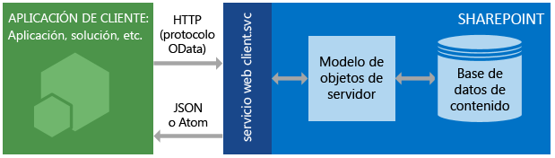

# Introducción al servicio REST para SharePoint 2013
Obtenga información sobre los conceptos básicos del uso del servicio REST de SharePoint 2013 para acceder a los datos de SharePoint y actualizarlos usando los protocolos web estándares REST y OData.
SharePoint 2013 presenta un servicio de transferencia de estado representacional (REST), comparable a los  [modelos de objetos de cliente](http://msdn.microsoft.com/library/88e5e1b9-eab2-4f3b-a3f2-75c96b86f1f4%28Office.15%29.aspx) de SharePoint existentes. Ahora los desarrolladores pueden interactuar de forma remota con los datos de SharePoint con cualquier tecnología que admita solicitudes web REST. Esto significa que los desarrolladores pueden realizar operaciones **Create**, **Read**, **Update** y **Delete** (CRUD) desde los complementos de SharePoint, soluciones y aplicaciones cliente con las tecnologías web de REST y la sintaxis de Open Data Protocol (OData) estándar.
  
    
    


## Requisitos previos

En este tema se supone que tiene un conocimiento básico de REST y cómo crear solicitudes REST.
  
    
    

## Descripción del funcionamiento del servicio REST de SharePoint 2013
<a name="bk_how"> </a>

SharePoint 2013 agrega la posibilidad de interactuar de forma remota con sitios de SharePoint a través de REST. Ahora puede interactuar directamente con objetos de SharePoint a través de cualquier tecnología compatible con las capacidades estándar de REST.
  
    
    
Para obtener acceso a los recursos de SharePoint mediante REST, construya una solicitud HTTP RESTful, por medio del estándar Open Data Protocol (OData), que corresponde a la API deseada de modelo de objetos de cliente. Por ejemplo:
  
    
    
 *Método de modelo de objetos de cliente:* 
  
    
    
List.GetByTitle(nombreDeLista) 
  
    
    
 *Extremo de REST:* 
  
    
    
 `http://server/site/_api/lists/getbytitle('listname')`
  
    
    
El servicio web client.svc de SharePoint controla la solicitud HTTP y emite una respuesta en formato Atom o JSON (notación de objetos JavaScript). La aplicación de cliente analiza después esa respuesta. En la siguiente figura se muestra una vista de alto nivel de la arquitectura REST de SharePoint.
  
    
    

**Arquitectura de servicio REST de SharePoint**

  
    
    

  
    
    

  
    
    
Dadas las funciones y la facilidad de uso que los modelos de objetos de clientes proporcionan, continúan siendo la opción primaria de desarrollo para comunicarse con sitios de SharePoint a través de código administrado .NET Framework, Silverlight o JavaScript.
  
    
    

### Uso de comandos HTTP con el servicio REST de SharePoint 2013
<a name="bk_usingHTTP"> </a>

Para usar las funciones de REST que están integradas en SharePoint 2013, construya una solicitud HTTP RESTful, usando el estándar OData, que corresponde a la API del modelo de objetos de cliente que quiere usar. El servicio web client.svc administra la solicitud HTTP y envía la respuesta correspondiente en formato Atom o notación de objetos JavaScript (JSON). Después, la aplicación cliente debe analizar esa respuesta.
  
    
    
Los extremos del servicio REST de SharePoint 2013 corresponden a los tipos y miembros de los modelos de objetos de cliente de SharePoint. Si usa solicitudes HTTP, puede usar estos extremos REST para realizar las operaciones CRUD típicas en entidades de SharePoint, como listas y sitios. 
  
    
    
En general:
  
    
    


|**Si desea usar esto en un extremo**|**Use esta solicitud de HTTP**|**Recuerde**|
|:-----|:-----|:-----|
|Leer un recurso  <br/> |**GET** <br/> ||
|Crear o actualizar un recurso  <br/> |**POST** <br/> |Use **POST** para crear entidades como listas y sitios. El servicio REST de SharePoint 2013 permite el envío de comandos **POST** que incluyan definiciones de objetos a extremos que representen colecciones. <br/> Para tareas **POST**, toda propiedad innecesaria se establece en sus valores predeterminados. Si trata de establecer una propiedad de solo lectura como parte de una tarea **POST**, el servicio devuelve una excepción.  <br/> |
|Actualizar o insertar un recurso  <br/> |**PUT** <br/> | Use operaciones **PUT** y **MERGE** para actualizar objetos de SharePoint existentes. <br/>  Los extremos de servicios que representan una operación **set** de propiedades de objeto admiten tanto solicitudes **PUT** como solicitudes **MERGE**.  <br/>  En el caso de solicitudes **MERGE**, la configuración de las propiedades será opcional; de manera que aquellas que no defina explícitamente retendrán la propiedad actual.  <br/>  Para solicitudes **PUT**, si no especifica todas las propiedades requeridas en actualizaciones de objetos, el servicio REST devuelve una excepción. Además, cualquier propiedad opcional que no establezca explícitamente, se establece en sus propiedades predeterminadas.  <br/> |
|Eliminar un recurso  <br/> |**DELETE** <br/> |Use el comando **DELETE** HTTP con la dirección URL específica del extremo para eliminar el objeto de SharePoint representado por dicho extremo. <br/> En el caso de objetos reciclables, como listas, archivos y elementos de lista, esto da como resultado una tarea **Recycle**.  <br/> |
   

### Construir direcciones URL de REST para acceder a recursos de SharePoint
<a name="bk_constructURLs"> </a>

Cada vez que sea posible, el URI de estos extremos de REST imita rigurosamente la firma de la API del recurso en el modelo de objetos de cliente de SharePoint. Los puntos de entrada principales para el servicio REST representan la colección de sitios y el sitio del contexto especificado. 
  
    
    
Para obtener acceso a una colección de sitios específica, use la siguiente construcción:
  
    
    
 `http://server/site/_api/site`
  
    
    
Para obtener acceso a un sitio específico, use la siguiente construcción:
  
    
    
 `http://server/site/_api/web`
  
    
    
En cada caso,  *server*  representa el nombre del servidor, y *site*  representa el nombre del sitio específico o la ruta de acceso a dicho sitio.
  
    
    
Desde este punto de partida, puede construir URI REST más específicas al "caminar" el modelo de objetos, con el uso de los nombres de las API del modelo de objetos de clientes separados por una barra diagonal (/).
  
    
    
Esta sintaxis no se aplica a las API SocialFeedManager o SocialFollowingManager de REST. Para más información, vea  [Referencia a API de REST de fuente social para SharePoint 2013](http://msdn.microsoft.com/library/f1cb914f-1e91-4e23-bf53-d2ab323eac13%28Office.15%29.aspx) y [Following people and content REST API reference for SharePoint 2013](http://msdn.microsoft.com/library/c05755df-846d-4a39-941d-950d066cc6d4%28Office.15%29.aspx).
  
    
    
Para obtener más pautas generales para determinar los URI de extremos de REST de SharePoint a partir de la firma de las API del modelo de objetos de clientes correspondiente, vea  [Determinar los URI de extremo de REST de SharePoint](determine-sharepoint-rest-service-endpoint-uris.md).
  
    
    

## Ejemplos de extremos de REST de SharePoint
<a name="bk_URLexamples"> </a>

La tabla siguiente contiene ejemplos típicos de direcciones URL de extremo REST para que empiece a trabajar con SharePoint. Anteponga  `http://server/site/_api/` a los fragmentos de URL que se muestran en la tabla para construir una dirección URL REST completa. Cuando es necesario para los comandos **POST**, la tabla contiene muestras de datos que puede pasar en el cuerpo de la solicitud HTTP para crear el elemento de SharePoint especificado. Los elementos en cursiva representan las variables que debe reemplazar con sus valores.
  
    
    


|**Descripción**|**Extremo URL**|**Método HTTP**|**Contenido del cuerpo**|
|:-----|:-----|:-----|:-----|
|Recupera el título de una lista  <br/> | `web/title` <br/> |GET  <br/> |No es aplicable  <br/> |
|Recupera todas las listas de un sitio  <br/> | `lists` <br/> |GET  <br/> |No es aplicable  <br/> |
|Recupera los metadatos de una sola lista  <br/> | `lists/getbytitle('listname')` <br/> |GET  <br/> |No es aplicable  <br/> |
|Recupera los elementos de una lista  <br/> | `lists/getbytitle('listname')/items` <br/> |GET  <br/> |No es aplicable  <br/> |
|Recupera una propiedad específica de un documento. (En este caso, el título del documento).  <br/> | `lists/getbytitle('listname')?select=Title` <br/> |GET  <br/> |No es aplicable  <br/> |
|Crea una lista  <br/> | `lists` <br/> |POST  <br/> |
```

{
  '_metadata':{'type':SP.List},
  'AllowContentTypes': true,
  'BaseTemplate': 104 ,
  'ContentTypesEnabled': true,
  'Description': 'My list description ',
  'Title': 'RestTest '
}
```

|
|Agrega un elemento a una lista  <br/> | `lists/getbytitle('listname')/items` <br/> |POST  <br/> |
```

{
  '_metadata':{'type':SP.listname ListItem},
  'Title': 'MyItem'
}

```

|
   

## Soporte de trabajos por lotes
<a name="batch"> </a>

El servicio REST de SharePoint Online (y SharePoint local 2016 o versiones posteriores) admite la combinación de varias solicitudes en una sola llamada al servicio mediante el uso de la opción de consulta  `$batch` de OData. Para obtener información detallada y vínculos a los ejemplos de código, vea [Realizar solicitudes de lote con las API de REST](make-batch-requests-with-the-rest-apis.md)
  
    
    

## Recursos adicionales
<a name="bk_learnmore"> </a>

Use los siguientes recursos para aprender más cosas sobre el uso del servicio REST de SharePoint.
  
    
    

|||
|:-----|:-----|
| [Procedimiento para realizar operaciones básicas con extremos REST de SharePoint 2013](complete-basic-operations-using-sharepoint-2013-rest-endpoints.md) <br/> |Aprenda a realizar operaciones básicas de creación, lectura, actualización y eliminación (CRUD) con la interfaz REST de SharePoint 2013.  <br/> |
| [Trabajar con listas y elementos de lista con REST](working-with-lists-and-list-items-with-rest.md) <br/> |Aprenda a realizar operaciones básicas de creación, lectura, actualización y eliminación (CRUD) en listas y elementos de listas con la interfaz REST de SharePoint 2013.  <br/> |
| [Trabajar con carpetas y archivos con REST](working-with-folders-and-files-with-rest.md) <br/> |Aprenda a realizar operaciones básicas de creación, lectura, actualización y eliminación (CRUD) en carpetas y archivos con la interfaz REST de SharePoint 2013.  <br/> |
| [Navegar por la estructura de datos de SharePoint representada en el servicio REST](navigate-the-sharepoint-data-structure-represented-in-the-rest-service.md) <br/> |Aprenda a iniciar desde un extremo de REST para un determinado elemento de SharePoint, y a navegar hasta elementos relacionados y acceder a ellos, como pueden ser sitios primarios o la estructura de biblioteca en la que reside dicho elemento.  <br/> |
| [Determinar los URI de extremo de REST de SharePoint](determine-sharepoint-rest-service-endpoint-uris.md) <br/> |Aprenda las pautas generales para determinar los URI de extremo de REST de SharePoint a partir de la firma de las API del modelo de objetos de clientes correspondiente.  <br/> |
| [Usar operaciones de consulta de OData en solicitudes REST de SharePoint](use-odata-query-operations-in-sharepoint-rest-requests.md) <br/> |Aprenda a usar una amplia variedad de operadores de cadenas de consultas OData para seleccionar, filtrar y ordenar los datos solicitados del servicio REST de SharePoint.  <br/> |
| [API de REST, extremos y ejemplos de SharePoint 2013](02128c70-9d27-4388-9374-a11bce68fdb8.md) <br/> |Esta página contiene vínculos a todos los recursos de REST que hay disponibles para desarrolladores de SharePoint 2013 en MSDN.  <br/> |
| [Información general de la API de REST de SharePoint Search](http://msdn.microsoft.com/library/8a4f7863-e4c1-4099-9189-a1894db36930%28Office.15%29.aspx) <br/> |Agregue la función de búsqueda al cliente y aplicaciones móviles mediante el servicio de búsqueda REST en SharePoint Server 2013 y de cualquier tecnología que sea compatible con las solicitudes web REST.  <br/> |
| [Referencia a API de REST de fuente social para SharePoint 2013](http://msdn.microsoft.com/library/f1cb914f-1e91-4e23-bf53-d2ab323eac13%28Office.15%29.aspx) <br/> |Aprenda sobre el uso de extremos de REST de SharePoint 2013 para tareas relacionadas con fuentes.  <br/> |
| [Following people and content REST API reference for SharePoint 2013](http://msdn.microsoft.com/library/c05755df-846d-4a39-941d-950d066cc6d4%28Office.15%29.aspx) <br/> |Aprenda sobre el uso de extremos de REST de SharePoint 2013 para seguir a gente y contenido.  <br/> |
| [Realizar solicitudes de lote con las API de REST](make-batch-requests-with-the-rest-apis.md) <br/> |Aprenda sobre cómo combinar varias solicitudes en una sola llamada al servicio REST.  <br/> |
| [Sincronizar elementos de SharePoint con el servicio REST](synchronize-sharepoint-items-using-the-rest-service.md) <br/> |Aprenda a sincronizar elementos entre SharePoint y los complementos o servicios con el recurso **GetListItemChangesSinceToken**, que forma parte del servicio REST de SharePoint.  <br/> |
| [Usar valores de ETag a través del servicio REST para obtener control de versiones en documentos y elementos de lista](5f7e0579-46b7-44ab-b3b4-cdbc622dcd98.md) <br/> |Aprenda a usar Etags HTML con el servicio REST de SharePoint para lograr el control de simultaneidad de las listas y elementos de listas de SharePoint.  <br/> |
   

## Recursos de OData
<a name="SP15startREST_bk_addlresources"> </a>


  
    
    

-  [Introducción a OData](http://msdn.microsoft.com/es-es/data/hh237663)
    
  
-  [Ejemplos de Open Data Protocol](http://msdn.microsoft.com/es-es/library/ff478141.aspx)
    
  
-  [Protocolo Open Data](http://www.odata.org/)
    
  
-  [Convenciones de URI del protocolo OData](http://www.odata.org/documentation/odata-version-2-0/uri-conventions/)
    
  
-  [Operaciones del servicio de direcciones](http://www.odata.org/documentation/odata-version-2-0/uri-conventions#AddressingServiceOperations)
    
  
-  [Operaciones del protocolo OData](http://www.odata.org/documentation/odata-version-2-0/operations/)
    
  
-  [Condiciones de error](http://www.odata.org/documentation/odata-version-2-0/operations#ErrorConditions)
    
  

