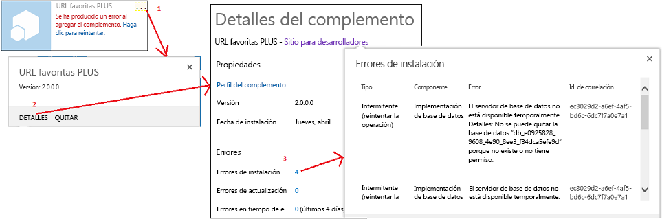

# Controlar eventos en los complementos de SharePoint

El código personalizado puede controlar tres categorías de eventos en complementos hospedados por el proveedor:


- **Eventos de lista**, como agregar o eliminar una lista en un sitio web.


- **Eventos de elemento de lista**, como editar un elemento en una lista.


- **Eventos de complemento**, como la instalación de un complemento.


Los Complementos de SharePoint hospedados en SharePoint no admiten el control de eventos, pero se puede convertir un flujo de trabajo en un controlador de evento de lista o de elemento de lista al establecer un evento para activar el flujo de trabajo. Consulte  [Flujos de trabajo de SharePoint 2013](http://msdn.microsoft.com/library/e0602371-ae22-44be-8a7e-9e47e9f046d6%28Office.15%29.aspx). Los eventos del complemento no pueden activar los flujos de trabajo. Por lo tanto, los eventos del complemento no se pueden controlar con un complemento hospedado en SharePoint.


> **NOTA**
> Los eventos de sitios web y de la colección de sitios no son compatibles con Complementos de SharePoint. 


Existen dos tipos de eventos:
- Los eventos ** *previos* ** se ejecutan sincrónicamente antes de que la infraestructura de SharePoint realice un control propio del evento (incluida la confirmación de cambios en la base de datos de contenido). En SharePoint ** los controladores de eventos previos personalizados siempre se ejecutan de forma sincrónica**. Entre otras cosas, se pueden usar para cancelar el evento. Por ejemplo, si un complemento tiene una función para eliminar una lista, un controlador para el evento de eliminación de lista puede cancelar la eliminación si no se cumplen ciertas condiciones. Si el evento forma parte de una secuencia de eventos, su cancelación impide que se produzca cualquiera de los eventos posteriores. Por ejemplo, si el controlador del evento **ItemAdding** cancela el evento, el evento **ItemAdded**, que por lo general se produce después, no se desencadena.


- Los eventos ** *posteriores* ** se desencadenan después de que la infraestructura de SharePoint realiza su propio control del evento. En SharePoint **los controladores de eventos posteriores remotos, para eventos de lista y elemento de lista, siempre se ejecutan de forma asincrónica**. (Los eventos de aplicación son una excepción). Entre otras cosas, se pueden usar para registrar eventos.


## Controlar eventos de lista y elemento de lista
<a name="RER"> </a>

Para controlar eventos de lista y elemento de lista, se deben crear receptores de eventos remotos (RER), que son servicios web que se ejecutan de forma externa a la granja de SharePoint o SharePoint Online. La dirección URL del servicio RER está registrada para los eventos que controla. Existen dos formas de registrar un controlador:


- Los eventos en el web de host se registran mediante programación con el CSOM (modelo de objetos de cliente) o la API de REST de SharePoint. Generalmente, esta tarea se realiza en la lógica de "primera ejecución" en el complemento o en un controlador para un evento de complemento. (Consulte  [Control de eventos de complemento](#HandlingAppEvents) más adelante en este artículo para ver información general sobre los eventos de complementos). Para ver un ejemplo de código que registra mediante programación un evento de lista, vea [OfficeDev/PnP/Samples/Core.EventReceivers](https://github.com/OfficeDev/PnP/tree/master/Samples/Core.EventReceivers).


- Los eventos en el web de complemento se registran generalmente en una característica de la web de complemento con marcado XML simple. Puede encontrar detalles de cómo crear el marcado y el servicio en  [Crear un receptor de eventos remotos en complementos para SharePoint](create-a-remote-event-receiver-in-sharepoint-add-ins.md). También es posible registrar eventos web de complemento mediante programación.


> **NOTA**
> Los RER tienen el mismo propósito que los receptores de eventos en soluciones de granja de servidores; pero los receptores de eventos tienen código personalizado que se ejecuta en los servidores de SharePoint, por lo que no se pueden usar en Complementos de SharePoint. 


El complemento puede controlar los siguientes eventos de biblioteca de documentos y eventos de lista. Los eventos que terminan en "ing" son eventos previos (sincrónicos) y los que terminan en "ed" son eventos posteriores (asincrónicos).


|||
|:-----|:-----|
|ListAdding  <br/> |ListAdded  <br/> |
|ListDeleting  <br/> |ListDeleted  <br/> |
|FieldAdding  <br/> |FieldAdded  <br/> |
|FieldDeleting  <br/> |FieldDeleted  <br/> |
|FieldUpdating  <br/> |FieldUpdated  <br/> |
 
Los eventos de actualización de campos están relacionados con el cambio de propiedades de un campo (columna) en una lista (p. ej., si se puede ordenar), no con el cambio de datos en un campo.


El complemento puede controlar los siguientes eventos de elemento de lista.


|||
|:-----|:-----|
|ItemAdding  <br/> |ItemAdded  <br/> |
|ItemUpdating  <br/> |ItemUpdated  <br/> |
|ItemDeleting  <br/> |ItemDeleted  <br/> |
|ItemCheckingOut  <br/> |ItemCheckedOut  <br/> |
|ItemCheckingIn  <br/> |ItemCheckedIn  <br/> |
|ItemUncheckingOut  <br/> |ItemUncheckedOut  <br/> |
|ItemAttachmentAdding  <br/> |ItemAttachmentAdded  <br/> |
|ItemAttachmentDeleting  <br/> |ItemAtttachmentDeleted  <br/> |
|ItemFileMoving  <br/> |ItemFileMoved  <br/> |
|ItemVersionDeleting*  <br/> |ItemVersonDeleted*  <br/> |
||ItemFileConverted  <br/> |
 

> **NOTA**
> *Puede que estos dos nuevos eventos no estén disponibles en la IU de Visual Studio. Si no lo están, elija ItemDeleting o ItemDeleted y cambie manualmente los nombres. 


Cuando trabaja en Visual Studio y agrega un RER a un proyecto de Complemento de SharePoint, Office Developer Tools para Visual Studio hace lo siguiente:


- Un archivo de servicio web, como RemoteEventReceiver1.svc, se agrega a la aplicación web para controlar los eventos que especificó cuando agregó el receptor de eventos remotos a la Complemento de SharePoint. El servicio web contiene un archivo de código para controlar los eventos remotos.

    Después de crear el receptor de eventos remotos, puede agregar código al archivo de código para que el servicio de aplicaciones web controle los eventos. De manera predeterminada, el archivo de código contiene dos métodos a los que puede agregar el código de control:

  -  `ProcessEvent()` controla eventos "antes" (como los de las columnas de la izquierda que aparecieron previamente en este artículo) y devuelve un objeto a SharePoint que informa si se debe cancelar el evento o dejar que continúe.


  -  `ProcessOneWayEvent()` controla eventos "después". Se ejecuta de forma asincrónica y no devuelve nada a SharePoint.


    Cuando ocurre un evento registrado, SharePoint llama al método correspondiente del servicio y pasa un objeto que proporciona información contextual para el código. Por ejemplo, se identifica el tipo de evento (de una de las dos tablas que aparecieron previamente en este artículo), de modo que el código pueda bifurcarse a la lógica adecuada para el evento.


- Un elemento del proyecto para el receptor de eventos remotos se agrega al proyecto de la Complemento de SharePoint. El archivo Elements.xml para el receptor de eventos remotos hace referencia al servicio web en la aplicación web y a los eventos remotos que haya especificado. En el siguiente ejemplo se muestra un archivo Elements.xml que controla el agregado o la eliminación de un elemento de una lista.

 ```XML

<?xml version="1.0" encoding="utf-8"?>
<Elements xmlns="http://schemas.microsoft.com/sharepoint/">
  <Receivers ListTemplateId="104">
      <Receiver>
        <Name>RemoteEventReceiver1ItemAdding</Name>
        <Type>ItemAdding</Type>
        <SequenceNumber>10000</SequenceNumber>
        <Url>~remoteAppUrl/RemoteEventReceiver1.svc</Url>
      </Receiver>
      <Receiver>
        <Name>RemoteEventReceiver1ItemDeleting</Name>
        <Type>ItemDeleting</Type>
        <SequenceNumber>10000</SequenceNumber>
        <Url>~remoteAppUrl/RemoteEventReceiver1.svc</Url>
      </Receiver>
  </Receivers>
</Elements>
 ```

Para cambiar los eventos que controla el receptor de eventos remotos, abra el **Explorador de soluciones**, abra la ventana **Propiedades** para el receptor de eventos remotos, expanda el nodo **Eventos de SharePoint** y luego especifique solo los eventos que desea controlar para **True**.


> **NOTA**
> Para obtener información adicional sobre RER, incluida información para solucionar problemas, vea  [Preguntas frecuentes sobre los receptores de eventos remotos](handle-events-in-sharepoint-add-ins.md#RERFAQ). 


## Control de eventos de complemento
<a name="HandlingAppEvents"> </a>

Los eventos de complementos también están controlados por servicios web remotos, pero se configuran de forma diferente en el paquete de complementos de RER de lista y elementos de lista, por lo que se tratan como una categoría independiente del componente. Para un evento de complemento, el servicio web remoto se registra en el manifiesto de complemento, no en la característica web de complemento. No es necesario que el complemento tenga un sitio web de complemento. Existen tres eventos de complementos según se describen en las siguientes secciones.


### Evento AppInstalled

El evento **AppInstalled** se ejecuta inmediatamente después de que SharePoint haya finalizado todo lo que debe hacer cuando se instala el complemento, pero antes de que se notifique al usuario de que la instalación está completa. Aunque se trata de un evento *posterior*  , SharePoint ejecuta el controlador *de forma sincrónica*  . El complemento no está disponible para su uso hasta después de que finalice el controlador y este pueda cancelar la instalación (lo que hará que SharePoint revierta todo lo hecho como parte de la instalación). De hecho, es una práctica recomendada para detectar errores en el controlador e indicar a SharePoint que revierta la instalación. Para obtener más información, vea [Incluir la lógica de reversión y la lógica de "acciones realizadas" en los controladores de evento de complemento](#Rollback).


> **NOTA**
> Cuando instala un complemento con  [Ámbito de inquilino](tenancies-and-deployment-scopes-for-sharepoint-add-ins.md), se instala en la colección de sitios de catálogo de complementos, y el evento AppInstalled se ejecuta solo en ese momento. El complemento está visible en varios sitios web en el arrendamiento, pero el evento no se ejecuta de forma independiente para cada uno de estos. 


Además de cancelar una instalación de complemento, este evento se puede usar con muchos otros fines como:


- Instalar componentes de SharePoint en la web de host que no se pueden instalar de forma declarativa con la Característica web de host, como listas o subwebs.


- Registrar controladores de eventos de lista y de elemento de lista mediante programación con el web de host o el web de complemento.


- Establecer la configuración de inicialización relativa a la instancia de aplicación. Por ejemplo, el complemento puede tener un contenedor de propiedades de complemento web para almacenar la configuración que varía de una instancia del complemento a otra. El controlador AppInstalled puede escribir diferentes valores en el contenedor de propiedades, en función de, por ejemplo, el tipo de sitio web de host (como sitio de grupo o sitio de Blog).

    > **NOTA**
      > Comprobar si la web de host es un sitio de AppCatalog es una buena forma de detectar si se ha instalado el complemento con ámbito de inquilino. Consulte  [Arrendamientos y ámbitos de implementación de los complementos para SharePoint](tenancies-and-deployment-scopes-for-sharepoint-add-ins.md). 
- Realizar una configuración relativa a la instancia de la aplicación en la aplicación web remota del complemento, como agregar una tabla a una base de datos.


> **IMPORTANTE**
> La implementación del evento AppInstalled debe completarse en 30 segundos. Si no, la infraestructura de instalación de SharePoint pensará que ha habido algún error. La infraestructura volverá a ejecutar el evento  *y repetirá el código desde el principio*  hasta tres veces más. Después de cuatro tiempos de espera, SharePoint revertirá la instalación del complemento completa. Todas las consecuencias de estos hechos se describen en [Incluir la lógica de reversión y la lógica de "acciones realizadas" en los controladores de evento de complemento](#Rollback). 


### Evento AppUninstalling

El evento **AppUninstalling** *no*  se ejecuta cuando se quita el complemento de la web de host. La acción de quitar un complemento solo mueve este a la papelera de reciclaje del usuario. Dos pasos más son necesarios antes de que se active el evento AppUninstalling. Primero, un usuario debe quitar el complemento de la papelera de reciclaje (está acción lo mueve a la papelera de reciclaje de la segunda etapa). Segundo, un **usuario debe quitar el complemento de la papelera de reciclaje de la segunda etapa. Esta última tarea activa el evento AppUninstalling**. El evento AppUninstalling es sincrónico y puede usarlo para cancelar la desinstalación, lo que dejaría el complemento en la papelera de reciclaje de la segunda etapa.


La finalidad principal de un controlador para este evento es eliminar o reciclar cosas que se implementaron con un controlador AppInstalled (o AppUpdated). SharePoint no puede eliminar estas cosas, o moverlas a la papelera de reciclaje, porque no sabe de ellas, al menos no como componentes del complemento. Generalmente es aconsejable quitar estas cosas. Pero no es preferible eliminar cosas que aún tienen una vida útil después de que desaparezca el complemento: si aún se va a usar una lista o un sitio web creados por el controlador AppInstalled, no los elimine en el controlador AppUninstalling.


### Evento AppUpgraded

El evento **AppUpgraded** se ejecuta inmediatamente después de que SharePoint haya finalizado todo lo que debe hacer cuando se actualiza un complemento con la última versión, pero antes de que se notifique al usuario de que la actualización está completa. Al igual que el evento AppInstalled, se trata de un evento posterior, pero básicamente es sincrónico y es un procedimiento recomendado para detectar errores e indicar a SharePoint que revierta la actualización.


Estos son algunos ejemplos de lo que un controlador para este evento puede hacer:


- Agregar, cambiar o quitar componentes de complemento del web de host.


- Realizar acciones en la web de complemento que no son posibles con la semántica de actualización declarativa en una característica web de complemento. Por ejemplo, no se puede eliminar nada con el marcado declarativo de actualización, pero puede hacerlo mediante programación en un controlador AppUpgraded.


- Realizar cambios en componentes relativos a la instancia de aplicación en la base de datos remota o la aplicación web del complemento.


 *Para conocer los detalles sobre cómo crear controladores de eventos de complementos, vea  [Crear un receptor de eventos de aplicación en SharePoint 2013](create-an-add-in-event-receiver-in-sharepoint-add-ins.md)*  .


### Incluir la lógica de reversión y la lógica de "acciones realizadas" en los controladores de evento de complemento
<a name="Rollback"> </a>

Si SharePoint encuentra un error al procesar alguno de los tres eventos de complemento, cancelará el evento y revertirá los cambios que ha realizado en relación con el evento. Los controladores de eventos del complemento tienen que integrarse con este sistema porque, si se produce un error en la parte del evento que se va a implementar, se debe revertir la totalidad del evento, en lugar de seguir y dejar todo en un estado posiblemente dañado. Esto es lo que el controlador generalmente debe hacer:


- Indicar a SharePoint que ha ocurrido un error. El mensaje SOAP que el servicio web de control de evento de complemento devuelve a SharePoint tendrá una propiedad **Status** que puede tener los valores de **Continue**, **CancelWithError** o **CancelWithoutError**. Todo estado **Cancel*** indica a SharePoint que debe revertir el evento.


- Revertir lo que ya ha hecho el controlador antes de encontrar el error. SharePoint normalmente no puede realizar esto porque no sabe lo que hizo el controlador. Esto no es una regla universal. Por ejemplo, si se ha cancelado la instalación del complemento, SharePoint eliminará el web de complemento completo, por lo que no tiene ningún sentido que un controlador de eventos AppInstalled revierta nada de lo que ha hecho en el web de complemento. Pero normalmente debe revertir las cosas que hizo en el web de host o en los componentes remotos del complemento.


> **NOTA**
> **Nota especial sobre el evento AppUninstalling:** Los puntos anteriores se aplican al evento AppUninstalling tanto como a los otros dos eventos de complementos. Por ejemplo, si el controlador para el evento de desinstalación elimina una fila de una base de datos remota y, a continuación, encuentra un error, la fila debe restaurarse. Dado que el servicio va a enviar un mensaje de cancelación a SharePoint, el complemento no se quitará de la papelera de reciclaje. Si se restaura desde allí y se vuelve a usar, es posible que no funcione sin esa entrada de la base de datos.> Sin embargo, se completa el controlador AppUninstalling  *antes*  de que SharePoint quite el complemento de la papelera de reciclaje. Por lo tanto, si SharePoint encuentra un error y necesita cancelar la eliminación, no hay ninguna forma para el controlador de deshacer lo que ha hecho.


Si SharePoint no recibe un mensaje de resultados desde su controlador en 30 segundos, llamará al controlador nuevamente. Tras tres reintentos (cuatro intentos en total), detiene por completo la operación y revierte el evento. Cada vez que llama al controlador, el código se vuelve a iniciar desde el principio. Pero normalmente no deseará que el controlador rehaga las acciones que ya haya hecho, como crear una lista en la web de host, y no se puede saber si se ha completado la lógica de reversión, o incluso si se ha desencadenado, antes de que el controlador agotara el tiempo de espera. Por este motivo, la lógica del controlador no debe realizar ninguna acción sin comprobar si ya se ha realizado la acción, a menos que sea inofensivo volver a hacerlo.


Los errores de instalación y actualización se pueden ver en la interfaz del usuario de SharePoint, tal como se muestra en el siguiente gráfico.


**Figura 1. Obtención de detalles de errores de instalación.**





#### Estrategias de arquitectura del controlador de eventos de complemento
<a name="Strategies"> </a>

Expresado en seudocódigo, el controlador normalmente debe tener una estructura similar a la siguiente. Si se produce un error en la sección Try, se debe invocar la sección Catch y Rollback. (Esto puede ocurrir automáticamente según el idioma y el marco de trabajo).



```

Try
    If X not already done,
        Do X.
Catch
    Send cancel message to SharePoint.
    If X not already undone,
        Undo X.

```

Sin embargo, la implementación de lógica de reversión y la lógica "de acciones realizadas" en el servicio web puede reducir la velocidad del controlador. Tanto la lógica de reversión como de instalación generalmente realizan cambios en algo más o menos remoto del servicio web, como la web de host de SharePoint o una base de datos de back-end. Si el código de instalación y reversión está dividido en las secciones Try y Catch, el servicio está realizando llamadas separadas a los componentes remotos, a menudo varias llamadas en cada sección. El procedimiento recomendado generalmente es implementar la lógica de instalación y reversión en el componente remoto mismo mediante un procedimiento al que puede llamarse desde el controlador en la sección Try. El procedimiento debe devolver un mensaje de correcto o error, y si informa de un error, el código de la sección Try invoca a la sección Catch (por ejemplo, arrojando una excepción). Lo único que hace la sección Catch es notificar a SharePoint. A esto lo denominaremos estrategia de delegación de controlador. El siguiente seudocódigo ilustra la estrategia:



```

Try
    Call the "Do X" procedure on remote platform.
    If remote platform reports failure, call Catch.
Catch
    Send cancel message to SharePoint.

```

El procedimiento "Do X", que se ejecuta en el sistema remoto, contendría en sí mismo la lógica de reversión y la lógica "de acciones realizadas" de la siguiente manera.



```

Try
    If X not already done,
        Do X.
        Set success flag to true.
Catch
    If X was done before error,
        Undo X.
    Set success flag to false.
Send
    Return success flag to the event handler.

```

Por ejemplo, si el controlador debe realizar acciones en una base de datos de SQL Server, puede instalar un procedimiento almacenado en SQL Server que use un bloque  [TRY-CATCH](http://msdn.microsoft.com/library/248df62a-7334-4bca-8262-235a28f4b07f%28Office.15%29.aspx) para implementar la lógica de instalación y reversión, o con bloques [IF-ELSE](http://msdn.microsoft.com/library/676c881f-dee1-417a-bc51-55da62398e81%28Office.15%29.aspx) para implementar la lógica "de acciones realizadas".


El modelo de complementos de SharePoint no proporciona una manera de almacenar el código de servidor personalizado en SharePoint e invocarlo desde el CSOM (modelo de objetos de cliente). Pero el CSOM proporciona una manera de agrupar lógica try-catch e if-then-else y enviarla al servidor para su ejecución. Para obtener un ejemplo detallado de un controlador de eventos de complemento que usa la estrategia de delegación de controlador para agregar una lista en un web de host, vea  [Crear un receptor de eventos de aplicación en SharePoint 2013](create-an-add-in-event-receiver-in-sharepoint-add-ins.md). Para un ejemplo de código, vea  [OfficeDev/PnP/Samples/Core.AppEvents.HandlerDelegation](https://github.com/OfficeDev/PnP/tree/master/Samples/Core.AppEvents.HandlerDelegation).


No puede usar siempre la estrategia de delegación de controlador. Por ejemplo, cuando el controlador está llamando a más de un componente, como una base de datos y el web de host de SharePoint, es posible que uno se complete correctamente y que el otro falle luego. En este escenario, la lógica de reversión para el primer componente no se ejecuta si se ha diseñado con la estrategia de delegación de controlador. Por este motivo, si se llama a los componentes de forma sincrónica, solo la última que llama puede usar la estrategia de delegación de controlador. Si se llaman de forma asincrónica, no puede usar esa estrategia en ninguno de ellos. Para obtener una muestra de un controlador de eventos de complemento que no use la estrategia de delegación de controlador, vea  [OfficeDev/PnP/Samples/Core.AppEvents](https://github.com/OfficeDev/PnP/tree/master/Samples/Core.AppEvents).


> **SUGERENCIA**
> Si se produce un error en el evento AppInstalled, SharePoint eliminará el web de complemento, si existe. Si se produce un error en el evento AppUpated, SharePoint restaurará el web de complemento a su estado anterior a la actualización. Por este motivo, los controladores nunca deben revertir acciones que realizan en el web de complemento. Si el controlador realiza acciones en el web de host y el web de complemento, primero debe encargarse del web de complemento. Si lo hace, se puede usar la estrategia de delegación de controlador para el web de host. Incluso si las acciones web de complemento fueran correctas y se produjera un error en las acciones web de host, no hay ninguna lógica de reversión que queda sin ejecutar. 


## Receptores de eventos remotos en complementos que admiten varias zonas de seguridad
<a name="HandlingAppEvents"> </a>

Existen algunas restricciones sobre cómo diseñar un complemento que admite varias zonas de seguridad y tiene un receptor de eventos remotos. Para más información, consulte el artículo kb3135876 de Knowledge Base  [No se puede agregar una aplicación desde el almacén de SharePoint predeterminado si se utilizan complementos alojados por proveedores en zonas no predeterminadas en SharePoint 2013 ](https://support.microsoft.com/es-es/kb/3135876).


## Preguntas frecuentes sobre los receptores de eventos remotos
<a name="RERFAQ"> </a>

Estas son algunas de las preguntas que habitualmente surgen al usar receptores de eventos remotos.


### ¿En qué difieren los receptores de eventos remotos de los receptores de eventos en SharePoint 2010?
<a name="RER_HowRERDifferentfrom2010"> </a>

En SharePoint 2010, los receptores de eventos controlan eventos que tienen lugar en listas, sitios y otros objetos de Sharepoint que ejecutan el código en el servidor de SharePoint (ya sea de plena confianza o en un espacio aislado). Este tipo de receptor de eventos todavía existe en SharePoint 2013. Sin embargo, SharePoint 2013 también admite receptores de eventos  *remotos*  en los que el código que se ejecuta cuando se desencadena el evento está hospedado por un servicio web. Esto significa que si registra un receptor de eventos remotos, también necesitará decir a SharePoint qué servicio web debe invocar. En la tabla 1, el ejemplo de código de la izquierda (soluciones de SharePoint) implementa funcionalidad mediante un controlador de eventos. El ejemplo de la derecha (Complementos de SharePoint) implementa la misma funcionalidad mediante un receptor de eventos remotos.


**Tabla 1. Ejemplos de código para receptores de eventos en SharePoint 2010 frente a receptores de eventos remotos en complementos**


|**Soluciones de SharePoint**|**Complementos de SharePoint**|
|:-----|:-----|
|
```cs

// Trigger an event when an item is added to the SharePoint list.
Public class OnPlantUpdated : SPItemEventReceiver
{
Public override void ItemAdding (SPItemEventProperties properties)
{
Properties.After.Properties.ChangedProperties.Add("Image",CreateLink(properties));
Properties.status =SPEventReceiverStatus.Continue;
}

/// When an item updates, run the following.
Public override void ItemUpdating(SPItemEventProperties properties)
{
Properties.AfterProperties.ChangedProperties.Add("Image",CreateLink9properties));
Properties.Status= SPEventReceiverStatus.Continue;
}

```

|
```cs

/* Trigger an event when an item is added to the SharePoint list*/
Public class OnPlantUpdated : IRemoteEventService
{
public SPRemoteEventResult ProcessEvent (SPRemoteEventProperties properties)
{
SPRemoteEventResult result =new SPRemoteEventResult();
If (properties.EventType == SPRemoteEventType.ItemAdding ||
properties.EventType == SPRemoteEventType.ItemUpdating)
{

// Add code that runs when an item is added or updated.
}

```

|
 
Vea  [Agregar propiedades de elemento de lista con un receptor de eventos remotos](http://code.msdn.microsoft.com/SharePoint-2013-Add-list-2c6e71e0) para obtener el ejemplo de código completo. Vea [Migrar un receptor de eventos de SharePoint a un receptor de eventos remotos](http://channel9.msdn.com/Series/Reimagine-SharePoint-Development/Migrating-a-SharePoint-Event-Receiver-to-a-Remote-Event-Receiver) para obtener una demo detallada del ejemplo de código.


### 
<a name="RER_HowRERDifferentfrom2010"> </a>

Para obtener más información, vea  [Enumeración SPRemoteEventType](https://msdn.microsoft.com/es-es/library/microsoft.sharepoint.client.eventreceivers.spremoteeventtype.aspx)


### ¿Cómo funcionan los receptores de eventos remotos?
<a name="RER_HowDoRERWork"> </a>

La figura 1 muestra cómo funcionan los receptores de eventos remotos:


- El usuario realiza una acción en SharePoint (por ejemplo, edita un elemento de lista).


- Entonces, SharePoint conversa con el servicio web registrado. Podría realizar algunas operaciones: por ejemplo, actualizar una propiedad de elemento de lista, o actualizar un sistema back-end.


- El servicio web también puede conversar con el Servicio de control de acceso (ACS) para solicitar su propio token firmado para realizar una devolución de llamada a SharePoint. Con este token, puede realizar acciones remotas desde dentro del servicio web gracias a la operación anterior en el elemento de lista del sistema back-end.


**Figura 2. Funcionamiento de los receptores de eventos remotos en SharePoint**


### ¿Cómo se depuran los receptores de eventos remotos?
<a name="RER_DebugRER"> </a>

Vea  [Depurar y solucionar problemas de un receptor de eventos remotos en un complemento para SharePoint](debug-and-troubleshoot-a-remote-event-receiver-in-a-sharepoint-add-in.md). 


### ¿Puedo ejecutar código (JavaScript) del lado cliente desde receptores de eventos remotos?
<a name="RER_ClientsideCodeFromRER"> </a>

No.


### ¿Hay restricciones sobre dónde se puede hospedar un receptor de eventos remotos o sobre su dirección URL?
<a name="RER_ClientsideCodeFromRER"> </a>

El receptor de eventos remotos puede hospedarse en la nube o en un servidor local que no se esté usando ya como servidor de SharePoint. La dirección URL de un receptor de producción no puede especificar ningún puerto determinado. Esto significa que debe usar el puerto 443 para HTTPS, que es la opción recomendada, o el puerto 80 para HTTP. Si usa HTTPS y el servicio del receptor está hospedado localmente pero el complemento está en Microsoft SharePoint Online, entonces el servidor host debe tener un certificado de confianza público de una entidad de certificación. (Un certificado autofirmado solo funciona si el complemento se encuentra en una granja de SharePoint local).


### ¿Funcionará un controlador de eventos de SharePoint 2010 en SharePoint 2013 después de la actualización?
<a name="RER_Will2020EventHandlerWillWorkOn2013"> </a>

Si un paquete de soluciones de SharePoint 2010 que contiene un controlador de eventos se actualiza a SharePoint 2013, dependerá de sus personalizaciones para que el paquete de soluciones pueda funcionar sin realizar modificaciones. Esto también incluye al controlador de eventos. Si la solución de SharePoint 2010 se remodela como un Complemento de SharePoint en SharePoint 2013, el controlador de eventos debería reescribirse como receptor de eventos remotos. (Vea  [Migrar un receptor de eventos de SharePoint a un receptor de eventos remotos](http://channel9.msdn.com/Series/Reimagine-SharePoint-Development/Migrating-a-SharePoint-Event-Receiver-to-a-Remote-Event-Receiver)).


## Recursos adicionales
<a name="SP15handleevents_addlresources"> </a>


-  [Crear un receptor de eventos remotos en complementos para SharePoint](create-a-remote-event-receiver-in-sharepoint-add-ins.md)


-  [Crear un receptor de eventos de aplicación en SharePoint 2013](create-an-add-in-event-receiver-in-sharepoint-add-ins.md)


-  [Introducción a los receptores de eventos remotos en SharePoint 2013](http://www.microsoft.com/resources/msdn/en-us/office/media/video/video.mdl?cid=sdc&amp;from=mscomsdc&amp;VideoID=3ef8f7ae-85a7-44c3-967d-d1620e2a019f)


-  [Migrar un receptor de eventos de SharePoint a un receptor de eventos remotos](http://channel9.msdn.com/Series/Reimagine-SharePoint-Development/Migrating-a-SharePoint-Event-Receiver-to-a-Remote-Event-Receiver)


