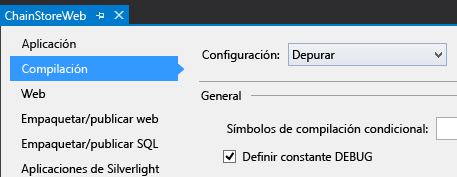
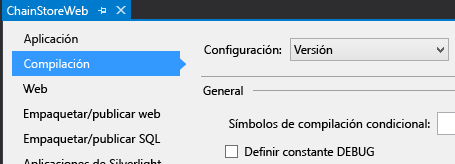
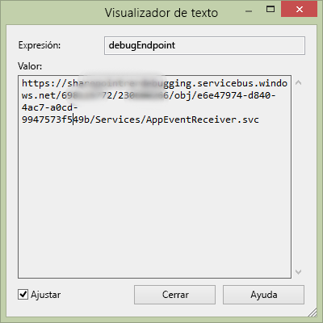

# Controlar eventos de elemento de lista en el complemento hospedado por el proveedor
Aprenda a controlar los eventos de elemento de lista en un Complemento de SharePoint hospedado por el proveedor.
Este es el décimo de una serie de artículos sobre los conceptos básicos de desarrollo de Complementos de SharePoint hospedados por el proveedor. Primero debe familiarizarse con los  [Complementos de SharePoint](sharepoint-add-ins.md) y con los anteriores artículos de esta serie:
  
    
    


-  [Empezar a crear complementos hospedados en proveedor para SharePoint](get-started-creating-provider-hosted-sharepoint-add-ins.md)
    
  
-  [Dar al complemento hospedado por el proveedor la apariencia de SharePoint](give-your-provider-hosted-add-in-the-sharepoint-look-and-feel.md)
    
  
-  [Incluir un botón personalizado en el complemento hospedado por el proveedor](include-a-custom-button-in-the-provider-hosted-add-in.md)
    
  
-  [Obtener una introducción rápida al modelo de objetos de SharePoint](get-a-quick-overview-of-the-sharepoint-object-model.md)
    
  
-  [Agregar operaciones de escritura de SharePoint al complemento hospedado por el proveedor](add-sharepoint-write-operations-to-the-provider-hosted-add-in.md)
    
  
-  [Incluir un elemento de complemento en el complemento hospedado por el proveedor](include-an-add-in-part-in-the-provider-hosted-add-in.md)
    
  
-  [Controlar eventos de complemento en el complemento hospedado por el proveedor](handle-add-in-events-in-the-provider-hosted-add-in.md)
    
  
-  [Agregar lógica de la primera vista al complemento hospedado por el proveedor](add-first-run-logic-to-the-provider-hosted-add-in.md)
    
  
-  [Implementar mediante programación un botón personalizado en el complemento hospedado por el proveedor](programmatically-deploy-a-custom-button-in-the-provider-hosted-add-in.md)
    
  

> [!NOTA]
> Si ha estado trabajando en esta serie sobre complementos hospedados por el proveedor, ya tiene una solución de Visual Studio que puede usar para continuar con este tema. También puede descargar el repositorio en  [SharePoint_Provider-hosted_Add-Ins_Tutorials](https://github.com/OfficeDev/SharePoint_Provider-hosted_Add-ins_Tutorials) y abrir el archivo BeforeRER.sln.
  
    
    

En un artículo anterior de esta serie vimos que, cuando se realiza un pedido, se agrega a la tabla **Pedidos** en la base de datos corporativa y se agrega automáticamente un elemento para ella a la lista **Envíos esperados**. Cuando llega a la tienda local, un usuario establece la columna **Llegado** en **Sí**. Al cambiar un valor de campo de un elemento, se crea un evento de elemento actualizado para el que puede agregar un controlador personalizado. En este artículo, creará un controlador para este evento de elemento de lista y, a continuación, lo implementará mediante programación en la lógica de la primera vista del Complemento de SharePoint. El controlador agregará el elemento en la tabla **Inventario** en la base de datos corporativa. A continuación, establecerá la columna **Agregado al inventario** de la lista **Envíos esperados** en **Sí**. También aprenderá cómo impedir que este segundo evento actualizado de elemento genere una serie infinita de eventos de elemento actualizados.
## Implementar mediante programación la lista Envíos esperados


> [!NOTA]
> La configuración de los Proyectos de inicio en Visual Studio tiende a volver a los valores predeterminados cuando se vuelve a abrir la solución. Siempre siga estos pasos inmediatamente después de volver a abrir la solución de ejemplo en esta serie de artículos: 
  
    
    


1. En el **Explorador de soluciones**, abra el archivo Utilities\\SharePointComponentDeployer.cs en el proyecto **ChainStoreWeb**. Agregue el siguiente método a la clase  `SharePointComponentDeployer`. Este código presenta funciones que ya vimos en un artículo anterior de esta serie, pero tenga en cuenta lo siguiente:
    
  - Establece el atributo **Required** del campo **Cantidad** en **TRUE**, por lo que el campo siempre debe tener un valor. A continuación, se establece el valor predeterminado 1.
    
  
  - Los campos **Llegado** y **Agregado al inventario** están ocultos en el formulario Nuevo elemento.
    
  
  - Idealmente, el campo **Agregado al inventario** también se ocultaría en el formulario Editar elemento, porque solo debe cambiarse a **Sí** cuando el controlador de eventos actualizados de elemento agrega por primera vez el elemento a la tabla corporativa **Inventario**. Por razones técnicas que se explicarán en un paso posterior, un campo debe ser visible en el formulario Editar elemento si queremos escribir en él mediante programación en un controlador de eventos actualizados de elemento.
    
  

  ```cs
  
private static void CreateExpectedShipmentsList()
 {
    using (var clientContext = sPContext.CreateUserClientContextForSPHost())
    {
        var query = from list in clientContext.Web.Lists
                    where list.Title == "Expected Shipments"
                    select list;
        IEnumerable<List> matchingLists = clientContext.LoadQuery(query);
        clientContext.ExecuteQuery();
                   
        if (matchingLists.Count() == 0)
        {
                ListCreationInformation listInfo = new ListCreationInformation();
                listInfo.Title = "Expected Shipments";
                listInfo.TemplateType = (int)ListTemplateType.GenericList;
                listInfo.Url = "Lists/ExpectedShipments";
                List expectedShipmentsList = clientContext.Web.Lists.Add(listInfo);

                Field field = expectedShipmentsList.Fields.GetByInternalNameOrTitle("Title");
                field.Title = "Product";
                field.Update();

                expectedShipmentsList.Fields.AddFieldAsXml("<Field DisplayName='Supplier'" 
                                                            + " Type='Text' />", 
                                                            true,
                                                            AddFieldOptions.DefaultValue);
                expectedShipmentsList.Fields.AddFieldAsXml("<Field DisplayName='Quantity'" 
                                                            + " Type='Number'" 
                                                            + " Required='TRUE' >" 
                                                            + "<Default>1</Default></Field>",
                                                            true, 
                                                            AddFieldOptions.DefaultValue);
                expectedShipmentsList.Fields.AddFieldAsXml("<Field DisplayName='Arrived'" 
                                                           + " Type='Boolean'"
                                                           + " ShowInNewForm='FALSE'>"
                                                           + "<Default>FALSE</Default></Field>",
                                                            true, 
                                                            AddFieldOptions.DefaultValue);
                expectedShipmentsList.Fields.AddFieldAsXml("<Field DisplayName='Added to Inventory'" 
                                                            + " Type='Boolean'" 
                                                            + " ShowInNewForm='FALSE'>"
                                                            + "<Default>FALSE</Default></Field>", 
                                                            true, 
                                                            AddFieldOptions.DefaultValue);

                clientContext.ExecuteQuery();
        }
     }
 }
  ```

2. En el método  `DeployChainStoreComponentsToHostWeb`, agregue la siguiente línea justo encima de la línea  `RemoteTenantVersion = localTenantVersion`.
    
  ```
  
CreateExpectedShipmentsList();
  ```


## Crear el receptor de eventos de elemento de lista


> [!NOTA]
> Si ha estado trabajando en esta serie de artículos, ya tiene configurado el entorno de desarrollo para depurar receptores de eventos remotos. Si no lo ha hecho, consulte  [Configurar la solución para la depuración de receptores de eventos](handle-add-in-events-in-the-provider-hosted-add-in.md#RERDebug) antes de avanzar en este tema.
  
    
    

El Office Developer Tools para Visual Studio incluye un elemento **Receptor de eventos remotos** que puede agregarse a una solución de Complemento de SharePoint. Sin embargo, en el momento en que se escribió este artículo, este elemento de proyecto supone que la lista (con la que el receptor se registrará) está en la web de complemento y, en consecuencia, las herramientas crean una web de complemento y algunos artefactos de SharePoint allí. Pero el receptor para el complemento Chain Store va a registrarse (en un paso posterior) con la lista **Envíos esperados** en la web de host, por lo que el complemento no necesita una web de complemento. (Para ver un recordatorio de la distinción entre webs de complemento y webs de host, consulte [Complementos de SharePoint](sharepoint-add-ins.md)).
  
    
    

> [!NOTA]
> Los receptores de eventos de lista y elemento de lista se denominan receptores de eventos remotos (RER) porque su código es remoto desde SharePoint, ya sea en la nube o en un servidor local fuera de la granja de servidores de SharePoint. Sin embargo, los eventos que los desencadenan son de SharePoint.
  
    
    


1. En el **Explorador de soluciones**, haga clic con el botón derecho en la carpeta **Servicios** del proyecto **ChainStoreWeb** y seleccione **Agregar | Servicio de WCF**.
    
  
2. Cuando se le solicite, especifique el nombre RemoteEventReceiver1 para el servicio y, a continuación, presione **Aceptar**. 
    
  
3. Las herramientas crean un archivo de interfaz, un archivo *.svc y un archivo de código subyacente. No es necesario el archivo de interfaz IRemoteEventReceiver1.cs, así que puede eliminarlo. (Las herramientas pueden haberlo abierto automáticamente. Si es así, ciérrelo y elimínelo).
    
    > [!NOTA]
      > Cuando creó los receptores de eventos de complemento para los eventos instalados y de desinstalación en un artículo anterior de esta serie, el Office Developer Tools para Visual Studio agregó sus direcciones URL al archivo de manifiesto de aplicación. Los receptores de lista y elementos de lista no están registrados en el manifiesto de aplicación. En su lugar, se registran mediante programación en un complemento hospedado por el proveedor. Hará eso en un paso posterior. 
4. Abra el archivo de código subyacente: RemoteEventReceiver1.svc.cs. Reemplace todo el contenido por el siguiente código. Tenga en cuenta lo siguiente sobre este código:
    
  - La interfaz  `IRemoteEventService` se define en el espacio de nombres **Microsoft.SharePoint.Client.EventReceivers**.
    
  
  - No habrá eventos "antes" controlados en el complemento Chain Store, pero la interfaz  `IRemoteEventService` requiere el método **ProcessEvent**.
    
  

  ```cs
  using System;
using System.Collections.Generic;
using Microsoft.SharePoint.Client;
using Microsoft.SharePoint.Client.EventReceivers;
using System.Data.SqlClient;
using System.Data;
using ChainStoreWeb.Utilities;

namespace ChainStoreWeb.Services
{
    public class RemoteEventReceiver1 : IRemoteEventService
    {
        /// <summary>
        /// Handles events that occur before an action occurs, 
        /// such as when a user is adding or deleting a list item.
        /// </summary>
        /// <param name="properties">Holds information about the remote event.</param>
        /// <returns>Holds information returned from the remote event.</returns>
        public SPRemoteEventResult ProcessEvent(SPRemoteEventProperties properties)
        {
            throw new NotImplementedException();
        }

        /// <summary>
        /// Handles events that occur after an action occurs, 
        /// such as after a user adds an item to a list or deletes an item from a list.
        /// </summary>
        /// <param name="properties">Holds information about the remote event.</param>
        public void ProcessOneWayEvent(SPRemoteEventProperties properties)
        {

        }
    }
}
  ```

5. Agregue el siguiente código al método  `ProcessOneWayEvent`. Tenga en cuenta que el evento **ItemUpdated** es el único que se controlará en este ejemplo, por lo que podríamos haber usado una estructura **if** sencilla en lugar de un **switch**. Pero los receptores de eventos normalmente controlan varios eventos, por lo que queremos que vea el patrón que normalmente se usa en los controladores de eventos como desarrollador de complementos de SharePoint.
    
  ```cs
  
switch (properties.EventType)
{
    case SPRemoteEventType.ItemUpdated:

        // TODO12: Handle the item updated event.
                    
        break;
}  
  ```

6. Reemplace  `TODO12` por el código siguiente. De nuevo, en este caso, estamos usando una estructura **switch** cuando bastaría con una estructura **if** sencilla, porque queremos que vea el patrón común de receptores de eventos de SharePoint.
    
  ```cs
  
switch (properties.ItemEventProperties.ListTitle)
{
    case "Expected Shipments":

        // TODO13: Handle the arrival of a shipment.

        break;
}
  ```

7. El código que responde a la llegada de un envío debería hacer dos cosas:
    
  - Agregar al inventario corporativo el elemento que llegó a la tienda.
    
  
  - Establecer el campo **Agregado al inventario** de la lista **Envíos esperados** en **Sí**. Pero esto solo debería suceder si el elemento se agregó correctamente al inventario.
    
  

    Agregue el siguiente código en lugar de  `TODO13`. Los dos métodos,  `TryUpdateInventory` y `RecordInventoryUpdateLocally`, se crean en pasos posteriores.
    


  ```cs
  
bool updateComplete = TryUpdateInventory(properties);
if (updateComplete)
{
    RecordInventoryUpdateLocally(properties);
}
  ```


    Ahora, el método  `ProcessOneWayEvent` debería ser similar al siguiente:
    


  ```cs
  
public void ProcessOneWayEvent(SPRemoteEventProperties properties)
{
    switch (properties.EventType)
    {
        case SPRemoteEventType.ItemUpdated:

            switch (properties.ItemEventProperties.ListTitle)
            {
                case "Expected Shipments":
                    bool updateComplete = UpdateInventory(properties);
                    if (updateComplete)
                    {
                        RecordInventoryUpdateLocally(properties);
                    }
                    break;
            }
            break;
    }          
}
  ```

8. Agregue el siguiente método a la clase  `RemoteEventReceiver1`.
    
  ```cs
  
private bool TryUpdateInventory(SPRemoteEventProperties properties)
{
    bool successFlag = false;

        // TODO14: Test whether the list item is changing because the product has arrived
        // or for some other reason. If the former, add it to the inventory and set the success flag
        // to true.     

    return successFlag;
}
  ```

9. Existen cinco columnas en la lista **Envíos esperados**, pero no queremos que el controlador reaccione a la mayoría de los tipos de actualizaciones de un elemento. Por ejemplo, si un usuario corrige la ortografía del nombre de un proveedor, se desencadena el evento actualizado del elemento, pero nuestro controlador no debería hacer nada. El controlador solo debería actuar cuando el campo **Llegado** se acaba de establecer en **Sí**. 
    
    Existe otra condición que debe comprobarse. Supongamos que **Llegado** está establecido en **Sí** y el producto en el elemento se agrega al inventario (y **Agregado al inventario** está establecido en **Sí**). Pero más adelante un usuario modifica accidentalmente el campo **Llegado** de un envío nuevamente a **No** y, a continuación, corrige el error estableciéndolo nuevamente en **Llegado**. El error y la corrección desencadenan el evento actualizado del elemento. El controlador no reacciona ante el error ya que solo actúa cuando **Llegado** es **Sí**, pero reaccionaría a la corrección que establece **Llegado** otra vez en **Sí**, de modo que el mismo producto y la misma cantidad se agregarían en el inventario una segunda vez. Por este motivo, el controlador solo debería actuar cuando el valor **Agregado al inventario** es **No**. 
    
    Por lo tanto, el controlador necesita saber cuáles son los valores de estos campos solo después de que el usuario actualiza el elemento. El objeto **SPRemoteEventProperties** tiene una propiedad **ItemEventProperties** y, a su vez, tiene una propiedad **AfterProperties** indexada que contiene los valores de los campos en el elemento actualizado. El código siguiente usa estas propiedades para comprobar si el controlador debería reaccionar. Coloque esto en lugar de `TODO14`.
    


  ```cs
  
var arrived = Convert.ToBoolean(properties.ItemEventProperties.AfterProperties["Arrived"]);
var addedToInventory = Convert.ToBoolean(properties.ItemEventProperties.AfterProperties["Added_x0020_to_x0020_Inventory"]);

if (arrived &amp;&amp; !addedToInventory)
{

    // TODO15: Add the item to inventory

    successFlag = true;
}
  ```

10. Reemplace  `TODO15` por el código siguiente. Esto es principalmente programación de ASP.NET y SQL, por lo que se no explicará en detalle, pero tenga en cuenta:
    
  - Usamos la propiedad **ItemEventProperties.WebUrl** para obtener el nombre del inquilino, que es la dirección URL de la web de host.
    
  
  - Usamos las **AfterProperties** nuevamente para obtener los valores de nombre y cantidad de producto.
    
  
  - Nos referimos al campo de nombre de producto como "Título", aunque el nombre para mostrar se cambió a "Producto" (en el método  `CreateExpectedShipmentsList`) porque siempre se hace referencia a los campos por sus nombres internos.
    
  

  ```cs
  
using (SqlConnection conn = SQLAzureUtilities.GetActiveSqlConnection())
using (SqlCommand cmd = conn.CreateCommand())
{
    conn.Open();
    cmd.CommandText = "UpdateInventory";
    cmd.CommandType = CommandType.StoredProcedure;
    SqlParameter tenant = cmd.Parameters.Add("@Tenant", SqlDbType.NVarChar);
    tenant.Value = properties.ItemEventProperties.WebUrl + "/";
    SqlParameter product = cmd.Parameters.Add("@ItemName", SqlDbType.NVarChar, 50);
    product.Value = properties.ItemEventProperties.AfterProperties["Title"]; // not "Product"
    SqlParameter quantity = cmd.Parameters.Add("@Quantity", SqlDbType.SmallInt);
    quantity.Value = Convert.ToUInt16(properties.ItemEventProperties.AfterProperties["Quantity"]);
    cmd.ExecuteNonQuery();
}
  ```


    No terminamos con el método  `TryUpdateInventory` todavía, pero en este momento debería ser similar al siguiente.
    


  ```cs
  
private bool TryUpdateInventory(SPRemoteEventProperties properties)
{
    bool successFlag = false;

    var arrived = Convert.ToBoolean(properties.ItemEventProperties.AfterProperties["Arrived"]);
    var addedToInventory = Convert.ToBoolean(properties.ItemEventProperties.AfterProperties["Added_x0020_to_x0020_Inventory"]);

    if (arrived &amp;&amp; !addedToInventory)
    {
        using (SqlConnection conn = SQLAzureUtilities.GetActiveSqlConnection())
        using (SqlCommand cmd = conn.CreateCommand())
        {
            conn.Open();
            cmd.CommandText = "UpdateInventory";
            cmd.CommandType = CommandType.StoredProcedure;
            SqlParameter tenant = cmd.Parameters.Add("@Tenant", SqlDbType.NVarChar);
            tenant.Value = properties.ItemEventProperties.WebUrl + "/";
            SqlParameter product = cmd.Parameters.Add("@ItemName", SqlDbType.NVarChar, 50);
            product.Value = properties.ItemEventProperties.AfterProperties["Title"]; // not "Product"
            SqlParameter quantity = cmd.Parameters.Add("@Quantity", SqlDbType.SmallInt);
            quantity.Value = Convert.ToUInt16(properties.ItemEventProperties.AfterProperties["Quantity"]);
            cmd.ExecuteNonQuery();
        }            
        successFlag = true;
    }  
    return successFlag;
}
  ```

11. Cuando el método  `TryUpdateInventory` devuelva **true**, nuestro controlador llamará a un método (sin escribir aún) que actualizará el mismo elemento en la lista **Envíos esperados** al establecer el campo **Agregado al inventario** en **Sí**. Este es un evento de actualización de elemento, por lo que se volverá a llamar al controlador. (El hecho de que el campo **Agregado al inventario** ahora sea **Sí** impedirá que el controlador agregue el mismo envío al inventario una segunda vez, pero aun así se llama al controlador).
    
    Pero SharePoint se comporta de forma un poco diferente cuando una actualización de programación desencadena el evento de elemento actualizado:  *solo incluye, en las **AfterProperties**, los campos que cambiaron en la actualización.*  Por lo tanto, el campo **Llegado** no estará presente, ya que solo cambió el campo **Agregado al inventario**. La línea --
    
     `var arrived = Convert.ToBoolean(properties.ItemEventProperties.AfterProperties["Arrived"]);`
    
     -- generará una **KeyNotFoundException**. 
    
    Existe más de una forma de resolver este problema. En este ejemplo, vamos a detectar la excepción y usar el bloque **catch** para asegurarnos de que el `successFlag` está establecido en **false**. Esto garantiza que el elemento no se actualiza una tercera vez.
    
    Coloque todo en el método que se encuentra entre la primera línea,  `bool successFlag = false;`, y la última línea,  `return successFlag;`, en un bloque **try**.
    
  
12. Agregue el siguiente bloque **catch** justo debajo del bloque **try**.
    
  ```cs
  
catch (KeyNotFoundException)
{
    successFlag = false;
}
  ```


    > [!NOTA]
      > **KeyNotFoundException** también es el motivo por el que tenemos que dejar el campo **Agregado al inventario** visible en el formulario Editar elemento. SharePoint no incluye los campos que están ocultos en el formulario Editar elemento en **AfterProperties**. 

    El método completo ahora debería ser similar al siguiente:
    


  ```cs
  
private bool TryUpdateInventory(SPRemoteEventProperties properties)
{
    bool successFlag = false;
    
    try 
    {
        var arrived = Convert.ToBoolean(properties.ItemEventProperties.AfterProperties["Arrived"]);
        var addedToInventory = Convert.ToBoolean(properties.ItemEventProperties.AfterProperties["Added_x0020_to_x0020_Inventory"]);

        if (arrived &amp;&amp; !addedToInventory)
        {
            using (SqlConnection conn = SQLAzureUtilities.GetActiveSqlConnection())
            using (SqlCommand cmd = conn.CreateCommand())
            {
                conn.Open();
                cmd.CommandText = "UpdateInventory";
                cmd.CommandType = CommandType.StoredProcedure;
                SqlParameter tenant = cmd.Parameters.Add("@Tenant", SqlDbType.NVarChar);
                tenant.Value = properties.ItemEventProperties.WebUrl + "/";
                SqlParameter product = cmd.Parameters.Add("@ItemName", SqlDbType.NVarChar, 50);
                product.Value = properties.ItemEventProperties.AfterProperties["Title"]; // not "Product"
                SqlParameter quantity = cmd.Parameters.Add("@Quantity", SqlDbType.SmallInt);
                quantity.Value = Convert.ToUInt16(properties.ItemEventProperties.AfterProperties["Quantity"]);
                cmd.ExecuteNonQuery();
            }            
            successFlag = true;
        }  
    }
    catch (KeyNotFoundException)
    {
        successFlag = false;
    }
    return successFlag;
}
  ```

13. Agregue el siguiente método a la clase  `RemoteEventReceiver1`. Ahora este patrón de código resulta familiar después de leer artículos anteriores de esta serie. Pero tenga en cuenta una diferencia. El código obtiene el objeto **ClientContext** llamando al método **TokenHelper.CreateRemoteEventReceiverClientContext** en lugar del método **SharePointContext.CreateUserClientContextForSPHost** tal como usamos en el código que llamaba a SharePoint desde las páginas, como la página EmployeeAdder. El motivo principal de que haya distintos métodos para obtener un objeto **ClientContext** es que SharePoint pasa la información necesaria para crear dichos objetos a los receptores de eventos de una forma distinta a como se la pasa a las páginas. Para receptores de eventos, pasa un objeto **SPRemoteEventProperties**, pero para páginas pasa un campo especial, denominado token de contexto, en el cuerpo de la solicitud que inicia la página de complemento.
    
  ```cs
  
private void RecordInventoryUpdateLocally(SPRemoteEventProperties properties)
{
    using (ClientContext clientContext = TokenHelper.CreateRemoteEventReceiverClientContext(properties))
    {
        List expectedShipmentslist = clientContext.Web.Lists.GetByTitle(properties.ItemEventProperties.ListTitle);
        ListItem arrivedItem = expectedShipmentslist.GetItemById(properties.ItemEventProperties.ListItemId);
        arrivedItem["Added_x0020_to_x0020_Inventory"] = true;
        arrivedItem.Update();
        clientContext.ExecuteQuery();
    }
}
  ```

14. Guarde y cierre el archivo de código del receptor.
    
  

## Registrar el receptor

La tarea final es informar a SharePoint de que tenemos un receptor personalizado al que queremos que SharePoint llame cada vez que se actualiza un elemento en la lista **Envíos esperados**.
  
    
    

1. Abra el archivo SharePointContentDeployer.cs y agregue la siguiente línea al método  `DeployChainStoreComponentsToHostWeb` justo debajo de la línea que crea la lista **Envíos esperados**. Este método se agregará en el paso siguiente. Tenga en cuenta que pasamos al método el objeto **HttpRequest** que la página de inicio del complemento pasó al método `DeployChainStoreComponentsToHostWeb`.
    
  ```cs
  
RegisterExpectedShipmentsEventHandler(request);
  ```

2. Agregue el siguiente método a la clase  `SharePointComponentDeployer`. 
    
  ```cs
  private static void RegisterExpectedShipmentsEventHandler(HttpRequest request)
{
    using (var clientContext = sPContext.CreateUserClientContextForSPHost())    
    {
        var query = from list in clientContext.Web.Lists
                    where list.Title == "Expected Shipments"
                    select list;
        IEnumerable<List> matchingLists = clientContext.LoadQuery(query);
        clientContext.ExecuteQuery();

        List expectedShipmentsList = matchingLists.Single();

        // TODO16: Add the event receiver to the list's collection of event receivers.       

        clientContext.ExecuteQuery();
    }
}
  ```

3. Reemplace  `TODO16` por las siguientes líneas. Tenga en cuenta que existe una clase ligera ***CreationInformation** tal como existe para las listas y los elementos de lista.
    
  ```cs
  
EventReceiverDefinitionCreationInformation receiver = new EventReceiverDefinitionCreationInformation();
receiver.ReceiverName = "ExpectedShipmentsItemUpdated";
receiver.EventType = EventReceiverType.ItemUpdated;

 // TODO17: Set the URL of the receiver.

expectedShipmentsList.EventReceivers.Add(receiver);

  ```

4. Ahora es necesario indicar a SharePoint la dirección URL del receptor de eventos. En producción, va a estar en el mismo dominio que las páginas remotas, con la ruta de acceso de /Services/RemoteEventReceiver1.svc. Dado que el controlador se está registrando en la lógica de la primera vista de la página de inicio del complemento, el dominio está en el encabezado de host del objeto **HttpRequest** para la solicitud que llamó a la página. Nuestro código pasó ese objeto desde la página al método `DeployChainStoreComponentsToHostWeb`, que lo pasó al método  `RegisterExpectedShipmentsEventHandler`. Así que podemos establecer la dirección URL del receptor con el código siguiente.
    
     `receiver.ReceiverUrl = "https://" + request.Headers["Host"] + "/Services/RemoteEventReceiver1.svc";`
    
    Lamentablemente, esto no funcionará cuando depure el complemento de Visual Studio. Cuando depura, el receptor está hospedado en el Bus de servicio de Azure, no en la dirección URL de host local donde se hospedan las páginas remotas. Es necesario definir direcciones URL distintas para el receptor según esté depurando o no. Por lo tanto, reemplace  `TODO17` por la siguiente estructura que usa directivas de compilador de C#. Tenga en cuenta que en modo de depuración la dirección URL del receptor se lee desde una configuración de web.config. *Crearemos esta configuración en un paso posterior.* 
    


  ```cs
  
#if DEBUG
                    receiver.ReceiverUrl = WebConfigurationManager.AppSettings["RERdebuggingServiceBusUrl"].ToString();
#else
                    receiver.ReceiverUrl = "https://" + request.Headers["Host"] + "/Services/RemoteEventReceiver1.svc"; 
#endif

  ```


    El método completo  `RegisterExpectedShipmentsEventHandler` ahora debería ser similar al siguiente:
    


  ```cs
  
private static void RegisterExpectedShipmentsEventHandler(HttpRequest request)
{    
    using (var clientContext = sPContext.CreateUserClientContextForSPHost())
    {
        var query = from list in clientContext.Web.Lists
		            where list.Title == "Expected Shipments"
		            select list;
        IEnumerable<List> matchingLists = clientContext.LoadQuery(query);
        clientContext.ExecuteQuery();

        List expectedShipmentsList = matchingLists.Single();

        EventReceiverDefinitionCreationInformation receiver = new EventReceiverDefinitionCreationInformation();
        receiver.ReceiverName = "ExpectedShipmentsItemUpdated";
        receiver.EventType = EventReceiverType.ItemUpdated;

#if DEBUG
        receiver.ReceiverUrl = WebConfigurationManager.AppSettings["RERdebuggingServiceBusUrl"].ToString();
#else
        receiver.ReceiverUrl = "https://" + request.Headers["Host"] + "/Services/RemoteEventReceiver1.svc"; 
#endif
        expectedShipmentsList.EventReceivers.Add(receiver);
        clientContext.ExecuteQuery();
    }
}
  ```

5. Agregue la siguiente instrucción **using** a la parte superior del archivo.
    
  ```cs
  
using System.Web.Configuration;
  ```

6. Para asegurarse de que  `DEBUG` es true si, y solo si, se está depurando el complemento, realice el subprocedimiento siguiente:
    
1. En el **Explorador de soluciones**, haga clic con el botón derecho en el proyecto **ChainStoreWeb** y seleccione **Propiedades**.
    
  
2. Abra la ficha **Crear** de las **Propiedades** y, a continuación, seleccione **Depurar** desde la lista desplegable **Configuración** en la parte superior.
    
  
3. Asegúrese de que la casilla **Definir constante DEBUG** esté activada. (Normalmente lo está de forma predeterminada). La captura de pantalla siguiente muestra la configuración correcta.
    
     
  

  

  
4. Cambie la lista desplegable **Configuración** a **Liberar** y, a continuación, asegúrese de que la casilla **Definir constante DEBUG** ** *no* ** esté activada. (Normalmente no lo está de forma predeterminada). La captura de pantalla siguiente muestra la configuración correcta.
    
     
  

  

  
5. Si realizó algún cambio, guarde y cierre la ficha **Propiedades**.
    
  
7. Abra el archivo web.config y agregue el marcado siguiente como elemento secundario del elemento **appSettings**. En la sección siguiente, obtenemos el valor de la configuración.
    
  ```XML
  <add key="RERdebuggingServiceBusUrl" value="" />
  ```


## Obtener la dirección URL del receptor para la depuración

Los receptores de evento de complemento y evento de elemento de lista son servicios del Servicio de comunicación de Windows (WCF), y cada servicio WCF conoce su propio punto de conexión y lo almacena en varios lugares, incluido el objeto **System.ServiceModel.OperationContext.Current.Channel.LocalAddress.Uri**. Cuando se depura, el receptor de complemento está hospedado en un extremo de Bus de servicio Azure que es prácticamente igual que el extremo para el receptor de elemento de lista. La diferencia es que la dirección URL del punto de conexión del complemento termina en "AppEventReceiver.svc", pero la dirección URL de los receptores de elemento de lista termina en "RemoteEventReceiver1.svc". Por lo tanto, podemos obtener la dirección URL del punto de conexión en el receptor de complemento, realizar un pequeño cambio al final de este y, a continuación, usarlo como valor de nuestra configuración web.config **RERdebuggingServiceBusUrl**.
  
    
    

1. Abra el archivo AppEventReceiver.svc.cs en la carpeta **Servicios** del proyecto **ChainStoreWeb**.
    
  
2. Agregue lo siguiente como primera línea en el método **ProcessEvent**.
    
  ```cs
  string debugEndpoint = System.ServiceModel.OperationContext.Current.Channel.LocalAddress.Uri.ToString(); 
  ```

3. Agregue un punto de interrupción a la siguiente línea del método.
    
  
4. Presione F5 para depurar el complemento. Puesto que web.config está abierto y Office Developer Tools para Visual Studio cambia un valor cada vez que se presiona F5, se le solicitará que lo vuelva a cargar. Seleccione **Sí**. 
    
  
5. Cuando se alcance el punto de interrupción, desplace el cursor sobre la variable  `debugEndpoint`. Cuando aparezca la información sobre datos de Visual Studio, haga clic en la flecha hacia abajo y seleccione **Visualizador de texto**.
    
     
  

  

  
6. Copie el valor de cadena desde el visualizador y péguelo en algún otro lugar.
    
  
7. Cierre el visualizador y, a continuación, detenga la depuración en Visual Studio.
    
  
8. Elimine o comente la línea que agregó en el segundo paso de este procedimiento y, a continuación, elimine el punto de interrupción también.
    
  
9. En la cadena que copió, reemplace "AppEventReceiver.svc" al final por "RemoteEventReceiver1.svc".
    
  
10. Copie y pegue la dirección URL modificada como valor de la clave **RERdebuggingServiceBusUrl** en el archivo web.config.
    
  

> [!NOTA]
>  Copiar manualmente la dirección URL del bus de servicio y pegarla (tras modificarla) en el archivo web.config no es la única manera de obtener una dirección URL diferente al depurar un receptor de eventos remotos de cuando se está ejecutando en producción.>  Mediante programación podríamos almacenar el valor de **System.ServiceModel.OperationContext.Current.Channel.LocalAddress.Uri** en algún lugar de SharePoint o la base de datos remota y, a continuación, hacer que nuestro código de la primera vista lo lea y asigne a la propiedad `receiver.ReceiverUrl`. >  Podríamos registrar el receptor de eventos de elemento de lista como parte del controlador de eventos instalado del complemento. A continuación, podríamos leer mediante programación **System.ServiceModel.OperationContext.Current.Channel.LocalAddress.Uri**, modificarla y asignarla a  `receiver.ReceiverUrl` sin tener que almacenarla en ningún sitio. Esta estrategia requeriría que la lista **Envíos esperados** también se creara en el controlador de eventos instalado del complemento, ya que debería existir antes de que el controlador se pudiera registrar con ella. (Tenga en cuenta también que se podrían combinar nuestro receptor de eventos de complemento y el receptor de eventos de elemento de lista en un único destinatario (es decir, los mismos archivos .svc y svc.cs). En ese caso, no es necesaria ninguna modificación de la dirección URL antes de usarla como valor de `receiver.ReceiverUrl`). 
  
    
    


## Ejecutar el complemento y probar el receptor de elemento de lista


  
    
    

1. Abra la página **Contenido del sitio** del sitio web de la tienda de Hong Kong *y quite la lista **Envíos esperados** (en caso de haber una).* 
    
  
2. Use la tecla F5 para implementar y ejecutar el complemento. Visual Studio hospeda la aplicación web remota en IIS Express y hospeda la base de datos SQL en un SQL Express. También hace una instalación temporal del complemento en su sitio de SharePoint de prueba y ejecuta inmediatamente el complemento. Deberá conceder permisos para el complemento antes de que se abra la página de inicio.
    
  
3. Cuando se abra la página de inicio del complemento, haga clic en el botón **Volver al sitio** en el control de cromo de la parte superior.
    
  
4. En la página principal de la tienda de Hong Kong, vaya a la página **Contenidos del sitio** y abra la lista **Envíos esperados**.
    
  
5. Cree un elemento y, en el formulario de nuevo elemento, observe que los campos **Llegado** y **Agregado al inventario** no aparecen en el formulario.
    
  
6. Una vez creado el elemento, vuelva a abrirlo para su edición. Active la casilla **Llegado** y guarde el elemento. Esto desencadenará el evento actualizado del elemento. El elemento se agregará al inventario y el valor del campo **Agregado al inventario** cambiará a **Sí**. (Puede que tenga que actualizar la página para ver el cambio a **Agregado al inventario**).
    
  
7. Use el botón Atrás del explorador hasta que vuelva a la página de inicio para el complemento Chain Store y luego presione el botón **Mostrar inventario**. Ahora aparece el elemento marcado como **Llegado**.
    
  
8. Regrese a la lista **Envíos esperados** y agregue otro elemento *con exactamente el mismo nombre de producto y nombre del proveedor*  , pero una cantidad diferente.
    
  
9. Una vez creado el elemento, vuelva a abrirlo para su edición. Cambie el valor de **Llegado** a **Sí** y guarde el elemento.
    
  
10. Use el botón Atrás del explorador hasta que vuelva a la página de inicio para el complemento Chain Store y luego presione el botón **Mostrar inventario**. Todavía hay un solo elemento para el nombre de producto y el proveedor, pero la cantidad ahora es el total de los dos elementos en la lista **Envíos esperados**.
    
  
11. Para terminar la sesión de depuración, cierre la ventana del explorador o detenga la depuración en Visual Studio. Cada vez que presione F5, Visual Studio retirará la versión anterior del complemento e instalará la más reciente.
    
  
12. Trabajará con este complemento y con la solución de Visual Studio en otros artículos, y se considera recomendable retirar el complemento una última vez cuando acabe de trabajar en él durante un tiempo. En el proyecto, haga clic con el botón derecho en el **Explorador de soluciones** y elija **Retirar**.
    
  

## 
<a name="Nextsteps"> </a>

Consulte  [Implementación e instalación de aplicaciones para SharePoint: métodos y opciones](deploying-and-installing-sharepoint-add-ins-methods-and-options.md) para obtener información sobre cómo publicar el complemento en un sitio de SharePoint o pase al trabajo avanzado en desarrollo de complementos de SharePoint con estos nodos de MSDN:
  
    
    

-  [Diseñar aplicaciones para SharePoint](design-sharepoint-add-ins.md)
    
  
-  [Desarrollar complementos para SharePoint](develop-sharepoint-add-ins.md)
    
  
-  [Publicar aplicaciones para SharePoint](publish-sharepoint-add-ins.md)
    
  
-  [Herramientas y entornos para desarrollar complementos para SharePoint](tools-and-environments-for-developing-sharepoint-add-ins.md)
    
  

