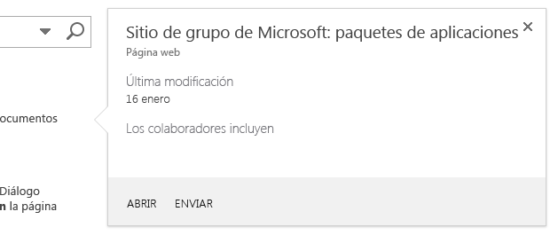

# Resaltar contenido y mejorar la funcionalidad de las aplicaciones hospedadas por SharePoint con el control de globo
El control de globo de SharePoint es un modo flexible de atraer usuarios y de exhibir la funcionalidad de la aplicación hospedada de SharePoint. Además, se puede configurar de diversas formas para adaptarse a la UI de la aplicación. En este artículo se explica cómo crear este control, cómo agregarlo a la página y cómo personalizar su apariencia y comportamiento.Al realizar búsquedas en un sitio de SharePoint 2013, verá algunos ejemplos del control de globo en acción, dado que aparece cuando el mouse se mantiene en un resultado de búsqueda. La figura 1 muestra un globo correspondiente a un resultado de búsqueda individual; en él se reflejan algunas de las características habituales de un control de contenido: un título, información sobre el elemento de la página y las acciones ( **Abrir** y **Enviar**) que se pueden realizar en el elemento. En este caso, la información y las acciones son relativamente sencillas, pero ya ha podido apreciar dos de las ventajas de usarlo. En primer lugar, le permite mostrar información extra sobre los elementos de una página cuando así lo necesite y, en segundo, constituye una forma elegante de agregar funcionalidad a la página. 
**Figura 1. Ejemplo de un control de globo en una página de resultados de búsqueda de SharePoint 2013**





## Poner el control disponible en la página HTML incluyendo el archivo callout.js
<a name="GettingStarted"> </a>

En este ejemplo se emplea el método  `SP.SOD.executeFunc` para garantizar que el archivo de script se carga antes de ejecutar código que dependa de él.



```

SP.SOD.executeFunc("callout.js", "Callout", function () {
    });
```

La función que se pasa a la función  `SP.SOD.executeFunc` contiene el código que hay que ejecutar después de que el archivo callout.js se cargue. Tras cargar estos archivos, se usa el objeto `CalloutManager` para crear un objeto `Callout` por cada elemento de la página que deba tener asociado un control de globo. `CalloutManager` es un singleton donde se almacenan las referencias a todos los objetos `Callout` que hay en una página dentro de una matriz asociativa. El objeto `Callout` tiene únicamente dos miembros necesarios: `ID` y `launchPoint`. El miembro  `ID` es la clave que se asigna al objeto `Callout` en `CalloutManager`:  `CalloutManager["value of the callout's ID member"]`, mientras que el miembro  `launchPoint` es un elemento de página HTML. Puede, por ejemplo, crear u obtener un elemento `div` en la página y pasarlo como miembro del objeto `Callout`. El control de globo se muestra de forma predeterminada cada vez que un usuario hace clic en el elemento  `launchPoint`. En este ejemplo se indica cómo crear el control de globo más básico posible con solo los dos miembros necesarios y una cadena de título.



```

var calloutPageElement = document.createElement("div");
var callout = CalloutManager.createNew({
   ID: "unique identifier",
   launchPoint: calloutPageElement,
   title: "callout title"
});

```

Este globo en concreto aparece y muestra un título en la parte superior cada vez que un usuario hace clic en el elemento de página. Los miembros opcionales se usan para personalizar la apariencia, comportamiento, posicionamiento y acciones de dicho control mediante formas tremendamente eficaces. El control de globo cuenta además con un método definido que sirve para establecer un valor para cualquier parámetro después de crear una instancia del control.



```

callout.set({openOptions:{event: "hover"}});
```

También se pueden establecer valores para todos los miembros del globo en un objeto  `CalloutOptions` y, luego, pasar dicho objeto al método `createNew`.



```
var calloutPageElement = document.createElement("div");
var calloutOptions = new CalloutOptions();
calloutOptions.ID = unique identifier;
calloutOptions.launchPoint = calloutPageElement;
calloutOptions.title = callout title;
var callout = CalloutManager.createNew(calloutOptions);
```


## Cómo personalizar la apariencia de un control de globo
<a name="Appearance"> </a>

Se pueden usar estos miembros para controlar la apariencia de un globo.


|**Miembro**|**Propósito**|**Valores válidos (predeterminado en negrita)**|
|:-----|:-----|:-----|
|title  <br/> |Mostrar un título en la parte superior del control.  <br/> |cadena, **nulo**, cadena que contiene HTML <br/> |
|content  <br/> |Mostrar HTML dentro del control cuando no exista un valor para el miembro  `contentElement`.  <br/> |cadena que contiene HTML, **nulo**, debe ser nulo si `contentElement` tiene un valor <br/> |
|contentElement  <br/> |Mostrar un elemento dentro del control cuando no exista un valor para el miembro  `content`.  <br/> |cualquier elemento HTML, **nulo**, debe ser nulo si `content` tiene un valor <br/> |
|contentWidth  <br/> |Especificar el ancho (en píxeles) del contenedor del cuerpo del globo. Este contenedor tiene también un borde de 1 píxel y un relleno de 15 píxeles a cada lado, por lo que es 32 píxeles más ancho que el cuerpo que se especifique. La propiedad CSS  `overflow` del control está establecida en `hidden`, de modo que el contenido se recortará si no encaja en el ancho que haya especificado. Si establece este miembro en un globo abierto, el cambio tendrá un efecto inmediato, lo que no sucede con el resto de miembros.  <br/> |Cualquier número entre 240 y 610, **350** (lo que hace que el control tenga 382 píxeles de forma predeterminada) <br/> |
|beakOrientation  <br/> |Especificar la orientación del pico o el puntero del control de globo.  <br/> |**topBottom**, para tener la siguiente apariencia (figura 2): **Figura 2. El pico del control de globo aparece con orientación topBottom** **leftRight**, para tener la siguiente apariencia (figura 3): **Figura 3. El pico del control de globo aparece con orientación leftRight**|
 

## Cómo personalizar el comportamiento de un control de globo
<a name="Behavior"> </a>

Se pueden usar los siguientes miembros para controlar el comportamiento del globo. Empiece por el miembro  `openOptions`, que es importante porque permite especificar el modo en que el control se va a abrir y cerrar cuando el usuario interactúe con él en la página.


|**Usar estos valores para el miembro  `openOptions`**|**Propósito**|
|:-----|:-----|
|**{event: "click", closeCalloutOnBlur: true}** <br/> |Hacer que el control de globo aparezca cuando el usuario haga clic en el elemento  `launchPoint` con un mouse y se cierre cuando el usuario aleje el mouse del elemento `launchPoint`. Como el valor de  `event` es `click`, el valor de la opción  `showCloseButton` es **true** de forma predeterminada y no se puede alterar. Esta es la combinación de valores predeterminada. <br/> |
| `{event: "hover", showCloseButton: true}` <br/> |Hacer que el control de globo aparezca cuando el usuario mantenga el mouse sobre el elemento  `launchPoint` y se cierre cuando el usuario haga clic en un botón **X** de la esquina superior derecha del control. Como el valor de `event` es `hover`, el valor de  `closeCalloutOnBlur` no es aplicable y no se puede establecer. <br/> |
| `{event: "click", closeCalloutOnBlur: false}` <br/> |Hacer que el control de globo aparezca cuando el usuario mantenga el mouse sobre el elemento  `launchPoint` y se cierre única y exclusivamente cuando el usuario haga clic en un botón **X** de la esquina superior derecha del control. Como el valor de `event` es `click`, el valor de la opción  `showClosebutton` es **true** de forma predeterminada y no se puede alterar. <br/> |
 
Estos son los otros miembros que se pueden establecer para controlar el comportamiento del globo.


|**Usar este miembro**|**Propósito**|**Valores válidos (predeterminado en negrita)**|
|:-----|:-----|:-----|
|onOpeningCallback  <br/> |Realizar las acciones que deben suceder antes de que el control de globo se represente en la página. Como el objeto  `Callout` se debe pasar como un parámetro a la función proporcionada, este miembro se puede usar para establecer los valores de cualquier propiedad del control antes de que este se represente en la página. También se puede usar para iniciar acciones asincrónicas que agreguen o cambien el contenido del control. El valor para este miembro solamente se puede establecer una vez. <br/> | `function(callout /*=Callout*/) {...}`, **nulo** <br/> |
|onOpenedCallback  <br/> |Realizar las acciones que deben suceder después de que el control de globo se represente en la página con animación completa. Este miembro podría servir para manipular el Document Object Model (DOM) del control. El valor para este miembro solamente se puede establecer una vez.  <br/> | `function(callout /*=Callout*/) {...}`, **nulo** <br/> |
|onClosingCallback  <br/> |Realizar las acciones que deben suceder mientras el control de globo se esté cerrando, pero antes de que haya desaparecido por completo de la página. El valor para este miembro solamente se puede establecer una vez.  <br/> | `function(callout /*=Callout*/) {...}`, **nulo** <br/> |
|onClosedCallback  <br/> |Realizar las acciones que deben suceder después de que el control de globo se haya cerrado y haya desaparecido por completo de la página. El valor para este miembro solamente se puede establecer una vez.  <br/> | `function(callout /*=Callout*/) {...}`, **nulo** <br/> |
 

## Cómo usar los métodos de un control de globo
<a name="CalloutMethods"> </a>

Se pueden usar los siguientes métodos para personalizar el comportamiento del control de globo.


|**Usar este método**|**Propósito**|**Valores de parámetro válidos**|
|:-----|:-----|:-----|
|set({member:value})  <br/> |Establecer los valores de los miembros después de haber creado una instancia del control.  <br/> |Un par nombre-valor que define un valor para cada miembro del control de globo.  <br/>```var callout = new Callout({openOptions:{event: "click"}});callout.set({openOptions:{event: "hover"}});```|
|getOrientation()  <br/> |Devuelve un objeto  `CalloutOrientation` que indica hacia dónde señala el control de globo. Este objeto tiene cuatro miembros booleanos: `up`,  `down`,  `left` y `right`. Mientras el control está abierto, dos de estos valores serán **true** y los otro dos, **false** ( `up` y `right`, por ejemplo).  <br/> |Sin parámetros  <br/> |
|addEventCallback(string eventName, CalloutCallback callback  <br/> |Registrar una función de devolución de llamada que se llame cada vez que el control de globo pasa al estado especificado por el parámetro  `eventName`.  <br/> |El parámetro  `eventName` debe ser uno de los siguientes valores: `opening`,  `open`,  `closing`,  `closed`. El parámetro  `callback` debe ser una función que tome como primer parámetro una instancia del control de globo. <br/> |
|open()  <br/> |Mostrar el control. Si el control ya está abierto o abriéndose, este método devuelve **false** y no hace nada. <br/> |Sin parámetros  <br/> |
|close(bool useAnimation)  <br/> |Ocultar el control. Si el control ya está cerrado o cerrándose, este método devuelve **false** y no hace nada. <br/> |Un valor booleano que especifica si el control se cierra con animación. La animación está desactivada de forma predeterminada.  <br/> |
|toggle()  <br/> |Alternar los estados abierto/cerrado del control.  <br/> |Sin parámetros  <br/> |
|addAction(CallOutAction calloutAction)  <br/> |Agregar un elemento  `CalloutAction` nuevo a la matriz de objetos `CalloutAction` del control de globo. Estos objetos definen las acciones que van a aparecer en el pie de página del control. En la sección [Cómo agregar acciones al control de globo](#AddActions) se explica cómo crear estos objetos. Solo se pueden agregar acciones después de haber creado una instancia del control. De igual modo, el control no puede tener más de tres acciones y, si trata de agregar más, se lanzará una excepción. <br/> |Un objeto  `CalloutAction`.  <br/> |
|refreshActions()  <br/> |Volver a cargar todas las acciones que se han agregado al control. Puede usar este método para cambiar, habilitar o deshabilitar acciones mientras el control está abierto.  <br/> |Sin parámetros  <br/> |
 

## Cómo agregar acciones al control de globo
<a name="AddActions"> </a>

Las acciones se agregan después de crear una instancia del control de globo. Una acción de globo puede consistir en una única acción o en un menú de acciones. Se puede agregar un máximo de tres acciones por control de globo. Una vez que se ha creado una acción de globo, se agrega al objeto  `CalloutControl` con su método `addAction`. En esta acción de ejemplo se abre una ventana nueva del explorador después de que el usuario haya hecho clic en el texto.



```

//Create CalloutAction
var calloutAction = new CalloutAction({
            text: "Open window"
            onClickCallback: function() {            
                window.open(url);
            }
        });

//Add Action to an instance of the CalloutControl    
        myCalloutControl.addAction(calloutAction);
```

Se pueden establecer valores también para todos los miembros  `CalloutAction` de un objeto `CalloutActionOptions` y pasar dicho objeto al constructor `CalloutAction`.



```

//Create CalloutAction
var calloutActionOptions = new CalloutActionOptions();
calloutActionOptions.text = "Open window";
actionOptions.onClickCallback = function() {
    window.open(url);
};
var calloutAction = new CalloutAction(calloutActionOptions);

//Add Action to an instance of the CalloutControl    
        myCalloutControl.addAction(calloutAction);
```

Se pueden usar los siguientes miembros para definir el comportamiento de una acción de globo.


|**Usar este miembro**|**Propósito**|**Valores válidos (predeterminado en negrita)**|
|:-----|:-----|:-----|
|text (obligatorio)  <br/> |Mostrar una etiqueta de texto relativa a la acción.  <br/> |cadena, **nulo** <br/> |
|onClickCallback  <br/> |Definir la acción que tiene lugar cuando el usuario hace clic en la etiqueta de la acción de globo.  <br/> | `function(calloutAction /*=CalloutAction*/) {...}`, **nulo** <br/> |
|isEnabledCallback  <br/> |Definir una función de devolución de llamada que se ejecuta antes de que el globo se muestre y que determina si la acción se permite. Si esta función devuelve **true**, el globo muestra la acción permitida y, si devuelve **false**, muestra el texto de la acción, pero la deshabilita. <br/>  `function(calloutAction /*=CalloutAction*/) {...}`, **nulo** <br/> |
|isVisibleCallback  <br/> |Definir una función de devolución de llamada que se ejecuta antes de que el globo se muestre y que determina si el texto de la acción se muestra. Si esta función devuelve **true**, el globo muestra el texto de la acción y, si devuelve **false**, oculta el texto de la acción. Las acciones adicionales se desplazarán hacia la izquierda para ocupar el sitio de la acción oculta. <br/> | `function(calloutAction /*=CalloutAction*/) {...}`, **nulo** <br/> |
|tooltip  <br/> |Mostrar texto cuando el usuario mantenga el mouse sobre el texto de la acción de globo.  <br/> |cadena, **nulo** <br/> |
|disabledTooltip  <br/> |Mostrar texto cuando el usuario mantenga el mouse sobre el texto de la acción de globo y la acción de globo se haya deshabilitado (cuando la función  `isEnabledCallback` devuelve **false** ). <br/> |cadena, **nulo** <br/> |
|menuEntries  <br/> |Definir un menú de acciones en lugar de una sola. En la siguiente sección se explica cómo crear un elemento  `CalloutActionMenuEntry` y cómo agregarlo a un objeto `CalloutAction`.  <br/> |[ `CalloutActionMenuEntry`, ...], nulo  <br/> |
 

### Cómo agregar menús de acciones al control de globo

Cuando una acción de globo contiene un menú en lugar de una sola acción, el usuario ve una flecha abajo al lado del texto de la acción de globo, como se aprecia en la figura 4.


**Figura 4. La acción de globo muestra un menú cuando un usuario hace clic en la flecha al lado de la etiqueta de acción**


Se pueden crear cuantas entradas de menú sean necesarias y agregarlas a la acción del globo pasándolas en una matriz, como el valor del miembro  `menuEntries` del objeto `CalloutAction`.



```

//Create two menu entries.
var menuEntry1 = new CalloutActionMenuEntry("Entry One", calloutActionCallbackFunction, "/_layouts/images/DOC16.GIF");
var menuEntry2 = new CalloutActionMenuEntry("Some Other Entry", calloutActionCallbackFunction, "/_layouts/images/XLS16.GIF");

//Add the menu entries to the callout action.
var calloutAction = new CalloutAction({
   text: "MENU W/ ICONS",
   menuEntries: [menuEntry1, menuEntry2]
})

//Add the callout action to the callout control.
callout.addAction(calloutAction);

```

El constructor  `CalloutActionMenuEntry` toma tres parámetros: los dos primeros son obligatorios, mientras que el tercero es opcional, si bien resulta muy útil porque permite mostrar un icono junto con el texto.


- Pase una cadena como primer parámetro para mostrar una etiqueta de texto por cada entrada de menú.


- Pase una función como segundo parámetro para definir la acción que tendrá lugar cuando el usuario haga clic en el texto de la entrada de menú.


- Pase una cadena que contenga la dirección URL del icono que quiera mostrar a la izquierda de la etiqueta de texto.


## Cómo usar CalloutManager para crear y administrar instancias del control de globo
<a name="UseCalloutManager"> </a>

El objeto singleton  `CalloutManager` almacena las referencias a todos los objetos `Callout` que hay en una página. Almacena cada instancia de control de globo en una matriz asociativa en la que la clave es el valor `ID` de cada control. `CalloutManager` contiene métodos que sirven para crear y administrar los objetos `Callout` que almacena.


|**Usar este método**|**Propósito**|**Valores de parámetro válidos**|
|:-----|:-----|:-----|
|createNew(members)  <br/> |Crear un objeto  `Callout`. Al hacerlo,  `CalloutManager` agrega una entrada relativa al control en su matriz, con el valor de `ID` del miembro obligatorio como clave. <br/> |Una matriz asociativa que asigna valores a cada miembro que quiera usar. Los miembros  `ID` y `launchPoint` son obligatorios. <br/> |
|createNewIfNecessary (members)  <br/> |Crear un objeto  `Callout` si el elemento `launchPoint` que pase como parámetro no tiene todavía un control de globo asignado. <br/> |Una matriz asociativa que asigna valores a cada miembro que quiera usar. Los miembros  `ID` y `launchPoint` son obligatorios. <br/> |
|getFromLaunchPoint: function (/*@type(HTMLElement)*/launchPoint)  <br/> |Obtener el objeto  `Callout` asociado al elemento `launchPoint` proporcionado en la función. Este método lanza una excepción si `launchPoint` no tiene un objeto `Callout` asignado. <br/> |Sin parámetros  <br/> |
|getFromLaunchPointIfExists: function (/*@type(HTMLElement)*/launchPoint)  <br/> |Obtener el objeto  `Callout` asociado al elemento `launchPoint` proporcionado en la función. Este método devuelve nulo si `launchPoint` no tiene un objeto `Callout` asignado. <br/> |Sin parámetros  <br/> |
|getFromCalloutDescendant: function (/*@type(HTMLElement)*/descendant)  <br/> |Obtener el objeto  `Callout` asociado al elemento HTML proporcionado en el elemento suministrado por la función. Este elemento puede ser cualquier descendiente del elemento de globo. Por ejemplo, se podría pasar el valor del miembro `contentElement` que se asignó al crear el objeto `Callout`. Este método lanza una excepción si el descendiente no tiene un objeto  `Callout` asociado. <br/> |Sin parámetros  <br/> |
|closeAll()  <br/> |Cerrar todos los objetos  `Callout` abiertos. Este método devuelve true si cierra un globo como mínimo. <br/> |Sin parámetros  <br/> |
|isAtLeastOneCalloutOpen()  <br/> |Comprobar si hay al menos un globo abierto.  <br/> |Sin parámetros  <br/> |
 

## Cómo colocar un control de globo
<a name="Positioning"> </a>


|**Usar este miembro**|**Propósito**|**Valores válidos (predeterminado en negrita)**|
|:-----|:-----|:-----|
|boundingBox  <br/> |Especificar el elemento HTML que hará de equivalente de  `offsetParent` del control de globo. El valor predeterminado de esto será el elemento `offsetParent` del control de globo, si bien puede usar este miembro para asegurarse de que el control se coloca como debe. El control de globo tratará de colocarse solo, de forma que estará visible en este cuadro, y cambiará de dirección (de arriba a abajo o de izquierda a derecha, según cuál sea la orientación del pico) para seguir estando visible. <br/> |Cualquier elemento HTML, **el elemento offsetParent del elemento HTML que contiene el control de globo** <br/> |
|positionAlgorithm  <br/> |Reemplazar el algoritmo de posicionamiento predeterminado del control de globo. En la siguiente sección se describe cómo usar el objeto  `calloutPositioningProxy` para escribir algoritmos de posicionamiento de control de globo. <br/> |**CalloutOptions.prototype.defaultPositionAlgorithm**, `function(calloutPositioningProxy) { ... }` <br/> |
 

### Cómo escribir algoritmos de posicionamiento mediante calloutPositioningProxy

El objeto  `calloutPositioningProxy` contiene métodos y propiedades que sirven para reemplazar la lógica de posicionamiento que el control de globo usa de forma predeterminada. Así, por ejemplo, si quiere que el control aparezca siempre debajo y a la derecha del elemento `launchPoint`, deberá escribir un algoritmo de posicionamiento como el siguiente.



```

function alwaysGoDownAndRight(calloutPositioningProxy)  {
    calloutPositioningProxy.moveDownAndRight();
} 

```

Luego, habría que pasar esa función como el valor del miembro  `positionAlgorithm` del objeto `Callout`. Esto se puede realizar al crear  `Callout`, o bien configurando el valor posteriormente.



```

callout.set({positionAlgorithm: alwaysGoDownAndRight});

```

Siempre se puede echar un vistazo a la lógica de posicionamiento predeterminada, para lo que deberá abrir la consola JavaScript del explorador (por ejemplo, las Herramientas de desarrollo F12 de Internet Explorer).



```

CalloutOptions.prototype.positionAlgorithm.toString()
```

Puede usar los siguientes métodos en el objeto  `CalloutPositioningProxy` para escribir su propia lógica de posicionamiento.


|**Método**|**Descripción**|
|:-----|:-----|
|isCalloutTooFarTop()  <br/> |Devuelve un valor booleano.  <br/> |
|isCalloutTooFarRight()  <br/> |Devuelve un valor booleano.  <br/> |
|isCalloutTooFarBottom()  <br/> |Devuelve un valor booleano.  <br/> |
|isCalloutTooFarLeft()  <br/> |Devuelve un valor booleano.  <br/> |
|isCalloutLeftOfHardBoundingBox()  <br/> |Devuelve un valor booleano. Si es **true**, la parte izquierda del control se situará fuera de su elemento contenedor. No estará visible y el usuario no podrá desplazarse hasta ella.  <br/> |
|isCalloutRightOfHardBoundingBox()  <br/> |Devuelve un valor booleano. Si es **true**, la parte derecha del control se situará fuera de su elemento contenedor. No estará visible y el usuario no podrá desplazarse hasta ella.  <br/> |
|isCalloutAboveHardBoundingBox()  <br/> |Devuelve un valor booleano. Si es **true**, la parte superior del control se situará fuera de su elemento contenedor. No estará visible y el usuario no podrá desplazarse hasta ella.  <br/> |
|isCalloutBelowHardBoundingBox()  <br/> |Devuelve un valor booleano. Si es **true**, la parte inferior del control se situará fuera de su elemento contenedor. No estará visible y el usuario no podrá desplazarse hasta ella.  <br/> |
|isOrientedUp()  <br/> |Devuelve un valor booleano.  <br/> |
|isOrientedDown()  <br/> |Devuelve un valor booleano.  <br/> |
|isOrientedLeft()  <br/> |Devuelve un valor booleano.  <br/> |
|isOrientedRight()  <br/> |Devuelve un valor booleano.  <br/> |
|moveUpAndRight()  <br/> |No devuelve nada. Cambia la dirección del control.  <br/> |
|moveUpAndLeft()  <br/> |No devuelve nada. Cambia la dirección del control.  <br/> |
|moveDownAndRight()  <br/> |No devuelve nada. Cambia la dirección del control.  <br/> |
|moveDownAndLeft()  <br/> |No devuelve nada. Cambia la dirección del control.  <br/> |
|moveTowardsOppositeQuadrant()  <br/> |No devuelve nada. Cambia la dirección del control.  <br/> |
|flipHorizontal()  <br/> |No devuelve nada. Cambia la dirección del control.  <br/> |
|flipVertical()  <br/> |No devuelve nada. Cambia la dirección del control.  <br/> |
|numberOfEdgesCollidingWithBoundingBox()  <br/> |Devuelve un número entero entre 0 y 4 que representa el número de bordes en los que el globo choca con el cuadro de límite visible. Por ejemplo, si la parte superior del cuerpo del documento recorta la parte superior del control después de haber llamado al método  `moveUpAndRight()`, el método  `numberOfEdgesCollidingWithBoundingBox()` devolverá un número superior a 1. <br/> |
 
Este algoritmo de posicionamiento hace que el control se coloque encima o debajo del texto. La propiedad  `isRTL` de `CalloutPositioningProxy` indica si el texto va a mostrarse en un idioma de derecha a izquierda. Deberá buscar esta propiedad para asegurarse de que el control va a estar colocado correctamente siempre en relación con el texto de la página.



```
function examplePositionAlgorithm(calloutPositioningProxy) {
    if (!calloutPositioningProxy.isRTL) {
        calloutPositioningProxy.moveDownAndRight();
        if (calloutPositioningProxy.isCalloutTooFarBottom()) {
            calloutPositioningProxy.moveUpAndRight();
        }
    }
    else {
        calloutPositioningProxy.moveDownAndLeft();
        if (calloutPositioningProxy.isCalloutTooFarBottom()) {
            calloutPositioningProxy.moveUpAndLeft();
        }
    }
}
callout.set({positionAlgorithm: examplePositionAlgorithm});

```

Este algoritmo de posicionamiento modifica la dirección predeterminada del control a  `downAndRight` en lugar de a `upAndRight`, pero usa el algoritmo predeterminado en caso de que haya alguna colisión.



```

function tryDownAndRightThenGoDefault(calloutPositioningProxy) {
    if (!calloutPositioningProxy.isRTL)
        calloutPositioningProxy.moveDownAndRight();
    else
        calloutPositioningProxy.moveDownAndLeft();

    if (calloutPositioningProxy.numberOfEdgesCollidingWithBoundingBox() > 0)
        return CalloutOptions.prototype.positionAlgorithm.apply(this, arguments);
};
callout.set({positionAlgorithm: tryDownAndRightThenGoDefault});

```


## Recursos adicionales
<a name="bk_addresources"> </a>


-  [SharePoint 2013: Usar vistas de lista, globos y cuadros de diálogo en complementos hospedados de SharePoint](http://code.msdn.microsoft.com/officeapps/SharePoint-2013-Use-list-cb3e4e14)


-  [Empezar a crear complementos hospedados en SharePoint para SharePoint](get-started-creating-sharepoint-hosted-sharepoint-add-ins.md)


-  [Crear un complemento básico hospedado en SharePoint para SharePoint con las herramientas de desarrollo Napa Office 365](create-a-basic-sharepoint-hosted-add-in-by-using-napa-office-365-development-too.md)


-  [Diseño de la experiencia de usuario para aplicaciones en SharePoint 2013](ux-design-for-sharepoint-add-ins.md)


