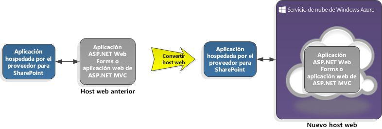

# Hospedar complementos para SharePoint en un servicio de nube de Microsoft Azure
Aprenda a hospedar una Complemento de SharePoint hospedada por el proveedor en un servicio de nube de Microsoft Azure en vez de en una aplicación web, a agregar una Complemento de SharePoint a un rol web de Azure y sepa por qué el hospedaje en Azure podría ser mejor que en una aplicación web.

|||
|:-----|:-----|
|**En este artículo**   [Requisitos previos](#SP15createselfhostapp_bk_prereq)   [Cómo hospedar una Complemento de SharePoint en un servicio de nube de Azure](#SP15HostAzure_bk_HowTo)   [¿Por qué usar Azure?](#SP15HostAzure_bk_Why)   [Recursos adicionales](#SP15Devapps_AddtionalResources)||
   

## Requisitos previos

- Requisitos previos para  [Empezar a crear complementos hospedados en proveedor para SharePoint](get-started-creating-provider-hosted-sharepoint-add-ins.md).
    
  
- El SDK de Microsoft Azure para .NET (VS 2012) 1.8.1, que puede instalar usando el  [Instalador de plataforma web](http://www.microsoft.com/web/downloads/platform.aspx).
    
  

## Cómo hospedar una Complemento de SharePoint en un servicio de nube de Azure

### Agregar un servicio de nube a un complemento existente

Si ya tiene una Complemento de SharePoint hospedada por el proveedor que quiere hospedar en Azure, elija el proyecto de aplicación web en la solución para el complemento de SharePoint. En la barra de menús, seleccione **Proyecto**, **Agregar proyecto de Servicio de nube de Microsoft Azure**. Un proyecto de Azure, llamado  _NameOfTheWebAppProject_.Azure, se agrega a la solución para la Complemento de SharePoint. También se agrega un rol web para el proyecto web al proyecto del servicio de nube de Azure. Las Office Developer Tools para Visual Studio 2012 establecen las propiedades del proyecto necesarias de forma que el rol web pueda trabajar con la Complemento de SharePoint.
  
    
    
En la figura 1 se muestra cómo se convierte una Complemento de SharePoint para usar un servicio de nube de Azure.
  
    
    

**Figura 1. Convertir un complemento de SharePoint para que use un servicio de nube de Azure**

  
    
    

  
    
    

  
    
    

  
    
    

  
    
    

### Agregar un complemento a un rol web existente

Si ya tiene un rol web en un servicio de nube de Azure que quiere usar como host para una Complemento de SharePoint hospedada por el proveedor, abra el proyecto de nube de Azure en Visual Studio y luego, en **Explorador de soluciones**, elija el proyecto de rol web. En la barra de menús, elija **Proyecto**, **Agregar proyecto de complemento para SharePoint**. Se crea un proyecto para una Complemento de SharePoint hospedada por el proveedor, llamado  _NameOfTheWebAppProject_.Azure, y se agrega a la solución. Visual Studio hace referencia al rol web de Azure como el host del proyecto web para la Complemento de SharePoint.
  
    
    
En la figura 2 se muestra cómo se agrega una Complemento de SharePoint a un rol web existente.
  
    
    

**Figura 2. Agregar un complemento de SharePoint a un rol web existente**

  
    
    

  
    
    

  
    
    

  
    
    

  
    
    

## ¿Por qué usar Azure?

Puede aprovechar los servicios de hospedaje y de escalabilidad de Azure migrando la aplicación web de la Complemento de SharePoint hospedada por el proveedor a un servicio de nube de Azure. También puede mejorar el rendimiento y la facilidad de uso de su Complemento de SharePoint, especialmente si el complemento se usa mucho o si su demanda cambia a lo largo del tiempo. Puede ejecutar una aplicación web en Azure con cambios mínimos a su Complemento de SharePoint existente. Un rol web de Azure es, básicamente, un sitio web basado en Internet Information Services (IIS) y hospedado en Azure. 
  
    
    
Para saber de qué forma Azure puede resultar útil, necesita un poco más de información. Un proyecto de una Complemento de SharePoint que está basado en la nube (es decir, está hospedado por un proveedor) suele estar asociado a un proyecto de aplicación web o una "aplicación web". La aplicación web se implementa y hospeda fuera de la granja de servidores de SharePoint. Las Complementos de SharePoint hospedadas por el proveedor interactúan con un sitio de SharePoint a través de un servicio de la aplicación web y también pueden usar recursos y servicios que residan en el sitio remoto.
  
    
    
Consulte los siguientes vínculos para más información.
  
    
    

-  [Aspectos importantes del panorama de desarrollo y arquitectura de los complementos para SharePoint](important-aspects-of-the-sharepoint-add-in-architecture-and-development-landscap.md)
    
  
-  [¿Qué es un servicio de nube](http://www.windowsazure.com/es-es/manage/services/cloud-services/what-is-a-cloud-service/)
    
  
-  [Elegir patrones para desarrollar y hospedar un complemento para SharePoint](choose-patterns-for-developing-and-hosting-your-sharepoint-add-in.md)
    
  
-  [Introducción a Microsoft Azure](http://www.windowsazure.com/es-es/develop/net/fundamentals/intro-to-windows-azure/)
    
  
La aplicación web de sus Complemento de SharePoint puede residir en una granja de servidores local que requiera hardware, instalaciones y personal para su mantenimiento. Azure administra todo esto de forma automática, lo que elimina los gastos e inconvenientes que supone ampliar y mantener una granja de servidores. Si la Complemento de SharePoint alguna vez requiere más recursos de servidor, Azure puede asignarlos de forma dinámica al complemento. Al cambiar una Complemento de SharePoint para que use un servicio de nube de Azure, está dando al complemento más espacio para crecer. Vea el tema  [Autoescala y Microsoft Azure](http://msdn.microsoft.com/es-es/library/hh680945%28v=pandp.50%29.aspx).
  
    
    
Si ya tiene un rol web en Azure, puede aprovecharlo haciendo que sea el host para su Complemento de SharePoint en lugar de crear un nuevo rol web. También puede empaquetar el sitio web como un complemento de SharePoint y luego publicarlo en la Tienda Office, lo que expondría su sitio web a más clientes potenciales.
  
    
    

## Recursos adicionales

-  [¿Qué es Microsoft Azure?](http://www.windowsazure.com/es-es/documentation/)
    
  
-  [Cómo crear e implementar un servicio de nube](http://www.windowsazure.com/es-es/manage/services/cloud-services/how-to-create-and-deploy-a-cloud-service/)
    
  
-  [Implementación de una aplicación web de ASP.NET en un sitio web de Microsoft Azure](http://www.windowsazure.com/es-es/develop/net/tutorials/get-started/)
    
  
-  [Cómo elegir entre sitios web, roles web y VM de Microsoft Azure](http://dotnetthread.com/articles/30-Choosing-between-Windows-Azure-Web-Sites-Web-Roles-and-VMs.aspx)
    
  