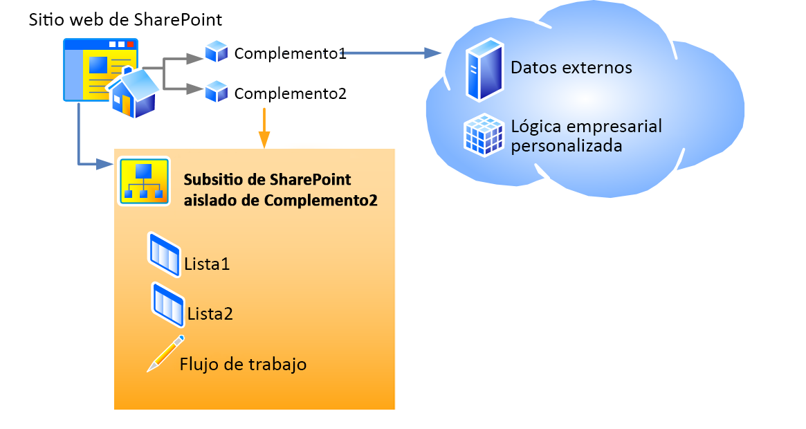

# Hospedar webs, webs de complementos y componentes de SharePoint en SharePoint 2013
Obtenga información sobre cuáles son las diferencias entre sitios web host y sitios web de complemento. Obtenga asimismo información sobre qué componentes de SharePoint 2013 se pueden incluir en un Complemento de SharePoint, cuáles se implementan en el sitio web host, cuáles en el sitio web de complemento y cómo se implementa el sitio web de complemento en un dominio aislado.
## Sitios web host, sitios web de complemento y el dominio aislado
<a name="IsolatedDomain"> </a>

Cuando se instala un complemento que incorpora componentes de SharePoint en un sitio web, aparece en la página **Contenidos del sitio** desde donde se puede iniciar. Este listado, que es desde donde se inicia el complemento, constituye el único elemento que es obligatorio agregar al sitio web, pese a que hay otros elementos que son opcionales como, por ejemplo, las acciones personalizadas o los elementos de complemento. Para obtener información sobre estas opciones, consulte [Obtener acceso al complemento desde la interfaz de usuario](important-aspects-of-the-sharepoint-add-in-architecture-and-development-landscap.md#AccessingApp). Aparte de estos elementos de la interfaz de usuario, los componentes y contenido de Complemento de SharePoint, como las listas, los tipos de contenido, los flujos de trabajo y las páginas, se desarrollan en un sitio web distinto, en un dominio aislado especial. Esto pasa en gran medida desapercibido para el usuario. El sitio web especial en el que se  *implementa*  el complemento se denominasitio web de complemento. El sitio web en el que se  *instala*  el complemento se denomina elsitio web host. Pese a que el sitio web de complemento dispone de su propio dominio aislado, está en la misma colección de sitios que el sitio web host (una excepción a la regla es cuando el complemento se instala en un ámbito de inquilino; en tal caso, el sitio web de complemento estará en la colección de sitios del catálogo de complementos corporativos). 


La Figura 1 muestra un sitio web host con dos Complementos de SharePoint instaladas. El complemento 1 tiene componentes remotos, pero no tiene componentes de SharePoint, por tanto no tiene un sitio web de complemento. El complemento 2 no tiene componentes remotos, pero tiene dos listas de SharePoint y un flujo de trabajo. Se han implementado en un sitio secundario aislado (una Complemento de SharePoint puede tener componentes remotos y hospedados en SharePoint, pese a que ninguno de los complementos en este diagrama cuenta con ambos).


**Figura 1: Sitio web host con un complemento hospedado en un proveedor y un complemento hospedado en SharePoint**





Por ejemplo, imaginemos que un complemento, con componentes de SharePoint, además de los elementos de la interfaz de usuario que se pueden implementar en un sitio web host, se instala en un sitio web host en la siguiente dirección URL:


 `https://www.fabrikam.com/sites/Marketing`


La Complemento de SharePoint se implementaría en un sitio web que se hubiera acabado de crear con una dirección URL como la siguiente:


 `http://add-in-bdf2016ea7dacb.fabrikamadd-ins.com/sites/Marketing/Scheduler`


Tenga en cuenta que esta dirección URL tiene la estructura siguiente:


 `https://` _Prefijo_Complemento_ `-` _ID_Complemento_ `.` _Dominio_Básico_Complemento_ `/` _URL_Relativa_Dominio_de_Web_Host_ `/` _Nombre_Complemento_


Los marcadores se definen como sigue:


-  _Prefijo_Complemento_ es una cadena que establece el administrador de granja en la Administración central. El valor predeterminado es "default", pero en este caso el administrador lo cambió a "add-in".


-  _ID_Complemento_ es un número hexadecimal que se genera internamente una vez se instala el complemento.


-  _Dominio_Básico_Complemento_ es cualquier cadena que establece el administrador de la granja en la Administración central o con Shell de administración de SharePoint. Esto *no*  debería establecerse en un subdominio de la aplicación web de SharePoint o el propósito del aislamiento del complemento sería un fracaso. En este ejemplo, el administrador ha quitado "www." y ha agregado "add-ins" al nombre de la empresa. Así que `fabrikamadd-ins.com` es el dominio básico del complemento.


-  _Domain_Relative_URL_of_Host_Web_ es la dirección URL relativa del sitio web de host primario, en este caso `sites/Marketing`.


-  _Nombre_Complemento_ es el valor del atributo **Name** del elemento **App** en el archivo appmanifest.xml.


Existen dos razones principales por las que se implementan componentes de SharePoint en sitios web de complemento, en lugar de en sitios web de host. Ambas tienen que ver con la seguridad.


- **Obligatoriedad de los permisos del complemento:** en el modelo para aplicaciones para SharePoint, los complementos tienen su propia identidad y disponen de permisos que no son necesariamente iguales a los que tiene el usuario que ejecuta el complemento. Estos permisos del complemento son necesarios cuando se instala un complemento y los otorga la persona que instala dicho complemento, siempre que dicha persona disponga de todos los permisos que solicita el complemento (si el usuario que instala el complemento no dispone de todos los permisos que solicita el complemento, el usuario no podrá instalarlo). Si se confiere a cada complemento su propio dominio, SharePoint 2013 podrá identificar con fiabilidad las solicitudes que efectúa el complemento y comprobar los permisos de este. Para más información sobre los permisos del complemento, consulte [Permisos de complemento](important-aspects-of-the-sharepoint-add-in-architecture-and-development-landscap.md#AppPermissions).


- **Seguridad para la generación de scripts entre dominios:** los exploradores modernos admiten una "directiva de uso del mismo origen" con respecto a las llamadas al método JavaScript. Al implementar cada Complemento de SharePoint en su propio dominio, SharePoint se sirve de la directiva de uso del mismo origen para garantizar que JavaScript en la Complemento de SharePoint no puede ejecutar ningún JavaScript desde cualquier otro dominio, lo que incluye el dominio en el que se instala el complemento (desde la perspectiva del usuario final).

    SharePoint proporciona asimismo medios para superar de forma segura las restricciones de la directiva. Entre otras cosas, hace posible que los componentes remotos de una Complemento de SharePoint consulten datos desde un sitio web en el arrendamiento común primario de los sitios web de host y de complemento. Para más información, consulte  [Cómo obtener acceso a los datos de SharePoint 2013 desde aplicaciones con la biblioteca entre dominios](access-sharepoint-2013-data-from-add-ins-using-the-cross-domain-library.md).


## Tipos de componentes de SharePoint que se pueden encontrar en un complemento para SharePoint
<a name="TypesOfSPComponentsInApps"> </a>

En general, una Complemento de SharePoint puede incorporar uno o varios de los componentes de la siguiente lista. Pese a que existen ciertas excepciones, estos componentes deben implementarse en las características de ámbito **Web** que se encuentran en el archivo del paquete de la solución SharePoint (.wsp).


> **NOTA**
> ***** Los componentes con asterisco (*) se describen de forma más detallada en la sección [Advertencias en la implementación de componentes de SharePoint](#SpecialCases) más adelante en este artículo.


- Características (solo las de ámbito **Web**)


- Acciones personalizadas (incluso los elementos de menú contextual y las personalizaciones de la cinta)*


- Receptores de eventos remotos*


- Marcado que hace referencia a elementos web, lo cual incluye elementos de complemento, que se incorporan en SharePoint (pero no elementos web personalizados)*


- Archivos de Hojas de estilo CSS (CSS) personalizados para su uso en las páginas de SharePoint


- Archivos de JavaScript personalizados para su uso en las páginas de SharePoint


- Módulos (conjuntos de archivos)


- Páginas


- Plantillas de lista


- Instancias de lista y biblioteca


- Formularios de lista personalizados


- Vistas de lista personalizadas


- Tipos de contenido personalizados


- Campos (o tipos de campo que se compilan en SharePoint)


- Modelos de Servicios de conectividad empresarial de Microsoft (BCS) (solo con ámbito **Web**), tipos de contenido externo basados en el modelo y listas externas que usan los tipos de contenido*


- Flujos de trabajo*


- Contenedores de propiedades


- Plantillas web (pero no definiciones de sitio)*


En una Complemento de SharePoint, no se podrán implementar otros componentes de SharePoint. Para obtener más información sobre las restricciones relativas a lo que se puede incluir en una Complemento de SharePoint, consulte  [Complementos para SharePoint comparadas con las soluciones de SharePoint](http://msdn.microsoft.com/library/0e9efadb-aaf2-4c0d-afd5-d6cf25c4e7a8%28Office.15%29.aspx).


## Advertencias en la implementación de componentes de SharePoint
<a name="SpecialCases"> </a>

A continuación se detallan algunas advertencias e información sobre la implementación de algunos tipos de componentes de SharePoint en un complemento: 


- **Acciones personalizadas:** además de agregar acciones personalizadas al sitio web de complemento, puede agregarlas asimismo al sitio web host. Para agregar la acción personalizada al sitio web de complemento, hay que incluirla en una característica de ámbito **Web** que esté en un archivo .wsp, tal como incluiría cualquier otro componente que vaya a agregar al sitio web de complemento. Para agregar una acción personalizada al sitio web host, puede incluir (incluso en un complemento basado en un entorno externo) marcados de **CustomAction** en una característica que se encuentre en el paquete del complemento, pero fuera de cualquier archivo .wsp. Los componentes en una característica "fantasma" de esta índole se aplican al sitio web host, y no al sitio web de complemento, por tanto este tipo de característica recibe el nombre decaracterística de sitio web host. 


- **Elementos web:** un tipo de elemento web, un elemento de complemento, se puede implementar en un complemento, y un elemento de complemento puede colocarse bien en el sitio web de complemento o bien en el sitio web de host. El resto de tipos de elementos web se pueden referenciar en los complementos, pero estos no los pueden implementar. Si un elemento de complemento se implementa en el sitio web de host, debería incluirse en una característica de sitio web de host.


- **Receptores de eventos remotos:** es un aspecto nuevo en SharePoint 2013. Se asemejan a los receptores de eventos de SharePoint habituales salvo que el código se ejecuta en la nube. No están disponibles en complementos hospedados en SharePoint.


- **Flujos de trabajo:** los flujos de trabajo en SharePoint 2013 usan el tiempo de ejecución de flujo de trabajo hospedado en Microsoft Azure, que es nuevo en SharePoint 2013. Los flujos de trabajo codificados que usan el tiempo de ejecución del flujo de trabajo hospedado en SharePoint no se pueden incluir en una Complemento de SharePoint. Solo se permiten los flujos de trabajo declarativos o los flujos de trabajo que usan tiempo de ejecución más reciente.


- Modelos de **Servicios de conectividad empresarial de Microsoft (BCS), tipos de contenido externo y listas externas:** los modelos de Servicio de conectividad a datos empresariales (BDC) tienen por lo general un ámbito más amplio que las colecciones de sitios. Sin embargo, cuando se implementa un modelo de Servicio de conectividad a datos empresariales (BDC) en un complemento, su ámbito queda limitado al sitio web de complemento. Si un modelo de Servicio de conectividad a datos empresariales (BDC) se incluye en un complemento, no se almacenará en el almacén de servicios compartidos de Servicio de conectividad a datos empresariales (BDC); se almacenará como un archivo en el sitio web de complemento.


- **Plantillas web:** en la mayoría de los casos, lo aconsejable es que el sitio web de complemento cree instancias de la nueva **APP#0** integrada de la configuración de la definición del sitio, que se optimiza para sitios web de complemento (para más información al respecto, consulte [Obtener acceso al complemento desde la interfaz de usuario](important-aspects-of-the-sharepoint-add-in-architecture-and-development-landscap.md#AccessingApp)). SharePoint 2013 usa de forma automática la **APP#0** cuando el paquete del complemento no incluye un elemento de [Plantilla web](http://msdn.microsoft.com/library/ff4ba91a-cc5f-47ff-9101-a7651f452185%28Office.15%29.aspx). 

    También puede definir un tipo de sitio personalizado para el sitio web de complemento. Existen dos pasos fundamentales para ello:

  - Incluir un  [Elemento WebTemplate (Plantilla web)](http://msdn.microsoft.com/library/ff4ba91a-cc5f-47ff-9101-a7651f452185%28Office.15%29.aspx) personalizado, un archivo onet.xml y, seguramente, otros archivos asociados en la característica del sitio web de complemento para el complemento. Implemente la plantilla web en la característica de ámbito web en un archivo .wsp dentro del paquete del complemento, como lo hace habitualmente.


  - Agregar un  [Elemento WebTemplate (PropertiesDefinition complexType) (Add in SharePoint manifiesto)](http://msdn.microsoft.com/library/62302903-e97a-a9a3-a64e-13176a7c4e1e%28Office.15%29.aspx) al manifiesto de complemento como elemento secundario del elemento **Properties** y establecer su atributo **Id** en el GUID de la característica del sitio web de complemento y el valor del atributo **Name** del [Elemento WebTemplate (Plantilla web)](http://msdn.microsoft.com/library/ff4ba91a-cc5f-47ff-9101-a7651f452185%28Office.15%29.aspx). Tenga en cuenta que es preciso que el GUID lleve guiones y esté entre llaves "{}", además el GUID y el nombre de plantilla deben estar separados con el carácter "#". A continuación, se ofrece un ejemplo:

 ```XML

<WebTemplate Id="{81dd4ae5-873b-4759-9838-4ad9c3dd2952}#NewSiteType" />
 ```


    > **NOTA**
      > El nuevo elemento  [Plantilla web](http://msdn.microsoft.com/library/62302903-e97a-a9a3-a64e-13176a7c4e1e%28Office.15%29.aspx) para los manifiestos de complemento no tiene el mismo marcado que el elemento [Plantilla web](http://msdn.microsoft.com/library/ff4ba91a-cc5f-47ff-9101-a7651f452185%28Office.15%29.aspx) que se puede incluir en Características. El elemento **WebTemplate** que se puede incluir en Características define el tipo de sitio, pero el elemento **WebTemplate** de los manifiestos de complemento simplemente identifica el tipo de sitio que se va a usar. Para más información sobre el manifiesto de complemento de una Complemento de SharePoint, vea [Estructura del paquete del complemento](important-aspects-of-the-sharepoint-add-in-architecture-and-development-landscap.md#SPAppModelArch_Package). 

    > **PRECAUCIóN**
      > No use el elemento **WebTemplate** en el manifiesto de complemento para designar a alguna de las configuraciones de definición de sitio de SharePoint integradas como el tipo de sitio del sitio web de complemento. No se admite el uso de ninguna de las configuraciones de definición de sitio integradas, salvo **APP#0**, para los sitios web de complemento. 

    Para más información sobre las configuraciones de definición de sitio y sobre las plantillas web, consulte  [Trabajar con plantillas y definiciones](http://msdn.microsoft.com/library/1edf6d4d-eddb-4cb5-9034-ed394e8a3e01%28Office.15%29.aspx).


## Recursos adicionales
<a name="SP15hostedwebs_bk_addlresources"> </a>


-  [Aspectos importantes del panorama de desarrollo y arquitectura de los complementos para SharePoint](important-aspects-of-the-sharepoint-add-in-architecture-and-development-landscap.md)


-  [Complementos para SharePoint comparadas con las soluciones de SharePoint](http://msdn.microsoft.com/library/0e9efadb-aaf2-4c0d-afd5-d6cf25c4e7a8%28Office.15%29.aspx)


