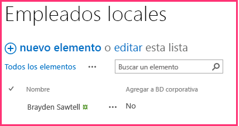
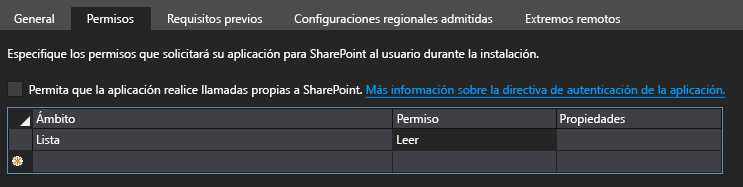
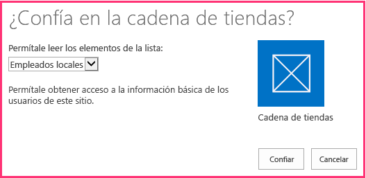
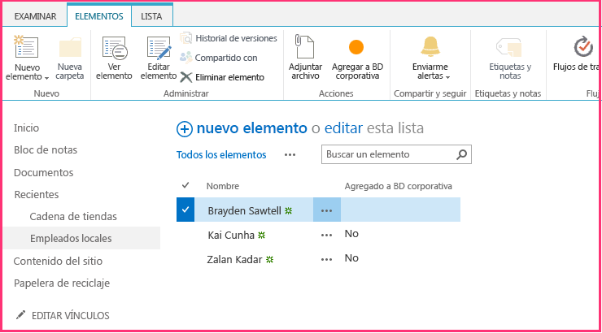
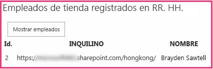

# Incluir un botón personalizado en el complemento hospedado por el proveedor
Aprenda a incluir un botón de la cinta de opciones personalizada en un Complemento de SharePoint hospedado por el proveedor.
Este es el tercero de una serie de artículos sobre los conceptos básicos de desarrollo de Complementos de SharePoint hospedados por el proveedor. Primero debe familiarizarse con los  [Complementos de SharePoint](sharepoint-add-ins.md) y con los anteriores artículos de esta serie:
  
    
    


-  [Empezar a crear complementos hospedados en proveedor para SharePoint](get-started-creating-provider-hosted-sharepoint-add-ins.md)
    
  
-  [Dar al complemento hospedado por el proveedor la apariencia de SharePoint](give-your-provider-hosted-add-in-the-sharepoint-look-and-feel.md)
    
  

> **NOTA**
> Si ha estado trabajando en esta serie sobre complementos hospedados por el proveedor, ya tiene una solución de Visual Studio que puede usar para continuar con este tema. También puede descargar el repositorio en  [SharePoint_Provider-hosted_Add-Ins_Tutorials](https://github.com/OfficeDev/SharePoint_Provider-hosted_Add-ins_Tutorials) y abrir el archivo BeforeRibbonButton.sln.
  
    
    

Un Complemento de SharePoint puede incluir acciones personalizadas, que es el término de SharePoint para los elementos de menú o botones personalizados de la cinta de opciones. En este artículo aprenderá a crear un botón personalizado que sincroniza una lista de SharePoint con una base de datos remota.
## Crear una lista personalizada en el sitio web de host

El botón personalizado va a estar en la cinta de opciones de una lista específica que registra a los empleados de la tienda local. En un artículo posterior de esta serie, aprenderá a agregar mediante programación una lista personalizada a un sitio web de host, pero por ahora lo haremos manualmente. 
  
    
    

1. En la página principal de la tienda de Hong Kong de Fabrikam, vaya a **Contenido del sitio | agregar un complemento | Lista personalizada**. 
    
  
2. En el cuadro de diálogo **Agregar lista personalizada**, especifique Empleados locales como nombre y presione **Crear**. 
    
  
3. En la página **Contenido del sitio**, abra la lista **Empleados locales**.
    
  
4. Abra la ficha **Lista** en la cinta de opciones y, a continuación, haga clic en el botón **Configuración de la lista**.
    
  
5. En la sección **Columnas** de la página **Configuración de la lista**, haga clic en la columna **Título**. 
    
  
6. En el formulario **Editar columna**, cambie el **Nombre de columna** de Título aNombre y, a continuación, haga clic en **Aceptar**.
    
  
7. En la página **Configuración**, haga clic en **Crear columna**.
    
  
8. En el formulario **Crear columna**, haga lo siguiente:
    
1. Escriba Agregado a BD corporativa como **Nombre de columna**.
    
  
2. Establezca el tipo en **Sí/No (casilla)**.
    
  
3. Establezca el **Valor predeterminado** en **No**.
    
  
4. Presione **Aceptar**. Volverá a la página **Configuración**.
    
  
9. Haga clic en **Contenido del sitio** para abrir la página **Contenido del sitio**. El icono de la nueva lista se encuentra allí. Ábralo.
    
  
10. Haga clic en **Nuevo elemento** y, en el formulario de creación de elemento, escriba un nombre, pero *no*  active **Agregado a BD corporativa**. A continuación, haga clic en **Guardar**. La lista debe ser similar a la siguiente:
    
     
  

  

  

## Agregar el botón personalizado

En esta sección, se incluye marcado en el complemento que implementará un botón en la cinta de opciones de la lista. Cuando un usuario resalta un empleado en la lista y hace clic en el botón, el nombre del empleado se agrega a la base de datos corporativa y el campo **Agregado a BD corporativa** del empleado cambia de No a Sí.
  
    
    

1.  *Si Visual Studio está abierto, debe cerrarlo*  y volver a abrir la solución Chain Store para que Visual Studio pueda detectar la nueva lista. (Ejecute Visual Studio como administrador).
    
    > **NOTA**
      >  La configuración de los Proyectos de inicio en Visual Studio tiende a volver a los valores predeterminados cuando se vuelve a abrir la solución. Siempre siga estos pasos inmediatamente después de volver a abrir la solución de ejemplo en esta serie de artículos:>  Haga clic con el botón derecho en el nodo de solución en la parte superior del **Explorador de soluciones** y seleccione **Establecer proyectos de inicio**. >  Asegúrese de que los tres proyectos estén establecidos en **Iniciar** en la columna **Acción**. 
2. Haga clic con el botón derecho en el proyecto **ChainStore** en el **Explorador de soluciones** y elija **Agregar | Nuevo elemento**. 
    
  
3. En el cuadro de diálogo **Agregar nuevo elemento**, seleccione **Acción personalizada de cinta**, asígnele el nombre AddEmployeeToCorpDB y, a continuación, haga clic en **Agregar**.
    
  
4. El cuadro de diálogo que se abre hace tres preguntas. Proporcione las respuestas siguientes:
    

|**Pregunta**|**Proporcione esta respuesta:**|
|:-----|:-----|
|**¿Dónde desea exponer la acción personalizada?** <br/> |Web de host <br/> |
|**¿Qué ámbito tiene la acción personalizada?** <br/> |Instancia de lista <br/> |
|**¿Qué elemento específico tiene como ámbito la acción personalizada?** <br/> |Empleados locales <br/> |
   
5. Haga clic en **Siguiente** para obtener tres preguntas más:
    

|**Pregunta**|**Proporcione esta respuesta:**|
|:-----|:-----|
|**¿Dónde se encuentra el control?** <br/> |Ribbon.ListItem.Actions <br/> |
|**¿Cuál es el texto de la etiqueta de control del botón?** <br/> |Agregar a BD corporativa <br/> |
|**¿Adónde lleva el control del botón?** <br/> |ChainStoreWeb\\Pages\\EmployeeAdder.aspx (Es una página cuyo código subyacente agregará el empleado a la base de datos). <br/> |
   
6. Haga clic en **Finalizar**.
    
    Se agrega al proyecto y se abre un archivo elements.xml que define la acción personalizada. Por lo general, este archivo se puede considerar como una caja negra y no necesita realizar cambios en él hasta que lo veamos en un artículo posterior de esta serie. Por ahora, tenga en cuenta la siguiente:
    
  - El atributo **Location** del elemento **CommandUIDefinition** tiene el valor `Ribbon.ListItem.Actions.Controls_children`. La segunda parte de esto,  `ListItem`, identifica la ficha en la cinta de opciones donde se colocará el botón (pero eso no puede ser el nombre para mostrar exacto de la ficha) y la tercera parte,  `Actions`, es el nombre de la sección de la cinta de opciones donde se colocará el botón.
    
  
  - El atributo **CommandAction** del elemento **CommandUIHandler** comienza con el marcador de posición `~remoteAppUrl`. Se reemplazará por la dirección URL de la aplicación web remota cuando se implemente el botón.
    
  
  - Algunos parámetros de consulta se agregaron al valor **CommandAction** con los valores de marcador de posición entre llaves "{}". Estos marcadores de posición se resuelven en tiempo de ejecución. Tenga en cuenta que uno de ellos es el identificador del elemento de lista que selecciona el usuario antes de presionar el botón personalizado en la cinta de opciones.
    
  
7. En el proyecto **ChainStoreWeb**, abra el archivo **Pages/EmployeeAdder.aspx**. Observe que no tiene ninguna interfaz de usuario. El complemento usará esta página como tipo de servicio web. Esto es posible porque la clase **System.Web.UI.Page** de ASP.NET implementa **System.Web.IHttpHandler** y porque el evento ** Page_Load** se ejecuta automáticamente cuando se solicita la página.
    
  
8. Abra el archivo de código subyacente **Pages/EmployeeAdder.aspx.cs**. El método que agrega el empleado a la base de datos remota,  `AddLocalEmployeeToCorpDB`, ya está presente. Usa el objeto **SharePointContext** para obtener la dirección URL de la web de host, que el complemento usa como discriminador de inquilinos. Por lo tanto, lo primero que el método **Page_Load** necesita hacer es inicializar este objeto. El objeto se crea y almacena en la memoria caché en la Sesión cuando se carga la página de inicio del complemento. Agregue el código siguiente al método **Page_Load**. (El objeto **SharePointContext** está definido en el archivo SharePointContext.cs que Office Developer Tools para Visual Studio genera cuando se crea la solución del complemento).
    
 ```cs
  
spContext = Session["SPContext"] as SharePointContext;
 ```

9. El método  `AddLocalEmployeeToCorpDB` toma el nombre del empleado como parámetro. Por lo tanto, agregue la siguiente línea al método **Page_Load**. Crearemos el método  `GetLocalEmployeeName` en un paso posterior.
    
 ```cs
  // Read from SharePoint
string employeeName = GetLocalEmployeeName();
 ```

10. Debajo de esta línea, agregue la llamada al método  `AddLocalEmployeeToCorpDB`.
    
 ```cs
  
// Write to remote database
AddLocalEmployeeToCorpDB(employeeName);
 ```

11. Agregue una instrucción **using** al archivo para el espacio de nombres `Microsoft.SharePoint.Client`. (Office Developer Tools para Visual Studio incluyó el ensamblado Microsoft.SharePoint.Client en el proyecto **ChainStoreWeb** cuando se creó).
    
  
12. Ahora agregue el siguiente método a la clase  `EmployeeAdder`. El modelo de objetos de cliente (CSOM) de .NET de SharePoint se documenta en detalle en otra parte de MSDN y le recomendamos explorarlo cuando termine con esta serie de artículos. En este artículo, tenga en cuenta que la clase **ListItem** representa un elemento de una lista de SharePoint y que puede hacer referencia al valor de un campo en el elemento con la sintaxis "indexer". Además, recuerde que el código hace referencia al campo como "Título" aunque se cambiara el nombre del campo a "Nombre". Esto se debe a que siempre se hace referencia a los campos en el código por su nombre *interno*  , no por el nombre para mostrar. El nombre interno de un campo se establece cuando el campo se crea y no se puede cambiar nunca. Completaremos `TODO1` en un paso posterior.
    
 ```cs
  
private string GetLocalEmployeeName()
{
    ListItem localEmployee;

    // TODO1: Initialize the localEmployee object by getting  
    // the item from SharePoint.
 
    return localEmployee["Title"].ToString();
}
 ```

13. Nuestro código necesitará el identificador del elemento de lista para poder recuperarlo de SharePoint. Agregue la siguiente declaración a la clase  `EmployeeAdder` justo debajo de la declaración para el objeto `spContext`.
    
 ```cs
  
private int listItemID;
 ```

14. Ahora agregue el siguiente método a la clase  `EmployeeAdder` para obtener el identificador del elemento de lista a partir del parámetro de consulta.
    
 ```cs
  private int GetListItemIDFromQueryParameter()
{
    int result;
    Int32.TryParse(Request.QueryString["SPListItemId"], out result);
    return result;
}
 ```

15. Para inicializar la variable  `listItemID`, agregue la línea siguiente al método **Page_Load** justo debajo de la línea que inicializa la variable `spContext`.
    
 ```cs
  
listItemID = GetListItemIDFromQueryParameter();
 ```

16. En  `GetLocalEmployeeName`, reemplace  `TODO1` por el código siguiente. Por el momento, simplemente considere este código como una caja negra mientras nos concentramos en hacer que el botón personalizado funcione. Conocerá más sobre este código en el siguiente artículo de esta serie, que trata sobre el modelo de objetos de cliente de SharePoint.
    
 ```cs
  using (var clientContext = spContext.CreateUserClientContextForSPHost())
{
    List localEmployeesList = clientContext.Web.Lists.GetByTitle("Local Employees");
    localEmployee = localEmployeesList.GetItemById(listItemID);
    clientContext.Load(localEmployee);
    clientContext.ExecuteQuery();
}

 ```


    El método completo ahora debería ser similar al siguiente.
    


 ```cs
  
private string GetLocalEmployeeName()
{
    ListItem localEmployee;

    using (var clientContext = spContext.CreateUserClientContextForSPHost())
    {
        List localEmployeesList = clientContext.Web.Lists.GetByTitle("Local Employees");
        selectedLocalEmployee = localEmployeesList.GetItemById(listItemID);
        clientContext.Load(selectedLocalEmployee);
        clientContext.ExecuteQuery();
    }
    return localEmployee["Title"].ToString();
}
 ```

17. La página EmployeeAdder realmente no debería representarse, así que agregue lo siguiente como última línea del método **Page_Load**. Esta acción redirigirá el explorador a la página de vista de lista para la lista **Empleados locales**.
    
 ```cs
  
// Go back to the Local Employees page
Response.Redirect(spContext.SPHostUrl.ToString() + "Lists/LocalEmployees/AllItems.aspx", true);

 ```


    El método completo **Page_Load** ahora debería ser similar al siguiente.
    


 ```cs
  
protected void Page_Load(object sender, EventArgs e)
{
    spContext = Session["SPContext"] as SharePointContext;
    listItemID = GetListItemIDFromQueryParameter();

    // Read from SharePoint
    string employeeName = GetLocalEmployeeName();

    // Write to remote database
    AddLocalEmployeeToCorpDB(employeeName);

    // Go back to the preceding page
    Response.Redirect(spContext.SPHostUrl.ToString() + "Lists/LocalEmployees/AllItems.aspx", true);
}
 ```


## Solicitar permiso para leer la lista de web de host

Como vimos, SharePoint le pregunta si desea conceder los permisos de complemento a la web de host cuando se instale. El complemento se reinstalaba cada vez que se presionaba F5. Hasta ahora, el complemento solo tiene permisos mínimos necesarios, pero el método  `GetLocalEmployeeName` requiere permiso para leer las listas del sitio web de host. El complemento usa su manifiesto de complemento para indicar a SharePoint qué permisos necesita. Siga estos pasos.
  
    
    

1. En el **Explorador de soluciones**, abra el archivo AppManifest.xml en el proyecto **ChainStore**. (El archivo se denomina AppManifest porque los complementos se solían llamar "apps"). Se abre el diseñador de manifiestos.
    
  
2. Abra la ficha **Permisos** y haga clic en la celda vacía en la columna **Ámbito**. A continuación, seleccione **Lista** en la lista desplegable.
    
  
3. En el campo **Permiso**, seleccione **Lectura** en la lista desplegable.
    
  
4. Deje vacío el campo **Propiedades** y guarde el archivo. La ficha **Permiso** ahora debe ser similar a la siguiente:
    
     
  

  

  

## Ejecutar el complemento y probar el botón


  
    
    

1. Use la tecla F5 para implementar y ejecutar el complemento. Visual Studio hospeda la aplicación web remota en IIS Express y hospeda la base de datos SQL en un SQL Express. También hace una instalación temporal del complemento en su sitio de SharePoint de prueba y ejecuta inmediatamente el complemento. Deberá conceder permisos al complemento antes de que se abra la página de inicio. Esta vez la solicitud tiene una lista desplegable donde se selecciona la lista que la aplicación necesita leer como se muestra en la siguiente captura de pantalla. 
    
     
  

  

  
2. Elija **Empleados locales** de la lista y, a continuación, haga clic en **De confianza**.
    
  
3. Cuando se abra la página de inicio del complemento, haga clic en **Volver al sitio** en el control de cromo de la parte superior.
    
  
4. Desde la página principal del sitio web, vaya a **Contenido del sitio | Empleados locales**. Se abrirá la página de vista de lista.
    
  
5. Agregue algunos empleados a la lista.  *No active la casilla **Agregado a BD corporativa**.* 
    
  
6. En la cinta de opciones, abra la ficha **Elementos**. En la sección **Acciones** de la ficha se encuentra el botón personalizado **Agregar a BD corporativa**.
    
  
7. Seleccione un elemento en la lista. La página y la cinta de opciones deben ser similares a lo siguiente:
    
     
  

  

  
8. Presione el botón **Agregar a BD corporativa**.  * **Primero debe seleccionar un elemento.*** 
    
  
9. La página parecerá recargarse porque el método **Page_Load** de la página EmployeeAdder redirige otra vez a ella.
    
  
10. Presione el botón Atrás del explorador dos veces para volver a la página de inicio del complemento. 
    
  
11. Haga clic en **Mostrar empleados** para que la lista de empleados se rellene con el empleado que agregó. Debería ser similar a lo siguiente:
    
     
  

  

  
12. Para terminar la sesión de depuración, cierre la ventana del explorador o detenga la depuración en Visual Studio. Cada vez que presione F5, Visual Studio retirará la versión anterior del complemento e instalará la más reciente.
    
  
13. Trabajará con este complemento y con la solución de Visual Studio en otros artículos, y se considera recomendable retirar el complemento una última vez cuando acabe de trabajar en él durante un tiempo. En el proyecto, haga clic con el botón derecho en el **Explorador de soluciones** y elija **Retirar**.
    
  

## 
<a name="Nextsteps"> </a>

 En el siguiente artículo, dejaremos brevemente la codificación para describir el modelo de objetos de cliente de SharePoint: [Obtener una introducción rápida al modelo de objetos de SharePoint](get-a-quick-overview-of-the-sharepoint-object-model.md).
  
    
    

