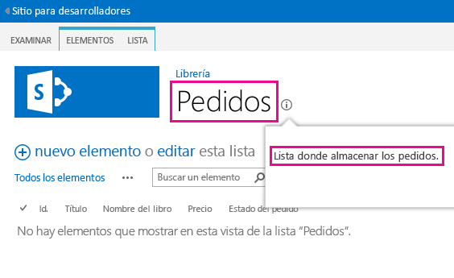
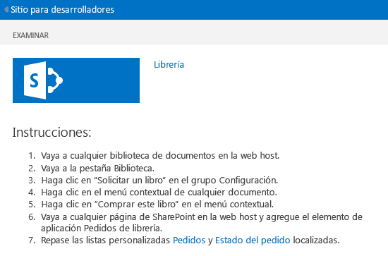
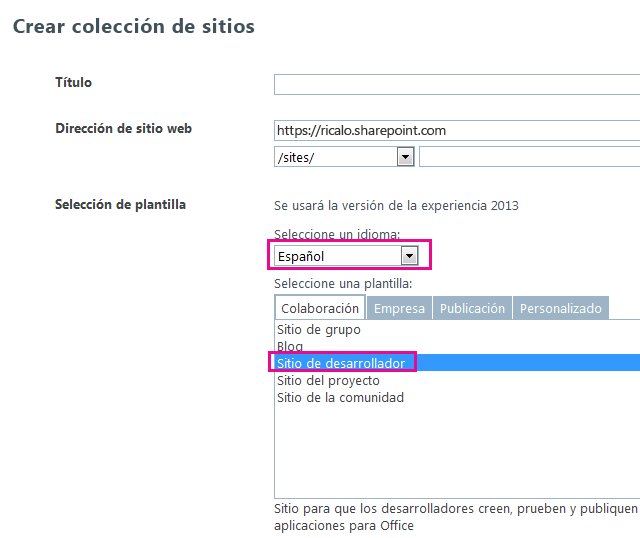

# Localizar complementos para SharePoint
Localice una Complemento de SharePoint usando archivos de recursos, archivos de recursos JavaScript y otras técnicas.
> **NOTA**
> En este tema se supone que está familiarizado con la creación básica de Complementos de SharePoint y con las características de SharePoint, la distinción entre webs de complementos y webs host,  [las clases de componentes de SharePoint que puede haber en un complemento](host-webs-add-in-webs-and-sharepoint-components-in-sharepoint-2013.md#TypesOfSPComponentsInApps) y los fundamentos de la localización con archivos .resx.


## Preparación para localizar un complemento para SharePoint
<a name="Prerequisites"> </a>

Antes de comenzar, identifique lo siguiente:


- Las configuraciones regionales con las que debe ser compatible su complemento. SharePoint Online y SharePoint local con los paquetes de idiomas instalados permiten a los usuarios crear sitios web para un idioma y una cultura específicos. Decida qué sitios web localizados usarán sus clientes y determine con cuáles quiere ser compatible mediante una versión localizada de los componentes de su complemento.


- Los componentes que es necesario localizar en el complemento.


Además, tenga en cuenta lo siguiente:


- Los procedimientos de este artículo asumen que utiliza la versión más reciente de  [Office Developer Tools para Visual Studio 2013](http://aka.ms/OfficeDevToolsForVS2013) u [Office Developer Tools para Visual Studio 2015](http://aka.ms/OfficeDevToolsForVS2015).

    > **NOTA**
      > Si su sitio web de SharePoint de prueba es una granja local de SharePoint y no un sitio de desarrollador de Microsoft SharePoint Online, es posible que tenga que instalar los paquetes de idioma relativos a los idiomas a los que vaya a traducir su Complemento de SharePoint. Para más información, vea  [Instalación o desinstalación de paquetes de idioma para SharePoint 2013](http://technet.microsoft.com/es-es/library/cc262108%28v=office.15%29.aspx) y [Paquetes de idiomas en SharePoint Server 2013](http://technet.microsoft.com/es-es/library/ff463597%28v=office.15%29.aspx), así como los vínculos de descarga de este último. 
- Las capturas de pantalla y los ejemplos de código de este artículo reflejan el ejemplo  [Localización de complementos de SharePoint](https://github.com/OfficeDev/SharePoint-Add-in-Localization). El ejemplo se puede descargar para ver los resultados de los procedimientos descritos en este artículo.


## Localizar los componentes de web de complemento
<a name="LocalizingAppWeb"> </a>

Una web de complemento puede contener tipos determinados de componentes de SP. Para obtener más información sobre los tipos de componentes de SharePoint que puede haber en un complemento para SharePoint, vea  [Tipos de componentes de SharePoint que se pueden encontrar en un complemento para SharePoint](host-webs-add-in-webs-and-sharepoint-components-in-sharepoint-2013.md#TypesOfSPComponentsInApps). Para localizar componentes implementados en una web de complemento, agregue archivos .resx en módulos, en la misma Característica que contiene el componente de web de complemento. Sin embargo, las páginas de sitio personalizadas en una Complemento de SharePoint usan archivos de variable de cadena JavaScript en lugar de archivos .resx, tal y como se describe más adelante en esta sección.


> **NOTA**
> Los archivos de recursos no se pueden compartir entre varias características de web de complemento, sino que, por cada característica que haya en el archivo .wsp, se deben crear conjuntos separados de archivos de recursos. 


### Para crear los archivos de recursos del sitio web de complemento


1. Abra el proyecto de Complemento de SharePoint en Visual Studio (el ejemplo del que se han extraído las capturas de pantalla de este tema consiste en un complemento hospedado por el proveedor con formularios web de ASP.NET como la parte de aplicación web remota del proyecto).


2. En el **Explorador de soluciones**, abra el menú contextual para el nombre de la característica y elija **Agregar archivo de características**.


3. En el cuadro de diálogo **Agregar recursos**, elija **Todos los idiomas (todos los países)** y, después presione el botón **Aceptar**. Se agregará un archivo Resources.resx a la carpeta de características en el **Explorador de soluciones** y se abrirá el archivo en el **Editor de recursos** de Visual Studio.

    Cuando se modifica, este archivo de "todos los idiomas" contiene las cadenas que se van a usar en la galería de **características** en todos los sitios con idiomas para los que *no*  se va a proporcionar una versión localizada de las cadenas. Por lo tanto, el idioma que se va a usar para las cadenas en este archivo debería ser el idioma que tenga más probabilidades de ser el segundo idioma de las personas que usan SharePoint. Para este propósito se suele usar el inglés, pero en algunas situaciones puede que sea mejor usar otro idioma. Por ejemplo, en algunas regiones puede que el francés sea más común como segundo idioma que el inglés. En el siguiente ejemplo de este tema se usa el inglés como opción "todos los idiomas".

    > **NOTA**
      > Una Complemento de SharePoint no se puede instalar en un sitio web cuyo idioma no figure en la sección **Configuraciones regionales admitidas** del manifiesto del complemento. Recuerde que, cuando en este artículo se habla de los idiomas en los que *no*  va a proporcionar un complemento localizado, dichos idiomas deben seguir estando incluidos en el manifiesto del complemento. Vea el procedimiento **Para crear los archivos de recursos del sitio web de host** de este artículo para obtener más detalles sobre las configuraciones regionales admitidas en el manifiesto del complemento.
4. En la columna **Nombre** de la fila superior del **Editor de recursos**, escriba un nombre descriptivo para la cadena (u otro recurso) (por ejemplo, OrdersListInstance_Title uOrdersListInstance_Description). Estos nombres de recursos localizables no están localizados. Cada recurso debe tener su propio nombre.


5. En la columna **Valor**, escriba una cadena adecuada (o dirección URL u otros recursos) para todos los idiomas, por ejemplo, Pedidos yUna lista donde registrar los pedidos.


6. Agregue pares adicionales de nombre y valor para todas las cadenas y recursos que se deben localizar para su uso en cualquier componente de la característica.


7. Guarde el archivo.


8. Agregue otro archivo de recursos a la característica, tal y como hizo anteriormente, pero seleccione un idioma concreto en lugar de **Todos los idiomas (todos los países)**, por ejemplo, **Español (España)**. Un archivo Resources.LL-CC.resx (donde  `LL` y `CC` cumplen con lo dispuesto en los códigos de idioma y referencia cultural [Grupo de trabajo de ingeniería de Internet (IETF)](http://tools.ietf.org/html/rfc1766)) se agrega a la carpeta de la característica en el **Explorador de soluciones** y el archivo se abre en el **Editor de recursos** de Visual Studio.


9. Con el **Editor de recursos**, copie todas las filas de Resources.resx y péguelas en el archivo Resources.LL-CC.resx nuevo (si la opción **Copiar** no está habilitada en el menú contextual del editor de recursos, useCtrl+Cpara copiar las filas en el Portapapeles).


10. En el archivo Resources.LL-CC.resx, sustituya las celdas **Valor** con versiones traducidas de los valores de la cadena. Respecto a las direcciones URL y los recursos que no son de cadenas, sustituya el valor con un valor nuevo que sea adecuado para el idioma y la referencia cultural.


11. Guarde el archivo nuevo.


12. Repita los últimos cuatro pasos para cada idioma extranjero.

    > **NOTA**
      > Considere agregar un archivo específico del idioma para el idioma seleccionado como "todos los idiomas". En tal caso, puede copiar las filas sin cambiar los valores de las cadenas. En muchas situaciones, no es necesario disponer de un archivo específico del idioma para el mismo idioma que se usa en el archivo de recursos de todos los idiomas, especialmente cuando los únicos recursos de los archivos son cadenas. Pero los archivos de recursos también pueden contener imágenes, iconos, archivos y otros tipos de recursos. A veces, necesita el archivo de recursos de todos los idiomas para usar una imagen u otro recurso distinto del recurso correspondiente en  *cualquiera*  de los archivos específicos del idioma.
13. Para cada archivo, compruebe que la propiedad **Acción de compilación** se establece en **Contenido**.


### Para llamar a los recursos localizados en listas personalizadas


1. Para localizar las propiedades título y descripción de una lista personalizada, abra el archivo **Elements.xml** de la instancia de la lista. Por ejemplo, en la muestra que acompaña a este tema, iría a **BookstoreApp** > **Order Status** > **OrderStatusInstance** > **Elements.xml** en el **Explorador de soluciones**.


2. En el atributo **Título**, escriba $Resources: _nombredelaCadena_, donde  _nombredelaCadena_ es el nombre (no el valor) que asignó en el procedimiento anterior a la cadena que determina el nombre de la lista personalizada (por ejemplo,$Resources: OrdersListInstance_Title). Tenga en cuenta que, al contrario de lo que ocurre en algunos contextos en los que se usan archivos .resx, el nombre del archivo de recursos  *no*  forma parte de lo que haya especificado.


3. Use el atributo **Descripción** para llamar del mismo modo al recurso de cadena de la descripción de lista (por ejemplo,$Resources:OrdersListInstance_Description). A continuación se muestra el marcado que usa las cadenas localizadas en el archivo Elements.xml de la instancia de una lista.

 ```XML

<?xml version="1.0" encoding="utf-8"?>
<Elements xmlns="http://schemas.microsoft.com/sharepoint/">
  <ListInstance 
      Title="$Resources:OrdersListInstance_Title" 
      OnQuickLaunch="TRUE" 
      TemplateType="10000" 
      Url="Lists/Orders" 
      Description="$Resources:OrdersListInstance_Description">
  </ListInstance>
</Elements>
 ```


    En la siguiente imagen se muestra la lista personalizada localizada en inglés.


   **Lista personalizada localizada**





### Para localizar los nombres de columna de una lista personalizada


1. Los nombres de columna de la lista personalizada no se pueden localizar del mismo modo que el título o la descripción. Para localizarlos, hay que declarar los campos de la lista en un archivo **Elements.xml** y luego establecer el valor del atributo **DisplayName** con referencias en los archivos de recursos de web de complemento. Para comenzar, abra el archivo **Schema.xml** de su lista personalizada. Localice el nodo - **Fields** y copie todos sus nodos - **Field**.


2. Abra el archivo **Elements.xml** de la lista personalizada. Procure abrir el archivo Elements.xml de la definición de lista, y no el de la instancia de la lista. Pegue los nodos del paso anterior como elementos secundarios del nodo **Elements**.


3. Por cada nodo **Field**, escriba un valor de $Resources: _nombredelaCadena_ en el atributo **DisplayName**, donde  _nombredelaCadena_ es el nombre de una entrada en el archivo de recursos de web de complemento.


4. En el archivo **Schema.xml** de la lista personalizada, quite el atributo **DisplayName** de todos los nodos **Field** copiados anteriormente. A continuación se muestra un marcado de ejemplo en el que se usan las cadenas localizadas en el archivo **Elements.xml** de la definición de lista.

 ```

<?xml version="1.0" encoding="utf-8"?>
<Elements xmlns="http://schemas.microsoft.com/sharepoint/">
    <ListTemplate
        Name="Orders"
        Type="10000"
        BaseType="0"
        OnQuickLaunch="TRUE"
        SecurityBits="11"
        Sequence="410"
        DisplayName="Orders"
        Description="My List Definition"
        Image="/_layouts/15/images/itgen.png"/>
    <Field
        Name="Bookname"
        ID="{2ef60a05-29b6-41db-9611-c0cf7d8e73c5}"
        DisplayName="$Resources:OrdersListColumn_Bookname"
        Type="Text"
        Required="TRUE" />
    <Field
        Name="Price"
        ID="{7af42815-d69e-426a-a1c8-9da5610e362c}"
        DisplayName="$Resources:OrdersListColumn_Price"
        Type="Currency"
        Required="FALSE" />
    <Field
        Name="Orderstatus"
        ID="{687ee751-2e0a-4099-966e-d2c225d48234}"
        DisplayName="$Resources:OrdersListColumn_Orderstatus"
        Type="Lookup"
        Required="FALSE"
        List="Lists/Order status"
        ShowField="Title" />
</Elements>
 ```


### Para crear archivos de recursos de JavaScript destinados a páginas personalizadas


1. Las páginas de sitio personalizadas en una Complemento de SharePoint usan archivos de variable de cadena JavaScript en lugar de archivos .resx.

    Para empezar, en el **Explorador de soluciones**, agregue un nombre de carpeta Scripts al proyecto de complemento para SharePoint (no al proyecto de aplicación web) si no lo hay ya. Haga clic con el botón secundario en la carpeta **Scripts** y elija **Agregar** > **Nuevo elemento** > **Web** > **Archivo JavaScript**. Denomine al archivo Resources. _LL_- _CC_.js (donde  _LL_ es un código de idioma y _CC_ un código de país/región o cultura); por ejemplo,Resources.en-US.js.


2. Repita el paso anterior para cada idioma extranjero. Ahora debería tener archivos JavaScript vacíos para cada idioma.  *No*  cree un archivo de idioma de todos los idiomas denominado "Resources.js". El motivo para no hacerlo se explica en un procedimiento posterior.


3. Abra el primero de los archivos nuevos JavaScript.


4. Para cada una de las cadenas localizables en cada una de las páginas personalizadas, declare una variable en el archivo con un nombre que identifique el propósito de la cadena y asígnele el valor correspondiente para el idioma. Este es un ejemplo del contenido del archivo Resources.en-US.js.

 ```

var instructionstitle = "Instructions:";
var step01 = "Go to any document library in the host web.";
var step02 = "Go to the Library tab.";
var step03 = "Click \\"Request a book\\" in the Settings group.";
var step04 = "Click the contextual menu in any document.";
var step05 = "Click \\"Buy this book\\" in the contextual menu.";
var step06 = "Go to any SharePoint page in the host web and add the" +
    " Bookstore orders add-in part.";
var step07 = "Review the localized <a href=\\"../Lists/Orders\\">Orders</a>" +
    " and <a href=\\"../Lists/Order status\\">Order status</a> custom lists.";

 ```

5. Copie el contenido del archivo en cada uno de los archivos de JavaScript restantes y, a continuación, guarde todos los archivos.


6. En cada uno de los archivos, sustituya el valor de cada variable con un valor nuevo que se corresponda con el idioma del archivo.  *No cambie los nombres de las variables.* 


### Para llamar a las variables localizadas en las páginas ASPX personalizadas


1. En el **Explorador de soluciones**, abra un archivo de página ASPX personalizada.


2. Asegúrese de que solamente se cargue uno de los archivos JavaScript localizados cuando se cargue la página y, asimismo, procure que sea el apropiado para el idioma de la web de complemento de SharePoint. Para lograrlo, agregue el siguiente marcado al elemento **asp:content** de la página que tenga un `ContentPlaceholderId` con el valor `PlaceholderAdditionalPageHead`.  *En el siguiente marcado no hay marcadores. Especifique el marcado exactamente como aparece aquí.* 

 ```HTML

<script type="text/javascript" src="../scripts/Resources.<SharePoint:EncodedLiteral runat='server' text='<%$Resources:wss,language_value%>' EncodeMethod='HtmlEncode' />.js"></script>
 ```


    Con este marcado se carga uno de los archivos JavaScript, que determina qué archivo de idioma se va a cargar al leer el recurso de SharePoint denominado "language_value". Este recurso se resuelve en un nombre de idioma-referencia cultural según el patrón  _LL_- _CC_ descrito en un procedimiento anterior. Específicamente, se resuelve en el idioma de la web de complemento.

    > **NOTA**
      > El recurso de SharePoint "language_value" nunca tiene valor nulo, de modo que este script nunca llamaría a un archivo con el nombre "Resources.js". Esta es la razón por la que no hemos creado uno en el procedimiento anterior. Cuando el valor de "language_value" es un idioma para el que no existe archivo .js, el script no carga nada. En el siguiente paso se explica el modo en que las cadenas obtienen un valor de idioma invariable en una situación así. 
3. Por cada valor de atributo y elemento localizable en la página, asigne un valor predeterminado en el idioma invariable, pero use JavaScript para asignarle la variable adecuada del archivo Resources. _LL_- _CC_.js. Por ejemplo, si la página tiene un título público en un elemento **h2**, asigne al elemento un atributo **id** y, luego, inserte un elemento **script** bajo los elementos localizados para asignar cadenas localizadas a la propiedad **innerText** de los elementos localizados. Este código de localización solo debe ejecutarse si las variables están cargadas y declaradas en un archivo Resources. _LL_- _CC_.js. Por lo tanto, colóquelo en un bloque condicional que compruebe primero si una de las variables está definida. Si no es así, quiere decir que no se ha cargado ningún script de recursos y los valores predeterminados (invariables) deberán permanecer inalterados. El siguiente ejemplo pone esto de manifiesto.

    > **SUGERENCIA**
      > La palabra "INVARIANT" se ha agregado a la primera de las cadenas invariables. Esto no debe realizarse en un complemento de producción, pero, en el transcurso de las pruebas, es una forma muy práctica de saber de un vistazo si se están usando cadenas de idioma invariable o si se ha cargado el archivo Resources. _LL_- _CC_.js del idioma que resulta ser su idioma invariable. 

 ```HTML
  <h2 id="instructionsheading">INVARIANT Instructions</h2>
<ol>
    <li id="step01">Go to any document library in the host web.</li>
    <li id="step02">Go to the Library tab.</li>
    <li id="step03">Click "Request a book" in the Settings group.</li>
    <li id="step04">Click the contextual menu in any document.</li>
    <li id="step05">Click "Buy this book" in the contextual menu.</li>
    <li id="step06">Go to any SharePoint page in the host web and add the Bookstore orders add-in part.</li>
    <li id="step07">Review the localized <a href="../Lists/Orders">Orders</a> and <a href="../Lists/Order status">Order status</a> custom lists.</li>
</ol>

<!-- Use the localized strings in the resource JavaScript file -->
<script type="text/javascript">
    window.onload = function () {
        <!-- Test whether a Resources.LL-CC.js loaded.
             If none was, the invariant values remain unchanged. -->
        if (typeof instructionstitle != 'undefined')
        {
            document.getElementById("instructionsheading").innerText = instructionstitle;
            document.getElementById("step01").innerText = step01;
            document.getElementById("step02").innerText = step02;
            document.getElementById("step03").innerText = step03;
            document.getElementById("step04").innerText = step04;
            document.getElementById("step05").innerText = step05;
            document.getElementById("step06").innerText = step06;
            document.getElementById("step07").innerHTML = step07;
        }
    }
</script>

 ```


    La siguiente imagen es una vista previa de la versión en inglés de la página una vez completado el complemento.


   **Página web que usa cadenas localizadas de un archivo de recursos JavaScript**





## Localizar los componentes de web de host
<a name="LocalizingHostWeb"> </a>

Se puede localizar el título del complemento, que se especifica en el archivo AppManifest.xml. Este título es lo que los usuarios ven en la página **Your Add-ins**. La web de host de una Complemento de SharePoint también puede incluir una acción personalizada, un elemento de complemento o ambos. Tales elementos se implementan en una característica de web de host. Ambos pueden tener cadenas localizables.


El método fundamental para localizar componentes de web de host es el mismo que para localizar componentes de web de complemento: se detallan los recursos localizados en un archivo .resx y se llaman desde los archivos de marcado. Sin embargo, Visual Studio no dispone de mucho soporte de herramientas para los procesos, ya que se aplica a características de web de host. Existe un proceso manual que hay que realizar y que se explicará más adelante en esta sección.


### Para crear los archivos de recursos de la web de host


1. En el **Explorador de soluciones**, elija el archivo AppManifest.xml para abrir la herramienta de diseñador de manifiesto del complemento.


2. Abra la pestaña **Configuraciones regionales admitidas**.


3. En la celda en blanco superior de la columna **Configuraciones regionales**, abra la lista desplegable y elija la primera configuración local que quiera admitir. Se crearán dos archivos, que se agregarán al proyecto de Complemento de SharePoint: Resources.resx (que es el archivo de recursos de todos los idiomas) y Resources. _LL_- _CC_.resx (que contiene los recursos localizados).  *No cambie los nombres de estos archivos.* 


4. Repita el paso anterior por cada configuración regional que quiera admitir con una versión localizada del complemento. Se creará un archivo Resources. _LL_- _CC_.resx extra por cada configuración regional.

    > **NOTA**
      > La propiedad **Acción de compilación** de cada uno de estos archivos se establece en **Contenido**, no en **Recurso**.  *No modifique esta configuración.* 
5. Agregue también entradas de configuración local por cada configuración local donde quiera que el complemento pueda instalarse, pero donde deba usarse el idioma invariable; dicho de otro modo, las configuraciones regionales de las que  *no*  va a proporcionar una versión localizada del complemento. *Elimine los archivos .resx que hay creados para tales configuraciones regionales.* 


6. Abra el archivo Resources.resx y agregue valores y nombres de recurso al archivo de igual modo a como lo hizo con los archivos de recursos de web de complemento. Como mínimo, debe haber un recurso relativo al título de complemento. La característica de web de host no se muestra en ninguna parte de la UI de SharePoint, por lo que no serán necesarias cadenas localizadas para el título ni para la descripción de esta característica de web de host. Si la característica tiene una acción personalizada, se necesita un recurso para el atributo **Title** del elemento **CustomAction** y, probablemente, otras cadenas en el marcado de acción personalizada. Si hay un elemento de complemento, se necesitan recursos para los atributos **Title** y **Description** del elemento **ClientWebPart**. Si el elemento de complemento tiene propiedades personalizadas, cada **Property** tiene un atributo que también hay que localizar. Se necesitará una fila en el archivo de recursos por cada uno de estos elementos.


7. Copie el contenido del archivo Resources.resx en cada uno de los archivos Resources. _LL_- _CC_.resx.


8. Localice cada recurso en cada archivo Resources. _LL_- _CC_ tal y como hizo para los archivos de recursos web de complemento.


### Para llamar a los recursos localizados en el manifiesto del complemento y otros archivos XML


1. Abra el archivo AppManifest.xml y sustituya el valor del elemento **Título** por una llamada a la cadena de recurso apropiada. Por ejemplo, si asignó un nombre a la cadenaTítulodelComplemento, el elemento **Title** debería tener el siguiente aspecto:

 ```XML

<Title>$Resources:Addin_Title;</Title>
 ```


    > **PRECAUCIóN**
      > El valor de **Title** *solo*  puede contener la llamada al recurso. No puede haber más texto, símbolos ni espacios en blanco.
2. Para llamar a los recursos localizados en otros archivos XML (como Elements.xml para elementos de complemento y acciones personalizadas), se usa el mismo formato que el empleado en el archivo de manifiesto del complemento.


## Localizar componentes remotos en un complemento para SharePoint
<a name="LocalizingAutohosted"> </a>

Si los componentes remotos son PHP o tienen cualquier otro formato que no sea de Microsoft, consulte las instrucciones de localización de la plataforma que corresponda. Cuando los componentes remotos son ASP.NET, se localizan igual que se haría con cualquier otra aplicación ASP.NET. Para más información, consulte  [ASP.NET Globalization and Localization](http://msdn.microsoft.com/library/8ef3838e-9d05-4236-9dd0-ceecff9df80d.aspx).


Reemplace el idioma de página y de subproceso de forma que sea el mismo que el de la web de host. Esto se logra invalidando el método **InitializeCulture** heredado en el código subyacente de las páginas ASP.NET. Para saber cuál es el idioma de la web de host, use el parámetro de consulta **SPLanguage** que SharePoint transmite a la página remota. En el siguiente código se indica cómo hacerlo en ASP.NET. En una aplicación web PHP o cualquier otra plataforma, el procedimiento debería ser similar.



```cs
protected override void InitializeCulture()
{
    if (Request.QueryString["SPLanguage"] != null)
    {
        string selectedLanguage = Request.QueryString["SPLanguage"];
    
        // Override the page language.
        UICulture = selectedLanguage;
        Culture = selectedLanguage;

        // Reset the thread language.
        Thread.CurrentThread.CurrentCulture =
            CultureInfo.CreateSpecificCulture(selectedLanguage);
        Thread.CurrentThread.CurrentUICulture = new
            CultureInfo(selectedLanguage);
    }
    base.InitializeCulture();
}
```


## Localizar JavaScript JavaScript remoto y el control de cromo de SharePoint
<a name="JSandChrome"> </a>

Si hay valores de cadena localizables en el código JavaScript de su aplicación web, se pueden localizar usando archivos de recursos de JavaScript. Un ejemplo particularmente reseñable de JavaScript localizable es el  [control de cromo de SharePoint](use-the-client-chrome-control-in-sharepoint-add-ins.md), que sirve para conferir a las páginas remotas la apariencia de las páginas de SharePoint. Emplearemos la localización del control de cromo como ejemplo en esta sección.


> **NOTA**
> En esta sección solo se aborda la localización de cadenas. Si sus necesidades de localización son mayores (por ejemplo, debe localizar formatos de fecha o de moneda), sopese la posibilidad de usar una biblioteca de localización o globalización, como el  [complemento Globalize para jQuery](https://github.com/jquery/globalize). 


### Para localizar el control de cromo


1. Una vez que tenga en funcionamiento el control de cromo, vuelva al método  `renderChrome` donde se definen las opciones de cromo.

 ```

function renderChrome() {
    var options = {
        "appIconUrl": "siteicon.png",
        "appTitle": "My SharePoint add-in", // Localizable string
        "appHelpPageUrl": "Help.html?"
            + document.URL.split("?")[1],
        "onCssLoaded": "chromeLoaded()",
        "settingsLinks": [
            {
                "linkUrl": "Account.html?"
                    + document.URL.split("?")[1],
                "displayName": "Account settings" // Localizable string
            },
            {
                "linkUrl": "Contact.html?"
                    + document.URL.split("?")[1],
                "displayName": "Contact us" // Localizable string
            }
        ]
    };

 ```

2. Como se indica en los comentarios, hay al menos tres cadenas localizables. Sustituya cada una de ellas por un nombre de variable que haya declarado en un paso anterior.

 ```

function renderChrome() {
    var options = {
        "appIconUrl": "siteicon.png",
        "appTitle": chromeAppTitle, // Localized value
        "appHelpPageUrl": "Help.html?"
            + document.URL.split("?")[1],
        "onCssLoaded": "chromeLoaded()",
        "settingsLinks": [
            {
                "linkUrl": "Account.html?"
                    + document.URL.split("?")[1],
                "displayName": chromeAccountLinkName // Localized value
            },
            {
                "linkUrl": "Contact.html?"
                    + document.URL.split("?")[1],
                "displayName": chromeContactUsLinkName // Localized value
            }
        ]
    };

 ```

3. Agregue un archivo JavaScript llamado ChromeStrings.js al proyecto de aplicación web. En él deben estar declaradas las variables que usó en el paso anterior y habérseles asignado un valor en el idioma invariable.

 ```

var chromeAppTitle = "My SharePoint add-in";
var chromeAccountLinkName = "Account settings";
var chromeContactUsLinkName = "Contact us";

 ```

4. Por cada idioma en el que quiera localizar el complemento, agregue otro archivo JavaScript con el nombre ChromeStrings. _LL-CC_.js, donde  _LL-CC_ es el identificador de idioma. *La base del nombre del archivo (esto es, "ChromeStrings") debe ser exactamente la misma que usó en el archivo de idioma invariable.*  Copie el contenido del archivo de idioma invariable en cada uno de los archivos localizados y reemplace los valores por sus versiones traducidas correspondientes.

 ```

var chromeAppTitle = "Mi aplicación SharePoint";
var chromeAccountLinkName = "Preferencias";
var chromeContactUsLinkName = "Contacto";

 ```

5. En cualquier archivo de página donde se llame al script SP.UI.controls.js, agregue una llamada al archivo ChromeStrings.js por encima de este. Por ejemplo, si la llamada a SP.UI.controls.js está cargada como un archivo intermedio llamado ChromeLoader.js, el marcado de la página en este punto debería ser parecido al siguiente:

 ```

<Scripts>
  <asp:ScriptReference Path="Scripts/ChromeStrings.js" />
  <asp:ScriptReference Path="Scripts/ChromeLoader.js" />
</Scripts>
 ```

6. Agregue un atributo **ResourceUICultures** al elemento **ScriptReference** que llama a sus cadenas. Su valor es una lista separada por comas con los idiomas que se admiten.

 ```

<Scripts>
  <asp:ScriptReference Path="Scripts/ChromeStrings.js" ResourceUICultures="en-US,es-ES" />
  <asp:ScriptReference Path="Scripts/ChromeLoader.js" />
</Scripts>
 ```


    El efecto del atributo **ResourceUICultures** es que ASP.NET buscará un archivo llamado ChromeStrings. _LL-CC_.js, donde  _LL-CC_ es el idioma de la página, y lo cargará. Si no lo encuentra, cargará el archivo ChromeStrings.js.


## Comprobar el complemento para SharePoint localizado
<a name="TestingLocalizedApps"> </a>

Compruebe el complemento, implementándolo en un sitio web de SharePoint que esté aprovisionado en uno de los idiomas que el complemento admita. Esta comprobación se puede realizar en un sitio web de SharePoint Online o en un sitio web local.


### Para comprobar el complemento en un sitio web deSharePoint Online


1. Vaya al Centro de administración de Office 365.


2. Elija **configuración del servicio** en el menú de navegación y elija **sitios**.


3. En Colecciones del sitio, elija **Crear colección de sitios**.


4. En **seleccionar un idioma**, seleccione el idioma en el que quiera comprobar el complemento.


5. En **seleccionar una plantilla**, elija **Sitio de desarrollador**.


6. En el proyecto de Complemento de SharePoint, actualice la propiedad **SiteUrl** con la dirección URL de la nueva colección de sitios.


7. Presione F5 para ejecutar el complemento.


**Crear colección de sitios**





### Para comprobar el complemento en un sitio web local


1. Instale el paquete de idioma en el que quiera comprobar el complemento. Para más información, vea  [Instalación o desinstalación de paquetes de idioma para SharePoint 2013](http://technet.microsoft.com/library/cc262108.aspx) y [Paquetes de idiomas en SharePoint Server 2013](http://technet.microsoft.com/es-es/library/ff463597%28v=office.15%29.aspx).


2. Abra Administración central en relación con la granja.


3. En **Administración de aplicaciones**, elija **Crear colecciones de sitios**.


4. En **seleccionar un idioma**, seleccione el idioma en el que quiera comprobar el complemento.


5. En **seleccionar una plantilla**, elija **Sitio de desarrollador**.


6. En el proyecto de Complemento de SharePoint, actualice **SiteUrl** a la dirección URL de la colección de sitios que acaba de crear.


7. Presione F5 para ejecutar el complemento.


## Recursos adicionales
<a name="SP15Localizeapp_addlresources"> </a>


-  [Desarrollar complementos para SharePoint](develop-sharepoint-add-ins.md)


-  [Diseño de una aplicación para Office 2013 Preview para configuraciones regionales específicas](http://msdn.microsoft.com/library/5a1a1cd7-b716-4597-b51f-fa70357d0833%28Office.15%29.aspx)


-  [Globalización y adaptación en ASP.NET](http://msdn.microsoft.com/library/8ef3838e-9d05-4236-9dd0-ceecff9df80d.aspx)


-  [Localización de complementos de SharePoint](https://github.com/OfficeDev/SharePoint-Add-in-Localization)


