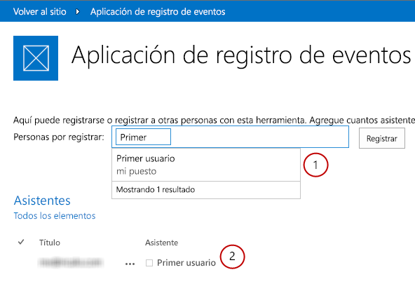
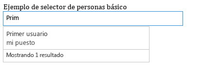
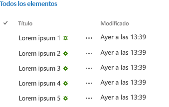

# Introducción a Office Web Widgets: Experimental
Obtenga información sobre los Office Web Widgets: Experimental que puede usar en Complementos de Office, Complementos de SharePoint y en sitios web.
> **PRECAUCIóN**
> Los Office Web Widgets: Experimental solo se proporcionan para investigación y comentarios. No se deben usar en escenarios de producción. El comportamiento de Office Web Widgets puede cambiar significativamente en futuras versiones. Lea y revise los  [Términos de licencia de Office Web Widgets: Experimental](office-web-widgetsexperimental-license-terms.md). 

Los controles de cliente, como Office Web Widgets: Experimental, pueden reducir notablemente la cantidad de tiempo necesario para compilar complementos y, al mismo tiempo, aumentar la calidad de estos. Para que esto suceda, debemos asegurarnos de que los widgets cumplan ciertos criterios:
- Los widgets deben diseñarse para usarse en cualquier página web aunque no esté hospedada en SharePoint.

- Los widgets funcionan dentro del tiempo de ejecución de los controles de Office. Esto nos permite proporcionar un conjunto común de requisitos y una sintaxis coherente para usar los widgets.

- Los widgets que se comunican con SharePoint usan la biblioteca entre dominios. Los widgets no tienen una dependencia en ninguna plataforma o tecnología concreta del lado servidor. Puede usar los widgets independientemente de la tecnología de servidor que elija.

- Los widgets deben coexistir con otros elementos en la página. La inclusión del widget en una página no debería modificar los otros elementos.

- Use bien los marcos existentes. Queremos asegurarnos de que pueda seguir usando las herramientas y tecnologías a las que está acostumbrado.

**Figura 1. Un complemento que usa Office Web Widgets: Experimental**

Puede usar los widgets al instalar el paquete de NuGet **Office Web Widgets: Experimental** desde Visual Studio. Para más información, vea [Administrar los paquetes NuGet desde el cuadro de diálogo](http://docs.nuget.org/docs/start-here/managing-nuget-packages-using-the-dialog). También puede visitar la  [página de la galería NuGet](http://www.nuget.org/packages/Microsoft.Office.WebWidgets.Experimental/).Sus comentarios nos han ayudado a decidir qué widgets debíamos ofrecer. Como puede ver en la figura 1, los widgets Selector de personas (1) y Vista de lista de escritorio (2) se pueden probar y explorar. Siga enviando sus comentarios al  [sitio Office Developer Platform UserVoice](http://officespdev.uservoice.com/)También puede ver los widgets en acción en el ejemplo de código de la  [demostración de Office Web Widgets: Experimental](http://code.msdn.microsoft.com/SharePoint-2013-Office-Web-6d44aa9e).
## Widget Selector de personas

Puede usar el widget experimental Selector de personas en los complementos para ayudar a los usuarios a buscar y seleccionar personas y grupos en un inquilino. Los usuarios empiezan a escribir en el cuadro de texto y el widget recupera a las personas cuyo nombre o correo electrónico coincida con el texto.

**Figura 2. Widget Selector de personas resolviendo una consulta**

Se puede declarar el widget en el formato HTML o mediante programación usando JavaScript. En cualquier caso, se usa un elemento **div** como marcador de posición para el widget. También puede establecer las propiedades y los controladores de eventos del widget Selector de personas. En la tabla siguiente se muestran las propiedades y los eventos disponibles en el widget Selector de personas.

|**Propiedad o evento**|**Tipo**|**Descripción**|
|:-----|:-----|:-----|
|**objectType**   |Objeto JSON (lista de cadenas)    | Tipo de elementos que resolverá el widget. Opciones:    Usuario    Grupo    El valor predeterminado es solo el usuario.   |
|**allowMultipleSelections**   |Booleano    |True o False. Si es False, el widget debe permitir seleccionar solo un elemento cada vez.           Valor predeterminado = False.    |
|**rootGroupName**   |cadena    |Si se proporciona, el widget limitará la selección a los elementos de este grupo.           Si no, el widget consultará los objetos de todo el arrendamiento.    |
|**selectedItems**   |Matriz JSON    |Lista de los elementos seleccionados. Cada elemento devolverá un objeto que representa a un usuario o grupo.    |
|**onAdded**   |Función    |Evento que se desencadena cuando se agrega un nuevo objeto a la selección. La función del controlador recibe el objeto agregado.    |
|**onRemoved**   |Función    |Evento que se desencadena cuando se quita un nuevo objeto a la selección. La función del controlador recibe el objeto eliminado.    |
|**onChange**   |Función    |Este evento se desencadena al agregar o quitar objetos. No se pasan parámetros a la función del controlador.    |
|**validationErrors**   |Matriz    | Matriz de posibles errores de validación:    empty    unresolvedItem    tooManyItems   |
|**autoShowValidationMessage**   |Booleano    |True = Mostrar          False = No mostrar    |
|**hasErrors**   |Booleano    |True = Hay uno o más errores de validación          False = No hay ningún error de validación    |
|**errors**   |Matriz    | Matriz de posibles errores de validación:    empty    unresolvedItem    tooManyItems   |
|**displayErrors**   |Booleano    |True = Mostrar los errores          False = No mostrar los errores    |
 
Las clases CSS del widget Selector de personas se definen en la hoja de estilos **Office.Controls.css**. Puede invalidar las clases y adaptar el estilo del widget a su complemento.

Para obtener más información, vea  [Procedimiento para usar el widget experimental Selector de personas en aplicaciones para SharePoint](use-the-experimental-people-picker-widget-in-sharepoint-add-ins.md) y el ejemplo de código [Usar el widget experimental Selector de personas en un complemento](http://code.msdn.microsoft.com/SharePoint-2013-Use-the-57859f85). 

## Widget Vista de lista de escritorio

Los usuarios pueden aprovechar el widget Vista de lista para mostrar los datos de una lista como se hace con el widget Vista de lista normal, pero aquel se puede usar en los complementos que no están hospedados necesariamente en SharePoint.

**Figura 3. Widget Vista de lista de escritorio que muestra los datos de una lista**

Puede especificar una vista existente en la lista y el widget representa los campos en el orden en que aparecen en la vista.

> **NOTA**
> Actualmente, el widget Vista de lista de escritorio solo muestra los datos. No ofrece capacidades de edición. 

Puede proporcionar un marcador de posición para el widget con un elemento **div**. El widget se puede usar con declaración o con programación.

También puede establecer las propiedades o los controladores de eventos para el widget Vista de lista de escritorio. En la tabla siguiente se recogen las propiedades y los eventos disponibles en el widget Vista de lista de escritorio.

|**Propiedad o evento**|**Tipo**|**Descripción**|
|:-----|:-----|:-----|
|**listUrl**   |Dirección URL    |Dirección URL de la vista de lista de la que se van a extraer los elementos. Puede ser una dirección URL relativa, y en este caso se supone que está en la web del propio complemento, o una dirección URL absoluta.    |
|**viewName**   |cadena    |Nombre de la vista para mostrar. Este es el nombre programático de la vista (no su nombre para mostrar).    |
|**onItemSelected**   |Función    |Evento que se desencadena cuando se selecciona un elemento en la lista.    |
|**onItemAdded**   |Función    |Evento que se desencadena cuando se agrega un nuevo elemento a la lista.    |
|**onItemRemoved**   |Función    |Evento que se desencadena cuando se quita un elemento de la lista.    |
|**selectedItems**   |Matriz    |Lista de elementos seleccionados en formato JSON.    |
 
El widget requiere la hoja de estilos del sitio web de SharePoint. Se puede hacer referencia a la hoja de estilos de SharePoint directamente o usar el widget de Chrome. Para obtener más información sobre la hoja de estilos, vea  [Usar una hoja de estilos del sitio web de SharePoint en complementos de SharePoint](use-a-sharepoint-website-s-style-sheet-in-sharepoint-add-ins.md) y [Usar el control cromo de cliente en complementos de SharePoint](use-the-client-chrome-control-in-sharepoint-add-ins.md). 

Para ver el widget Vista de lista en acción, vea el ejemplo de código  [Usar el widget experimental Vista de lista de escritorio en un complemento](http://code.msdn.microsoft.com/SharePoint-2013-Use-the-c3edb076). También puede ver  [Usar el widget experimental Vista de lista de escritorio en complementos para SharePoint](use-the-experimental-desktop-list-view-widget-in-sharepoint-add-ins.md).

## Conclusión

Los widgets pueden ayudar a acelerar el proceso de desarrollo y reducir el coste y el tiempo de salida al mercado de sus complementos. Office Web Widgets: Experimental ofrece widgets que puede usar en complementos ajenos a la producción. Esperamos sus comentarios en el  [sitio Office Developer Platform UserVoice](http://officespdev.uservoice.com/).

## Recursos adicionales

-  [Términos de licencia de Office Web Widgets: Experimental](office-web-widgetsexperimental-license-terms.md)

-  [Página de la galería NuGet de Office Web Widgets: Experimental](http://www.nuget.org/packages/Microsoft.Office.WebWidgets.Experimental/)

-  [Procedimiento para usar el widget experimental Selector de personas en aplicaciones para SharePoint](use-the-experimental-people-picker-widget-in-sharepoint-add-ins.md)

-  [Ejemplo de código: Demostración de Office Web Widgets, Experimental](http://code.msdn.microsoft.com/SharePoint-2013-Office-Web-6d44aa9e)

-  [Usar el widget experimental Vista de lista de escritorio en complementos para SharePoint](use-the-experimental-desktop-list-view-widget-in-sharepoint-add-ins.md)

-  [Ejemplo de código: Usar el widget experimental Selector de personas en un complemento](http://code.msdn.microsoft.com/SharePoint-2013-Use-the-57859f85)

-  [Ejemplo de código: Usar el widget experimental Vista de lista de escritorio en un complemento](http://code.msdn.microsoft.com/SharePoint-2013-Use-the-c3edb076)

