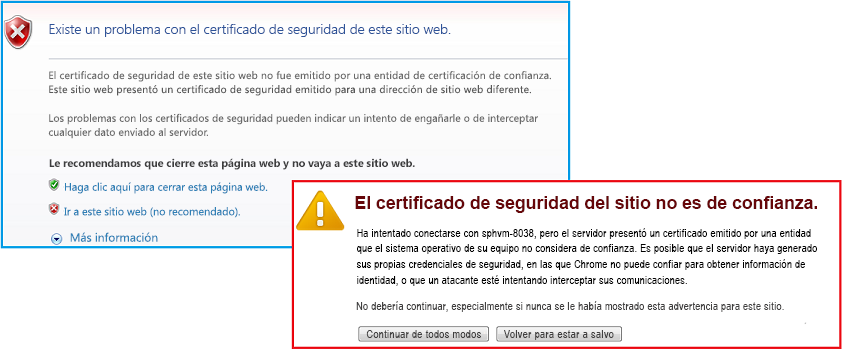

# Empaquetar y publicar complementos de gran confianza para SharePoint
Aprenda a empaquetar y publicar una Complemento de SharePoint de gran confianza para un uso local.
## Requisitos previos para empaquetar y publicar complementos de gran confianza
<a name="Prereqs"> </a>

Necesita lo siguiente:
  
    
    

- Un entorno de desarrollo de SharePoint 2013 local. Vea  [Configurar un entorno de desarrollo en el nivel local para complementos para SharePoint](set-up-an-on-premises-development-environment-for-sharepoint-add-ins.md) para consultar las instrucciones de instalación.
    
  
- Un servidor web de IIS para hospedar la aplicación web remota. Se debe instalar el Administrador de IIS.
    
  
- Visual Studio instalado remotamente o en el equipo donde ha instalado SharePoint 2013.
    
  
- Microsoft Office Developer Tools para Visual Studio
    
  
-  [Web Deploy](http://www.iis.net/downloads/microsoft/web-deploy) instalada en el equipo de Visual Studio, y la misma versión de **Web Deploy** instalada en el servidor de la aplicación web remota.
    
  
En la Tabla 1 se enumeran algunos artículos que resultan útiles a la hora de abordar los conceptos relativos a la creación de Complementos de SharePoint.
  
    
    

**Tabla 1. Conceptos básicos para publicar complementos de elevada confianza**


|**Título del artículo**|**Descripción**|
|:-----|:-----|
| [Empezar a crear complementos hospedados en proveedor para SharePoint](get-started-creating-provider-hosted-sharepoint-add-ins.md) <br/> |Aprenda a crear una Complemento de SharePoint básica hospedada en proveedor con Office Developer Tools para Visual Studio.  <br/> |
| [Crear complementos de SharePoint de elevada confianza](create-high-trust-sharepoint-add-ins.md) <br/> |Aprenda a crear una Complemento de SharePoint básica de elevada confianza con la Office Developer Tools para Visual Studio usando un certificado autofirmado y un identificador de emisor asociado.  <br/> |
| [Web Deploy](http://www.iis.net/downloads/microsoft/web-deploy) <br/> |Web Deploy simplifica la implementación de aplicaciones web y sitios web en servidores IIS.  <br/> |
| [Digital Certificates](http://msdn.microsoft.com/library/e523b335-0156-4f47-b55c-b80495587c4f.aspx) y [Working with Certificates](http://msdn.microsoft.com/library/6ffb8682-8f07-4a45-afbb-8d2487e9dbc3.aspx) <br/> |Obtenga información acerca de las ideas básicas de los certificados digitales.  <br/> |
   

> **NOTA**
> Las Complementos de SharePoint de elevada confianza solo se pueden instalar en SharePoint local, no en Microsoft SharePoint Online, y están pensadas principalmente para ser utilizadas con una aplicación web local más que basada en la nube. Este artículo explica cómo publicar el complemento en ese escenario. Además, en este artículo 'cliente' hace referencia a la empresa que instala las Complemento de SharePoint y hospeda los componentes remotos del complemento. 
  
    
    


## Registrar el complemento de elevada confianza
<a name="Register"> </a>

Antes de poder publicar el complemento, debe estar registrado con el servicio de administración de complementos de granjas de SharePoint. Las Complementos de SharePoint de elevada confianza siempre están registradas en la granja de SharePoint en la que se instalará el complemento (no se pueden vender a través de la Tienda Office). El registro se realiza en la página http:// _Sitio_web_ SharePoint_/_layouts/15/appregnew.aspx tal como se describe en el siguiente procedimiento.
  
    
    

### Para registrar el complemento


1. Navegue hasta la página http:// _Sitio_web_ SharePoint_/_layouts/15/appregnew.aspx. Elija los botones **Generar** para generar valores para el identificador y el secreto del complemento (el secreto realmente no se usa en Complementos de SharePoint de elevada confianza, pero el formulario requiere uno). Proporcione la dirección URL de base del dominio donde se ejecutará el complemento web remoto. No incluya el protocolo (HTTPS) en el dominio, pero debe incluir el puerto que usarán los componentes remotos para solicitudes HTTPS si no es 443 (por ejemplo,www.contoso.com:5555 oMyAppServer:4444).
    
    Si necesita un URI de redireccionamiento, escriba el valor correspondiente. Consulte  [Flujo de código de autenticación de OAuth para aplicaciones en SharePoint](authorization-code-oauth-flow-for-sharepoint-add-ins.md) para informarse sobre cómo usar el URI de redireccionamiento.
    
    El formulario de la página debe ser similar a la Figura 1. En este ejemplo, el servidor de aplicaciones web remotas está escuchando las solicitudes HTTPS en el puerto 443 predeterminado. Por lo tanto, no es necesario especificar el puerto en el dominio de complemento.
    

   **Figura 1. Registrar el complemento en appregnew.aspx**

  

!\[Registrar aplicación en appregnew.aspx](images/SP15_RegisterApp.png)
  

  

  
2. Elija **Crear**. La información que escribió relativa al complemento se mostrará en la página siguiente. Asegúrese de que esta información esté disponible porque la necesitará al usar las herramientas de publicación de Visual Studio. Considere la posibilidad de tomar una captura de pantalla rápida a la página.
    
  

## Elegir una estrategia para obtener, mantener e implementar certificados para Complementos de SharePoint de elevada confianza.
<a name="Certificate"> </a>

Cuando un desarrollador está usando **F5** en Visual Studio para desarrollar y depurar una Complemento de SharePoint de elevada confianza, el desarrollador puede usar un certificado autofirmado, tal como se describe en [Crear complementos de SharePoint de elevada confianza](create-high-trust-sharepoint-add-ins.md). Sin embargo, cuando se  *publica*  el complemento, el uso de un certificado autofirmado hace que el explorador muestre una página de advertencia antes de abrir la página de inicio de la aplicación web remota. El usuario debe elegir si continuará. La Figura 3 muestra ejemplos de estas advertencias.
  
    
    

**Figura 3. Advertencias para certificados autofirmados**

  
    
    

  
    
    

  
    
    
Esta molestia puede ser aceptable para un desarrollador, pero sería inaceptable para los clientes. Por lo tanto, antes de la publicación final en un entorno de producción, el cliente debe obtener un certificado firmado por un tercero de confianza. El tercero puede ser una entidad de certificación (CA) comercial o una entidad de certificación local. En lo que respecta a entidades de certificación comerciales, tenga en cuenta que la industria está retirando progresivamente los certificados de "solo intranet" para servidores web. Aún se pueden adquirir, pero todos estos certificados expirarán en noviembre de 2016, o antes. No es necesario tener este tipo de certificado para una Complemento de SharePoint de elevada confianza, porque los certificados que se pueden usar para servidores web con conexión a Internet también se pueden usar para servidores web de intranet, pero lo último suele ser más costoso.
  
    
    
El certificado debe estar en dos formatos, Intercambio de información personal (*.pfx) y Certificado de seguridad (cer). Si no está en ninguno de estos formatos cuando se obtiene originalmente, el cliente puede convertirlo con una utilidad. Además, una vez que se ha obtenido una versión con formato pfx, es posible importar el archivo pfx en IIS y luego exportar la versión cer tal como se describe más adelante.
  
    
    
Si el certificado que se obtiene originalmente está en formato cer, contendrá las claves privadas y públicas. Como procedimiento general, el archivo .cer que SharePoint usa no debe contener la clave privada. Considere la posibilidad de importar el certificado original en IIS y luego exportar una nueva versión cer que no incluya la clave privada tal como se describe más adelante. Para obtener más información sobre archivos .pfx y .cer, consulte  [Certificado de publicadores de software](http://msdn.microsoft.com/es-es/library/windows/hardware/ff552299%28v=vs.85%29.aspx).
  
    
    
Además, el cliente debe considerar si usará un solo certificado para todas las Complementos de SharePoint de elevada confianza o certificados separados para cada una. Para obtener más información sobre esta decisión, consulte  [Decidir entre usar uno o varios certificados para las Complementos de SharePoint de elevada confianza](creating-sharepoint-add-ins-that-use-high-trust-authorization.md#Deciding).
  
    
    

## Configurar el servidor web remoto con el certificado
<a name="ConfigureRemote"> </a>

Los siguientes procedimientos se realizan en el servidor web remoto que hospeda a la aplicación web remota.
  
    
    

### Para configurar el certificado pfx y el servidor web remoto


1. Use una contraseña segura para el certificado .pfx. Para obtener más información, consulte  [Directrices para crear contraseñas seguras](http://msdn.microsoft.com/es-es/library/bb416446.aspx) y [Contraseñas seguras](http://msdn.microsoft.com/es-es/library/ms161962.aspx).
    
  
2. Importe el certificado en IIS en el servidor web remoto con estos pasos:
    
1. En el Administrador de IIS, seleccione el nodo  _NombreServidor_ en la vista de árbol de la izquierda.
    
  
2. Haga doble clic en el icono **Certificados de servidor**.
    
  
3. Seleccione **Importar** en el panel **Acciones** de la derecha.
    
  
4. En el cuadro de diálogo **Importar certificado**, use el botón Examinar para ir al archivo .pfx y luego escriba la contraseña del certificado.
    
  
5. Si está usando el Administrador de IIS 8, existe una opción desplegable **Seleccionar almacén de certificados**. Elija **Personal**. (Esto hace referencia al almacenamiento de certificados "personales" del equipo, no el usuario).
    
  
6. Si no tiene ya una versión cer, o sí la tiene pero incluye la clave privada, habilite **Permitir la exportación de este certificado**.
    
  
7. Haga clic en **Aceptar**.
    
  

### Para abrir el Almacén de certificados de Windows


1. En el mismo servidor, abra la **Microsoft Management Console** tal como se describe en [Abrir MMC 3.0](http://technet.microsoft.com/es-es/library/cc766121.aspx).
    
  
2. Agregue el complemento **Certificados** para la cuenta del equipo tal como se describe en [Agregar el complemento Certificados a MMC ](http://technet.microsoft.com/es-es/library/cc754431.aspx). Asegúrese de usar el procedimiento para el  *equipo*  , no un usuario o servicio. Elija el equipo *local*  , no "otro" equipo, cuando se le solicite.
    
  
Omita el siguiente procedimiento si está usando el Administrador de ISS 8.
  
    
    

### Pasos adicionales para el Administrador de ISS 7 para obtener el certificado en el Almacén de certificados de Windows


1. Cree una carpeta en el sistema de archivos del servidor que se usará como un lugar de almacenamiento muy temporal para el certificado.
    
  
2. En el Administrador de IIS, seleccione el nodo  _NombreServidor_ en la vista de árbol de la izquierda.
    
  
3. Haga doble clic en el icono **Certificados de servidor**.
    
  
4. En la lista **Certificados de servidor**, haga clic con el botón secundario en el certificado y luego seleccione **Exportar**, como se muestra en la Figura 4.
    
   **Figura 4. Exportar un certificado**

  

!\[Exportar un certificado de prueba](images/997021de-c60c-46b0-961f-7e1e63c0f619.gif)
  

  

  
5. Exporte el archivo en la carpeta que creó y escriba su contraseña.
    
  
6. En la **Microsoft Management Console**, importe el certificado tal como se describe en  [Importar un certificado ](http://technet.microsoft.com/es-es/library/cc754489.aspx). Asegúrese de especificar el almacén **Personal**.
    
  
7. Deje la consola abierta para el siguiente procedimiento.
    
  
8.  *Elimine la carpeta que creó en el primer paso y el archivo de certificado allí.*  Las ventajas en cuanto a seguridad de conservar el certificado en el almacén de certificados no son tales si también está en el sistema de archivos.
    
  
El siguiente procedimiento se aplica al Administrador de IIS 7 y 8.
  
    
    

### Para obtener el número de serie del certificado


1. En la **Microsoft Management Console**, navegue hasta la carpeta **Certificados** dentro de la carpeta **Personal** del complemento **Certificados (equipo local)**, si no está abierta ya.
    
  
2. Haga doble clic en el certificado para su Complemento de SharePoint para abrirla y, a continuación, abra la pestaña **Detalles**.
    
  
3. Seleccione el campo **Número de serie** para que el número de serie completo esté visible en el cuadro.
    
  
4. Copie el número de serie,  *sin espacios*  , en un archivo de texto y entrégueselo al desarrollador de la Complemento de SharePoint.
    
    > **SUGERENCIA**
      > Algunas preguntas en foros y entradas en blogs de desarrolladores indican que copiar el número de serie directamente en el portapapeles crea una cadena con caracteres ocultos, lo que hace que el número de serie sea irreconocible para el código en la Complemento de SharePoint. Considere la posibilidad de escribir manualmente el número en vez de copiarlo. 
A continuación, se crea una versión cer del certificado. Contiene la clave pública del servidor web remoto, y SharePoint la usa para descifrar las solicitudes de la aplicación web remota y validar los tokens de acceso en dichas solicitudes. Se crea en el servidor web remoto y, a continuación, se mueve a la granja de SharePoint.
  
    
    

### Para crear el certificado cer


1. En el Administrador de IIS, seleccione el nodo  _NombreServidor_ en la vista de árbol de la izquierda.
    
  
2. Haga doble clic en **Certificados de servidor**.
    
  
3. En la vista **Certificados de servidor**, haga doble clic en el certificado para mostrar los detalles del certificado.
    
  
4. En la pestaña **Detalles**, elija **Copiar a archivo** para iniciar el **Asistente para exportación de certificados** y luego elija **Siguiente**.
    
  
5. Use el valor predeterminado **No exportar la clave privada** y luego elija **Siguiente**.
    
  
6. Use los valores predeterminados en la página siguiente. Elija **Siguiente**.
    
  
7. Elija **Examinar** y vaya a cualquier carpeta. (El archivo cer se moverá del equipo de todas maneras). Use el mismo nombre que el archivo pfx y, a continuación, elija **Guardar**. El certificado se guarda como archivo .cer.
    
  
8. Elija **Siguiente**.
    
  
9. Elija **Finalizar**.
    
  

## Configurar SharePoint para usar el certificado
<a name="ConfigureSP"> </a>

Los procedimientos descritos en esta sección pueden realizarse en cualquier servidor de SharePoint en el que está instalado el **Shell de administración de SharePoint**.
  
    
    

### Para distribuir el archivo cer en SharePoint


1. Cree una carpeta y asegúrese de que las identidades del grupo de complementos para los siguientes grupos de complementos de IIS tengan derecho de lectura a la carpeta:
    
  - **SecurityTokenServiceApplicationPool**
    
  
  - El grupo de complementos que ofrece el sitio web de IIS que hospeda la aplicación web primaria de SharePoint para el sitio web de prueba de SharePoint. Para el sito web de IIS de **SharePoint - 80**, el grupo se llama **OServerPortalAppPool**.
    
  
2.  *Mueva*  (no copie simplemente) el archivo .cer del servidor web remoto a la carpeta que ha creado en el servidor de SharePoint. El archivo estará en esta carpeta solo temporalmente.
    
  
El siguiente procedimiento configura el certificado como emisor de token de confianza en SharePoint. Se realiza una sola vez (para cada Complemento de SharePoint de elevada confianza).
  
    
    

### Para configurar el certificado


1. Si no lo ha hecho ya, cree los scripts de Windows PowerShell configuración de elevada confianza que necesita, como se describe en  [Scripts de configuración de elevada confianza para SharePoint 2013](high-trust-configuration-scripts-for-sharepoint-2013.md).
    
  
2. Copie los scripts en el servidor de SharePoint.
    
  
3. Abra el **Shell de administración de SharePoint** como administrador y ejecute los scripts correspondientes.
    
  
4. Uno de los scripts está pensado para ser usado cuando el cliente está compartiendo un solo certificado entre varias Complementos de SharePoint. Ese script da como resultado un archivo que contiene el GUID para el emisor de token. Si usa ese script, proporcione el archivo que da como resultado al desarrollador de la Complemento de SharePoint de elevada confianza.
    
  
5.  *Elimine el archivo cer del sistema de archivos del servidor de SharePoint.* 
    
  

> **NOTA**
> El registro del certificado como emisor de tokens no surte efecto inmediatamente y el complemento no funcionará hasta que surta efecto. Pueden pasar 24 horas antes de que todos los servidores de SharePoint reconozcan al nuevo emisor de tokens. Ejecute un iisreset en todos los servidores de SharePoint para que reconozcan inmediatamente al emisor (si puede hacerlo sin interrumpir a los usuarios de SharePoint). 
  
    
    


## Modificar el archivo web.config
<a name="WebConfig"> </a>


> **SUGERENCIA**
> Para un ejemplo de código que incluye un web.config modificado, consulte [PnP / Samples / Core.OnPrem.S2S.WindowsCertStore](https://github.com/OfficeDev/PnP/tree/dev/Samples/Core.OnPrem.S2S.WindowsCertStore).. 
  
    
    

Edite el archivo web.config para que contenga los valores nuevos para las siguientes claves en el nodo  `appSettings`:
  
    
    

- **ClientID:** Es el identificador (GUID) del cliente de la aplicación web que se generó en appregnew.aspx.
    
  
- **ClientSigningCertificateSerialNumber:** *(Deberá agregar esta clave, si Microsoft Office Developer Tools para Visual Studio no la agregó).*  Es el número de serie del certificado. No debe tener espacios ni guiones en el valor.
    
  
- **IssuerId:** Es el GUID del emisor de token ( *que debe estar en minúscula*  ). Su valor depende de la estrategia de certificado del cliente:
    
  - Si la Complemento de SharePoint de elevada confianza tiene su propio certificado que no está compartiendo con otras Complementos de SharePoint, el  `IssuerId` es el mismo que el `ClientId`.
    
  
  - Si el Complemento de SharePoint está compartiendo el mismo certificado que otras Complementos de SharePoint están usando, el  `IssuerId` es un GUID arbitrario. El script para este escenario que puede encontrar en [Scripts de configuración de elevada confianza para SharePoint 2013](high-trust-configuration-scripts-for-sharepoint-2013.md) genera un archivo de texto con este GUID allí. El personal de TI puede pasar el archivo de resultado al desarrollador del complemento para que lo inserte como `IssuerId` en el archivo web.config.
    
  

> **NOTA**
> Office Developer Tools para Visual Studio puede haber agregado claves de configuración de complementos para **ClientSigningCertificatePath** y **ClientSigningCertificatePassword**. No se usan en un complemento de producción y deben eliminarse. 
  
    
    

Lo siguiente es un ejemplo. Observe que no existe clave **ClientSecret** para una Complemento de SharePoint de elevada confianza.
  
    
    



```XML

<appSettings>
  <add key="ClientID" value="c1c12d4c-4900-43c2-8b89-c05725e0ba30" />
  <add key="ClientSigningCertificateSerialNumber" value="556a1c9c5a5415994941abd0ef2f947b" />
  <add key="IssuerId" value="f94591d5-89e3-47cd-972d-f1895cc158c6" />
</appSettings>

```


## Modificar el archivo TokenHelper
<a name="WebConfig"> </a>

Es necesario modificar el archivo TokenHelper.cs (o .vb) generado por Office Developer Tools para Visual Studio para que funcione con el certificado almacenado en el Almacén de certificados de Windows y para que lo recupere según el número de serie. El siguiente ejemplo muestra una forma de hacer esto. El ejemplo usa C#.
  
    
    

> **SUGERENCIA**
> Para un ejemplo de código que incluye un tokenhelper.cs modificado, consulte [PnP / Samples / Core.OnPrem.S2S.WindowsCertStore](https://github.com/OfficeDev/PnP/tree/dev/Samples/Core.OnPrem.S2S.WindowsCertStore).. 
  
    
    


### Para modificar el TokenHelper


1. Cerca de la zona inferior de la parte  `#region private fields` del archivo, se encuentran las declaraciones para `ClientSigningCertificatePath`,  `ClientSigningCertificatePassword` y `ClientCertificate`. Quite las tres.
    
  
2. En su lugar, agregue la siguiente línea:
    
 ```
  
private static readonly string ClientSigningCertificateSerialNumber
    = WebConfigurationManager.AppSettings.Get("ClientSigningCertificateSerialNumber");
 ```

3. Busque la línea que declara el campo  `SigningCredentials`. Reemplácela con la siguiente línea:
    
 ```
  
private static readonly X509SigningCredentials SigningCredentials
    = GetSigningCredentials(GetCertificateFromStore());
 ```

4. Vaya a la parte  `#region private methods` del archivo y agregue los siguientes dos métodos:
    
 ```
  
private static X509SigningCredentials GetSigningCredentials(X509Certificate2 cert)
{
    return (cert == null) ? null 
                          : new X509SigningCredentials(cert, 
                                                       SecurityAlgorithms.RsaSha256Signature, 
                                                       SecurityAlgorithms.Sha256Digest);
}

private static X509Certificate2 GetCertificateFromStore()
{
    if (string.IsNullOrEmpty(ClientSigningCertificateSerialNumber))
    {
        return null;
    }  

    // Get the machine's personal store
    X509Certificate2 storedCert;
    X509Store store = new X509Store(StoreName.My, StoreLocation.LocalMachine); 

    try
    {
        // Open for read-only access                 
        store.Open(OpenFlags.ReadOnly);

        // Find the cert
        storedCert = store.Certificates.Find(X509FindType.FindBySerialNumber, 
                                             ClientSigningCertificateSerialNumber, 
                                             true)
                       .OfType<X509Certificate2>().SingleOrDefault();
    }
    finally
    {
        store.Close();
    }

    return storedCert;
}
 ```


## Usar los asistentes Visual Studio para empaquetar la aplicación web remota y Complemento de SharePoint para publicarla
<a name="Package"> </a>


> **SUGERENCIA**
> Microsoft actualiza Visual Studio y Office Developer Tools para Visual Studio con mucha más frecuencia que antes, y no siempre es posible actualizar la documentación para reflejar los cambios. Esta sección fue escrita con la versión de Visual Studio publicada en octubre de 2013, y la versión de Office Developer Tools para Visual Studio que se incluía allí. Si está trabajando con una versión anterior o posterior de Visual Studio o las herramientas, es posible que necesite consultar la ayuda de Visual Studio y publicaciones de blog para encontrar las formas equivalentes de realizar los pasos de estos procedimientos. 
  
    
    


### Para empaquetar la aplicación web remota


1. En el **Explorador de soluciones**, haga clic con el botón secundario en el proyecto de la aplicación web (no el proyecto de Complemento de SharePoint), y seleccione **Publicar**.
    
  
2. En la pestaña **Perfil**, seleccione **Nuevo perfil** en la lista desplegable.
    
  
3. Cuando se le solicite, use un nombre adecuado para el perfil. Por ejemplo, Nómina SP complemento - Aplicación web remota.
    
  
4. En la pestaña **Conexión**, seleccione **Paquete de Web Deploy** en la lista desplegable del método **Publicación**.
    
  
5. Para **Ubicación del paquete**, use cualquier carpeta. Para simplificar procedimientos posteriores, debe ser una carpeta vacía. Generalmente se usa la subcarpeta de la carpeta bin del proyecto.
    
  
6. Para el nombre del sitio, escriba el nombre del sitio web de IIS que hospedará a la aplicación web. No incluya protocol, port ni barras en el nombre. Por ejemplo: "SitioNómina". Si desea que la aplicación web sea un elemento secundario del sitio web predeterminado, use Sitio web predeterminado _/<nombre del sitio web>_. Por ejemplo: "Sitio web predeterminado/SitioNómina". (Si el sitio web de IIS no existe ya, se crea cuando usted ejecuta el paquete de Web Deploy en un procedimiento posterior).
    
  
7. Haga clic en **Siguiente**.
    
  
8. En la pestaña **Configuración**, seleccione **Liberar** o **Depurar** en la opción desplegable **Configuración**.
    
  
9. Haga clic en **Siguiente** y, a continuación, haga clic en **Publicar**. En la ubicación del paquete, se crean un archivo zip y varios archivos más que se usarán para instalar la aplicación web en un procedimiento posterior.
    
  

### Para crear un paquete de Complemento de SharePoint


1. Haga clic con el botón secundario en el proyecto de Complemento de SharePoint en su solución y luego elija **Publicar**.
    
  
2. En la opción desplegable **Perfil actual**, seleccione el perfil que creó en el último procedimiento.
    
  
3. Si aparece un símbolo de advertencia pequeño y de color amarillo junto al botón **Editar**, haga clic en el botón **Editar**. Se abre un formulario que solicita la misma información que incluyó en el archivo web.config. Esta información no es obligatoria ya que está usando el método de publicación **Paquete de Web Deploy**, pero no puede dejar el formulario en blanco. Escriba los caracteres en los cuatro cuadros de texto y haga clic en **Finalizar**.
    
  
4. Haga clic en el botón **Empaquetar el complemento** (no haga clic en **Implemente su proyecto web**. Este botón simplemente repite lo que hizo en el paso final del último procedimiento). Se abre un formulario **Empaquetar la aplicación**.
    
  
5. En el cuadro de texto **¿Dónde está hospedado el sitio web?**, escriba la dirección URL del dominio de la aplicación web remota. Debe incluir el protocolo, HTTPS y, si el puerto en que la aplicación web escuchará solicitudes HTTPS no es 443, debe incluir el puerto también. Por ejemplo: https://MyServer:4444 (este es el valor que Office Developer Tools para Visual Studio usa para reemplazar el token ~remoteAppUrl en el manifiesto del complemento para Complemento de SharePoint.)
    
  
6. En el cuadro de texto **¿Cuál es el identificador del cliente del complemento?**, escriba el identificador del cliente que se generó en la página appregnew.aspx, y que también escribió en el archivo web.config.
    
  
7. Haga clic en **Finalizar**. Se crea el paquete del complemento.
    
  

## Publicar la aplicación web remota e instalar la Complemento de SharePoint
<a name="PublishRemote"> </a>


  
    
    

### Para publicar la aplicación web


1. Navegue hasta la carpeta que usó como **Ubicación del paquete** cuando empaquetó la aplicación web remota, y luego copie todos los archivos allí a una carpeta del servidor remoto.
    
  
2. En esta carpeta, abra el archivo  _nombre_proyecto_.deploy-readme.txt (donde  _nombre_proyecto_ es el nombre del proyecto de la aplicación web de Visual Studio), y siga las instrucciones del archivo para instalar la aplicación web con el archivo _nombre_proyecto_.deploy.cmd.
    
  

### Para configurar el enlace de protocolo para la aplicación web


1. En el Administrador de IIS, resalte el nuevo sitio web en el panel **Conexiones**. (Si la nueva aplicación web es un elemento secundario del **Sitio web predeterminado**, resalte el **Sitio web predeterminado** y realice este procedimiento para el **Sitio web predeterminado**.)
    
  
2. Haga clic en **Enlaces** en el panel **Acciones**.
    
  
3. Haga clic en **Agregar** en el cuadro de diálogo **Enlaces de sitios**. En el cuadro de diálogo **Agregar enlace de sitio** que se abre, realice los pasos siguientes.
    
1. Seleccione **HTTPS** en la lista desplegable **Tipo**.
    
  
2. Seleccione **Todas las no asignadas** en la lista desplegable **Dirección IP**.
    
  
3. Escriba el puerto en el cuadro de texto **Puerto**. Si especificó un puerto en el dominio del complemento cuando registró la Complemento de SharePoint en appregnew.aspx (tal como se describe en  [Registrar el complemento de elevada confianza](#Register)), debe usar el mismo número aquí. Si no especificó un puerto en appregnew, use 443 aquí.
    
  
4. En la lista desplegable **Certificado SSL**, seleccione el certificado que usó para configurar el servidor en  [Configurar el servidor web remoto con el certificado](#ConfigureRemote) más arriba.
    
  
5. Haga clic en **Aceptar**.
    
  
4. Haga clic en **Cerrar**.
    
  

### Para configurar la autenticación para la aplicación web


1. Cuando se instala una nueva aplicación en IIS, está configurada inicialmente para acceso anónimo, pero casi todas las Complemento de SharePoint de elevada confianza están diseñadas para requerir autenticación de usuarios, por lo que necesita cambiarla. En el Administrador de IIS, resalte la aplicación web en el panel **Conexiones**. Será un sitio web del mismo nivel que el sitio web predeterminado o un elemento secundario del sitio web predeterminado.
    
  
2. Haga doble clic en el icono **Autenticación** en el panel central para abrir el panel **Autenticación**.
    
  
3. Resalte **Autenticación anónima** y, a continuación, haga clic en **Deshabilitar** en el panel **Acciones**.
    
  
4. Resalte el sistema de autenticación en el que la aplicación web está diseñada para usar y haga clic en **Habilitar** en el panel **Acciones**.
    
    Si el código de la aplicación web usa el código generado en los archivos TokenHelper y SharePointContext sin modificaciones a las partes de autenticación del usuario de los archivos, la aplicación web está usando **Autenticación de Windows**, de modo que es la opción que debe habilitar.
    
  
5. Si está usando los archivos de código generado sin modificaciones a las partes de autenticación del usuario de los archivos, también debe configurar el proveedor de autenticación con los siguientes pasos:
    
1. Resalte ** Autenticación de Windows** en el panel **Autenticación**.
    
  
2. Haga clic en **Proveedores**.
    
  
3. En el cuadro de diálogo **Proveedores**, asegúrese de que **NTLM** aparezca *encima de* **Negociar**.
    
  
4. Haga clic en **Aceptar**.
    
  

### Para cargar e instalar la Complemento de SharePoint


1. Cargue el archivo de paquete *.app de la Complemento de SharePoint en el catálogo de complementos de la organización (las Complementos de SharePoint de elevada confianza no se pueden distribuir mediante la Tienda Office.) Para obtener más información, consulte  [Agregar complementos al Catálogo de complementos ](http://technet.microsoft.com/es-es/library/fp161234.aspx#AddApps).
    
  
2. Instale el complemento en cualquier sitio web dentro de la misma aplicación web de SharePoint primaria que contenga el catálogo de complementos. Para obtener más información sobre la carga e instalación de Complemento de SharePoint, consulte  [Agregar complementos para SharePoint a un sitio de SharePoint 2013](http://technet.microsoft.com/es-es/library/fp161231).
    
  

## Recursos adicionales
<a name="bk_addresources"> </a>


-  [Crear complementos de SharePoint de elevada confianza](create-high-trust-sharepoint-add-ins.md)
    
  
-  [Publicar complementos para SharePoint con Visual Studio](publish-sharepoint-add-ins-by-using-visual-studio.md)
    
  
-  [Registrar complementos de SharePoint 2013](register-sharepoint-add-ins-2013.md)
    
  
-  [Empezar a crear complementos hospedados en proveedor para SharePoint](get-started-creating-provider-hosted-sharepoint-add-ins.md)
    
  

