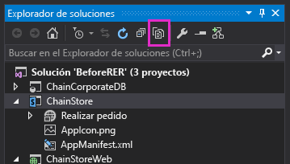

# Implementar mediante programación un botón personalizado en el complemento hospedado por el proveedor
Aprenda a registrar mediante programación un botón personalizado de la cinta de opciones con una lista personalizada en el mismo Complemento de SharePoint hospedado por el proveedor.
Este es el noveno de una serie de artículos sobre los conceptos básicos de desarrollo de Complementos de SharePoint hospedados por el proveedor. Primero debe familiarizarse con los  [Complementos de SharePoint](sharepoint-add-ins.md) y con los anteriores artículos de esta serie:
  
    
    


-  [Empezar a crear complementos hospedados en proveedor para SharePoint](get-started-creating-provider-hosted-sharepoint-add-ins.md)
    
  
-  [Dar al complemento hospedado por el proveedor la apariencia de SharePoint](give-your-provider-hosted-add-in-the-sharepoint-look-and-feel.md)
    
  
-  [Incluir un botón personalizado en el complemento hospedado por el proveedor](include-a-custom-button-in-the-provider-hosted-add-in.md)
    
  
-  [Obtener una introducción rápida al modelo de objetos de SharePoint](get-a-quick-overview-of-the-sharepoint-object-model.md)
    
  
-  [Agregar operaciones de escritura de SharePoint al complemento hospedado por el proveedor](add-sharepoint-write-operations-to-the-provider-hosted-add-in.md)
    
  
-  [Incluir un elemento de complemento en el complemento hospedado por el proveedor](include-an-add-in-part-in-the-provider-hosted-add-in.md)
    
  
-  [Controlar eventos de complemento en el complemento hospedado por el proveedor](handle-add-in-events-in-the-provider-hosted-add-in.md)
    
  
-  [Agregar lógica de la primera vista al complemento hospedado por el proveedor](add-first-run-logic-to-the-provider-hosted-add-in.md)
    
  

> **NOTA**
> Si ha estado trabajando en esta serie sobre complementos hospedados por el proveedor, ya tiene una solución de Visual Studio que puede usar para continuar con este tema. También puede descargar el repositorio en  [SharePoint_Provider-hosted_Add-Ins_Tutorials](https://github.com/OfficeDev/SharePoint_Provider-hosted_Add-ins_Tutorials) y abrir el archivo BeforeProgrammaticButton.sln.
  
    
    

En este artículo aprenderá a incluir un botón personalizado de cinta de opciones en un Complemento de SharePoint cuando la lista cuya cinta de opciones obtiene el botón se implementa mediante programación en el mismo complemento.
## Volver a agregar el botón personalizado al proyecto


> **NOTA**
>  La configuración de los Proyectos de inicio en Visual Studio tiende a volver a los valores predeterminados cuando se vuelve a abrir la solución. Siempre siga estos pasos inmediatamente después de volver a abrir la solución de ejemplo en esta serie de artículos:>  Haga clic con el botón derecho en el nodo de solución en la parte superior del **Explorador de soluciones** y seleccione **Establecer proyectos de inicio**. >  Asegúrese de que los tres proyectos estén establecidos en **Iniciar** en la columna **Acción**. 
  
    
    

En el artículo anterior se quitó del proyecto el botón personalizado **AddEmployeeToCorpDB** de la cinta de opciones. Agréguelo nuevamente con estos pasos.
  
    
    

1. En el **Explorador de soluciones**, presione el botón **Mostrar todos los archivos** en la barra de herramientas pequeña de la parte superior del **Explorador de soluciones**.
    
     
  

  

  
2. En el proyecto **ChainStore**, haga clic con el botón derecho en **AddEmployeeToCorpDB** y seleccione **Incluir en el proyecto**.
    
  
3. Presione nuevamente el botón **Mostrar todos los archivos**.
    
  
4. En el proyecto **ChainStore**, expanda **AddEmployeeToCorpDB** y abra el archivo elements.xml.
    
  

## Comprender un dilema y su solución

En el archivo elements.xml, el atributo **RegistrationId** del elemento **CustomAction** identifica la lista en cuya cinta de opciones se agrega el botón: `{$ListId:Lists/Local Employees;}`. Esto funcionaba bien cuando la lista ya se había agregado a la web de host manualmente. Pero ahora que estamos implementando la lista mediante programación en la lógica de la primera vista, la lista no existe cuando SharePoint instala el complemento e intenta volver a implementar el botón. Se producen una excepción y un error en la instalación del complemento.
  
    
    
Implementar la lista en el controlador de eventos de la instalación, en lugar de la lógica de la primera vista, no resolverá el dilema porque SharePoint implementa componentes personalizados definidos descriptivamente, como el botón personalizado (y el elemento de complemento **Realizar pedido**),  *antes*  de ejecutar el controlador personalizado, por lo que la lista no existirá cuando intente implementar el botón.
  
    
    
Crear un botón personalizado completamente mediante programación no es práctico por razones que son demasiado avanzadas para este artículo. Afortunadamente, no es necesario. Existe una forma relativamente sencilla para crear mediante semiprogramación un botón personalizado y asignarlo a una lista personalizada. Los siguientes son los pasos básicos:
  
    
    

1. Mantenga el botón definido descriptivamente en el proyecto, pero asígnelo a la cinta de opciones de algo que siempre exista en los sitios de SharePoint, en lugar de a una lista que se implementa mediante programación con el mismo complemento. 
    
  
2. En la lógica de la primera vista, una vez creada la lista mediante programación, agregue mediante programación un botón sin definir a la cinta de opciones de la lista.
    
  
3. Inicialice las propiedades del nuevo botón con los valores del botón original. En este punto, existen dos botones idénticos. El segundo de ellos se asigna a la cinta de opciones de la lista **Empleados locales**.
    
  
4. Elimine mediante programación el botón original.
    
  

## Registrar mediante programación el botón personalizado

A continuación se muestra cómo implementar esta estrategia.
  
    
    

1. En el proyecto **ChainStore**, expanda **AddEmployeeToCorpDB**, abra el archivo elements.xml y cambie el valor del atributo **RegistrationId** del elemento **CustomAction** a "100". Este es el identificador de un tipo de lista. Aunque no haya ninguna instancia de listas de este tipo en el sitio web, el *tipo*  de lista está en cada sitio web de SharePoint. El atributo ahora debería ser similar al siguiente.
    
  ```XML
  
RegistrationId="100"
  ```

2. En el archivo SharePointComponentDeployer.cs, agregue la siguiente línea al método  `DeployChainStoreComponentsToHostWeb`, justo debajo de la línea que llama a  `CreateLocalEmployeesList`. Este método se creará en el paso siguiente.
    
  ```cs
  ChangeCustomActionRegistration();
  ```

3. Agregue el siguiente método a la clase  `SharePointComponentDeployer`. Tenga en cuenta lo siguiente sobre este código:
    
  - Dado que la acción personalizada (es decir, el botón personalizado) se registró con la cinta de opciones de un  *tipo*  de lista, se aplica a todo el sitio web y se encuentra en la colección del sitio web de acciones personalizadas. Por lo tanto, el código lo recupera de esa colección.
    
  
  - El valor del  `action.Name` proviene del atributo **ID** del elemento **CustomAction** en el archivo element.xml en **AddEmployeeToCorpDB**.
    
    > **IMPORTANTE**
      > **Debe cambiar el valor  `action.Name` en el código siguiente para que coincida con el valor en el archivo elements.xml.** La parte del GUID del nombre será diferente. Tenga en cuenta que hay un carácter "." entre el GUID y el resto del nombre. El siguiente es un ejemplo de la línea.>  `where action.Name == "4a926a42-3577-4e02-9d06-fef78586b1bc.AddEmployeeToCorpDB"`

  ```cs
  private static void ChangeCustomActionRegistration()
{
    using (var clientContext = sPContext.CreateUserClientContextForSPHost())
    {
         var query = from action in clientContext.Web.UserCustomActions
                     where action.Name == "{button_GUID} .AddEmployeeToCorpDB"
                     select action;
          IEnumerable<UserCustomAction> matchingActions = clientContext.LoadQuery(query);	       
	         clientContext.ExecuteQuery();
	
          UserCustomAction webScopedEmployeeAction = matchingActions.Single();

         // TODO8: Get a reference to the (empty) collection of custom actions 
         // that are registered with the custom list.

         // TODO9: Add a blank custom action to the list's collection.

         // TODO10: Copy property values from the descriptively deployed
         // custom action to the new custom action

        // TODO11: Delete the original custom action.         

          clientContext.ExecuteQuery();
    }
}
  ```

4. Reemplace  `TODO8` por el código siguiente.
    
    Tenga en cuenta que al retirar un complemento, no se quitan los componentes que creó el complemento. Una vez que se ejecuta la lógica de la primera vista, hay una acción personalizada en la colección **UserCustomActions** de la lista y no se retira la próxima vez que presione F5. Para evitar confusiones, la última línea de este código `listActions.Clear();` vacía la colección.
    


  ```cs
  
var queryForList = from list in clientContext.Web.Lists
                   where list.Title == "Local Employees"
                   select list;
IEnumerable<List> matchingLists = clientContext.LoadQuery(queryForList);
clientContext.ExecuteQuery();

List employeeList = matchingLists.First();
var listActions = employeeList.UserCustomActions;
clientContext.Load(listActions);
listActions.Clear();
  ```

5. Reemplace  `TODO9` por la línea siguiente, que agrega una acción personalizada sin definir a la lista **Empleados locales**.
    
  ```cs
  
var listScopedEmployeeAction = listActions.Add();
  ```

6. Reemplace  `TODO10` por el código siguiente. Tenga en cuenta lo siguiente sobre este código:
    
  - Asigna los valores de propiedad del botón de ámbito web (que se implementó con marcado descriptivo) a las propiedades correspondientes del botón de ámbito de la lista, por lo que los dos botones son idénticos excepto en el ámbito.
    
  
  - La propiedad **Sequence** especifica el orden relativo en que el botón aparecerá en su área de la cinta de opciones. En este caso, el botón se encuentra en la sección **Acciones** de la ficha **Elementos** de la cinta de opciones. En el marcado descriptivo este valor se estableció en 10001, que es lo suficientemente elevado como para garantizar que aparecerá después (es decir, a la derecha) de los botones en la caja que SharePoint coloca en la sección **Acciones** de la cinta de opciones.
    
  

  ```cs
  listScopedEmployeeAction.Title = webScopedEmployeeAction.Title;
listScopedEmployeeAction.Location = webScopedEmployeeAction.Location;
listScopedEmployeeAction.Sequence = webScopedEmployeeAction.Sequence;
listScopedEmployeeAction.CommandUIExtension = webScopedEmployeeAction.CommandUIExtension;
listScopedEmployeeAction.Update();
  ```

7. Reemplace  `TODO11` por la línea siguiente, que elimina el botón definido descriptivamente original. Si no tuviéramos esta línea, todas las listas en el sitio web que usan la plantilla de lista "100" tendrían el botón personalizado allí. Dado que la funcionalidad del botón está estrechamente vinculada a la lista **Empleados locales**, no tendría sentido que el botón estuviera en otra lista. Además, sin esta línea, el botón aparecería  *dos veces*  en la lista **Empleados locales**, porque esa lista usa la plantilla "100". 
    
  ```cs
  
webScopedEmployeeAction.DeleteObject();
  ```


    El método completo ahora debería ser similar al siguiente (pero debería haber un GUID en lugar del marcador de posición).
    


  ```cs
  private static void ChangeCustomActionRegistration()
{
    using (var clientContext = SPContext.CreateUserClientContextForSPHost())
    {
         var query = from action in clientContext.Web.UserCustomActions
                     where action.Name == "{button_GUID} .AddEmployeeToCorpDB"
                     select action;
          IEnumerable<UserCustomAction> matchingActions = clientContext.LoadQuery(query);	       
	         clientContext.ExecuteQuery();
	
          UserCustomAction webScopedEmployeeAction = matchingActions.Single();

         var queryForList = from list in clientContext.Web.Lists
                            where list.Title == "Local Employees"
                            select list;
         IEnumerable<List> matchingLists = clientContext.LoadQuery(queryForList);
         clientContext.ExecuteQuery();

        List employeeList = matchingLists.First();
        var listActions = employeeList.UserCustomActions;
        clientContext.Load(listActions);
        listActions.Clear();

        var listScopedEmployeeAction = listActions.Add();

        listScopedEmployeeAction.Title = webScopedEmployeeAction.Title;
        listScopedEmployeeAction.Location = webScopedEmployeeAction.Location;
        listScopedEmployeeAction.Sequence = webScopedEmployeeAction.Sequence;
        listScopedEmployeeAction.CommandUIExtension = webScopedEmployeeAction.CommandUIExtension;
        listScopedEmployeeAction.Update();

        webScopedEmployeeAction.DeleteObject();         

        clientContext.ExecuteQuery();
    }
}
  ```


## Solicitar control total de la web de host

Dado que el complemento ahora está agregando y eliminando acciones personalizadas de ámbito web, necesitamos elevar los permisos que el complemento solicita de Administrar a Control total. Siga estos pasos.
  
    
    

1. En el **Explorador de soluciones**, abra el archivo AppManifest.xml en el proyecto **ChainStore**. 
    
  
2. Abra la ficha **Permisos**. Deje el valor **Ámbito** en **Web**, pero en el campo **Permiso** de la lista desplegable, seleccione **Control total**.
    
  
3. Guarde el archivo.
    
  

## Ejecutar el complemento y probar la implementación de botones


  
    
    

1. Abra la página **Contenido del sitio** del sitio web de la tienda de Hong Kong *y quite la lista **Empleados locales**.* 
    
    > **NOTA**
      > Retirar un complemento en Visual Studio no quita las listas que creó el complemento, por lo que debe eliminarlo manualmente cada vez se está probando código que lo crea. 
2. Use la tecla F5 para implementar y ejecutar el complemento. Visual Studio hospeda la aplicación web remota en IIS Express y hospeda la base de datos SQL en un SQL Express. También hace una instalación temporal del complemento en su sitio de SharePoint de prueba y ejecuta inmediatamente el complemento. Deberá conceder permisos para el complemento antes de que se abra la página de inicio.
    
  
3. Cuando se abra la página de inicio del complemento, seleccione el vínculo **Volver al sitio** en el control de cromo de la parte superior.
    
  
4. Vaya a la página **Contenido del sitio**. La lista **Empleados locales** está presente porque la lógica de la primera vista la agregó.
    
    > **NOTA**
      > Si la lista no existe o usted tiene otras indicaciones de que no se ejecuta el código de la primera vista, es posible que la tabla **Inquilinos** no se esté revirtiendo a un estado vacío al presionar F5. La causa más común de esto es que el proyecto **ChainCorporateDB** ya no está establecido como proyecto de inicio en Visual Studio. Consulte la nota cerca de la parte superior de este artículo sobre cómo solucionar este problema. Además, asegúrese de que se haya configurado la base de datos para que se recompile como se describe en [Configurar Visual Studio para recompilar la base de datos corporativa con cada sesión de depuración](give-your-provider-hosted-add-in-the-sharepoint-look-and-feel.md#Rebuild). 
5. Abra la lista y agregue un elemento.
    
  
6. En la vista de lista, seleccione el elemento y abra la ficha **Elementos** en la cinta de opciones. El botón **Agregar a BD corporativa** se encuentra en la cinta de opciones.
    
  
7. Haga clic en el botón para agregar el empleado a la base de datos corporativa y para cambiar el campo **Agregado a BD corporativa** a **Sí**.
    
  
8. Regrese a la página **Contenido del sitio** y seleccione **agregar un complemento**.
    
  
9. Agregue una nueva **Lista personalizada**. De forma predeterminada, será de tipo "Genérica". (Genérica es el tipo de lista 100). Después de crear la lista, abra la ficha **Elementos** en la cinta de opciones. Observe que el botón **Agregar a BD corporativa** *no*  se encuentra en la cinta de opciones. Esto se debe a que el código elimina el botón de ámbito web.
    
  
10. Para terminar la sesión de depuración, cierre la ventana del explorador o detenga la depuración en Visual Studio. Cada vez que presione F5, Visual Studio retirará la versión anterior del complemento e instalará la más reciente.
    
  
11. Trabajará con este complemento y con la solución de Visual Studio en otros artículos, y se considera recomendable retirar el complemento una última vez cuando acabe de trabajar en él durante un tiempo. En el proyecto, haga clic con el botón derecho en el **Explorador de soluciones** y elija **Retirar**.
    
  

## 
<a name="Nextsteps"> </a>

 Los eventos en listas y elementos de lista también pueden tener controladores personalizados en SharePoint. Aprenda a crear uno e implementarlo en la lógica de la primera vista con el siguiente artículo: [Controlar eventos de elemento de lista en el complemento hospedado por el proveedor](handle-list-item-events-in-the-provider-hosted-add-in.md)
  
    
    

