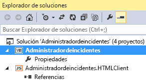

# Publicar un complemento empresarial de nube en SharePoint
Puede publicar su complemento empresarial de nube como complemento de SharePoint hospedada por el proveedor. Un complemento hospedado por el proveedor le ofrece la flexibilidad de implementar la aplicación y la base de datos web a un sitio de SharePoint local, a Microsoft Azure o a un sitio de hospedaje de terceros. Después de publicar el complemento, otros usuarios pueden ejecutarlo desde SharePoint en sus equipos y dispositivos móviles.Puede publicar su complemento directamente en un sitio mediante WebDeploy, o puede crear un paquete para el complemento que se puede implementar en varios servidores.
## Para publicar un complemento

1. En el **Explorador de soluciones**, abra el menú contextual para el nodo de aplicación de nivel superior, como se muestra en la Figura 1 y, a continuación, elija **Publicar**.
    
   **Figura 1. El nodo de nivel superior**

  

     
  

  

  
2. En el Asistente para publicación de aplicaciones de LightSwitch, en la página **Opciones de SharePoint**, elija el botón de opción **Hospedado por el proveedor** y, a continuación, elija **Siguiente**.
    
  
3. En la página **Configuración del servidor de aplicación**, elija el botón de opción **Servidor IIS** y, a continuación, elija **Siguiente**.
    
    > [!NOTA]
      > Si tiene un archivo de configuración de publicación (.publishsettings o .pubxml) que fue creado para otro complemento, puede usar dicho archivo para proporcionar el resto de la información necesaria para la publicación. Si es así, elija el el botón **Configuración de importación** en el asistente.
4. En la página **Publicar salida**, elija el botón de opción **Publicar directamente en un servidor ahora** y, a continuación, elija **Siguiente**.
    
  
5. En la página **Configuración de publicación**, en el cuadro de texto **Dirección URL del servicio**, escriba la dirección URL para el servidor donde desea publicar el complemento.
    
    Si está publicando en una empresa de hospedaje, la empresa proporciona este valor. Puede estar en cualquiera de los siguientes formatos:
    
  -  _URLEmpresaHospedaje_ (por ejemplo, `contoso.com`)
    
  
  -  `https://` _URLEmpresaHospedaje_ (por ejemplo, `https://contoso.com`)
    
  
  -  `https://` _URLEmpresaHospedaje_ `:8172/msdeploy.axd` (por ejemplo, `https://contoso.com:8172/msdeploy.axd`)
    
  

    Si está publicando en Internet Information Services (IIS) en su propio equipo para realizar pruebas, escriba  `localhost` o el nombre de su equipo.
    
    Si está publicando en un servidor en su propia red, escriba una de estas direcciones URL:
    
  -  `http://` _NombreServidor_
    
  
  -  `http://` _NombreServidor_ `/msdeployagentservice`
    
  

    > [!NOTA]
      > Si está publicando a través de un servidor de seguridad, tendrá que abrir el puerto 8172. 
6. En el cuadro de texto **Sitio/aplicación**, escriba los nombres del sitio web IIS y su complemento.
    
    Si está publicando en una empresa de hospedaje, la empresa proporciona este valor. Generalmente, es un nombre de dominio (por ejemplo,  `contoso.com`) o el nombre de un dominio y de un complemento (por ejemplo,  `contoso.com/MyApp`).
    
    Si está publicando en IIS en su equipo propio para realizar pruebas, o si está publicando en un servidor en su red interna, escriba el nombre del sitio y del complemento como aparecen en el Administrador de IIS. Por ejemplo, si el complemento MiAplicación se está publicando en el sitio web predeterminado en IIS, escriba Sitio web predeterminado/MiAplicación.
    
    > [!NOTA]
      > Si está publicando en una carpeta web existente y desea quitar todo el contenido, active la casilla **Quitar archivos adicionales en destino**. 
7. En los cuadros de texto **Nombre de usuario** y **Contraseña**, escriba las credenciales para una cuenta que tenga suficiente autoridad para realizar tareas de implementación el servidor web de destino y, a continuación, elija **Siguiente**.
    
    Si está publicando en una empresa de hospedaje, la empresa proporciona estos valores.
    
  
8. En la página **Configuración de seguridad**, elija el botón de opción **Sí, los usuarios deben conectarse mediante HTTPS** y, a continuación, elija **Siguiente**.
    
  
9. En la página **Conexiones de datos**, en la pestaña **Conexiones de base de datos**, escriba las cadenas de conexión del usuario y del administrador para el servidor de base de datos donde desea publicar la base de datos de su complemento.
    
    > [!NOTA]
      > La base de datos no tiene que estar ubicada en el servidor donde va a publicar el complemento. 
10. En la pestaña **Orígenes de datos adjuntos**, actualice las cadenas de conexión para conexiones adicionales según sea necesario y, a continuación, elija **Siguiente**.
    
  
11. En la página **Host del proveedor**, en el cuadro de texto **¿Dónde se hospeda la aplicación LightSwitch?**, escriba la dirección URL completa para el complemento.
    
    En la mayoría de los casos, esta dirección URL será la misma que los valores **Dirección URL del servicio** y **Sitio/aplicación** que escribió anteriormente (por ejemplo, `https://contoso.com/MyApplication`).
    
  
12. Escriba los valores **ID de cliente** y **Cliente secreto** para su complemento.
    
    Puede obtener estos valores de la página **appregnew** de su sitio de SharePoint o del Panel de vendedores. Consulte [Instrucciones para registrar complementos de SharePoint 2013](http://msdn.microsoft.com/es-es/library/office/jj687469%28v=office.15%29.aspx).
    
  
13. Elija **Publicar** para publicar el complemento.
    
    Al publicar el complemento, se abre el **Explorador de archivos** y aparece el directorio **Publicar** para el proyecto.
    
  

## Para empaquetar un complemento

1. En el **Explorador de soluciones**, abra el menú contextual para el nodo de aplicación de nivel superior, como se muestra en la Figura 1 y, a continuación, elija **Publicar**.
    
   **Figura 1. El nodo de nivel superior**

  

     
  

    
    
  
2. En el Asistente para publicación de aplicaciones de LightSwitch, en la página **Opciones de SharePoint**, elija el botón de opción **Hospedado por el proveedor** y, a continuación, elija **Siguiente**.
    
  
3. En la página **Configuración del servidor de aplicación**, elija el botón de opción **Servidor IIS** y, a continuación, elija **Siguiente**.
    
    > [!NOTA]
      > Si tiene un archivo de configuración de publicación (.publishsettings o .pubxml) que fue creado para otro complemento, puede usar dicho archivo para proporcionar el resto de la información necesaria para la publicación. Si es así, elija el el botón **Configuración de importación** en el asistente.
4. En la página **Publicar salida**, elija el botón de opción **Crear un paquete en un disco** y, a continuación, elija **Siguiente**.
    
  
5. En la página **Configuración de publicación**, en el cuadro de texto **¿Cuál debe ser el nombre del sitio web?**, escriba un nombre para el sitio web.
    
    El nombre predeterminado es el nombre del complemento.
    
  
6. En el cuadro de texto **¿Dónde se debe crear el paquete?**, escriba la ruta de acceso para la ubicación en la que desea publicar la salida y, a continuación, elija **Siguiente**.
    
    La ubicación predeterminada es el subdirectorio Publicar en el directorio del proyecto.
    
  
7. En la página **Configuración de seguridad**, elija el botón de opción **Sí, los usuarios deben conectarse mediante HTTPS** y, a continuación, elija **Siguiente**.
    
  
8. En la página **Configuración de base de datos**, elija el botón de opción **Genere una nueva base de datos cuyo nombre sea** y escriba el nombre de su complemento como nombre de la base de datos.
    
  
9. Elija la pestaña **Orígenes de datos adjuntos** y actualice las cadenas de conexión para conexiones adicionales según sea necesario y, a continuación, elija **Siguiente**.
    
  
10. En la página **Host del proveedor**, en el cuadro de texto **¿Dónde se hospeda la aplicación LightSwitch?**, escriba la dirección URL completa del complemento.
    
    En la mayoría de los casos, esta dirección URL será la misma que los valores **Dirección URL del servicio** y **Sitio/aplicación** que escribió anteriormente (por ejemplo, `https://contoso.com/MyApplication`).
    
  
11. Escriba los valores **ID de cliente** y **Cliente secreto** del complemento.
    
    Puede obtener estos valores de la página **appregnew** de su sitio de SharePoint o desde el Panel de vendedores. Consulte [Instrucciones para registrar complementos de SharePoint 2013](http://msdn.microsoft.com/es-es/library/office/jj687469%28v=office.15%29.aspx).
    
  
12. Elija **Publicar** para publicar el complemento.
    
    Cuando se publica el complemento, se coloca un archivo .zip que contiene el paquete en el directorio que especificó en el paso 4. Después de crear este paquete, un administrador del servidor puede utilizar la herramienta MSDeploy para implementar su complemento en servidores que ejecutan IIS y SQL Server.
    
  

## Recursos adicionales

-  [Registrar complementos de SharePoint 2013](register-sharepoint-add-ins-2013.md)
    
  
-  [Publicación de complementos empresariales de nube](publish-cloud-business-add-ins.md)
    
  

