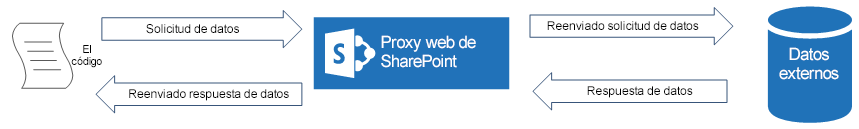

# Consultar un servicio remoto mediante el proxy web en SharePoint 2013
Aprenda cómo obtener acceso a datos en un dominio remoto desde una página hospedada en SharePoint 2013 con el proxy web.
Normalmente, al compilar Complementos de SharePoint, se deben incorporar datos de diversos orígenes. Por razones de seguridad, existen mecanismos de bloqueo que impiden la comunicación entre dominios. Al usar el proxy web, las páginas web del complemento pueden acceder a los datos del dominio remoto y del dominio de SharePoint.
  
    
    

Como desarrollador, puede usar el proxy web expuesto en las API de cliente, como los modelos de objetos de cliente .NET y JavaScript. Al usar el proxy web, emite la solicitud inicial a SharePoint. A su vez, SharePoint solicita los datos al extremo especificado y reenvía la respuesta de vuelta a la página. Use el proxy web cuando quiera que la comunicación se establezca a nivel de servidor. Para más información, consulte  [Acceso a datos seguro y modelos de objetos de cliente para complementos de SharePoint](secure-data-access-and-client-object-models-for-sharepoint-add-ins.md).
**SharePoint Web Proxy es el intermediario entre su código y el origen de datos externo**

  
    
    

  
    
    

  
    
    

  
    
    

  
    
    

## Requisitos previos para usar los ejemplos de este artículo
<a name="SP15Queryremoteservice_Prereq"> </a>

Para seguir los pasos de este ejemplo, se necesita lo siguiente:
  
    
    

-  [Visual Studio 2015 y las herramientas de desarrollo de Microsoft Office más recientes](https://www.visualstudio.com/features/office-tools-vs.aspx)
    
  
- Un entorno de desarrollo de SharePoint 2013 (es necesario el aislamiento de complementos para entornos locales)
    
  

### Conceptos básicos que debe conocer antes de usar el proxy web

La tabla siguiente muestra algunos artículos útiles que pueden ayudarle a comprender los conceptos implicados en un escenario entre dominios en Complementos de SharePoint.
  
    
    

**Tabla 1. Conceptos básicos del proxy web**


|**Título del artículo**|**Descripción**|
|:-----|:-----|
| [Complementos de SharePoint](sharepoint-add-ins.md) <br/> |Obtenga información sobre el nuevo modelo de complementos de SharePoint 2013 que permite crear complementos, que son soluciones pequeñas y fáciles de usar para los usuarios finales.  <br/> |
| [Acceso a datos seguro y modelos de objetos de cliente para complementos de SharePoint](secure-data-access-and-client-object-models-for-sharepoint-add-ins.md) <br/> |Obtenga información sobre las opciones de acceso a datos de Complementos de SharePoint. Este artículo proporciona instrucciones sobre las alternativas de alto nivel que tiene que elegir al trabajar con datos en el complemento.  <br/> |
| [Hospedar webs, webs de complementos y componentes de SharePoint en SharePoint 2013](host-webs-add-in-webs-and-sharepoint-components-in-sharepoint-2013.md) <br/> |Aprenda cuál es la diferencia entre webs de host y webs de complemento. Descubra qué componentes de SharePoint 2013 se pueden incluir en una Complemento de SharePoint, qué componentes se implementan en la web de host, qué componentes se implementan en la web de complemento y cómo se implementa la web de complemento en un dominio aislado.  <br/> |
| [Seguridad entre dominios del lado cliente](http://msdn.microsoft.com/es-es/library/cc709423%28vs.85%29.aspx) <br/> |Explore amenazas entre dominios y casos de uso, principios de seguridad para solicitudes de origen cruzado y valore los riesgos que tiene para los desarrolladores mejorar el acceso entre dominios desde aplicaciones web que se ejecutan en el explorador.  <br/> |
   

## Ejemplo de código: acceso a datos en un servicio remoto con el proxy web
<a name="SP15Queryremoteservice_Codeexample"> </a>

Para leer datos de un servicio remoto, debe hacer lo siguiente:
  
    
    

1. Crear un proyecto de Complemento de SharePoint.
    
  
2. Modificar la página **Default.aspx** para que use el proxy web al consultar el servicio remoto.
    
  
3. Modificar el manifiesto de complemento para permitir la comunicación con el dominio remoto.
    
  
En la figura 1 se ve la ventana del explorador con datos del servicio remoto en una página web de SharePoint.
  
    
    

**Figura 1. Página web de SharePoint con datos del servicio remoto**

  
    
    

  
    
    

  
    
    

### Crear el proyecto del complemento de SharePoint


1. Abra 2015 como administrador. (Para hacerlo, haga clic con el botón derecho en el icono de 2015 en el menú **Inicio**, y elija **Ejecutar como administrador**).
    
  
2. Cree un nuevo proyecto con la plantilla **Complemento de SharePoint**
    
    En la Figura 2 se muestra la ubicación de la plantilla **Complemento de SharePoint** en 2015, en **Plantillas**, **Visual C#**, **Office SharePoint**, **Complementos de Office**.
    

   **Figura 2. Plantilla de Visual Studio de Complemento de SharePoint**

  

     
  

  

  
3. Proporcione la dirección URL del sitio web de SharePoint que desee usar para la depuración.
    
  
4. Seleccione **Hospedado en SharePoint** como la opción de hospedaje del complemento.
    
  

### Para modificar la página Default.aspx y hacer que use el proxy web con el modelo de objetos de JavaScript


1. Haga doble clic en la página **Default.aspx**, en la carpeta **Páginas**.
    
  
2. Copie el siguiente marcado y péguelo en la etiqueta de contenido **PlaceHolderMain** de la página. El marcado hace las siguientes tareas:
    
  - Proporciona un marcador para los datos remotos.
    
  
  - Hace referencia a los archivos JavaScript de SharePoint.
    
  
  - Prepara la solicitud con un objeto **WebRequestInfo**.
    
  
  - Prepara el encabezado **Accept** de la solicitud para especificar la respuesta en el formato Notación de objetos de JavaScript (JSON).
    
  
  - Emite una llamada al extremo remoto.
    
  
  - Controla la finalización correcta y representa los datos remotos en la página web de SharePoint.
    
  
  - Controla los errores, procesando los mensajes de error en la página web de SharePoint.
    
  

  ```
  
Categories from the Northwind database exposed as an OData service:
    
<!-- Placeholder for the remote content -->
<span id="categories"></span>

<!-- Add references to the JavaScript libraries. -->
<script 
    type="text/javascript" 
    src="../_layouts/15/SP.Runtime.js">
</script>
<script 
    type="text/javascript" 
    src="../_layouts/15/SP.js">
</script>
<script type="text/javascript">
(function () {
    "use strict";

    // Prepare the request to an OData source
    // using the GET verb.
    var context = SP.ClientContext.get_current();
    var request = new SP.WebRequestInfo();
    request.set_url(
        "http://services.odata.org/Northwind/Northwind.svc/Categories"
        );
    request.set_method("GET");

    // We need the response formatted as JSON.
    request.set_headers({ "Accept": "application/json;odata=verbose" });
    var response = SP.WebProxy.invoke(context, request);

    // Let users know that there is some
    // processing going on.
    document.getElementById("categories").innerHTML =
                "<P>Loading categories...</P>";

    // Set the event handlers and invoke the request.
    context.executeQueryAsync(successHandler, errorHandler);

    // Event handler for the success event.
    // Get the totalResults node in the response.
    // Render the value in the placeholder.
    function successHandler() {

        // Check for status code == 200
        // Some other status codes, such as 302 redirect
        // do not trigger the errorHandler. 
        if (response.get_statusCode() == 200) {
            var categories;
            var output;

            // Load the OData source from the response.
            categories = JSON.parse(response.get_body());

            // Extract the CategoryName and Description
            // from each result in the response.
            // Build the output as a list.
            output = "<UL>";
            for (var i = 0; i < categories.d.results.length; i++) {
                var categoryName;
                var description;
                categoryName = categories.d.results[i].CategoryName;
                description = categories.d.results[i].Description;
                output += "<LI>" + categoryName + ":&amp;nbsp;" +
                    description + "</LI>";
            }
            output += "</UL>";

            document.getElementById("categories").innerHTML = output;
        }
        else {
            var errordesc;

            errordesc = "<P>Status code: " +
                response.get_statusCode() + "<br/>";
            errordesc += response.get_body();
            document.getElementById("categories").innerHTML = errordesc;
        }
    }

    // Event handler for the error event.
    // Render the response body in the placeholder.
    // The body includes the error message.
    function errorHandler() {
        document.getElementById("categories").innerHTML =
            response.get_body();
    }
})();
</script>
  ```


### (Opcional) Para modificar la página Default.aspx y que use el proxy web con el extremo de REST


1. Haga doble clic en la página **Default.aspx**, en la carpeta **Páginas**.
    
  
2. Copie el siguiente marcado y péguelo en la etiqueta de contenido **PlaceHolderMain** de la página. El marcado hace las siguientes tareas:
    
  - Proporciona un marcador de posición para los datos remotos.
    
  
  - Hace referencia a la biblioteca jQuery.
    
  
  - Prepara la solicitud que se enviará al extremo **SP.WebRequest.Invoke**.
    
  
  - Prepara el cuerpo de una solicitud con un objeto **SP.WebrequestInfo**. El objeto incluye el encabezado **Accept** para especificar la respuesta en el formato Notación de objetos de JavaScript (JSON).
    
  
  - Emite una llamada al extremo remoto.
    
  
  - Controla la finalización correcta y representa los datos remotos en la página web de SharePoint.
    
  
  - Controla los errores y representa los mensajes de error en la página web de SharePoint.
    
  

  ```
  
Categories from the Northwind database exposed as an OData service:
    
<!-- Placeholder for the remote content -->
<span id="categories"></span>

<script 
    type="text/javascript" 
    src="//ajax.aspnetcdn.com/ajax/jQuery/jquery-1.8.0.min.js">
</script>

<script type="text/javascript">
(function () {
    "use strict";

    // The Northwind categories endpoint.
    var url =
        "http://services.odata.org/Northwind/Northwind.svc/Categories";

    // Let users know that there is some
    // processing going on.
    document.getElementById("categories").innerHTML =
                "<P>Loading categories...</P>";

    // Issue a POST request to the SP.WebProxy.Invoke endpoint.
    // The body has the information to issue a GET request
    // to the Northwind service.
    $.ajax({
        url: "../_api/SP.WebProxy.invoke",
        type: "POST",
        data: JSON.stringify(
            {
                "requestInfo": {
                    "__metadata": { "type": "SP.WebRequestInfo" },
                    "Url": url,
                    "Method": "GET",
                    "Headers": {
                        "results": [{
                            "__metadata": { "type": "SP.KeyValue" },
                            "Key": "Accept",
                            "Value": "application/json;odata=verbose",
                            "ValueType": "Edm.String"
                        }]
                    }
                }
            }),
        headers: {
            "Accept": "application/json;odata=verbose",
            "Content-Type": "application/json;odata=verbose",
            "X-RequestDigest": $("#__REQUESTDIGEST").val()
        },
        success: successHandler,
        error: errorHandler
    });

    // Event handler for the success event.
    // Get the totalResults node in the response.
    // Render the value in the placeholder.
    function successHandler(data) {
        // Check for status code == 200
        // Some other status codes, such as 302 redirect,
        // do not trigger the errorHandler. 
        if (data.d.Invoke.StatusCode == 200) {
            var categories;
            var output;

            // Load the OData source from the response.
            categories = JSON.parse(data.d.Invoke.Body);

            // Extract the CategoryName and Description
            // from each result in the response.
            // Build the output as a list
            output = "<UL>";
            for (var i = 0; i < categories.d.results.length; i++) {
                var categoryName;
                var description;
                categoryName = categories.d.results[i].CategoryName;
                description = categories.d.results[i].Description;
                output += "<LI>" + categoryName + ":&amp;nbsp;" +
                    description + "</LI>";
            }
            output += "</UL>";

            document.getElementById("categories").innerHTML = output;
        }
        else {
            var errordesc;

            errordesc = "<P>Status code: " +
                data.d.Invoke.StatusCode + "<br/>";
            errordesc += response.get_body();
            document.getElementById("categories").innerHTML = errordesc;
        }
    }

    // Event handler for the error event.
    // Render the response body in the placeholder.
    // The 2nd argument includes the error message.
    function errorHandler() {
        document.getElementById("categories").innerHTML =
            arguments[2];
    }
})();
</script>

  ```


### Editar el archivo de manifiesto del complemento


1. En el **Explorador de soluciones**, abra el menú contextual del archivo **AppManifest.xml** y seleccione **Ver código**.
    
  
2. Copie la siguiente definición de **RemoteEndPoints** como un elemento secundario del nodo **App**.
    
  ```XML
  
<RemoteEndpoints>
    <RemoteEndpoint Url=" http://services.odata.org" />
</RemoteEndpoints>
  ```


    El elemento **RemoteEndpoint** se usa para especificar el dominio remoto. El proxy web valida que las solicitudes enviadas a dominios remotos se declaren en el manifiesto del complemento. Puede crear hasta 20 entradas en el elemento **RemoteEndpoints**. Solo se tiene en cuenta la parte de la entidad emisora:  `http://domain:port` y `http://domain:port/website` se consideran el mismo extremo. Puede emitir llamadas a muchos extremos diferentes dentro del mismo dominio con una sola definición **RemoteEndpoint**.
    
  

### Para crear y ejecutar la solución


1. Presione la tecla F5.
    
    > **NOTA**
      > Cuando presiona F5, Visual Studio compila la solución, implementa el complemento y abre la página de permisos para el complemento. 
2. Elija el botón **Confiar**.
    
  
3. Haga clic en el icono del complemento de la página Contenido del sitio.
    
    La figura 3 muestra los datos remotos en la página web de SharePoint.
    

   **Figura 3. Datos remotos en la página web de SharePoint**

  

     
  

  

  

**Tabla 2. Solucionar los problemas del programa**


|**Problema**|**Solución**|
|:-----|:-----|
|Visual Studio no abre el explorador después de presionar la tecla F5.  <br/> |Establezca el proyecto de Complemento de SharePoint como el proyecto de inicio.  <br/> |
|No se admite la combinación de esquema y puerto.  <br/> |La combinación de esquema y puerto de llamada debe cumplir los siguientes criterios:  <br/> |**Esquema**|**Puerto**|
|:-----|:-----|
|http  <br/> |80  <br/> |
|https  <br/> |443  <br/> |
|http o https  <br/> |7000-10000  <br/> |
   

> **IMPORTANTE**
> Los puertos de salida están sujetos a la disponibilidad del firewall del host. En particular, en SharePoint Online solo están disponibles http-80 y https-443. 
  
    
    

|
|La excepción no controlada **SP no está definida**. <br/> |Asegúrese de que puede obtener acceso al archivo SP.RequestExecutor.js en una ventana del explorador.  <br/> Si usa el servidor local como entorno de desarrollo, debe desactivar la comprobación de bucle invertido de IIS. Ejecute el siguiente comando desde un símbolo del sistema de Windows PowerShell.  <br/> ```New-ItemProperty HKLM:\\System\\CurrentControlSet\\Control\\Lsa -Name "DisableLoopbackCheck" -value "1" -PropertyType dword```> **PRECAUCIóN**> No se recomienda deshabilitar la comprobación de bucle invertido de IIS en un entorno de producción.           |
|El tamaño de la respuesta del extremo remoto supera el límite configurado.  <br/> |El tamaño de la respuesta de las solicitudes del proxy web no debe superar los 200 KB.  <br/> |
   

## Pasos siguientes
<a name="SP15Queryremoteservice_Next"> </a>

Este artículo demuestra cómo leer datos en un servicio remoto desde una página web de SharePoint. Como próximo paso, puede obtener más información sobre otras opciones de acceso a datos que están disponibles en Complementos de SharePoint. Para más información, vea lo siguiente:
  
    
    

-  [Ejemplo de código: obtener datos desde un servicio remoto con el proxy web](http://code.msdn.microsoft.com/SharePoint-2013-Get-data-705bdcd5)
    
  
-  [Crear una página de proxy personalizada para la biblioteca entre dominios en SharePoint 2013](create-a-custom-proxy-page-for-the-cross-domain-library-in-sharepoint-2013.md)
    
  
-  [Cómo obtener acceso a los datos de SharePoint 2013 desde aplicaciones con la biblioteca entre dominios](access-sharepoint-2013-data-from-add-ins-using-the-cross-domain-library.md)
    
  
-  [Cómo: obtener acceso a datos externos con REST en SharePoint 2013](http://msdn.microsoft.com/library/0663cc8c-a736-434d-9858-6ce12ce7f748%28Office.15%29.aspx)
    
  

## Recursos adicionales
<a name="SP15Queryremoteservice_Addresources"> </a>


-  [Configurar un entorno de desarrollo en el nivel local para complementos para SharePoint](set-up-an-on-premises-development-environment-for-sharepoint-add-ins.md)
    
  
-  [Trabajar con datos externos en SharePoint 2013](work-with-external-data-in-sharepoint-2013.md)
    
  
-  [Acceso a datos seguro y modelos de objetos de cliente para complementos de SharePoint](secure-data-access-and-client-object-models-for-sharepoint-add-ins.md)
    
  
-  [Autorización y autenticación de complementos de SharePoint](authorization-and-authentication-of-sharepoint-add-ins.md)
    
  
-  [Usar operaciones de consulta de OData en solicitudes REST de SharePoint](use-odata-query-operations-in-sharepoint-rest-requests.md)
    
  
-  [Tres formas de concebir las opciones de diseño de complementos para SharePoint](three-ways-to-think-about-design-options-for-sharepoint-add-ins.md)
    
  
-  [Aspectos importantes del panorama de desarrollo y arquitectura de los complementos para SharePoint](important-aspects-of-the-sharepoint-add-in-architecture-and-development-landscap.md)
    
  
-  [Almacenamiento de datos en complementos de SharePoint](important-aspects-of-the-sharepoint-add-in-architecture-and-development-landscap.md#Data)
    
  
