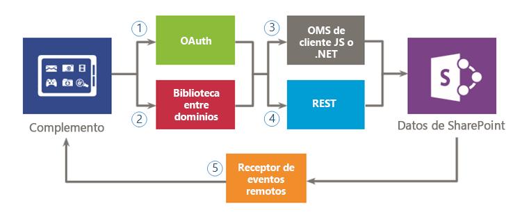
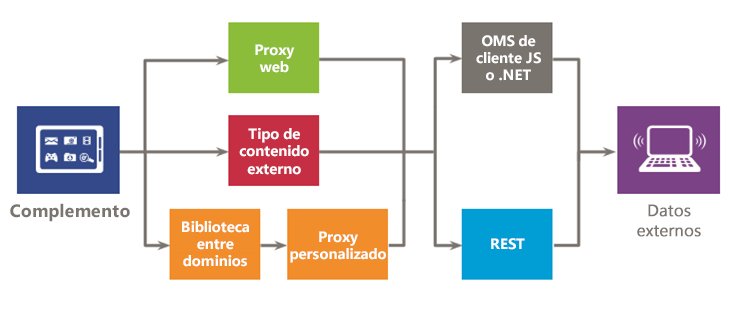

# Acceso a datos seguro y modelos de objetos de cliente para complementos de SharePoint
Información sobre las opciones de acceso a datos que tiene al generar Complementos de SharePoint, incluidas las opciones de conectividad para obtener acceso a datos en SharePoint y en sistemas externos, así como las API que están disponibles cuando quiere obtener acceso a datos del complemento.
En la evaluación de las opciones de acceso de datos para Complementos de SharePoint, tiene que valorar el entorno del complemento y tener en cuenta varios factores, como la comunicación entre el cliente y el servidor, y el nivel de permiso que necesita el complemento haga las tareas necesarias. También tiene que evaluar las API disponibles en el modelo para aplicaciones para SharePoint.

## Información general avanzada de datos en aplicaciones de Complementos de SharePoint

Es difícil imaginar una Complemento de SharePoint (o cualquier complemento) que no necesite consultar, almacenar o manipular datos. En el complemento, con frecuencia tendrá que recuperar y manipular datos de SharePoint, como elementos de bibliotecas de documentos y listas, metadatos o perfiles de usuario. Del mismo modo, en algunos escenarios puede necesitar acceso a datos externos del complemento. El modelo para aplicaciones para SharePoint proporciona varias opciones de conectividad y un rico conjunto de API para obtener acceso a datos y servicios que residen en SharePoint y en sistemas externos.

Al diseñar su complemento y planear el acceso a los datos, tiene que tomar dos decisiones fundamentales:

1. ¿Qué opción de conectividad se debe usar?

2. ¿Qué API se debe usar para obtener acceso a los datos necesarios?

Las siguientes figuras resumen las diferentes opciones que proporciona el modelo para aplicaciones para SharePoint. En las siguientes secciones, se examinará cada opción en detalle y obtendrá información sobre cuándo usarlas.

La figura 1 ilustra las opciones que tiene para obtener acceso a los datos de SharePoint en el complemento. Cuando se trata de estos escenarios, tiene que decidir si desea autenticar y comunicarse con SharePoint a través de (1) OAuth o (2) labiblioteca entre dominios. Luego, para la API de acceso de datos, debe decidir entre (3) el modelo de objetos de cliente (modelos de objetos de cliente de JavaScript o .NET) o (4) laTransferencia de estado representacional (REST).

Tenga en cuenta que también puede obtener acceso a determinados datos mediante (5)  *receptores de eventos remotos*  . Sin embargo, el escenario principal para los receptores de eventos remotos es la ejecución de código remoto.

**Figura 1. Opciones de uso de datos de SharePoint en el complemento**

La figura 2 muestra las opciones que tiene para obtener acceso a datos externos en el complemento. Cuando se trabaja con estos escenarios, tiene que decidir si quiere usar (1) el  *proxy web*  , (2) los *tipos de contenido externo*  o (3) la *biblioteca entre dominios con una página proxy personalizada*  para autenticarse y comunicarse con sistemas o servicios externos. También puede usar (4) elmodelo de objetos de cliente (modelos de objetos de cliente JavaScript o .NET) o (5) laTransferencia de estado presencial (REST).

**Figura 2. Opciones para usar datos externos en el complemento**

## Opciones de conectividad de datos en Complementos de SharePoint

Ha de tener en cuenta varios aspectos al trabajar con datos en su complemento. Por ejemplo, ¿qué ruta usan los datos? ¿Vienen del servidor o van hacia él? ¿Va a través del cliente? ¿Es correcto autenticarse como el usuario ha iniciado sesión? ¿El complemento necesita privilegios? Las siguientes secciones le pueden ayudar con estas y otras preguntas.

### Conectividad de datos de SharePoint

Las siguientes opciones de conectividad están disponibles al obtener acceso a los datos de SharePoint (ver Figura 1):

- **OAuth:** un protocolo abierto que permite la autorización segura de una manera simple y estándar. OAuth permite a los usuarios aprobar una solicitud para actuar en su nombre sin compartir su nombre de usuario y contraseña. Puede usar OAuth con código del lado del servidor. Es una buena opción si necesita ejecutar un proceso no interactivo o si necesita elevar privilegios distintos de los del usuario que ha iniciado la sesión. Para más información sobre OAuth, vea [Autorización y autenticación de complementos de SharePoint](authorization-and-authentication-of-sharepoint-add-ins.md).

- **Biblioteca entre dominios:** una alternativa de cliente en forma de un archivo de JavaScript ( **SP.RequestExecutor.js** ) hospedado en el sitio web de SharePoint al que puede hacer referencia en el complemento remoto. La biblioteca entre dominios permite interactuar con más de un dominio en la página del complemento remoto a través de un proxy. Es una buena opción si prefiere que el código del complemento se ejecute en el cliente y no en el servidor, o si hay barreras de conectividad, como firewalls, entre SharePoint y la infraestructura remota. Para obtener más información, consulte [Cómo obtener acceso a los datos de SharePoint 2013 desde aplicaciones con la biblioteca entre dominios](access-sharepoint-2013-data-from-add-ins-using-the-cross-domain-library.md).

- **Receptores de eventos remotos:** Puede usar receptores de eventos remotos para controlar eventos que le ocurran a un elemento del complemento, como una lista, un elemento de lista o una web. Estos eventos se asemejan a los de una solución de SharePoint tradicional, aunque pueden funcionar con los componentes remotos de la Complemento de SharePoint. Tenga en cuenta que algunas propiedades del elemento están disponibles para el receptor de eventos remotos. Para obtener más información, consulte [Crear un receptor de eventos remotos en complementos para SharePoint](create-a-remote-event-receiver-in-sharepoint-add-ins.md). Asimismo, puede usar receptores de eventos de complementos para personalizar la forma en que se instala, actualiza y desinstala el complemento. Para obtener más información, consulte  [Crear un receptor de eventos de aplicación en SharePoint 2013](create-an-add-in-event-receiver-in-sharepoint-add-ins.md).

### Opciones de conectividad de datos entrantes de SharePoint: ¿cuál se debe usar?

La tabla siguiente enumera los requisitos y los escenarios que se pueden encontrar al crear complementos comunes. Una **x** en la columna indica qué opción se puede usar en cada caso.

**Tabla 1. Opciones de conectividad de datos de SharePoint**

|**Requisito/escenario**|**OAuth**|**Biblioteca entre dominios**|
|:-----|:-----|:-----|
|Uso tecnologías del lado cliente (HTML + JavaScript).    ||x    |
|Deseo usar interfaces REST.    |x    |x    |
|Hay un firewall entre SharePoint y el complemento remoto, y lo necesito para emitir las llamadas a través del explorador.    ||x    |
|Mi complemento necesita obtener acceso a recursos como el usuario que ha iniciado sesión.    |x    |x    |
|Mi complemento necesita elevar privilegios distintos de los del usuario que ha iniciado la sesión.    |x    ||
|Mi complemento necesita actuar en nombre de un usuario distinto al que ha iniciado la sesión.    |x    ||
|Mi complemento necesita ejecutar operaciones solo mientras el usuario tiene iniciada la sesión.    |x    |x    |
|Mi complemento necesita ejecutar operaciones incluso cuando el usuario no ha iniciado la sesión.    |x    ||
|Mi complemento necesita ejecutar código remoto como respuesta a un evento en SharePoint.    |||
 
Dado que los receptores de eventos remotos se crean sobre OAuth, una comparación en esta tabla no es la mejor manera de decidir si se van a usar o no. Use receptores de eventos remotos cuando necesite ejecutar código remoto además de intercambiar datos.

### Conectividad de datos externos

Las siguientes opciones de conectividad están disponibles al obtener acceso a los datos externos (vea la figura 2):

- **Proxy web:** como desarrollador, puede usar el proxy web expuesto en las API del cliente, tales como JSOM. Al usar el proxy web, emite la solicitud inicial en SharePoint. A su vez, SharePoint solicita los datos al extremo especificado y reenvía la respuesta de vuelta a la página. Use el proxy web cuando quiera que la comunicación ocurra en el nivel del servidor. El proxy web está diseñado para obtener acceso a datos sin estructura que no requieren autenticación. Para obtener más información, consulte [Consultar un servicio remoto mediante el proxy web en SharePoint 2013](query-a-remote-service-using-the-web-proxy-in-sharepoint-2013.md).

- **Tipos de contenido externos:** puede crear complementos que tengan acceso a datos externos de SAP, Netflix y propietario y otros tipos de datos sin involucrar al administrador de inquilinos. El acceso a las aplicaciones externas se mantiene a través de Servicios de conectividad empresarial (BCS), que proporciona una interfaz coherente y uniforme que pueden usar otras aplicaciones de SharePoint. Los tipos de contenido externo con ámbito de aplicación son una buena opción cuando se usa un modelo de BCS y el acceso a los datos requiere autenticación. Para obtener más información, consulte [Agregar en ámbito tipos de contenido externo en SharePoint 2013](http://msdn.microsoft.com/library/a34cbbba-dc38-4d3d-b796-d54b5848bdfb%28Office.15%29.aspx).

- **Página de proxy personalizada en la biblioteca entre dominios:** puede usar la biblioteca entre dominios para obtener acceso a datos en su complemento remoto si proporciona una página de proxy personalizada hospedada en la infraestructura del complemento remoto. Como desarrollador, es responsable de la implementación de la página de proxy personalizada y debe proporcionar la lógica personalizada, como el mecanismo de autenticación, al complemento remoto. Use la biblioteca entre dominios con una página de proxy personalizada si desea que la comunicación se produzca a nivel de cliente. Para más información, vea [Crear una página de proxy personalizada para la biblioteca entre dominios en SharePoint 2013](create-a-custom-proxy-page-for-the-cross-domain-library-in-sharepoint-2013.md).

### Opciones de conectividad de datos externos: ¿cuál se debe usar?

La tabla siguiente enumera los requisitos y los escenarios que se pueden encontrar al crear complementos comunes. Una **x** en la columna indica qué opción se puede usar en cada caso.

**Tabla 2. Opciones de conectividad de datos externos**

|**Requisito/escenario**|**Proxy web**|**Tipos de contenido externo**|**Biblioteca entre dominios con una página de proxy personalizada**|
|:-----|:-----|:-----|:-----|
|Uso tecnologías del lado cliente (HTML + JavaScript).    |x    |x    |x    |
|No puedo agregar páginas o componentes al servicio o el complemento remoto.    |x    |x    ||
|Deseo usar interfaces REST.    |x    |x    |x    |
|Deseo usar el CSOM JavaScript.    |x    |x    |x    |
|Deseo usar el CSOM .NET.    |x    |x    ||
|No hay conectividad directa entre la infraestructura de SharePoint y mi complemento. Necesito emitir llamadas a través del explorador.    ||x    |x    |
|Mi complemento necesita obtener acceso a recursos como el usuario que ha iniciado sesión.    |x    |x    |x    |
 

## API de acceso a datos disponibles en Complementos de SharePoint

Las siguientes opciones de API están disponibles para acceder a los datos de SharePoint desde el complemento:

- **Transferencia de estado representacional (REST):** para escenarios en los que necesita obtener acceso a entidades de SharePoint desde tecnologías de cliente que no usan JavaScript y no se han creado en la plataforma de .NET Framework, SharePoint proporciona una implementación de un servicio web REST que usa el [protocolo Open Data (OData)](http://www.odata.org/) para realizar las llamadas operaciones CRUDQ (Create, Read, Update, Delete y Query; en español: crear, leer, actualizar, eliminar y consultar) en datos de SharePoint. Además, casi todas las API en los modelos de objetos de cliente tienen un extremo REST correspondiente. Esto permite que el código interactúe directamente con SharePoint a través de cualquier tecnología compatible con las funciones estándar de REST. Para usar las funciones de REST incorporadas en SharePoint, el código construye una solicitud HTTP RESTful en un extremo que corresponde al objeto deseado de SharePoint. El servicio REST controla la solicitud HTTP y emite una respuesta en formato Atom o Notación de objetos de JavaScript (JSON). Para obtener más información acerca de REST en SharePoint, consulte [Usar operaciones de consulta de OData en solicitudes REST de SharePoint](use-odata-query-operations-in-sharepoint-rest-requests.md).

- **Modelo de objetos de cliente .NET Framework (MO de cliente .NET):** prácticamente todas las clases del sitio principal y de la lista del modelo de objetos de servidor tienen una clase correspondiente en el modelo de objetos de cliente .NET Framework. Además, el modelo de objetos de cliente .NET Framework también expone un conjunto completo de las API para extenderse a otras características, incluidas algunas características en el nivel de SharePoint como ECM, taxonomía, perfiles de usuario, búsqueda avanzada, análisis, BCS y otras. Para más información sobre los modelos de objetos de cliente, vea [Elegir el conjunto de API correcto en SharePoint 2013](http://msdn.microsoft.com/library/f36645da-77c5-47f1-a2ca-13d4b62b320d%28Office.15%29.aspx).

- **JavaScript Modelo de objetos de cliente (JSOM):** SharePoint proporciona un modelo de objetos de JavaScript para usar en el script en línea o en archivos .js independientes. Incluye las mismas funciones que el modelo de objetos de cliente de .NET Framework. El JSOM es un método útil para incluir código personalizado de SharePoint en un complemento, sobre todo en una Complementos hospedados en SharePoint, donde el código del lado servidor personalizado no está permitido. También permite a los desarrolladores web usar sus habilidades existentes de JavaScript para crear Complementos de SharePoint con una mínima curva de aprendizaje. Para obtener más información acerca de los modelos de objetos de cliente, consulte [Elegir el conjunto de API correcto en SharePoint 2013](http://msdn.microsoft.com/library/f36645da-77c5-47f1-a2ca-13d4b62b320d%28Office.15%29.aspx).

Puede que haya otras API adicionales que puede usar en la Complemento de SharePoint al obtener acceso a datos externos. Depende de las interfaces que los sistemas y servicios externos tienen para ofrecer. También debería considerar estas interfaces en el diseño.

## Recursos adicionales

-  [Autorización y autenticación de complementos de SharePoint](authorization-and-authentication-of-sharepoint-add-ins.md)

-  [Cómo obtener acceso a los datos de SharePoint 2013 desde aplicaciones con la biblioteca entre dominios](access-sharepoint-2013-data-from-add-ins-using-the-cross-domain-library.md)

-  [Crear una página de proxy personalizada para la biblioteca entre dominios en SharePoint 2013](create-a-custom-proxy-page-for-the-cross-domain-library-in-sharepoint-2013.md)

-  [Consultar un servicio remoto mediante el proxy web en SharePoint 2013](query-a-remote-service-using-the-web-proxy-in-sharepoint-2013.md)

-  [Crear un receptor de eventos remotos en complementos para SharePoint](create-a-remote-event-receiver-in-sharepoint-add-ins.md)

-  [Elegir el conjunto de API correcto en SharePoint 2013](http://msdn.microsoft.com/library/f36645da-77c5-47f1-a2ca-13d4b62b320d%28Office.15%29.aspx)

-  [Usar operaciones de consulta de OData en solicitudes REST de SharePoint](use-odata-query-operations-in-sharepoint-rest-requests.md)

