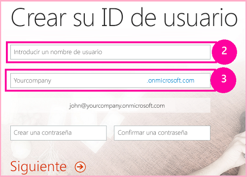
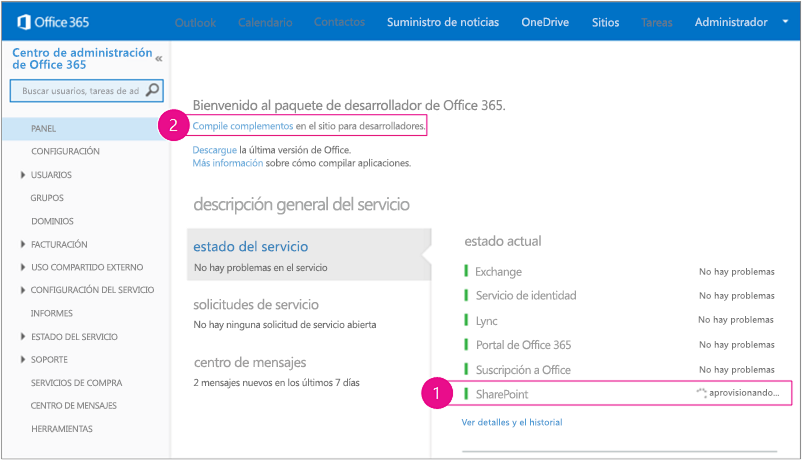

# Configurar un entorno de desarrollo para complementos para SharePoint en Office 365
Configurar un entorno de desarrollo para Complementos de SharePoint en un sitio para desarrolladores de Office 365.
Lea  [Herramientas y entornos para desarrollar complementos para SharePoint](tools-and-environments-for-developing-sharepoint-add-ins.md) para conocer las opciones antes de llevar a cabo los procedimientos de este artículo. Consulte [Complementos de SharePoint](sharepoint-add-ins.md) si no está seguro de qué tipos de Complementos de SharePoint quiere crear.
  
    
    

## Instalar Visual Studio y herramientas en el equipo

- Si todavía no tiene instalado ya **Visual Studio** 2013 o una versión posterior, instálelo con las instrucciones de [Install Visual Studio](http://msdn.microsoft.com/library/da049020-cfda-40d7-8ff4-7492772b620f.aspx). Se recomienda usar la  [versión más reciente de Microsoft Download Center](https://www.visualstudio.com/downloads/download-visual-studio-vs).
    
  
- Visual Studio incluye **Microsoft Office Developer Tools para Visual Studio** pero, a veces, se publica una versión de las herramientas entre actualizaciones de Visual Studio. Para asegurarse de que tiene la versión más reciente de las herramientas, ejecute el [instalador de Office Developer Tools para Visual Studio 2013](http://aka.ms/OfficeDevToolsForVS2013) o el [instalador de Office Developer Tools para Visual Studio 2015](http://aka.ms/OfficeDevToolsForVS2015). 
    
  

### Registro detallado en Visual Studio

Siga estos pasos si desea activar el registro detallado:
  
    
    

1. Abra el Registro y vaya a **HKEY_CURRENT_USER\\Software\\Microsoft\\VisualStudio\\ _nn.n_\\SharePointTools**, donde _nn.n_ es la versión de Visual Studio, como 12.0 o 14.0.
    
  
2. Agregue una clave DWORD llamada **EnableDiagnostics**.
    
  
3. Asigne el valor **1** a la clave.
    
  
La ruta de acceso del Registro cambiará en futuras versiones de Visual Studio.
  
    
    

## Registrarse en un Sitio para desarrolladores de Office 365

> [!NOTA]
>  Podría ya tener acceso a un Sitio para desarrolladores de Office 365:> **¿Es suscriptor de MSDN?** Los suscriptores de Visual Studio Enterprise con MSDN reciben una suscripción de desarrollador a Office 365 como ventaja adicional. [Solicítela hoy.](https://msdn.microsoft.com/subscriptions/manage/default.aspx)> **¿Tiene uno de los siguientes planes de suscripción a Office 365?**> **En caso afirmativo, un administrador de la suscripción a Office 365 puede crear un Sitio para desarrolladores** usando el [centro de administración de Office 365](https://portal.microsoftonline.com/admin/default.aspx). Para obtener más información, consulte  [Crear un sitio para desarrolladores en una suscripción existente de Office 365](create-a-developer-site-on-an-existing-office-365-subscription.md). 
  
    
    

Tres maneras de obtener un plan de Office 365. 
  
    
    

- Registrarse para obtener una cuenta de Office 365 de un año gratuita a través del programa de desarrolladores de Office 365.  [Obtenga más información](http://dev.office.com/devprogram) o diríjase al [formulario de registro](https://profile.microsoft.com/RegSysProfileCenter/wizardnp.aspx?wizid=14b845d0-938c-45af-b061-f798fbb4d170). Recibirá un correo electrónico después del registro en el programa de desarrolladores con un vínculo para registrar la cuenta de desarrollador. Use las siguientes instrucciones.
    
  
- Comience con una  [prueba gratuita de 30 días](https://portal.microsoftonline.com/Signup/MainSignUp.aspx?OfferId=6881A1CB-F4EB-4db3-9F18-388898DAF510&amp;DL=DEVELOPERPACK) con una licencia de usuario.
    
  
- Compre una  [suscripción de desarrollador a Office 365](https://portal.microsoftonline.com/Signup/MainSignUp.aspx?OfferId=C69E7747-2566-4897-8CBA-B998ED3BAB88&amp;DL=DEVELOPERPACK). 
    
  

> [!SUGERENCIA]
> Abra estos vínculos en otra ventana o pestaña para tener las siguientes instrucciones a mano. 
  
    
    

**Figura 1. Nombre de dominio del sitio para desarrolladores de Office 365**

  
    
    

  
    
    

  
    
    

  
    
    

  
    
    

1. La primera página (no se muestra) del formulario de registro se explica por sí misma. Simplemente proporcione la información personal que se solicita y elija **Siguiente**.
    
  
2. En la segunda página, que se muestra en la figura 1, especifique un identificador de usuario para el administrador de la suscripción.
    
  
3. Cree un subdominio de **.onmicrosoft.com**. 
    
    Después del registro, debe usar las credenciales resultantes (en el formato  _IdUsuario_@ _sudominio_.onmicrosoft.com) para iniciar sesión el sitio del portal de Office 365 donde administra la cuenta. Su sitio para desarrolladores de SharePoint Online se aprovisiona en su dominio: **http:// _sudominio_. sharepoint.com**.
    
  
4. Elija **Siguiente** y rellene la última página del formulario. Si decide proporcionar un número de teléfono para obtener un código de confirmación, puede proporcionar el número de un teléfono móvil o de un teléfono fijo, pero *no*  un número de VoIP (Protocolo de voz sobre Internet).
    
  

    
> [!NOTA]
> Si tiene iniciada una sesión con otra cuenta Microsoft cuando intente registrar una cuenta de desarrollador, es posible que vea este mensaje: "El id. de usuario que especificó no funcionó. Parece que no es válido. Asegúrese de especificar el id. de usuario que su organización le asignó. El id. de usuario suele ser como  *alguien@example.com*  o *alguien@example.onmicrosoft.com*  ."> Si ve este mensaje, cierre la sesión de la cuenta Microsoft que estaba usando y vuelva a intentarlo. Si sigue viendo el mensaje, borre la memoria caché del explorador o cambie a **Exploración de InPrivate** y rellene el formulario.
  
    
    

Tras finalizar el proceso de registro, el explorador abrirá la página de instalación de Office 365. Elija el icono de administrador para abrir la página del centro de administración.
  
    
    

**Figura 2. Página del centro de administración de Office 365**

  
    
    

  
    
    

  
    
    

  
    
    

1. Deberá esperar a que su Sitio para desarrolladores finalice el aprovisionamiento. Una vez completado el aprovisionamiento, actualice la página del centro de administración de en su explorador.
    
  
2. Luego haga clic en el vínculo **Crear complementos** de la esquina superior izquierda de la página para abrir su Sitio para desarrolladores. Debería aparecer un sitio como el que se muestra en la figura 3. Hay una lista de **Complementos en fase de prueba** en la página. Esto confirma que el sitio web se creó con la plantilla de sitio para desarrolladores de SharePoint. Si lo que ve es un sitio de equipo, espere unos minutos e inicie de nuevo el sitio.
    
  
3. Tome nota de la dirección URL del sitio. Se usa al crear proyectos de Complementos de SharePoint en Visual Studio.
    
  

**Figura 3. La página de inicio de su sitio para desarrolladores con la lista Complementos en fase de prueba**

  
    
    

  
    
    

  
    
    

  
    
    

  
    
    

## Recursos adicionales

-  [Complementos de SharePoint](sharepoint-add-ins.md)
    
  
-  [Empezar a crear complementos hospedados en proveedor para SharePoint](get-started-creating-provider-hosted-sharepoint-add-ins.md)
    
  
-  [Empezar a crear complementos hospedados en SharePoint para SharePoint](get-started-creating-sharepoint-hosted-sharepoint-add-ins.md)
    
  

  
    
    

