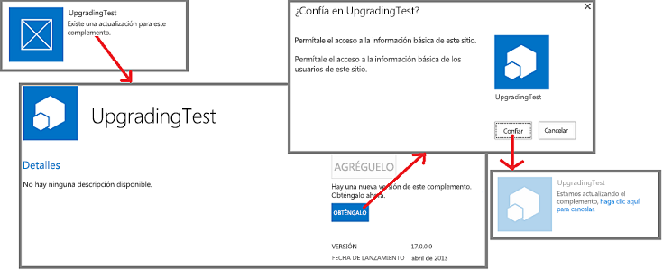

# Proceso de actualización de complementos para SharePoint
Información sobre el proceso de actualización de complementos para SharePoint.
Debe actualizar un complemento para SharePoint si agrega funciones, corrige un error o realiza una actualización de seguridad. Una actualización de un complemento se implementa en paquetes de Complemento de SharePoint de la misma forma que se implementa la primera versión del complemento. El proceso de actualización de complementos para SharePoint garantiza que los datos del complemento se conservan si por cualquier motivo se producen errores en la actualización.

> **IMPORTANTE**
> No puede cambiar el  *tipo de complemento*  mediante el sistema de actualización. Por ejemplo, no se puede cambiar el hospedaje de un complemento que esté hospedado por SharePoint para que lo hospede un proveedor mediante una actualización. Para realizar un cambio, debe [migrar de un complemento antiguo a uno nuevo](#Major). En particular, desde que se  [cerró el programa de vista previa para complementos autohospedados](http://blogs.office.com/2014/05/16/update-on-autohosted-apps-preview-program/), debe tener en cuenta que no se puede actualizar un complemento autohospedado a un complemento hospedado por el proveedor. Debe convertir el complemento, tal como se explica en  [Convertir un complemento autohospedado por SharePoint en uno hospedado por el proveedor](convert-an-autohosted-sharepoint-add-in-to-a-provider-hosted-add-in.md). 

## Proceso de actualización de un complemento para SharePoint

En una actualización, use el mismo identificador de producto en el manifiesto del complemento que utilizó en la versión original. El número de versión en el manifiesto del complemento debe ser mayor que el número de versión del complemento original o la actualización más reciente.

En las 24 horas siguientes a la carga de la actualización en el catálogo de complementos de una organización, y una semana después de cargarlo en la Tienda Office, aparece una indicación de que hay disponible una actualización junto al anuncio del complemento en la página **Contenido del sitio** de cada sitio web donde esté instalado. Los usuarios pueden hacer clic en un vínculo para actualizar el complemento, tal como muestra la figura 1. Las actualizaciones disponibles también se exponen en la interfaz de usuario de administración de inquilinos.

**Figura 1. Proceso de actualización de complementos para SharePoint**

> **SUGERENCIA**
>  Cuando está desarrollando una actualización, no quiere esperar 24 horas cada vez que carga una nueva versión al catálogo de complementos para SharePoint de prueba. Vea la sección [Actualice un complemento sin esperar las 24 horas](update-sharepoint-add-ins.md#ImmediateUpdateNotice) para obtener información sobre cómo actualizar de forma inmediata un complemento.>  De forma predeterminada, SharePoint comprueba cada 24 horas la existencia de actualizaciones de los complementos instalados. Un administrador de una granja de servidores puede configurar un nuevo valor usando el siguiente comando Shell de administración de SharePoint, donden es el número de horas entre comprobaciones.>  `Set-SPInternalAppStateUpdateInterval -AppStateSyncHours n`>  Si el valor se establece en 0, entonces la comprobación se realiza cada vez que el trabajo de temporizador integrado **Actualización de estado de complemento interna** se ejecuta, lo que de forma predeterminada sucede cada hora. Los administradores de granjas de servidores pueden usar el Administrador central para cambiar la frecuencia de trabajo del temporizador o ejecutarlo inmediatamente.

SharePoint 2013 hará lo siguiente cuando un usuario instale una actualización de una Complemento de SharePoint. Estos eventos no necesariamente ocurren en este orden exacto y algunos de ellos pueden producirse en paralelo. Además, si se producen errores en la actualización, existe una restauración completa.

- SharePoint 2013 solicita al usuario que apruebe los permisos solicitados por el complemento.

- SharePoint 2013 hace que el complemento no esté disponible temporalmente para los usuarios.

- Si el complemento contiene un paquete de solución de SharePoint (.wsp) y ha cambiado algo del contenido del paquete de solución, SharePoint hace lo siguiente:

  - Hace una copia de seguridad de la web del complemento (aunque en SharePoint Online y en SharePoint 2016 local y posterior, la copia de seguridad de los datos reales de las listas de SharePoint se hace únicamente cuando la actualización realiza un cambio en el esquema de la lista).

  - Prueba la actualización de la copia de seguridad.

  - Si la prueba es correcta, actualiza el complemento web original. Observe que el nuevo archivo .wsp en el paquete del complemento se usa para actualizar las funciones y otros elementos en la web del complemento (las partes de la actualización del esquema de la función se han expandido en SharePoint 2013).

- SharePoint 2013 ejecuta el servicio web **UpgradedEventEndpoint**, si registra algo en el manifiesto del complemento.

    > **NOTA**
      > Si el complemento está hospedado por el proveedor, proporcione la lógica de actualización para todos los componentes que no sean de SharePoint del complemento. En la mayoría de los casos, la actualización de estos componentes se realiza de forma independiente a la actualización de la propia Complemento de SharePoint, igual que cuando instaló esos componentes de forma independiente a la instalación del complemento. Pero puede haber algunos cambios que solo deberían suceder cuando un usuario está actualizando la Complemento de SharePoint. Esta lógica también puede ir en un servicio web **UpgradedEventEndpoint** o en una lógica "ejecutar primero después de actualizar" del propio complemento.
- SharePoint 2013 hace que el complemento y sus componentes vuelvan a estar disponibles.

> **NOTA**
> Si se está modificando el esquema de cualquiera de las listas en la web del complemento, se hará una copia de seguridad de dicha lista junto con el resto de la web del complemento. Esto puede llevar algo de tiempo si hay una gran cantidad de datos en la lista. Si el proceso de actualización no se ha completado en una hora, se detiene y la actualización se revierte. 

## Migrar de un complemento antiguo a uno nuevo

En algunos casos, es posible que desee crear un complemento desde cero para reemplazar uno antiguo en lugar de actualizar el original. El complemento puede tener el mismo nombre descriptivo que el antiguo, pero debe darle un nuevo identificador de producto en el manifiesto del complemento y aparecerá en la Tienda Office y en la página **Agregar un complemento** de los sitios web de SharePoint como un elemento distinto de la versión original.

> **NOTA**
> Los elementos de un catálogo de complementos de la organización se distinguen por el  *nombre de archivo*  del paquete del complemento, no por el identificador del producto ni por el nombre del complemento. Si el complemento nuevo tiene el mismo nombre de archivo del paquete que el antiguo, lo reemplazará en el catálogo de complementos y este ya no volverá a aparecer en la página **Agregar un complemento**. Si habilita el control de versiones en el paquete del complemento cuando lo carga en el catálogo, la antigua versión del archivo (que es la aplicación antigua) aún estará disponible en el historial del elemento. Puede descargar el paquete del complemento antiguo para revertirlo, pero no habrá forma de disponer de ambas versiones del complemento como elementos separados en el catálogo ni en la página **Agregar un complemento**, a menos que tengan nombres de archivo distintos. 

En algunos casos, es posible que necesite migrar datos. Por ejemplo, el nuevo complemento puede usar una Base de datos SQL de Microsoft Azure con un esquema diferente del complemento antiguo. O el complemento nuevo podría usar un mecanismo de almacenamiento de datos diferentes; por ejemplo, una base de datos externa en lugar de listas de SharePoint. Debe proporcionar el código para la migración de datos.

Si los datos antiguos están en un lugar al que tiene acceso un controlador de eventos remotos, puede implementar la lógica de la migración en un servicio web **InstalledEventEndpoint** del nuevo complemento. Si el complemento tiene acceso a los datos antiguos, también puede colocar la lógica de la migración en un código que se ejecuta la primera vez que un usuario inicia el complemento. Si ni los controladores remotos ni el nuevo complemento pueden obtener acceso a los datos antiguos, puede crear una actualización del complemento antiguo que agregue capacidad de exportación de datos y una interfaz de usuario. Los usuarios podrían actualizar primero el complemento antiguo y luego usarlo para exportar los datos a una ubicación donde el complemento puede obtener acceso. Incluya la capacidad y la interfaz de usuario para importar datos en el nuevo complemento.

En principio, puede reutilizar un origen de datos externo, un componente calculado u otro componente externo en el complemento nuevo que se usó en el complemento antiguo. Tenga en cuenta, no obstante, que cuando se desinstala una Complemento de SharePoint, la infraestructura de SharePoint 2013 desinstala todo lo que está instalado. Por lo tanto, generalmente resulta recomendable que una Complemento de SharePoint solo dependa de los componentes que instaló o de componentes externos que no haya instalado la infraestructura de SharePoint 2013.

> **NOTA**
> Le recomendamos que si implementa un **InstalledEventEndpoint** o un **UpgradedEventEndpoint** que instala componentes, debería implementar también un **UninstallingEventEndpoint** que desinstale esos mismos componentes. Hacerlo así cumple con los principios de diseño que establecen que los complementos deben ser autocontenidos y desinstalarse limpiamente. Sin embargo, no deberían eliminarse aquellos datos que aún pudieran resultar de utilidad a los usuarios después de la desinstalación del complemento. Los sitios web creados por un complemento, distintos de la web de complemento, normalmente deberían considerarse datos.

Si los complementos nuevos y antiguos contienen una web de complemento, tenga en cuenta la posibilidad de crear una web de complemento al instalar el nuevo complemento. Por esta razón, no debe usar el marcado XML relacionado con la actualización en el esquema de función de SharePoint 2013. Dicho marcado no funciona porque no se actualizan los componentes existentes de SharePoint; se reemplaza un complemento antiguo por uno nuevo.

## Recursos adicionales

-  [Actualizar complementos para SharePoint](update-sharepoint-add-ins.md)

-  [Actualizar componentes de web de complemento en SharePoint 2013](update-add-in-web-components-in-sharepoint-2013.md)

-  [Actualizar componentes de web de host en SharePoint 2013](update-host-web-components-in-sharepoint-2013.md)

-  [Crear un controlador para el evento de actualización en complementos de SharePoint](create-a-handler-for-the-update-event-in-sharepoint-add-ins.md)

-  [Actualizar componentes remotos en complementos de SharePoint](update-remote-components-in-sharepoint-add-ins.md)

-  [Publicar aplicaciones para SharePoint](publish-sharepoint-add-ins.md)

-  [Aspectos importantes del panorama de desarrollo y arquitectura de los complementos para SharePoint](important-aspects-of-the-sharepoint-add-in-architecture-and-development-landscap.md)

-  [Implementación e instalación de aplicaciones para SharePoint: métodos y opciones](deploying-and-installing-sharepoint-add-ins-methods-and-options.md)

