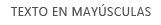

# Directrices de diseño de los complementos para la experiencia de usuario de SharePoint
Obtenga información sobre las directrices de diseño generales de la experiencia de usuario (UX) para complementos en SharePoint 2013, entre lo que se incluye elegir el cromo, usar CSS, administrar licencias de usuario y otras tareas de diseño.
Los complementos son un nuevo concepto para SharePoint 2013 y ofrecen a los usuarios finales la capacidad para agregar funcionalidad nueva a los sitios sin dejar de garantizar la fiabilidad para el sitio de SharePoint. La creación de un buen complemento requiere no solamente que su funcionalidad sea excepcional (pese a que esto evidentemente resulta importante), sino que además se debe garantizar que la apariencia del complemento es la adecuada y que encaja sin problemas en el sitio donde se instala.
  
    
    


## Elegir el cromo para el complemento
<a name="UXGuide_AppChrome"> </a>

El primer aspecto que se debe determinar cuando se compila un complemento es el grado de personalización de las páginas y el sitio donde desea que se hospede. En función de estas elecciones, la tecnología que use para activar el cromo será relativamente obvia:
  
    
    

- **Páginas ASPX hospedadas en SharePoint:** use la plantilla de complemento.
    
  
- **Páginas HTML hospedadas en SharePoint o en cualquier página fuera de SharePoint:** use el control cromo.
    
  
- **Páginas personalizadas:** use su propio cromo.
    
  

### Usar la plantilla de complemento para páginas hospedadas en SharePoint
<a name="UXGuide_AppTemplate"> </a>

La plantilla de complemento se puede usar solamente para páginas ASPX hospedadas en SharePoint. La plantilla incluye la página maestra **app.master** (que contiene el cromo apropiado para los complementos y se ha diseñado para que el tema sea el adecuado para el sitio del host) y oculta cierta funcionalidad de SharePoint que bien no funcionaría o bien no tendría sentido en un sitio web de complemento. La Figura 1 muestra una página hospedada en SharePoint que usa la plantilla de complemento.
  
    
    

**Figura 1. Página hospedada en SharePoint que usa la plantilla de complemento**

  
    
    

  
    
    

  
    
    
La plantilla de complemento es la predeterminada en Visual Studio cuando crea un sitio web y páginas de complemento en ese sitio web.
  
    
    

### Usar el control cromo en Complementos de SharePoint
<a name="UXGuide_ChromeControl"> </a>

Si no está compilando páginas ASPX hospedadas en SharePoint, pero aún así, quiere que el complemento encaje con naturalidad en el sitio del host desde el que se usa, el control cromo es la opción a elegir. La Figura 2 ilustra el control cromo.
  
    
    

**Figura 2. Control cromo en una página web**

  
    
    

  
    
    

  
    
    

  
    
    

**Vea el vídeo: Control cromo de SharePoint 2013**

  
    
    

  
    
    

  
    
    

  
    
    

  
    
    

  
    
    

### Para usar el control cromo


1. Agregue una referencia a la biblioteca de controles. Se puede hacer de dos formas:
    
  - Seleccione la biblioteca en la raíz de la carpeta con los diseños, tal como se muestra en el ejemplo siguiente.
    
  ```
  
<script
    type="text/javascript" 
    src="http://{server URL}/_layouts/15/sp.ui.controls.js">
</script>
  ```

  - Copie la biblioteca en su propio sitio web y haga referencia a la misma desde allí.
    
    > [!PRECAUCIóN]
      > Si opta por esta alternativa, el complemento no se beneficiará de las actualizaciones para el control. 
2. Agregue el elemento DOM del marcador donde se vaya a representar el control, tal como se muestra en este ejemplo.
    
  ```
  
<div id='chromeControlContainer'></div>
  ```

3. Genere una instancia del control.
    
  ```
  function addchromecontrol(){
    var options = {};
    options.siteTitle ="{host site title}";
    options.siteUrl = "{host URL}";
    options.appHelpPageUrl = "{help page URL}";
    options.appIconUrl = "{app icon URL}";
    options.appTitle = "add-in Title";
    nav = new SP.UI.Controls.Navigation("chromeControlContainer", options);
    nav.setVisible(true);
}
  ```

4. (Opcional) Si no desea que el área del título aparezca en la página, puede quitarla si ejecuta el siguiente código de JavaScript.
    
  ```
  
nav.setBottomHeaderVisible(false);
  ```

El control cromo ofrece dos iconos de complemento opcionales: uno se encuentra en la parte superior de la barra de navegación y otro el área del título. El icono de la aplicación en la barra de navegación superior es de 24 x 24 píxeles y el icono en el área del título es del mismo tamaño que los iconos del sitio de SharePoint (hasta 64 píxeles de altura por 180 píxeles de largo). Se recomienda que use una imagen PNG que haya probado sobre fondos blanco, negro, gris, con brillo y sin brillo porque los usuarios y administradores pueden cambiar el tema del sitio. Para obtener más información sobre el control cromo, consulte  [Usar el control cromo de cliente en complementos de SharePoint](use-the-client-chrome-control-in-sharepoint-add-ins.md).
  
    
    

### Crear una interfaz de usuario personalizada con la marca en Complementos de SharePoint
<a name="UXGuide_CustomUI"> </a>

Si, en lugar de ajustar el tema del sitio del host y adaptarlo al sitio de SharePoint donde tiene instalado el complemento, desea usar su propia marca dentro del complemento, tendrá que crear un cromo desde cero. Sin embargo, aun así, debería incorporar un vínculo para volver al sitio en la esquina superior izquierda de la página (superior derecha en idiomas que se escriban de derecha a izquierda) y que redirija al usuario al sitio donde se instaló el complemento.
  
    
    

## Usar el CSS del sitio web host en Complementos de SharePoint
<a name="UXGuide_CSS"> </a>

Si usa los mismos estilos que usó en el sitio web host, podrá garantizar que los complementos tendrán coherencia con el sitio de SharePoint de donde vinieron. Los estilos reales pueden cambiar en función del diseño del sitio, pero si se hace referencia al archivo CSS del sitio web host, tendrá la seguridad de que el complemento encajará en cualquier lugar donde se instale.
  
    
    
Para obtener los estilos CSS desde el sitio web host, debe hacer referencia a su archivo CSS. Esto se puede realizar de diferentes formas.
  
    
    

### Para hacer referencia al archivo CSS del sitio web host


1. Si está usando la plantilla de complemento o el control cromo del complemento, esto se efectúa de forma automática.
    
  
2. Si está dentro del sitio web de complemento, puede usar los controles **CssRegistration** y **CssLink** para hacer referencia al archivo CSS; para ello, coloque el siguiente código en la página maestra o en la página ASPX:
    
  ```HTML
  <SharePoint:CssRegistration runat="server" name="default" />
<SharePoint:CssLink runat="server />

  ```

3. Puede usar un elemento <link> para hacer referencia al archivo CSS mediante la generación de una dirección URL a partir de la dirección URL del sitio web host, tal como se muestra en este ejemplo.
    
  ```HTML
  
<link rel="stylesheet" href="{host web URL}/_layouts/15/defaultcss.ashx" />
  ```


    Si se sirve de este enfoque, quizá deba ejecutar JavaScript en la página para obtener la dirección URL del sitio web host a partir de la cadena de consultas. Posteriormente, puede insertar la dirección URL del sitio web host en el elemento **link** antes de escribir el elemento en el DOM de la página.
    
  
Lo primero que hay que hacer cuando se establece el estilo del complemento es usar semántica HTML en la medida de lo posible. Esto implica usar **H1**, **H2**, **H3** y, así, sucesivamente para los diversos encabezados y etiquetas de entrada para los botones. Asimismo, debería intentar usar los estilos básicos de SharePoint todo lo que pueda, de forma que cuando cambie el tema del host, el complemento adopte esos cambios sin problemas y de forma automática. Las tablas siguientes muestran cómo se usan los estilos en el tema predeterminado.
  
    
    

**Tabla 1. Estilos del texto del cuerpo**


|**Ejemplo**|**Usado para**|**Estilo**|
|:-----|:-----|:-----|
||Texto del cuerpo extra grande  <br/> |.ms-textXLarge  <br/> |
||Texto del cuerpo grande  <br/> |.ms-textLarge  <br/> |
||Texto del cuerpo normal  <br/> |Heredado automáticamente  <br/> |
||Texto del cuerpo pequeño  <br/> |.ms-textSmall  <br/> |
||Texto de metadatos  <br/> |.ms-metadata  <br/> |
   

**Tabla 2. Estilos del título y del encabezado**


|**Ejemplo**|**Usado para**|**Estilo**|
|:-----|:-----|:-----|
||Título principal de la página  <br/> |.ms-core-pageTitle  <br/> |
||Título para cuadros de diálogo, formularios, blogs y publicaciones de debate. Es una alternativa al título "principal" para tipos de contenido o complementos especiales que ocupan toda la página y que desea que sean diferentes de las páginas wiki normales o de la página de elementos web.  <br/> |H1  <br/> |
||Encabezado secundario respecto al H1. Por ejemplo, Comunidades usa el estilo H1 para el título de una publicación y el estilo H2 para la mejor "respuesta" a la publicación.  <br/> |H2  <br/> |
||Generalmente un encabezado secundario debajo del H2.  <br/> |H3  <br/> |
||Encabezados secundarios en H3.  <br/> |H4  <br/> |
||Título del elemento web principal o primario en una página o bien, para encabezados de la sección principal.  <br/> |.ms-webpart-titleText  <br/> |
||Título para encabezados en cuadros de diálogo o llamadas.  <br/> |.ms-dlg-heading  <br/> |
   

**Tabla 3. Estilos de navegación**


|**Ejemplo**|**Usado para**|**Estilo**|
|:-----|:-----|:-----|
||Encabezado para la barra de navegación izquierda.  <br/> |.ms-core-listMenu-verticalBox > .ms-core-listMenu-root > li > .ms-core-listMenu-item  <br/> |
||Vínculo en la barra de navegación izquierda.  <br/> |.ms-core-listMenu-verticalBox  <br/> |
||Elemento seleccionado en la barra de navegación izquierda.  <br/> |.ms-core-listMenu-verticalBox + .ms-accentText  <br/> |
||Elemento en la barra de navegación superior.  <br/> ||
||Elemento seleccionado en la barra de navegación superior.  <br/> ||
   

**Tabla 4. Estilos de comandos**


|**Ejemplo**|**Usado para**|**Estilo**|
|:-----|:-----|:-----|
||Vínculos principales de acción que tiene previsto que elija un usuario en un contenedor o página determinados. Por ejemplo, se podría usar para determinar el estilo de los comandos que prosiguen una llamada. Será siempre del mismo color para los comandos que se han visitado y para los que no se han visitado.  <br/> |.ms-commandLink  <br/> |
||Se usa asimismo para establecer el estilo de los vínculos de acción, pero para las acciones que son secundarias respecto al contenido. Este estilo se usa para estas acciones secundarias, de forma que no compitan con el contenido para llamar la atención.  <br/> |.ms-secondaryCommandLink  <br/> |
||Vínculos en la llamada.  <br/> |.ms-calloutLink  <br/> |
   

**Tabla 5. Estilos del modificador**


|**Ejemplo**|**Usado para**|**Estilo**|
|:-----|:-----|:-----|
||Clase auxiliar que proporcionará el color de énfasis del tema actual para el texto.  <br/> |.ms-accentText  <br/> |
||Los vínculos en el contenido deben heredar el estilo y comportamiento de los hipervínculos predeterminados. El estilo de los hipervínculos aplica un color y efecto cuando se pasa el puntero del mouse para indicar que se trata de un vínculo y que no es texto normal.  <br/> |Heredado de usar <a>.  <br/> |
||Mensaje de error que se produce en los formularios.  <br/> |.ms-error  <br/> |
||Clase auxiliar que proporciona un gris atenuado para texto que se debería enfatizar menos que el texto del cuerpo normal.  <br/> |.ms-soften  <br/> |
||Clase auxiliar que aplica el color de "deshabilitado" al texto, el cual se usa para indicar el estado de deshabilitado.  <br/> |.ms-disabled  <br/> |
||Clase auxiliar que pasa el texto a todo mayúsculas.  <br/> |.ms-uppercase  <br/> |
||Clase auxiliar para aplicar un estilo de formulario al texto.  <br/> |.ms-helper  <br/> |
||Divisor de línea punteada que se usa para separar secciones en el menú de Inicio rápido y otros menús.  <br/> |HR  <br/> |
   

**Tabla 6. Estilos de la interfaz de usuario del elemento**


|**Ejemplo**|**Usado para**|**Estilo**|
|:-----|:-----|:-----|
||Texto principal alineado en la parte superior de un elemento.  <br/> |.ms-textXLarge + .ms-soften  <br/> |
||Comandos en la línea superior de un elemento; como máximo puede haber uno o dos por elemento.  <br/> |.ms-heroCommandLink  <br/> |
||Texto que aparece para atraer al usuario a interactuar con el elemento cuando no contiene datos.  <br/> |.ms-attractMode  <br/> |
||Texto que se muestra al usuario cuando no hay datos disponibles.  <br/> |.ms-emptyMode  <br/> |
||Controles de vista, como una tabla dinámica.  <br/> |.ms-pivot-link  <br/> |
||Enumera elementos que son también vínculos.  <br/> |.ms-listLink  <br/> |
   

**Tabla 7. Estilos de fondo y de borde**


|**Ejemplo**|**Usado para**|**Estilo**|
|:-----|:-----|:-----|
||Para dar estilo a un rectángulo que debería resaltarse claramente en la página.  <br/> |.ms-emphasis  <br/> |
||Borde de un elemento resaltado.  <br/> |.ms-emphasisBorder  <br/> |
||Resaltado más atenuado para un elemento.  <br/> |.ms-subtleEmphasis  <br/> |
||Comandos en un elemento al que se ha aplicado el estilo con ms-subtleEmphasis.  <br/> |.ms-subtleEmphasisCommand  <br/> |
||Comando deshabilitado en un elemento al que se ha aplicado el estilo con ms-subtleEmphasis.  <br/> |.ms-subtleEmphasisCommand-disabled  <br/> |
||Elementos de navegación lateral.  <br/> |.ms-sideNav  <br/> |
||Para aplicar un estilo al elemento de navegación lateral seleccionado.  <br/> |.ms-sideNav-selected  <br/> |
||Para resaltar un elemento con un borde.  <br/> |.ms-lines  <br/> |
||Para resaltar un elemento con un borde más tenue.  <br/> |.ms-subtleLines  <br/> |
||Para resaltar un elemento con un borde grueso o de color.  <br/> |.ms-strongLines  <br/> |
||Para resaltar un elemento deshabilitado con un borde.  <br/> |.ms-disabledLines  <br/> |
||Para resaltar un elemento con un borde de énfasis.  <br/> |.ms-accentLines  <br/> |
||Para contener ventanas emergentes.  <br/> |.ms-popupBorder  <br/> |
||Para aplicar una capa sobre el elemento de fondo.  <br/> |.ms-bgOverlay  <br/> |
||Para hacer que el fondo de un elemento aparezca deshabilitado.  <br/> |.ms-bgDisabled  <br/> |
||Para aplicar el color de fondo del encabezado.  <br/> |.ms-bgHeader  <br/> |
||Para aplicar el color de fondo del pie.  <br/> |.ms-bgFooter  <br/> |
||Elementos cuyo color se debe resaltar cuando se pasa el puntero del mouse por encima. El ejemplo muestra el elemento cuando el cursor no está encima.  <br/> |.ms-bgHoverable  <br/> |
||Elementos cuyo color se debe resaltar cuando se pasa el puntero del mouse por encima. El ejemplo muestra el elemento cuando el cursor está encima.  <br/> |.ms-bgHoverable  <br/> |
||Para mostrar que se ha seleccionado un elemento.  <br/> |.ms-bgSelected  <br/> |
||Elementos en la barra superior de la página.  <br/> |.ms-topBar  <br/> |
   
Para obtener más información, consulte  [Usar una hoja de estilos del sitio web de SharePoint en complementos de SharePoint](use-a-sharepoint-website-s-style-sheet-in-sharepoint-add-ins.md).
  
    
    

## Dar un formato de estilo sistemático a elementos comunes de Complementos de SharePoint
<a name="UXGuide_Styling"> </a>

Para ayudar a los usuarios a adquirir conocimientos que les permitan traducir de SharePoint a otros complementos, debe aplicar un estilo sistemático a elementos comunes.
  
    
    

### Navegación interna

Para ofrecer navegación dentro del complemento, existen dos modelos fundamentales a seguir: navegación izquierda y navegación superior. La opción que use depende en cierto modo del contenido en el resto del complemento. En general, la navegación izquierda constituye la opción correcta, en particular si va a alternar entre diferentes listas o si el centro del complemento es una vista de primario-secundario. Por otra parte, si la navegación principalmente va a alternar entre lo que se podrían considerar vistas diferentes de la misma lista, puede optar por usar la navegación superior en su lugar.
  
    
    
Tanto la navegación izquierda como la superior disponen de representaciones de modelo de objetos cuyo estilo se establecerá correctamente cuando se configuran en SharePoint. Fuera de las páginas de SharePoint, va a tener algo más de trabajo para crear usted mismo el marcado de navegación superior o izquierda y, posteriormente, para agregar las clases CSS adecuadas de forma que el estilo se aplique correctamente.
  
    
    

### Barras de herramientas

En muchos casos, contará con un pequeño número de comandos que han de exponerse rápidamente al usuario. Si ya usa la cinta en la página, la mejor opción es agregar esos comandos a ubicaciones lógicas dentro de cinta existente. Sin embargo, en caso de que no disponga aún de una cinta en la página, probablemente no tenga ningún sentido agregar una para unos pocos comandos. En tal caso, se recomienda que agregue una barra de herramientas contextual para el elemento donde se aplicarán los comandos. Puede usar glifos, texto al que se haya aplicado el estilo con ms-commandLink o ambos, con el objeto de representar los comandos en la barra de herramientas, que debería tener el mismo color de fondo que el resto de la página.
  
    
    

### Listas

Las listas son la forma habitual de representar datos para los usuarios. Si el complemento usa páginas de SharePoint, debería usar el elemento web de vista de lista para representar los datos para los usuarios y obtener el estilo e interacción que incluya. Sin embargo, si tiene páginas en otros sitios o quiere tener un mayor control sobre la interacción de los usuarios con la lista, debería recrear el estilo de las listas en SharePoint a la vez que proporciona su propia representación e interacción. A continuación, se describen algunos problemas con la aplicación de estilos que hay que tener en cuenta a la hora de usar listas en el complemento:
  
    
    

- **Vistas:** cuando se representan varias vistas en una única lista, debería usar una tabla dinámica en la parte superior de la lista, de la misma forma que con las listas de SharePoint habituales. No use nunca tablas dinámicas como método para representar datos de primario-secundario.
    
  
- **Filtros:** cuando se proporciona un filtro en una lista existente o una disposición de primario-secundario, debe usar una barra lateral que esté alineada con la parte izquierda de la zona de contenido y que sea de al menos 300 píxeles de ancho. Además, debería copiar el estilo de elección de SharePoint para indicar al usuario qué filtros o elementos se seleccionaron.
    
  
- **Formularios:** cuando un usuario ve o edita un único elemento, debería usar los formularios integrados de SharePoint o recrear su estilo para que todo sea coherente.
    
  

### Formularios, cuadros de diálogo y llamadas

Existen tres modelos distintos para proporcionar más información al usuario con respecto a un objeto o para proporcionar una interfaz de usuario para las entradas del usuario: formularios de página completa, cuadros de diálogo y llamadas. El que se use dependerá de la intención del usuario y de la cantidad de información que se quiera mostrar o solicitar.
  
    
    

- **Formularios de página completa:** se trata de la mejor opción cuando desea que los usuarios especifiquen distintas porciones de información o cuando desea mostrarles gran cantidad de información estructurada de una vez. Los formularios de página completa son asimismo los que tienen más sentido en situaciones donde se necesitan modelos de interacción más complejos, como la cinta. En un caso así, llevaría al usuario hasta la página del formulario cuando fuera necesario. Debe asegurarse de que existe una forma clara de guardar o cancelar los cambios, mediante el uso de botones o de la cinta. En formularios muy largos donde se hace necesario desplazarse, es buena idea colocar las opciones **Guardar** y **Cancelar** tanto en la parte superior como en la inferior del formulario.
    
  
- **Cuadros de diálogo:** se trata de contenedores modales de la interfaz de usuario que se usan normalmente para mostrar más información o acciones de forma contextual. Se usan también para formularios más pequeños o para entradas del usuario. En general, la interfaz de usuario que se hospeda en un cuadro de diálogo debería ser sencilla y bien adaptada a una superficie pequeña de representación. Los formularios más largos o los modelos de interacción más complejos, como por ejemplo, la cinta se abordan mejor con formularios de página completa.
    
  
- **Llamadas:** proporcionan información contextual y acciones en torno a un elemento en particular. Las llamadas se usan generalmente para mostrar al usuario más información o acciones sobre un elemento en una interfaz de usuario ligera. Si las barras de desplazamiento o las entradas del usuario son necesarias, las llamadas probablemente no representen la opción adecuada.
    
  

### Animación

Pese a que las animaciones ofrecen una experiencia más atractiva, debe prestar atención a no usarlas demasiado en la interfaz de usuario. Las animaciones bien hechas serán prácticamente imperceptibles por parte del usuario, pero darán la impresión de la que interfaz de usuario es más rápida y su rendimiento es mejor. Cuando se usen las animaciones, debería asegurarse de respetar conceptos como la física y la inercia, además de crear una interfaz de usuario que tenga un aspecto natural y grácil. Se recomienda vivamente no usar animaciones exageradas, como rebotes o elasticidad, u objetos que vuelen por todas partes a la menor acción por parte del usuario. Lo normal es que los objetos tomen una ruta directa hasta su destino y, por lo general, solo es necesario animar un 10% del cambio, al principio o al final, para transmitir al usuario la sensación de movimiento.
  
    
    

### Pestañas y tablas dinámicas

En SharePoint, el único sitio donde debería usar pestañas es la cinta. En el resto de SharePoint, use tablas dinámicas para indicar el cambio en el área de contenido.
  
    
    

## Preguntas más frecuentes sobre Office UI Fabric con complementos de SharePoint
<a name="Fabric"> </a>

Utilice estas preguntas más frecuentes para aprender a usar Office UI Fabric y hacer que el aspecto de Complemento de SharePoint sea como el del resto de Office 365.
  
    
    
 **1. ¿Qué es Office UI Fabric?**
  
    
    
Office UI Fabric es un marco front-end eficaz y con prioridad para dispositivos móviles que permite crear experiencias web mediante el Idioma de Diseño de Office. Se implementa con un conjunto de fuentes y con clases CSS que proporcionan componentes de interfaz de usuario, iconos, animación y la paleta de colores oficial de Office. Para obtener más información, vea  [Office UI Fabric](https://github.com/OfficeDev/Office-UI-Fabric).
  
    
    
 **2. ¿Puedo usar Office UI Fabric en mis complementos de SharePoint?**
  
    
    
Sí. Sus páginas de complementos pueden hacer referencia a los archivos de Office UI Fabric de la misma manera que se hace referencia a otros marcos de CSS, como el de arranque.
  
    
    
 **3. ¿Cuándo debo usar Office UI Fabric con los complementos de SharePoint?**
  
    
    
Úselo cuando desee que su complemento tenga el aspecto de Office 365. Se trata de un método alternativo al uso de un archivo CSS de la web de host de SharePoint.
  
    
    
 **4. ¿Cómo puedo usar Office UI Fabric en los complementos de SharePoint?**
  
    
    
Basta con agregar los archivos de Office UI Fabric a su proyecto de desarrollo e incluir una referencia a la biblioteca fabric.css en su página HTML o ASPX. Para obtener más información, vea  [Introducción](https://github.com/OfficeDev/Office-UI-Fabric#get-started).
  
    
    
 **5. ¿Cómo puedo usar componentes de Office UI Fabric en los complementos de SharePoint?**
  
    
    
Basta con agregar una referencia a la biblioteca fabric.components.css en su página HTML o ASPX. Para obtener más información, vea  [Introducción](https://github.com/OfficeDev/Office-UI-Fabric/blob/master/ghdocs/GETTINGSTARTED.md).
  
    
    
 **6. ¿Puedo usar Office UI Fabric junto con un CSS de web de host de un complemento de SharePoint?**
  
    
    
Actualmente recomendamos no combinar Office UI Fabric con CSS de web de host para evitar conflictos de nombres de clase y errores de coincidencia de estilo.
  
    
    
 **7. ¿Admite Office UI Fabric los temas de SharePoint?**
  
    
    
No. Office UI Fabric no admite los temas de SharePoint. Sin embargo, la aplicación de los temas de Office UI Fabric no provoca ningún conflicto con los de SharePoint.
  
    
    

## Extender la interfaz de usuario de SharePoint en complementos
<a name="UXGuide_Extending"> </a>

SharePoint permite a los complementos extender parte de su interfaz de usuario, lo cual hace posible que el complemento esté disponible en lugares donde los usuarios puedan necesitarlo. Puede extender la interfaz de usuario del sitio web host si usa los siguientes métodos:
  
    
    

- **Elementos de complemento:** permiten exponer un elemento **iframe** para que incorpore contenido del complemento.
    
  
- **Acciones personalizadas:** puede extender la cinta o menú contextual a través de acciones personalizadas. Con las acciones personalizadas, el complemento estará disponible en elementos de lista o documentos o bien, en cualquier otro sitio donde esté presente la cinta.
    
  

### Agregar elementos de complemento al sitio web host

Elementos son la forma en que el complemento puede exponer cierta información o un pequeño punto de interacción en el sitio web host donde se instaló el complemento. Los usuarios finales pueden incrustar esos elementos en sus páginas con el marco de trabajo del elemento web en SharePoint. La Figura 3 ilustra el elemento de nube de etiquetas como ejemplo de elemento.
  
    
    

**Figura 3. Elemento de nube de etiquetas**

  
    
    

  
    
    

  
    
    
En la Figura 3, **Nube de etiquetas del complemento de diseño de la experiencia de usuario** es el título del elemento. La misma nube de etiquetas se sirve desde el contenido del complemento y se hospeda en un elemento **iframe**, por otra parte, se aísla completamente de la página host. Dado que el contenido del complemento usa el archivo CSS del sitio web host, se ajusta a la perfección en la página del host.
  
    
    
Algunos tipos de interfaz de usuario se prestan bien a exponerse en una interfaz de usuario de elemento. Por ejemplo, es posible que desee proporcionar un conjunto de accesos directos en diferentes puntos del complemento o incluso un único punto de arranque que los usuarios puedan insertar en otras páginas. Otro posible uso es mostrar un pequeño subconjunto de los datos en el complemento o mostrar los cambios más recientes en alguna cosa. Puede que quiera proporcionar una pequeña zona interactiva para realizar acciones rápidas con el complemento sin tener que abrirlo para hacerlo. El tipo de elemento que proporcione estará condicionado por los escenarios que admite el complemento. Deber tener en cuenta que no todos los complementos van a tener elementos, estos se deberían incorporar solamente si tienen sentido para la experiencia del usuario.
  
    
    
La página que muestre dentro del elemento estará hospedada en un **iframe**, de forma que debe asegurarse de que cualquier JavaScript que escriba tenga eso en cuenta y de que tenga un comportamiento inteligente en lo que respecta al acceso de cosas como el objeto de la ventana. Incluso si el resto del complemento está muy personalizada con su marca, debe considerar la adopción del estilo del sitio web host para el elemento, ya que estará hospedado en las páginas del sitio web host y su aspecto será discordante y poco atractivo si no se adapta. Para usar el estilo del sitio web host, deberá crear manualmente el vínculo al archivo CSS predeterminado. Para obtener más información, consulte  [Procedimiento para hacer referencia al archivo CSS del sitio web host](sharepoint-add-ins-ux-design-guidelines.md#UXGuide_CSSHowto) en este artículo. Asimismo, no debería haber cromos en la página porque se incrustaría en una página que ya tiene cromo.
  
    
    
La página ha funcionado sin problemas en un **iframe** en distintos dominios, con lo cual deberá asegurarse de que no especifica el mismo origen solamente para opciones de X-Framing de esta página. De forma predeterminada, las páginas de SharePoint especifican que solo deberían formar parte de un **iframe** dentro del mismo dominio. Por tanto, para las páginas que están hospedadas en SharePoint, no podrá usar ese comportamiento para las páginas que quiera mostrar en elementos; para ello, agregue el elemento web **AllowFraming** en algún sitio de la página, tal como se muestra en el ejemplo siguiente.
  
    
    


```

<WebPartPages:AllowFraming ID="AllowFraming1" runat="server" />
```

Dado que no puede imponer los dominios en los que las páginas se incorporen con IFrame, las páginas que hospede en elementos de complemento estarán expuestas a ataques a la seguridad por secuestro de clics. En este tipo de ataques, las páginas pueden estar con IFrame en una página malintencionada y se podría engañar a los usuarios para que eligieran botones con el fin de tomar acciones cuyos resultados le pasen desapercibidos. Cuando diseñe su página, debería tener esto en cuenta y asegurarse de que no expone ningún tipo de funcionalidad del elemento en la página que pudiera resultar peligroso si se topara con una página malintencionada.
  
    
    
Pese a que los usuarios puedan establecer de forma manual un tamaño diferente en el elemento, usted podrá establecer un tamaño determinado en la definición del elemento. También podrá solicitar modificar el tamaño del elemento de forma dinámica a través de **postmessages**. De forma predeterminada, se recomienda que los tamaños del elemento se incrementen en intervalos de 30 píxeles (por ejemplo, 150 píxeles o 210 píxeles) de forma que cuando los elementos de distintos complementos se combinen en la misma página, el usuario pueda inferir que cada uno de los elementos se creó para funcionar en el mismo espacio. Si el elemento está destinado a aparecer en una columna lateral para mostrar detalles, debería tener un ancho de 300 píxeles.
  
    
    
Si el elemento muestra contenido dinámico, sería buena idea solicitar un cambio de tamaño para reducir las barras de desplazamiento que se incrustan en una página. El siguiente ejemplo muestra cómo usar **postmessages** para cambiar el tamaño del elemento:
  
    
    


```
window.parent.postMessage('<message senderId={your ID}>resize(120, 300)</message>', {hostweburl});
```

En el ejemplo anterior, el valor de **senderId** se va a establecer en la cadena de consultas de la página automáticamente por parte del código del elemento de complemento cuando se represente la página. Bastará con que la página lea el valor de **SenderId** en la cadena de consultas y lo use cuando se solicite cambiar el tamaño. La dirección URL de la web de host se puede recuperar desde la cadena de consultas adjuntando los tokens **StandardTokens** o **HostUrl** al atributo **Src** de la definición del elemento de complemento.
  
    
    
Para especificar un elemento para el sitio web host, debe especificar un elemento web de cliente en el archivo de características en el paquete del complemento (no el archivo de características en el WSP del paquete). Puede crear un elemento que pueda configurar el usuario final, como por ejemplo, especificando un código postal. El marcado a continuación especifica un elemento de complemento y el elemento **Properties** es opcional:
  
    
    


```XML
<ClientWebPart
    Name="Sample Add-in Part" 
    DefaultWidth="600" 
    DefaultHeight="300" 
    Title="Sample Add-in Part" 
    Description="This is a sample part with properties.">
    <Content Type="html" Src="~appWebUrl/Pages/Part.aspx?Property1=_prop1_&amp;amp;Property2=_prop2_&amp;amp;Property3=_prop3_&amp;amp;Property4=_prop4_" />
    <Properties>
        <Property 
            Name="prop1" 
            Type="string" 
            WebBrowsable="true" 
            WebDisplayName="First Property" 
            WebDescription="Description 1" 
            WebCategory="Custom Properties" 
            DefaultValue="String Property" 
            RequiresDesignerPermission="true" />
        <Property 
            Name="prop2" 
            Type="boolean" 
            WebBrowsable="true" 
            WebDisplayName="Second Property" 
            WebDescription="Description 2" 
            WebCategory="Custom Properties" 
            DefaultValue="TRUE" 
            RequiresDesignerPermission="true" />
        <Property 
            Name="prop3" 
            Type="int" 
            WebBrowsable="true" 
            WebDisplayName="Third Property" 
            WebDescription="Description 3" 
            WebCategory="Custom Properties" 
            DefaultValue="1" 
            RequiresDesignerPermission="true" />
        <Property 
            Name="prop4" 
            Type="enum" 
            WebBrowsable="true" 
            WebDisplayName="Fourth Property" 
            WebDescription="Description 4" 
            WebCategory="Custom Properties" 
            DefaultValue="one" 
            RequiresDesignerPermission="true" >
            <EnumItems>
                <EnumItem Value="one" WebDisplayName="One" />
                <EnumItem Value="two" WebDisplayName="Two" />
                <EnumItem Value="three" WebDisplayName="Three" />
            </EnumItems>
        </Property>
    </Properties>
</ClientWebPart>
```

En el elemento **ClientWebPart**, será necesario especificar lo siguiente:
  
    
    

- **Nombre:** un nombre interno que se use para identificar el complemento; es preciso que sea único.
    
  
- **Ancho y alto predeterminados:** el tamaño predeterminado el elemento web. Si fuera necesario, puede cambiar el tamaño de la página dentro del elemento.
    
  
- **Título:** el nombre que se muestra a los usuarios finales cuando agregan el elemento a una página a través de un control para agregar elementos web.
    
  
- **Descripción:** la descripción que se muestra a los usuarios finales cuando agregan el elemento a una página a través del control para agregar elementos web.
    
  
Puede especificar las propiedades del elemento de tipo **string**, **enum**, **int** y **Boolean**. También puede especificar la categoría de **toolpart** que desee que tengan las propiedades mediante el atributo **WebCategory**. Los atributos en el elemento **Property** que desea especificar son como sigue:
  
    
    

- **Nombre:** el nombre que se usa para asignar esta propiedad a un token en la cadena de consultas que se va a sustituir.
    
  
- **Nombre para mostrar del sitio web:** el nombre que se usa en el elemento de la herramienta.
    
  
- **Categoría web:** el elemento de la herramienta en el panel de herramientas al que se va a agregar esta propiedad.
    
  
- **Tipo:** el tipo de datos de entrada que se espera que especifique el usuario. El tipo puede ser **string**, **enum**, **int** o **Boolean**.
    
  
- **Valor predeterminado:** el valor predeterminado de la propiedad.
    
  
Cuando el elemento se agrega a la página, las cadenas en la cadena de consultas que coincidan con el patrón _propertyName_ se sustituyen automáticamente con el valor de la propiedad con ese nombre en la instancia del elemento web o con el valor predeterminado si el usuario no estableció tal propiedad. Posteriormente, podrá ejecutar el código de la página para analizar la cadena de consultas y extraer las propiedades que se van a usar en la representación de la página y en sus interacciones.
  
    
    
Asimismo, puede elegir que se envíe el identificador del elemento web en la cadena de consultas mediante la cadena _wpid_ para indicar dónde desea que se sustituya en la cadena de consultas. Esto puede resultar útil para diferenciar las distintas instancias del elemento si desea poder almacenar información sobre las elecciones o interacciones del usuario en cada instancia. Para obtener más información, consulte  [Crear elementos del complemento para instalar con el complemento para SharePoint](create-add-in-parts-to-install-with-your-sharepoint-add-in.md).
  
    
    

### Agregar acciones personalizadas al sitio web host

Si dispone de una funcionalidad determinada que tuviera sentido exponer en el contexto de elementos de lista o documentos o bien, en pestañas concretas de la cinta en el sitio web host, puede agregarla en el menú contextual o en la cinta mediante acciones personalizadas. Para exponer acciones personalizadas en el sitio web host, debe definirlas en el mismo tipo de archivo de características fantasma del paquete del complemento que contiene definiciones de **ClientWebPart**.
  
    
    

**Figura 4. Una acción personalizada en el menú contextual**

  
    
    

  
    
    

  
    
    
El código para las acciones personalizadas que se exponen en el sitio web host es el mismo que en versiones anteriores de SharePoint, pero con las siguientes restricciones:
  
    
    

- El atributo **Location** debe ser **CommandUI.Ribbon** o **EditControlBlock**.
    
  
- **CustomAction** no puede contener JavaScript:
    
  - Las **UrlActions** o **CommandActions** deben ser una dirección URL a la que se pueda ir. Esta dirección se puede parametrizar con tokens de acción personalizados normales además de los tokens específicos de la aplicación.
    
  
  - **EnabledScript** no está permitido para personalizar la cinta.
    
  
Por lo general, cuando un usuario elige una acción personalizada, las llevará a la dirección URL que usted hubiera especificado con los tokens resueltos según sus selecciones. Sin embargo, existen algunos casos en los que quizás desee que el usuario no salga del contexto de la página, como en las acciones rápidas en un documento determinado. Si desea que la acción personalizada abra un cuadro de diálogo en lugar de navegar a algún sitio, debería agregar los atributos siguientes al elemento **CustomAction**.
  
    
    


```

HostWebDialog="TRUE"
HostWebDialogHeight="500" 
HostWebDialogWidth="500"
```

Los atributos **HostWebDialogHeight** y **HostWebDialogWidth** son opcionales. Si no se especifican los atributos, se usará el tamaño predeterminado para cuadros de diálogo en SharePoint. Pese a esto, por lo general, se debe especificar el tamaño del cuadro de diálogo de forma que tenga el aspecto adecuado y no use barras de desplazamiento cuando se muestre al usuario.
  
    
    
El cuadro de diálogo incluye siempre un botón **Cerrar** en el control cromo del cuadro de diálogo. Asimismo, puede incluir botones en la página que cierren el cuadro de diálogo e indiquen a la página de origen si necesita actualizarse. Si ha terminado algo que podría quedar reflejado en la vista que el usuario contempla (por ejemplo, ha actualizado las propiedades de un documento), debería actualizar la página. Por otra parte, si no ha actualizado nada (por ejemplo, ha cancelado una acción o ha enviado un archivo para guardarlo sin actualizar ninguna propiedad), puede indicar a la página que no resulta necesaria la actualización. En los ejemplos siguientes se muestra cómo enviar mensajes POST para cerrar el cuadro de diálogo.
  
    
    


```

window.parent.postMessage('CloseCustomActionDialogRefresh', '*');
window.parent.postMessage('CloseCustomActionDialogNoRefresh', '*');
```

En función de si usa **CloseCustomActionDialogRefresh** o **CloseCustomActionDialogNoRefresh**, el cuadro de diálogo se cierra y bien, actualiza la página subyacente o no lo hace.
  
    
    
No puede agregar una pestaña personalizada a la cinta del sitio web host desde el complemento. Solamente se pueden agregar grupos personalizados o controles individuales. Debería omitir cualquiera de los controles de la cinta predefinidos de SharePoint. Por otra parte, los controles deben encontrarse junto con los controles de SharePoint.
  
    
    
Si dispone de pocos controles relacionados entre sí o si el usuario probablemente va a asociarlos usando el complemento, debería agruparlos en su propio grupo personalizado para que el usuario los encuentre con más facilidad. Si, por el contrario, el usuario tiende a considerar la funcionalidad que va a agregar como algo que forma parte del núcleo del sitio, debería intentar adaptar ese control en un punto lógico dentro de las ubicaciones existentes de la cinta. Para obtener más información, consulte  [Crear acciones personalizadas para implementarlas con complementos de SharePoint](create-custom-actions-to-deploy-with-sharepoint-add-ins.md).
  
    
    

## Proporcionar una página de valores para la configuración de complementos
<a name="UXGuide_Settings"> </a>

En muchas instancias, resulta lógico que el complemento incorpore cierta información sobre la configuración que pueda cambiar el usuario y exponer esta información a través de una página de valores de configuración. Lo idóneo sería elegir valores predeterminados que resultaran razonables para esos valores de configuración y que los usuarios pudieran optar por ir a la interfaz de usuario de los valores de configuración únicamente si necesitasen modificar dichos valores predeterminados. En algunos casos, el complemento necesitará cierta información u opciones que deben proporcionarse antes de que pueda funcionar el complemento. Cuando este necesite información antes de poder funcionar, debería ofrecer una experiencia de usuario que guiara al usuario hasta la página de los valores de configuración para actualizarlos.
  
    
    
Se recomienda agregar la dirección URL de la página en el menú superior derecho de la aplicación si resultara apropiado de forma que los usuarios puedan encontrarla con facilidad. Si el complemento ofrece una guía para iniciarse u otro tipo de configuración, también puede agregarlo. Para obtener más información, consulte  [Usar el control cromo de cliente en complementos de SharePoint](use-the-client-chrome-control-in-sharepoint-add-ins.md).
  
    
    
Debería tener en cuenta que es posible que el usuario que visite en un momento determinado el complemento no pueda configurarla. La interfaz de usuario no debe dar por sentado que el usuario actual pueda completar la configuración. El complemento debe ofrecer una guía para que el usuario encuentre a la persona adecuada si no puede realizar la configuración.
  
    
    

## Administrar licencias de usuario en los complementos
<a name="UXGuide_License"> </a>

Si el complemento no es gratuito, se recomienda encontrar el equilibrio apropiado entre las características que se encuentran disponibles o que están restringidas en la versión de demostración o modos sin licencia y la versión completa de pago.
  
    
    
Si va a ofrecer una versión de demostración durante un periodo de tiempo limitado, debería funcionar igual que la versión de pago durante el periodo de demostración. Ofrezca a los usuarios una visión realista de lo que van a obtener cuando paguen el complemento. Si opta por restringir alguna faceta durante el periodo de prueba, ponga claramente de manifiesto lo que el usuario va obtener cuando compre la aplicación. Respecto a las versiones de demostración ilimitadas, debe exponer toda la funcionalidad que crea que es conveniente para que el usuario obtenga una impresión adecuada del valor del complemento. Deje claras las ventajas adicionales que obtendría si tuviera la versión de pago.
  
    
    
Cuando la gente vea el complemento por vez primera, es posible que no tenga una licencia para este. Por ejemplo, un usuario podría agregar el complemento a un sitio de equipo, pero se le puede pasar obtener licencias para todos. Otros usuarios del sitio del equipo usarán el complemento sin licencia hasta que el administrador de licencias solucione la situación. Debería asegurarse de que la impresión que obtengan es buena, de esta forma habrá más posibilidades de que pidan o adquieran una licencia. Está bien dejar que los usuarios vean y naveguen por los datos del complemento. Debe quedar bien claro que tener una licencia habilitará más características, pero no se lo recuerde más de una vez por sesión.
  
    
    
Si el valor fundamental de la aplicación reside en mostrar datos (y no desea ofrecer esto de forma gratuita), muestre un subconjunto limitado de datos o muestre los datos sin ninguna interactividad. No bloquee a los usuarios sin licencia para que no puedan ver el complemento. Está bien que estos usuarios prueben lo que puede hacer por ellos el complemento, de forma que sean más proclives a adquirirlo.
  
    
    

### Fomentar la obtención de una licencia entre los usuarios

En caso de que un usuario sin licencia o con una licencia para la versión de demostración esté usando el complemento, debería animarle a obtener la licencia completa. Existen dos formas de hacerlo:
  
    
    

- Con una barra de estado en la parte superior de la página que indique el estado de la licencia.
    
  
- En contexto, cuando el usuario intente obtener acceso a contenidos o funcionalidades que requieran una licencia.
    
  
Preste mucha atención a la sobreutilización del segundo caso de advertencias para la licencia. Es mejor cara al uso que haga el usuario incorporar un mensaje de estado en la parte superior y deshabilitar cualquier funcionalidad para la que no se tenga licencia que permitir que el usuario se lleve una desagradable sorpresa por no poder hacer alguna cosa. En cualquiera de los casos, el mensaje debe ser agradable y para animar más que para regañar. Coloque un vínculo para que los usuarios puedan entrar en la página comercial con información sobre los complementos donde puedan obtener la licencia para su complemento.
  
    
    

### Barra del estado de licencia

SharePoint dispone de una barra de estado integrada que se puede usar en las páginas de SharePoint llamando a la API de JavaScript. También puede copiar el estilo de la barra de estado integrada. Debe usar un color amarillo de "advertencia" con el mensaje adecuado para la situación que corresponda, por ejemplo:
  
    
    

- Para los usuarios de una **versión de demostración ilimitada**: Esto es una versión de demostración de _<nombre de la aplicación>_. Vaya aquí para adquirir la versión completa y desbloquear la  _<funcionalidad de pago>_.
    
  
- Para los usuarios de una **versión de demostración de tiempo limitado que no ha vencido:** Quedan _<tiempo (expresado en un formato métrico en lenguaje natural como "3 días" y no "73:42:12">_ para esta versión de prueba de _lt;nombre de la aplicación>_. Vaya aquí para adquirir la versión completa y asegurarse de que no se pierde ni un momento de poder disfrutar de la funcionalidad completa.
    
  
- Para los usuarios de una **versión de demostración de tiempo limitado que ha vencido:** Desafortunadamente, se ha agotado el tiempo de esta versión de demostración de _<nombre de la aplicación>_. Vaya aquí para adquirir la versión completa y recobrar toda la funcionalidad.
    
  
- Para los usuarios **sin ningún tipo de licencia:** Desafortunadamente, no dispone de licencia para _<nombre de la aplicación>_. Vaya aquí para adquirir la versión completa y habilitar la  _<funcionalidad de pago>_.
    
  

## Otras consideraciones de diseño para Complementos de SharePoint
<a name="UXGuide_Other"> </a>

Además de lo que ya se ha tratado, es conveniente tener estas cosas en cuenta cuando esté creando un complemento para SharePoint.
  
    
    

### Conservar la información necesaria en cookies

Habrá mucha información con la que el complemento necesite interactuar en SharePoint, como la dirección URL del sitio de host o el mensaje POST con credenciales de SharePoint. Si conserva la información en una cookie de cliente, el complemento no tendrá que solicitar insistentemente la información a SharePoint, lo cual aporta una experiencia más cómoda y con un rendimiento mejor para el usuario final.
  
    
    

### Solicitar un nuevo token de OAuth

Si el complemento no tiene credenciales, puede solicitarlas nuevas; para ello, redirija al usuario a la página de redireccionamiento con el identificador del complemento y la dirección URL a la que el usuario intenta ir. La dirección URL debe encontrarse en el dominio de la dirección URL de redireccionamiento que se hubiera registrado para el identificador del complemento OAuth que está usando. La siguiente dirección URL es un ejemplo de cómo redirigir a los usuarios del complemento (los marcadores de posición están delimitados con llaves).
  
    
    
 `{hostWebURL}/_layouts/15/appredirect.aspx?client_id={OAuth_app_ID}&amp;redirect_uri={redirectUrl}`
  
    
    

### Comprobar si los sitios de SharePoint están en modo de solo lectura

A causa de actualizaciones o mantenimiento del sitio, puede ocurrir que SharePoint esté en modo de solo lectura cuando el usuario intente obtener acceso al complemento. Si va a permitir que los usuarios manipulen los datos de SharePoint, debería asegurarse de que el usuario no pueda realizar cambios que no se puedan volver a guardar en el servidor. Deshabilite la interfaz de usuario de edición cuando se esté en modo de solo lectura. Para comprobar si el sitio está en modo de solo lectura, puede llamar a esta API:
  
    
    
 `{hostWebUrl}/_api/site/ReadOnly`
  
    
    

## Recursos adicionales
<a name="bk_addresources"> </a>


-  [Diseño de la experiencia de usuario para aplicaciones en SharePoint 2013](ux-design-for-sharepoint-add-ins.md)
    
  
-  [Crear componentes de experiencia de usuario en SharePoint 2013](create-ux-components-in-sharepoint-2013.md)
    
  
-  [Usar una hoja de estilos del sitio web de SharePoint en complementos de SharePoint](use-a-sharepoint-website-s-style-sheet-in-sharepoint-add-ins.md)
    
  
-  [Usar el control cromo de cliente en complementos de SharePoint](use-the-client-chrome-control-in-sharepoint-add-ins.md)
    
  
-  [Crear elementos del complemento para instalar con el complemento para SharePoint](create-add-in-parts-to-install-with-your-sharepoint-add-in.md)
    
  
-  [Crear acciones personalizadas para implementarlas con complementos de SharePoint](create-custom-actions-to-deploy-with-sharepoint-add-ins.md)
    
  
-  [Personalizar una vista de lista en complementos de SharePoint mediante representación del lado cliente](customize-a-list-view-in-sharepoint-add-ins-using-client-side-rendering.md)
    
  

  
    
    

