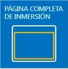
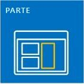
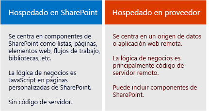

# Complementos de SharePoint
Los Complementos de SharePoint son extensiones autocontenidas de los sitios web de SharePoint que usted crea y que se ejecutan sin código personalizado en el servidor de SharePoint.
## Información general sobre Complementos de SharePoint

Hay dos tipos básicos de Complementos de SharePoint: hospedados por SharePoint y hospedados por el proveedor. Para tomar la mejor decisión sobre el tipo correcto para desarrollar su escenario, empiece por aprender qué tienen en común los dos tipos de Complementos de SharePoint.

> **NOTA**
> Una aplicación de dispositivo, como una aplicación móvil, no es realmente un "Complemento de SharePoint" incluso cuando tiene acceso a SharePoint. Lo mismo ocurre con una aplicación web que se ejecuta desde fuera de SharePoint. Si desea desarrollar alguno de estos tipos de aplicaciones, consulte  [Acceso SharePoint desde aplicaciones de dispositivo móvil y nativo](http://msdn.microsoft.com/library/42014171-5ee5-421d-9cde-413efc3aecef%28Office.15%29.aspx). 

- **Un Complemento de SharePoint es un elemento autocontenido de funciones** que amplía las capacidades de los sitios web de SharePoint para resolver problemas de negocios bien definidos.

- **Los complementos no tienen ningún código personalizado que se ejecuta en los servidores de SharePoint**. En su lugar, toda la lógica personalizada se mueve "hacia arriba" a la nube o "hacia abajo" a los equipos cliente, o "encima" a un servidor local que se encuentra fuera de la granja de SharePoint o la suscripción a SharePoint Online. Mantener código personalizado fuera de los servidores de SharePoint proporciona la seguridad a los administradores de SharePoint de que el complemento no puede dañar los servidores o reducir el rendimiento de sus sitios web de SharePoint Online.

- **La lógica de negocios en un Complemento de SharePoint puede tener acceso a los datos de SharePoint a través de una de las varias API de cliente incluidas en SharePoint**. La API que usará para su complemento depende de ciertas otras decisiones de diseño que realice.

- **Casi todos los tipos principales de componentes de SharePoint pueden formar parte de un Complemento de SharePoint**, incluidas páginas, listas, flujos de trabajo, tipos de contenido personalizado, plantillas de listas, elementos web y más.

- **Los sitios web de SharePoint donde se instalan los Complementos de SharePoint y desde los cuales los usuarios los inician se denominan webs de host.**. Los componentes de SharePoint, sin embargo, por lo general se encuentran en un sitio web especial secundario del web de host llamadoweb de complemento.

- **Los Complementos de SharePoint pueden adaptarse a un sitio web de SharePoint de varias maneras**:

|||
|:-----|:-----|
||**Como una experiencia envolvente de página completa** que puede tener el aspecto de una página de SharePoint.   |
||**Como parte de una página web, usando un tipo especial de control llamado elemento de complemento** para exponer un elemento iframe que contenga el complemento.   |
||**Como comandos de la interfaz de usuario que amplían los menús y las cintas de opciones** para listas, documentos y mucho más.   |
 
- **Todas los Complementos de SharePoint que los usuarios instalan tienen un icono en la página **Contenidos del sitio** del sitio web de SharePoint.** Al hacer clic en el icono, se ejecuta el complemento.

- **Un Complemento de SharePoint se configura por medio de un  *manifiesto del complemento***, que es un archivo XML que declara las propiedades básicas del complemento, dónde se ejecuta el complemento y qué debe hacer SharePoint cuando se inicia el complemento. Entre otras cosas, el manifiesto puede especificar qué idiomas admite el complemento, los servicios de SharePoint y la funcionalidad de la cual depende, y los permisos para elweb host que necesita el complemento. (Los Complementos de SharePoint tienen control total de su propiaweb de complemento).

- **Usted distribuye Complementos de SharePoint en paquetes de complemento** que siempre incluyen al menos el manifiesto del complemento. (Si no hay componentes de SharePoint, el manifiesto del componente puede ser la única cosa en el paquete de complemento). Si el complemento tiene componentes de SharePoint en una web de complemento, se incluyen en el paquete como un conjunto de archivos XML. Los componentes remotos que están hospedados fuera de SharePoint, como una aplicación web remota o una base de datos, no se incluyen en el paquete y se implementan separados del paquete del complemento. (Sin embargo, el manifiesto del complemento especifica las direcciones URL de los componentes remotos).

- **Los paquetes del complemento también pueden incluir Complementos de Office.** Cuando se instala el Complemento de SharePoint, el Complemento de Office se agrega a un catálogo de Complementos de Office en SharePoint. Los usuarios pueden instalarlo desde el catálogo en las aplicaciones de Office como Word o Excel.

> **SUGERENCIA**
> **Vea algunos Complementos de SharePoint en la** [Tienda Office](https://store.office.com/appshome.aspx?ui=es-ES&amp;rs=es-ES&amp;ad=ES&amp;productgroup=SharePoint) para hacerse una idea de lo que puede desarrollar. O abra un sitio web de SharePoint 2013 e instale algunos de los Complementos de SharePoint gratuitos. Simplemente navegue hasta **Contenido del sitio | Agregar un complemento | Tienda SharePoint**.

### Un par de puntos para desarrolladores veteranos de SharePoint

Hemos dejado de usar soluciones de espacio aislado que contienen código personalizado en el servidor. Todavía se admiten soluciones de espacio aislado "sin código" y soluciones de espacio aislado que contienen solo JavaScript.

Los Complementos de SharePoint no usan el modelo de objetos de SharePoint en el servidor. Los modelos de objetos en el cliente se han expandido considerablemente en SharePoint 2013. Algunas API en el modelo de objetos de servidor de SharePoint no están disponibles en los modelos de objetos de cliente. Casi en su totalidad son las clases administrativas y relacionadas con la seguridad. La lógica personalizada de SharePoint que aborda estas áreas es más apropiada para un script de Windows PowerShell o una solución de granja de servidores de SharePoint clásica. Para aprender cómo elegir entre Complementos de SharePoint, soluciones de granja de servidores clásicas de SharePoint y soluciones de espacio aislado, consulte  [Complementos para SharePoint comparadas con las soluciones de SharePoint](http://msdn.microsoft.com/library/0e9efadb-aaf2-4c0d-afd5-d6cf25c4e7a8%28Office.15%29.aspx).

## Dos formas de distribuir o vender un paquete del complemento

Puede distribuir un paquete del complemento de dos maneras:

- **Para el catálogo de complementos de una organización**, que es una colección de sitios de SharePoint dedicada en la granja local o de suscripción de SharePoint Online. Este método se usa cuando el complemento está personalizado para una organización concreta.

- **Para la  [Tienda Office](https://store.office.com/appshome.aspx?productgroup=SharePoint)**. La tienda controla el proceso de marketing por usted, desde el descubrimiento a la compra y las actualizaciones. Microsoft tiene un **Panel del vendedor** para ayudarlo a vender los complementos la Tienda Office.

Después de implementar el complemento de alguna de estas maneras, queda disponible para instalación en la página **Agregar un complemento** de los sitios web de SharePoint. Si el complemento necesita permisos para su suscripción primaria o para el web host, SharePoint solicita al usuario que instale el complemento para conceder los permisos.

Cuando tenga que actualizar un complemento para corregir un error o agregar funcionalidad, realice los cambios y aumente el número de versión del complemento en el manifiesto. A continuación, vuelva a implementar el paquete del complemento en el catálogo de complementos o la tienda. Dentro de las 24 horas, los usuarios obtienen un aviso en la interfaz de usuario de SharePoint que hay una actualización disponible. Pueden instalar la actualización con un solo clic.

## Dos tipos de Complementos de SharePoint: hospedado en SharePoint y hospedado en proveedor

### Complementos de SharePoint hospedados en SharePoint

Los complementos hospedados en SharePoint constan casi por completo de componentes de SharePoint en una web de complemento. A veces se dice que tienen su centro en SharePoint.

Al igual que todos los Complementos de SharePoint, un usuario puede ejecutar un complemento hospedado en SharePoint desde un icono en la página **Contenido del sitio** de los sitios web de SharePoint donde se está instalado. Opcionalmente, también puede tener otros dos tipos de componentes de interfaz de usuario en el web de host; elementos de aplicación y acciones personalizadas (es decir, botones de la cinta de opciones personalizada o elementos de menú). **Todo lo demás en un complemento hospedado de SharePoint se implementa en la Web de complemento.** Estos componentes se definen de forma declarativa mediante archivos XML y pueden incluir, entre otros:

||||
|:-----|:-----|:-----|
|Páginas personalizadas    |Flujos de trabajo    |Módulos (conjuntos de archivos)    |
|Plantillas de lista    |Instancias de lista y biblioteca    |Vistas y formularios de lista personalizados    |
|Tipos de contenido personalizados    |Plantillas web    |Columnas integradas (no columnas personalizadas)    |
|Elementos web integrados (no elementos web personalizados)    |Archivos de JavaScript    |Botones personalizados y elementos de menú de la web de complemento    |
 

Toda la lógica empresarial en un complemento hospedado en SharePoint usa JavaScript directamente en una página personalizada o en un archivo JavaScript al que se hace referencia desde una página personalizada. Hay una versión disponible de JavaScript del modelo de objetos de SharePoint (JSOM) para que sea más sencillo para el complemento realizar operaciones de crear, leer, actualizar y eliminar (CRUD) en los datos de SharePoint.

Las páginas personalizadas en un complemento hospedado en SharePoint generalmente son páginas ASP.NET (ASPX) y pueden hacer referencia mediante declaración a controles de SharePoint y ASP.NET predeterminados, pero no puede haber ningún código subyacente. Sin embargo, puede personalizar los controles de SharePoint con una opción de representación de cliente y JavaScript personalizado.

El JavaScript en complementos hospedados en SharePoint puede tener acceso a datos y recursos que se encuentran fuera de la web de complemento mediante alguna de las dos técnicas para solucionar de forma segura la directiva de mismo origen del explorador: una biblioteca entre dominios de JavaScript especial o una clase WebProxy de JavaScript específica. Con estas técnicas, un complemento hospedado en SharePoint puede funcionar con datos en el web de host, su suscripción primaria o en cualquier otra parte de Internet.

### Complementos de SharePoint hospedados en proveedor

Cualquier componente de SharePoint que puede estar en un complemento hospedado por SharePoint también puede ser un complemento hospedado por el proveedor. Pero los complementos hospedados por el proveedor se diferencian de los complementos hospedados por SharePoint porque incluyen al menos un componente remoto, como aplicación web, servicio o base de datos que se hospeda de forma externa de la granja de SharePoint o la suscripción de SharePoint Online. Esto podría ser un servidor en la misma red corporativa como una granja de SharePoint o un servicio de la nube. Los componentes externos pueden hospedarse en cualquier pila de hospedaje web, incluidas las de Linux, Apache, MySQL, PHP (LAMP).

> **NOTA**
> **"Proveedor" es quien posee la cuenta en la nube o el servidor.** Puede ser la misma empresa u organización que posee la granja de SharePoint o el arrendamiento de SharePoint Online donde se tiene que instalar el complemento. Pero el desarrollador del complemento también puede ser el proveedor. Normalmente, cuando se crea un complemento para una organización, la organización proporciona el hospedaje. Sin embargo, cuando se crea un complemento para varias organizaciones, es más probable que el desarrollador hospede los componentes remotos. El hospedaje de desarrollador es obligatorio si el Complemento de SharePoint se comercializa a través de la Tienda Office, ya que el desarrollador no tiene ninguna información de contacto para los compradores del complemento. En este escenario, varias instancias del complemento conocen el URI del componente remoto ya que se especifica en el manifiesto del complemento.

Tiene total flexibilidad para el marco de hospedaje que quiera usar para los componentes remotos. No tiene que usar una pila de Microsoft. Se puede usar cualquier marco de hospedaje, incluidos LAMP (Linux, servidor Apache, MySQL, PHP), MEAN (MongoDB, ExpressJS, AngularJS, Nodejs), Java, Python y otros. También se pueden usar herramientas de desarrollo que no sean de Microsoft. Además, los componentes remotos se pueden hospedar en servicios en la nube que no pertenezcan a Microsoft.

 **Puede darles a las páginas remotas el aspecto de las páginas de SharePoint** mediante un control de cromo especial.

 **Los datos remotos pueden ser blobs, memorias caché, colas de mensajes, redes de entrega de contenido (CDN), y bases de datos**, entre otras cosas. Además, las bases de datos pueden ser cualquier de tipo, incluidas las relacionales y las orientadas a objetos. Se puede tener acceso a datos remotos de diversas maneras. Por ejemplo, puede usar Servicios de conectividad empresarial (BCS) para explicitar los datos en una lista de SharePoint. Otra opción es exponer los datos en una cuadrícula en una página de una aplicación web remota.

Los **Complementos de SharePoint usan las API de SharePoint para conectarse e integrarse con las características de SharePoint**: búsqueda, flujo de trabajo, redes sociales, taxonomía, perfiles de usuario, BCS y mucho más. Esto les permite leer documentos, hacer búsquedas, conectar personas y realizar operaciones CRUD. Existe más de un conjunto de API:

- Cuando se implementan los componentes remotos con. NET, queda disponible la biblioteca de **modelo de objetos de cliente (CSOM) de SharePoint** del código administrado.

- Para los componentes remotos que no están basados en. NET, existe un conjunto de **API REST/OData** que se pueden usar para acceder a los datos de SharePoint. Se puede usar también desde un cliente .NET si prefiere trabajar con una interfaz OData.

- La **biblioteca JSOM**, citada anteriormente, no se puede usar en una página remota, pero los complementos hospedados en proveedor pueden tener páginas personalizadas de SharePoint en una web de complemento. En estas páginas, JavaScript puede usar la biblioteca JSOM.

 **Los complementos hospedados por el proveedor que tienen acceso a SharePoint son entidades de seguridad tal como los usuarios y grupos**. La entidad de complemento se debe autenticar y autorizar, tal como lo hace el usuario. El complemento necesita permisos para realizar operaciones en datos de SharePoint en el web de host. En la mayoría de los escenarios, los permisos efectivos de un usuario que trabaja con SharePoint mediante un Complemento de SharePoint son la intersección de los permisos del usuario y del complemento, aunque existen algunos escenarios en los cuales un usuario puede hacer cosas con un complemento para las que no tendría permiso de otra manera.

 **Los complementos hospedados por el proveedor pueden conectarse a cualquier servicio web público o interno**; y, a diferencia de los componentes hospedados por SharePoint, pueden **controlar los eventos de elemento de lista y lista de SharePoint**, como agregar un elemento a una biblioteca de documentos.

## Elegir la ruta de implementación de SharePoint

¿Está listo para empezar?

- **Si es un desarrollador experimentado de SharePoint, le recomendamos que empiece con complementos hospedados en SharePoint.** Son lo más parecido a los tipos de extensiones de SharePoint que haya realizado en el pasado.

     [Empezar a crear complementos hospedados en SharePoint para SharePoint](get-started-creating-sharepoint-hosted-sharepoint-add-ins.md)

- **Si es un desarrollador experimentado de aplicaciones de web ASP.NET, le recomendamos empezar con complementos hospedados en el proveedor.** Son creadas a partir de aplicaciones web.

     [Empezar a crear complementos hospedados en proveedor para SharePoint](get-started-creating-provider-hosted-sharepoint-add-ins.md)

- **Si desea desarrollar un complemento hospedado por el proveedor en una pila que no es de Microsoft, puede empezar de esta manera:**

  - Instale herramientas adecuadas para su pila, si aún no cuenta con ellas.

  - Obtenga una cuenta de desarrollador en Office 365 para realizar pruebas y depuraciones. Para obtener más detalles, visite  [Configurar un entorno de desarrollo para complementos para SharePoint en Office 365](set-up-a-development-environment-for-sharepoint-add-ins-on-office-365.md) o, si ya tiene una suscripción de Office 365, solo necesita [crear un Sitio para desarrolladores en ella](create-a-developer-site-on-an-existing-office-365-subscription.md).

  - El complemento usará las API REST/OData de SharePoint para realizar operaciones CRUD en datos de SharePoint:

  - Encontrará documentación con las explicaciones en el artículo  [Introducción al servicio REST para SharePoint 2013](get-to-know-the-sharepoint-2013-rest-service.md) y otros artículos a los que este vincula.

  - Encuentre documentación de referencia en  [Referencia a API de REST para SharePoint 2013](http://msdn.microsoft.com/library/3514e753-19f9-4b41-a1ae-f35c5ffc17d2%28Office.15%29.aspx).

  - Si no está usando Visual Studio, debe crear el archivo del manifiesto del complemento y el paquete del complemento. Para obtener más información, consulte  [Explorar la estructura del manifiesto de aplicación y el paquete de un complemento de SharePoint](explore-the-app-manifest-structure-and-the-package-of-a-sharepoint-add-in.md). El uso de Visual Studio y Microsoft Office Developer Tools para Visual Studio para crear el manifiesto y el paquete proporciona una gran cantidad de ventajas que permiten ahorrar tiempo. Le recomendamos considerarlas, incluso si usa otra herramienta para crear la aplicación web remota misma. La  [edición de la Comunidad de Visual Studio](https://www.visualstudio.com/news/vs2013-community-vs.aspx) es de acceso libre.

  - Existen complementos hospedados en el proveedor de ejemplo para algunos idiomas y plataformas que no son de Microsoft en la  [sección OfficeDev de GitHub](https://github.com/OfficeDev). Por ejemplo,  [PHP-App-for-SharePoint](https://github.com/OfficeDev/PHP-App-for-SharePoint).

> **NOTA**
> Si es principiante en SharePoint y desarrollo web, obtendrá un mayor beneficio si comienza con el curso gratuito de la Academia Virtual de Microsoft o si trabaja con un manual sobre el desarrollo de SharePoint 2013. 

## Vea también

#### Otros recursos

 [Desarrollo de soluciones principales de Microsoft SharePoint Server 2013](http://www.microsoftvirtualacademy.com/training-courses/developing-microsoft-sharepoint-server-2013-core-solutions-jump-start)
