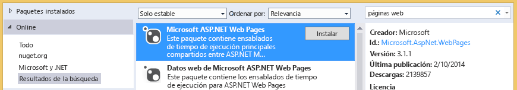

# Solucionar los problemas de las bibliotecas de documentos
En este tema conocerá los problemas que pueden surgir al obtener acceso a una biblioteca de documentos de SharePoint desde un complemento empresarial de nube y las técnicas que puede usar para resolverlos.

  
    
    

## Error: este complemento no admite la carga de documentos desde el explorador actual

Al intentar subir un documento a una biblioteca de documentos asociada en un complemento empresarial de nube, la carga falla y aparece el mensaje de error "Este complemento no admite la carga de documentos desde el explorador actual. Utilice la versión más reciente". Este problema solo aparece en algunos exploradores antiguos que no admiten la API FileReader de HTML5. Se puede solucionar agregando un paquete de NuGet al proyecto y volviendo a implementar el complemento.
  
    
    

### Para evitar el error

1. En **Explorador de soluciones**, abra el menú contextual del proyecto de **Server** y elija **Administrar paquetes de NuGet**.
    
  
2. En el cuadro de diálogo **Administrar paquetes de NuGet**, expanda el nodo **En línea** y luego, en el cuadro **Buscar en línea**, escriba páginas web, como se muestra en la ilustración 1.
    
   **Ilustración 1. Opciones seleccionadas en el cuadro de diálogo Administrar paquetes de NuGet**

  

     
  

  

  
3. En la lista de resultados, elija **Páginas web ASP.NET de Microsoft** y luego elija el botón **Instalar**.
    
    Se abre el cuadro de diálogo **Aceptación de la licencia**.
    
  
4. En el cuadro de diálogo **Aceptación de la licencia**, lea los términos de la licencia y elija el botón **Acepto** si está de acuerdo.
    
  
5. Cuando termine de instalarse el paquete, elija el botón **Cerrar**.
    
  
6. Publique el complemento actualizado en su sitio de SharePoint.
    
  

## Recursos adicionales

-  [Asociar una biblioteca de documentos con una entidad](associate-a-document-library-with-an-entity.md)
    
  

