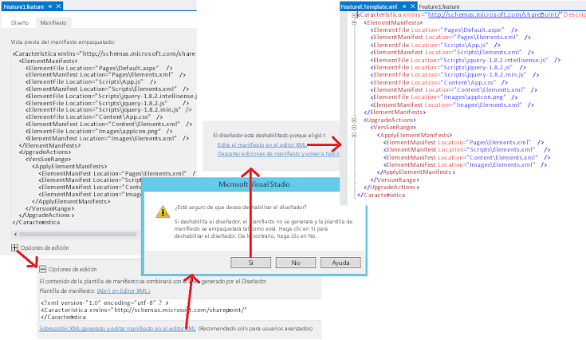

# Actualizar componentes de web de complemento en SharePoint 2013
Actualice páginas, listas, tipos de contenido y otros componentes de la web del complemento en una Complemento de SharePoint.
## Requisitos previos para actualizar los componentes de la web del complemento
<a name="Prerequisites"> </a>

Debe familiarizarse con  [Actualizar complementos para SharePoint](update-sharepoint-add-ins.md), y con los requisitos previos y conceptos principales que se incluyen en el artículo.
  
    
    
Este tema supone que ya ha desarrollado y probado la última versión del complemento tal como se describe en  [Cree y depure la nueva versión como si fuera un complemento totalmente nuevo](update-sharepoint-add-ins.md#DebugFirst).
  
    
    

## Actualización de componentes de SharePoint en la web del complemento
<a name="UpdatingAppWeb"> </a>

Todos los componentes de SharePoint implementados en la web del complemento están incluidos en las características de ámbito **Web** en el paquete del complemento. Por este motivo, la actualización de estos componentes es una simple cuestión de actualizar una o varias características. Este proceso no ha cambiado desde SharePoint 2010 y está documentado en [Procedimiento para agregar elementos a una característica existente](http://msdn.microsoft.com/library/b007f419-e0d6-4e3a-a3ae-b8e448656d02%28Office.15%29.aspx), en el SDK de SharePoint 2010. Otros artículos del nodo  [Actualización de características](http://msdn.microsoft.com/library/e917f709-6491-4d50-adbe-2ab8f35da990%28Office.15%29.aspx) también pueden resultar de utilidad, pero recuerde que los complementos no deben incluir código personalizado en el servidor de SharePoint, así que algunos aspectos de la actualización de características en SharePoint 2010 no son relevantes para la actualización de complementos. Por ejemplo, no puede usar el elemento [CustomUpgradeAction](http://msdn.microsoft.com/library/16a2182e-80aa-4184-8071-8f717ee5c572%28Office.15%29.aspx) cuando actualice la característica de una Complemento de SharePoint.
  
    
    

### Qué se puede y qué no se puede realizar de forma declarativa

Con un complemento hospedado en SharePoint, solo puede usar el formato XML para actualizar un complemento y hay algunos límites sobre cómo puede cambiar de forma declarativa un complemento en una actualización. En un complemento hospedado por el proveedor, puede implementar un  [controlador UpdatedEventEndpoint](create-a-handler-for-the-update-event-in-sharepoint-add-ins.md) para hacer cosas que no se pueden realizar de forma declarativa.
  
    
    
Es fácil agregar componentes a un complemento. Cualquier componente que cumple las condiciones para incluirse en un complemento también se puede agregar a una actualización. (Para obtener información detallada sobre los componentes que se pueden encontrar en un complemento, consulte  [Tipos de componentes de SharePoint que se pueden encontrar en un complemento para SharePoint](host-webs-add-in-webs-and-sharepoint-components-in-sharepoint-2013.md#TypesOfSPComponentsInApps)). Pero cuando desee modificar un componente existente mediante declaración, tenga en cuenta lo siguiente. 
  
    
    

- El tipo de datos de un campo de tipo de lista o contenido (columna) no puede cambiarse tras su implementación inicial bajo ninguna circunstancia. En particular, no cambie el tipo de datos de un campo como parte de una actualización de complemento ( *ni siquiera mediante programación*  ). Como alternativa, puede agregar un nuevo campo. Si el complemento incluye formularios de creación, edición o vista personalizadas de elementos, asegúrese de realizar los cambios correspondientes en estos formularios. Por ejemplo, agregue la interfaz de usuario para el nuevo campo y quite la interfaz de usuario para el antiguo. (En un complemento hospedado por el proveedor, puede mover datos mediante programación desde el campo antiguo hasta el nuevo y, a continuación, eliminar el antiguo).
    
  
- Las listas, instancias de lista, los tipos de contenido o campos no pueden eliminarse en el marcado de actualización.
    
  
- Los archivos no se pueden eliminar de la web del complemento en el marcado de actualización. Sin embargo, puede cambiar el contenido de cualquier archivo.
    
  
- Los elementos **CustomUpgradeAction** y **MapFile** no se pueden usar al actualizar una Complemento de SharePoint, aunque puede que aparezcan como disponibles en IntelliSense de Visual Studio.
    
  

### Actualizar la web del complemento por primera vez

Los procedimientos descritos en esta sección explican cómo agregar o actualizar tipos de contenido, listas, archivos y otros componentes de SharePoint en la web del complemento. Con fines de simplicidad, se da por sentado que todos los componentes forman parte de una sola característica en la web del complemento, pero una web de complemento puede tener varias características y es posible actualizar más de una en la misma actualización.
  
    
    
Las Microsoft Office Developer Tools para Visual Studio están pensadas para crear nuevos complementos y el comportamiento predeterminado de las herramientas algunas veces no es óptimo cuando se está actualizando un complemento. Para obtener más control sobre el proceso, empiece por deshabilitar el diseñador de características mediante el siguiente procedimiento, para que pueda editar directamente el XML de característica sin procesar. 
  
    
    

### Para editar la característica de XML


1. En **Explorador de soluciones**, abra el archivo  _{FeatureName}_.features. Se abre el diseñador de características.
    
  
2. Abra la pestaña **Manifiesto** y expanda **Editar opciones**.
    
  
3. Elija **Sobrescriba el XML generado y edite el manifiesto en el editor XML**.
    
  
4. Elija **Sí** cuando se le pregunte si desea deshabilitar el diseñador.
    
  
5. En la vista que se abre, elija **Edite el manifiesto en el editor XML**. Se abre el archivo  _{FeatureName}_.Template.xml. 
    
   **Apertura del editor XML de la característica**

  

     
  

  

  

> [!PRECAUCIóN]
> No agregue comentarios "<!-- -->" al archivo  _{FeatureName}_.features. La infraestructura de actualización no admite comentarios y se producirá un error en la actualización si hay comentarios en el archivo. Se usan en los ejemplos de marcado de este artículo únicamente para indicar dónde debería ir su marcado. 
  
    
    

Use los siguientes pasos para actualizar la característica de la web del complemento.
  
    
    

### Para actualizar la característica de la web del complemento por primera vez


1. Incremente el atributo **Version** del elemento [Feature](http://msdn.microsoft.com/library/265cd648-1a7e-410f-a1d7-0da8c64b4006%28Office.15%29.aspx), si las Office Developer Tools para Visual Studio no lo hicieron ya cuando aumentó el número de versión en el manifiesto del complemento. (Las herramientas no lo hacen en todos los escenarios, por lo que debe comprobarlo). Debería usar el mismo número de versión que el que usa para el complemento. Debería incluso considerar aumentar la versión de la característica cuando se actualicen otros componentes del complemento, aunque no la propia característica de la web del complemento. La lógica del elemento  [VersionRange](http://msdn.microsoft.com/library/cd715e38-6ec3-43b2-8007-6d0ed8865d91%28Office.15%29.aspx) (que se trata en la sección [Actualizaciones subsiguientes de la web del complemento](#SubsequentUpgrades)) es más fácil de administrar si la versión del complemento y la versión de la característica son siempre las mismas. 
    
  
2. No elimine nada de la sección  [ElementManifests](http://msdn.microsoft.com/library/d8d4db7e-2bc2-40c6-958b-d5683bdee87a%28Office.15%29.aspx) del archivo. Nunca debe eliminarse nada de esta sección.
    
  
3. Si aún no están presentes, agregue los siguientes elementos al archivo: 
    
  - Un elemento secundario  [UpgradeActions](http://msdn.microsoft.com/library/5af24ac1-a290-454d-b32b-bc7f7a4634f0%28Office.15%29.aspx) en el elemento **Feature**.  *No*  agregue los atributos **ReceiverAssembly** ni **ReceiverClass** al elemento. No tienen ninguna utilidad cuando se está actualizando una Complemento de SharePoint. (Estos atributos hacen referencia a un ensamblado personalizado, que no es compatible con las Complementos de SharePoint. Si incluye un ensamblado personalizado en un complemento, SharePoint no instalará el complemento).
    
  
  - Un elemento secundario **VersionRange** en el elemento **UpgradedActions**. No agregue los atributos **BeginVersion** ni **EndVersion** al elemento. No tienen ningún propósito cuando se está actualizando un complemento por primera vez. Su utilidad se tratará en la sección [Actualizaciones subsiguientes de la web del complemento](#SubsequentUpgrades).
    
  
  - Un elemento secundario  [ApplyElementManifests](http://msdn.microsoft.com/library/c087a0c3-1e27-4034-b4da-e025991454d6%28Office.15%29.aspx) en el elemento **VersionRange**. 
    
  

    Llegado este punto, el archivo debería parecerse al del siguiente ejemplo.
    
    > [!IMPORTANTE]
      > Puede que Office Developer Tools para Visual Studio ya hayan agregado el marcado anterior y hayan copiado algunos de los elementos de la sección **ElementManifests** en la sección **ApplyElementManifests** a modo ilustrativo. *Elimínelos.*  Aunque es probable que tenga que volver a incluirlos posteriormente, resulta más fácil y más seguro empezar con una sección **ApplyElementManifests** vacía. Las entradas redundantes de componentes que no hayan cambiado pueden tener serias consecuencias, como, por ejemplo, alargar tanto el proceso de actualización que el tiempo de espera se agote y se genere un error.


  ```XML
  
<Feature <!-- Some attributes omitted -->
               Version="2.0.0.0">
  <ElementManifests>
    <!-- ElementManifest elements omitted -->
  </ElementManifests>
  <UpgradeActions>
   <VersionRange>
     <ApplyElementManifests>
       
     </ApplyElementManifests>
   </VersionRange>
  </UpgradeActions>
</Feature>
  ```


### Para agregar componentes al complemento


1. Agregue los nuevos componentes a la característica de la misma forma que si estuviera creando un nuevo proyecto de una Complemento de SharePoint.
    
  
2. Cuando agrega un componente a un tipo que no estaba en la versión anterior del complemento, como cuando agrega una lista a un complemento que anteriormente no tenía una lista, la Office Developer Tools para Visual Studio agregará un archivo elements.xml al proyecto. Se trata del manifiesto de elementos para el componente. Deberá agregar el nuevo número de versión del complemento a este archivo (por ejemplo, elements.2.0.0.0.xml). Esto puede resultar útil para solucionar problemas. Asegúrese de hacer el cambio en el **Explorador de soluciones** para garantizar que las referencias al archivo, como en el archivo csproj y el XML de característica se modifican adecuadamente.
    
  
3. Para cada nuevo manifiesto de elemento, agregue un elemento  [ElementManifest](http://msdn.microsoft.com/library/5a6a2865-5d31-45a2-a402-6da6e0f5567a%28Office.15%29.aspx) como elemento secundario a los elementos **ElementManifests** y **ApplyElementManifests** del xml de característica. (Exactamente el mismo elemento **ElementManifest** en ambos lugares). El atributo **Location** del elemento debe apuntar a la ruta de acceso relativa del archivo elements.2.0.0.0.xml. Por ejemplo, si agregó una lista denominada MyCustomList, el elemento **ElementManifest** tendría el siguiente aspecto.
    
  ```XML
  
<ElementManifest Location="MyCustomList\\elements.2.0.0.0.xml" />
  ```

4. Algunos tipos de componentes agregan archivos al proyecto. Por ejemplo, cuando agrega una lista se crea un archivo schema.xml; y cuando agrega una página, se crea un archivo de páginas. Para cada archivo, agregue un elemento  [ElementFile](http://msdn.microsoft.com/library/bd43638e-8f18-4a0d-b122-1c055f97aa71%28Office.15%29.aspx) como elemento secundario al elemento **ElementManifests**. (No lo agregue al elemento **ApplyElementManifests**). El atributo **Location** debe apuntar a la ruta de acceso relativa del archivo. Por ejemplo, si agregó una lista, el elemento **ElementFile** para el archivo schema.xml tendría el siguiente aspecto.
    
  ```XML
  <ElementFile Location="MyCustomList\\Schema.xml" />
  ```

5. Cuando agrega otro elemento de un tipo que ya se encontraba en la versión anterior del complemento, las Office Developer Tools para Visual Studio pueden agregar una referencia al nuevo elemento en un manifiesto de elementos existente en lugar de crear uno nuevo. Por ejemplo, la forma estándar de agregar una página a una web del complemento es hacer clic con el botón secundario en el nodo **Páginas** en el **Explorador de soluciones** y después navegar a **Agregar | Nuevo elemento | Página | Agregar**. Las Office Developer Tools para Visual Studio agregarán un nuevo elemento **File** al módulo **Pages** en el archivo de manifiesto de elementos existente (por lo general denominado elements.xml) en vez de crear un nuevo manifiesto de elemento.
    
    Esto no es deseable. El procedimiento recomendado es evitar, siempre que sea posible, la edición de los archivos de manifiesto de elemento al actualizar un complemento (es decir, cualquier manifiesto de elemento de versiones anteriores del complemento). En general, los nuevos elementos deben estar en los nuevos archivos de manifiesto de elemento (que hacen referencia a sí mismos en el elemento **ApplyElementManifests** del XML de característica). (Más adelante se describen algunas excepciones a esta práctica). Por ejemplo, para agregar una nueva página, siga estos pasos:
    
1. Cree un nuevo módulo denominado Pages.2.0.0.0
    
  
2. Quite el archivo sample.txt que las Office Developer Tools para Visual Studio agregan automáticamente.
    
  
3. Cambie el nombre del manifiesto de elementos en el nuevo módulo a elements.2.0.0.0.xml.
    
  
4. Haga clic con el botón secundario en el módulo **Pages.2.0.0.0** y después navegue a **Agregar | Nuevo elemento | Página | Agregar**. Se crea la nueva página y se hace referencia a esta en el manifiesto de elementos de **Pages.2.0.0.0** en lugar de **Pages**.
    
  
5. Asegúrese de que hay un elemento **ElementsFile** para la nueva página en el elemento **ElementManifests** del XML de característica y asegúrese de que hay un elemento **ElementManifest** para el archivo elements.2.0.0.0.xml en las secciones **ElementManifests** y **ApplyElementManifests**.
    
  

    Otra opción en cualquier situación en la que las Office Developer Tools para Visual Studio han cambiado un manifiesto de elementos existente es crear manualmente un nuevo archivo elements.2.0.0.0.xml y mover el marcado que se agregó al manifiesto antiguo al nuevo. (Si lo desea, puede colocar el nuevo en el mismo nodo **Explorador de soluciones** del anterior).
    
  
6. Si agrega un campo a un tipo de contenido en la característica, agregue un elemento  [AddContentTypeField](http://msdn.microsoft.com/library/cb04a3ac-f41a-4ffe-aaa1-d4bf3fb6347d%28Office.15%29.aspx) a la sección **VersionRange**. Asegúrese de asignar los valores correctos a los atributos **ContentTypeId** y **FieldId**. Opcionalmente, use el atributo **PushDown** para especificar si se debería agregar el nuevo campo a cualquier tipo de contenido derivado. A continuación se muestra un ejemplo.
    
  ```XML
  <VersionRange>
  <AddContentTypeField 
    ContentTypeId="0x0101000728167cd9c94899925ba69c4af6743e"
    FieldId="{CCDD361F-A3FB-40D8-A272-3A3C858F4116}"
    PushDown="TRUE" />
  <!-- Other child elements of VersionRange -->
</VersionRange>
  ```


### Para modificar los componentes existentes del complemento


1. Si cambió un archivo al que se hace referencia en un archivo del manifiesto de elementos, como un archivo Default.aspx, no tiene que cambiar el elemento **ElementFile** del archivo. Pero sí tiene que indicar a la infraestructura de actualización que reemplace la versión anterior del archivo con la nueva. Para ello, agregue un elemento **ElementManifest** para el módulo a la sección **ApplyElementManifests**. Como ya existe un elemento de ese tipo en la sección **ElementManifests**, copiarlo simplemente (no moverlo) a **ApplyElementManifests** es una opción a veces, pero esto es solo es recomendable si se han cambiado todos los archivos a los que se hace referencia en el manifiesto. Por lo general, no debe reemplazar un archivo sin modificar con copia de sí mismo. En algunos escenarios esto puede tener efectos negativos. Por ejemplo, si la página está configurada para permitir que los usuarios la personalicen, reemplazarla puede hacer que las personalizaciones se eliminen. (Si efectivamente cambió la página, tendría que aceptar esta consecuencia, pero no querrá imponer este inconveniente a sus clientes en vano).
    
    Para asegurarse de que solo se reemplazan los archivos modificados en el módulo, cree un segundo manifiesto de elemento para el módulo que solo haga referencia a los archivos modificados y aplique el segundo manifiesto en **ApplyElementManifests** mediante los siguientes pasos.
    
1. Haga clic con el botón secundario en el nodo del módulo en el **Explorador de soluciones** y agregue un archivo XML (no una página) denominado elements.2.0.0.0.xml.
    
  
2.  Seleccione el nuevo archivo en el **Explorador de soluciones** para hacer que su panel de propiedades esté visible y cambie la propiedad **Deployment Type** a **ElementManifest**. Esto es importante para asegurarse de que las Office Developer Tools para Visual Studio administran el archivo correctamente.
    
  
3. Copie el contenido del manifiesto original al nuevo y, a continuación, elimine del nuevo manifiesto todos los elementos  [File](http://msdn.microsoft.com/library/c270e4ce-8110-4da7-b0e7-c223604bfce7%28Office.15%29.aspx) que corresponden a los archivos que **no** han cambiado.
    
  
4. Agregue un elemento **ElementManifest** a la sección **ApplyElementManifests** que haga referencia al nuevo archivo de manifiesto tal como se muestra en este ejemplo.
    
  ```XML
  
<ElementManifest Location="Pages\\elements.2.0.0.0.xml" />
  ```


    > [!NOTA]
      >  No elimine el manifiesto original. El XML de característica usa tanto el nuevo como el antiguo.>  No copie ningún elemento **ElementFile** de la sección **ElementManifests** a la sección **ApplyElementManifests** incluso si se ha modificado el archivo al que se hace referencia en **ElementFile**. 
2. Abra todos los archivos de manifiesto de elemento a los que se hace referencia en la sección **ApplyElementManifests** y asegúrese de que todos los elementos [File](http://msdn.microsoft.com/library/c270e4ce-8110-4da7-b0e7-c223604bfce7%28Office.15%29.aspx) tengan un atributo **ReplaceContents** y se establezcan en **TRUE**. A continuación se muestra un ejemplo. Es posible que las Office Developer Tools para Visual Studio ya lo hayan hecho, pero debe comprobarlo. Realice esta acción incluso para los manifiestos de elementos de las versiones anteriores del complemento. Este es uno de los pocos métodos en los que es una buena práctica editar un archivo de manifiesto de elemento existente.
    
  ```XML
  <Module Name="Pages">
  <File Path="Pages\\Default.aspx" Url="Pages/Default.aspx" ReplaceContent="TRUE" />
</Module>
  ```

3. Las páginas pueden tener elementos web insertados en ellas, tal como se explica en  [Incluir un elemento web en una página web de aplicación](include-a-web-part-in-a-webpage-on-the-add-in-web.md). Si cambia una página que tiene un elemento web en ella (o cambia las propiedades del elemento web), hay un paso adicional: tiene que agregar el siguiente marcado a la página para impedir que SharePoint agregue una segunda copia del elemento web en la página. El marcado debe agregarse al elemento **asp:Content** con el identificador `PlaceHolderAdditionalPageHead`. (Es posible que las Office Developer Tools para Visual Studio ya lo hayan agregado cuando se creó la página, pero debe comprobar que esté ahí).
    
  ```XML
  
<meta name="WebPartPageExpansion" content="full" />
  ```


    > [!NOTA]
      >  Si la página se configuró para permitir que los usuarios la personalicen, este marcado tiene el efecto secundario de eliminar las personalizaciones. Los usuarios tendrán que repetirlas.>  Si el elemento web se agregó a la página siguiendo las indicaciones de [Incluir un elemento web en una página web de aplicación](include-a-web-part-in-a-webpage-on-the-add-in-web.md), el marcado del elemento web se encuentra en el manifiesto de elementos, por lo que cambiar las propiedades del elemento web es una excepción a la regla general de que no debe editarse un archivo de manifiesto de elemento como parte de una actualización de complemento. 
4. Como alternativa a cambiar una página, también tiene la opción de usar el redireccionamiento a una página nueva siguiendo estos pasos. 
    
1. Cree la nueva página y configure su marcado de actualización como se describe en el procedimiento **Para agregar componentes al complemento** explicado más arriba.
    
  
2. Abra la página anterior y quite todo el marcado del elemento **asp:Content** con el identificador `PlaceHolderAdditionalPageHead`. 
    
  
3. Agregue el siguiente marcado al elemento **asp:Content** y, a continuación, reemplace _{RelativePathToNewPageFile}_ con la nueva ruta de acceso y nombre de archivo. Este script redireccionará el explorador a la nueva página e incluirá los parámetros de consulta. También mantendrá la página anterior fuera del historial del explorador.
    
  ```
  <script type="text/javascript">
        var queryString = window.location.search.substring(1);
        window.location.replace("{RelativePathToNewPageFile}" + "?" + queryString);
</script>
  ```

4. Elimine los demás elementos **asp:Content** de la página.
    
  
5. Si la página que va a reemplazar es la página de inicio del complemento, cambie el elemento **StartPage** en el manifiesto del complemento para que apunte a la nueva página.
    
  
5. Si la web del complemento contiene **CustomAction** o **ClientWebPart**, y la modifica como parte de una actualización, debe modificar el manifiesto del elemento ya que es ahí donde se definen estos componentes. (Se trata de una excepción a la práctica general de no editar un manifiesto de elemento de una versión anterior del complemento cuando este se actualiza). También tiene que copiar (no mover) el elemento **ElementManifest** de la sección **ElementManifests** a la sección **ApplyElementManifests**.
    
  

#### Ejemplo de XML de característica para actualizar un complemento por primera vez

A continuación, se muestra un ejemplo de un archivo  _{FeatureName}_.Template.xml completo para una primera actualización de un complemento. El complemento actualizado en este ejemplo incluye un archivo Default.aspx modificado al que se hace referencia en el archivo  `Pages\\Elements.xml`, e implementa tres nuevos archivos jQuery, a los que se hace referencia en el archivo  `Scripts\\Elements.xml`. Tenga en cuenta que todos los **ElementFile** se encuentran en la sección **ElementManifests** y de qué manera se ha copiado (no movido) `<ElementManifest Location="Pages\\Elements.xml" />` de la sección **ElementManifests** a la sección **ApplyElementManifests**.
  
    
    

```XML

<Feature xmlns="http://schemas.microsoft.com/sharepoint/" Title="MyApp Feature1"
      Description="SharePoint Add-in Feature" Id="85d309a8-107e-4a7d-b3a2-51341d3b11ff" 
      Scope="Web" Version="2.0.0.0">
  <ElementManifests>
    <ElementFile Location="Pages\\Default.aspx" />
    <ElementManifest Location="Pages\\Elements.xml" />
    <ElementFile Location="Content\\App.css" />
    <ElementManifest Location="Content\\Elements.xml" />
    <ElementFile Location="Images\\AppIcon.png" />
    <ElementManifest Location="Images\\Elements.xml" />
    <ElementFile Location="Scripts\\jquery-3.0.0.intellisense.js" />
    <ElementFile Location="Scripts\\jquery-3.0.0.js" />
    <ElementFile Location="Scripts\\jquery-3.0.0.min.js" />
  </ElementManifests> 
  <UpgradeActions>
      <VersionRange>      
        <ApplyElementManifests>
          <ElementManifest Location="Pages\\Elements.xml" />
          <ElementManifest Location="Scripts\\elements.2.0.0.0.xml" />
        </ApplyElementManifests>
      </VersionRange>
  </UpgradeActions>
</Feature>

```


### Actualizaciones subsiguientes de la web del complemento
<a name="SubsequentUpgrades"> </a>

Cuando actualiza una Complemento de SharePoint por segunda (tercera, etc.) vez, debe tener en cuenta que es posible que algunos de los usuarios no hayan realizado las actualizaciones anteriores. Así que si un usuario responde al mensaje de "hay una actualización disponible" después de que se haya implementado la última versión de la actualización en el catálogo de complementos de la organización o en la Tienda Office, es posible que su instancia del complemento se actualice a través de varias versiones en un único proceso de actualización. En la mayoría de los casos, esto es exactamente lo que debería suceder: todas las versiones anteriores del complemento deben actualizarse a la última versión. Pero no siempre querrá que todas las acciones de actualización para la característica de la web del complemento vuelvan a aplicarse para cada instancia del complemento. Hay algunas acciones de actualización que no deberían suceder varias veces en una determinada instancia del complemento. Por ejemplo, si agrega un campo a un tipo de contenido en una actualización, no desea que ese campo se vuelva a agregar en la siguiente actualización. El siguiente procedimiento muestra cómo usar el elemento **VersionRange** para controlar cuáles son las acciones de actualización que se realizan en función de la versión de la característica que se está actualizando.
  
    
    

### Para cambiar la característica de la web del complemento en posteriores actualizaciones


1. Abra el archivo  _FeatureName_.Template.xml para su edición tal como se describe en el procedimiento **Para editar la característica de XML** anteriormente en este artículo, e incremente el atributo **Version** del elemento [Feature](http://msdn.microsoft.com/library/265cd648-1a7e-410f-a1d7-0da8c64b4006%28Office.15%29.aspx). Deberá usar para la característica el mismo número de versión que usó para el complemento.
    
    Con el fin de mostrar un ejemplo continuado, supongamos que anteriormente actualizó el complemento de la versión 1.0.0.0 a la versión 2.0.0.0, y ahora la está actualizando a la versión 3.0.0.0. Así que defina el atributo **Version** como 3.0.0.0.
    
  
2. Agregue un nuevo elemento **VersionRange** debajo de todos los elementos **VersionRange** existentes. *No*  agregue un atributo **BeginVersion** ni **EndVersion** a este elemento.
    
  
3. Rellene el elemento **VersionRange** tal como se describe en el procedimiento **Para actualizar la característica de la web del complemento por primera vez** anteriormente en este artículo para tener en cuenta los cambios que se han aplicado en esta versión actualizada de la característica. Siempre que el procedimiento haga referencia a la sección **ApplyElementManifests**, trate esto como referencia al elemento **ApplyElementManifests** que es un elemento secundario del elemento **VersionRange** que acaba de agregar; es decir, el *más bajo*  en el archivo XML de la característica.
    
  
4. Vaya al elemento **VersionRange** anterior, el que agregó la última vez que actualizó el complemento (de la versión 1.0.0.0 a la 2.0.0.0 en el ejemplo continuado), y agréguele un atributo **EndVersion**. Queremos que las acciones de actualización en este elemento **VersionRange** se apliquen a cualquier versión el complemento a la que aún no se hayan aplicado (versión 1.0.0.0), pero no queremos que se vuelvan a aplicar a las versiones a las que ya se hayan aplicado (versión 2.0.0.0). El valor de **EndVersion** es *exclusivo*  , así que deberá establecerlo en la versión inferior a la que *no*  desea que se apliquen las acciones de actualización. En el ejemplo continuado, se establece en 2.0.0.0. Su archivo ahora debería tener el siguiente aspecto.
    
  ```XML
  
<Feature <!-- Some attributes omitted -->
               Version="3.0.0.0">
  <ElementManifests>
    <!-- ElementManifest elements omitted -->
  </ElementManifests>
  <UpgradeActions>
    <VersionRange EndVersion="2.0.0.0">
      <!--  Child elements for upgrade from 1.0.0.0 to 2.0.0.0 go here. -->
    </VersionRange>
   <VersionRange>
      <!--  Child elements for upgrade from 2.0.0.0 to 3.0.0.0 go here. -->
   </VersionRange>
  </UpgradeActions>
</Feature>
  ```


    Cada vez que actualice la característica, siga el mismo patrón. Agregue un nuevo elemento **VersionRange** para las acciones de actualización más recientes. A continuación, agregue un elemento **EndVersion** al elemento **VersionRange** *anterior*  y establézcalo en el número de versión anterior. En el ejemplo continuado, el archivo tendría el siguiente aspecto para una actualización de la versión 3.0.0.0 a la 4.0.0.0.
    


  ```XML
  
<Feature <!-- Some attributes omitted -->
               Version="4.0.0.0">
  <ElementManifests>
    <!-- Child elements omitted -->
  </ElementManifests>
  <UpgradeActions>
    <VersionRange EndVersion="2.0.0.0">
       <!-- Child elements for upgrade from 1.0.0.0 to 2.0.0.0 go here. -->
    </VersionRange>
    <VersionRange EndVersion="3.0.0.0">
       <!-- Child elements for upgrade from 2.0.0.0 to 3.0.0.0 go here. -->
    </VersionRange>
    <VersionRange>
       <!-- Child elements for upgrade from 3.0.0.0 to 4.0.0.0 go here. -->
    </VersionRange>
  </UpgradeActions>
</Feature>
  ```


    Observe que el elemento **VersionRange** más reciente no tiene ningún atributo **BeginVersion** ni **EndVersion**. Esto asegura que las acciones de actualización que van dentro de este elemento **VersionRange** se aplicarán a todas las versiones anteriores de la característica, que es lo deseable ya que todos los cambios aparecen referenciados en este **VersionRange**, y ninguno de ellos se ha producido aún para ninguna instancia de la característica.
    
    Observe también que el atributo **BeginVersion** no se usa en ninguno de los elementos **VersionRange**. Esto se debe a que el valor predeterminado para el atributo **BeginVersion** es 0.0.0.0, que es el valor deseado porque queremos que todas las acciones de actualización se apliquen a todas las instancias del complemento anteriores a la versión especificada en el atributo **EndVersion**. 
    
    > [!IMPORTANTE]
      >  El elemento **VersionRange** determina solo cuáles son las versiones de la característica a las que se aplican las actualizaciones. No determina cuáles son las versiones del complemento que reciben una notificación de que hay una actualización disponible (la notificación se desencadena únicamente mediante el número de versión del complemento). En las 24 horas siguientes a la publicación de una nueva versión del complemento en el catálogo de complementos de la organización o en la Tienda Office, todas las instancias instaladas del complemento, independientemente de la versión, muestran la notificación de que hay una actualización disponible en su icono de la página **Contenido del sitio**. >  El elemento **VersionRange** no afecta al nuevo número de versión de la característica ni del complemento recién actualizados. Estos dos números siempre se cambian al último número de versión, independientemente del rango de versiones en el que estaba la característica antes de la actualización. Esto ofrece otra buena razón para evitar el uso de un atributo **BeginVersion**. El atributo **BeginVersion** se puede usar para bloquear algunas acciones de actualización para que nunca se lleven a cabo en algunas instancias del complemento. Pero no puede bloquear el hecho de que las versiones de la característica o el complemento se incrementen a la versión más reciente. De manera que el uso de un atributo **BeginVersion** podría crear la situación en la que dos instancias del complemento tuvieran el mismo número de versión de complemento y el mismo número de versión de la característica de la web del complemento, pero que tuvieran diferentes componentes en sus webs de complemento.

## Comprobación de la implementación de los componentes de la web del complemento
<a name="VerifyDeployAppWebComp"> </a>

Siga estos pasos para comprobar la implementación de la característica de la web del complemento y sus componentes.
  
    
    

### Para comprobar el aprovisionamiento de la web del complemento


1. Abra la página **Configuración del sitio** de la web del host. En la sección **Administración de la colección de sitios**, seleccione el vínculo **Jerarquía de sitios**.
    
  
2. En la página **Jerarquía de sitios**, verá que la web del complemento se indica mediante la dirección URL. No inicie el complemento; copie la dirección URL y úsela en los pasos siguientes.
    
  
3. Vaya a  _URL_de_la_web_de_apl_/_layouts/15/ManageFeatures.aspx y, en la página **Características del sitio** que se abre, compruebe que la característica se encuentre en la lista alfabética de las características que su estado es **Activo**. 
    
  
4. Si la característica de la web del complemento incluye columnas del sitio personalizadas, abra  _URL_de_la_web_de_apl_/_layouts/15/mngfield.aspx y, en la página **Columnas del sitio** que se abre, compruebe que en la lista aparecen las nuevas columnas del sitio personalizadas.
    
  
5. Si la característica de la web del complemento incluye algún tipo de contenido personalizado, abra  _URL_de_la_web_de_apl_/_layouts/15/mngctype.aspx y, en la página **Tipos de contenido de sitio** que se abre, compruebe que en la lista aparecen los nuevos tipos de contenido.
    
  
6. Para cada tipo de contenido personalizado, y para cada tipo de contenido al que haya agregado una columna, elija el vínculo al tipo de contenido. En la página **Tipo de contenido del sitio** que aparece, compruebe que el tipo de contenido tiene las columnas del sitio que le corresponden.
    
  
7. Si la característica de la web del complemento incluye instancias de listas, abra  _URL_de_la_web_de_apl_/_layouts/15/mcontent.aspx y, en la página **Bibliotecas y listas del sitio** que se abre, compruebe que haya un vínculo **Personalizar "nombre_de_la_lista"** para cada instancia de lista personalizada.
    
  
8. Para cada una de estas instancias de listas personalizadas, elija el vínculo **Personalizar "nombre_de_la_lista"** y compruebe en la página de configuración de la lista que la lista tiene las columnas y los tipos de contenido esperados.
    
    > [!NOTA]
      > Si en la página no hay ninguna sección **Tipos de contenido**, habilite la administración de tipos de contenido. Elija el vínculo **Configuración avanzada** y, en la página Configuración avanzada, habilite la administración de tipos de contenido y luego elija **Aceptar**. Se le redirige a la página anterior, donde ahora aparece una lista de la sección **Tipos de contenido**. 
9. Cerca de la parte superior de la página se encuentra la **dirección web** de la lista. Si incluyó elementos de ejemplo en la definición de la instancia de lista, copie la dirección y péguela en la barra de direcciones del explorador y luego navegue hasta la lista. Compruebe que la lista contiene los elementos de ejemplo que creó.
    
  

## Pasos siguientes
<a name="Next"> </a>

Vuelva a  [Pasos principales en la actualización de un complemento](update-sharepoint-add-ins.md#MajorAppUpgradeSteps), o visite directamente uno de los siguientes artículos para aprender a actualizar el siguiente principal componente de su Complemento de SharePoint.
  
    
    

-  [Actualizar componentes de web de host en SharePoint 2013](update-host-web-components-in-sharepoint-2013.md)
    
  
-  [Crear un controlador para el evento de actualización en complementos de SharePoint](create-a-handler-for-the-update-event-in-sharepoint-add-ins.md)
    
  
-  [Actualizar componentes remotos en complementos de SharePoint](update-remote-components-in-sharepoint-add-ins.md)
    
  

## Recursos adicionales
<a name="bk_addresources"> </a>


-  [Actualizar complementos para SharePoint](update-sharepoint-add-ins.md)
    
  
-  [Procedimiento para agregar elementos a una característica existente](http://msdn.microsoft.com/library/b007f419-e0d6-4e3a-a3ae-b8e448656d02%28Office.15%29.aspx) en el Kit de desarrollo de software (SDK) de Microsoft SharePoint 2010.
    
  
-  [Actualización de características](http://msdn.microsoft.com/library/e917f709-6491-4d50-adbe-2ab8f35da990%28Office.15%29.aspx) en el Kit de desarrollo de software (SDK) de Microsoft SharePoint 2010.
    
  

