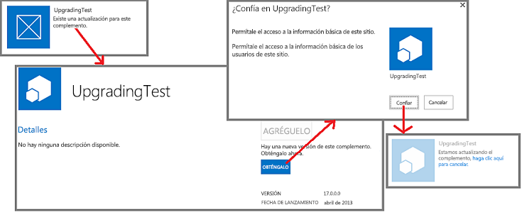

# Actualizar complementos para SharePoint
Aprenda a crear e implementar una actualización para una Complemento de SharePoint.
Puede actualizar su Complemento de SharePoint mediante el soporte a la actualización integrado en SharePoint 2013. En las 24 horas siguientes a la carga de una versión actualizada del complemento en el catálogo de complementos de una organización o a la aceptación del complemento en la Tienda Office, aparece una notificación de que hay disponible una actualización junto al complemento en la página **Contenido del sitio** de cada sitio web donde esté instalado. Como puede ver en la figura 1, se proporciona un vínculo para que los usuarios puedan instalar inmediatamente la actualización.
  
    
    

**Figura 1. Proceso de actualización de complementos para SharePoint**

  
    
    

  
    
    

  
    
    
Un usuario puede instalar la aplicación sin desinstalar primero la versión anterior. La infraestructura de actualización comprueba la instalación de la actualización y la revierte si se produce algún error.
    
> **IMPORTANTE**
> No puede cambiar el  *tipo de complemento*  mediante el sistema de actualización. Por ejemplo, no se puede cambiar el hospedaje de un complemento que esté hospedado por SharePoint para que lo hospede un proveedor mediante una actualización. Para realizar un cambio, debe [migrar de un complemento antiguo a uno nuevo](sharepoint-add-ins-update-process.md#Major). En particular, desde que se  [cerró el programa de vista previa para complementos autohospedados](http://blogs.office.com/2014/05/16/update-on-autohosted-apps-preview-program/), debe tener en cuenta que no se puede actualizar un complemento autohospedado a un complemento hospedado por el proveedor. Debe convertir el complemento, tal como se explica en  [Convertir un complemento autohospedado por SharePoint en uno hospedado por el proveedor](convert-an-autohosted-sharepoint-add-in-to-a-provider-hosted-add-in.md). 
  
    
    

## Requisitos previos para la actualización de un complemento para SharePoint

  
    
    

- Una instalación de SharePoint 2013 de prueba que está configurada para el aislamiento del complemento. Vea  [Configurar un entorno de desarrollo para complementos para SharePoint en Office 365](set-up-a-development-environment-for-sharepoint-add-ins-on-office-365.md) para obtener instrucciones sobre cómo configurar un Sitio para desarrolladores de Office 365.
    
  
- Normalmente, las herramientas que se usan para la creación de una Complemento de SharePoint también se usan para su actualización. Por ejemplo, la mayoría de los desarrolladores usan Visual Studio y Microsoft Office Developer Tools para Visual Studio para crear las Complementos de SharePoint.
    
  

### Conceptos básicos para actualizar un complemento para SharePoint

  
    
    

**Tabla 1. Conceptos básicos para actualizar un complemento para SharePoint**

|**Título del artículo**|**Descripción**|
|:-----|:-----|
| [Elegir patrones para desarrollar y hospedar un complemento para SharePoint](choose-patterns-for-developing-and-hosting-your-sharepoint-add-in.md)   |Obtenga información sobre los diferentes tipos de Complementos de SharePoint. El proceso de actualización varía en función del tipo.    |
| [Proceso de actualización de complementos para SharePoint](sharepoint-add-ins-update-process.md)   |Obtenga información sobre el proceso de actualización de Complementos de SharePoint.    |
| [Actualización de características](http://msdn.microsoft.com/library/e917f709-6491-4d50-adbe-2ab8f35da990%28Office.15%29.aspx)   |Obtenga información sobre la actualización de características (SDK de SharePoint 2010).    |
| [Implementación e instalación de aplicaciones para SharePoint: métodos y opciones](deploying-and-installing-sharepoint-add-ins-methods-and-options.md)   |Aprenda sobre los métodos para publicar, instalar y desinstalar una Complemento de SharePoint.    |
| [Controlar eventos en los complementos de SharePoint](handle-events-in-sharepoint-add-ins.md)   |Obtenga información sobre receptores de eventos remotos en SharePoint 2013.    |
   

## Pasos principales en la actualización de un complemento

A continuación se indican los pasos principales que pueden ser necesarios al crear y actualizar una Complemento de SharePoint. Cada paso se describe en detalle en las secciones o artículos vinculados. No todos los pasos son necesarios en todos los proyectos de actualización. Lo que deba hacer en cada caso dependerá de los componentes que ya se encuentran en el complemento y en los componentes que se están agregando. Solo los elementos marcados con ***** son siempre obligatorios.
  
    
    

- Actualizar el manifiesto del complemento.
    
  - ***** Incrementar el número de **Version** en el elemento [Aplicación](http://msdn.microsoft.com/library/d5f30dfe-7500-5f85-0f08-f4f220c0c692%28Office.15%29.aspx) del archivo appmanifest.xml. (Los complementos se llamaban "aplicaciones" la primera vez que se lanzó el esquema.) *No*  cambiar el número de **ProductID**.
    
  
  - Cambiar la sección  [AppPermissionRequests](http://msdn.microsoft.com/library/4e617622-78d3-3d23-677d-9957eb1fb107%28Office.15%29.aspx) del archivo appmanifest.xml.
    
  
  - Cambiar la sección  [AppPrerequisites](http://msdn.microsoft.com/library/7622b55f-01a1-2c39-9daa-7cfb1a3c890f%28Office.15%29.aspx) del archivo appmanifest.xml.
    
  

    Para más información, vea  [Actualización de la versión del complemento, las solicitudes de permisos y los requisitos previos.](#UpdateManifest).
    
  
- Agregar o actualizar el marcado para los componentes de la web de complemento. Para más información, consulte  [Actualizar componentes de web de complemento en SharePoint 2013](update-add-in-web-components-in-sharepoint-2013.md).
    
  
- Agregar o actualizar el marcado para los componentes de la web de host. Para más información, consulte  [Actualizar componentes de web de host en SharePoint 2013](update-host-web-components-in-sharepoint-2013.md).
    
  
- Agregar lógica personalizada a un  [UpgradedEventEndpoint](http://msdn.microsoft.com/library/09a93d44-d295-47bb-f91c-d243178b0f53%28Office.15%29.aspx) y registrarlo en el archivo appmanifest.xml. Para más información, vea [Crear un controlador para el evento de actualización en complementos de SharePoint](create-a-handler-for-the-update-event-in-sharepoint-add-ins.md).
    
  
- Actualizar los componentes remotos:
    
  - Para un complemento hospedado por el proveedor, actualizar los componentes remotos mediante las técnicas adecuadas para la pila de plataformas de hospedaje.
    
  

    Para obtener más información, consulte  [Actualizar componentes remotos en complementos de SharePoint](update-remote-components-in-sharepoint-add-ins.md).
    
  
- ***** Cargar el paquete del complemento a la Tienda Office o al catálogo de complementos de la organización.
    
  

## Procedimientos recomendados para la actualización de complementos

Las siguientes secciones describen los procedimientos que debería seguir, así como importantes puntos que tener en cuenta durante la planeación de una actualización.
  
    
    

### Decida si realmente necesita actualizar

Para una Complemento de SharePoint hospedada por el proveedor, las mejoras en el complemento no requieren necesariamente la actualización del complemento. Si todos los cambios se realizan en componentes remotos, y tales cambios no deben reflejarse en los componentes de SharePoint, puede cambiar los componentes remotos sin actualizar el complemento. Mientras no cambien las direcciones URL ni las cadenas de conexión que usan los componentes de SharePoint para acceder a los componentes remotos, la Complemento de SharePoint seguirá trabajando. Por ejemplo, suponga que agrega un botón a una aplicación web remota que lee una columna de una lista de SharePoint que la aplicación web no leía anteriormente. Si la columna ya existía en la lista, no tiene que cambiar nada en SharePoint. Puede cargar la página web revisada y el código subyacente o JavaScript revisado, a la aplicación web remota. La nueva función estará inmediatamente disponible para los usuarios cuando inicien la Complemento de SharePoint.
  
    
    

### Recuerde que la actualización es opcional para los usuarios

Cuando se lanza una nueva versión de la Complemento de SharePoint en la Tienda Office o en el catálogo de complementos de la organización, aparece un mensaje en el icono del complemento en la página **Contenido del sitio** que informa a los usuarios de que hay una actualización disponible. El mensaje aparece antes de las 24 horas. Pero nada en la infraestructura de SharePoint obliga a los usuarios a actualizarla. Por este motivo, los cambios que realice en los componentes remotos no deberán interrumpir el funcionamiento de las versiones antiguas del complemento. Una regla general, aunque no universal, es que debería *agregar*  cosas a los componentes remotos, pero evitar eliminar, cambiar el nombre, mover o cambiar el esquema, la cadena de conexión o la dirección URL de cualquiera de los componentes existentes.
  
    
    
Si un componente remoto necesita conocer la versión de la instancia del complemento que lo llama, puede pasar esa información desde SharePoint. Por ejemplo, puede agregar la versión del complemento como un parámetro de consulta en la dirección URL de  [StartPage](http://msdn.microsoft.com/library/3092674c-a6c3-9021-3d7e-e716562a4a4f%28Office.15%29.aspx) del complemento.
  
    
    

### Cree y depure la nueva versión como si fuera un complemento totalmente nuevo

Debería separar el desarrollo y la depuración de la nueva versión del complemento de la depuración del marcado y la lógica de la actualización. Para ello, desinstale la versión anterior del complemento del sitio de SharePoint de prueba de desarrollo. Guarde una copia de seguridad del archivo del paquete del complemento de la versión anterior. Agregue y cambie componentes del complemento según sea necesario y luego pruébelos y depúrelos en el sitio de prueba tal como haría si fuera un complemento totalmente nuevo que estuviera creando desde cero.
  
    
    

### Pruebe la actualización con cada una de las versiones anteriores del complemento

Cuando la nueva versión del complemento esté funcionando correctamente como un complemento "nuevo", reestructure el código y el marcado de forma que el proyecto sea una actualización del complemento antiguo. Por ejemplo, incremente el número de versión del complemento tal como se indica en  [Pasos principales en la actualización de un complemento](#MajorAppUpgradeSteps). Para más información sobre la conversión del proyecto en una actualización, vea los temas secundarios de este tema.
  
    
    
Cuando esté preparado para probar la actualización, retire la nueva versión del sitio de prueba y vuelva a implementar la versión anterior de forma que pueda probar la lógica de actualización. Si ha lanzado varias versiones anteriores del complemento, instale cada una de las versiones anteriores en una subweb diferente del sitio de prueba. A continuación, cargue la última versión del complemento al catálogo de complementos del sitio de prueba y actualice todas las instancias del complemento. Compruebe que todas tienen el último número de versión de complemento y la versión más reciente de todos los componentes. Si hay una web de complemento en el complemento, compruebe que los componentes de la web de complemento se han implementado mediante el procedimiento  [Comprobación de la implementación de los componentes de la web del complemento](update-add-in-web-components-in-sharepoint-2013.md#VerifyDeployAppWebComp).
  
    
    

### Actualice un complemento sin esperar las 24 horas

Cuando se desarrolla una actualización para un complemento en su sitio de prueba de SharePoint, resulta muy poco práctico esperar 24 horas entre actualizaciones. Los usuarios de un sitio de producción de SharePoint pueden actualizar un complemento inmediatamente después de cargarlo a la Tienda Office o al catálogo de complementos de la organización con estos pasos:
  
    
    

### Para actualizar inmediatamente un complemento

1. Después de que se cargue la última actualización en el catálogo de complementos, abra la página **Contenido del sitio** en el sitio web en el que está instalado el complemento y elija el botón **...** en el icono del complemento.
    
  
2. En la llamada que se abre, elija la pestaña **Acerca de**. En la página **Acerca de** que se abre, hay un mensaje que indica que hay una nueva versión disponible.
    
  
3. Elija el botón **Obtener**. Se vuelve a abrir la página **Contenido del sitio** y ahí aparece un mensaje en el icono del complemento que indica que el complemento se está actualizando.
    
  
La figura 2 ilustra estos pasos.
  
    
    

**Figura 2. Proceso para la actualización inmediata de un complemento para SharePoint**

  
    
    

  
    
    

  
    
    

    
> **NOTA**
> Si necesita ver el aviso "actualización disponible" en el icono del complemento con mayor frecuencia que cada 24 horas, puede usar el método descrito en  [Proceso de actualización de un complemento para SharePoint](sharepoint-add-ins-update-process.md#Minor) para hacer que el aviso aparezca de forma inmediata.
  
    
    

## Actualización de la versión del complemento, las solicitudes de permisos y los requisitos previos.

Después de hacer una copia de seguridad de la carpeta del proyecto de Visual Studio, abra el proyecto del complemento. Abra el manifiesto del complemento e incremente el número de versión en la pestaña **General** del diseñador del manifiesto.
  
    
    
Si la versión actualizada del complemento necesita más (o menos) permisos a componentes de la web de host, realice los cambios necesarios a la sección  [AppPermissionRequests](http://msdn.microsoft.com/library/4e617622-78d3-3d23-677d-9957eb1fb107%28Office.15%29.aspx) del complemento. En Visual Studio, use la pestaña **Permisos** del diseñador del manifiesto. Cuando se actualiza un complemento, siempre se solicitará al usuario conceder los permisos, tanto si estos han cambiado o no desde la última versión. Si la nueva versión requiere *menos*  permisos que la versión anterior, los permisos adicionales de la versión anterior *no quedan revocados*  . La única manera de limitar un complemento a los permisos que la versión anterior requería es que el usuario abra la página *{SharePointDomain}*  `/_layouts/15/appinv.aspx` después de haber actualizado el complemento e introduzca manualmente los permisos que cumplan con el esquema de [AppPermissionRequests](http://msdn.microsoft.com/library/4e617622-78d3-3d23-677d-9957eb1fb107%28Office.15%29.aspx) .
  
    
    
Si la versión actualizada del complemento tiene requisitos previos que no tenían versiones anteriores (o ya no tiene algunos requisitos previos que sí tenían versiones anteriores), realice los cambios que sean necesarios a la sección  [AppPrerequisites](http://msdn.microsoft.com/library/7622b55f-01a1-2c39-9daa-7cfb1a3c890f%28Office.15%29.aspx) del complemento. En Visual Studio, use la pestaña **Requisitos previos** del diseñador de manifiestos.
  
    
    

## Pasos siguientes

Continúe con la siguiente viñeta de la sección  [Pasos principales en la actualización de un complemento](#MajorAppUpgradeSteps) o vaya directamente a uno de los siguientes artículos:
  
    
    

-  [Actualizar componentes de web de complemento en SharePoint 2013](update-add-in-web-components-in-sharepoint-2013.md)
    
  
-  [Actualizar componentes de web de host en SharePoint 2013](update-host-web-components-in-sharepoint-2013.md)
    
  
-  [Crear un controlador para el evento de actualización en complementos de SharePoint](create-a-handler-for-the-update-event-in-sharepoint-add-ins.md)
    
  
-  [Actualizar componentes remotos en complementos de SharePoint](update-remote-components-in-sharepoint-add-ins.md)
    
  

## Recursos adicionales

-  [Desarrollar complementos para SharePoint](develop-sharepoint-add-ins.md)
    
  
-  [Proceso de actualización de complementos para SharePoint](sharepoint-add-ins-update-process.md)
    
  

