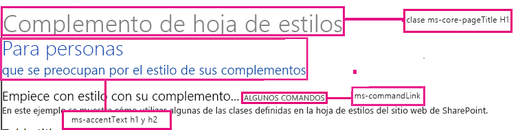

# Usar una hoja de estilos del sitio web de SharePoint en complementos de SharePoint
Aprenda a usar la hoja de estilos de un sitio web de SharePoint en una Complemento de SharePoint.
Puede hacer referencia a la hoja de estilos de un sitio web de SharePoint en Complemento de SharePoint y usarla para dar estilo a las páginas web con la hoja de estilos de SharePoint. Además, si alguien cambia la hoja de estilos o el tema del sitio web de SharePoint, puede adoptar el nuevo conjunto de estilos en el complemento sin modificar la referencia a la hoja de estilos del complemento.


> **IMPORTANTE**
> Si las páginas web usan el control de cromo o la página maestra del complemento, los estilos ya están disponibles para su uso y no tendrá que hacer referencia a la hoja de estilos manualmente con el procedimiento de este artículo. 


## Requisitos previos para usar los ejemplos de este artículo
<a name="SP15Usestylesheetcontrol_Prereq"> </a>

Necesita un entorno de desarrollo, como se explica en  [Empezar a crear complementos hospedados en proveedor para SharePoint](get-started-creating-provider-hosted-sharepoint-add-ins.md).


### Conceptos básicos que debe conocer antes de usar la hoja de estilos de SharePoint en una Complemento de SharePoint

La tabla siguiente muestra artículos útiles que pueden ayudarle a comprender los conceptos implicados en un escenario que usa la hoja de estilos de SharePoint.


**Tabla 1. Conceptos básicos antes de usar la hoja de estilos**


|**Título del artículo**|**Descripción**|
|:-----|:-----|
| [Complementos de SharePoint](sharepoint-add-ins.md) <br/> |Obtenga información sobre el nuevo modelo de complementos de SharePoint que permite crear complementos, que son soluciones pequeñas y fáciles de usar para los usuarios finales.  <br/> |
| [Diseño de la experiencia de usuario para aplicaciones en SharePoint 2013](ux-design-for-sharepoint-add-ins.md) <br/> |Conozca las diferentes opciones y alternativas para la experiencia de usuario (UX) destinadas el desarrollo de Complementos de SharePoint.  <br/> |
| [Hospedar webs, webs de complementos y componentes de SharePoint en SharePoint 2013](host-webs-add-in-webs-and-sharepoint-components-in-sharepoint-2013.md) <br/> |Aprenda cuál es la diferencia entre webs de host y webs de complemento. Descubra qué componentes de SharePoint se pueden incluir en una Complemento de SharePoint, qué componentes se implementan en la web de host, qué componentes se implementan en la web de complemento y cómo se implementa la web de complemento en un dominio aislado.  <br/> |
 

## Ejemplo de código: usar una hoja de estilos de un sitio web de SharePoint en una Complemento de SharePoint
<a name="SP15Usestylesheetcontrol_Example"> </a>

Este ejemplo de código muestra cómo usar la hoja de estilos del sitio web de SharePoint. Esto permite que las páginas de aplicaciones web remotas coincidan con el aspecto de las páginas de la web de host de SharePoint.


Para usar la hoja de estilos en una Complemento de SharePoint, siga estos pasos:


1. Cree la Complemento de SharePoint hospedada por el proveedor.


2. Fuerce el aprovisionamiento de la web de complemento creando una página en blanco.


3. Agregue una página web para el proyecto web y haga referencia a la hoja de estilos.


4. Edite el elemento del manifiesto del complemento.


En la figura 1 se muestra una página web de SharePoint que usa la hoja de estilos.


**Figura 1. Página web de SharePoint que usa la hoja de estilos**





### Crear los proyectos web remotos y del complemento de SharePoint


1. Abra Visual Studio como administrador. (Para ello, haga clic con el botón secundario en el icono de Visual Studio en el menú **Inicio** y elija **Ejecutar como administrador**).


2. Cree la Complemento de SharePoint hospedada por el proveedor, tal y como se explica en  [Empezar a crear complementos hospedados en proveedor para SharePoint](get-started-creating-provider-hosted-sharepoint-add-ins.md), y llámela StylesheetAdd-in.


### Forzar el aprovisionamiento de la web de complemento creando una página en blanco


1. Haga clic con el botón secundario en el proyecto de Complemento de SharePoint y agregue un módulo nuevo.


2. Haga clic con el botón secundario en el módulo nuevo y agregue un elemento nuevo.


3. En **Elementos de Visual C#**, **Web**, elija **Página HTML**. Cambie el nombre de la página a **blank.html**.


4. Elimine el contenido de blank.html.


### Para agregar una página web que haga referencia a la hoja de estilos del proyecto web


1. Haga clic con el botón secundario en el proyecto web y agregue un nuevo formulario web. Cambie el nombre del formulario web a **StyleConsumer.aspx**.


2. Sustituya el contenido del archivo de formulario web .aspx por el código siguiente. Este código realiza las tareas expuestas a continuación:

  - Carga la página blank.html de la web de complemento a un IFrame invisible.


  - Carga el archivo defaultcss.ashx desde la web de complemento.


  - Usa los estilos disponibles.


 ```

<%@ Page Language="C#" AutoEventWireup="true" CodeBehind="StyleConsumer.aspx.cs" Inherits="StylesheetAppWeb.StyleConsumer" %>

<!DOCTYPE html>
<html>
<head>
    <title>Add-in using stylesheet</title>
</head>
<body>

    <!-- The main page title -->
    <h1 class="ms-core-pageTitle">Stylesheet add-in</h1>

    <!-- Some subtitle -->
    <h1 class="ms-accentText">For people</h1>

    <!-- Subtitle comments -->
    <h2 class="ms-accentText">who care about the style in their add-ins</h2>
    <p></p>
    <div>
        <h2 class="ms-webpart-titleText">Get started with style in your add-in... </h2>
        <a class="ms-commandLink" href="#">some command</a>
        <br />
        This sample shows you how to use some of the classes defined in the SharePoint website's style sheet.
    </div>

    <!-- Script to load SharePoint resources
        and load the blank.html page in
        the invisible iframe
        -->
    <script type="text/javascript">
        "use strict";
        var appweburl;

        (function () {
            var ctag;

            // Get the URI decoded add-in web URL.
            appweburl =
                decodeURIComponent(
                    getQueryStringParameter("SPAppWebUrl")
            );
            // Get the ctag from the SPClientTag token.
            ctag =
                decodeURIComponent(
                    getQueryStringParameter("SPClientTag")
            );

            // The resource files are in a URL in the form:
            // web_url/_layouts/15/Resource.ashx
            var scriptbase = appweburl + "/_layouts/15/";

            // Dynamically create the invisible iframe.
            var blankiframe;
            var blankurl;
            var body;
            blankurl = appweburl + "/Pages/blank.html";
            blankiframe = document.createElement("iframe");
            blankiframe.setAttribute("src", blankurl);
            blankiframe.setAttribute("style", "display: none");
            body = document.getElementsByTagName("body");
            body[0].appendChild(blankiframe);

            // Dynamically create the link element.
            var dclink;
            var head;
            dclink = document.createElement("link");
            dclink.setAttribute("rel", "stylesheet");
            dclink.setAttribute("href", scriptbase + "defaultcss.ashx?ctag=" + ctag);
            head = document.getElementsByTagName("head");
            head[0].appendChild(dclink);
        })();

        // Function to retrieve a query string value.
        // For production purposes you may want to use
        //  a library to handle the query string.
        function getQueryStringParameter(paramToRetrieve) {
            var params;
            var strParams;

            params = document.URL.split("?")[1].split("&amp;");
            strParams = "";
            for (var i = 0; i < params.length; i = i + 1) {
                var singleParam = params[i].split("=");
                if (singleParam[0] == paramToRetrieve)
                    return singleParam[1];
            }
        }
    </script>
</body>
</html>

 ```


    En algunos casos, el usuario se tiene que autenticar en SharePoint para que la página pueda descargar el CSS y las imágenes para aplicar los estilos. Las etiquetas de vínculos no autentican automáticamente a un usuario que no haya iniciado sesión. Considere cargar un recurso de página desde la web de complemento de su página web para forzar la autenticación de usuario antes de vincularse con el archivo CSS. En este ejemplo, la página blank.html se ha cargado a un IFrame invisible.


### Editar el elemento StartPage en el manifiesto del complemento


1. En el **Explorador de soluciones**, haga doble clic en el archivo **AppManifest.xml**.


2. En el menú desplegable **Página de inicio**, elija la página web que usa la hoja de estilos.


### Para crear y ejecutar la solución


1. Compruebe que el proyecto de la Complemento de SharePoint esté configurado como proyecto de inicio.


2. Presione la tecla F5.

    > **NOTA**
      > Cuando presiona F5, Visual Studio compila la solución, implementa el complemento y abre la página de permisos para el complemento. 
3. Elija el botón **Confiar**.


4. Haga clic en el icono del complemento **StylesheetBasic**.


5. La figura 2 muestra la página web resultante con los estilos de SharePoint.

   **Figura 2. Hoja de estilos usada en la página**


!\[Control de hoja de estilo utilizada en una página web](images/StylesheetControl_result2.png)


6. También puede ir a la web de host y cambiar el tema. Luego volver a cargar la página web de complemento para usar los nuevos estilos.


**Tabla 2. Resolución de problemas de la solución**


|**Problema**|**Solución**|
|:-----|:-----|
|Visual Studio no abre el explorador después de presionar la tecla F5.  <br/> |Configure el proyecto de la Complemento de SharePoint como proyecto de inicio.  <br/> |
|Error de certificado.  <br/> |Establezca en falso la propiedad **Se ha habilitado SSL** de su proyecto web. En el proyecto Complemento de SharePoint, establezca la propiedad **Proyecto web** enNinguno y luego devuelva a la propiedad el nombre de su proyecto web. <br/> |
 

## Pasos siguientes
<a name="SP15Usestylesheetcontrol_Nextsteps"> </a>

Este artículo muestra cómo usar la hoja de estilos en una Complemento de SharePoint. Como el siguiente paso, puede obtener información sobre otros componentes de UX disponibles para Complementos de SharePoint. Para más información, consulte lo siguiente:


-  [Ejemplo de código: usar la hoja de estilos de SharePoint en un complemento](http://code.msdn.microsoft.com/SharePoint-2013-Use-the-7a8684e2)


-  [Usar el control cromo de cliente en complementos de SharePoint](use-the-client-chrome-control-in-sharepoint-add-ins.md)


-  [Crear acciones personalizadas para implementarlas con complementos de SharePoint](create-custom-actions-to-deploy-with-sharepoint-add-ins.md)


-  [Crear elementos del complemento para instalar con el complemento para SharePoint](create-add-in-parts-to-install-with-your-sharepoint-add-in.md)


## Recursos adicionales
<a name="SP15Usestylesheetcontrol_Addresources"> </a>


-  [Diseño de la experiencia de usuario para aplicaciones en SharePoint 2013](ux-design-for-sharepoint-add-ins.md)


-  [Directrices de diseño de los complementos para la experiencia de usuario de SharePoint](sharepoint-add-ins-ux-design-guidelines.md)


-  [Crear componentes de experiencia de usuario en SharePoint 2013](create-ux-components-in-sharepoint-2013.md)


-  [Tres formas de concebir las opciones de diseño de complementos para SharePoint](three-ways-to-think-about-design-options-for-sharepoint-add-ins.md)


-  [Aspectos importantes del panorama de desarrollo y arquitectura de los complementos para SharePoint](important-aspects-of-the-sharepoint-add-in-architecture-and-development-landscap.md)


